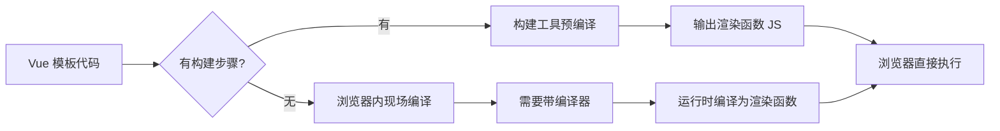
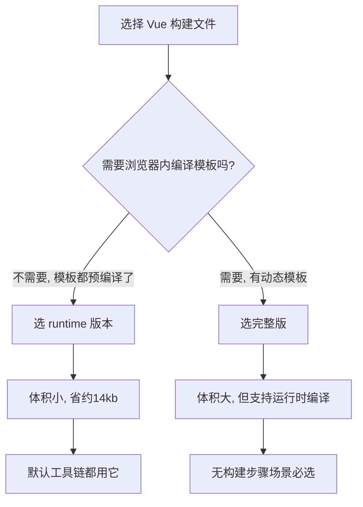
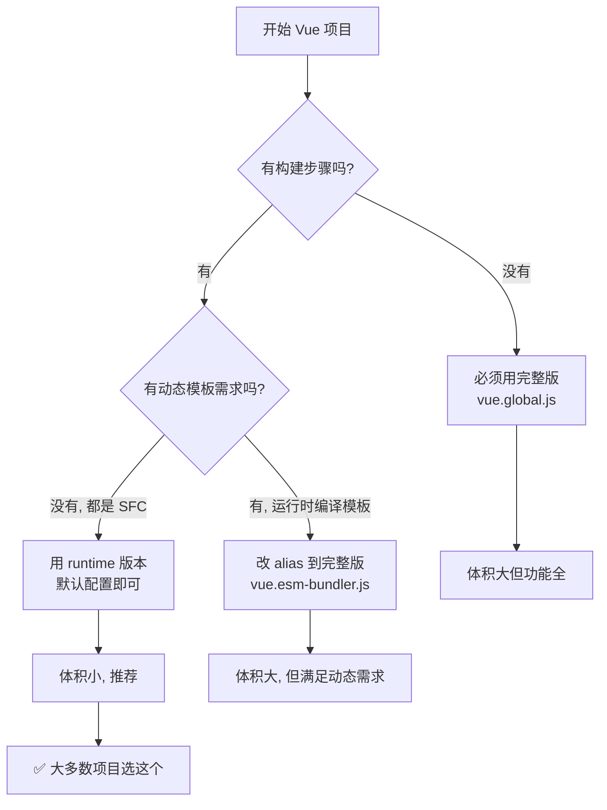

扫描[二维码](https://api2.cmdragon.cn/upload/cmder/20250304_012821924.jpg)关注或者微信搜一搜：`编程智域 前端至全栈交流与成长`

[发现1000+提升效率与开发的AI工具和实用程序](https://tools.cmdragon.cn/zh/apps?category=ai_chat)：https://tools.cmdragon.cn/zh/apps?category=ai_chat

## 一、无构建步骤时，模板咋编译？

咱先聊聊一个挺基础但容易把人绕晕的事儿：Vue 的模板到底是在哪儿被编译成渲染函数的？

Vue 的模板（就是那种带 `{{ }}`、`v-if`、`v-for` 的 HTML 写法）浏览器是看不懂的，它得先被编译成 JavaScript 的渲染函数（render function），然后才能真正跑起来。这个编译过程有两种发生的地方：一种是在你开发的时候由构建工具提前编译好，另一种是在浏览器里运行时现场编译。

当你以**无构建步骤**的方式使用 Vue（比如直接用 `<script src>` 引一个 vue.global.js 进来，或者用 CDN 的方式），组件的模板要么写在页面的 HTML 里（像 `<div id="app">{{ message }}</div>` 这种），要么是写成内联的 JavaScript 字符串（比如 `template: '<div>{{ message }}</div>'`）。这俩场景下，模板都是"现编现用"的，Vue 必须把模板编译器一起带到浏览器里跑，才能在运行时把模板编译成渲染函数。

打个比方，无构建步骤就像"现场做饭"——你得自己带厨具（编译器）、自己切菜炒菜（编译模板），最后才能吃上饭（渲染页面）。厨具虽然占地方，但没它你做不了饭。

而用了构建步骤（Vite、webpack 之类）的话，模板在你 `npm run build` 或者 dev server 跑起来的时候就已经被预编译成渲染函数了，打包出来的产物里压根没有模板字符串，全是已经编译好的 JavaScript 代码。这就好比"吃预制菜"——工厂（构建工具）已经把菜加工好了，你只要热一下就能吃，不用自己带厨具，自然也省了那部分体积。



这里有个关键点得记住：**编译器这玩意儿体积不小**，大概 14kb 左右（gzip 后）。如果你用构建步骤，这部分体积就能省下来；如果不用，那就得老老实实带上它。

## 二、Vue的多种构建文件版本

为了适配上面说的两种场景，Vue 官方提供了好几种不同格式的"构建文件"，你 `npm install vue` 之后在 `node_modules/vue/dist/` 里能看到一堆文件，每个文件都对应一种使用场景。咱重点看两类：

### 2.1 runtime 版本（只含运行时）

文件名前缀是 `vue.runtime.*` 的，比如 `vue.runtime.esm-bundler.js`、`vue.runtime.global.js`，这些是**只包含运行时的版本**，不含编译器。

用这个版本的时候，所有模板都必须由构建步骤预先编译好。如果你拿这个版本去跑一段没编译过的模板字符串，Vue 会直接报错，告诉你"咦，我没编译器啊，这模板我处理不了"。

### 2.2 完整版（含编译器）

文件名里**不含 `.runtime`** 的，比如 `vue.esm-bundler.js`、`vue.global.js`，这些是**完整版**，里面带着模板编译器，支持在浏览器里直接编译模板。

代价嘛，就是体积比 runtime 版本大了大约 14kb（gzip 后）。这 14kb 就是编译器的体重。

### 2.3 两个版本对比

| 对比项 | runtime 版本 | 完整版 |
| --- | --- | --- |
| 是否含编译器 | 否 | 是 |
| 体积（gzip） | 较小 | 多约 14kb |
| 模板要求 | 必须预编译 | 支持运行时编译 |
| 适用场景 | 有构建步骤的项目 | 无构建步骤 / 需动态模板 |
| 默认工具链 | ✅ 默认使用 | ❌ 不默认 |
| 报错模板字符串 | 直接报错 | 正常工作 |

再打个比方，runtime 版本就像"精简版软件"——功能少（不能编译模板）但体积小、跑得快；完整版就像"全家桶"——功能全（啥都能干）但体积大、占地方。选哪个得看你到底需不需要那个编译器。



## 三、默认工具链用哪个版本？

答案是：**默认工具链都用 runtime 版本**。

不管是 Vite 还是 Vue CLI（基于 webpack），创建出来的项目默认 alias 都指向 `vue.runtime.esm-bundler.js`。原因很简单——所有 `.vue` 单文件组件（SFC）里的模板，在构建的时候都已经被 `@vue/compiler-sfc` 预编译成渲染函数了，打包产物里压根没有模板字符串，浏览器自然不需要再编译一遍，带上编译器纯属浪费体积。

你看 Vite 创建的 Vue 项目，`vite.config.js` 里其实啥都不用配，它内部默认就这么处理的：

```javascript
// vite.config.js
import { defineConfig } from 'vite'
import vue from '@vitejs/plugin-vue'

// Vite 默认把 'vue' 解析到 vue.runtime.esm-bundler.js
// 这里不需要手动配置 alias, 插件已经帮你处理好了
export default defineConfig({
  plugins: [
    // @vitejs/plugin-vue 会在构建时把 .vue 文件里的 <template>
    // 编译成 render 函数, 所以浏览器端不需要编译器
    vue()
  ]
})
```

然后你的 `.vue` 文件长这样：

```vue
<!-- App.vue -->
<script setup>
// 这里用的是 <script setup> 语法, Composition API
// 引入 ref 创建响应式数据
import { ref } from 'vue'

// 创建一个响应式变量 message, 初始值是 'Hello Vue'
const message = ref('Hello Vue')

// 点击按钮时修改 message
const changeMessage = () => {
  message.value = '模板已经被预编译啦, 浏览器不用再编译'
}
</script>

<!-- 这里的 <template> 在构建时会被编译成 render 函数 -->
<!-- 打包后这段模板就不存在了, 变成了 JavaScript 代码 -->
<template>
  <div>
    <p>{{ message }}</p>
    <button @click="changeMessage">点我改文字</button>
  </div>
</template>
```

构建之后，`<template>` 里的内容会被编译成类似 `function render(_ctx, _cache) { ... }` 这样的渲染函数，模板字符串本身不会出现在最终产物里。所以 runtime 版本完全够用，没必要为了一个用不上的编译器多背 14kb。

## 四、有构建步骤还想用浏览器内编译？

有些特殊情况，你明明用了构建步骤，但还是需要在浏览器里现场编译模板。比如：

- 模板是从后端接口动态拿回来的字符串
- 模板是用户运行时拼接出来的
- 模板写在 Markdown 里，运行时才解析
- 做一个低代码平台，用户能自己写模板

这种时候你就得把构建工具的 alias 从默认的 runtime 版本改成完整版，也就是 `vue/dist/vue.esm-bundler.js`。

### 4.1 Vite 配置

```javascript
// vite.config.js
import { defineConfig } from 'vite'
import vue from '@vitejs/plugin-vue'
import { fileURLToPath, URL } from 'node:url'

export default defineConfig({
  plugins: [vue()],
  resolve: {
    alias: {
      // 把 'vue' 这个导入指向完整版（含编译器）
      // 这样运行时就能在浏览器里编译模板字符串了
      // 代价是体积增加约 14kb
      vue: 'vue/dist/vue.esm-bundler.js'
    }
  }
})
```

### 4.2 webpack 配置

```javascript
// vue.config.js 或 webpack.config.js
const { defineConfig } = require('@vue/cli-service')

module.exports = defineConfig({
  configureWebpack: {
    resolve: {
      alias: {
        // webpack 里也是一样的思路, 把 vue 指向完整版
        vue$: 'vue/dist/vue.esm-bundler.js'
      }
    }
  }
})
```

### 4.3 用完整版跑动态模板

配置好之后，你就能这么用了：

```vue
<!-- DynamicTemplate.vue -->
<script setup>
import { ref, shallowRef, defineAsyncComponent } from 'vue'

// 从后端拿回来的模板字符串（模拟）
// 实际场景可能是接口返回、用户输入、Markdown 解析等
const dynamicTemplate = ref(`
  <div class="dynamic-box">
    <h3>{{ title }}</h3>
    <p>{{ content }}</p>
    <button @click="handleClick">点我</button>
  </div>
`)

// 模板里要用的数据
const title = ref('我是动态标题')
const content = ref('这段模板是运行时编译的, 不是构建时编译的')

// 模板里要用的方法
const handleClick = () => {
  alert('动态模板里的事件触发了!')
}

// 用 defineComponent + template 选项来渲染动态模板
// 注意: 这一步必须有编译器才能工作, 否则报错
import { defineComponent } from 'vue'

const DynamicComponent = shallowRef(
  defineComponent({
    template: dynamicTemplate.value,
    setup() {
      return { title, content, handleClick }
    }
  })
)
</script>

<template>
  <div>
    <h2>下面是动态编译出来的组件</h2>
    <component :is="DynamicComponent" />
  </div>
</template>
```

### 4.4 版本选择决策流程



记住一个原则：**能不用完整版就别用**。14kb 看着不多，但积少成多，而且编译器在浏览器里跑还有性能开销（每次编译都要花时间）。只有真的需要运行时编译模板的时候，才去切完整版。

## 五、不想用构建步骤？看看petite-vue

如果你只是想给一个静态 HTML 页面加点简单交互，又不想搭一整套构建工具，那除了用完整版的 vue.global.js，还有个更轻的选择——**petite-vue**。

petite-vue 是 Vue 官方出的一个**6kB 左右的 Vue 子集**，专门为渐进式增强场景设计。啥叫渐进式增强？就是你有一个已经写好的静态 HTML 页面（比如后端渲染出来的、或者老项目改的），你想给它加点 Vue 风格的交互（`{{ }}`、`v-on`、`v-model` 这些），但又不想把整个页面重构成 SPA。

### 5.1 petite-vue 的特点

- 体积小：只有 6kB 左右（gzip），比完整版小多了
- 无构建步骤：直接 `<script>` 引入就能用
- 语法兼容：用 Vue 模板语法，学习成本几乎为零
- 基于 `@vue/reactivity`：响应式系统和 Vue 3 同源
- 不支持 SFC、不支持 `<script setup>`、不支持组件 props 的高级特性

### 5.2 基本用法

```html
<!DOCTYPE html>
<html lang="zh-CN">
<head>
  <meta charset="UTF-8">
  <title>petite-vue 示例</title>
  <!-- 直接通过 CDN 引入 petite-vue, 不需要构建步骤 -->
  <script src="https://unpkg.com/petite-vue@0.4.1" defer init></script>
</head>
<body>
  <!-- 这里的 v-scope 标记一个 Vue 作用域 -->
  <!-- petite-vue 会扫描带 v-scope 的元素并激活 -->
  <div v-scope="{ count: 0, message: '点我计数' }">
    <h2>{{ message }}</h2>
    <p>当前计数: {{ count }}</p>
    <!-- @click 直接绑定方法, 操作 v-scope 里的数据 -->
    <button @click="count++">加一</button>
    <button @click="count = 0">重置</button>
  </div>

  <!-- 也可以挂载全局方法, 所有 v-scope 都能用 -->
  <script>
    // PetiteVue 挂载后, 全局可用的方法
    // 通过 PetateVue.directive 等 API 扩展
  </script>
</body>
</html>
```

### 5.3 用 JS 文件组织逻辑

稍微复杂点的场景，可以把逻辑拆到单独的 JS 文件里：

```javascript
// counter.js
// 导出一个工厂函数, 返回组件的状态和方法
export function Counter() {
  return {
    // 响应式数据
    count: 0,
    message: '我是计数器',
    // 计算属性风格的 getter
    get double() {
      return this.count * 2
    },
    // 方法
    increment() {
      this.count++
    },
    reset() {
      this.count = 0
    }
  }
}
```

```html
<!DOCTYPE html>
<html lang="zh-CN">
<head>
  <meta charset="UTF-8">
  <title>petite-vue 模块化</title>
</head>
<body>
  <div v-scope="Counter()">
    <h3>{{ message }}</h3>
    <p>count: {{ count }}, double: {{ double }}</p>
    <button @click="increment">加一</button>
    <button @click="reset">重置</button>
  </div>

  <!-- 用 type=module 引入, 支持 ES Module -->
  <script type="module">
    import { createApp } from 'https://unpkg.com/petite-vue@0.4.1/esm/petite-vue.es.js'
    import { Counter } from './counter.js'

    // 创建应用, 挂载到页面
    // 全局注册 Counter, 让 v-scope 能直接用
    createApp({
      // 这里可以放全局共享的数据和方法
      Counter
    }).mount()
  </script>
</body>
</html>
```

petite-vue 就像一把"瑞士军刀"——小巧玲珑，平时揣兜里不占地儿，遇到简单活儿（给静态页加点交互）掏出来就能用，比完整版轻便多了。但如果你要造一栋大楼（复杂 SPA），那还是老老实实用完整版 Vue + 构建工具吧，瑞士军刀干不了那活儿。

## 课后 Quiz

### 问题 1：为啥默认工具链都用 runtime 版本而不是完整版？

**答案解析**：默认工具链（Vite、Vue CLI）在构建时会用 `@vue/compiler-sfc` 把所有 `.vue` 单文件组件里的 `<template>` 预编译成渲染函数，打包产物里已经没有模板字符串了，全是 JavaScript 代码。浏览器拿到的是已经编译好的渲染函数，不需要再现场编译，所以带上编译器纯属浪费体积。runtime 版本比完整版小约 14kb（gzip），用不上编译器自然选小的。这就好比你已经吃完饭了，就不用再带厨具出门。

### 问题 2：什么场景下必须用完整版（含编译器）？

**答案解析**：以下场景必须用完整版：

1. **无构建步骤**：直接用 `<script src>` 引入 Vue，模板写在 HTML 里或写成内联字符串，浏览器必须现场编译。
2. **动态模板**：模板是运行时从接口拿回来的字符串，构建时根本不知道模板长啥样。
3. **运行时拼接模板**：根据用户操作动态拼出模板字符串再渲染。
4. **低代码平台**：用户自己写模板，平台运行时编译。

判断标准就一条：**模板字符串会不会出现在浏览器里**。会，就得用完整版；不会（都被预编译了），用 runtime 版本就够。

### 问题 3：petite-vue 和完整版 Vue 啥区别？啥时候用 petite-vue？

**答案解析**：

| 对比项 | petite-vue | 完整版 Vue |
| --- | --- | --- |
| 体积 | 约 6kB | 约 34kB+ |
| 构建步骤 | 不需要 | 可选 |
| SFC 支持 | ❌ | ✅ |
| 组件系统 | 简化版 | 完整 |
| 适用场景 | 渐进式增强静态页 | SPA、复杂应用 |

用 petite-vue 的场景：你有一个静态 HTML 页面（后端渲染的、老项目、简单的展示页），想加点 Vue 风格的交互，但又不想搭构建工具、不想把页面重构成 SPA。这时候 petite-vue 最合适，6kB 解决问题。

用完整版 Vue 的场景：要做复杂应用、需要 SFC、需要完整的组件系统、需要路由和状态管理。这时候 petite-vue 就不够用了，得上完整版 + 构建工具。

## 常见报错解决方案

### 报错 1：Component provided template option but runtime compilation is not supported

**报错信息**：
```
[Vue warn]: Component provided template option but runtime compilation is not supported in this build of Vue. Configure your bundler to alias "vue" to "vue/dist/vue.esm-bundler.js".
```

**产生原因**：你用了 runtime 版本（默认），但代码里却传了 `template` 选项（模板字符串），runtime 版本没有编译器，处理不了模板字符串，所以报错。

**解决方案**：

1. **方案一（推荐）**：把模板挪到 `.vue` 文件的 `<template>` 标签里，让构建工具预编译，不要用 `template` 选项。
2. **方案二**：如果确实需要运行时编译，按本文第四节配置 alias，把 `vue` 指向 `vue/dist/vue.esm-bundler.js`。

```javascript
// vite.config.js
export default {
  resolve: {
    alias: {
      vue: 'vue/dist/vue.esm-bundler.js'
    }
  }
}
```

**预防建议**：默认情况下别用 `template` 选项，统一用 SFC 的 `<template>` 标签，让构建工具帮你编译。

### 报错 2：Failed to resolve component: xxx

**报错信息**：
```
[Vue warn]: Failed to resolve component: MyComponent
If this is a native custom element, make sure to exclude it from component resolution via compilerOptions.isCustomElement.
```

**产生原因**：模板里用了一个组件 `<MyComponent />`，但没注册。在 runtime 版本里，模板是预编译的，编译时找不到组件就会留个引用，运行时如果还没注册就报这个错。

**解决方案**：

1. 确认组件已经 `import` 进来并在 `components` 里注册（或用了 `<script setup>` 自动注册）。
2. 检查组件名拼写，大小写要对（PascalCase 或 kebab-case）。
3. 如果是全局组件，确认 `app.component('MyComponent', ...)` 在 `mount` 之前调用。

```vue
<script setup>
// <script setup> 里 import 的组件自动可用, 不用手动注册
import MyComponent from './MyComponent.vue'
</script>

<template>
  <MyComponent />
</template>
```

**预防建议**：统一用 `<script setup>` 语法，组件 import 进来就能用，少踩注册的坑。

### 报错 3：petite-vue 的 v-scope 不生效，页面还是原始 HTML

**报错现象**：引入了 petite-vue，写了 `v-scope`，但页面上的 `{{ }}` 没被替换，还是显示原始字符串。

**产生原因**：

1. `petite-vue` 脚本没加载完就执行了页面渲染（没加 `defer` 或加载顺序不对）。
2. 没调用 `createApp().mount()` 或没加 `init` 属性。
3. `v-scope` 写错了，或者作用域对象没返回正确的数据。

**解决方案**：

1. 给 `<script>` 标签加 `defer init` 属性，让 petite-vue 自动初始化：
```html
<script src="https://unpkg.com/petite-vue@0.4.1" defer init></script>
```
2. 或者手动初始化：
```html
<script type="module">
  import { createApp } from 'https://unpkg.com/petite-vue@0.4.1/esm/petite-vue.es.js'
  createApp().mount()
</script>
```
3. 检查 `v-scope` 的写法，确保返回的是对象：
```html
<!-- ✅ 正确 -->
<div v-scope="{ count: 0 }">{{ count }}</div>

<!-- ❌ 错误, 没返回对象 -->
<div v-scope="count">{{ count }}</div>
```

**预防建议**：用 `defer init` 最省心，让 petite-vue 自己处理加载时机；手动初始化的话确保脚本在 DOM 准备好之后执行。

## 参考链接

- https://vuejs.org/guide/scaling-up/tooling.html
- https://vuejs.org/guide/quick-start.html
- https://github.com/vuejs/petite-vue

余下文章内容请点击跳转至 个人博客页面 或者 扫描[二维码](https://api2.cmdragon.cn/upload/cmder/20250304_012821924.jpg)关注或者微信搜一搜：`编程智域 前端至全栈交流与成长`，阅读完整的文章：[Vue的runtime版本和完整版有啥区别？浏览器内模板编译那点事](https://blog.cmdragon.cn/posts/r4s5t6u7v8w9x0y1z2a3b4c5d6e7f8a9b0/)

<details>
<summary>往期文章归档</summary>

- [Vue 3 静态与动态 Props 如何传递？TypeScript 类型约束有何必要？](https://blog.cmdragon.cn/posts/94ab48753b64780ca3ab7a7115ae8522/)
- [Vue 3中组件局部注册的优势与实现方式如何？](https://blog.cmdragon.cn/posts/dbf576e744870f6de26fd8a2e03e47da/)
- [如何在Vue3中优化生命周期钩子性能并规避常见陷阱？](https://blog.cmdragon.cn/posts/12d98b3b9ccd6c19a1b169d720ac5c80/)
- [Vue 3 Composition API生命周期钩子：如何实现从基础理解到高阶复用？](https://blog.cmdragon.cn/posts/8884e2b70287fcb263c57648eeb27419/)
- [Vue 3生命周期钩子实战指南：如何正确选择onMounted、onUpdated与onUnmounted的应用场景？](https://blog.cmdragon.cn/posts/883c6dbc50ae4183770a4462e0b8ae4d/)
- [Vue 3中生命周期钩子与响应式系统如何实现协同工作？](https://blog.cmdragon.cn/posts/70dad360ffa9dce14d0d69611b8cb019/)
- [Vue 3组件生命周期钩子的执行顺序与使用场景是什么？](https://blog.cmdragon.cn/posts/db44294a78dc9f666f67b053f6c83567/)
- [Vue组件全局注册与局部注册如何抉择？](https://blog.cmdragon.cn/posts/43ead630ea17da65d99ad2eb8188e472/)
- [Vue3组件化开发中，Props与Emits如何实现数据流转与事件协作？](https://blog.cmdragon.cn/posts/8cff7d2df113da66ea7be560c4d1d22a/)
- [Vue 3模板引用如何与其他特性协同实现复杂交互？](https://blog.cmdragon.cn/posts/331bf75d114ab09116eadfcdca602b58/)
- [Vue 3 v-for中模板引用如何实现高效管理与动态控制？](https://blog.cmdragon.cn/posts/cb380897ddc3578b180ecf8843c774c1/)
- [Vue 3的defineExpose：如何突破script setup组件默认封装，实现精准的父子通讯？](https://blog.cmdragon.cn/posts/202ae0f4acde7128e0e31baf63732fb5/)
- [Vue 3模板引用的生命周期时机如何把握？常见陷阱该如何避免？](https://blog.cmdragon.cn/posts/7d2a0f6555ecbe92afd7d2491c427463/)
- [Vue 3模板引用如何实现父组件与子组件的高效交互？](https://blog.cmdragon.cn/posts/3fb7bdd84128b7efaaa1c979e1f28dee/)
- [Vue中为何需要模板引用？又如何高效实现DOM与组件实例的直接访问？](https://blog.cmdragon.cn/posts/23f3464ba16c7054b4783cded50c04c6/)

</details>

<details>
<summary>免费好用的热门在线工具</summary>

- [多直播聚合器 - 应用商店 | By cmdragon](https://tools.cmdragon.cn/zh/apps/multi-live-aggregator)
- [Proto文件生成器 - 应用商店 | By cmdragon](https://tools.cmdragon.cn/zh/apps/proto-file-generator)
- [图片转粒子 - 应用商店 | By cmdragon](https://tools.cmdragon.cn/zh/apps/image-to-particles)
- [视频下载器 - 应用商店 | By cmdragon](https://tools.cmdragon.cn/zh/apps/video-downloader)
- [文件格式转换器 - 应用商店 | By cmdragon](https://tools.cmdragon.cn/zh/apps/file-converter)
- [M3U8在线播放器 - 应用商店 | By cmdragon](https://tools.cmdragon.cn/zh/apps/m3u8-player)
- [快图设计 - 应用商店 | By cmdragon](https://tools.cmdragon.cn/zh/apps/quick-image-design)
- [高级文字转图片转换器 - 应用商店 | By cmdragon](https://tools.cmdragon.cn/zh/apps/text-to-image-advanced)
- [RAID 计算器 - 应用商店 | By cmdragon](https://tools.cmdragon.cn/zh/apps/raid-calculator)
- [在线PS - 应用商店 | By cmdragon](https://tools.cmdragon.cn/zh/apps/photoshop-online)
- [Mermaid 在线编辑器 - 应用商店 | By cmdragon](https://tools.cmdragon.cn/zh/apps/mermaid-live-editor)
- [数学求解计算器 - 应用商店 | By cmdragon](https://tools.cmdragon.cn/zh/apps/math-solver-calculator)
- [智能提词器 - 应用商店 | By cmdragon](https://tools.cmdragon.cn/zh/apps/smart-teleprompter)
- [魔法简历 - 应用商店 | By cmdragon](https://tools.cmdragon.cn/zh/apps/magic-resume)
- [Image Puzzle Tool - 图片拼图工具 | By cmdragon](https://tools.cmdragon.cn/zh/apps/image-puzzle-tool)
- [字幕下载工具 - 应用商店 | By cmdragon](https://tools.cmdragon.cn/zh/apps/subtitle-downloader)
- [歌词生成工具 - 应用商店 | By cmdragon](https://tools.cmdragon.cn/zh/apps/lyrics-generator)
- [网盘资源聚合搜索 - 应用商店 | By cmdragon](https://tools.cmdragon.cn/zh/apps/cloud-drive-search)
- [ASCII字符画生成器 - 应用商店 | By cmdragon](https://tools.cmdragon.cn/zh/apps/ascii-art-generator)
- [JSON Web Tokens 工具 - 应用商店 | By cmdragon](https://tools.cmdragon.cn/zh/apps/jwt-tool)
- [Bcrypt 密码工具 - 应用商店 | By cmdragon](https://tools.cmdragon.cn/zh/apps/bcrypt-tool)
- [GIF 合成器 - 应用商店 | By cmdragon](https://tools.cmdragon.cn/zh/apps/gif-composer)
- [GIF 分解器 - 应用商店 | By cmdragon](https://tools.cmdragon.cn/zh/apps/gif-decomposer)
- [文本隐写术 - 应用商店 | By cmdragon](https://tools.cmdragon.cn/zh/apps/text-steganography)
- [CMDragon 在线工具 - 高级AI工具箱与开发者套件 | 免费好用的在线工具](https://tools.cmdragon.cn/zh)
- [应用商店 - 发现1000+提升效率与开发的AI工具和实用程序 | 免费好用的在线工具](https://tools.cmdragon.cn/zh/apps?category=trending)
- [CMDragon 更新日志 - 最新更新、功能与改进 | 免费好用的在线工具](https://tools.cmdragon.cn/zh/changelog)
- [支持我们 - 成为赞助者 | 免费好用的在线工具](https://tools.cmdragon.cn/zh/sponsor)
- [AI文本生成图像 - 应用商店 | 免费好用的在线工具](https://tools.cmdragon.cn/zh/apps/text-to-image-ai)
- [临时邮箱 - 应用商店 | 免费好用的在线工具](https://tools.cmdragon.cn/zh/apps/temp-email)
- [二维码解析器 - 应用商店 | 免费好用的在线工具](https://tools.cmdragon.cn/zh/apps/qrcode-parser)
- [文本转思维导图 - 应用商店 | 免费好用的在线工具](https://tools.cmdragon.cn/zh/apps/text-to-mindmap)
- [正则表达式可视化工具 - 应用商店 | 免费好用的在线工具](https://tools.cmdragon.cn/zh/apps/regex-visualizer)
- [文件隐写工具 - 应用商店 | 免费好用的在线工具](https://tools.cmdragon.cn/zh/apps/steganography-tool)
- [IPTV 频道探索器 - 应用商店 | 免费好用的在线工具](https://tools.cmdragon.cn/zh/apps/iptv-explorer)
- [快传 - 应用商店 | By cmdragon](https://tools.cmdragon.cn/zh/apps/snapdrop)
- [随机抽奖工具 - 应用商店 | 免费好用的在线工具](https://tools.cmdragon.cn/zh/apps/lucky-draw)
- [动漫场景查找器 - 应用商店 | 免费好用的在线工具](https://tools.cmdragon.cn/zh/apps/anime-scene-finder)
- [时间工具箱 - 应用商店 | 免费好用的在线工具](https://tools.cmdragon.cn/zh/apps/time-toolkit)
- [网速测试 - 应用商店 | 免费好用的在线工具](https://tools.cmdragon.cn/zh/apps/speed-test)
- [AI 智能抠图工具 - 应用商店 | 免费好用的在线工具](https://tools.cmdragon.cn/zh/apps/background-remover)
- [背景替换工具 - 应用商店 | 免费好用的在线工具](https://tools.cmdragon.cn/zh/apps/background-replacer)
- [艺术二维码生成器 - 应用商店 | 免费好用的在线工具](https://tools.cmdragon.cn/zh/apps/artistic-qrcode)
- [Open Graph 元标签生成器 - 应用商店 | 免费好用的在线工具](https://tools.cmdragon.cn/zh/apps/open-graph-generator)
- [图像对比工具 - 应用商店 | 免费好用的在线工具](https://tools.cmdragon.cn/zh/apps/image-comparison)
- [图片压缩专业版 - 应用商店 | 免费好用的在线工具](https://tools.cmdragon.cn/zh/apps/image-compressor)
- [密码生成器 - 应用商店 | 免费好用的在线工具](https://tools.cmdragon.cn/zh/apps/password-generator)
- [SVG优化器 - 应用商店 | 免费好用的在线工具](https://tools.cmdragon.cn/zh/apps/svg-optimizer)
- [调色板生成器 - 应用商店 | 免费好用的在线工具](https://tools.cmdragon.cn/zh/apps/color-palette)
- [在线节拍器 - 应用商店 | 免费好用的在线工具](https://tools.cmdragon.cn/zh/apps/online-metronome)
- [IP归属地查询 - 应用商店 | By cmdragon](https://tools.cmdragon.cn/zh/apps/ip-geolocation)
- [CSS网格布局生成器 - 应用商店 | 免费好用的在线工具](https://tools.cmdragon.cn/zh/apps/css-grid-layout)
- [邮箱验证工具 - 应用商店 | 免费好用的在线工具](https://tools.cmdragon.cn/zh/apps/email-validator)
- [书法练习字帖 - 应用商店 | 免费好用的在线工具](https://tools.cmdragon.cn/zh/apps/calligraphy-practice)
- [金融计算器套件 - 应用商店 | 免费好用的在线工具](https://tools.cmdragon.cn/zh/apps/finance-calculator-suite)
- [中国亲戚关系计算器 - 应用商店 | 免费好用的在线工具](https://tools.cmdragon.cn/zh/apps/chinese-kinship-calculator)
- [Protocol Buffer 工具箱 - 应用商店 | 免费好用的在线工具](https://tools.cmdragon.cn/zh/apps/protobuf-toolkit)
- [IP归属地查询 - 应用商店 | 免费好用的在线工具](https://tools.cmdragon.cn/zh/apps/ip-geolocation)
- [图片无损放大 - 应用商店 | 免费好用的在线工具](https://tools.cmdragon.cn/zh/apps/image-upscaler)
- [文本比较工具 - 应用商店 | 免费好用的在线工具](https://tools.cmdragon.cn/zh/apps/text-compare)
- [IP批量查询工具 - 应用商店 | 免费好用的在线工具](https://tools.cmdragon.cn/zh/apps/ip-batch-lookup)
- [域名查询工具 - 应用商店 | 免费好用的在线工具](https://tools.cmdragon.cn/zh/apps/domain-finder)
- [DNS工具箱 - 应用商店 | 免费好用的在线工具](https://tools.cmdragon.cn/zh/apps/dns-toolkit)
- [网站图标生成器 - 应用商店 | 免费好用的在线工具](https://tools.cmdragon.cn/zh/apps/favicon-generator)
- [XML Sitemap](https://tools.cmdragon.cn/sitemap_index.xml)

</details>
