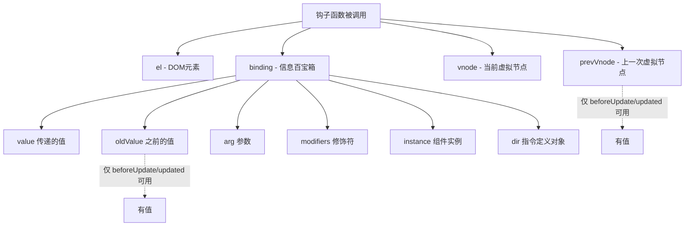
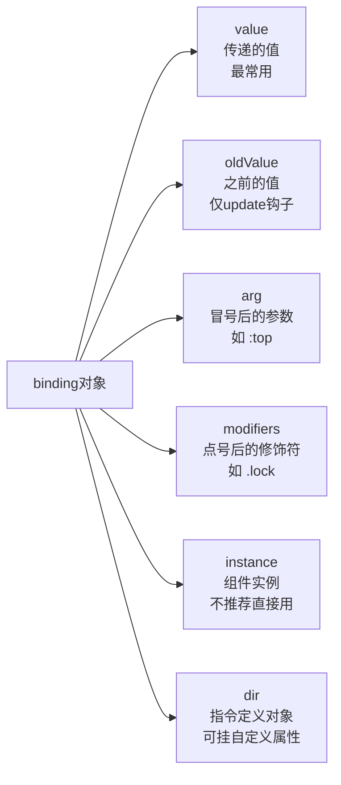
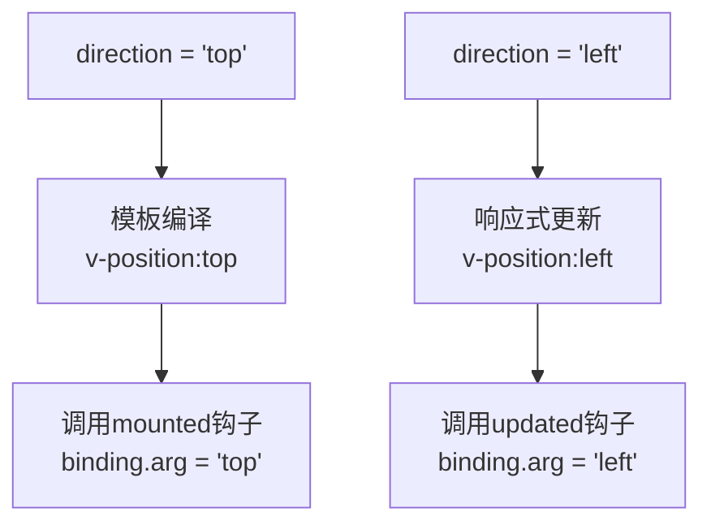
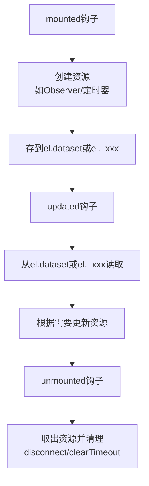

扫描[二维码](https://api2.cmdragon.cn/upload/cmder/20250304_012821924.jpg)关注或者微信搜一搜：`编程智域 前端至全栈交流与成长`

[发现1000+提升效率与开发的AI工具和实用程序](https://tools.cmdragon.cn/zh/apps?category=ai_chat)：https://tools.cmdragon.cn/

## 一、钩子函数的四个参数，都是干啥的？

上一篇文章我们聊了自定义指令的几个钩子函数，知道它们分别在什么时机被调用。但钩子函数到底接收哪些参数？每个参数又能干啥？这事儿不搞清楚，写指令的时候就跟蒙着眼走路一样。

先看一个完整的钩子函数签名：

```javascript
const myDirective = {
  mounted(el, binding, vnode) {
    // el、binding、vnode 都是啥？
  },
  updated(el, binding, vnode, prevVnode) {
    // 多了一个 prevVnode
  },
};
```

没错，钩子函数最多接收 **4个参数**：`el`、`binding`、`vnode`、`prevVnode`。一个一个来说。

### el：DOM元素本人

`el` 就是指令绑定的那个DOM元素，实打实的HTMLElement对象。你想操作DOM，全靠它。给它设样式、加class、绑定事件、改属性，都是直接在el上操作。

```javascript
const vFocus = {
  mounted(el) {
    el.focus();
  },
};
```

这个例子里`el`就是那个`<input>`元素，调`focus()`让它自动获得焦点。简单粗暴，没啥弯弯绕。

### binding：百宝箱对象

`binding`是一个包含了指令各种信息的对象，你传给指令的值、参数、修饰符全在里面。它就像一个快递包裹，外面贴着各种标签，告诉你这个指令"带了啥东西来"。

binding里面具体有啥，后面第二节会逐个拆，这里先知道它是"信息大杂烩"就行。

### vnode：虚拟节点

`vnode`是Vue编译生成的虚拟节点（VNode）。它代表了el对应的那个虚拟DOM节点。平时写指令基本用不太上它，但如果你需要访问一些编译时才能确定的信息，比如节点的type、props之类的，可以从这里拿。

### prevVnode：上一次的虚拟节点

`prevVnode`只在`beforeUpdate`和`updated`钩子中可用，代表上一次渲染时指令绑定的那个虚拟节点。可以用来对比新旧虚拟节点的差异，不过说实话，大部分场景下你也用不太着它。

> 口语化总结一下：el就是DOM元素本人，直接操作它；binding是个百宝箱，指令的所有信息都在里面；vnode和prevVnode是虚拟节点，一般用不太上但得知道有这么个东西。

用一张流程图看看这四个参数在钩子函数中的关系：



## 二、binding对象的六个属性逐个拆

binding对象是咱们写指令时打交道最多的参数，它里面有6个属性：`value`、`oldValue`、`arg`、`modifiers`、`instance`、`dir`。一个一个来看。

### value：你传给指令的那个值

`value`是传递给指令的值，这是binding里最常用的属性，没有之一。

模板里这么写：

```html
<div v-my-directive="1 + 1"></div>
```

那`binding.value`就是`2`，因为Vue会先把`1 + 1`这个表达式求值，然后把结果传给指令。

value可以是任何JavaScript表达式求值后的结果——字符串、数字、布尔值、数组、对象，啥都行：

```html
<div v-color="'red'"></div>
<!-- binding.value => 'red'（字符串） -->

<div v-permission="['admin', 'editor']"></div>
<!-- binding.value => ['admin', 'editor']（数组） -->

<div v-loading="isLoading"></div>
<!-- binding.value => isLoading的值（布尔值） -->
```

来个实际的例子，写一个`v-color`指令，根据传入的颜色值设置文字颜色：

```vue
<script setup>
import { ref } from "vue";

const vColor = {
  mounted(el, binding) {
    el.style.color = binding.value;
  },
  updated(el, binding) {
    el.style.color = binding.value;
  },
};

const textColor = ref("blue");
</script>

<template>
  <p v-color="textColor">这段文字的颜色会跟着变</p>
  <button @click="textColor = textColor === 'blue' ? 'red' : 'blue'">
    切换颜色
  </button>
</template>
```

点击按钮切换`textColor`的值，指令的`updated`钩子就会重新设置文字颜色。这就是`binding.value`最典型的用法。

### oldValue：上一次的值

`oldValue`顾名思义，就是value之前的值。但有个重要前提：**它只在`beforeUpdate`和`updated`钩子中可用**，在其他钩子里访问得到的是`undefined`。

还有一个容易搞混的点：不管值有没有真的发生变化，`oldValue`都是可用的。也就是说，即使父组件重新渲染导致指令的`updated`被调用了，但传入的值其实没变，`oldValue`照样能拿到。

那oldValue有啥用？最常见的就是**对比新旧值，只有值真的变了才更新DOM**，避免不必要的操作：

```javascript
const vColor = {
  mounted(el, binding) {
    el.style.color = binding.value;
  },
  updated(el, binding) {
    if (binding.value !== binding.oldValue) {
      el.style.color = binding.value;
    }
  },
};
```

这样一来，如果颜色值没变，就不会重复设置style，虽然浏览器对重复设置同一个样式值做了优化不会真的重绘，但在更复杂的指令里，这个判断能省不少事。

### arg：指令的参数

`arg`是传递给指令的参数，用冒号`:`来指定。模板里这么写：

```html
<div v-position:top></div>
```

那`binding.arg`就是字符串`"top"`。

arg可以用来指定指令的行为方向或者模式，比如一个定位指令，用arg来决定元素出现在哪个方位：

```vue
<script setup>
const vPosition = {
  mounted(el, binding) {
    const position = binding.arg || "top";
    el.style.position = "absolute";

    switch (position) {
      case "top":
        el.style.top = "0";
        break;
      case "bottom":
        el.style.bottom = "0";
        break;
      case "left":
        el.style.left = "0";
        break;
      case "right":
        el.style.right = "0";
        break;
    }
  },
};
</script>

<template>
  <div v-position:top>我贴在顶部</div>
  <div v-position:left>我贴在左边</div>
  <div v-position>我没传arg，默认贴顶部</div>
</template>
```

arg不传的话`binding.arg`是`undefined`，所以一般要给个默认值。

### modifiers：修饰符对象

`modifiers`是一个对象，包含了指令上使用的所有修饰符。修饰符用点`.`来添加：

```html
<div v-my-directive.foo.bar></div>
```

那`binding.modifiers`就是：

```javascript
{ foo: true, bar: true }
```

修饰符是**开关式**的——有就是`true`，没有就是没有（不会出现`false`）。这玩意儿就像电灯开关，按了就亮，没按就不亮，不存在"半亮"的状态。

来个实际场景，写一个滚动指令，用`.lock`修饰符控制是否锁定滚动方向：

```vue
<script setup>
import { ref } from "vue";

const vScroll = {
  mounted(el, binding) {
    const options = {
      passive: !binding.modifiers.lock,
    };
    el.addEventListener(
      "scroll",
      () => {
        console.log("滚动中...", options);
      },
      options,
    );
  },
};

const scrollData = ref({ threshold: 100 });
</script>

<template>
  <div v-scroll.lock="scrollData" class="scroll-container">
    加了.lock修饰符，滚动监听不是passive模式
  </div>
  <div v-scroll="scrollData" class="scroll-container">
    没加.lock，默认passive模式，性能更好
  </div>
</template>
```

修饰符经常和arg、value搭配使用，一个指令就能覆盖多种行为模式。

### instance：组件实例

`instance`是使用该指令的组件实例，说白了就是当前组件的`this`（在Composition API里就是setup的上下文）。

通过它可以访问组件的数据和方法，比如：

```javascript
const vLog = {
  mounted(el, binding) {
    console.log(binding.instance.$props);
    console.log(binding.instance.someData);
  },
};
```

但说实话，**一般不推荐直接操作组件实例**。指令的职责应该是操作DOM，而不是去干涉组件内部的数据和逻辑。如果你发现自己在指令里频繁访问`instance`，那可能说明这个逻辑不该放在指令里，而应该放在组件本身或者Composable里。

### dir：指令定义对象本身

`dir`就是指令的定义对象本身，也就是你写的那个包含`mounted`、`updated`等钩子的对象。

```javascript
const vHighlight = {
  tag: "important",
  mounted(el, binding) {
    console.log(binding.dir.tag);
  },
};
```

这个属性有啥用呢？你可以在指令定义对象上挂自定义属性，然后通过`binding.dir`访问。比如上面这个例子，在定义对象上加了个`tag`属性，钩子里通过`binding.dir.tag`就能拿到。

不过说实话这个属性用得不多，了解一下就行，知道有这么个东西就好。

来一张图把binding的六个属性理一理：



## 三、动态参数：指令参数也能响应式更新

前面说的arg都是写死的字符串，比如`v-position:top`，arg永远是`"top"`。但Vue 3支持**动态参数**，arg也可以是响应式的！

写法是用方括号包裹一个JavaScript表达式：

```html
<div v-position:[direction]="offset"></div>
```

这里`direction`是一个响应式变量，当它的值变化时，指令的参数也会跟着变。

来个完整例子：

```vue
<script setup>
import { ref } from "vue";

const vPosition = {
  mounted(el, binding) {
    setPosition(el, binding.arg, binding.value);
  },
  updated(el, binding) {
    setPosition(el, binding.arg, binding.value);
  },
};

function setPosition(el, position, offset) {
  el.style.position = "relative";
  const pos = position || "top";
  el.style[pos] = offset + "px";
}

const direction = ref("top");
const offset = ref(20);
</script>

<template>
  <div v-position:[direction]="offset" class="box">我会跟着方向动</div>

  <div style="margin-top: 10px;">
    <button @click="direction = 'top'">顶部</button>
    <button @click="direction = 'left'">左边</button>
    <button @click="direction = 'bottom'">底部</button>
    <button @click="direction = 'right'">右边</button>
    <br />
    <input v-model.number="offset" type="range" min="0" max="100" />
    <span>偏移量：{{ offset }}px</span>
  </div>
</template>
```

点不同的按钮，`direction`的值就在`'top'`、`'left'`、`'bottom'`、`'right'`之间切换，指令的arg也跟着变，元素就会出现在不同方位。拖动滑块改`offset`，偏移量也跟着变。

动态参数的执行流程：



有个小坑要注意：动态参数的表达式有一些语法限制，比如不能包含空格和引号，也不能用中划线。`v-my-dir:[some-arg]`会报错，得用驼峰`v-my-dir:[someArg]`。这个在后面的报错解决方案里会详细说。

## 四、跨钩子共享数据的正确姿势

写指令的时候，经常需要在不同的钩子之间共享一些数据。比如在`mounted`里创建了一个ResizeObserver，想在`unmounted`里断开它，那怎么把这个observer实例传过去呢？

Vue官方的建议是：**通过元素的dataset attribute来共享信息**。

### 为啥不能直接改binding？

因为除了`el`之外，其他参数（binding、vnode、prevVnode）都是**只读**的。直接修改它们的属性，Vue会给你一个警告，而且改了也没用——下次钩子调用时Vue会重新传入新的参数对象。

### 用el.dataset共享数据

`dataset`是DOM元素上的一个属性，可以通过`el.dataset.xxx`来存取自定义数据。它本质上是读写元素上`data-xxx`形式的attribute。

```javascript
const vResize = {
  mounted(el, binding) {
    const observer = new ResizeObserver((entries) => {
      for (const entry of entries) {
        console.log("尺寸变了:", entry.contentRect);
      }
    });
    observer.observe(el);
    // 把observer存到el.dataset上
    el._resizeObserver = observer;
  },
  unmounted(el) {
    // 从el上取出observer并断开
    if (el._resizeObserver) {
      el._resizeObserver.disconnect();
      el._resizeObserver = null;
    }
  },
};
```

上面这个例子用的是`el._resizeObserver`这种自定义属性的方式，这也是一种常见做法。官方推荐用`dataset`，但`dataset`只能存字符串，存对象的话得JSON序列化，有点麻烦。所以实际开发中，直接在el上挂自定义属性（用下划线开头避免和DOM原生属性冲突）也是完全可以的。

再来看一个用dataset的例子，存的是字符串数据：

```javascript
const vTheme = {
  mounted(el, binding) {
    const theme = binding.value || "light";
    el.dataset.currentTheme = theme;
    applyTheme(el, theme);
  },
  updated(el, binding) {
    const newTheme = binding.value || "light";
    const oldTheme = el.dataset.currentTheme;
    if (newTheme !== oldTheme) {
      el.dataset.currentTheme = newTheme;
      applyTheme(el, newTheme);
    }
  },
};

function applyTheme(el, theme) {
  if (theme === "dark") {
    el.style.backgroundColor = "#333";
    el.style.color = "#fff";
  } else {
    el.style.backgroundColor = "#fff";
    el.style.color = "#333";
  }
}
```

跨钩子共享数据的流程：



## 五、一个综合示例：v-tip提示指令

学了这么多属性，来写一个综合性的指令把value、arg、modifiers都用上。我们实现一个`v-tip`指令，用来显示tooltip提示：

- **value**：传递提示文本
- **arg**：指定方向（top/bottom/left/right）
- **modifiers**：`.click`修饰符控制是点击才显示还是hover就显示

```vue
<script setup>
import { ref } from "vue";

const vTip = {
  mounted(el, binding) {
    const text = binding.value;
    const position = binding.arg || "top";
    const clickMode = binding.modifiers.click;

    // 创建提示元素
    const tip = document.createElement("div");
    tip.textContent = text;
    tip.style.cssText = `
      position: absolute;
      padding: 6px 12px;
      background: #333;
      color: #fff;
      border-radius: 4px;
      font-size: 13px;
      white-space: nowrap;
      pointer-events: none;
      opacity: 0;
      transition: opacity 0.2s;
      z-index: 9999;
    `;

    // 设置提示位置
    function positionTip() {
      const rect = el.getBoundingClientRect();
      tip.style.left = rect.left + rect.width / 2 + "px";
      tip.style.top = rect.top + "px";

      switch (position) {
        case "top":
          tip.style.transform = "translate(-50%, -110%)";
          break;
        case "bottom":
          tip.style.transform = "translate(-50%, 10%)";
          tip.style.top = rect.bottom + "px";
          break;
        case "left":
          tip.style.transform = "translate(-110%, -50%)";
          tip.style.left = rect.left + "px";
          tip.style.top = rect.top + rect.height / 2 + "px";
          break;
        case "right":
          tip.style.transform = "translate(10%, -50%)";
          tip.style.left = rect.right + "px";
          tip.style.top = rect.top + rect.height / 2 + "px";
          break;
      }
    }

    function showTip() {
      positionTip();
      tip.style.opacity = "1";
      document.body.appendChild(tip);
    }

    function hideTip() {
      tip.style.opacity = "0";
      setTimeout(() => {
        if (tip.parentNode) {
          tip.parentNode.removeChild(tip);
        }
      }, 200);
    }

    // 根据修饰符决定触发方式
    if (clickMode) {
      el.addEventListener("click", () => {
        if (tip.style.opacity === "1") {
          hideTip();
        } else {
          showTip();
        }
      });
    } else {
      el.addEventListener("mouseenter", showTip);
      el.addEventListener("mouseleave", hideTip);
    }

    el.style.position = "relative";
    el.style.cursor = "pointer";

    // 保存引用以便卸载时清理
    el._tipElement = tip;
    el._tipShow = showTip;
    el._tipHide = hideTip;
    el._tipClickMode = clickMode;
  },

  updated(el, binding) {
    if (el._tipElement) {
      el._tipElement.textContent = binding.value;
    }
  },

  unmounted(el) {
    // 清理事件监听和DOM元素
    if (!el._tipClickMode) {
      el.removeEventListener("mouseenter", el._tipShow);
      el.removeEventListener("mouseleave", el._tipHide);
    }
    if (el._tipElement && el._tipElement.parentNode) {
      el._tipElement.parentNode.removeChild(el._tipElement);
    }
    el._tipElement = null;
    el._tipShow = null;
    el._tipHide = null;
  },
};

const tipText = ref("这是一个提示");
</script>

<template>
  <div style="padding: 100px;">
    <p>hover模式：</p>
    <button v-tip:top="'这是顶部提示'">上方提示</button>
    <button v-tip:bottom="'这是底部提示'">下方提示</button>
    <button v-tip:left="'这是左侧提示'">左侧提示</button>
    <button v-tip:right="'这是右侧提示'">右侧提示</button>

    <p style="margin-top: 20px;">点击模式：</p>
    <button v-tip:top.click="'点击才显示的提示'">点我试试</button>

    <p style="margin-top: 20px;">动态内容：</p>
    <input v-model="tipText" placeholder="修改提示内容" />
    <button v-tip:top="tipText">提示内容会跟着变</button>
  </div>
</template>
```

来拆解一下这个指令用到的binding属性：

| 属性      | 用法         | 示例值                                      |
| --------- | ------------ | ------------------------------------------- |
| value     | 传递提示文本 | `'这是顶部提示'`                            |
| arg       | 指定方向     | `'top'` / `'bottom'` / `'left'` / `'right'` |
| modifiers | 控制触发方式 | `.click` → `{ click: true }`                |

这个例子把binding的三个核心属性都用上了，还涉及了跨钩子数据共享（`el._tipElement`等），算是把前面学的知识串起来了。

## 课后Quiz

**问题1：** 在`v-my-dir:foo.bar="123"`中，`binding.arg`和`binding.modifiers`分别是什么？

**答案解析：** `binding.arg`是`"foo"`，冒号后面跟的就是arg；`binding.modifiers`是`{ bar: true }`，点号后面跟的就是修饰符，修饰符是开关式的，有就是true。整个binding对象大概是这个样子：

```javascript
{
  value: 123,
  oldValue: undefined,
  arg: 'foo',
  modifiers: { bar: true },
  instance: /* 组件实例 */,
  dir: /* 指令定义对象 */
}
```

**问题2：** 为什么不能直接修改binding对象的属性？跨钩子共享数据应该怎么做？

**答案解析：** 因为除了`el`之外，binding、vnode、prevVnode都是只读的。Vue在每次钩子调用时都会重新传入新的参数对象，你改了也白改，下次调用又会被覆盖。而且直接修改可能会干扰Vue内部的响应式系统。

跨钩子共享数据的正确姿势是通过元素的`dataset` attribute或者在el上挂自定义属性（用下划线开头）。比如在`mounted`里把数据存到`el.dataset.xxx`或`el._xxx`上，在`updated`和`unmounted`里再取出来用。这样数据跟着DOM元素走，不会丢失，也不会污染Vue的参数对象。

## 常见报错解决方案

### 1. binding.value拿到的是字符串而不是预期类型

这是一个特别容易踩的坑。看这两个写法：

```html
<div v-my-dir="true"></div>
<!-- binding.value => true（布尔值） -->

<div v-my-dir="true"></div>
<!-- 等等，这俩看起来一样？ -->
```

其实关键在于：`v-my-dir="true"`里面的是JavaScript表达式，所以value是布尔值`true`。但如果你写成`v-my-dir="'true'"`，那value就是字符串`"true"`。

最容易搞错的是数字：

```html
<div v-my-dir="100"></div>
<!-- binding.value => 100（数字） -->

<div v-my-dir="100"></div>
<!-- 还是100，因为这是表达式 -->

<div v-my-dir="'100'"></div>
<!-- binding.value => '100'（字符串） -->
```

**解决办法：** 在指令内部做类型检查和转换，或者在使用指令时注意区分表达式和字符串。如果指令期望接收某种类型，可以在钩子函数里加个类型判断：

```javascript
const vDelay = {
  mounted(el, binding) {
    let delay = binding.value;
    if (typeof delay === "string") {
      delay = Number(delay);
    }
    if (isNaN(delay)) {
      console.warn("v-delay需要一个数字");
      delay = 300;
    }
    // 使用delay...
  },
};
```

### 2. 动态参数使用中划线报错

Vue 3的动态参数有一些语法限制，其中最坑的就是**不能用中划线**：

```html
<!-- 会报错 -->
<div v-my-dir:[some-arg]="value"></div>

<!-- 正确写法，用驼峰 -->
<div v-my-dir:[someArg]="value"></div>
```

这是因为动态参数的表达式最终会作为JavaScript来解析，`some-arg`在JS里是减法运算，不是变量名。

**解决办法：** 动态参数用驼峰命名，然后在指令内部做转换：

```javascript
const vPosition = {
  mounted(el, binding) {
    if (binding.arg) {
      // 如果需要转成中划线形式的CSS属性
      const cssProp = binding.arg.replace(/([A-Z])/g, "-$1").toLowerCase();
      el.style[cssProp] = binding.value + "px";
    }
  },
};
```

另外动态参数里也不能包含空格和引号，这些都会导致模板编译报错。

### 3. 在非update钩子中访问oldValue得到undefined

`oldValue`只在`beforeUpdate`和`updated`钩子中才有值，在`mounted`、`created`等钩子里访问得到的是`undefined`。

```javascript
const vColor = {
  mounted(el, binding) {
    console.log(binding.oldValue);
    // undefined！因为mounted时还没有"旧值"
  },
  updated(el, binding) {
    console.log(binding.oldValue);
    // 这里才有值
  },
};
```

**解决办法：** 如果需要在update钩子中用oldValue做对比，记得先判断它是否存在：

```javascript
updated(el, binding) {
  if (binding.oldValue !== undefined && binding.value !== binding.oldValue) {
    // 值真的变了，执行更新
  }
}
```

不过大多数情况下，直接判断`binding.value !== binding.oldValue`就够了，因为`undefined !== 'red'`本身就是true，不会出问题。但如果你依赖oldValue做更复杂的逻辑，最好加上存在性检查。

参考链接：https://cn.vuejs.org/guide/reusability/custom-directives.html

余下文章内容请点击跳转至 个人博客页面 或者 扫描[二维码](https://api2.cmdragon.cn/upload/cmder/20250304_012821924.jpg)关注或者微信搜一搜：`编程智域 前端至全栈交流与成长`，阅读完整的文章：[binding对象里到底装了啥？value、arg、modifiers一次搞明白](https://blog.cmdragon.cn/posts/c9e1f3a5d7b28c4e0a6d9f1b3c5e7a2d/)

<details>
<summary>往期文章归档</summary>

- [Vue 3 静态与动态 Props 如何传递？TypeScript 类型约束有何必要？](https://blog.cmdragon.cn/posts/94ab48753b64780ca3ab7a7115ae8522/)
- [Vue 3中组件局部注册的优势与实现方式如何？](https://blog.cmdragon.cn/posts/dbf576e744870f6de26fd8a2e03e47da/)
- [如何在Vue3中优化生命周期钩子性能并规避常见陷阱？](https://blog.cmdragon.cn/posts/12d98b3b9ccd6c19a1b169d720ac5c80/)
- [Vue 3 Composition API生命周期钩子：如何实现从基础理解到高阶复用？](https://blog.cmdragon.cn/posts/8884e2b70287fcb263c57648eeb27419/)
- [Vue 3生命周期钩子实战指南：如何正确选择onMounted、onUpdated与onUnmounted的应用场景？](https://blog.cmdragon.cn/posts/883c6dbc50ae4183770a4462e0b8ae4d/)

</details>

<details>
<summary>免费好用的热门在线工具</summary>

- [多直播聚合器 - 应用商店 | By cmdragon](https://tools.cmdragon.cn/zh/apps/multi-live-aggregator)
- [Proto文件生成器 - 应用商店 | By cmdragon](https://tools.cmdragon.cn/zh/apps/proto-file-generator)
- [图片转粒子 - 应用商店 | By cmdragon](https://tools.cmdragon.cn/zh/apps/image-to-particles)
- [视频下载器 - 应用商店 | By cmdragon](https://tools.cmdragon.cn/zh/apps/video-downloader)
- [文件格式转换器 - 应用商店 | By cmdragon](https://tools.cmdragon.cn/zh/apps/file-converter)
- [M3U8在线播放器 - 应用商店 | By cmdragon](https://tools.cmdragon.cn/zh/apps/m3u8-player)
- [CMDragon 在线工具 - 高级AI工具箱与开发者套件 | 免费好用的在线工具](https://tools.cmdragon.cn/zh)
- [应用商店 - 发现1000+提升效率与开发的AI工具和实用程序 | 免费好用的在线工具](https://tools.cmdragon.cn/zh/apps?category=trending)

</details>
