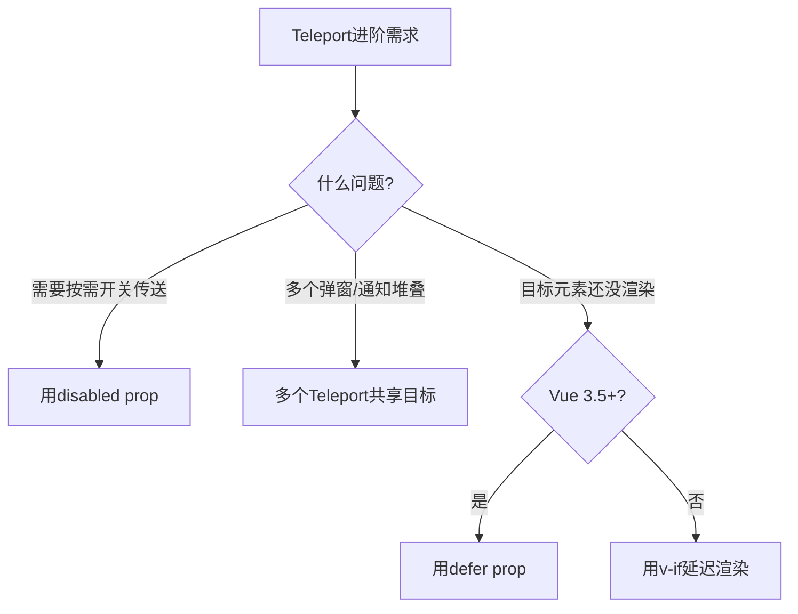

扫描[二维码](https://api2.cmdragon.cn/upload/cmder/20250304_012821924.jpg)关注或者微信搜一搜：`编程智域 前端至全栈交流与成长`

[发现1000+提升效率与开发的AI工具和实用程序](https://tools.cmdragon.cn/zh/apps?category=ai_chat)：https://tools.cmdragon.cn/

## 一、disabled：按需开关传送

有时候你想根据条件决定要不要传送。比如桌面端弹窗需要传到body（避免层叠上下文问题），但移动端弹窗就放在当前位置（行内展示）。

Teleport提供了 `disabled` prop 来控制是否启用传送：

```vue
<script setup>
import { ref, onMounted, onUnmounted } from "vue";

const isMobile = ref(false);

function checkMobile() {
  isMobile.value = window.innerWidth < 768;
}

onMounted(() => {
  checkMobile();
  window.addEventListener("resize", checkMobile);
});

onUnmounted(() => {
  window.removeEventListener("resize", checkMobile);
});
</script>

<template>
  <!-- 桌面端传送，移动端不传送 -->
  <Teleport to="body" :disabled="isMobile">
    <div class="modal">
      <p>弹窗内容</p>
    </div>
  </Teleport>
</template>
```

当 `disabled` 为 `true` 时，Teleport就当自己不存在，内容会渲染在组件原来的位置。当 `disabled` 变为 `false` 时，内容会被传送到指定目标。

**注意：** disabled需要加v-bind（`:disabled` 不是 `disabled`），因为你要传的是布尔值而不是字符串。

### disabled的切换行为

当disabled从false变为true时，内容会从目标容器移回组件原位。当从true变为false时，内容会从组件原位传送到目标容器。这个移动过程是即时的，不会有动画效果。

```vue
<script setup>
import { ref } from "vue";

const teleportEnabled = ref(true);
</script>

<template>
  <button @click="teleportEnabled = !teleportEnabled">
    {{ teleportEnabled ? "禁用传送" : "启用传送" }}
  </button>

  <div class="container">
    <p>当前位置</p>
    <Teleport to="body" :disabled="!teleportEnabled">
      <div class="box">我是被传送的内容</div>
    </Teleport>
  </div>
</template>
```

点按钮切换时，你会看到那个 `.box` 在 `.container` 和 `body` 之间来回移动。

## 二、多个Teleport共享目标

一个可复用的Modal组件可能在页面上有多个实例，每个实例都用了Teleport传到同一个目标。这时候多个Teleport的内容会**按顺序追加**到目标容器中。

```vue
<!-- ModalA.vue -->
<Teleport to="#modals">
  <div>A</div>
</Teleport>

<!-- ModalB.vue -->
<Teleport to="#modals">
  <div>B</div>
</Teleport>
```

渲染结果：

```html
<div id="modals">
  <div>A</div>
  <div>B</div>
</div>
```

后挂载的排在后面，就这么简单。跟排队一样，先来后到。

### 实际应用：多个通知堆叠

```vue
<!-- Toast1.vue -->
<Teleport to="#notifications">
  <div class="toast">消息1：操作成功</div>
</Teleport>

<!-- Toast2.vue -->
<Teleport to="#notifications">
  <div class="toast">消息2：文件已保存</div>
</Teleport>

<!-- Toast3.vue -->
<Teleport to="#notifications">
  <div class="toast">消息3：新消息到达</div>
</Teleport>
```

渲染结果：

```html
<div id="notifications">
  <div class="toast">消息1：操作成功</div>
  <div class="toast">消息2：文件已保存</div>
  <div class="toast">消息3：新消息到达</div>
</div>
```

通知按出现顺序从上到下排列，完美。

### 动态顺序

如果某个Teleport的内容被v-if控制，消失后再出现，它会重新追加到末尾：

```vue
<Teleport to="#modals">
  <div v-if="showA">A</div>
</Teleport>

<Teleport to="#modals">
  <div>B</div>
</Teleport>
```

当 `showA` 从true变为false再变为true时，A会从第一个位置消失，然后重新出现在B的后面。

## 三、defer：延迟解析目标（Vue 3.5+）

前面说过，Teleport要求目标元素在挂载时必须存在。但有时候目标元素也是Vue渲染的，可能在模板的后面才出现，或者在一个异步组件里。

Vue 3.5新增了 `defer` prop来解决这个问题：

```vue
<Teleport defer to="#late-div">
  <div>传送的内容</div>
</Teleport>

<!-- 目标元素在模板后面才出现 -->
<div id="late-div"></div>
```

加了 `defer` 之后，Teleport不会在挂载时立即寻找目标，而是等到当前挂载/更新周期结束后再解析目标。这样即使目标元素在模板后面才渲染，也能正常传送。

### defer的注意事项

1. **目标必须在同一个渲染周期内出现** — defer只是推迟到当前渲染周期结束，不是无限等待。如果目标元素是1秒后才渲染的（比如setTimeout里），Teleport还是会报错。

2. **类似mounted的时机** — defer的原理和mounted生命周期类似，在DOM更新完成后解析目标。

3. **Vue 3.5+才支持** — 老版本Vue用不了，需要用其他方案（比如v-if延迟Teleport渲染）。

### defer vs v-if

没有defer的时候，我们通常用v-if来延迟Teleport：

```vue
<script setup>
import { ref, onMounted } from "vue";

const targetReady = ref(false);

onMounted(() => {
  // 等目标元素渲染后再启用Teleport
  targetReady.value = true;
});
</script>

<template>
  <Teleport to="#modals" v-if="targetReady">
    <div>传送的内容</div>
  </Teleport>

  <div id="modals"></div>
</template>
```

有了defer就简单多了：

```vue
<template>
  <Teleport defer to="#modals">
    <div>传送的内容</div>
  </Teleport>

  <div id="modals"></div>
</template>
```

一行搞定，不用写额外的逻辑。

## 四、三个进阶玩法的对比

| 特性     | 适用场景                          | Vue版本要求 |
| -------- | --------------------------------- | ----------- |
| disabled | 按需开关传送（响应式/移动端适配） | 3.0+        |
| 共享目标 | 多个组件传到同一容器（通知/弹窗） | 3.0+        |
| defer    | 目标元素晚于Teleport渲染          | 3.5+        |



## 课后Quiz

### 问题1：disabled为true时，Teleport的内容会怎样？

**答案解析：** 内容会渲染在组件原来的位置，就像没有Teleport一样。Teleport的传送功能被禁用了，但组件本身还是正常渲染的。当disabled变为false时，内容会被传送到指定目标。

### 问题2：多个Teleport传到同一个目标，内容的排列顺序是什么？

**答案解析：** 按挂载顺序追加，后挂载的排在后面。就像排队一样，先来后到。如果某个Teleport的内容被v-if控制，消失后再出现，会重新追加到末尾。

## 常见报错解决方案

### 1. disabled不生效

**错误现象：** 设置了disabled但内容还是被传送了。

**可能原因：** 忘记加v-bind。`disabled="true"` 传的是字符串"true"，不是布尔值true。

**解决方案：** 改成 `:disabled="true"` 或 `:disabled="isMobile"`，加冒号传布尔值。

### 2. 共享目标时内容顺序不对

**错误现象：** 多个Teleport传到同一目标，但顺序跟预期不一样。

**可能原因：** 组件的挂载顺序不确定，特别是异步组件或v-if控制的组件。

**解决方案：** 如果顺序很重要，可以在目标容器内手动排序，或者用CSS的order属性调整显示顺序。

### 3. defer在老版本Vue中不生效

**错误现象：** 使用defer后Teleport还是报目标不存在。

**可能原因：** Vue版本低于3.5，不支持defer prop。

**解决方案：** 升级Vue到3.5+，或者用v-if + onMounted的方式延迟Teleport的渲染。

参考链接：

- https://cn.vuejs.org/guide/built-ins/teleport.html
- https://cn.vuejs.org/api/built-in-components.html#teleport

余下文章内容请点击跳转至 个人博客页面 或者 扫描[二维码](https://api2.cmdragon.cn/upload/cmder/20250304_012821924.jpg)关注或者微信搜一搜：`编程智域 前端至全栈交流与成长`，阅读完整的文章：[disabled、多Teleport共享目标和延迟挂载——三个进阶玩法](https://blog.cmdragon.cn/posts/t3c4d5e6f7a8b9c0d1e2f3a4b5c6d7e8/)

<details>
<summary>往期文章归档</summary>

- [Vue 3 静态与动态 Props 如何传递？TypeScript 类型约束有何必要？](https://blog.cmdragon.cn/posts/94ab48753b64780ca3ab7a7115ae8522/)
- [Vue 3中组件局部注册的优势与实现方式如何？](https://blog.cmdragon.cn/posts/dbf576e744870f6de26fd8a2e03e47da/)
- [如何在Vue3中优化生命周期钩子性能并规避常见陷阱？](https://blog.cmdragon.cn/posts/12d98b3b9ccd6c19a1b169d720ac5c80/)
- [Vue 3 Composition API生命周期钩子：如何实现从基础理解到高阶复用？](https://blog.cmdragon.cn/posts/8884e2b70287fcb263c57648eeb27419/)
- [Vue 3生命周期钩子实战指南：如何正确选择onMounted、onUpdated与onUnmounted的应用场景？](https://blog.cmdragon.cn/posts/883c6dbc50ae4183770a4462e0b8ae4d/)

</details>

<details>
<summary>免费好用的热门在线工具</summary>

- [多直播聚合器 - 应用商店 | By cmdragon](https://tools.cmdragon.cn/zh/apps/multi-live-aggregator)
- [Proto文件生成器 - 应用商店 | By cmdragon](https://tools.cmdragon.cn/zh/apps/proto-file-generator)
- [图片转粒子 - 应用商店 | By cmdragon](https://tools.cmdragon.cn/zh/apps/image-to-particles)
- [视频下载器 - 应用商店 | By cmdragon](https://tools.cmdragon.cn/zh/apps/video-downloader)
- [文件格式转换器 - 应用商店 | By cmdragon](https://tools.cmdragon.cn/zh/apps/file-converter)
- [M3U8在线播放器 - 应用商店 | By cmdragon](https://tools.cmdragon.cn/zh/apps/m3u8-player)
- [CMDragon 在线工具 - 高级AI工具箱与开发者套件 | 免费好用的在线工具](https://tools.cmdragon.cn/zh)
- [应用商店 - 发现1000+提升效率与开发的AI工具和实用程序 | 免费好用的在线工具](https://tools.cmdragon.cn/zh/apps?category=trending)

</details>
