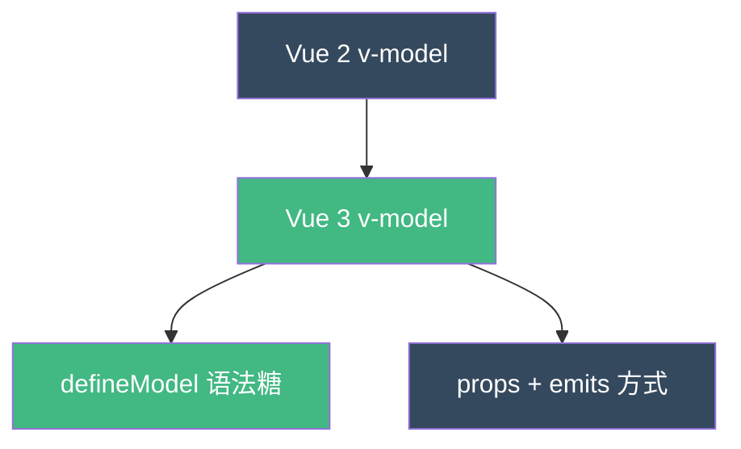
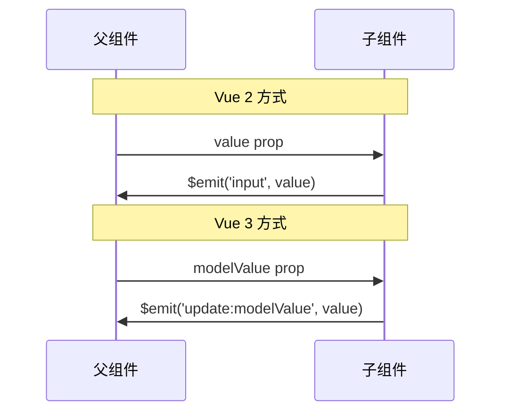
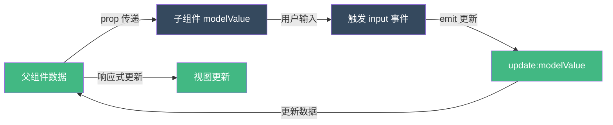
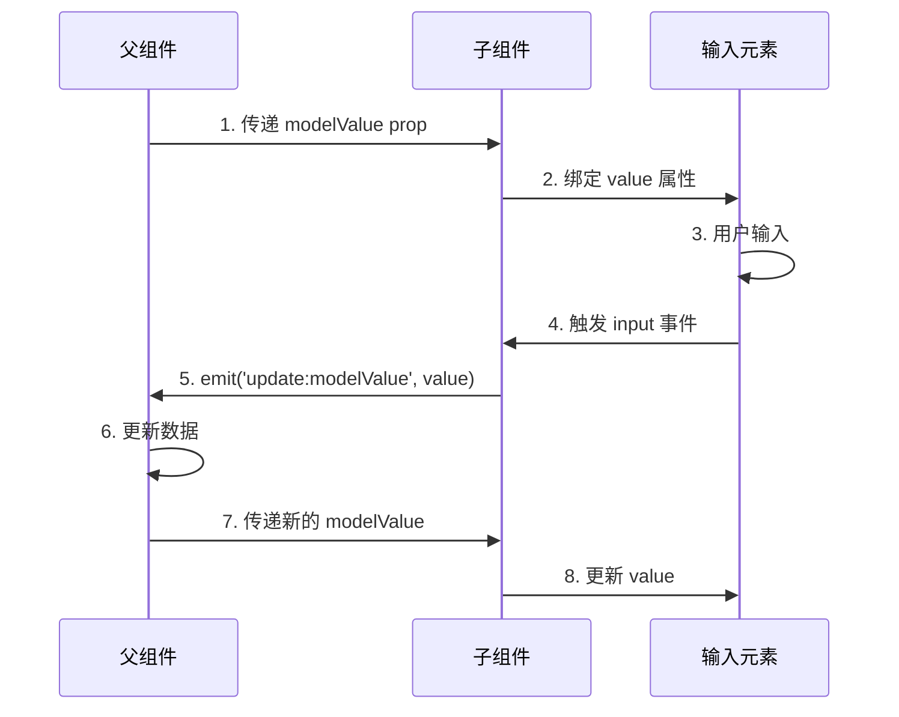

扫描 [二维码](https://api2.cmdragon.cn/upload/cmder/20250304_012821924.jpg) 关注或者微信搜一搜：`编程智域 前端至全栈交流与成长`

[发现 1000+ 提升效率与开发的 AI 工具和实用程序](https://tools.cmdragon.cn/zh/apps?category=ai_chat)：https://tools.cmdragon.cn/

## 1. v-model 的本质理解

在 Vue 3 中，v-model 是一个语法糖，它简化了表单输入元素和组件的双向绑定。理解 v-model 的底层原理，对于编写高效、可维护的组件至关重要。

### 1.1 v-model 的演变



**Vue 2 vs Vue 3:**



### 1.2 v-model 的核心原理

v-model 实际上是 `prop` + `event` 的语法糖：

```vue
<!-- 父组件中使用 v-model -->
<template>
  <ChildComponent v-model="parentData" />
</template>

<!-- 等价于 -->
<template>
  <ChildComponent
    :modelValue="parentData"
    @update:modelValue="parentData = $event"
  />
</template>

<script setup>
import { ref } from "vue";
const parentData = ref("初始值");
</script>
```

## 2. 基础 v-model 实现

### 2.1 表单元素的 v-model

```vue
<template>
  <div class="form-example">
    <!-- 文本输入 -->
    <input v-model="textValue" type="text" placeholder="请输入文本" />
    <p>输入的值：{{ textValue }}</p>

    <!-- 复选框 -->
    <input v-model="checked" type="checkbox" />
    <p>是否选中：{{ checked }}</p>

    <!-- 单选按钮 -->
    <input v-model="radioValue" type="radio" value="option1" />
    <label>选项 1</label>

    <input v-model="radioValue" type="radio" value="option2" />
    <label>选项 2</label>
    <p>选中值：{{ radioValue }}</p>

    <!-- 下拉选择 -->
    <select v-model="selectValue">
      <option value="" disabled>请选择</option>
      <option value="apple">苹果</option>
      <option value="banana">香蕉</option>
      <option value="orange">橙子</option>
    </select>
    <p>选择结果：{{ selectValue }}</p>
  </div>
</template>

<script setup>
import { ref } from "vue";

const textValue = ref("");
const checked = ref(false);
const radioValue = ref("option1");
const selectValue = ref("");
</script>

<style scoped>
.form-example {
  padding: 2rem;
  max-width: 500px;
  margin: 0 auto;
  border: 1px solid #e0e0e0;
  border-radius: 8px;
}

input[type="text"],
select {
  width: 100%;
  padding: 0.75rem;
  margin: 0.5rem 0;
  border: 2px solid #e0e0e0;
  border-radius: 4px;
  font-size: 1rem;
}

input[type="checkbox"],
input[type="radio"] {
  margin-right: 0.5rem;
}

p {
  margin-top: 1rem;
  color: #35495e;
  font-weight: 600;
}
</style>
```

### 2.2 自定义组件的 v-model

**方式一：使用 defineModel（Vue 3.4+ 推荐）**

```vue
<!-- CustomInput.vue -->
<template>
  <div class="custom-input">
    <input
      :value="modelValue"
      @input="handleInput"
      :placeholder="placeholder"
      class="input-field"
    />
    <span class="input-label">{{ label }}</span>
  </div>
</template>

<script setup>
// 使用 defineModel 定义双向绑定
const modelValue = defineModel({
  type: String,
  default: "",
});

defineProps({
  placeholder: {
    type: String,
    default: "请输入...",
  },
  label: {
    type: String,
    default: "",
  },
});

function handleInput(event) {
  // 直接赋值即可触发更新
  modelValue.value = event.target.value;
}
</script>

<style scoped>
.custom-input {
  position: relative;
  margin: 1rem 0;
}

.input-field {
  width: 100%;
  padding: 0.75rem;
  border: 2px solid #e0e0e0;
  border-radius: 4px;
  font-size: 1rem;
  transition: border-color 0.3s;
}

.input-field:focus {
  outline: none;
  border-color: #42b883;
}

.input-label {
  position: absolute;
  top: -0.5rem;
  left: 0.75rem;
  padding: 0 0.25rem;
  background: #fff;
  color: #42b883;
  font-size: 0.875rem;
  font-weight: 600;
}
</style>
```

**父组件使用：**

```vue
<!-- ParentComponent.vue -->
<template>
  <div class="parent">
    <h2>自定义输入组件</h2>

    <CustomInput v-model="username" label="用户名" placeholder="请输入用户名" />

    <CustomInput v-model="email" label="邮箱" placeholder="请输入邮箱" />

    <div class="data-display">
      <h3>实时数据：</h3>
      <p>用户名：{{ username }}</p>
      <p>邮箱：{{ email }}</p>
    </div>
  </div>
</template>

<script setup>
import { ref } from "vue";
import CustomInput from "./CustomInput.vue";

const username = ref("");
const email = ref("");
</script>

<style scoped>
.parent {
  padding: 2rem;
  max-width: 600px;
  margin: 0 auto;
}

h2 {
  color: #35495e;
  margin-bottom: 2rem;
}

.data-display {
  margin-top: 2rem;
  padding: 1.5rem;
  background-color: #f0f9ff;
  border-radius: 8px;
  border: 2px solid #42b883;
}

.data-display h3 {
  color: #42b883;
  margin-bottom: 1rem;
}

.data-display p {
  color: #35495e;
  margin: 0.5rem 0;
}
</style>
```

**方式二：使用 props + emits（传统方式）**

```vue
<!-- TraditionalInput.vue -->
<template>
  <div class="traditional-input">
    <input
      :value="modelValue"
      @input="handleInput"
      :placeholder="placeholder"
    />
  </div>
</template>

<script setup>
const props = defineProps({
  modelValue: {
    type: String,
    default: "",
  },
  placeholder: {
    type: String,
    default: "请输入...",
  },
});

const emit = defineEmits(["update:modelValue"]);

function handleInput(event) {
  emit("update:modelValue", event.target.value);
}
</script>

<style scoped>
.traditional-input input {
  width: 100%;
  padding: 0.75rem;
  border: 2px solid #e0e0e0;
  border-radius: 4px;
  font-size: 1rem;
}

.traditional-input input:focus {
  outline: none;
  border-color: #42b883;
}
</style>
```

## 3. defineModel 深度解析

### 3.1 defineModel 的编译结果

Vue 3.4 引入的 `defineModel` 是语法糖，编译后会自动生成 props 和 emits：

```javascript
// 源代码
const modelValue = defineModel({
  type: String,
  default: "",
});

// 编译后等价于：
const props = defineProps({
  modelValue: {
    type: String,
    default: "",
  },
});

const emit = defineEmits(["update:modelValue"]);

const modelValue = computed({
  get() {
    return props.modelValue;
  },
  set(value) {
    emit("update:modelValue", value);
  },
});
```

### 3.2 defineModel 的选项

```vue
<!-- AdvancedModel.vue -->
<template>
  <div>
    <!-- 带验证的模型 -->
    <input v-model="validatedValue" placeholder="必须大于 10" type="number" />
    <p v-if="errorMessage" class="error">{{ errorMessage }}</p>

    <!-- 带转换的模型 -->
    <input v-model="upperCaseValue" placeholder="自动转大写" />
    <p>实际值：{{ upperCaseValue }}</p>
  </div>
</template>

<script setup>
import { ref, watch } from "vue";

// 带验证的模型
const validatedValue = defineModel("validated", {
  type: Number,
  default: 0,
  validator: (value) => {
    if (value < 10) {
      console.warn("值必须大于 10");
      return false;
    }
    return true;
  },
});

const errorMessage = ref("");

watch(validatedValue, (newValue) => {
  if (newValue < 10) {
    errorMessage.value = "值必须大于 10";
  } else {
    errorMessage.value = "";
  }
});

// 带转换的模型
const upperCaseValue = defineModel("upper", {
  type: String,
  default: "",
  set(value) {
    // 在设置前转换为大写
    return value.toUpperCase();
  },
});
</script>

<style scoped>
.error {
  color: #ff4444;
  font-size: 0.875rem;
  margin-top: 0.25rem;
}

input {
  width: 100%;
  padding: 0.75rem;
  margin: 0.5rem 0;
  border: 2px solid #e0e0e0;
  border-radius: 4px;
}

input:focus {
  outline: none;
  border-color: #42b883;
}
</style>
```

## 4. 多个 v-model 绑定

### 4.1 命名 v-model

Vue 3 支持在同一个组件上使用多个 v-model：

```vue
<!-- UserName.vue -->
<template>
  <div class="user-name">
    <div class="name-field">
      <label>名：</label>
      <input v-model="firstName" placeholder="名" />
    </div>

    <div class="name-field">
      <label>姓：</label>
      <input v-model="lastName" placeholder="姓" />
    </div>

    <div class="full-name">全名：{{ fullName }}</div>
  </div>
</template>

<script setup>
import { computed } from "vue";

// 定义多个双向绑定
const firstName = defineModel("firstName", {
  type: String,
  default: "",
});

const lastName = defineModel("lastName", {
  type: String,
  default: "",
});

// 计算全名
const fullName = computed(() => {
  return `${firstName.value} ${lastName.value}`;
});
</script>

<style scoped>
.user-name {
  padding: 1.5rem;
  border: 1px solid #e0e0e0;
  border-radius: 8px;
  max-width: 400px;
}

.name-field {
  margin-bottom: 1rem;
}

.name-field label {
  display: inline-block;
  width: 50px;
  color: #35495e;
  font-weight: 600;
}

.name-field input {
  padding: 0.5rem;
  border: 2px solid #e0e0e0;
  border-radius: 4px;
  width: calc(100% - 70px);
}

.name-field input:focus {
  outline: none;
  border-color: #42b883;
}

.full-name {
  margin-top: 1.5rem;
  padding: 1rem;
  background-color: #f0f9ff;
  border-radius: 4px;
  color: #42b883;
  font-weight: 600;
  text-align: center;
}
</style>
```

**父组件使用：**

```vue
<!-- ParentForm.vue -->
<template>
  <div class="parent-form">
    <h2>用户信息录入</h2>

    <UserName
      v-model:first-name="user.firstName"
      v-model:last-name="user.lastName"
    />

    <div class="user-data">
      <h3>用户数据：</h3>
      <pre>{{ user }}</pre>
    </div>
  </div>
</template>

<script setup>
import { reactive } from "vue";
import UserName from "./UserName.vue";

const user = reactive({
  firstName: "",
  lastName: "",
});
</script>

<style scoped>
.parent-form {
  padding: 2rem;
  max-width: 600px;
  margin: 0 auto;
}

h2 {
  color: #35495e;
  margin-bottom: 2rem;
  text-align: center;
}

.user-data {
  margin-top: 2rem;
  padding: 1.5rem;
  background-color: #35495e;
  color: #fff;
  border-radius: 8px;
}

.user-data h3 {
  color: #42b883;
  margin-bottom: 1rem;
}

.user-data pre {
  background-color: rgba(255, 255, 255, 0.1);
  padding: 1rem;
  border-radius: 4px;
  overflow-x: auto;
}
</style>
```

### 4.2 v-model 参数化

```vue
<!-- ProductConfig.vue -->
<template>
  <div class="product-config">
    <div class="config-item">
      <label>产品名称：</label>
      <input v-model="config.name" />
    </div>

    <div class="config-item">
      <label>价格：</label>
      <input v-model.number="config.price" type="number" />
    </div>

    <div class="config-item">
      <label>库存：</label>
      <input v-model.number="config.stock" type="number" />
    </div>

    <div class="config-item">
      <label>上架状态：</label>
      <input v-model="config.isAvailable" type="checkbox" />
    </div>
  </div>
</template>

<script setup>
import { reactive } from "vue";

const config = reactive({
  name: "",
  price: 0,
  stock: 0,
  isAvailable: true,
});
</script>

<style scoped>
.product-config {
  padding: 1.5rem;
  border: 1px solid #e0e0e0;
  border-radius: 8px;
  max-width: 500px;
}

.config-item {
  margin-bottom: 1rem;
  display: flex;
  align-items: center;
  gap: 1rem;
}

.config-item label {
  width: 100px;
  color: #35495e;
  font-weight: 600;
}

.config-item input {
  flex: 1;
  padding: 0.5rem;
  border: 2px solid #e0e0e0;
  border-radius: 4px;
}

.config-item input:focus {
  outline: none;
  border-color: #42b883;
}
</style>
```

## 5. v-model 修饰符

### 5.1 内置修饰符

```vue
<!-- ModifiersExample.vue -->
<template>
  <div class="modifiers-example">
    <h2>v-model 修饰符示例</h2>

    <!-- .lazy 修饰符 -->
    <div class="modifier-item">
      <label>.lazy（失去焦点或回车时更新）：</label>
      <input v-model.lazy="lazyValue" />
      <p>值：{{ lazyValue }}</p>
    </div>

    <!-- .number 修饰符 -->
    <div class="modifier-item">
      <label>.number（自动转为数字）：</label>
      <input v-model.number="numberValue" type="number" />
      <p>值：{{ numberValue }} (类型：{{ typeof numberValue }})</p>
    </div>

    <!-- .trim 修饰符 -->
    <div class="modifier-item">
      <label>.trim（自动去除首尾空格）：</label>
      <input v-model.trim="trimValue" />
      <p>值："{{ trimValue }}" (长度：{{ trimValue.length }})</p>
    </div>
  </div>
</template>

<script setup>
import { ref } from "vue";

const lazyValue = ref("");
const numberValue = ref(0);
const trimValue = ref("");
</script>

<style scoped>
.modifiers-example {
  padding: 2rem;
  max-width: 600px;
  margin: 0 auto;
  border: 1px solid #e0e0e0;
  border-radius: 8px;
}

h2 {
  color: #35495e;
  margin-bottom: 2rem;
  text-align: center;
}

.modifier-item {
  margin-bottom: 2rem;
  padding: 1rem;
  background-color: #f9f9f9;
  border-radius: 4px;
}

.modifier-item label {
  display: block;
  margin-bottom: 0.5rem;
  color: #35495e;
  font-weight: 600;
}

.modifier-item input {
  width: 100%;
  padding: 0.75rem;
  border: 2px solid #e0e0e0;
  border-radius: 4px;
  margin-bottom: 0.5rem;
}

.modifier-item input:focus {
  outline: none;
  border-color: #42b883;
}

.modifier-item p {
  color: #42b883;
  font-weight: 600;
  margin-top: 0.5rem;
}
</style>
```

### 5.2 自定义修饰符

```vue
<!-- CustomModifierInput.vue -->
<template>
  <div class="custom-modifier-input">
    <input
      :value="modelValue"
      @input="handleInput"
      :placeholder="placeholder"
    />
  </div>
</template>

<script setup>
const props = defineProps({
  modelValue: {
    type: String,
    default: "",
  },
  placeholder: {
    type: String,
    default: "",
  },
  // 自定义修饰符
  uppercase: Boolean,
  lowercase: Boolean,
  capitalize: Boolean,
});

const emit = defineEmits(["update:modelValue"]);

function handleInput(event) {
  let value = event.target.value;

  // 应用修饰符
  if (props.uppercase) {
    value = value.toUpperCase();
  } else if (props.lowercase) {
    value = value.toLowerCase();
  } else if (props.capitalize) {
    value = value.replace(/\b\w/g, (char) => char.toUpperCase());
  }

  emit("update:modelValue", value);
}
</script>

<style scoped>
.custom-modifier-input input {
  width: 100%;
  padding: 0.75rem;
  border: 2px solid #e0e0e0;
  border-radius: 4px;
  font-size: 1rem;
}

.custom-modifier-input input:focus {
  outline: none;
  border-color: #42b883;
}
</style>
```

**使用自定义修饰符：**

```vue
<template>
  <div>
    <!-- 全部转大写 -->
    <CustomModifierInput
      v-model.uppercase="text1"
      placeholder="输入后自动转大写"
    />

    <!-- 全部转小写 -->
    <CustomModifierInput
      v-model.lowercase="text2"
      placeholder="输入后自动转小写"
    />

    <!-- 首字母大写 -->
    <CustomModifierInput
      v-model.capitalize="text3"
      placeholder="输入后首字母大写"
    />
  </div>
</template>

<script setup>
import { ref } from "vue";
import CustomModifierInput from "./CustomModifierInput.vue";

const text1 = ref("");
const text2 = ref("");
const text3 = ref("");
</script>
```

## 6. 实战案例：表单验证系统

### 6.1 可复用的表单项组件

```vue
<!-- FormField.vue -->
<template>
  <div class="form-field" :class="{ 'has-error': errorMessage }">
    <label :for="fieldId" class="field-label">
      {{ label }}
      <span v-if="required" class="required">*</span>
    </label>

    <!-- 文本输入 -->
    <input
      v-if="type === 'text' || type === 'email' || type === 'password'"
      :id="fieldId"
      :type="type"
      :value="modelValue"
      @input="handleInput"
      :placeholder="placeholder"
      :class="['field-input', { error: errorMessage }]"
    />

    <!-- 数字输入 -->
    <input
      v-else-if="type === 'number'"
      :id="fieldId"
      type="number"
      :value="modelValue"
      @input="handleNumberInput"
      :placeholder="placeholder"
      :class="['field-input', { error: errorMessage }]"
    />

    <!-- 文本域 -->
    <textarea
      v-else-if="type === 'textarea'"
      :id="fieldId"
      :value="modelValue"
      @input="handleInput"
      :placeholder="placeholder"
      :rows="rows"
      :class="['field-textarea', { error: errorMessage }]"
    ></textarea>

    <!-- 下拉选择 -->
    <select
      v-else-if="type === 'select'"
      :id="fieldId"
      :value="modelValue"
      @change="handleSelectChange"
      :class="['field-select', { error: errorMessage }]"
    >
      <option value="" disabled>{{ placeholder }}</option>
      <option
        v-for="option in options"
        :key="option.value"
        :value="option.value"
      >
        {{ option.label }}
      </option>
    </select>

    <!-- 错误提示 -->
    <transition name="fade">
      <div v-if="errorMessage" class="error-message">
        {{ errorMessage }}
      </div>
    </transition>
  </div>
</template>

<script setup>
import { ref, watch, computed } from "vue";

const props = defineProps({
  modelValue: {
    type: [String, Number],
    default: "",
  },
  label: {
    type: String,
    required: true,
  },
  type: {
    type: String,
    default: "text",
    validator: (value) => {
      return [
        "text",
        "number",
        "email",
        "password",
        "textarea",
        "select",
      ].includes(value);
    },
  },
  placeholder: {
    type: String,
    default: "",
  },
  required: {
    type: Boolean,
    default: false,
  },
  rules: {
    type: Array,
    default: () => [],
  },
  options: {
    type: Array,
    default: () => [],
  },
  rows: {
    type: Number,
    default: 4,
  },
});

const emit = defineEmits(["update:modelValue"]);
const errorMessage = ref("");
const fieldId = computed(
  () => `field-${Math.random().toString(36).substr(2, 9)}`,
);

// 验证规则
const validators = {
  required: (value) => {
    if (props.required && (!value || value.toString().trim() === "")) {
      return `${props.label}不能为空`;
    }
    return null;
  },
  email: (value) => {
    if (props.type === "email" && value && !/\S+@\S+\.\S+/.test(value)) {
      return "邮箱格式不正确";
    }
    return null;
  },
  minLength: (value, rule) => {
    if (value && value.length < rule) {
      return `${props.label}长度不能少于${rule}个字符`;
    }
    return null;
  },
  maxLength: (value, rule) => {
    if (value && value.length > rule) {
      return `${props.label}长度不能超过${rule}个字符`;
    }
    return null;
  },
  pattern: (value, rule) => {
    if (value && !new RegExp(rule).test(value)) {
      return `${props.label}格式不正确`;
    }
    return null;
  },
};

// 验证函数
function validate() {
  errorMessage.value = "";

  for (const rule of props.rules) {
    let error = null;

    if (typeof rule === "string") {
      error = validators[rule]?.(props.modelValue);
    } else if (typeof rule === "object") {
      const [ruleName, ruleValue] = Object.entries(rule)[0];
      error = validators[ruleName]?.(props.modelValue, ruleValue);
    }

    if (error) {
      errorMessage.value = error;
      return false;
    }
  }

  return true;
}

function handleInput(event) {
  emit("update:modelValue", event.target.value);
  validate();
}

function handleNumberInput(event) {
  const value = event.target.value;
  emit("update:modelValue", value ? Number(value) : "");
  validate();
}

function handleSelectChange(event) {
  emit("update:modelValue", event.target.value);
  validate();
}

// 监听值变化，自动验证
watch(
  () => props.modelValue,
  () => {
    if (errorMessage.value) {
      validate();
    }
  },
);

// 暴露验证方法给父组件
defineExpose({
  validate,
});
</script>

<style scoped>
.form-field {
  margin-bottom: 1.5rem;
}

.field-label {
  display: block;
  margin-bottom: 0.5rem;
  color: #35495e;
  font-weight: 600;
}

.required {
  color: #ff4444;
  margin-left: 0.25rem;
}

.field-input,
.field-textarea,
.field-select {
  width: 100%;
  padding: 0.75rem;
  border: 2px solid #e0e0e0;
  border-radius: 4px;
  font-size: 1rem;
  transition: border-color 0.3s;
}

.field-input:focus,
.field-textarea:focus,
.field-select:focus {
  outline: none;
  border-color: #42b883;
}

.field-input.error,
.field-textarea.error,
.field-select.error {
  border-color: #ff4444;
}

.error-message {
  color: #ff4444;
  font-size: 0.875rem;
  margin-top: 0.25rem;
}

.fade-enter-active,
.fade-leave-active {
  transition: opacity 0.3s;
}

.fade-enter-from,
.fade-leave-to {
  opacity: 0;
}

.form-field.has-error .field-label {
  color: #ff4444;
}
</style>
```

### 6.2 使用表单组件

```vue
<!-- RegistrationForm.vue -->
<template>
  <div class="registration-form">
    <h2>用户注册</h2>

    <form @submit.prevent="handleSubmit">
      <FormField
        ref="usernameRef"
        v-model="formData.username"
        label="用户名"
        type="text"
        placeholder="请输入用户名"
        required
        :rules="['required', { minLength: 3 }, { maxLength: 20 }]"
      />

      <FormField
        ref="emailRef"
        v-model="formData.email"
        label="邮箱"
        type="email"
        placeholder="请输入邮箱"
        required
        :rules="['required', 'email']"
      />

      <FormField
        ref="passwordRef"
        v-model="formData.password"
        label="密码"
        type="password"
        placeholder="请输入密码"
        required
        :rules="['required', { minLength: 6 }]"
      />

      <FormField
        ref="confirmPasswordRef"
        v-model="formData.confirmPassword"
        label="确认密码"
        type="password"
        placeholder="请再次输入密码"
        required
        :rules="['required']"
      />

      <FormField
        v-model="formData.bio"
        label="个人简介"
        type="textarea"
        placeholder="介绍一下自己"
        :rows="4"
      />

      <FormField
        v-model="formData.gender"
        label="性别"
        type="select"
        placeholder="请选择性别"
        :options="[
          { value: 'male', label: '男' },
          { value: 'female', label: '女' },
          { value: 'other', label: '其他' },
        ]"
      />

      <button type="submit" class="submit-btn" :disabled="!isFormValid">
        注册
      </button>
    </form>

    <div v-if="submitResult" :class="['result', submitResult.type]">
      <h3>{{ submitResult.title }}</h3>
      <p>{{ submitResult.message }}</p>
    </div>
  </div>
</template>

<script setup>
import { ref, reactive, computed } from "vue";
import FormField from "./FormField.vue";

const usernameRef = ref(null);
const emailRef = ref(null);
const passwordRef = ref(null);
const confirmPasswordRef = ref(null);

const formData = reactive({
  username: "",
  email: "",
  password: "",
  confirmPassword: "",
  bio: "",
  gender: "",
});

const submitResult = ref(null);

// 计算表单是否有效
const isFormValid = computed(() => {
  return (
    formData.username &&
    formData.email &&
    formData.password &&
    formData.confirmPassword &&
    formData.password === formData.confirmPassword
  );
});

// 验证整个表单
function validateForm() {
  const refs = [
    usernameRef.value,
    emailRef.value,
    passwordRef.value,
    confirmPasswordRef.value,
  ];

  let isValid = true;
  for (const ref of refs) {
    if (!ref?.validate()) {
      isValid = false;
    }
  }

  return isValid;
}

// 提交表单
async function handleSubmit() {
  if (!validateForm()) {
    submitResult.value = {
      type: "error",
      title: "验证失败",
      message: "请检查表单填写是否正确",
    };
    return;
  }

  if (formData.password !== formData.confirmPassword) {
    submitResult.value = {
      type: "error",
      title: "密码不匹配",
      message: "两次输入的密码不一致",
    };
    return;
  }

  // 模拟提交
  console.log("提交表单数据:", formData);

  submitResult.value = {
    type: "success",
    title: "注册成功",
    message: "欢迎加入我们的平台！",
  };

  // 重置表单
  setTimeout(() => {
    formData.username = "";
    formData.email = "";
    formData.password = "";
    formData.confirmPassword = "";
    formData.bio = "";
    formData.gender = "";
    submitResult.value = null;
  }, 2000);
}
</script>

<style scoped>
.registration-form {
  max-width: 600px;
  margin: 2rem auto;
  padding: 2rem;
  border: 1px solid #e0e0e0;
  border-radius: 8px;
  box-shadow: 0 2px 8px rgba(0, 0, 0, 0.1);
}

h2 {
  color: #35495e;
  margin-bottom: 2rem;
  text-align: center;
}

.submit-btn {
  width: 100%;
  padding: 0.75rem;
  color: #fff;
  background-color: #42b883;
  border: none;
  border-radius: 4px;
  font-size: 1rem;
  font-weight: 600;
  cursor: pointer;
  transition: background-color 0.3s;
  margin-top: 1rem;
}

.submit-btn:hover:not(:disabled) {
  background-color: #35495e;
}

.submit-btn:disabled {
  background-color: #ccc;
  cursor: not-allowed;
}

.result {
  margin-top: 2rem;
  padding: 1.5rem;
  border-radius: 8px;
  text-align: center;
}

.result.success {
  background-color: #d4edda;
  border: 1px solid #c3e6cb;
  color: #155724;
}

.result.error {
  background-color: #f8d7da;
  border: 1px solid #f5c6cb;
  color: #721c24;
}

.result h3 {
  margin-bottom: 0.5rem;
}

.result p {
  margin: 0;
}
</style>
```

## 7. v-model 的原理深入

### 7.1 响应式系统如何工作



### 7.2 双向绑定流程图



## 8. 常见报错与解决方案

### 报错 1：[Vue warn]: Invalid prop: type check failed

**产生原因：**

- prop 类型不匹配
- 没有正确设置默认值

**解决办法：**

```vue
<script setup>
// ❌ 错误：类型不匹配
const modelValue = defineModel({
  type: Number,
  default: "0", // 字符串默认值
});

// ✅ 正确：类型一致
const modelValue = defineModel({
  type: Number,
  default: 0,
});
</script>
```

### 报错 2：v-model 不更新

**产生原因：**

- 直接修改 prop 而不是 emit 更新
- 没有正确使用 defineModel

**解决办法：**

```vue
<script setup>
// ❌ 错误：直接修改 prop
const props = defineProps(["modelValue"]);
function update() {
  props.modelValue = "new value"; // 不会触发更新
}

// ✅ 正确：使用 defineModel
const modelValue = defineModel();
function update() {
  modelValue.value = "new value"; // 会触发更新
}
</script>
```

### 报错 3：多个 v-model 冲突

**产生原因：**

- 没有使用命名参数
- 多个 v-model 使用相同的名称

**解决办法：**

```vue
<!-- 子组件 -->
<script setup>
const firstName = defineModel("firstName");
const lastName = defineModel("lastName");
</script>

<!-- 父组件 -->
<template>
  <Child
    v-model:first-name="user.firstName"
    v-model:last-name="user.lastName"
  />
</template>
```

## 9. 性能优化建议

### 9.1 使用计算属性缓存

```vue
<script setup>
import { computed } from "vue";

const modelValue = defineModel();

// 使用计算属性处理转换
const processedValue = computed({
  get() {
    return modelValue.value?.trim() || "";
  },
  set(value) {
    modelValue.value = value.trim();
  },
});
</script>
```

### 9.2 避免不必要的更新

```vue
<script setup>
import { ref, watch } from "vue";

const modelValue = defineModel();
const localValue = ref(modelValue.value);

// 只在必要时更新
watch(localValue, (newValue) => {
  if (newValue !== modelValue.value) {
    modelValue.value = newValue;
  }
});
</script>
```

## 10. 课后 Quiz

### 问题 1：v-model 在 Vue 3 中等价于什么？

<details>
<summary>点击查看答案解析</summary>

**答案：**

```vue
<Child v-model="data" />

<!-- 等价于 -->
<Child :modelValue="data" @update:modelValue="data = $event" />
```

**解析：** v-model 是 prop + event 的语法糖，Vue 3 中使用 `modelValue` prop 和 `update:modelValue` 事件。

</details>

### 问题 2：如何在组件中实现多个 v-model？

<details>
<summary>点击查看答案解析</summary>

**答案：**

```vue
<!-- 子组件 -->
<script setup>
const name = defineModel("name");
const age = defineModel("age");
</script>

<!-- 父组件 -->
<template>
  <Child v-model:name="person.name" v-model:age="person.age" />
</template>
```

**解析：** 使用命名参数（如 `v-model:name`）可以在同一个组件上实现多个双向绑定。

</details>

---

余下文章内容请点击跳转至 个人博客页面 或者 扫描 [二维码](https://api2.cmdragon.cn/upload/cmder/20250304_012821924.jpg) 关注或者微信搜一搜：`编程智域 前端至全栈交流与成长`，阅读完整的文章：[Vue 3 v-model 语法糖与组件事件的双向绑定原理](https://blog.cmdragon.cn/posts/vue3-v-model-syntax-sugar-and-two-way-binding/)

<details>
<summary>免费好用的热门在线工具</summary>

- [多直播聚合器 - 应用商店 | By cmdragon](https://tools.cmdragon.cn/zh/apps/multi-live-aggregator)
- [Proto 文件生成器 - 应用商店 | By cmdragon](https://tools.cmdragon.cn/zh/apps/proto-file-generator)
- [图片转粒子 - 应用商店 | By cmdragon](https://tools.cmdragon.cn/zh/apps/image-to-particles)
- [视频下载器 - 应用商店 | By cmdragon](https://tools.cmdragon.cn/zh/apps/video-downloader)
- [文件格式转换器 - 应用商店 | By cmdragon](https://tools.cmdragon.cn/zh/apps/file-converter)
- [M3U8 在线播放器 - 应用商店 | By cmdragon](https://tools.cmdragon.cn/zh/apps/m3u8-player)
- [快图设计 - 应用商店 | By cmdragon](https://tools.cmdragon.cn/zh/apps/quick-image-design)
- [高级文字转图片转换器 - 应用商店 | By cmdragon](https://tools.cmdragon.cn/zh/apps/text-to-image-advanced)
- [RAID 计算器 - 应用商店 | By cmdragon](https://tools.cmdragon.cn/zh/apps/raid-calculator)
- [在线 PS - 应用商店 | By cmdragon](https://tools.cmdragon.cn/zh/apps/photoshop-online)
- [Mermaid 在线编辑器 - 应用商店 | By cmdragon](https://tools.cmdragon.cn/zh/apps/mermaid-live-editor)
- [数学求解计算器 - 应用商店 | By cmdragon](https://tools.cmdragon.cn/zh/apps/math-solver-calculator)
- [智能提词器 - 应用商店 | By cmdragon](https://tools.cmdragon.cn/zh/apps/smart-teleprompter)
- [魔法简历 - 应用商店 | By cmdragon](https://tools.cmdragon.cn/zh/apps/magic-resume)
- [Image Puzzle Tool - 图片拼图工具 | By cmdragon](https://tools.cmdragon.cn/zh/apps/image-puzzle-tool)
- [字幕下载工具 - 应用商店 | By cmdragon](https://tools.cmdragon.cn/zh/apps/subtitle-downloader)
- [歌词生成工具 - 应用商店 | By cmdragon](https://tools.cmdragon.cn/zh/apps/lyrics-generator)
- [网盘资源聚合搜索 - 应用商店 | By cmdragon](https://tools.cmdragon.cn/zh/apps/cloud-drive-search)
- [ASCII 字符画生成器 - 应用商店 | By cmdragon](https://tools.cmdragon.cn/zh/apps/ascii-art-generator)
- [JWT 工具 - 应用商店 | By cmdragon](https://tools.cmdragon.cn/zh/apps/jwt-tool)
- [Bcrypt 密码工具 - 应用商店 | By cmdragon](https://tools.cmdragon.cn/zh/apps/bcrypt-tool)
- [GIF 合成器 - 应用商店 | By cmdragon](https://tools.cmdragon.cn/zh/apps/gif-composer)
- [GIF 分解器 - 应用商店 | By cmdragon](https://tools.cmdragon.cn/zh/apps/gif-decomposer)
- [文本隐写术 - 应用商店 | By cmdragon](https://tools.cmdragon.cn/zh/apps/text-steganography)
- [CMDragon 在线工具 - 高级 AI 工具箱与开发者套件 | 免费好用的在线工具](https://tools.cmdragon.cn/zh)
- [应用商店 - 发现 1000+ 提升效率与开发的 AI 工具和实用程序 | 免费好用的在线工具](https://tools.cmdragon.cn/zh/apps?category=trending)
- [CMDragon 更新日志 - 最新更新、功能与改进 | 免费好用的在线工具](https://tools.cmdragon.cn/zh/changelog)
- [支持我们 - 成为赞助者 | 免费好用的在线工具](https://tools.cmdragon.cn/zh/sponsor)
- [AI 文本生成图像 - 应用商店 | 免费好用的在线工具](https://tools.cmdragon.cn/zh/apps/text-to-image-ai)
- [临时邮箱 - 应用商店 | 免费好用的在线工具](https://tools.cmdragon.cn/zh/apps/temp-email)
- [二维码解析器 - 应用商店 | 免费好用的在线工具](https://tools.cmdragon.cn/zh/apps/qrcode-parser)
- [文本转思维导图 - 应用商店 | 免费好用的在线工具](https://tools.cmdragon.cn/zh/apps/text-to-mindmap)
- [正则表达式可视化工具 - 应用商店 | 免费好用的在线工具](https://tools.cmdragon.cn/zh/apps/regex-visualizer)
- [文件隐写工具 - 应用商店 | By cmdragon](https://tools.cmdragon.cn/zh/apps/steganography-tool)
- [IPTV 频道探索器 - 应用商店 | 免费好用的在线工具](https://tools.cmdragon.cn/zh/apps/iptv-explorer)
- [快传 - 应用商店 | 免费好用的在线工具](https://tools.cmdragon.cn/zh/apps/snapdrop)
- [随机抽奖工具 - 应用商店 | 免费好用的在线工具](https://tools.cmdragon.cn/zh/apps/lucky-draw)
- [动漫场景查找器 - 应用商店 | 免费好用的在线工具](https://tools.cmdragon.cn/zh/apps/anime-scene-finder)
- [时间工具箱 - 应用商店 | 免费好用的在线工具](https://tools.cmdragon.cn/zh/apps/time-toolkit)
- [网速测试 - 应用商店 | 免费好用的在线工具](https://tools.cmdragon.cn/zh/apps/speed-test)
- [AI 智能抠图工具 - 应用商店 | 免费好用的在线工具](https://tools.cmdragon.cn/zh/apps/background-remover)
- [背景替换工具 - 应用商店 | 免费好用的在线工具](https://tools.cmdragon.cn/zh/apps/background-replacer)
- [艺术二维码生成器 - 应用商店 | 免费好用的在线工具](https://tools.cmdragon.cn/zh/apps/artistic-qrcode)
- [Open Graph 元标签生成器 - 应用商店 | 免费好用的在线工具](https://tools.cmdragon.cn/zh/apps/open-graph-generator)
- [图像对比工具 - 应用商店 | 免费好用的在线工具](https://tools.cmdragon.cn/zh/apps/image-comparison)
- [图片压缩专业版 - 应用商店 | 免费好用的在线工具](https://tools.cmdragon.cn/zh/apps/image-compressor)
- [密码生成器 - 应用商店 | 免费好用的在线工具](https://tools.cmdragon.cn/zh/apps/password-generator)
- [SVG 优化器 - 应用商店 | 免费好用的在线工具](https://tools.cmdragon.cn/zh/apps/svg-optimizer)
- [调色板生成器 - 应用商店 | 免费好用的在线工具](https://tools.cmdragon.cn/zh/apps/color-palette)
- [在线节拍器 - 应用商店 | 免费好用的在线工具](https://tools.cmdragon.cn/zh/apps/online-metronome)
- [IP 归属地查询 - 应用商店 | 免费好用的在线工具](https://tools.cmdragon.cn/zh/apps/ip-geolocation)
- [CSS 网格布局生成器 - 应用商店 | 免费好用的在线工具](https://tools.cmdragon.cn/zh/apps/css-grid-layout)
- [邮箱验证工具 - 应用商店 | 免费好用的在线工具](https://tools.cmdragon.cn/zh/apps/email-validator)
- [书法练习字帖 - 应用商店 | 免费好用的在线工具](https://tools.cmdragon.cn/zh/apps/calligraphy-practice)
- [金融计算器套件 - 应用商店 | 免费好用的在线工具](https://tools.cmdragon.cn/zh/apps/finance-calculator-suite)
- [中国亲戚关系计算器 - 应用商店 | 免费好用的在线工具](https://tools.cmdragon.cn/zh/apps/chinese-kinship-calculator)
- [Protocol Buffer 工具箱 - 应用商店 | 免费好用的在线工具](https://tools.cmdragon.cn/zh/apps/protobuf-toolkit)
- [IP 归属地查询 - 应用商店 | 免费好用的在线工具](https://tools.cmdragon.cn/zh/apps/ip-geolocation)
- [图片无损放大 - 应用商店 | 免费好用的在线工具](https://tools.cmdragon.cn/zh/apps/image-upscaler)
- [文本比较工具 - 应用商店 | 免费好用的在线工具](https://tools.cmdragon.cn/zh/apps/text-compare)
- [IP 批量查询工具 - 应用商店 | 免费好用的在线工具](https://tools.cmdragon.cn/zh/apps/ip-batch-lookup)
- [域名查询工具 - 应用商店 | 免费好用的在线工具](https://tools.cmdragon.cn/zh/apps/domain-finder)
- [DNS 工具箱 - 应用商店 | 免费好用的在线工具](https://tools.cmdragon.cn/zh/apps/dns-toolkit)
- [网站图标生成器 - 应用商店 | 免费好用的在线工具](https://tools.cmdragon.cn/zh/apps/favicon-generator)
- [XML Sitemap](https://tools.cmdragon.cn/sitemap_index.xml)

</details>

参考链接：https://vuejs.org/guide/essentials/forms.html
