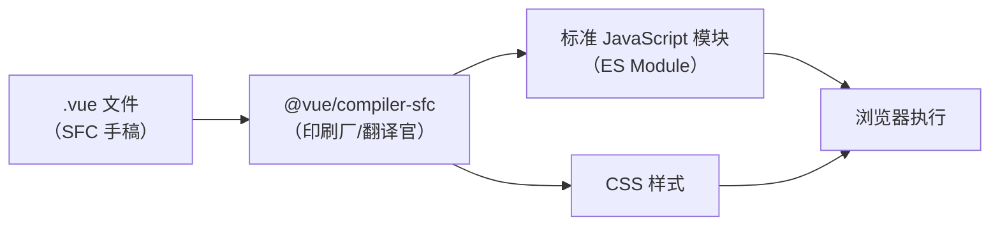
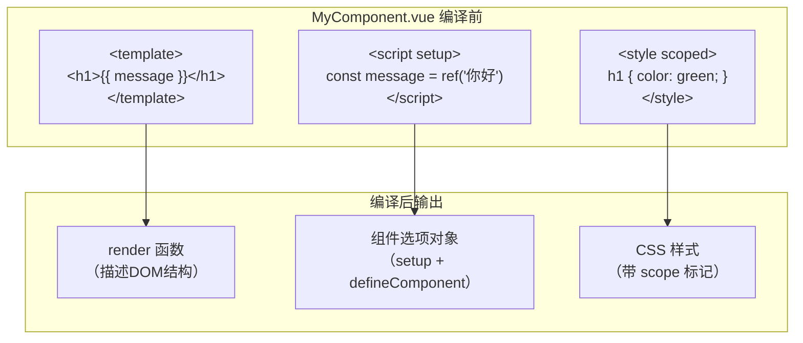
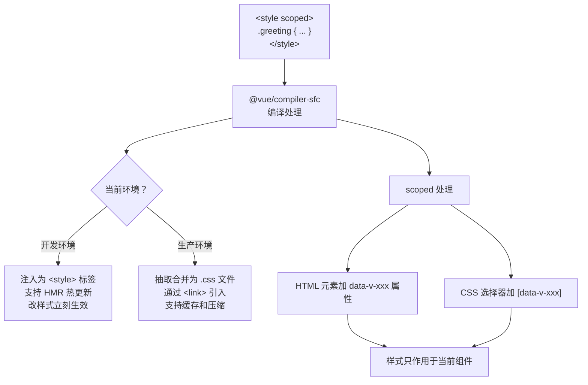
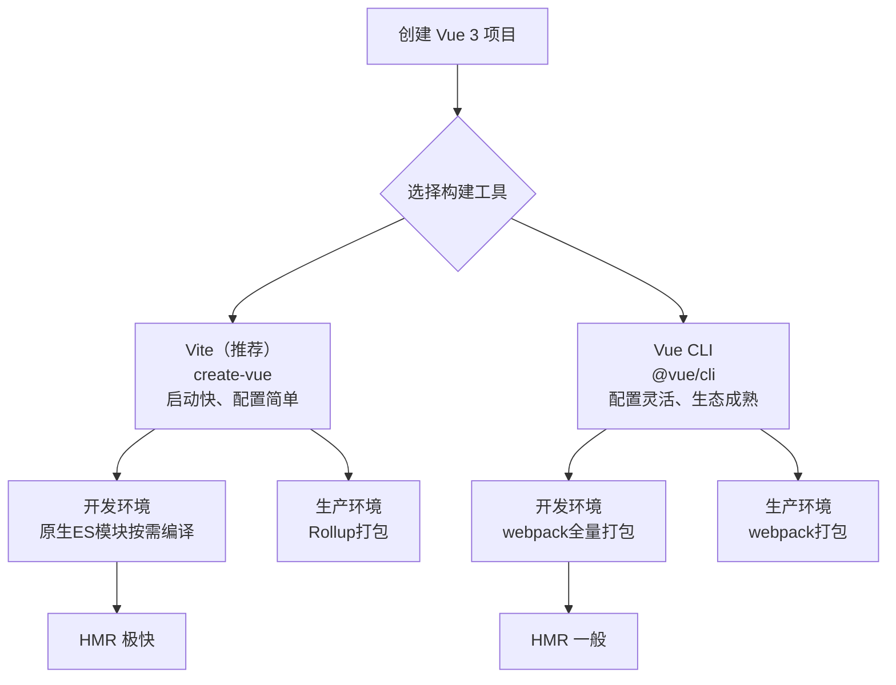

扫描[二维码](https://api2.cmdragon.cn/upload/cmder/20250304_012821924.jpg)关注或者微信搜一搜：`编程智域 前端至全栈交流与成长`

[发现1000+提升效率与开发的AI工具和实用程序](https://tools.cmdragon.cn/zh/apps?category=ai_chat)：https://tools.cmdragon.cn/zh/apps?category=ai_chat

## 一、浏览器不认识vue文件？那咋办

你写了个`.vue`文件，兴冲冲丢给浏览器，结果浏览器一脸懵——它压根不认识这玩意儿。这就像你拿了一篇文言文给只懂英文的人看，人家当然看不懂嘛。

`.vue`文件是Vue框架自己定义的文件格式，专业术语叫**SFC（Single-File Component，单文件组件）**。一个典型的SFC长这样：

```vue
<!-- MyComponent.vue -->
<template>
  <div class="greeting">
    <h1>{{ message }}</h1>
    <button @click="changeMessage">换个说法</button>
  </div>
</template>

<script setup>
// 用 ref 声明一个响应式变量
import { ref } from "vue";

// message 是一个响应式字符串
const message = ref("你好，SFC！");

// 点击按钮时修改 message 的值
function changeMessage() {
  message.value = "我编译完就能跑啦！";
}
</script>

<style scoped>
.greeting {
  text-align: center;
  padding: 20px;
}

h1 {
  color: #42b883;
}
</style>
```

你看，一个文件里塞了`<template>`、`<script>`、`<style>`三个部分，HTML、JavaScript、CSS全写一块儿了。这对我们开发者来说特别方便——逻辑、视图、样式都在同一个文件里，改起来一目了然。但浏览器只认HTML、CSS、JavaScript这三种"官方语言"，`.vue`这种"方言"它可不管。

那咋办？得有个"翻译官"把`.vue`文件翻译成浏览器能懂的标准代码。这个翻译官就是**@vue/compiler-sfc**，Vue官方提供的SFC编译器。

打个比方：`.vue`文件就像作家的手稿，@vue/compiler-sfc就像印刷厂，印刷厂把手稿排版、印刷，变成读者能翻阅的正式出版物。手稿再好，不经过印刷厂，读者也看不到。

整个编译过程可以用下面这个流程图来理解：



编译后的SFC会变成一个**标准的JavaScript（ES）模块**。啥意思呢？就是编译完的代码跟你自己手写的`.js`文件没有本质区别，浏览器原生就支持ES模块的`import`和`export`语法，所以编译后的代码浏览器能直接跑。

这里有个关键点得记住：**编译后的SFC是一个标准的JavaScript（ES）模块**。这意味着它可以被其他模块`import`，也可以`export`自己的内容，跟普通的`.js`文件用法一模一样。

## 二、编译后长啥样？看看输出

光说"编译成JavaScript"可能还是有点抽象，咱直接看看编译完的代码到底长啥样。

还是拿上面那个`MyComponent.vue`举例，编译后大致会变成这样：

```javascript
// 编译后的 MyComponent.vue（简化版，方便理解）

import { ref, defineComponent } from "vue";

// ====== template 编译成 render 函数 ======
// 原来的 <template> 部分被编译成了一个渲染函数
import {
  createElementVNode as _createElementVNode,
  toDisplayString as _toDisplayString,
  openBlock as _openBlock,
  createElementBlock as _createElementBlock,
} from "vue";

function render(_ctx, _cache) {
  return (
    _openBlock(),
    _createElementBlock("div", { class: "greeting" }, [
      _createElementVNode("h1", null, _toDisplayString(_ctx.message), 1),
      _createElementVNode(
        "button",
        { onClick: _ctx.changeMessage },
        "换个说法",
      ),
    ])
  );
}

// ====== script 编译成组件选项对象 ======
// 原来的 <script setup> 部分变成了 setup 函数
const __sfc__ = defineComponent({
  setup(__props) {
    // message 是一个响应式字符串
    const message = ref("你好，SFC！");

    // 点击按钮时修改 message 的值
    function changeMessage() {
      message.value = "我编译完就能跑啦！";
    }

    // setup 返回的值会暴露给模板使用
    return { message, changeMessage };
  },
});

// 把 render 函数挂到组件对象上
__sfc__.render = render;

// ====== 导出组件 ======
export default __sfc__;
```

看出来了吧？编译器干了这几件事：

### template → render函数

原来的`<template>`里写的模板语法（`{{ message }}`、`@click`之类的），全部被翻译成了**JavaScript函数调用**。`render`函数就是干这个的——它用JavaScript代码来描述"页面长啥样"。

你写`<h1>{{ message }}</h1>`，编译器就帮你翻译成`_createElementVNode("h1", null, _toDisplayString(_ctx.message))`。意思一样，但形式从HTML模板变成了JavaScript函数调用。就像把中文"你好"翻译成英文"Hello"，意思没变，但表达方式变了。

### script → 组件选项对象

`<script setup>`里的代码被包装进了一个`setup()`函数里，然后通过`defineComponent()`创建了一个标准的Vue组件选项对象。你在`<script setup>`里声明的变量和函数，都会通过`return`暴露给模板使用。

### style → CSS

`<style>`部分会被单独提取出来，这个咱们下一节细说。

### 实际查看编译结果

如果你想亲眼看看编译后的代码长啥样，Vue官方提供了一个在线工具——**Vue SFC Playground**（https://play.vuejs.org/）。你在左边写`.vue`代码，右边就能实时看到编译后的JavaScript输出，特别直观。



## 三、style标签——开发和生产两种待遇

`<style>`标签在编译过程中的待遇，开发和生产环境差别还挺大的。就像同一个人，上班穿工装方便干活，下班换休闲装舒服自在——场景不同，打扮不同。

### 开发环境：注入style标签

开发的时候，你改了个CSS，肯定希望浏览器立刻就能看到效果对吧？所以开发环境下，编译器会把`<style>`里的CSS内容直接注入到页面的一个原生`<style>`标签里。

```javascript
// 开发环境下，style 被注入成 <style> 标签
// 类似于下面这段代码的效果：

const styleEl = document.createElement("style");
styleEl.textContent = `
  .greeting[data-v-abc123] {
    text-align: center;
    padding: 20px;
  }
  h1[data-v-abc123] {
    color: #42b883;
  }
`;
document.head.appendChild(styleEl);
```

这样做的好处是**支持热更新（HMR）**——你改了样式，浏览器不用刷新页面就能立刻看到变化。开发体验丝滑得很。

### 生产环境：抽取成CSS文件

到了生产环境，情况就不一样了。编译器会把所有组件的CSS抽取出来，合并成一个或几个单独的`.css`文件，最后通过`<link>`标签引入。

```html
<!-- 生产环境下，样式被抽取成独立的 CSS 文件 -->
<link rel="stylesheet" href="/assets/index.a1b2c3d4.css" />
```

为啥要这么干？因为生产环境追求的是**性能**。把CSS抽成单独的文件有几个好处：

- **浏览器缓存**：CSS文件不变的话，用户再次访问不用重新下载
- **减少请求数**：多个组件的样式合并成一个文件，比每个组件单独请求要高效
- **并行加载**：CSS和JS可以同时下载，页面渲染更快

### 为什么要区分两种环境

简单说就是：**开发时图方便，生产时图性能**。

开发时你需要频繁改样式，HMR让你改完立刻看到效果，不用刷新页面，效率杠杠的。生产时用户不会频繁改代码，他们要的是页面加载快，所以把CSS抽出来做缓存和压缩才是正道。

### scoped样式的实现原理

Vue的`scoped`属性是个好东西——它让组件的样式只作用于自己，不会"泄漏"到其他组件。那它是咋实现的呢？

原理其实很简单：**给元素加一个唯一的自定义属性，CSS选择器也加上对应的属性选择器**。

```vue
<!-- 编译前：MyComponent.vue -->
<template>
  <div class="greeting">
    <h1>{{ message }}</h1>
  </div>
</template>

<style scoped>
.greeting {
  text-align: center;
}
h1 {
  color: #42b883;
}
</style>
```

编译后：

```html
<!-- 编译后：HTML 多了 data-v-abc123 属性 -->
<div class="greeting" data-v-abc123>
  <h1 data-v-abc123>你好，SFC！</h1>
</div>
```

```css
/* 编译后：CSS 选择器加了属性选择器 */
.greeting[data-v-abc123] {
  text-align: center;
}
h1[data-v-abc123] {
  color: #42b883;
}
```

看到了吧？编译器给这个组件的每个HTML元素都加了一个`data-v-abc123`（`abc123`是根据文件内容生成的哈希值，每个组件都不一样），然后CSS选择器也加上了`[data-v-abc123]`。这样一来，`.greeting[data-v-abc123]`只会匹配带有`data-v-abc123`属性的`.greeting`元素，其他组件的`.greeting`不受影响。

就像给每个组件发了一个"工牌"，CSS选择器只认带自己工牌的元素，别人的工牌它不认。

下面这个流程图展示了style在两种环境下的不同处理方式：



## 四、怎么导入SFC？就像导入普通模块

前面说了，编译后的SFC是一个标准的ES模块，所以导入它跟导入普通JavaScript模块没啥区别。

```vue
<!-- App.vue -->
<template>
  <div>
    <!-- 像使用普通组件一样使用 MyComponent -->
    <MyComponent />
  </div>
</template>

<script setup>
// 导入编译后的 SFC，跟导入普通 JS 模块一模一样
import MyComponent from "./MyComponent.vue";
</script>
```

你看，`import MyComponent from './MyComponent.vue'`，这跟`import { ref } from 'vue'`有啥本质区别？没有！都是导入一个ES模块嘛。

编译器在背后帮你把`.vue`文件编译成了JS模块，然后导出了一个默认的组件对象。你`import`进来的就是这个组件对象，直接就能用。

如果你用的是选项式API，注册方式也是一样的：

```vue
<!-- App.vue（选项式API写法） -->
<template>
  <div>
    <MyComponent />
  </div>
</template>

<script>
// 导入 SFC 组件
import MyComponent from "./MyComponent.vue";

export default {
  // 在 components 选项中注册
  components: {
    MyComponent,
  },
};
</script>
```

而在`<script setup>`中，你只需要`import`进来就行，不用手动注册——`<script setup>`会自动帮你把导入的组件注册上，省事多了。

再来看一个稍微复杂点的例子，导入多个组件：

```vue
<!-- Dashboard.vue -->
<template>
  <div class="dashboard">
    <!-- 三个组件直接用，不用手动注册 -->
    <HeaderBar />
    <SideMenu />
    <MainContent />
  </div>
</template>

<script setup>
// 一次性导入三个 SFC 组件
// 在 <script setup> 中，导入即注册，直接就能在模板里用
import HeaderBar from "./HeaderBar.vue";
import SideMenu from "./SideMenu.vue";
import MainContent from "./MainContent.vue";
</script>

<style scoped>
.dashboard {
  display: flex;
  min-height: 100vh;
}
</style>
```

就这么简单。编译器帮你把`.vue`文件变成了标准模块，你该怎么`import`就怎么`import`，该怎么用就怎么用。

## 五、构建工具——Vite和Vue CLI

`.vue`文件需要编译才能跑，那谁来调用编译器呢？这就是**构建工具**的活儿了。Vue生态里主要有两个构建工具：**Vite**和**Vue CLI**。

### Vite：新一代构建工具

Vite是Vue作者尤雨溪主导开发的新一代构建工具，名字取自法语"快"的意思（发音/veet/，不是"维特"哈）。

Vite的核心思路是：**开发时利用浏览器原生ES模块，按需编译**。啥意思呢？传统工具是先把所有代码编译打包完，再启动开发服务器。Vite不一样，它先启动服务器，等你访问页面时，才按需编译你用到的模块。

```bash
# 用 create-vue 创建一个 Vite + Vue 3 项目
npm create vue@latest my-project

# 进入项目目录
cd my-project

# 安装依赖
npm install

# 启动开发服务器
npm run dev
```

启动速度那叫一个快——不管项目多大，启动时间基本都在几百毫秒以内。因为Vite不用提前编译所有文件，浏览器请求哪个模块，它才编译哪个。

### Vue CLI：老牌构建工具

Vue CLI是基于webpack封装的构建工具，Vue 2时代的主力军。它的特点是**配置灵活、插件丰富**，但启动速度比较慢，因为webpack需要先把所有模块打包完才能启动。

```bash
# 用 Vue CLI 创建项目（Vue 2 时代的主流方式）
npm install -g @vue/cli
vue create my-project
```

Vue CLI现在进入了**维护模式**，官方不再积极开发新功能了。如果你还在用Vue CLI，官方建议迁移到Vite。

### Vue官方脚手架：create-vue

现在Vue官方推荐的创建项目方式是**create-vue**，它默认使用Vite作为构建工具：

```bash
npm create vue@latest
```

运行后会让你选择要不要加TypeScript、Router、Pinia之类的，选完之后自动生成一个基于Vite的Vue 3项目。

### Vite vs Vue CLI 对比

| 特性         | Vite                | Vue CLI                  |
| ------------ | ------------------- | ------------------------ |
| 底层引擎     | 原生ES模块 + Rollup | webpack                  |
| 开发启动速度 | 极快（毫秒级）      | 较慢（随项目增大而变慢） |
| 热更新速度   | 极快                | 一般                     |
| 配置复杂度   | 简单，约定优于配置  | 灵活，但配置项多         |
| 生态成熟度   | 快速成长中          | 非常成熟                 |
| 官方推荐     | ✅ 推荐             | ⚠️ 维护模式              |
| 生产打包     | Rollup              | webpack                  |
| 适用场景     | 新项目首选          | 老项目维护               |

打个比方：**Vite像高铁，快但路线相对固定；Vue CLI像自驾游，慢但想去哪去哪**。高铁快是因为它有专用轨道（原生ES模块），自驾慢是因为啥路都能走但得自己规划路线（webpack配置）。

### 如何选择

- **新项目**：毫不犹豫选Vite + create-vue，这是官方推荐方案
- **老项目**：如果已经在用Vue CLI且运行稳定，没必要非迁不可；但如果启动速度已经让你抓狂了，可以考虑迁移到Vite
- **特殊需求**：如果你的项目依赖某些webpack特有的loader或插件，暂时还没法替换，那就继续用Vue CLI

Vite迁移指南可以参考官方文档，大部分项目迁移起来并不复杂。



## 课后 Quiz

### 问题1：为什么浏览器不能直接运行.vue文件？

**答案解析**：

浏览器只能识别三种核心语言：HTML、CSS和JavaScript。`.vue`文件是Vue框架自定义的文件格式（SFC），它把`<template>`、`<script>`、`<style>`三种不同类型的代码放在同一个文件里，这种格式浏览器是不认识的。就像你拿一份中英混写的文章给只懂英文的人看，他可能认识其中一些单词，但整体意思理解不了。

必须通过`@vue/compiler-sfc`编译器，把`.vue`文件中的`<template>`编译成`render`函数，`<script>`编译成组件选项对象，`<style>`编译成CSS，最终输出浏览器能直接执行的标准JavaScript模块和CSS样式。

### 问题2：scoped样式是怎么实现样式隔离的？如果子组件的根元素也想被父组件的scoped样式影响，该怎么办？

**答案解析**：

scoped样式的实现原理分两步：

1. 编译器给当前组件模板中的每个HTML元素添加一个唯一的自定义属性，比如`data-v-abc123`（`abc123`是根据文件内容生成的哈希值）
2. 编译器把CSS选择器也加上对应的属性选择器，比如`.greeting`变成`.greeting[data-v-abc123]`

这样，CSS只会匹配同时满足类名和属性选择器的元素，从而实现样式隔离。

但有个细节：**父组件的scoped样式可以影响子组件的根元素**。这是因为子组件的根元素会同时拥有父组件的scoped属性和自己的scoped属性。如果你想让父组件的scoped样式影响子组件的根元素，直接写就行，不需要额外操作。但如果想影响子组件内部更深层的元素，就需要用`:deep()`选择器（以前叫`::v-deep`或`/deep/`）来穿透scoped限制。

### 问题3：Vite开发环境为什么启动那么快？它和webpack的核心区别是什么？

**答案解析**：

Vite快的核心原因是**利用了浏览器原生ES模块**。

webpack的工作方式是：启动时把所有模块打包成一个或几个bundle，然后才启动开发服务器。项目越大，打包时间越长，启动越慢。

Vite的工作方式完全不同：它先启动开发服务器（几乎瞬间完成），当浏览器请求某个模块时，Vite才按需编译那个模块并返回。因为不需要提前打包所有代码，所以启动速度跟项目大小几乎无关。

打个比方：webpack像是"先做完所有菜再开餐"，Vite像是"点一个菜做一个菜"。前者需要等很久才能开吃，后者坐下就能点菜。生产环境下Vite用Rollup打包，这时候两者都需要完整编译，速度差异就不那么明显了。

## 常见报错解决方案

### 报错1：`Failed to resolve component: xxx`

**产生原因**：你在模板里用了某个组件，但是没有正确导入或注册。在`<script setup>`中，组件需要通过`import`导入后才能在模板中使用；在选项式API中，需要在`components`选项中注册。

**解决办法**：

```vue
<!-- 错误写法：没有导入组件 -->
<template>
  <MyComponent />
</template>

<script setup>
// 忘记 import 了！
</script>

<!-- 正确写法：导入组件 -->
<template>
  <MyComponent />
</template>

<script setup>
// 在 <script setup> 中，import 即注册
import MyComponent from "./MyComponent.vue";
</script>
```

**预防建议**：养成习惯，先写`import`再写模板。如果用的是VS Code + Volar插件，未注册的组件会有红色波浪线提示，注意看编辑器的警告信息。

### 报错2：`[plugin:vite:vue] Error: <script> and <script setup> must be ordered consistently`

**产生原因**：在同一个`.vue`文件中，`<script>`和`<script setup>`标签的顺序不一致。比如有的组件把`<script setup>`写在`<script>`前面，有的写在后面，Vue编译器要求同一个文件中这两个标签的相对位置必须一致。

**解决办法**：统一标签顺序，推荐把`<script setup>`放在`<script>`前面：

```vue
<!-- 推荐：script setup 在前 -->
<script setup>
// 组合式API逻辑
</script>

<script>
// 仅用于需要 Options API 的场景，比如 inheritAttrs: false
export default {
  inheritAttrs: false,
};
</script>

<template>
  <!-- 模板内容 -->
</template>

<style scoped>
/* 样式 */
</style>
```

**预防建议**：团队内约定好SFC中各标签的顺序，推荐顺序为`<script setup>` → `<script>` → `<template>` → `<style>`。也可以配置ESLint的`vue/component-tags-order`规则来自动检查。

### 报错3：`Module not found: Can't resolve './xxx.vue'`

**产生原因**：导入路径写错了，或者文件扩展名不对。常见情况包括：文件名大小写不一致（Windows不区分大小写但Linux区分）、路径拼写错误、忘记写`.vue`扩展名。

**解决办法**：

```javascript
// 错误：文件名大小写不对
import MyComponent from "./mycomponent.vue"; // 实际文件名是 MyComponent.vue

// 正确：大小写与实际文件名一致
import MyComponent from "./MyComponent.vue";

// 错误：路径拼写错误
import Header from "./HeaerBar.vue"; // 实际是 HeaderBar.vue

// 正确：路径拼写正确
import Header from "./HeaderBar.vue";
```

**预防建议**：文件命名遵循统一规范（推荐PascalCase），导入时直接复制文件名避免手误。Vite默认支持省略`.vue`扩展名，但显式写上更清晰。另外，部署到生产环境前务必在Linux环境测试，因为Linux对文件名大小写敏感，Windows上能跑的路径在Linux上可能就报错了。

参考链接：https://vuejs.org/guide/scaling-up/sfc.html

余下文章内容请点击跳转至 个人博客页面 或者 扫描[二维码](https://api2.cmdragon.cn/upload/cmder/20250304_012821924.jpg)关注或者微信搜一搜：`编程智域 前端至全栈交流与成长`，阅读完整的文章：[vue文件怎么变成浏览器能跑的代码？SFC编译和工具链全揭秘](https://blog.cmdragon.cn/posts/o1p2q3r4s5t6u7v8w9x0y1z2a3b4c5d6/)

<details>
<summary>往期文章归档</summary>

- [Vue 3 静态与动态 Props 如何传递？TypeScript 类型约束有何必要？](https://blog.cmdragon.cn/posts/94ab48753b64780ca3ab7a7115ae8522/)
- [Vue 3中组件局部注册的优势与实现方式如何？](https://blog.cmdragon.cn/posts/dbf576e744870f6de26fd8a2e03e47da/)
- [如何在Vue3中优化生命周期钩子性能并规避常见陷阱？](https://blog.cmdragon.cn/posts/12d98b3b9ccd6c19a1b169d720ac5c80/)
- [Vue 3 Composition API生命周期钩子：如何实现从基础理解到高阶复用？](https://blog.cmdragon.cn/posts/8884e2b70287fcb263c57648eeb27419/)
- [Vue 3生命周期钩子实战指南：如何正确选择onMounted、onUpdated与onUnmounted的应用场景？](https://blog.cmdragon.cn/posts/883c6dbc50ae4183770a4462e0b8ae4d/)
- [Vue 3中生命周期钩子与响应式系统如何实现协同工作？](https://blog.cmdragon.cn/posts/70dad360ffa9dce14d0d69611b8cb019/)
- [Vue 3组件生命周期钩子的执行顺序与使用场景是什么？](https://blog.cmdragon.cn/posts/db44294a78dc9f666f67b053f6c83567/)
- [Vue组件全局注册与局部注册如何抉择？](https://blog.cmdragon.cn/posts/43ead630ea17da65d99ad2eb8188e472/)
- [Vue3组件化开发中，Props与Emits如何实现数据流转与事件协作？](https://blog.cmdragon.cn/posts/8cff7d2df113da66ea7be560c4d1d22a/)
- [Vue 3模板引用如何与其他特性协同实现复杂交互？](https://blog.cmdragon.cn/posts/331bf75d114ab09116eadfcdca602b58/)
- [Vue 3 v-for中模板引用如何实现高效管理与动态控制？](https://blog.cmdragon.cn/posts/cb380897ddc3578b180ecf8843c774c1/)
- [Vue 3的defineExpose：如何突破script setup组件默认封装，实现精准的父子通讯？](https://blog.cmdragon.cn/posts/202ae0f4acde7128e0e31baf63732fb5/)
- [Vue 3模板引用的生命周期时机如何把握？常见陷阱该如何避免？](https://blog.cmdragon.cn/posts/7d2a0f6555ecbe92afd7d2491c427463/)
- [Vue 3模板引用如何实现父组件与子组件的高效交互？](https://blog.cmdragon.cn/posts/3fb7bdd84128b7efaaa1c979e1f28dee/)
- [Vue中为何需要模板引用？又如何高效实现DOM与组件实例的直接访问？](https://blog.cmdragon.cn/posts/23f3464ba16c7054b4783cded50c04c6/)

</details>

<details>
<summary>免费好用的热门在线工具</summary>

- [多直播聚合器 - 应用商店 | By cmdragon](https://tools.cmdragon.cn/zh/apps/multi-live-aggregator)
- [Proto文件生成器 - 应用商店 | By cmdragon](https://tools.cmdragon.cn/zh/apps/proto-file-generator)
- [图片转粒子 - 应用商店 | By cmdragon](https://tools.cmdragon.cn/zh/apps/image-to-particles)
- [视频下载器 - 应用商店 | By cmdragon](https://tools.cmdragon.cn/zh/apps/video-downloader)
- [文件格式转换器 - 应用商店 | By cmdragon](https://tools.cmdragon.cn/zh/apps/file-converter)
- [M3U8在线播放器 - 应用商店 | By cmdragon](https://tools.cmdragon.cn/zh/apps/m3u8-player)
- [快图设计 - 应用商店 | By cmdragon](https://tools.cmdragon.cn/zh/apps/quick-image-design)
- [高级文字转图片转换器 - 应用商店 | By cmdragon](https://tools.cmdragon.cn/zh/apps/text-to-image-advanced)
- [RAID 计算器 - 应用商店 | By cmdragon](https://tools.cmdragon.cn/zh/apps/raid-calculator)
- [在线PS - 应用商店 | By cmdragon](https://tools.cmdragon.cn/zh/apps/photoshop-online)
- [Mermaid 在线编辑器 - 应用商店 | By cmdragon](https://tools.cmdragon.cn/zh/apps/mermaid-live-editor)
- [数学求解计算器 - 应用商店 | By cmdragon](https://tools.cmdragon.cn/zh/apps/math-solver-calculator)
- [智能提词器 - 应用商店 | By cmdragon](https://tools.cmdragon.cn/zh/apps/smart-teleprompter)
- [魔法简历 - 应用商店 | By cmdragon](https://tools.cmdragon.cn/zh/apps/magic-resume)
- [Image Puzzle Tool - 图片拼图工具 | By cmdragon](https://tools.cmdragon.cn/zh/apps/image-puzzle-tool)
- [字幕下载工具 - 应用商店 | By cmdragon](https://tools.cmdragon.cn/zh/apps/subtitle-downloader)
- [歌词生成工具 - 应用商店 | By cmdragon](https://tools.cmdragon.cn/zh/apps/lyrics-generator)
- [网盘资源聚合搜索 - 应用商店 | By cmdragon](https://tools.cmdragon.cn/zh/apps/cloud-drive-search)
- [ASCII字符画生成器 - 应用商店 | By cmdragon](https://tools.cmdragon.cn/zh/apps/ascii-art-generator)
- [JSON Web Tokens 工具 - 应用商店 | By cmdragon](https://tools.cmdragon.cn/zh/apps/jwt-tool)
- [Bcrypt 密码工具 - 应用商店 | By cmdragon](https://tools.cmdragon.cn/zh/apps/bcrypt-tool)
- [GIF 合成器 - 应用商店 | By cmdragon](https://tools.cmdragon.cn/zh/apps/gif-composer)
- [GIF 分解器 - 应用商店 | By cmdragon](https://tools.cmdragon.cn/zh/apps/gif-decomposer)
- [文本隐写术 - 应用商店 | By cmdragon](https://tools.cmdragon.cn/zh/apps/text-steganography)
- [CMDragon 在线工具 - 高级AI工具箱与开发者套件 | 免费好用的在线工具](https://tools.cmdragon.cn/zh)
- [应用商店 - 发现1000+提升效率与开发的AI工具和实用程序 | 免费好用的在线工具](https://tools.cmdragon.cn/zh/apps?category=trending)
- [CMDragon 更新日志 - 最新更新、功能与改进 | 免费好用的在线工具](https://tools.cmdragon.cn/zh/changelog)
- [支持我们 - 成为赞助者 | 免费好用的在线工具](https://tools.cmdragon.cn/zh/sponsor)
- [AI文本生成图像 - 应用商店 | 免费好用的在线工具](https://tools.cmdragon.cn/zh/apps/text-to-image-ai)
- [临时邮箱 - 应用商店 | 免费好用的在线工具](https://tools.cmdragon.cn/zh/apps/temp-email)
- [二维码解析器 - 应用商店 | 免费好用的在线工具](https://tools.cmdragon.cn/zh/apps/qrcode-parser)
- [文本转思维导图 - 应用商店 | 免费好用的在线工具](https://tools.cmdragon.cn/zh/apps/text-to-mindmap)
- [正则表达式可视化工具 - 应用商店 | 免费好用的在线工具](https://tools.cmdragon.cn/zh/apps/regex-visualizer)
- [文件隐写工具 - 应用商店 | 免费好用的在线工具](https://tools.cmdragon.cn/zh/apps/steganography-tool)
- [IPTV 频道探索器 - 应用商店 | 免费好用的在线工具](https://tools.cmdragon.cn/zh/apps/iptv-explorer)
- [快传 - 应用商店 | By cmdragon](https://tools.cmdragon.cn/zh/apps/snapdrop)
- [随机抽奖工具 - 应用商店 | 免费好用的在线工具](https://tools.cmdragon.cn/zh/apps/lucky-draw)
- [动漫场景查找器 - 应用商店 | 免费好用的在线工具](https://tools.cmdragon.cn/zh/apps/anime-scene-finder)
- [时间工具箱 - 应用商店 | 免费好用的在线工具](https://tools.cmdragon.cn/zh/apps/time-toolkit)
- [网速测试 - 应用商店 | 免费好用的在线工具](https://tools.cmdragon.cn/zh/apps/speed-test)
- [AI 智能抠图工具 - 应用商店 | 免费好用的在线工具](https://tools.cmdragon.cn/zh/apps/background-remover)
- [背景替换工具 - 应用商店 | 免费好用的在线工具](https://tools.cmdragon.cn/zh/apps/background-replacer)
- [艺术二维码生成器 - 应用商店 | 免费好用的在线工具](https://tools.cmdragon.cn/zh/apps/artistic-qrcode)
- [Open Graph 元标签生成器 - 应用商店 | 免费好用的在线工具](https://tools.cmdragon.cn/zh/apps/open-graph-generator)
- [图像对比工具 - 应用商店 | 免费好用的在线工具](https://tools.cmdragon.cn/zh/apps/image-comparison)
- [图片压缩专业版 - 应用商店 | 免费好用的在线工具](https://tools.cmdragon.cn/zh/apps/image-compressor)
- [密码生成器 - 应用商店 | 免费好用的在线工具](https://tools.cmdragon.cn/zh/apps/password-generator)
- [SVG优化器 - 应用商店 | 免费好用的在线工具](https://tools.cmdragon.cn/zh/apps/svg-optimizer)
- [调色板生成器 - 应用商店 | 免费好用的在线工具](https://tools.cmdragon.cn/zh/apps/color-palette)
- [在线节拍器 - 应用商店 | 免费好用的在线工具](https://tools.cmdragon.cn/zh/apps/online-metronome)
- [IP归属地查询 - 应用商店 | By cmdragon](https://tools.cmdragon.cn/zh/apps/ip-geolocation)
- [CSS网格布局生成器 - 应用商店 | 免费好用的在线工具](https://tools.cmdragon.cn/zh/apps/css-grid-layout)
- [邮箱验证工具 - 应用商店 | 免费好用的在线工具](https://tools.cmdragon.cn/zh/apps/email-validator)
- [书法练习字帖 - 应用商店 | 免费好用的在线工具](https://tools.cmdragon.cn/zh/apps/calligraphy-practice)
- [金融计算器套件 - 应用商店 | 免费好用的在线工具](https://tools.cmdragon.cn/zh/apps/finance-calculator-suite)
- [中国亲戚关系计算器 - 应用商店 | 免费好用的在线工具](https://tools.cmdragon.cn/zh/apps/chinese-kinship-calculator)
- [Protocol Buffer 工具箱 - 应用商店 | 免费好用的在线工具](https://tools.cmdragon.cn/zh/apps/protobuf-toolkit)
- [IP归属地查询 - 应用商店 | 免费好用的在线工具](https://tools.cmdragon.cn/zh/apps/ip-geolocation)
- [图片无损放大 - 应用商店 | 免费好用的在线工具](https://tools.cmdragon.cn/zh/apps/image-upscaler)
- [文本比较工具 - 应用商店 | 免费好用的在线工具](https://tools.cmdragon.cn/zh/apps/text-compare)
- [IP批量查询工具 - 应用商店 | 免费好用的在线工具](https://tools.cmdragon.cn/zh/apps/ip-batch-lookup)
- [域名查询工具 - 应用商店 | 免费好用的在线工具](https://tools.cmdragon.cn/zh/apps/domain-finder)
- [DNS工具箱 - 应用商店 | 免费好用的在线工具](https://tools.cmdragon.cn/zh/apps/dns-toolkit)
- [网站图标生成器 - 应用商店 | 免费好用的在线工具](https://tools.cmdragon.cn/zh/apps/favicon-generator)
- [XML Sitemap](https://tools.cmdragon.cn/sitemap_index.xml)

</details>
