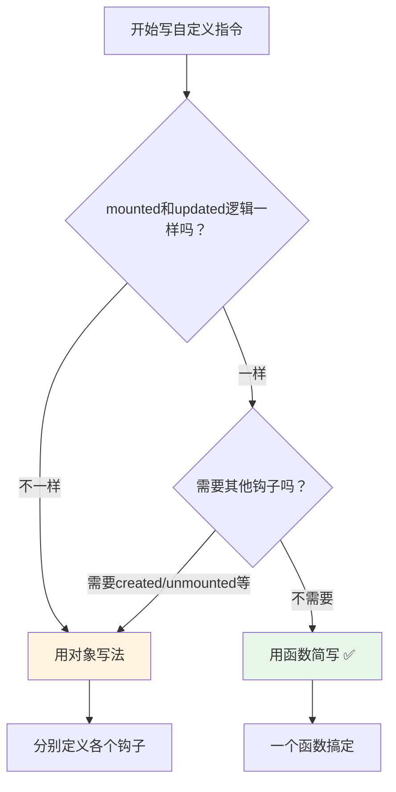
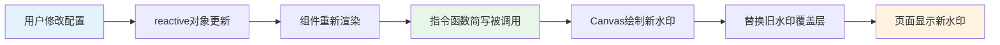

扫描[二维码](https://api2.cmdragon.cn/upload/cmder/20250304_012821924.jpg)关注或者微信搜一搜：`编程智域 前端至全栈交流与成长`

[发现1000+提升效率与开发的AI工具和实用程序](https://tools.cmdragon.cn/zh/apps?category=ai_chat)：https://tools.cmdragon.cn/

## 一、写了一堆钩子，结果mounted和updated做的是同一件事？

前面几篇文章我们聊了自定义指令的钩子函数和binding对象，知道了怎么在各个时机操作DOM、怎么拿到指令传进来的值。但写多了你就会发现一个很尴尬的事儿——好多指令，mounted里写的代码和updated里写的代码，简直一模一样。

就拿一个最简单的`v-color`指令来说吧，挂载的时候给元素设个颜色，更新的时候还得设同样的颜色：

```javascript
const vColor = {
  mounted(el, binding) {
    el.style.color = binding.value;
  },
  updated(el, binding) {
    el.style.color = binding.value;
  },
};
```

咱就是说，`el.style.color = binding.value`这行代码写了两遍，mounted写一遍，updated又写一遍，复制粘贴都嫌烦。而且这种场景不是个例，很多指令都是这样——挂载和更新干的是同一件事，其他钩子根本用不上。

那可不，Vue 3的设计者也注意到了这个问题，所以给我们准备了一个偷懒的写法：**函数简写**。

## 二、函数简写：一个函数搞定mounted和updated

### 2.1 语法长啥样

函数简写的语法特别简单，你不需要写一个包含多个钩子的对象，直接把一个函数赋给指令就行：

```javascript
app.directive("color", (el, binding) => {
  // 这个函数会在 mounted 和 updated 时都被调用
  el.style.color = binding.value;
});
```

如果你是在`<script setup>`里用局部指令，写法也差不多：

```javascript
const vColor = (el, binding) => {
  el.style.color = binding.value;
};
```

就这么简单。这个函数会在`mounted`和`updated`两个时机都被调用，效果跟你在对象里分别写`mounted`和`updated`完全一样。

### 2.2 两种写法对比

来，直接上对比，差距一目了然：

**对象写法**（啰嗦版）：

```javascript
const vColor = {
  mounted(el, binding) {
    el.style.color = binding.value;
  },
  updated(el, binding) {
    el.style.color = binding.value;
  },
};
```

**函数简写**（清爽版）：

```javascript
const vColor = (el, binding) => {
  el.style.color = binding.value;
};
```

6行代码变3行，少了一半，而且逻辑更集中，一眼就能看明白这个指令干啥的。说白了，函数简写就是一种语法糖，让你少写重复代码。

### 2.3 什么时候该用，什么时候不该用

函数简写虽然好用，但也不是万能的，得看场景：

**适合用函数简写的情况**：

- 指令只需要在`mounted`和`updated`做同样的事
- 不需要清理资源（没有事件监听器要移除、没有定时器要清除）
- 不需要在`created`阶段做初始化

**不该用函数简写的情况**：

- 需要在`unmounted`里清理资源（比如移除事件监听器、取消定时器）
- 需要在`created`阶段做某些初始化工作
- `mounted`和`updated`的逻辑不一样

举个反例，如果你的指令在`mounted`里绑定了事件，那`unmounted`里必须解绑，这时候就得老老实实用对象写法：

```javascript
const vClickOutside = {
  mounted(el, binding) {
    el._handler = (e) => {
      if (!el.contains(e.target)) {
        binding.value(e);
      }
    };
    document.addEventListener("click", el._handler);
  },
  unmounted(el) {
    document.removeEventListener("click", el._handler);
  },
};
```

这种情况下函数简写就搞不定了，因为函数简写只覆盖`mounted`和`updated`，根本管不到`unmounted`。

下面这个流程图帮你快速判断该用哪种写法：



## 三、对象字面量：一个指令传多个值

### 3.1 一个值不够用怎么办

前面我们用指令的时候，基本上都是传一个值，比如`v-color="'red'"`、`v-focus`。但实际开发中，一个值经常不够用。

比如说你想做一个水印指令`v-watermark`，光传个文字内容哪够啊？水印的颜色、字号、旋转角度……这些全都是可配置的。你要是为每个配置项都写一个指令，那不得疯掉？

这时候**对象字面量**就派上用场了。

### 3.2 语法和原理

对象字面量的用法很简单，就是在指令值的位置写一个JavaScript对象表达式：

```html
<div v-demo="{ color: 'white', text: 'hello!' }"></div>
```

然后在指令里面，`binding.value`拿到的就是整个对象：

```javascript
app.directive("demo", (el, binding) => {
  console.log(binding.value.color); // => "white"
  console.log(binding.value.text); // => "hello!"
});
```

原理其实很好理解——指令的值本身就是一个JavaScript表达式，`v-demo="1 + 1"`里`binding.value`是`2`，那`v-demo="{ color: 'white', text: 'hello!' }"`里`binding.value`自然就是那个对象了。Vue不会对它做什么特殊处理，就是原样传给你。

### 3.3 实际示例：v-watermark水印指令

来个实际的例子，做一个水印指令，支持配置文字内容、颜色和字号：

```javascript
app.directive("watermark", (el, binding) => {
  const { text, color, fontSize } = binding.value;
  // 创建水印覆盖层
  const overlay = document.createElement("div");
  overlay.style.position = "absolute";
  overlay.style.top = "0";
  overlay.style.left = "0";
  overlay.style.width = "100%";
  overlay.style.height = "100%";
  overlay.style.pointerEvents = "none";
  overlay.style.backgroundImage = `url("data:image/svg+xml,${encodeURIComponent(
    `<svg xmlns='http://www.w3.org/2000/svg' width='200' height='150'>
      <text x='50%' y='50%' font-size='${fontSize || 16}'
        fill='${color || "rgba(0,0,0,0.1)"}'
        text-anchor='middle' dominant-baseline='middle'
        transform='rotate(-30, 100, 75)'>
        ${text || "水印"}
      </text>
    </svg>`,
  )}")`;
  overlay.style.backgroundRepeat = "repeat";
  // 确保父元素有定位
  if (getComputedStyle(el).position === "static") {
    el.style.position = "relative";
  }
  // 移除旧水印
  const oldOverlay = el.querySelector("[data-watermark]");
  if (oldOverlay) oldOverlay.remove();
  overlay.setAttribute("data-watermark", "");
  el.appendChild(overlay);
});
```

模板里这样用：

```html
<div
  v-watermark="{ text: '机密文件', color: 'rgba(0,0,0,0.1)', fontSize: '16px' }"
  style="width: 500px; height: 300px; border: 1px solid #ccc;"
>
  这是一份机密文件的内容
</div>
```

你看，一个指令就能传三个配置项，而且想加多少就加多少，完全不受限制。

### 3.4 对象字面量传参的注意事项

用对象字面量传参有几个小细节要注意：

**第一，属性名要对应好**。你在模板里写`{ text: 'xxx' }`，指令里就得用`binding.value.text`来取，名字得对上号，别写错。

**第二，响应式数据也能传**。对象字面量里的值可以是响应式数据：

```html
<div v-watermark="{ text: watermarkText, color: watermarkColor }"></div>
```

当`watermarkText`或`watermarkColor`变化时，指令的`updated`（或者函数简写）会被重新调用，你就能拿到最新的值。

**第三，别忘了解构默认值**。用户可能不会传所有配置项，所以取值的时候最好给个默认值：

```javascript
const {
  text = "水印",
  color = "rgba(0,0,0,0.1)",
  fontSize = "16px",
} = binding.value;
```

这样即使用户只传了`{ text: '机密' }`，其他配置也有合理的默认值，不会报错。

## 四、函数简写+对象字面量的组合拳

函数简写和对象字面量这两个特性不是互斥的，它们可以一起用，而且配合起来特别丝滑。

### 4.1 v-style指令：接收样式对象，mounted和updated都应用

来做一个`v-style`指令，接收一个样式对象，在`mounted`和`updated`时都把样式应用到元素上：

```javascript
const vStyle = (el, binding) => {
  const styles = binding.value;
  Object.keys(styles).forEach((key) => {
    el.style[key] = styles[key];
  });
};
```

模板中使用：

```html
<template>
  <div v-style="{ color: textColor, fontSize: '20px', fontWeight: 'bold' }">
    这段文字有多个样式
  </div>
  <button @click="textColor = textColor === 'red' ? 'blue' : 'red'">
    切换颜色
  </button>
</template>

<script setup>
  import { ref } from "vue";

  const textColor = ref("red");
</script>
```

点按钮切换颜色的时候，`textColor`变了，指令的函数简写会被重新调用（因为触发了updated），元素的颜色就跟着变了。整个过程你不用写`mounted`，不用写`updated`，一个函数+一个对象就搞定了。

### 4.2 为什么这个组合这么好用

想想看，如果没有函数简写，你得这样写：

```javascript
const vStyle = {
  mounted(el, binding) {
    const styles = binding.value;
    Object.keys(styles).forEach((key) => {
      el.style[key] = styles[key];
    });
  },
  updated(el, binding) {
    const styles = binding.value;
    Object.keys(styles).forEach((key) => {
      el.style[key] = styles[key];
    });
  },
};
```

同样的逻辑写两遍，而且一旦要改逻辑，两边都得改，漏改一个就出bug。函数简写+对象字面量组合起来，代码量少了一半，维护起来也轻松。

## 五、完整实战：v-watermark水印指令

最后来一个完整的实战案例，把函数简写和对象字面量都用上，做一个功能齐全的水印指令。

这个指令支持配置：文字内容、颜色、字号、旋转角度，并且使用Canvas绘制水印，效果比SVG方案更清晰。

### 5.1 指令代码

```javascript
// main.js 中全局注册
app.directive("watermark", (el, binding) => {
  const {
    text = "请勿外传",
    color = "rgba(0, 0, 0, 0.15)",
    fontSize = 14,
    rotate = -25,
    gap = 100,
  } = binding.value || {};

  // 用Canvas绘制水印图案
  const canvas = document.createElement("canvas");
  const ctx = canvas.getContext("2d");

  // 设置Canvas尺寸（单个水印单元的大小）
  const width = 300;
  const height = 200;
  canvas.width = width;
  canvas.height = height;

  // 绘制水印文字
  ctx.clearRect(0, 0, width, height);
  ctx.font = `${fontSize}px sans-serif`;
  ctx.fillStyle = color;
  ctx.textAlign = "center";
  ctx.textBaseline = "middle";

  // 旋转
  ctx.translate(width / 2, height / 2);
  ctx.rotate((rotate * Math.PI) / 180);
  ctx.fillText(text, 0, 0);

  // 生成背景图片URL
  const dataUrl = canvas.toDataURL("image/png");

  // 确保父元素有定位
  if (getComputedStyle(el).position === "static") {
    el.style.position = "relative";
  }

  // 移除旧水印
  const oldOverlay = el.querySelector("[data-watermark]");
  if (oldOverlay) {
    oldOverlay.remove();
  }

  // 创建水印覆盖层
  const overlay = document.createElement("div");
  overlay.setAttribute("data-watermark", "");
  overlay.style.position = "absolute";
  overlay.style.top = "0";
  overlay.style.left = "0";
  overlay.style.width = "100%";
  overlay.style.height = "100%";
  overlay.style.pointerEvents = "none";
  overlay.style.backgroundImage = `url(${dataUrl})`;
  overlay.style.backgroundRepeat = "repeat";
  overlay.style.backgroundSize = `${width}px ${height}px`;
  overlay.style.zIndex = "9999";

  el.appendChild(overlay);
});
```

### 5.2 在组件中使用

```html
<template>
  <div class="container">
    <h2>合同预览</h2>
    <div v-watermark="watermarkConfig" class="contract">
      <p>甲方：某某科技有限公司</p>
      <p>乙方：某某贸易有限公司</p>
      <p>根据《中华人民共和国合同法》……</p>
    </div>

    <div class="controls">
      <label>水印文字：</label>
      <input v-model="watermarkConfig.text" />

      <label>水印颜色：</label>
      <input v-model="watermarkConfig.color" />

      <label>字号：</label>
      <input v-model.number="watermarkConfig.fontSize" type="number" />

      <label>旋转角度：</label>
      <input v-model.number="watermarkConfig.rotate" type="number" />
    </div>
  </div>
</template>

<script setup>
  import { reactive } from "vue";

  const watermarkConfig = reactive({
    text: "内部文件",
    color: "rgba(255, 0, 0, 0.12)",
    fontSize: 16,
    rotate: -30,
  });
</script>

<style scoped>
  .container {
    max-width: 800px;
    margin: 0 auto;
    padding: 20px;
  }
  .contract {
    width: 100%;
    height: 400px;
    border: 1px solid #ddd;
    padding: 20px;
    margin: 20px 0;
    overflow: auto;
  }
  .controls {
    display: flex;
    flex-wrap: wrap;
    gap: 10px;
    align-items: center;
  }
  .controls label {
    font-size: 14px;
    color: #666;
  }
  .controls input {
    padding: 4px 8px;
    border: 1px solid #ccc;
    border-radius: 4px;
  }
</style>
```

### 5.3 运行效果说明

1. 页面加载后，合同区域会显示红色半透明的"内部文件"水印
2. 修改水印文字、颜色、字号或旋转角度，水印会实时更新
3. 水印覆盖层设置了`pointerEvents: 'none'`，不会影响下方内容的交互
4. 整个指令只用了函数简写，代码简洁明了

这里用`reactive`来定义`watermarkConfig`是有讲究的——因为`reactive`对象的属性变化会被Vue追踪到，触发组件更新，进而触发指令的`updated`（也就是函数简写的第二次调用），水印就能跟着变了。如果你用普通对象，改了值指令可不会重新执行。

整个流程画成图就是这样的：



## 课后Quiz

**问题1：函数简写形式的指令，会在哪些钩子时机被调用？**

答案：函数简写形式的指令会在`mounted`和`updated`两个时机被调用。也就是说，当你把一个函数直接赋给指令时，这个函数同时充当了`mounted`和`updated`两个钩子的角色。其他钩子如`created`、`beforeMount`、`beforeUpdate`、`beforeUnmount`、`unmounted`都不会被触发。所以如果你需要在元素卸载时清理资源，就必须用对象写法，不能偷这个懒。

**问题2：`v-my-dir="{ a: 1, b: 2 }"`中，`binding.value`是什么类型？**

答案：`binding.value`是一个普通的JavaScript对象，值为`{ a: 1, b: 2 }`。因为指令的绑定值可以是任何合法的JavaScript表达式，而`{ a: 1, b: 2 }`就是一个对象字面量表达式，Vue会计算这个表达式的值然后传给`binding.value`。所以你可以直接用`binding.value.a`和`binding.value.b`来访问各个属性，也可以用解构：`const { a, b } = binding.value`。

## 常见报错解决方案

### 1. 函数简写中访问不到unmounted钩子

**报错表现**：在函数简写的指令里尝试清理资源（比如移除事件监听器），发现`unmounted`时根本不会执行清理逻辑，导致内存泄漏。

**原因分析**：函数简写只覆盖`mounted`和`updated`两个钩子，其他所有钩子都不会被触发。这是Vue 3的设计，不是bug。

**解决办法**：如果指令需要在元素卸载时做清理工作，必须改用对象写法，显式定义`unmounted`钩子：

```javascript
// 错误写法：函数简写无法清理资源
const vTooltip = (el, binding) => {
  el.addEventListener(
    "mouseenter",
    (el._showTip = () => {
      /* ... */
    }),
  );
  // unmounted时不会执行，事件监听器永远不会被移除！
};

// 正确写法：用对象写法，显式处理unmounted
const vTooltip = {
  mounted(el, binding) {
    el._showTip = () => {
      /* 显示提示 */
    };
    el.addEventListener("mouseenter", el._showTip);
  },
  updated(el, binding) {
    // 更新逻辑...
  },
  unmounted(el) {
    el.removeEventListener("mouseenter", el._showTip);
  },
};
```

**预防建议**：写指令之前先想清楚需不需要清理资源，需要的话直接用对象写法，别图省事。

### 2. 对象字面量传参时响应式丢失

**报错表现**：传了响应式数据给指令，但数据变化后指令没有更新。

**原因分析**：常见于把`ref`对象本身而不是`.value`传给了指令。比如：

```html
<!-- 错误：传的是ref对象，不是值 -->
<div v-watermark="{ text: watermarkText }"></div>
```

如果`watermarkText`是一个`ref`，那`binding.value.text`拿到的是ref对象，不是字符串。虽然Vue的模板通常会自动解包ref，但如果你是在`reactive`对象里嵌套了ref，或者用了某些特殊写法，可能会遇到这个问题。

**解决办法**：确保传的是值而不是ref对象。在`script setup`中，模板会自动解包顶层的ref，所以通常没问题。但如果遇到不更新的情况，检查一下传的值是不是ref：

```javascript
// 在指令里调试
console.log(binding.value.text); // 如果打印出RefImpl对象，说明传错了
```

**预防建议**：传参时如果不确定，可以在指令里加个`toValue`转换：

```javascript
import { toValue } from "vue";

app.directive("watermark", (el, binding) => {
  const config = binding.value;
  const text = toValue(config.text); // 安全取值，ref和普通值都能处理
  // ...
});
```

### 3. 函数简写和对象写法混用报错

**报错表现**：先用了函数简写注册指令，又想加个`unmounted`钩子，于是把函数简写和对象属性混在一起写，结果报错或者钩子不生效。

**原因分析**：函数简写和对象写法是两种互斥的定义方式，不能混用。一个指令要么是一个函数（函数简写），要么是一个包含钩子的对象（对象写法），不能既是函数又有其他属性。

```javascript
// 错误写法：不能这样混搭
const vColor = (el, binding) => {
  el.style.color = binding.value;
};
vColor.unmounted = (el) => {
  // 这行代码不会生效！
  console.log("元素卸载了");
};
```

**解决办法**：一旦需要用到`mounted`和`updated`之外的钩子，就老老实实改成完整的对象写法：

```javascript
const vColor = {
  mounted(el, binding) {
    el.style.color = binding.value;
  },
  updated(el, binding) {
    el.style.color = binding.value;
  },
  unmounted(el) {
    console.log("元素卸载了");
  },
};
```

**预防建议**：指令定义方式只有两种——纯函数或纯对象，选了一种就别混着来。如果后续需求变复杂了需要加钩子，就把函数简写改成对象写法，别想着打补丁。

参考链接：https://cn.vuejs.org/guide/reusability/custom-directives.html

余下文章内容请点击跳转至 个人博客页面 或者 扫描[二维码](https://api2.cmdragon.cn/upload/cmder/20250304_012821924.jpg)关注或者微信搜一搜：`编程智域 前端至全栈交流与成长`，阅读完整的文章：[一个函数就能当指令用？简写形式和对象字面量传参的妙用](https://blog.cmdragon.cn/posts/d4f6a8c0e2b5d7a9f1c3e5b7a9d1f3c5/)

<details>
<summary>往期文章归档</summary>

- [Vue 3 静态与动态 Props 如何传递？TypeScript 类型约束有何必要？](https://blog.cmdragon.cn/posts/94ab48753b64780ca3ab7a7115ae8522/)
- [Vue 3中组件局部注册的优势与实现方式如何？](https://blog.cmdragon.cn/posts/dbf576e744870f6de26fd8a2e03e47da/)
- [如何在Vue3中优化生命周期钩子性能并规避常见陷阱？](https://blog.cmdragon.cn/posts/12d98b3b9ccd6c19a1b169d720ac5c80/)
- [Vue 3 Composition API生命周期钩子：如何实现从基础理解到高阶复用？](https://blog.cmdragon.cn/posts/8884e2b70287fcb263c57648eeb27419/)
- [Vue 3生命周期钩子实战指南：如何正确选择onMounted、onUpdated与onUnmounted的应用场景？](https://blog.cmdragon.cn/posts/883c6dbc50ae4183770a4462e0b8ae4d/)

</details>

<details>
<summary>免费好用的热门在线工具</summary>

- [多直播聚合器 - 应用商店 | By cmdragon](https://tools.cmdragon.cn/zh/apps/multi-live-aggregator)
- [Proto文件生成器 - 应用商店 | By cmdragon](https://tools.cmdragon.cn/zh/apps/proto-file-generator)
- [图片转粒子 - 应用商店 | By cmdragon](https://tools.cmdragon.cn/zh/apps/image-to-particles)
- [视频下载器 - 应用商店 | By cmdragon](https://tools.cmdragon.cn/zh/apps/video-downloader)
- [文件格式转换器 - 应用商店 | By cmdragon](https://tools.cmdragon.cn/zh/apps/file-converter)
- [M3U8在线播放器 - 应用商店 | By cmdragon](https://tools.cmdragon.cn/zh/apps/m3u8-player)
- [CMDragon 在线工具 - 高级AI工具箱与开发者套件 | 免费好用的在线工具](https://tools.cmdragon.cn/zh)
- [应用商店 - 发现1000+提升效率与开发的AI工具和实用程序 | 免费好用的在线工具](https://tools.cmdragon.cn/zh/apps?category=trending)

</details>
