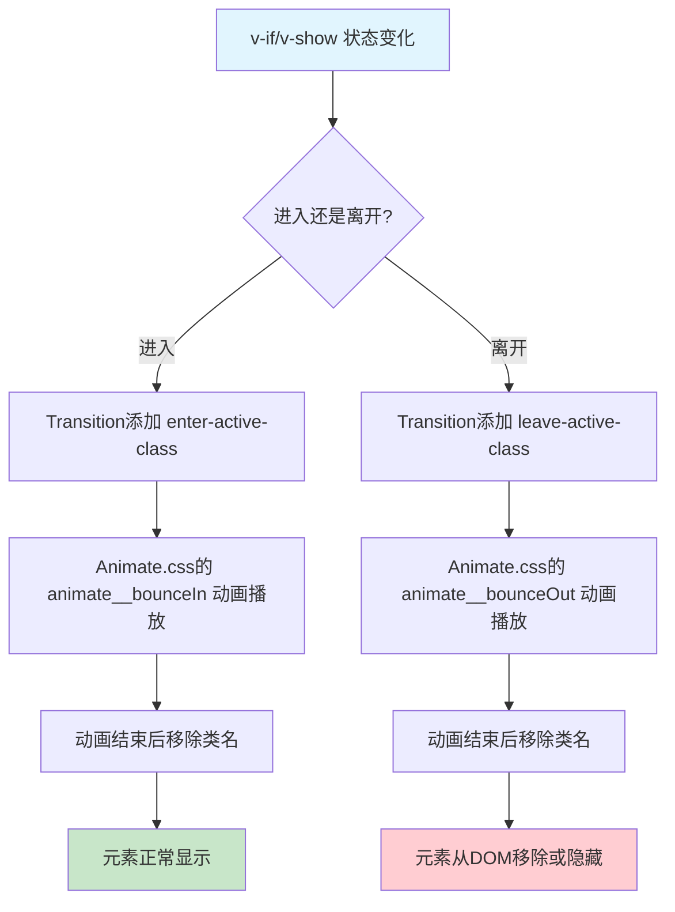

扫描[二维码](https://api2.cmdragon.cn/upload/cmder/20250304_012821924.jpg)关注或者微信搜一搜：`编程智域 前端至全栈交流与成长`

[发现1000+提升效率与开发的AI工具和实用程序](https://tools.cmdragon.cn/zh/apps?category=ai_chat)：https://tools.cmdragon.cn/zh/apps?category=ai_chat

## 一、自定义类名prop——不想用v-开头？随你

Vue 3的`<Transition>`组件默认给你生成6个CSS类名，长这样：`v-enter-from`、`v-enter-active`、`v-enter-to`、`v-leave-from`、`v-leave-active`、`v-leave-to`。如果你给Transition加了`name`属性，比如`name="fade"`，那这些类名就变成`fade-enter-from`这种格式。

但问题来了——你手上有一个现成的CSS动画库，比如Animate.css，人家类名叫`animate__bounceIn`，你总不能把人家源码改了吧？或者你自己团队有一套命名规范，非要用`my-fancy-enter`这种名字，那咋整？

这就轮到**自定义类名prop**出场了。Transition组件给你提供了6个prop，让你直接指定每个阶段用哪个CSS类名，完全绕过默认的命名规则。

### 6个自定义类名prop一览

| prop名               | 对应的默认类名   | 干啥的                                   |
| -------------------- | ---------------- | ---------------------------------------- |
| `enter-from-class`   | `v-enter-from`   | 进入动画的起始状态                       |
| `enter-active-class` | `v-enter-active` | 进入动画的整个过程（定义过渡曲线、时长） |
| `enter-to-class`     | `v-enter-to`     | 进入动画的结束状态                       |
| `leave-from-class`   | `v-leave-from`   | 离开动画的起始状态                       |
| `leave-active-class` | `v-leave-active` | 离开动画的整个过程                       |
| `leave-to-class`     | `v-leave-to`     | 离开动画的结束状态                       |

打个比方，默认类名就像你去餐厅吃套餐，菜单上写啥你吃啥。自定义类名prop就像你跟厨师说"我不吃套餐，我要单点"，每道菜你自己指定。

### 用自定义类名替换默认类名

来看个最基础的例子，我们用自定义类名prop把默认的`v-`前缀全换掉：

```vue
<template>
  <!-- 用自定义类名prop指定每个阶段对应的CSS类名 -->
  <Transition
    enter-from-class="my-enter-from"
    enter-active-class="my-enter-active"
    enter-to-class="my-enter-to"
    leave-from-class="my-leave-from"
    leave-active-class="my-leave-active"
    leave-to-class="my-leave-to"
  >
    <div v-if="show" class="box">我进来了~</div>
  </Transition>

  <button @click="show = !show">切换显示</button>
</template>

<script setup>
import { ref } from "vue";

// 控制元素的显示和隐藏
const show = ref(true);
</script>

<style>
/* 进入动画的起始状态：透明且向下偏移30px */
.my-enter-from {
  opacity: 0;
  transform: translateY(30px);
}

/* 进入动画的过程：0.5秒，使用ease-out曲线 */
.my-enter-active {
  transition: all 0.5s ease-out;
}

/* 进入动画的结束状态：完全不透明，回到原位 */
.my-enter-to {
  opacity: 1;
  transform: translateY(0);
}

/* 离开动画的起始状态：完全不透明，在原位 */
.my-leave-from {
  opacity: 1;
  transform: translateY(0);
}

/* 离开动画的过程：0.5秒，使用ease-in曲线 */
.my-leave-active {
  transition: all 0.5s ease-in;
}

/* 离开动画的结束状态：透明且向上偏移30px */
.my-leave-to {
  opacity: 0;
  transform: translateY(-30px);
}

.box {
  width: 200px;
  height: 100px;
  background: linear-gradient(135deg, #667eea, #764ba2);
  color: white;
  display: flex;
  align-items: center;
  justify-content: center;
  border-radius: 8px;
  font-size: 18px;
}
</style>
```

你看，这里我们完全没用`v-`开头的默认类名，而是用`my-`前缀的自定义类名。Transition组件通过那6个prop知道该在哪个阶段添加哪个类名，跟默认的行为一模一样，只是名字变了。

你可能会想，这不就是换个名字嘛，有啥用？别急，关键在于——你可以把类名指向**第三方CSS动画库**的类名，这样就不用自己写任何CSS动画了！接下来我们就来看看怎么跟Animate.css配合。

## 二、Animate.css集成——几行代码搞定炫酷动画

### Animate.css是啥

Animate.css是一个跨浏览器的CSS动画库，里面预置了几十种动画效果——弹跳、淡入淡出、翻转、缩放、滑动……你想到的它基本都有。你只需要给元素加上对应的类名，动画就出来了，完全不用自己写`@keyframes`。

它的官网地址是 https://animate.style/ ，你可以去上面挑你喜欢的动画效果。

### 安装和引入

在你的Vue 3项目里，先安装Animate.css：

```bash
npm install animate.css
```

然后在入口文件（通常是`main.js`或`main.ts`）里引入它：

```js
// main.js
import { createApp } from "vue";
import App from "./App.vue";
// 引入Animate.css的样式文件，这样所有动画类名就可用了
import "animate.css";

createApp(App).mount("#app");
```

就这么简单，引入之后Animate.css的所有类名就全局可用了。

### 在Transition中使用Animate.css

Animate.css的类名有个统一的前缀`animate__`（注意是双下划线），比如`animate__bounceIn`、`animate__bounceOut`、`animate__fadeInDown`等等。

我们用Transition的自定义类名prop，把这些Animate.css的类名直接填进去就行：

```vue
<template>
  <!-- 使用Animate.css的类名作为自定义过渡类名 -->
  <Transition
    enter-active-class="animate__animated animate__bounceIn"
    leave-active-class="animate__animated animate__bounceOut"
  >
    <div v-if="show" class="box">弹弹弹，弹走鱼尾纹~</div>
  </Transition>

  <button @click="show = !show">切换显示</button>
</template>

<script setup>
import { ref } from "vue";

// 控制元素的显示和隐藏
const show = ref(true);
</script>

<style>
.box {
  width: 200px;
  height: 100px;
  background: linear-gradient(135deg, #f093fb, #f5576c);
  color: white;
  display: flex;
  align-items: center;
  justify-content: center;
  border-radius: 8px;
  font-size: 18px;
}
</style>
```

注意看，我们只指定了`enter-active-class`和`leave-active-class`，没有指定`enter-from-class`那些。为啥？因为Animate.css的动画是`@keyframes`驱动的，它自己会处理起始帧和结束帧，不需要你额外指定from和to的状态。你只需要告诉Transition"进入的时候用哪个动画、离开的时候用哪个动画"就够了。

另外别忘了，每个Animate.css动画类名前面都要加上`animate__animated`这个基础类，它负责启用动画功能。这就像你开灯得先拉总闸，`animate__animated`就是那个总闸。

### 多种动画效果组合

Animate.css提供了超多动画效果，你可以随意组合进入和离开的动画。下面这个例子展示了不同的动画搭配：

```vue
<template>
  <div class="demo-container">
    <!-- 第一组：bounceIn / bounceOut 弹跳进出 -->
    <div class="demo-group">
      <h3>弹跳效果</h3>
      <Transition
        enter-active-class="animate__animated animate__bounceIn"
        leave-active-class="animate__animated animate__bounceOut"
      >
        <div v-if="show1" class="box bounce-box">弹跳进出</div>
      </Transition>
      <button @click="show1 = !show1">切换弹跳</button>
    </div>

    <!-- 第二组：fadeInDown / fadeOutUp 从下滑入/向上滑出 -->
    <div class="demo-group">
      <h3>滑动淡入淡出</h3>
      <Transition
        enter-active-class="animate__animated animate__fadeInDown"
        leave-active-class="animate__animated animate__fadeOutUp"
      >
        <div v-if="show2" class="box fade-box">滑动进出</div>
      </Transition>
      <button @click="show2 = !show2">切换滑动</button>
    </div>

    <!-- 第三组：flipInX / flipOutX X轴翻转 -->
    <div class="demo-group">
      <h3>翻转效果</h3>
      <Transition
        enter-active-class="animate__animated animate__flipInX"
        leave-active-class="animate__animated animate__flipOutX"
      >
        <div v-if="show3" class="box flip-box">翻转进出</div>
      </Transition>
      <button @click="show3 = !show3">切换翻转</button>
    </div>
  </div>
</template>

<script setup>
import { ref } from "vue";

// 三组独立的显示/隐藏状态
const show1 = ref(true);
const show2 = ref(true);
const show3 = ref(true);
</script>

<style>
.demo-container {
  display: flex;
  gap: 40px;
  padding: 20px;
}

.demo-group {
  display: flex;
  flex-direction: column;
  align-items: center;
  gap: 10px;
}

.box {
  width: 160px;
  height: 80px;
  color: white;
  display: flex;
  align-items: center;
  justify-content: center;
  border-radius: 8px;
  font-size: 16px;
  font-weight: bold;
}

.bounce-box {
  background: linear-gradient(135deg, #667eea, #764ba2);
}

.fade-box {
  background: linear-gradient(135deg, #f093fb, #f5576c);
}

.flip-box {
  background: linear-gradient(135deg, #4facfe, #00f2fe);
}

button {
  padding: 8px 16px;
  border: none;
  border-radius: 4px;
  background: #333;
  color: white;
  cursor: pointer;
}

button:hover {
  background: #555;
}
</style>
```

### Animate.css动画时长调整

Animate.css默认动画时长是1秒，你可以通过CSS变量来调整：

```vue
<template>
  <!-- 通过style覆盖Animate.css的动画时长变量 -->
  <Transition
    enter-active-class="animate__animated animate__bounceIn"
    leave-active-class="animate__animated animate__bounceOut"
    :style="{ '--animate-duration': '0.5s' }"
  >
    <div v-if="show" class="box">0.5秒弹跳</div>
  </Transition>

  <button @click="show = !show">切换</button>
</template>

<script setup>
import { ref } from "vue";
const show = ref(true);
</script>

<style>
/* 全局覆盖Animate.css的动画时长 */
:root {
  --animate-duration: 800ms;
}

.box {
  width: 200px;
  height: 100px;
  background: linear-gradient(135deg, #a18cd1, #fbc2eb);
  color: white;
  display: flex;
  align-items: center;
  justify-content: center;
  border-radius: 8px;
}
</style>
```

### Animate.css与Transition配合流程

下面这个流程图把Animate.css和Transition组件的配合过程画得明明白白：



简单来说，整个流程就是：你切换状态 → Transition在合适的时机添加Animate.css的类名 → Animate.css的`@keyframes`动画开始播放 → 播完之后Transition把类名移掉 → 过渡完成。你一行`@keyframes`都不用写，全让Animate.css替你干了。

## 三、transition和animation同时存在会打架？type属性来调解

### 问题场景

有时候你可能会在同一个元素上同时使用CSS transition和CSS animation。比如，你用Animate.css的`animate__bounceIn`（这是一个`@keyframes` animation）做进入动画，同时又用CSS transition来控制元素的某个属性变化。这时候Vue就犯难了——它该以哪个的时长为准来决定过渡什么时候结束呢？

Vue的默认行为是：**取transition和animation中时长更长的那个**作为过渡持续时间。但这往往不是你想要的，比如你的animation是1秒，transition是0.3秒，Vue会等1秒才认为过渡结束，但你的transition早就结束了，中间那0.7秒就干等着，体验上可能不对劲。

### type属性登场

Transition组件提供了一个`type`属性，让你明确告诉Vue"以谁为准"：

- `type="transition"`：以CSS transition的时长为准
- `type="animation"`：以CSS animation的时长为准

打个比方，你定了两个闹钟，一个7点响，一个7点半响。Vue默认听那个响得更晚的，但你可以说"我只听7点那个"，这就是type属性干的事。

### 代码示例

来看个具体例子，一个元素同时有transition和animation：

```vue
<template>
  <div>
    <!-- 不指定type：Vue会取较长的时长，可能导致时序问题 -->
    <h4>不指定type（默认行为）</h4>
    <Transition
      enter-active-class="animate__animated animate__bounceIn my-transition-enter"
      leave-active-class="animate__animated animate__bounceOut my-transition-leave"
    >
      <div v-if="show1" class="box">默认行为</div>
    </Transition>
    <button @click="show1 = !show1">切换（默认）</button>

    <!-- 指定type="animation"：以animation的时长为准 -->
    <h4>type="animation"</h4>
    <Transition
      type="animation"
      enter-active-class="animate__animated animate__bounceIn my-transition-enter"
      leave-active-class="animate__animated animate__bounceOut my-transition-leave"
    >
      <div v-if="show2" class="box">以animation为准</div>
    </Transition>
    <button @click="show2 = !show2">切换（animation）</button>

    <!-- 指定type="transition"：以transition的时长为准 -->
    <h4>type="transition"</h4>
    <Transition
      type="transition"
      enter-active-class="animate__animated animate__bounceIn my-transition-enter"
      leave-active-class="animate__animated animate__bounceOut my-transition-leave"
    >
      <div v-if="show3" class="box">以transition为准</div>
    </Transition>
    <button @click="show3 = !show3">切换（transition）</button>
  </div>
</template>

<script setup>
import { ref } from "vue";

// 三组独立的显示/隐藏状态
const show1 = ref(true);
const show2 = ref(true);
const show3 = ref(true);
</script>

<style>
/* 同时定义了transition和animation的样式 */
.my-transition-enter {
  /* 这个transition时长是0.3秒 */
  transition: opacity 0.3s ease;
}

.my-transition-leave {
  /* 这个transition时长也是0.3秒 */
  transition: opacity 0.3s ease;
}

/* Animate.css的bounceIn/bounceOut默认是1秒 */
/* 当type="transition"时，Vue会在0.3秒后认为过渡结束 */
/* 当type="animation"时，Vue会在1秒后认为过渡结束 */

.box {
  width: 200px;
  height: 100px;
  background: linear-gradient(135deg, #fa709a, #fee140);
  color: white;
  display: flex;
  align-items: center;
  justify-content: center;
  border-radius: 8px;
  font-size: 16px;
  margin: 10px 0;
}

h4 {
  margin-top: 20px;
}

button {
  padding: 6px 14px;
  border: none;
  border-radius: 4px;
  background: #333;
  color: white;
  cursor: pointer;
  margin-bottom: 10px;
}
</style>
```

在这个例子里，每个元素同时有Animate.css的animation（1秒）和CSS transition（0.3秒）。当你指定`type="animation"`时，Vue会等animation播完（1秒）才认为过渡结束；指定`type="transition"`时，Vue只等0.3秒就认为过渡结束了。

实际开发中，如果你用的是Animate.css这种纯animation库，一般设`type="animation"`就行。如果你同时还有transition在控制别的属性，那就根据你希望以哪个为准来选择。

### type属性的选择流程

```mermaid
flowchart TD
    A[元素同时有transition和animation] --> B{Vue如何判断过渡结束?}
    B --> C[默认: 取较长的时长]
    C --> D[可能导致时序不匹配]
    D --> E[需要type属性来明确指定]
    E --> F{你的动画主要靠谁?}
    F -->|靠@keyframes animation| G[type=&quot;animation&quot;]
    F -->|靠CSS transition| H[type=&quot;transition&quot;]
    G --> I[Vue以animation时长为准]
    H --> J[Vue以transition时长为准]

    style A fill:#fff3e0
    style E fill:#e8f5e9
    style G fill:#e3f2fd
    style H fill:#fce4ec
```

## 四、性能那点事——哪些属性动画快，哪些会卡

做动画的时候，性能是个绕不开的话题。不是所有CSS属性做动画都一样快的，有些属性动画起来丝般顺滑，有些就能让页面卡成PPT。

### GPU加速的属性：transform和opacity

`transform`（平移、旋转、缩放、倾斜）和`opacity`（透明度）是做动画的黄金搭档。为啥？因为它们可以被GPU加速。

浏览器渲染页面的时候，正常流程是：JavaScript修改样式 → 浏览器重新计算布局（Layout） → 重新绘制（Paint） → 合成（Composite）。但`transform`和`opacity`有个特权——它们不需要重新计算布局和重新绘制，直接在合成阶段就能搞定。这就像你不需要重新画一整幅画，只需要把画好的图层挪个位置或者调个透明度就行，当然快了。

### 会触发重排的属性：height/width/margin/padding

`height`、`width`、`margin`、`padding`、`top`、`left`这些属性做动画的时候，浏览器每帧都要重新计算布局，然后重新绘制，这个过程叫**重排（Reflow）**。重排是很昂贵的操作，尤其是页面元素多的时候，动画就会掉帧、卡顿。

打个比方，`transform`就像你把一张照片在桌面上滑来滑去，照片本身没变，只是位置变了；而改`width`就像你每滑一下就要重新画一张不同大小的照片，当然累多了。

### 代码对比示例

来看两种方式的对比：

```vue
<template>
  <div class="container">
    <!-- 卡顿写法：用height做动画，每帧触发重排 -->
    <div class="demo-section">
      <h4>用height做动画（可能卡顿）</h4>
      <Transition name="height-fade">
        <div v-if="showBad" class="box bad-box">height动画</div>
      </Transition>
      <button @click="showBad = !showBad">切换height动画</button>
    </div>

    <!-- 流畅写法：用transform做动画，GPU加速 -->
    <div class="demo-section">
      <h4>用transform做动画（丝滑）</h4>
      <Transition name="transform-fade">
        <div v-if="showGood" class="box good-box">transform动画</div>
      </Transition>
      <button @click="showGood = !showGood">切换transform动画</button>
    </div>
  </div>
</template>

<script setup>
import { ref } from "vue";

const showBad = ref(true);
const showGood = ref(true);
</script>

<style>
/* 卡顿写法：height从0到100px，每帧都要重新计算布局 */
.height-fade-enter-active,
.height-fade-leave-active {
  transition:
    height 0.5s ease,
    opacity 0.5s ease;
  /* height的变化会触发重排，性能差 */
}

.height-fade-enter-from,
.height-fade-leave-to {
  height: 0;
  opacity: 0;
  overflow: hidden;
}

.height-fade-enter-to,
.height-fade-leave-from {
  height: 100px;
  opacity: 1;
}

/* 流畅写法：用scaleY模拟高度变化，不触发重排 */
.transform-fade-enter-active,
.transform-fade-leave-active {
  transition:
    transform 0.5s ease,
    opacity 0.5s ease;
  /* transform由GPU加速，性能好 */
}

.transform-fade-enter-from,
.transform-fade-leave-to {
  transform: scaleY(0);
  opacity: 0;
  transform-origin: top;
}

.transform-fade-enter-to,
.transform-fade-leave-from {
  transform: scaleY(1);
  opacity: 1;
  transform-origin: top;
}

.box {
  width: 200px;
  height: 100px;
  color: white;
  display: flex;
  align-items: center;
  justify-content: center;
  border-radius: 8px;
  font-size: 16px;
  margin: 10px 0;
}

.bad-box {
  background: linear-gradient(135deg, #ff6b6b, #ee5a24);
}

.good-box {
  background: linear-gradient(135deg, #26de81, #20bf6b);
}

.demo-section {
  margin-bottom: 30px;
}

button {
  padding: 6px 14px;
  border: none;
  border-radius: 4px;
  background: #333;
  color: white;
  cursor: pointer;
}
</style>
```

### 性能对比一览

| 属性               | 是否触发重排     | GPU加速 | 动画流畅度 | 官方推荐 |
| ------------------ | ---------------- | ------- | ---------- | -------- |
| `transform`        | 否               | 是      | 丝滑       | 推荐     |
| `opacity`          | 否               | 是      | 丝滑       | 推荐     |
| `height/width`     | 是               | 否      | 可能卡顿   | 不推荐   |
| `margin/padding`   | 是               | 否      | 可能卡顿   | 不推荐   |
| `top/left`         | 是               | 否      | 可能卡顿   | 不推荐   |
| `background-color` | 否（只触发重绘） | 否      | 一般       | 可用     |

Vue官方文档也明确建议：**优先使用`transform`和`opacity`来做动画**。如果你的动画效果需要"高度展开"这种视觉，用`scaleY`来模拟比直接改`height`要流畅得多。

### 用will-change提前告知浏览器

如果你知道某个元素马上要做动画，可以提前用`will-change`属性告诉浏览器"这个属性要变了，你提前准备一下"：

```css
.box {
  /* 告诉浏览器transform和opacity即将变化，提前创建合成层 */
  will-change: transform, opacity;
}
```

但注意，`will-change`不能滥用。如果你给页面上所有元素都加上`will-change`，反而会占用大量GPU内存，适得其反。只在确实要做动画的元素上用就行。

## 课后 Quiz

### Quiz 1：Transition组件的6个自定义类名prop分别是什么？它们和默认类名怎么对应？

**答案解析：**

6个自定义类名prop分别是：

1. `enter-from-class` → 对应默认的`v-enter-from`，进入动画的起始状态
2. `enter-active-class` → 对应默认的`v-enter-active`，进入动画的整个过程
3. `enter-to-class` → 对应默认的`v-enter-to`，进入动画的结束状态
4. `leave-from-class` → 对应默认的`v-leave-from`，离开动画的起始状态
5. `leave-active-class` → 对应默认的`v-leave-active`，离开动画的整个过程
6. `leave-to-class` → 对应默认的`v-leave-to`，离开动画的结束状态

如果你给Transition设置了`name="fade"`，那默认类名就变成`fade-enter-from`这种格式。而自定义类名prop的优先级更高，设置了自定义prop后，对应的默认类名就不会被添加了。

### Quiz 2：在Transition中使用Animate.css时，为什么通常只需要指定`enter-active-class`和`leave-active-class`，而不需要指定`enter-from-class`等prop？

**答案解析：**

因为Animate.css的动画是基于`@keyframes`的CSS animation，而不是CSS transition。`@keyframes`动画自己就定义了起始帧（from/0%）和结束帧（to/100%），不需要外部再指定初始状态和结束状态。

而CSS transition需要你分别定义"从哪个状态开始"（enter-from）和"到哪个状态结束"（enter-to），浏览器才能计算中间帧。所以用CSS transition时，你需要指定from和to；用CSS animation（如Animate.css）时，只需要指定用哪个动画就行。

不过有个细节要注意：Animate.css的每个动画类名前面都要加上`animate__animated`这个基础类，比如`enter-active-class="animate__animated animate__bounceIn"`，别忘了这个。

### Quiz 3：当元素同时有CSS transition和CSS animation时，`type`属性设为`"transition"`和`"animation"`有什么区别？什么场景下该用哪个？

**答案解析：**

区别在于Vue以哪个的时长来判断过渡何时结束：

- `type="transition"`：Vue以CSS transition的时长为准。当transition结束后，Vue就认为整个过渡过程结束了，即使animation还没播完。
- `type="animation"`：Vue以CSS animation的时长为准。当animation结束后，Vue才认为过渡过程结束。

选择场景：

- 如果你主要用Animate.css等animation库做动画，同时元素上还有一点transition做辅助效果，一般设`type="animation"`，让动画完整播完。
- 如果你主要用CSS transition做过渡，animation只是个点缀效果，设`type="transition"`，以transition的节奏为准。
- 如果只有transition或只有animation其中一种，那type属性其实不需要设置，Vue自己能判断。

## 常见报错解决方案

### 报错1：Animate.css动画不生效，元素直接出现/消失没有动画

**原因分析：**

最常见的原因是忘记加`animate__animated`这个基础类。Animate.css要求每个动画都必须搭配`animate__animated`类才能生效，它内部通过这个类来设置`animation-duration`等基础属性。如果你只写了`animate__bounceIn`而没写`animate__animated`，动画根本不会播放。

另一个常见原因是忘记在入口文件引入Animate.css的样式文件`import 'animate.css'`，导致类名虽然写了但样式不存在。

**解决方案：**

1. 确保每个动画类名前都加上`animate__animated`：

```vue
<!-- 错误写法：缺少animate__animated -->
<Transition
  enter-active-class="animate__bounceIn"
  leave-active-class="animate__bounceOut"
>

<!-- 正确写法：加上animate__animated -->
<Transition
  enter-active-class="animate__animated animate__bounceIn"
  leave-active-class="animate__animated animate__bounceOut"
>
```

2. 确保在`main.js`中引入了样式文件：

```js
import "animate.css";
```

3. 检查浏览器开发者工具的Elements面板，确认类名是否被正确添加到元素上。

### 报错2：设置了type属性后动画被截断，没播完就消失了

**原因分析：**

当`type="transition"`但实际动画主要靠animation驱动时，Vue会在transition时长结束后就认为过渡完成，提前移除元素或类名。比如你的transition只有0.3秒，但animation需要1秒，Vue在0.3秒时就结束了过渡，animation还没播完就被打断了。

**解决方案：**

1. 如果你的动画主要靠`@keyframes`（如Animate.css），设`type="animation"`：

```vue
<Transition
  type="animation"
  enter-active-class="animate__animated animate__bounceIn"
  leave-active-class="animate__animated animate__bounceOut"
>
```

2. 如果确实需要同时使用transition和animation，用`duration`属性显式指定过渡时长：

```vue
<!-- 显式指定过渡时长为1秒，跟animation时长一致 -->
<Transition :duration="1000">
```

3. 也可以传入对象分别指定进入和离开的时长：

```vue
<Transition :duration="{ enter: 1000, leave: 800 }">
```

### 报错3：自定义类名prop设置了但没生效，还是用的默认v-类名

**原因分析：**

这通常是因为prop名写错了。Vue 3的Transition组件支持这6个prop名：`enter-from-class`、`enter-active-class`、`enter-to-class`、`leave-from-class`、`leave-active-class`、`leave-to-class`。注意是连字符格式，不是驼峰格式。如果你写成了`enterFromClass`这种驼峰格式，在模板里是不生效的（Vue模板里prop要用kebab-case）。

另一个原因是把prop写在了子元素上而不是`<Transition>`组件上。自定义类名prop必须写在`<Transition>`标签上，不能写在被包裹的元素上。

**解决方案：**

1. 确保prop名使用kebab-case格式：

```vue
<!-- 错误写法：驼峰格式在模板中不生效 -->
<Transition enterFromClass="my-enter">

<!-- 正确写法：kebab-case格式 -->
<Transition enter-from-class="my-enter">
```

2. 确保prop写在Transition组件上：

```vue
<!-- 错误写法：prop写在了子元素上 -->
<Transition>
  <div v-if="show" enter-active-class="animate__animated animate__bounceIn">内容</div>
</Transition>

<!-- 正确写法：prop写在Transition组件上 -->
<Transition enter-active-class="animate__animated animate__bounceIn">
  <div v-if="show">内容</div>
</Transition>
```

3. 如果你在JSX中使用，需要用驼峰格式`enterFromClass`，因为JSX不支持kebab-case的prop名。

参考链接：https://vuejs.org/guide/built-ins/transition.html

余下文章内容请点击跳转至 个人博客页面 或者 扫描[二维码](https://api2.cmdragon.cn/upload/cmder/20250304_012821924.jpg)关注或者微信搜一搜：`编程智域 前端至全栈交流与成长`，阅读完整的文章：[不想写CSS类名？用自定义类名和Animate.css让动画飞起来](https://blog.cmdragon.cn/posts/b8c9d0e1f2a3b4c5d6e7f8a9b0c1d2e3/)

<details>
<summary>往期文章归档</summary>

- [Vue 3 静态与动态 Props 如何传递？TypeScript 类型约束有何必要？](https://blog.cmdragon.cn/posts/94ab48753b64780ca3ab7a7115ae8522/)
- [Vue 3中组件局部注册的优势与实现方式如何？](https://blog.cmdragon.cn/posts/dbf576e744870f6de26fd8a2e03e47da/)
- [如何在Vue3中优化生命周期钩子性能并规避常见陷阱？](https://blog.cmdragon.cn/posts/12d98b3b9ccd6c19a1b169d720ac5c80/)
- [Vue 3 Composition API生命周期钩子：如何实现从基础理解到高阶复用？](https://blog.cmdragon.cn/posts/8884e2b70287fcb263c57648eeb27419/)
- [Vue 3生命周期钩子实战指南：如何正确选择onMounted、onUpdated与onUnmounted的应用场景？](https://blog.cmdragon.cn/posts/883c6dbc50ae4183770a4462e0b8ae4d/)
- [Vue 3中生命周期钩子与响应式系统如何实现协同工作？](https://blog.cmdragon.cn/posts/70dad360ffa9dce14d0d69611b8cb019/)
- [Vue 3组件生命周期钩子的执行顺序与使用场景是什么？](https://blog.cmdragon.cn/posts/db44294a78dc9f666f67b053f6c83567/)
- [Vue组件全局注册与局部注册如何抉择？](https://blog.cmdragon.cn/posts/43ead630ea17da65d99ad2eb8188e472/)
- [Vue3组件化开发中，Props与Emits如何实现数据流转与事件协作？](https://blog.cmdragon.cn/posts/8cff7d2df113da66ea7be560c4d1d22a/)
- [Vue 3模板引用如何与其他特性协同实现复杂交互？](https://blog.cmdragon.cn/posts/331bf75d114ab09116eadfcdca602b58/)
- [Vue 3 v-for中模板引用如何实现高效管理与动态控制？](https://blog.cmdragon.cn/posts/cb380897ddc3578b180ecf8843c774c1/)
- [Vue 3的defineExpose：如何突破script setup组件默认封装，实现精准的父子通讯？](https://blog.cmdragon.cn/posts/202ae0f4acde7128e0e31baf63732fb5/)
- [Vue 3模板引用的生命周期时机如何把握？常见陷阱该如何避免？](https://blog.cmdragon.cn/posts/7d2a0f6555ecbe92afd7d2491c427463/)
- [Vue 3模板引用如何实现父组件与子组件的高效交互？](https://blog.cmdragon.cn/posts/3fb7bdd84128b7efaaa1c979e1f28dee/)
- [Vue中为何需要模板引用？又如何高效实现DOM与组件实例的直接访问？](https://blog.cmdragon.cn/posts/23f3464ba16c7054b4783cded50c04c6/)

</details>

<details>
<summary>免费好用的热门在线工具</summary>

- [多直播聚合器 - 应用商店 | By cmdragon](https://tools.cmdragon.cn/zh/apps/multi-live-aggregator)
- [Proto文件生成器 - 应用商店 | By cmdragon](https://tools.cmdragon.cn/zh/apps/proto-file-generator)
- [图片转粒子 - 应用商店 | By cmdragon](https://tools.cmdragon.cn/zh/apps/image-to-particles)
- [视频下载器 - 应用商店 | By cmdragon](https://tools.cmdragon.cn/zh/apps/video-downloader)
- [文件格式转换器 - 应用商店 | By cmdragon](https://tools.cmdragon.cn/zh/apps/file-converter)
- [M3U8在线播放器 - 应用商店 | By cmdragon](https://tools.cmdragon.cn/zh/apps/m3u8-player)
- [快图设计 - 应用商店 | By cmdragon](https://tools.cmdragon.cn/zh/apps/quick-image-design)
- [高级文字转图片转换器 - 应用商店 | By cmdragon](https://tools.cmdragon.cn/zh/apps/text-to-image-advanced)
- [RAID 计算器 - 应用商店 | By cmdragon](https://tools.cmdragon.cn/zh/apps/raid-calculator)
- [在线PS - 应用商店 | By cmdragon](https://tools.cmdragon.cn/zh/apps/photoshop-online)
- [Mermaid 在线编辑器 - 应用商店 | By cmdragon](https://tools.cmdragon.cn/zh/apps/mermaid-live-editor)
- [数学求解计算器 - 应用商店 | By cmdragon](https://tools.cmdragon.cn/zh/apps/math-solver-calculator)
- [智能提词器 - 应用商店 | By cmdragon](https://tools.cmdragon.cn/zh/apps/smart-teleprompter)
- [魔法简历 - 应用商店 | By cmdragon](https://tools.cmdragon.cn/zh/apps/magic-resume)
- [Image Puzzle Tool - 图片拼图工具 | By cmdragon](https://tools.cmdragon.cn/zh/apps/image-puzzle-tool)
- [字幕下载工具 - 应用商店 | By cmdragon](https://tools.cmdragon.cn/zh/apps/subtitle-downloader)
- [歌词生成工具 - 应用商店 | By cmdragon](https://tools.cmdragon.cn/zh/apps/lyrics-generator)
- [网盘资源聚合搜索 - 应用商店 | By cmdragon](https://tools.cmdragon.cn/zh/apps/cloud-drive-search)
- [ASCII字符画生成器 - 应用商店 | By cmdragon](https://tools.cmdragon.cn/zh/apps/ascii-art-generator)
- [JSON Web Tokens 工具 - 应用商店 | By cmdragon](https://tools.cmdragon.cn/zh/apps/jwt-tool)
- [Bcrypt 密码工具 - 应用商店 | By cmdragon](https://tools.cmdragon.cn/zh/apps/bcrypt-tool)
- [GIF 合成器 - 应用商店 | By cmdragon](https://tools.cmdragon.cn/zh/apps/gif-composer)
- [GIF 分解器 - 应用商店 | By cmdragon](https://tools.cmdragon.cn/zh/apps/gif-decomposer)
- [文本隐写术 - 应用商店 | By cmdragon](https://tools.cmdragon.cn/zh/apps/text-steganography)
- [CMDragon 在线工具 - 高级AI工具箱与开发者套件 | 免费好用的在线工具](https://tools.cmdragon.cn/zh)
- [应用商店 - 发现1000+提升效率与开发的AI工具和实用程序 | 免费好用的在线工具](https://tools.cmdragon.cn/zh/apps?category=trending)
- [CMDragon 更新日志 - 最新更新、功能与改进 | 免费好用的在线工具](https://tools.cmdragon.cn/zh/changelog)
- [支持我们 - 成为赞助者 | 免费好用的在线工具](https://tools.cmdragon.cn/zh/sponsor)
- [AI文本生成图像 - 应用商店 | 免费好用的在线工具](https://tools.cmdragon.cn/zh/apps/text-to-image-ai)
- [临时邮箱 - 应用商店 | 免费好用的在线工具](https://tools.cmdragon.cn/zh/apps/temp-email)
- [二维码解析器 - 应用商店 | 免费好用的在线工具](https://tools.cmdragon.cn/zh/apps/qrcode-parser)
- [文本转思维导图 - 应用商店 | 免费好用的在线工具](https://tools.cmdragon.cn/zh/apps/text-to-mindmap)
- [正则表达式可视化工具 - 应用商店 | 免费好用的在线工具](https://tools.cmdragon.cn/zh/apps/regex-visualizer)
- [文件隐写工具 - 应用商店 | 免费好用的在线工具](https://tools.cmdragon.cn/zh/apps/steganography-tool)
- [IPTV 频道探索器 - 应用商店 | 免费好用的在线工具](https://tools.cmdragon.cn/zh/apps/iptv-explorer)
- [快传 - 应用商店 | By cmdragon](https://tools.cmdragon.cn/zh/apps/snapdrop)
- [随机抽奖工具 - 应用商店 | 免费好用的在线工具](https://tools.cmdragon.cn/zh/apps/lucky-draw)
- [动漫场景查找器 - 应用商店 | 免费好用的在线工具](https://tools.cmdragon.cn/zh/apps/anime-scene-finder)
- [时间工具箱 - 应用商店 | 免费好用的在线工具](https://tools.cmdragon.cn/zh/apps/time-toolkit)
- [网速测试 - 应用商店 | 免费好用的在线工具](https://tools.cmdragon.cn/zh/apps/speed-test)
- [AI 智能抠图工具 - 应用商店 | 免费好用的在线工具](https://tools.cmdragon.cn/zh/apps/background-remover)
- [背景替换工具 - 应用商店 | 免费好用的在线工具](https://tools.cmdragon.cn/zh/apps/background-replacer)
- [艺术二维码生成器 - 应用商店 | 免费好用的在线工具](https://tools.cmdragon.cn/zh/apps/artistic-qrcode)
- [Open Graph 元标签生成器 - 应用商店 | 免费好用的在线工具](https://tools.cmdragon.cn/zh/apps/open-graph-generator)
- [图像对比工具 - 应用商店 | 免费好用的在线工具](https://tools.cmdragon.cn/zh/apps/image-comparison)
- [图片压缩专业版 - 应用商店 | 免费好用的在线工具](https://tools.cmdragon.cn/zh/apps/image-compressor)
- [密码生成器 - 应用商店 | 免费好用的在线工具](https://tools.cmdragon.cn/zh/apps/password-generator)
- [SVG优化器 - 应用商店 | 免费好用的在线工具](https://tools.cmdragon.cn/zh/apps/svg-optimizer)
- [调色板生成器 - 应用商店 | 免费好用的在线工具](https://tools.cmdragon.cn/zh/apps/color-palette)
- [在线节拍器 - 应用商店 | 免费好用的在线工具](https://tools.cmdragon.cn/zh/apps/online-metronome)
- [IP归属地查询 - 应用商店 | By cmdragon](https://tools.cmdragon.cn/zh/apps/ip-geolocation)
- [CSS网格布局生成器 - 应用商店 | 免费好用的在线工具](https://tools.cmdragon.cn/zh/apps/css-grid-layout)
- [邮箱验证工具 - 应用商店 | 免费好用的在线工具](https://tools.cmdragon.cn/zh/apps/email-validator)
- [书法练习字帖 - 应用商店 | 免费好用的在线工具](https://tools.cmdragon.cn/zh/apps/calligraphy-practice)
- [金融计算器套件 - 应用商店 | 免费好用的在线工具](https://tools.cmdragon.cn/zh/apps/finance-calculator-suite)
- [中国亲戚关系计算器 - 应用商店 | 免费好用的在线工具](https://tools.cmdragon.cn/zh/apps/chinese-kinship-calculator)
- [Protocol Buffer 工具箱 - 应用商店 | 免费好用的在线工具](https://tools.cmdragon.cn/zh/apps/protobuf-toolkit)
- [IP归属地查询 - 应用商店 | 免费好用的在线工具](https://tools.cmdragon.cn/zh/apps/ip-geolocation)
- [图片无损放大 - 应用商店 | 免费好用的在线工具](https://tools.cmdragon.cn/zh/apps/image-upscaler)
- [文本比较工具 - 应用商店 | 免费好用的在线工具](https://tools.cmdragon.cn/zh/apps/text-compare)
- [IP批量查询工具 - 应用商店 | 免费好用的在线工具](https://tools.cmdragon.cn/zh/apps/ip-batch-lookup)
- [域名查询工具 - 应用商店 | 免费好用的在线工具](https://tools.cmdragon.cn/zh/apps/domain-finder)
- [DNS工具箱 - 应用商店 | 免费好用的在线工具](https://tools.cmdragon.cn/zh/apps/dns-toolkit)
- [网站图标生成器 - 应用商店 | 免费好用的在线工具](https://tools.cmdragon.cn/zh/apps/favicon-generator)
- [XML Sitemap](https://tools.cmdragon.cn/sitemap_index.xml)

</details>
