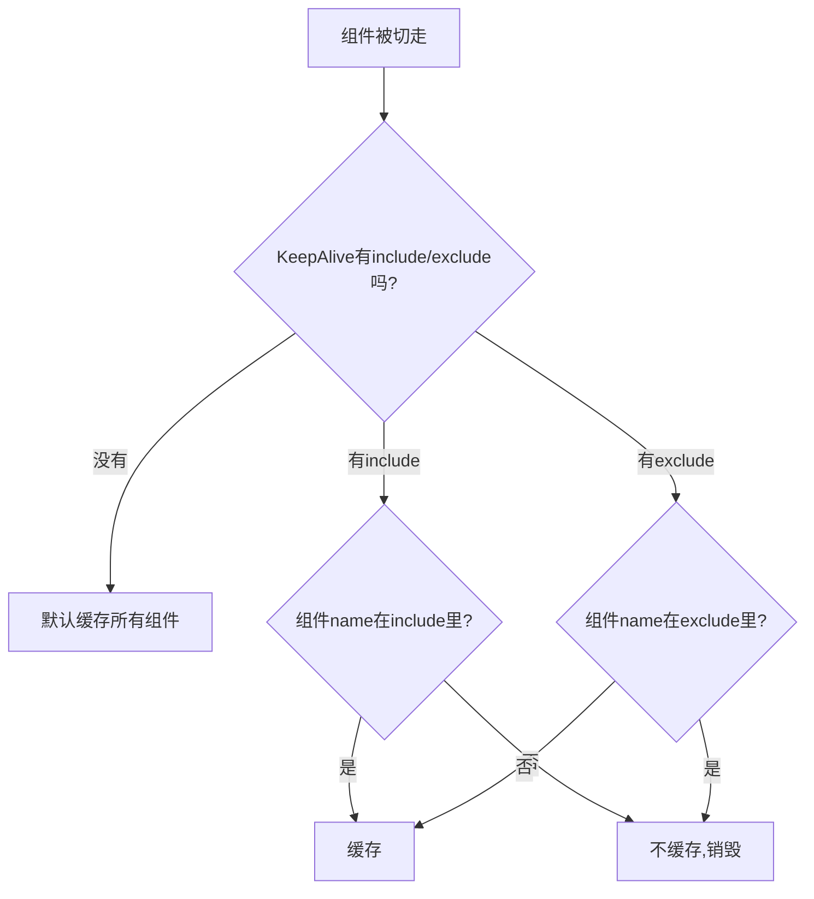

扫描[二维码](https://api2.cmdragon.cn/upload/cmder/20250304_012821924.jpg)关注或者微信搜一搜：`编程智域 前端至全栈交流与成长`

[发现1000+提升效率与开发的AI工具和实用程序](https://tools.cmdragon.cn/zh/apps?category=ai_chat)：https://tools.cmdragon.cn/

## 一、默认全缓存？那可不行

上一篇咱学会了用KeepAlive缓存组件，确实好使。但KeepAlive有个默认行为——**它会把里面所有的子组件都缓存起来**。

听起来好像没啥问题？但你想想，你家冰箱啥都往里塞，迟早得满，而且有些东西放冰箱反而坏了。

比如你的应用里有10个动态组件，但只有2个需要缓存状态（一个搜索页、一个表单页），其他8个都是展示型页面，每次打开都应该拿最新数据。如果全缓存了，那8个组件白白占着内存，切回来还给你展示过期的数据，这不是给自己挖坑嘛。

所以Vue给KeepAlive配了两个prop：**include** 和 **exclude**，让你精准控制谁该缓存、谁不该缓存。



## 二、include：白名单模式，只缓存指定的

include就是"白名单"——只有名单上的组件才会被缓存，其他的一律不缓存。

它支持三种写法：

### 写法1：逗号分隔字符串

最简单的写法，直接写组件名，用英文逗号隔开：

```vue
<KeepAlive include="CompA,CompB">
  <component :is="current" />
</KeepAlive>
```

注意：这种写法**不需要**加 `v-bind`（也就是不用加冒号），因为include接收的就是字符串。

### 写法2：正则表达式

用正则来匹配组件名，更灵活：

```vue
<!-- 需要加v-bind（冒号） -->
<KeepAlive :include="/CompA|CompB/">
  <component :is="current" />
</KeepAlive>
```

正则写法的好处是你可以用模式匹配，比如 `/^List/` 可以匹配所有以"List"开头的组件名。

**注意：** 正则写法必须加 `v-bind`（冒号），否则Vue会把 `/CompA|CompB/` 当成普通字符串。

### 写法3：数组

最清晰的写法，把组件名放在数组里：

```vue
<!-- 需要加v-bind（冒号） -->
<KeepAlive :include="['CompA', 'CompB']">
  <component :is="current" />
</KeepAlive>
```

数组写法也必须加 `v-bind`，因为你要传的是数组而不是字符串。

三种写法效果一样，选哪种看你喜好。我个人推荐数组写法，一目了然，不容易写错。

## 三、exclude：黑名单模式，不缓存指定的

exclude和include刚好反过来——名单上的组件**不**缓存，其他都缓存。

三种写法跟include一模一样：

```vue
<!-- 逗号字符串 -->
<KeepAlive exclude="CompC,CompD">
  <component :is="current" />
</KeepAlive>

<!-- 正则 -->
<KeepAlive :exclude="/CompC|CompD/">
  <component :is="current" />
</KeepAlive>

<!-- 数组 -->
<KeepAlive :exclude="['CompC', 'CompD']">
  <component :is="current" />
</KeepAlive>
```

### 什么时候用include，什么时候用exclude？

简单说就是看哪个写起来更短：

- **需要缓存的少** → 用include白名单（只列几个要缓存的）
- **不需要缓存的多** → 用exclude黑名单（只列几个不缓存的）

举个例子：你有10个组件，8个要缓存2个不要 → 用exclude只写2个名字。反过来2个要缓存8个不要 → 用include只写2个名字。

别同时用include和exclude，虽然Vue不会报错，但逻辑上容易混乱，维护起来也费劲。

## 四、组件name：匹配的关键

这是很多人踩坑的地方——include和exclude是根据**组件的name选项**来匹配的，不是根据变量名、文件名或者路由名。

如果你的组件没有声明name，那include/exclude就认不出它，等于白配。

### 选项式API中声明name

```javascript
export default {
  name: "CompA", // 这个name就是include匹配的依据
  data() {
    return { count: 0 };
  },
};
```

### script setup中的name

在Vue 3.2.34及以上版本，使用 `<script setup>` 的单文件组件会**自动根据文件名生成name**。比如你的文件叫 `CompA.vue`，那name自动就是 `CompA`。

但如果你文件名和想要匹配的name不一致呢？比如文件叫 `UserListPage.vue`，但你想在include里用 `UserList` 来匹配。这时候有两种办法：

**方法1：用defineOptions（Vue 3.3+）**

```vue
<script setup>
defineOptions({
  name: "UserList",
});

const searchQuery = ref("");
</script>
```

**方法2：加一个普通的script块**

```vue
<script>
export default {
  name: "UserList",
};
</script>

<script setup>
const searchQuery = ref("");
</script>
```

咱就是说，name对不上，include就认不出你，等于白配。所以一定要确保include/exclude里写的名字和组件的name一致。

## 五、动态include/exclude

include和exclude的值可以是响应式的！这意味着你可以根据运行时条件动态决定缓存哪些组件。

比如根据用户角色来决定：

```vue
<script setup>
import { computed } from "vue";
import { useUserStore } from "./stores/user";

const userStore = useUserStore();

// 管理员缓存更多组件，普通用户只缓存基础组件
const cachedComponents = computed(() => {
  if (userStore.role === "admin") {
    return ["Dashboard", "UserList", "Settings", "Reports"];
  }
  return ["Dashboard", "Settings"];
});
</script>

<template>
  <KeepAlive :include="cachedComponents">
    <component :is="currentComponent" />
  </KeepAlive>
</template>
```

或者配合Vue Router的meta信息动态生成include列表（这个下一篇会详细讲）。

## 课后Quiz

### 问题1：include="CompA,CompB"和:include="['CompA','CompB']"有什么区别？

**答案解析：** 效果一样，但语法不同。`include="CompA,CompB"` 是直接传字符串，Vue内部会按逗号分隔解析。`:include="['CompA','CompB']"` 是通过v-bind传数组。字符串写法不需要冒号，数组和正则写法必须加冒号。

### 问题2：为什么script setup中的组件有时候不需要手动声明name？

**答案解析：** 在Vue 3.2.34及以上版本，使用 `<script setup>` 的单文件组件会自动根据文件名生成name选项。比如 `CompA.vue` 会自动生成name为 `CompA`。所以只要include里写的名字和文件名一致，就不需要手动声明。但如果文件名和匹配名不一致，就需要用defineOptions或额外的script块手动声明。

## 常见报错解决方案

### 1. include/exclude不生效

**错误现象：** 配了include但组件还是被缓存了，或者配了exclude但组件还是被缓存。

**可能原因：** 组件的name和include/exclude里写的不一致。这是最常见的原因。

**解决方案：** 打开浏览器DevTools，在Vue DevTools里查看组件的实际name，确保和include/exclude里写的一致。特别注意大小写！

### 2. 正则表达式写法报错

**错误现象：** 使用正则写法后，缓存控制不生效。

**可能原因：** 忘记加v-bind（冒号）。`include="/CompA|CompB/"` 会把正则当成普通字符串。

**解决方案：** 改成 `:include="/CompA|CompB/"`，加上冒号。

### 3. script setup组件name不匹配

**错误现象：** 文件名是 `UserListPage.vue`，include里写的是 `UserList`，结果不生效。

**可能原因：** 自动生成的name是 `UserListPage`，和include里的 `UserList` 不一致。

**解决方案：** 用 `defineOptions({ name: 'UserList' })` 手动声明name，或者把include改成 `UserListPage`。

参考链接：

- https://cn.vuejs.org/guide/built-ins/keep-alive.html

余下文章内容请点击跳转至 个人博客页面 或者 扫描[二维码](https://api2.cmdragon.cn/upload/cmder/20250304_012821924.jpg)关注或者微信搜一搜：`编程智域 前端至全栈交流与成长`，阅读完整的文章：[不是所有组件都值得缓存——include和exclude怎么挑](https://blog.cmdragon.cn/posts/k2b3c4d5e6f7a8b9c0d1e2f3a4b5c6d7/)

<details>
<summary>往期文章归档</summary>

- [Vue 3 静态与动态 Props 如何传递？TypeScript 类型约束有何必要？](https://blog.cmdragon.cn/posts/94ab48753b64780ca3ab7a7115ae8522/)
- [Vue 3中组件局部注册的优势与实现方式如何？](https://blog.cmdragon.cn/posts/dbf576e744870f6de26fd8a2e03e47da/)
- [如何在Vue3中优化生命周期钩子性能并规避常见陷阱？](https://blog.cmdragon.cn/posts/12d98b3b9ccd6c19a1b169d720ac5c80/)
- [Vue 3 Composition API生命周期钩子：如何实现从基础理解到高阶复用？](https://blog.cmdragon.cn/posts/8884e2b70287fcb263c57648eeb27419/)
- [Vue 3生命周期钩子实战指南：如何正确选择onMounted、onUpdated与onUnmounted的应用场景？](https://blog.cmdragon.cn/posts/883c6dbc50ae4183770a4462e0b8ae4d/)

</details>

<details>
<summary>免费好用的热门在线工具</summary>

- [多直播聚合器 - 应用商店 | By cmdragon](https://tools.cmdragon.cn/zh/apps/multi-live-aggregator)
- [Proto文件生成器 - 应用商店 | By cmdragon](https://tools.cmdragon.cn/zh/apps/proto-file-generator)
- [图片转粒子 - 应用商店 | By cmdragon](https://tools.cmdragon.cn/zh/apps/image-to-particles)
- [视频下载器 - 应用商店 | By cmdragon](https://tools.cmdragon.cn/zh/apps/video-downloader)
- [文件格式转换器 - 应用商店 | By cmdragon](https://tools.cmdragon.cn/zh/apps/file-converter)
- [M3U8在线播放器 - 应用商店 | By cmdragon](https://tools.cmdragon.cn/zh/apps/m3u8-player)
- [CMDragon 在线工具 - 高级AI工具箱与开发者套件 | 免费好用的在线工具](https://tools.cmdragon.cn/zh)
- [应用商店 - 发现1000+提升效率与开发的AI工具和实用程序 | 免费好用的在线工具](https://tools.cmdragon.cn/zh/apps?category=trending)

</details>
