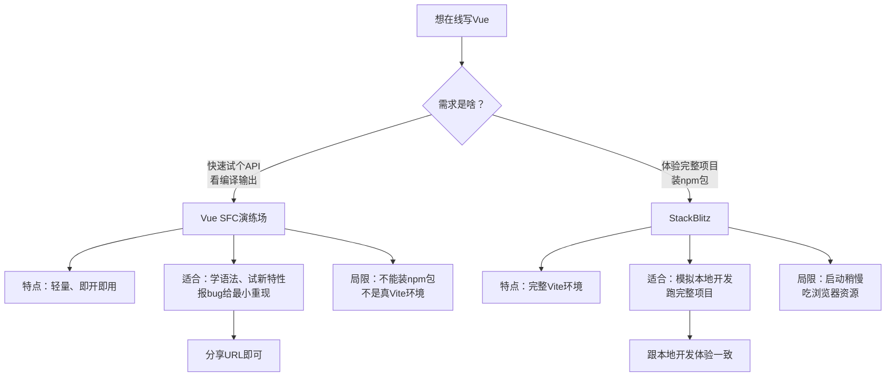
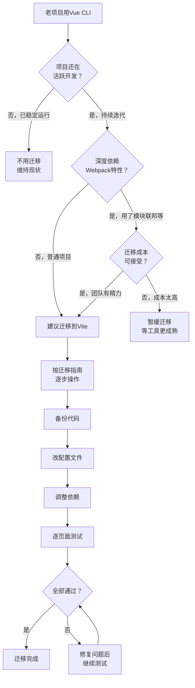

扫描[二维码](https://api2.cmdragon.cn/upload/cmder/20250304_012821924.jpg)关注或者微信搜一搜：`编程智域 前端至全栈交流与成长`

[发现1000+提升效率与开发的AI工具和实用程序](https://tools.cmdragon.cn/zh/apps?category=ai_chat)：https://tools.cmdragon.cn/zh/apps?category=ai_chat

## 一、啥都不装也能写Vue？在线演练场真香

刚接触Vue那会儿，好多小伙伴被"装环境"这一步劝退了——Node版本要装、npm要配、构建工具要挑，光是搭个能跑的空壳子就折腾一下午。其实吧，Vue官方早就替咱想好了：**不需要在机器上安装任何东西，也能尝试基于单文件组件（SFC）的Vue开发体验**。这就像去商场买衣服，不用先付钱买回家，进试衣间试一试合不合身再说。

在线演练场就是Vue给咱准备的"试衣间"。打开浏览器，输入网址，就能直接写`<template>`、`<script setup>`、`<style>`，保存即看到效果。下面咱就聊聊两个最常用的在线演练场，它们各有各的脾气。

### Vue SFC演练场

Vue SFC演练场（地址：https://play.vuejs.org/）是Vue官方维护的在线编辑器，专门用来写单文件组件。它有几个挺香的特点：

- **跟Vue仓库最新提交保持同步**：你今天写的代码跑的是Vue仓库master分支最新打包的版本，新特性第一时间就能试。当然咯，这也意味着偶尔可能踩到还没修的bug，但官方一般会标注当前使用的commit。
- **能检查编译输出**：右侧面板有个"JS"或"CSS"标签，点开能看到你的SFC被编译成啥样的渲染函数。学响应式原理、学编译优化的时候，这个功能简直是神器。
- **支持多文件**：可以新建多个`.vue`组件，互相import，模拟真实项目结构。
- **一键分享**：写完点"Share"按钮，生成一个URL，发给别人打开就是你写的代码，特别适合在群里问问题、报bug。

举个实际场景：你在文档里看到个新API，比如`defineModel`，想立马试一下，又不想污染本地项目。打开SFC演练场，粘几行代码就能跑：

```vue
<!-- 父组件 Parent.vue -->
<script setup>
// 引入子组件
import Child from './Child.vue'
// 用ref定义一个响应式数据，模拟父组件持有的状态
import { ref } from 'vue'
// 初始值设为'hello'
const msg = ref('hello')
</script>

<template>
  <!-- 双向绑定到子组件的v-model -->
  <Child v-model="msg" />
  <!-- 实时显示父组件里的值，验证双向同步 -->
  <p>父组件收到：{{ msg }}</p>
</template>
```

```vue
<!-- 子组件 Child.vue -->
<script setup>
// defineModel是Vue 3.4+的语法糖，自动声明props和emits
const model = defineModel<string>()
</script>

<template>
  <!-- 修改输入框的值会自动同步回父组件 -->
  <input v-model="model" placeholder="输入点啥试试" />
</template>
```

这种"开箱即用"的体验，对初学者特别友好——你不用关心webpack怎么配、vite怎么装，专心学Vue本身就行。

### StackBlitz里的Vue + Vite

SFC演练场虽然方便，但它本质是个"沙盒"，跑的不是真正的Vite开发服务器。如果你想体验更接近本地开发的环境，StackBlitz是个更好的选择。

StackBlitz（https://stackblitz.com/）是个在线IDE，它能在浏览器里**实际运行Vite开发服务器**，热更新（HMR）、依赖安装、构建打包都能跑。访问 https://vite.new/vue 就能直接开一个Vue + Vite的项目，跟你在本地`npm create vue@latest`出来的项目结构一模一样。

它跟SFC演练场的区别在于：

- **完整的项目结构**：有`package.json`、`vite.config.js`、`src/`目录，跟真实项目没差别。
- **能装npm包**：想用Pinia、Vue Router、Element Plus？直接`npm install`就行。
- **HMR是真的**：改代码浏览器自动刷新，跟本地开发体验一致。
- **能跑构建**：`npm run build`能在浏览器里执行，生成dist产物。

### 报Bug时用演练场给最小重现

这俩在线演练场除了学习，还有个特别重要的用途——**给Vue官方报bug时提供最小化重现**。

想象一下，你在GitHub提了个issue，就一句"我的组件不更新"，维护者看了直接懵圈：啥版本？啥代码？咋复现？这种issue十有八九会被关掉。但如果你附上一个SFC演练场的链接，点开就是能复现问题的几行代码，维护者一眼就能定位问题，修复速度也快得多。

官方文档里也明确建议：报告Bug时，请使用这些在线演练场提供最小化重现。这是个好习惯，咱以后提issue都这么干。

### 两种演练场咋选

下面这张流程图帮你理清两种演练场的定位差异，根据需求选合适的工具：



简单总结一下：**学语法、试API、报bug**用SFC演练场；**想体验真实项目开发、装第三方库**用StackBlitz。俩工具不冲突，搭配着用最香。

## 二、create-vue——官方脚手架一键建项目

在线演练场再香，真要做项目还是得回到本地。这时候就该`create-vue`登场了。

在聊`create-vue`之前，得先提一下它背后的构建工具——**Vite**。Vite是个轻量级、速度极快的构建工具，对Vue单文件组件提供第一优先级支持。它的作者是尤雨溪，对，就是Vue的作者本人，所以Vue和Vite的配合那是天衣无缝。

Vite为啥快？因为它开发时用的是浏览器原生的ES模块（ESM），不需要像Webpack那样先把所有模块打包成一个bundle再启动。你按F5，浏览器直接向dev server请求每个模块，按需编译，所以项目再大，启动时间也基本是毫秒级的。

好了，铺垫完了，咱来看看怎么用`create-vue`建项目。

### 一行命令搞定

打开终端，执行下面这条命令：

```bash
# 用npm创建Vue项目，@latest表示用最新版本的create-vue
npm create vue@latest
```

如果你用的是pnpm、yarn或者bun，命令也差不多：

```bash
# pnpm用户
pnpm create vue@latest

# yarn用户
yarn create vue

# bun用户
bun create vue
```

这条命令背后干的事是：**安装并执行`create-vue`，这是Vue官方提供的脚手架工具**。它不是Vite的通用脚手架（那个叫`create-vite`），而是专门为Vue项目定制的，预置了Vue生态的最佳实践。

`create-vue`就像一家"装修公司"：你选好风格（要不要TypeScript、要不要Router、要不要Pinia），它帮你把毛坯房（空项目）装成精装房（能跑的项目骨架），连家具（依赖）都给你搬好了，拎包入住就行。

### 命令行交互长啥样

执行命令后，`create-vue`会问你一连串问题，咱一个个看：

```bash
# 第一步：问你项目叫啥，输入项目名回车
√ Project name: » my-vue-app

# 第二步：要不要用TypeScript，按需选
√ Add TypeScript? » No / Yes

# 第三步：要不要JSX支持，一般用不上
√ Add JSX Support? » No / Yes

# 第四步：要不要Vue Router（单页应用路由）
√ Add Vue Router for Single Page Application development? » No / Yes

# 第五步：要不要Pinia（状态管理）
√ Add Pinia for state management? » No / Yes

# 第六步：要不要Vitest（单元测试）
√ Add Vitest for Unit Testing? » No / Yes

# 第七步：要不要端到端测试
√ Add an End-to-End Testing Solution? » No / Cypress / Nightwatch / Playwright

# 第八步：要不要ESLint（代码规范）
√ Add ESLint for code quality? » No / Yes

# 第九步：要不要Prettier（代码格式化）
√ Add Prettier for code formatting? » No / Yes

# 第十步：要不要DevTools扩展
√ Add Vue DevTools 7 extension for debugging? » No / Yes
```

选完之后，`create-vue`会帮你生成项目结构，然后提示你：

```bash
# 提示你接下来要做的事
Done. Now run:

  cd my-vue-app        # 进入项目目录
  npm install          # 安装依赖
  npm run dev          # 启动开发服务器
```

照着做，浏览器打开 http://localhost:5173 ，就能看到Vue的欢迎页了。

### 生成的项目结构

一个典型的`create-vue`项目长这样：

```
my-vue-app/
├── public/             # 静态资源，原样拷贝
├── src/
│   ├── assets/         # 会被构建工具处理的资源
│   ├── components/     # 公共组件
│   ├── views/          # 页面级组件（如果选了Router）
│   ├── router/         # 路由配置（如果选了Router）
│   ├── stores/         # Pinia store（如果选了Pinia）
│   ├── App.vue         # 根组件
│   └── main.js         # 入口文件
├── index.html          # HTML模板
├── package.json        # 依赖和脚本
├── vite.config.js      # Vite配置
└── jsconfig.json       # 路径别名配置
```

入口文件`main.js`里干的事很简单：

```javascript
// main.js - Vue应用的入口文件
import { createApp } from 'vue'      // 从vue引入createApp工厂函数
import App from './App.vue'          // 引入根组件
import router from './router'        // 引入路由（如果选了Router）
import { createPinia } from 'pinia'  // 引入Pinia（如果选了Pinia）

// 创建应用实例，传入根组件
const app = createApp(App)

// 注册Pinia插件，全局可用store
app.use(createPinia())
// 注册Vue Router插件，全局可用路由
app.use(router)

// 挂载到index.html里id为app的DOM元素上
app.mount('#app')
```

这段代码是整个Vue应用的"启动器"：创建实例、装插件、挂载DOM，三步走，齐活。

### 为啥不用Vue CLI了

有些老教程还会教你用`vue create xxx`建项目，那是基于Vue CLI的。但现在官方推荐用`create-vue`，原因咱下一节细聊。这里先记住一句话：**新项目就用`create-vue`，别再碰Vue CLI了**。

## 三、Vite vs Vue CLI——新项目该选谁

既然提到了Vue CLI，咱就把它和Vite放一起比一比，看看到底该选谁。

### Vite：新一代构建工具

Vite是尤雨溪2020年搞出来的新工具，理念很超前：**开发时用原生ESM，生产时用Rollup打包**。

开发模式下，Vite不打包，而是让浏览器直接通过HTTP请求各个模块。你打开`localhost:5173`，浏览器请求`main.js`，Vite按需编译这个文件返回；`main.js`里import了`App.vue`，浏览器再请求`App.vue`，Vite编译后返回……以此类推。这样不管项目多大，启动时间都跟项目规模无关，永远是毫秒级。

生产构建时，Vite用Rollup打包，输出优化过的静态资源。Rollup的代码分割、Tree-shaking都很强，产物体积小。

### Vue CLI：基于Webpack的老工具

Vue CLI是Vue官方早期推出的脚手架，底层是Webpack。Webpack是个老牌构建工具，生态成熟、插件多，但有个硬伤——**启动慢**。开发时它得先把所有模块打包成一个bundle再启动dev server，项目一大，启动几分钟是常事。

Vue CLI现在**处于维护模式**，官方不再加新功能，只修关键bug。新项目不建议用它了。

### 官方咋说的

Vue官方文档原话大意是：**新项目用Vite开始，除非依赖特定的Webpack特性**。大多数情况下，Vite提供更优秀的开发体验。

那啥叫"依赖特定的Webpack特性"呢？比如：

- 你的项目用了某个Webpack专有的loader，Vite没有对应插件。
- 项目深度依赖Webpack的模块联邦（Module Federation）。
- 一些老旧的第三方库只提供了CommonJS版本，Vite处理起来麻烦。

但说实话，这些情况现在越来越少了。Vite生态这两年发展飞快，常用库基本都有Vite适配。

### 对比表格

| 对比项 | Vite | Vue CLI |
|--------|------|---------|
| **底层工具** | 开发用ESM，生产用Rollup | Webpack |
| **启动速度** | 毫秒级，跟项目规模无关 | 慢，项目越大越慢 |
| **HMR速度** | 极快，只更新改动的模块 | 较慢，要重新打包 |
| **配置复杂度** | 简单，开箱即用 | 复杂，vue.config.js一堆选项 |
| **生态成熟度** | 快速成长中，主流库都支持 | 非常成熟，插件最多 |
| **维护状态** | 官方主推，活跃维护 | 维护模式，不再加新功能 |
| **生产构建** | Rollup，产物小 | Webpack，产物稍大 |
| **学习曲线** | 平缓 | 陡峭，要懂Webpack |
| **TypeScript支持** | 原生支持 | 需要额外配置 |
| **适合场景** | 新项目 | 老项目维护 |

打个比方：**Vite像高铁，速度快但路线相对新；Vue CLI像老火车，慢是慢点但路线熟、停靠站多**。新修的铁路（新项目）肯定选高铁，老线路（老项目）暂时还得靠老火车跑着。

### 啥时候还用Vue CLI

虽然官方推荐Vite，但这几种情况Vue CLI还能顶一顶：

1. **老项目稳定运行**：项目跑得好好的，没毛病就别折腾，迁移有风险。
2. **深度依赖Webpack**：用了模块联邦、复杂的自定义loader，迁移成本太高。
3. **团队对Webpack更熟**：迁移要重新培训，短期不划算。

除了这几种，新项目一律Vite，没毛病。

## 四、从Vue CLI迁移到Vite

老项目想享受Vite的速度，就得迁移。这事儿不复杂，但有些坑得避开。

### 迁移资源推荐

官方推荐看VueSchool.io的**Vue CLI -> Vite迁移指南**，讲得挺细。基本思路是：

1. **备份代码**：迁移前先git commit，万一搞砸了能回滚。
2. **改package.json**：把`@vue/cli-*`依赖删掉，换成`vite`和`@vitejs/plugin-vue`。
3. **改入口文件**：把`main.js`里的`new Vue(...)`改成`createApp(...)`（如果还没升级Vue 3的话）。
4. **改配置文件**：`vue.config.js`改成`vite.config.js`，配置项不一样。
5. **改HTML位置**：Vue CLI的`public/index.html`挪到根目录，改成`index.html`。
6. **改路径别名**：`@`指向`src`的配置要重新写。
7. **处理环境变量**：`VUE_APP_`前缀改成`VITE_`前缀。
8. **逐个测试**：跑起来后挨个页面点一遍，看有没有报错。

### 迁移支持工具

有些工具能帮你省点事：

- **vite-plugin-vue-cli**：兼容部分Vue CLI的配置。
- **webpack-to-vite**：自动转换工具，但效果有限，复杂项目还是得手动。
- **unplugin-vue-components**：替代Vue CLI的自动组件注册。

### 迁移要注意的事项

**配置文件变化**：`vue.config.js`里的`configureWebpack`和`chainWebpack`在Vite里不适用，得改成Vite的`plugins`和`build.rollupOptions`。比如：

```javascript
// vue.config.js（Vue CLI写法）
const { defineConfig } = require('@vue/cli-service')
module.exports = defineConfig({
  // 配置Webpack
  configureWebpack: {
    resolve: {
      alias: {
        '@': path.resolve(__dirname, 'src')
      }
    }
  }
})
```

```javascript
// vite.config.js（Vite写法）
import { defineConfig } from 'vite'        // Vite的配置工厂函数
import vue from '@vitejs/plugin-vue'        // Vue SFC支持插件
import path from 'path'                     // Node路径模块，处理别名

// defineConfig提供类型提示
export default defineConfig({
  // 注册Vue插件，让Vite能编译.vue文件
  plugins: [vue()],
  resolve: {
    alias: {
      // @指向src目录，跟Vue CLI保持一致
      '@': path.resolve(__dirname, 'src')
    }
  },
  // 生产构建配置
  build: {
    // Rollup选项，替代Webpack的output配置
    rollupOptions: {
      output: {
        // 静态资源分类输出
        chunkFileNames: 'assets/js/[name]-[hash].js',
        assetFileNames: 'assets/[ext]/[name]-[hash].[ext]'
      }
    }
  }
})
```

**依赖调整**：删掉`@vue/cli-service`、`@vue/cli-plugin-*`这些，装上`vite`、`@vitejs/plugin-vue`。如果用了JSX，还要装`@vitejs/plugin-vue-jsx`。

**插件替换**：Vue CLI的一些插件在Vite里有对应替代：

| Vue CLI插件 | Vite替代 |
|-------------|---------|
| `@vue/cli-plugin-babel` | 不需要，Vite用esbuild |
| `@vue/cli-plugin-eslint` | `vite-plugin-eslint` |
| `@vue/cli-plugin-pwa` | `vite-plugin-pwa` |
| `@vue/cli-plugin-router` | 不需要，手动装`vue-router` |

**环境变量**：Vue CLI用`VUE_APP_`前缀，Vite用`VITE_`前缀。访问方式也从`process.env.VUE_APP_XXX`改成`import.meta.env.VITE_XXX`。

```javascript
// Vue CLI写法
const api = process.env.VUE_APP_API_URL

// Vite写法
const api = import.meta.env.VITE_API_URL
```

**静态资源引用**：Vue CLI里`public/`下的文件用绝对路径`/xxx.png`引用，Vite里也一样，但`src`里的资源要用`import`或`new URL()`：

```javascript
// Vite推荐写法
import logo from '@/assets/logo.png'  // 通过import引入
const img = new URL('./logo.png', import.meta.url).href  // 动态路径
```

### 啥情况不用急着迁移

迁移虽好，但不是非迁不可。下面这几种情况，可以缓一缓：

- **老项目稳定运行**：上线好几年了，没bug没需求，迁了反而引入风险。
- **深度依赖Webpack特性**：比如模块联邦、复杂的loader链，迁移成本远大于收益。
- **团队没人懂Vite**：迁移完没人维护，出了问题更头疼。
- **项目快下线了**：都要废弃了，还折腾啥。

### 迁移决策流程图

拿不准要不要迁移？看这张流程图：



迁移这事儿，**新项目直接Vite，老项目看情况**。别为了追新而追新，稳定永远是第一位的。

## 课后 Quiz

学完这一章，咱来几道题巩固一下，看看你都掌握了没。

### 问题1：在线演练场和本地开发，该咋选？

**题目**：小明刚学Vue，想试一下`<script setup>`语法，又不想在本地装Node。他应该用哪种方式？为啥？

**答案解析**：

小明这种情况，**用Vue SFC演练场最合适**。原因有三：

1. **零安装**：SFC演练场是纯浏览器环境，打开网址就能写，不用装Node、npm、Vite这些。
2. **即开即用**：直接写`.vue`文件，保存即看到效果，特别适合试语法、学新特性。
3. **能看编译输出**：右侧面板能看SFC编译成啥样的渲染函数，对理解Vue原理有帮助。

如果小明想体验完整项目开发（装Pinia、Router这些），那就用StackBlitz；只是试语法的话，SFC演练场更轻量。

### 问题2：create-vue和create-vite有啥区别？

**题目**：`npm create vue@latest`和`npm create vite@latest`都能建Vue项目，它俩有啥不一样？该用哪个？

**答案解析**：

俩命令都能建Vue项目，但定位不同：

- **`create-vite`**：Vite的通用脚手架，支持Vue、React、Svelte等多个框架。建出来的Vue项目是"裸"的，只有最基本的Vue + Vite配置。
- **`create-vue`**：Vue官方出的专用脚手架，专门为Vue项目优化。它会问你TypeScript、Router、Pinia、测试、ESLint等一堆选项，按需生成完整的项目骨架。

**该用哪个**：写Vue项目就用`create-vue`。它预置了Vue生态的最佳实践，省得你手动配Router、Pinia这些。`create-vite`适合想自己从头配、或者写非Vue项目的情况。

### 问题3：Vite比Vue CLI快在哪？

**题目**：都说Vite比Vue CLI快，具体快在哪些地方？为啥快？

**答案解析**：

Vite比Vue CLI快，主要快在两点：

1. **开发启动快**：Vue CLI（Webpack）开发时要先把所有模块打包成一个bundle再启动dev server，项目越大启动越慢。Vite开发时用浏览器原生ESM，按需编译，启动时间跟项目规模无关，永远是毫秒级。
2. **HMR快**：Vue CLI改一个文件，Webpack要重新打包受影响的模块。Vite只重新编译改动的那个文件，通过ESM精准更新，所以热更新几乎是瞬时的。

**为啥能这么快**：因为现代浏览器原生支持ESM，Vite利用这一点，让浏览器直接请求每个模块，dev server只负责按需编译，不用预先打包。这是个理念上的革新——从"打包再启动"变成"启动再按需编译"。

## 常见报错解决方案

用在线演练场和`create-vue`的过程中，可能会踩到一些坑。下面是几个常见报错和解决办法。

### 报错1：npm create vue@latest 提示 npx 不存在

**报错信息**：
```
'npx' is not recognized as an internal or external command
```

**产生原因**：`npm create`命令底层会调用`npx`，而`npx`是Node.js自带的工具。这个报错说明你机器上没装Node.js，或者Node.js版本太老（低于5.2的npm不带npx）。

**解决办法**：

1. **安装Node.js**：去官网 https://nodejs.org/ 下载LTS版本，一路下一步装上。装完Node.js就自带npm和npx了。
2. **验证安装**：打开新终端，执行`node -v`和`npm -v`，能看到版本号就说明装好了。
3. **重新执行**：再跑一次`npm create vue@latest`。

**预防建议**：开发前先确认Node.js环境，建议用nvm（Node Version Manager）管理多个Node版本，方便切换。

### 报错2：Vite项目启动后页面空白，控制台报 404

**报错信息**：
```
GET http://localhost:5173/src/main.js 404 (Not Found)
Failed to fetch dynamically imported module
```

**产生原因**：Vite项目的入口在`index.html`里通过`<script type="module" src="/src/main.js">`引入。如果`index.html`不在项目根目录，或者`src/main.js`路径不对，就会404。常见于从Vue CLI迁移时，`index.html`还留在`public/`目录里没挪出来。

**解决办法**：

1. **检查index.html位置**：`index.html`必须在项目根目录，不能在`public/`里。
2. **检查入口路径**：打开`index.html`，确认有这行：
   ```html
   <script type="module" src="/src/main.js"></script>
   ```
3. **检查main.js存在**：确认`src/main.js`文件存在，名字别拼错。
4. **重启dev server**：改完按Ctrl+C停掉`npm run dev`，重新启动。

**预防建议**：从Vue CLI迁移时，第一步就把`public/index.html`挪到根目录，并删掉里面的`<%= %>`模板语法（那是Vue CLI用的，Vite不认）。

### 报错3：import.meta.env 拿不到环境变量

**报错信息**：
```
console.log(import.meta.env.VITE_API_URL)  // 输出 undefined
```

**产生原因**：Vite只暴露以`VITE_`开头的环境变量。如果你用了`VUE_APP_`前缀（Vue CLI的习惯），或者环境变量文件名不对，就拿不到。

**解决办法**：

1. **改前缀**：把`.env`文件里的`VUE_APP_`前缀全改成`VITE_`：
   ```bash
   # .env 文件
   # 错误写法（Vue CLI习惯）
   VUE_APP_API_URL=https://api.example.com

   # 正确写法（Vite要求）
   VITE_API_URL=https://api.example.com
   ```
2. **改访问方式**：代码里用`import.meta.env`而不是`process.env`：
   ```javascript
   // 错误
   const api = process.env.VUE_APP_API_URL

   // 正确
   const api = import.meta.env.VITE_API_URL
   ```
3. **重启dev server**：环境变量改完必须重启，Vite不会热加载`.env`文件。
4. **确认文件名**：环境变量文件得叫`.env`、`.env.development`、`.env.production`这些标准名字，放项目根目录。

**预防建议**：迁移前先把所有`VUE_APP_`全局替换成`VITE_`，再改代码里的`process.env`为`import.meta.env`，最后重启。用IDE的全局搜索功能，别漏改。

## 参考链接

参考链接：https://vuejs.org/guide/scaling-up/tooling.html

余下文章内容请点击跳转至 个人博客页面 或者 扫描[二维码](https://api2.cmdragon.cn/upload/cmder/20250304_012821924.jpg)关注或者微信搜一搜：`编程智域 前端至全栈交流与成长`，阅读完整的文章：[不用装东西也能玩Vue？在线演练场和脚手架create-vue全上手](https://blog.cmdragon.cn/posts/q3r4s5t6u7v8w9x0y1z2a3b4c5d6e7f8a9/)

<details>
<summary>往期文章归档</summary>

- [Vue 3 静态与动态 Props 如何传递？TypeScript 类型约束有何必要？](https://blog.cmdragon.cn/posts/94ab48753b64780ca3ab7a7115ae8522/)
- [Vue 3中组件局部注册的优势与实现方式如何？](https://blog.cmdragon.cn/posts/dbf576e744870f6de26fd8a2e03e47da/)
- [如何在Vue3中优化生命周期钩子性能并规避常见陷阱？](https://blog.cmdragon.cn/posts/12d98b3b9ccd6c19a1b169d720ac5c80/)
- [Vue 3 Composition API生命周期钩子：如何实现从基础理解到高阶复用？](https://blog.cmdragon.cn/posts/8884e2b70287fcb263c57648eeb27419/)
- [Vue 3生命周期钩子实战指南：如何正确选择onMounted、onUpdated与onUnmounted的应用场景？](https://blog.cmdragon.cn/posts/883c6dbc50ae4183770a4462e0b8ae4d/)
- [Vue 3中生命周期钩子与响应式系统如何实现协同工作？](https://blog.cmdragon.cn/posts/70dad360ffa9dce14d0d69611b8cb019/)
- [Vue 3组件生命周期钩子的执行顺序与使用场景是什么？](https://blog.cmdragon.cn/posts/db44294a78dc9f666f67b053f6c83567/)
- [Vue组件全局注册与局部注册如何抉择？](https://blog.cmdragon.cn/posts/43ead630ea17da65d99ad2eb8188e472/)
- [Vue3组件化开发中，Props与Emits如何实现数据流转与事件协作？](https://blog.cmdragon.cn/posts/8cff7d2df113da66ea7be560c4d1d22a/)
- [Vue 3模板引用如何与其他特性协同实现复杂交互？](https://blog.cmdragon.cn/posts/331bf75d114ab09116eadfcdca602b58/)
- [Vue 3 v-for中模板引用如何实现高效管理与动态控制？](https://blog.cmdragon.cn/posts/cb380897ddc3578b180ecf8843c774c1/)
- [Vue 3的defineExpose：如何突破script setup组件默认封装，实现精准的父子通讯？](https://blog.cmdragon.cn/posts/202ae0f4acde7128e0e31baf63732fb5/)
- [Vue 3模板引用的生命周期时机如何把握？常见陷阱该如何避免？](https://blog.cmdragon.cn/posts/7d2a0f6555ecbe92afd7d2491c427463/)
- [Vue 3模板引用如何实现父组件与子组件的高效交互？](https://blog.cmdragon.cn/posts/3fb7bdd84128b7efaaa1c979e1f28dee/)
- [Vue中为何需要模板引用？又如何高效实现DOM与组件实例的直接访问？](https://blog.cmdragon.cn/posts/23f3464ba16c7054b4783cded50c04c6/)

</details>

<details>
<summary>免费好用的热门在线工具</summary>

- [多直播聚合器 - 应用商店 | By cmdragon](https://tools.cmdragon.cn/zh/apps/multi-live-aggregator)
- [Proto文件生成器 - 应用商店 | By cmdragon](https://tools.cmdragon.cn/zh/apps/proto-file-generator)
- [图片转粒子 - 应用商店 | By cmdragon](https://tools.cmdragon.cn/zh/apps/image-to-particles)
- [视频下载器 - 应用商店 | By cmdragon](https://tools.cmdragon.cn/zh/apps/video-downloader)
- [文件格式转换器 - 应用商店 | By cmdragon](https://tools.cmdragon.cn/zh/apps/file-converter)
- [M3U8在线播放器 - 应用商店 | By cmdragon](https://tools.cmdragon.cn/zh/apps/m3u8-player)
- [快图设计 - 应用商店 | By cmdragon](https://tools.cmdragon.cn/zh/apps/quick-image-design)
- [高级文字转图片转换器 - 应用商店 | By cmdragon](https://tools.cmdragon.cn/zh/apps/text-to-image-advanced)
- [RAID 计算器 - 应用商店 | By cmdragon](https://tools.cmdragon.cn/zh/apps/raid-calculator)
- [在线PS - 应用商店 | By cmdragon](https://tools.cmdragon.cn/zh/apps/photoshop-online)
- [Mermaid 在线编辑器 - 应用商店 | By cmdragon](https://tools.cmdragon.cn/zh/apps/mermaid-live-editor)
- [数学求解计算器 - 应用商店 | By cmdragon](https://tools.cmdragon.cn/zh/apps/math-solver-calculator)
- [智能提词器 - 应用商店 | By cmdragon](https://tools.cmdragon.cn/zh/apps/smart-teleprompter)
- [魔法简历 - 应用商店 | By cmdragon](https://tools.cmdragon.cn/zh/apps/magic-resume)
- [Image Puzzle Tool - 图片拼图工具 | By cmdragon](https://tools.cmdragon.cn/zh/apps/image-puzzle-tool)
- [字幕下载工具 - 应用商店 | By cmdragon](https://tools.cmdragon.cn/zh/apps/subtitle-downloader)
- [歌词生成工具 - 应用商店 | By cmdragon](https://tools.cmdragon.cn/zh/apps/lyrics-generator)
- [网盘资源聚合搜索 - 应用商店 | By cmdragon](https://tools.cmdragon.cn/zh/apps/cloud-drive-search)
- [ASCII字符画生成器 - 应用商店 | By cmdragon](https://tools.cmdragon.cn/zh/apps/ascii-art-generator)
- [JSON Web Tokens 工具 - 应用商店 | By cmdragon](https://tools.cmdragon.cn/zh/apps/jwt-tool)
- [Bcrypt 密码工具 - 应用商店 | By cmdragon](https://tools.cmdragon.cn/zh/apps/bcrypt-tool)
- [GIF 合成器 - 应用商店 | By cmdragon](https://tools.cmdragon.cn/zh/apps/gif-composer)
- [GIF 分解器 - 应用商店 | By cmdragon](https://tools.cmdragon.cn/zh/apps/gif-decomposer)
- [文本隐写术 - 应用商店 | By cmdragon](https://tools.cmdragon.cn/zh/apps/text-steganography)
- [CMDragon 在线工具 - 高级AI工具箱与开发者套件 | 免费好用的在线工具](https://tools.cmdragon.cn/zh)
- [应用商店 - 发现1000+提升效率与开发的AI工具和实用程序 | 免费好用的在线工具](https://tools.cmdragon.cn/zh/apps?category=trending)
- [CMDragon 更新日志 - 最新更新、功能与改进 | 免费好用的在线工具](https://tools.cmdragon.cn/zh/changelog)
- [支持我们 - 成为赞助者 | 免费好用的在线工具](https://tools.cmdragon.cn/zh/sponsor)
- [AI文本生成图像 - 应用商店 | 免费好用的在线工具](https://tools.cmdragon.cn/zh/apps/text-to-image-ai)
- [临时邮箱 - 应用商店 | 免费好用的在线工具](https://tools.cmdragon.cn/zh/apps/temp-email)
- [二维码解析器 - 应用商店 | 免费好用的在线工具](https://tools.cmdragon.cn/zh/apps/qrcode-parser)
- [文本转思维导图 - 应用商店 | 免费好用的在线工具](https://tools.cmdragon.cn/zh/apps/text-to-mindmap)
- [正则表达式可视化工具 - 应用商店 | 免费好用的在线工具](https://tools.cmdragon.cn/zh/apps/regex-visualizer)
- [文件隐写工具 - 应用商店 | 免费好用的在线工具](https://tools.cmdragon.cn/zh/apps/steganography-tool)
- [IPTV 频道探索器 - 应用商店 | 免费好用的在线工具](https://tools.cmdragon.cn/zh/apps/iptv-explorer)
- [快传 - 应用商店 | By cmdragon](https://tools.cmdragon.cn/zh/apps/snapdrop)
- [随机抽奖工具 - 应用商店 | 免费好用的在线工具](https://tools.cmdragon.cn/zh/apps/lucky-draw)
- [动漫场景查找器 - 应用商店 | 免费好用的在线工具](https://tools.cmdragon.cn/zh/apps/anime-scene-finder)
- [时间工具箱 - 应用商店 | 免费好用的在线工具](https://tools.cmdragon.cn/zh/apps/time-toolkit)
- [网速测试 - 应用商店 | 免费好用的在线工具](https://tools.cmdragon.cn/zh/apps/speed-test)
- [AI 智能抠图工具 - 应用商店 | 免费好用的在线工具](https://tools.cmdragon.cn/zh/apps/background-remover)
- [背景替换工具 - 应用商店 | 免费好用的在线工具](https://tools.cmdragon.cn/zh/apps/background-replacer)
- [艺术二维码生成器 - 应用商店 | 免费好用的在线工具](https://tools.cmdragon.cn/zh/apps/artistic-qrcode)
- [Open Graph 元标签生成器 - 应用商店 | 免费好用的在线工具](https://tools.cmdragon.cn/zh/apps/open-graph-generator)
- [图像对比工具 - 应用商店 | 免费好用的在线工具](https://tools.cmdragon.cn/zh/apps/image-comparison)
- [图片压缩专业版 - 应用商店 | 免费好用的在线工具](https://tools.cmdragon.cn/zh/apps/image-compressor)
- [密码生成器 - 应用商店 | 免费好用的在线工具](https://tools.cmdragon.cn/zh/apps/password-generator)
- [SVG优化器 - 应用商店 | 免费好用的在线工具](https://tools.cmdragon.cn/zh/apps/svg-optimizer)
- [调色板生成器 - 应用商店 | 免费好用的在线工具](https://tools.cmdragon.cn/zh/apps/color-palette)
- [在线节拍器 - 应用商店 | 免费好用的在线工具](https://tools.cmdragon.cn/zh/apps/online-metronome)
- [IP归属地查询 - 应用商店 | By cmdragon](https://tools.cmdragon.cn/zh/apps/ip-geolocation)
- [CSS网格布局生成器 - 应用商店 | 免费好用的在线工具](https://tools.cmdragon.cn/zh/apps/css-grid-layout)
- [邮箱验证工具 - 应用商店 | 免费好用的在线工具](https://tools.cmdragon.cn/zh/apps/email-validator)
- [书法练习字帖 - 应用商店 | 免费好用的在线工具](https://tools.cmdragon.cn/zh/apps/calligraphy-practice)
- [金融计算器套件 - 应用商店 | 免费好用的在线工具](https://tools.cmdragon.cn/zh/apps/finance-calculator-suite)
- [中国亲戚关系计算器 - 应用商店 | 免费好用的在线工具](https://tools.cmdragon.cn/zh/apps/chinese-kinship-calculator)
- [Protocol Buffer 工具箱 - 应用商店 | 免费好用的在线工具](https://tools.cmdragon.cn/zh/apps/protobuf-toolkit)
- [IP归属地查询 - 应用商店 | 免费好用的在线工具](https://tools.cmdragon.cn/zh/apps/ip-geolocation)
- [图片无损放大 - 应用商店 | 免费好用的在线工具](https://tools.cmdragon.cn/zh/apps/image-upscaler)
- [文本比较工具 - 应用商店 | 免费好用的在线工具](https://tools.cmdragon.cn/zh/apps/text-compare)
- [IP批量查询工具 - 应用商店 | 免费好用的在线工具](https://tools.cmdragon.cn/zh/apps/ip-batch-lookup)
- [域名查询工具 - 应用商店 | 免费好用的在线工具](https://tools.cmdragon.cn/zh/apps/domain-finder)
- [DNS工具箱 - 应用商店 | 免费好用的在线工具](https://tools.cmdragon.cn/zh/apps/dns-toolkit)
- [网站图标生成器 - 应用商店 | 免费好用的在线工具](https://tools.cmdragon.cn/zh/apps/favicon-generator)
- [XML Sitemap](https://tools.cmdragon.cn/sitemap_index.xml)

</details>
