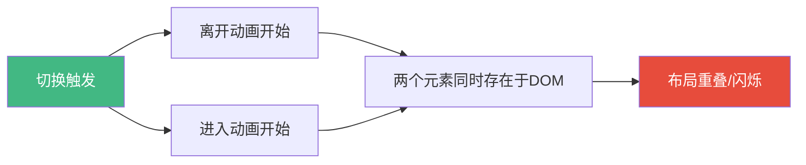
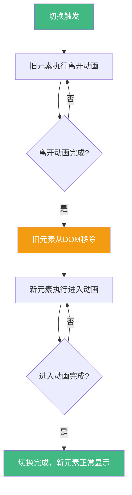
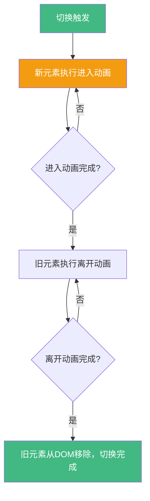
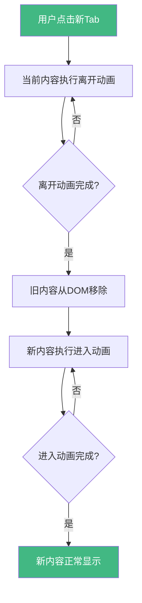
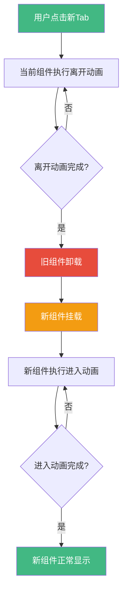

扫描[二维码](https://api2.cmdragon.cn/upload/cmder/20250304_012821924.jpg)关注或者微信搜一搜：`编程智域 前端至全栈交流与成长`

[发现1000+提升效率与开发的AI工具和实用程序](https://tools.cmdragon.cn/zh/apps?category=ai_chat)：https://tools.cmdragon.cn/zh/apps?category=ai_chat

## 一、默认行为——两个元素同时动画，撞车了

上一篇咱们聊了Transition组件的6个CSS类名，知道了元素怎么"进场"和"退场"。但那都是单个元素的情况，如果两个元素要切换呢？比如一个`v-if`和一个`v-else`，一个走了另一个来，这俩动画怎么配合？

先说结论：默认情况下，Vue会让进入动画和离开动画**同时执行**。听起来好像没啥问题，但你想想——旧元素还没走干净呢，新元素就挤进来了，两个元素同时占据同一块DOM空间，那画面……啧啧，跟两个人同时挤一扇门一样，谁也别想好好过。

来，看个例子就明白了：

```vue
<template>
  <!-- 没有设置mode，默认同时执行进入和离开 -->
  <Transition>
    <!-- v-if和v-else互斥切换，但动画同时发生 -->
    <div v-if="isOn" key="on" class="box on">开启状态</div>
    <div v-else key="off" class="box off">关闭状态</div>
  </Transition>
  <!-- 按钮切换状态 -->
  <button @click="isOn = !isOn">切换</button>
</template>

<script setup>
import { ref } from "vue";

// 控制显示哪个元素
const isOn = ref(true);
</script>

<style>
/* 两个box的基础样式 */
.box {
  width: 200px;
  height: 80px;
  display: flex;
  align-items: center;
  justify-content: center;
  border-radius: 8px;
  font-weight: bold;
  color: white;
}

/* 开启状态的背景色 */
.on {
  background: #42b883;
}

/* 关闭状态的背景色 */
.off {
  background: #e74c3c;
}

/* 进入和离开的过渡效果 */
.v-enter-active,
.v-leave-active {
  transition: all 0.5s ease;
}

/* 进入起始：从左侧滑入且透明 */
.v-enter-from {
  opacity: 0;
  transform: translateX(-30px);
}

/* 离开结束：向右侧滑出且透明 */
.v-leave-to {
  opacity: 0;
  transform: translateX(30px);
}
</style>
```

你运行一下就知道了——点击切换按钮的时候，旧元素还在往右滑出去呢，新元素已经从左边挤进来了。两个元素叠在一起，布局直接乱套，视觉上就是一坨糊在一起的东西在闪。

这就是默认行为的"撞车"问题。Vue官方文档也明确说了：当两个元素切换时，默认的进入和离开是同时发生的，这可能导致布局重叠。

打个比方吧：想象一个房间只有一扇门，里面的人要出来，外面的人要进去。如果两个人同时挤，那肯定卡在门口对吧？得有个先后顺序才行。这就是过渡模式（Transition Mode）要解决的问题。



上图就是默认行为的流程——进入和离开同时触发，两个元素在DOM里"撞车"，导致布局重叠和视觉闪烁。那咋解决呢？往下看。

## 二、mode="out-in"——先走后进，最常用

Vue给Transition组件提供了一个`mode`属性，专门用来控制进入和离开动画的执行顺序。最常用的就是`mode="out-in"`，意思是：**离开动画先执行完，再执行进入动画**。

就像换班一样——上一班的人先走了，下一班的人再进来，井然有序，谁也不碍谁。

用法特别简单，在`<Transition>`上加一个`mode`属性就行：

```vue
<template>
  <!-- 加上mode="out-in"，先走后进 -->
  <Transition mode="out-in">
    <!-- 每个元素必须加key，否则Vue会复用元素导致动画不触发 -->
    <div v-if="isOn" key="on" class="box on">开启状态</div>
    <div v-else key="off" class="box off">关闭状态</div>
  </Transition>
  <button @click="isOn = !isOn">切换</button>
</template>

<script setup>
import { ref } from "vue";

// 控制显示哪个元素
const isOn = ref(true);
</script>

<style>
.box {
  width: 200px;
  height: 80px;
  display: flex;
  align-items: center;
  justify-content: center;
  border-radius: 8px;
  font-weight: bold;
  color: white;
}

.on {
  background: #42b883;
}

.off {
  background: #e74c3c;
}

/* 进入动画用ease-in-out，更丝滑 */
.v-enter-active {
  transition: all 0.3s ease-in;
}

/* 离开动画用ease-out，快速离场 */
.v-leave-active {
  transition: all 0.3s ease-out;
}

.v-enter-from {
  opacity: 0;
  transform: translateX(-30px);
}

.v-leave-to {
  opacity: 0;
  transform: translateX(30px);
}
</style>
```

加了`mode="out-in"`之后，切换流程就变成了这样：

1. 点击切换按钮
2. 旧元素执行离开动画（往右滑出+淡出）
3. 离开动画结束，旧元素从DOM中移除
4. 新元素执行进入动画（从左滑入+淡入）

整个过程清清爽爽，没有任何重叠。这也是为什么`out-in`是最常用的模式——绝大多数切换场景用它就对了。

来看一下`out-in`模式的完整流程图：



### 啥时候用out-in？

基本上90%的元素切换场景都适合用`out-in`：

- **Tab标签页切换**：旧内容先淡出，新内容再淡入
- **弹窗替换**：一个弹窗关了，另一个再开
- **步骤向导**：上一步的内容先走，下一步的内容再进来
- **登录/注册切换**：登录表单先消失，注册表单再出现

总之，只要你不希望两个元素同时出现在同一个位置，用`out-in`准没错。

## 三、mode="in-out"——先进后走，少用但有用

跟`out-in`相反，`mode="in-out"`的意思是：**进入动画先执行，再执行离开动画**。新元素先挤进来，旧元素再走。

你可能会想：这不是更挤了吗？确实，大多数情况下用`in-out`会让两个元素短暂重叠，看起来更乱。但在某些特定场景下，它反而能做出很酷的效果。

打个比方：接力赛交接棒——新选手先跑起来，旧选手再把棒交过去，然后旧选手才退场。这种"先进后走"的效果，适合那种新元素需要从旧元素的位置"推"出来的场景。

```vue
<template>
  <!-- mode="in-out"，先进后走 -->
  <Transition mode="in-out">
    <div v-if="isOn" key="on" class="box on">开启状态</div>
    <div v-else key="off" class="box off">关闭状态</div>
  </Transition>
  <button @click="isOn = !isOn">切换</button>
</template>

<script setup>
import { ref } from "vue";

const isOn = ref(true);
</script>

<style>
.box {
  width: 200px;
  height: 80px;
  display: flex;
  align-items: center;
  justify-content: center;
  border-radius: 8px;
  font-weight: bold;
  color: white;
  /* 关键：绝对定位，让新元素可以叠在旧元素上方 */
  position: absolute;
}

.on {
  background: #42b883;
}

.off {
  background: #e74c3c;
}

/* 进入动画：从0缩放到正常大小 */
.v-enter-active {
  transition: all 0.3s ease-out;
}

/* 离开动画：从正常大小缩放到0 */
.v-leave-active {
  transition: all 0.3s ease-in;
}

/* 进入起始：缩小且透明 */
.v-enter-from {
  opacity: 0;
  transform: scale(0.8);
}

/* 离开结束：放大且透明 */
.v-leave-to {
  opacity: 0;
  transform: scale(1.2);
}
</style>
```

注意上面代码里有个关键点：`.box`加了`position: absolute`。因为`in-out`模式下新元素先进入，旧元素后离开，两个元素会短暂共存于DOM中。如果不用绝对定位，两个块级元素会上下排列，效果就完全不对了。用绝对定位让它们叠在同一位置，新元素"盖"在旧元素上面，看起来就像新元素把旧元素"推"走了。

`in-out`的流程如下：



### 啥时候用in-out？

`in-out`用得确实少，但以下场景它就特别合适：

- **按钮状态切换**：比如"收藏"变"已收藏"，新状态从原位置弹出来，旧状态再消失，视觉上很连贯
- **卡片翻转效果**：正面先出现，背面再消失，模拟3D翻转
- **滑动覆盖**：新内容从下方滑入覆盖旧内容，旧内容再淡出

一句话总结：当你希望新元素"推走"旧元素，而不是旧元素"让位"给新元素的时候，用`in-out`。

### out-in和in-out的对比

| 对比项   | mode="out-in"      | mode="in-out"              |
| -------- | ------------------ | -------------------------- |
| 执行顺序 | 离开先，进入后     | 进入先，离开后             |
| 元素共存 | 不会共存           | 短暂共存                   |
| 布局影响 | 无重叠             | 需要处理重叠（如绝对定位） |
| 使用频率 | 非常高，90%场景    | 较低，特定场景             |
| 典型场景 | Tab切换、表单切换  | 按钮状态、覆盖式切换       |
| 视觉感受 | 旧走新来，干净利落 | 新推旧走，连贯流畅         |

## 四、v-if/v-else/v-else-if的切换动画

前面举的例子都是`v-if`和`v-else`两个分支的切换，实际上Vue的条件渲染还有`v-else-if`，可以搞出更多分支。不管是两个还是三个四个分支，过渡模式的用法都是一样的。

但有一个**超级重要的坑**必须提醒你：**每个分支的元素必须加不同的`key`！**

为啥？因为Vue的虚拟DOM有个"复用策略"——如果两个元素标签相同（比如都是`<div>`），Vue会认为它们是同一个元素，只更新内容而不重新创建。这意味着进入和离开动画都不会触发，你写了半天Transition结果啥效果都没有。

来看一个Tab切换的完整示例：

```vue
<template>
  <div class="tab-demo">
    <!-- 三个Tab按钮 -->
    <div class="tab-buttons">
      <button
        v-for="tab in tabs"
        :key="tab.id"
        :class="{ active: currentTab === tab.id }"
        @click="currentTab = tab.id"
      >
        {{ tab.label }}
      </button>
    </div>

    <!-- Transition包裹切换内容，使用out-in模式 -->
    <Transition name="fade-slide" mode="out-in">
      <!-- 每个分支必须加不同的key！ -->
      <div v-if="currentTab === 'home'" key="home" class="tab-content">
        🏠 首页：欢迎来到我的博客！
      </div>
      <div v-else-if="currentTab === 'about'" key="about" class="tab-content">
        👤 关于：我是一名前端开发者
      </div>
      <div v-else key="contact" class="tab-content">
        📧 联系：hello@example.com
      </div>
    </Transition>
  </div>
</template>

<script setup>
import { ref } from "vue";

// 当前选中的Tab
const currentTab = ref("home");

// Tab列表数据
const tabs = [
  { id: "home", label: "首页" },
  { id: "about", label: "关于" },
  { id: "contact", label: "联系" },
];
</script>

<style>
/* Tab按钮区域 */
.tab-buttons {
  display: flex;
  gap: 8px;
  margin-bottom: 16px;
}

/* Tab按钮样式 */
.tab-buttons button {
  padding: 8px 16px;
  border: 2px solid #42b883;
  background: white;
  color: #42b883;
  border-radius: 6px;
  cursor: pointer;
  font-size: 14px;
  transition: all 0.2s;
}

/* 激活状态的按钮 */
.tab-buttons button.active {
  background: #42b883;
  color: white;
}

/* Tab内容区域 */
.tab-content {
  padding: 20px;
  border: 2px solid #e0e0e0;
  border-radius: 8px;
  font-size: 16px;
  min-height: 100px;
  display: flex;
  align-items: center;
}

/* 命名过渡：fade-slide的进入动画 */
.fade-slide-enter-active {
  transition: all 0.3s ease-out;
}

/* 命名过渡：fade-slide的离开动画 */
.fade-slide-leave-active {
  transition: all 0.2s ease-in;
}

/* 进入起始状态 */
.fade-slide-enter-from {
  opacity: 0;
  transform: translateY(10px);
}

/* 离开结束状态 */
.fade-slide-leave-to {
  opacity: 0;
  transform: translateY(-10px);
}
</style>
```

这里用了**命名过渡**（`name="fade-slide"`），这样CSS类名就变成了`fade-slide-enter-active`而不是默认的`v-enter-active`，避免跟其他Transition组件的样式冲突。这是一个好习惯，推荐每次都用命名过渡。

来看一下`v-if/v-else-if/v-else`配合`mode="out-in"`的完整流程：



### key不加会咋样？

如果你把上面代码里的`key`去掉，切换Tab的时候你会发现——啥动画都没有，内容直接就变了。因为Vue看到三个`<div>`，觉得它们是同一个元素，只更新了里面的文字，并没有触发进入/离开的过渡。

所以记住这条铁律：**在Transition里用`v-if/v-else`切换时，每个分支必须加不同的`key`！**

## 五、动态组件切换动画

除了`v-if/v-else`的条件切换，Vue还有一种很常见的切换方式——**动态组件**，就是用`<component :is="...">`来动态渲染不同的组件。Transition同样能给动态组件切换加上动画。

用法跟条件渲染差不多，把`<component>`放在`<Transition>`里面就行：

```vue
<template>
  <div class="dynamic-demo">
    <!-- Tab按钮 -->
    <div class="tab-buttons">
      <button
        v-for="tab in tabs"
        :key="tab.component"
        :class="{ active: currentTab === tab.component }"
        @click="currentTab = tab.component"
      >
        {{ tab.label }}
      </button>
    </div>

    <!-- Transition包裹动态组件，使用out-in模式 -->
    <Transition name="component-fade" mode="out-in">
      <!-- 动态组件，:is绑定当前组件名 -->
      <component :is="currentTab" :key="currentTab" />
    </Transition>
  </div>
</template>

<script setup>
import { ref, shallowRef } from "vue";
import HomeTab from "./HomeTab.vue";
import AboutTab from "./AboutTab.vue";
import ContactTab from "./ContactTab.vue";

// 当前显示的组件
const currentTab = shallowRef(HomeTab);

// Tab配置列表
const tabs = [
  { label: "首页", component: HomeTab },
  { label: "关于", component: AboutTab },
  { label: "联系", component: ContactTab },
];
</script>

<style>
.tab-buttons {
  display: flex;
  gap: 8px;
  margin-bottom: 16px;
}

.tab-buttons button {
  padding: 8px 16px;
  border: 2px solid #42b883;
  background: white;
  color: #42b883;
  border-radius: 6px;
  cursor: pointer;
  font-size: 14px;
  transition: all 0.2s;
}

.tab-buttons button.active {
  background: #42b883;
  color: white;
}

/* 命名过渡：component-fade */
.component-fade-enter-active {
  transition: opacity 0.3s ease;
}

.component-fade-leave-active {
  transition: opacity 0.2s ease;
}

.component-fade-enter-from,
.component-fade-leave-to {
  opacity: 0;
}
</style>
```

上面代码里用`shallowRef`而不是`ref`来存储当前组件，这是Vue官方推荐的做法——组件对象不需要深度响应式，用`shallowRef`性能更好。

三个子组件长这样：

```vue
<!-- HomeTab.vue -->
<template>
  <div class="tab-panel">
    <h3>🏠 首页</h3>
    <p>欢迎来到我的博客，这里分享Vue 3的技术文章。</p>
  </div>
</template>

<style scoped>
.tab-panel {
  padding: 20px;
  border: 2px solid #e0e0e0;
  border-radius: 8px;
  min-height: 120px;
}
</style>
```

```vue
<!-- AboutTab.vue -->
<template>
  <div class="tab-panel">
    <h3>👤 关于</h3>
    <p>我是一名前端开发者，热爱Vue和开源。</p>
  </div>
</template>

<style scoped>
.tab-panel {
  padding: 20px;
  border: 2px solid #e0e0e0;
  border-radius: 8px;
  min-height: 120px;
}
</style>
```

```vue
<!-- ContactTab.vue -->
<template>
  <div class="tab-panel">
    <h3>📧 联系</h3>
    <p>邮箱：hello@example.com</p>
  </div>
</template>

<style scoped>
.tab-panel {
  padding: 20px;
  border: 2px solid #e0e0e0;
  border-radius: 8px;
  min-height: 120px;
}
</style>
```

### 动态组件切换的注意事项

1. **必须加`key`**：跟`v-if/v-else`一样，动态组件也需要加`:key`。如果不加，Vue可能会复用同一个组件实例，导致动画不触发或者状态残留。

2. **用`shallowRef`存储组件**：组件对象本身不需要深度响应式，用`shallowRef`可以避免不必要的性能开销。如果你用`ref`，Vue会递归地把组件对象的所有属性都变成响应式的，这完全没必要。

3. **`mode="out-in"`是最佳拍档**：动态组件切换几乎都用`out-in`，因为你不希望两个组件同时出现在页面上。`in-out`会导致两个组件短暂共存，布局容易乱。

4. **组件名和`key`要对应**：如果你用字符串形式的组件名（比如`:is="'HomeTab'"`），确保组件已经全局注册或者通过`components`选项局部注册。更推荐直接用组件对象（像上面的例子那样），这样不需要额外注册。

来看一下动态组件切换的完整流程图：



注意跟`v-if/v-else`的区别：动态组件切换时，旧组件会**卸载**（触发`onUnmounted`），新组件会**挂载**（触发`onMounted`）。如果你在组件里有副作用（比如定时器、事件监听），记得在`onUnmounted`里清理干净。

## 课后 Quiz

### 问题1：Transition组件默认的进入和离开动画执行方式是什么？会导致什么问题？

**答案解析**：

默认情况下，Transition组件会让进入动画和离开动画**同时执行**。也就是说，当元素A离开的同时，元素B就开始进入了。

这会导致两个问题：

1. **布局重叠**：两个元素同时存在于DOM中，如果它们是块级元素且没有绝对定位，就会上下排列导致布局跳动；如果用了绝对定位，视觉上两个元素会叠在一起。
2. **视觉闪烁**：两个元素的动画同时播放，过渡效果互相干扰，看起来就像画面在闪烁或者抖动。

解决办法就是设置`mode`属性，用`out-in`或`in-out`来控制执行顺序。

### 问题2：mode="out-in"和mode="in-out"的核心区别是什么？分别适合什么场景？

**答案解析**：

核心区别在于**进入和离开动画的执行顺序**：

- `mode="out-in"`：离开动画先执行完，再执行进入动画。旧元素彻底走了，新元素才进来。适合绝大多数切换场景，比如Tab切换、表单切换、步骤向导等。不会出现元素重叠的问题。

- `mode="in-out"`：进入动画先执行，再执行离开动画。新元素先进来，旧元素再走。适合需要新元素"推走"旧元素的场景，比如按钮状态切换（"收藏"变"已收藏"）、卡片翻转效果等。因为两个元素会短暂共存，通常需要配合绝对定位使用。

选择原则：90%的场景用`out-in`，只有当你明确需要"先进后走"的视觉效果时才用`in-out`。

### 问题3：为什么在Transition中使用v-if/v-else切换时，必须给每个元素加不同的key？

**答案解析**：

因为Vue的虚拟DOM有一个**复用策略**（也叫patch算法）。当Vue发现两个元素的标签名相同（比如都是`<div>`），它会认为这是同一个元素，只更新元素的内容（比如文字、属性），而不会销毁旧元素、创建新元素。

而Transition的进入/离开动画，恰恰依赖于元素的**创建和销毁**。只有元素被插入DOM时才会触发进入动画，只有元素被移除DOM时才会触发离开动画。如果Vue复用了元素，那既没有创建也没有销毁，动画自然就不会触发了。

加了不同的`key`之后，Vue会认为它们是不同的元素，切换时就会先销毁旧元素（触发离开动画），再创建新元素（触发进入动画），动画就能正常工作了。

这也是Vue官方文档强调的一点：当在Transition中使用`v-if/v-else`切换时，始终要为不同分支的元素设置不同的key。

## 常见报错解决方案

### 报错1：Transition组件里的v-if/v-else切换没有动画效果

**产生原因**：

最常见的原因就是**没加`key`**。没有`key`的时候，Vue会复用相同的DOM元素，只更新内容而不触发进入/离开过渡。另外，如果CSS过渡类名写错了（比如用了默认的`v-enter-active`但Transition设了`name`），也会导致样式不生效。

**解决方案**：

1. 给每个条件分支的元素加上不同的`key`属性
2. 检查CSS类名是否跟Transition的`name`属性匹配。如果设了`name="fade"`，类名应该是`fade-enter-active`而不是`v-enter-active`
3. 确保CSS过渡属性（`transition`）写在`-enter-active`和`-leave-active`类里，而不是写在`-enter-from`或`-leave-to`里

**预防建议**：养成习惯，在Transition里用条件渲染时，始终给元素加`key`，并且使用命名过渡（`name`属性）避免样式冲突。

### 报错2：mode="in-out"时布局跳动或元素上下排列

**产生原因**：

`in-out`模式下，新元素先进入，旧元素后离开，两个元素会短暂共存于DOM中。如果它们是普通的块级元素（`display: block`），就会上下排列而不是叠在一起，导致布局跳动。

**解决方案**：

1. 给切换的元素加`position: absolute`，让它们脱离文档流，叠在同一位置
2. 给Transition的父容器加`position: relative`和固定高度，防止容器塌陷
3. 如果不想用绝对定位，也可以用`display: inline-block`配合固定宽度

```css
/* 父容器需要相对定位和固定高度 */
.transition-wrapper {
  position: relative;
  height: 80px;
}

/* 切换的元素绝对定位，叠在一起 */
.transition-wrapper .box {
  position: absolute;
  top: 0;
  left: 0;
}
```

**预防建议**：使用`in-out`模式时，提前考虑元素共存时的布局问题，提前设置好定位方案。

### 报错3：动态组件切换时Transition动画不触发

**产生原因**：

动态组件切换时动画不触发，通常有以下几个原因：

1. **没加`:key`**：跟`v-if/v-else`一样，动态组件也需要`:key`来区分不同的组件实例
2. **组件引用方式不对**：如果用字符串形式的组件名（`:is="'ComponentA'"`），但组件没有全局注册或局部注册，Vue会渲染不出组件，自然也没有动画
3. **用了`ref`而不是`shallowRef`**：虽然不会直接导致动画不触发，但`ref`会对组件对象做深度响应式处理，可能导致不必要的性能问题和警告

**解决方案**：

1. 给`<component>`加`:key`属性：`<component :is="currentTab" :key="currentTab" />`
2. 使用组件对象而不是字符串名：`const currentTab = shallowRef(HomeTab)`而不是`const currentTab = ref('HomeTab')`
3. 确保组件已正确导入和注册

```vue
<!-- 正确写法 -->
<Transition name="fade" mode="out-in">
  <component :is="currentTab" :key="currentTab" />
</Transition>

<script setup>
import { shallowRef } from "vue";
import HomeTab from "./HomeTab.vue";
import AboutTab from "./AboutTab.vue";

// 用shallowRef存储组件对象
const currentTab = shallowRef(HomeTab);
</script>
```

**预防建议**：动态组件切换时，始终使用`shallowRef`存储组件对象，始终加`:key`属性，始终配合`mode="out-in"`使用。

参考链接：https://vuejs.org/guide/built-ins/transition.html

余下文章内容请点击跳转至 个人博客页面 或者 扫描[二维码](https://api2.cmdragon.cn/upload/cmder/20250304_012821924.jpg)关注或者微信搜一搜：`编程智域 前端至全栈交流与成长`，阅读完整的文章：[两个元素切换时撞车了咋办？过渡模式out-in和in-out来救场](https://blog.cmdragon.cn/posts/d0e1f2a3b4c5d6e7f8a9b0c1d2e3f4a5/)

<details>
<summary>往期文章归档</summary>

- [Vue 3 静态与动态 Props 如何传递？TypeScript 类型约束有何必要？](https://blog.cmdragon.cn/posts/94ab48753b64780ca3ab7a7115ae8522/)
- [Vue 3中组件局部注册的优势与实现方式如何？](https://blog.cmdragon.cn/posts/dbf576e744870f6de26fd8a2e03e47da/)
- [如何在Vue3中优化生命周期钩子性能并规避常见陷阱？](https://blog.cmdragon.cn/posts/12d98b3b9ccd6c19a1b169d720ac5c80/)
- [Vue 3 Composition API生命周期钩子：如何实现从基础理解到高阶复用？](https://blog.cmdragon.cn/posts/8884e2b70287fcb263c57648eeb27419/)
- [Vue 3生命周期钩子实战指南：如何正确选择onMounted、onUpdated与onUnmounted的应用场景？](https://blog.cmdragon.cn/posts/883c6dbc50ae4183770a4462e0b8ae4d/)
- [Vue 3中生命周期钩子与响应式系统如何实现协同工作？](https://blog.cmdragon.cn/posts/70dad360ffa9dce14d0d69611b8cb019/)
- [Vue 3组件生命周期钩子的执行顺序与使用场景是什么？](https://blog.cmdragon.cn/posts/db44294a78dc9f666f67b053f6c83567/)
- [Vue组件全局注册与局部注册如何抉择？](https://blog.cmdragon.cn/posts/43ead630ea17da65d99ad2eb8188e472/)
- [Vue3组件化开发中，Props与Emits如何实现数据流转与事件协作？](https://blog.cmdragon.cn/posts/8cff7d2df113da66ea7be560c4d1d22a/)
- [Vue 3模板引用如何与其他特性协同实现复杂交互？](https://blog.cmdragon.cn/posts/331bf75d114ab09116eadfcdca602b58/)
- [Vue 3 v-for中模板引用如何实现高效管理与动态控制？](https://blog.cmdragon.cn/posts/cb380897ddc3578b180ecf8843c774c1/)
- [Vue 3的defineExpose：如何突破script setup组件默认封装，实现精准的父子通讯？](https://blog.cmdragon.cn/posts/202ae0f4acde7128e0e31baf63732fb5/)
- [Vue 3模板引用的生命周期时机如何把握？常见陷阱该如何避免？](https://blog.cmdragon.cn/posts/7d2a0f6555ecbe92afd7d2491c427463/)
- [Vue 3模板引用如何实现父组件与子组件的高效交互？](https://blog.cmdragon.cn/posts/3fb7bdd84128b7efaaa1c979e1f28dee/)
- [Vue中为何需要模板引用？又如何高效实现DOM与组件实例的直接访问？](https://blog.cmdragon.cn/posts/23f3464ba16c7054b4783cded50c04c6/)

</details>

<details>
<summary>免费好用的热门在线工具</summary>

- [多直播聚合器 - 应用商店 | By cmdragon](https://tools.cmdragon.cn/zh/apps/multi-live-aggregator)
- [Proto文件生成器 - 应用商店 | By cmdragon](https://tools.cmdragon.cn/zh/apps/proto-file-generator)
- [图片转粒子 - 应用商店 | By cmdragon](https://tools.cmdragon.cn/zh/apps/image-to-particles)
- [视频下载器 - 应用商店 | By cmdragon](https://tools.cmdragon.cn/zh/apps/video-downloader)
- [文件格式转换器 - 应用商店 | By cmdragon](https://tools.cmdragon.cn/zh/apps/file-converter)
- [M3U8在线播放器 - 应用商店 | By cmdragon](https://tools.cmdragon.cn/zh/apps/m3u8-player)
- [快图设计 - 应用商店 | By cmdragon](https://tools.cmdragon.cn/zh/apps/quick-image-design)
- [高级文字转图片转换器 - 应用商店 | By cmdragon](https://tools.cmdragon.cn/zh/apps/text-to-image-advanced)
- [RAID 计算器 - 应用商店 | By cmdragon](https://tools.cmdragon.cn/zh/apps/raid-calculator)
- [在线PS - 应用商店 | By cmdragon](https://tools.cmdragon.cn/zh/apps/photoshop-online)
- [Mermaid 在线编辑器 - 应用商店 | By cmdragon](https://tools.cmdragon.cn/zh/apps/mermaid-live-editor)
- [数学求解计算器 - 应用商店 | By cmdragon](https://tools.cmdragon.cn/zh/apps/math-solver-calculator)
- [智能提词器 - 应用商店 | By cmdragon](https://tools.cmdragon.cn/zh/apps/smart-teleprompter)
- [魔法简历 - 应用商店 | By cmdragon](https://tools.cmdragon.cn/zh/apps/magic-resume)
- [Image Puzzle Tool - 图片拼图工具 | By cmdragon](https://tools.cmdragon.cn/zh/apps/image-puzzle-tool)
- [字幕下载工具 - 应用商店 | By cmdragon](https://tools.cmdragon.cn/zh/apps/subtitle-downloader)
- [歌词生成工具 - 应用商店 | By cmdragon](https://tools.cmdragon.cn/zh/apps/lyrics-generator)
- [网盘资源聚合搜索 - 应用商店 | By cmdragon](https://tools.cmdragon.cn/zh/apps/cloud-drive-search)
- [ASCII字符画生成器 - 应用商店 | By cmdragon](https://tools.cmdragon.cn/zh/apps/ascii-art-generator)
- [JSON Web Tokens 工具 - 应用商店 | By cmdragon](https://tools.cmdragon.cn/zh/apps/jwt-tool)
- [Bcrypt 密码工具 - 应用商店 | By cmdragon](https://tools.cmdragon.cn/zh/apps/bcrypt-tool)
- [GIF 合成器 - 应用商店 | By cmdragon](https://tools.cmdragon.cn/zh/apps/gif-composer)
- [GIF 分解器 - 应用商店 | By cmdragon](https://tools.cmdragon.cn/zh/apps/gif-decomposer)
- [文本隐写术 - 应用商店 | By cmdragon](https://tools.cmdragon.cn/zh/apps/text-steganography)
- [CMDragon 在线工具 - 高级AI工具箱与开发者套件 | 免费好用的在线工具](https://tools.cmdragon.cn/zh)
- [应用商店 - 发现1000+提升效率与开发的AI工具和实用程序 | 免费好用的在线工具](https://tools.cmdragon.cn/zh/apps?category=trending)
- [CMDragon 更新日志 - 最新更新、功能与改进 | 免费好用的在线工具](https://tools.cmdragon.cn/zh/changelog)
- [支持我们 - 成为赞助者 | 免费好用的在线工具](https://tools.cmdragon.cn/zh/sponsor)
- [AI文本生成图像 - 应用商店 | 免费好用的在线工具](https://tools.cmdragon.cn/zh/apps/text-to-image-ai)
- [临时邮箱 - 应用商店 | 免费好用的在线工具](https://tools.cmdragon.cn/zh/apps/temp-email)
- [二维码解析器 - 应用商店 | 免费好用的在线工具](https://tools.cmdragon.cn/zh/apps/qrcode-parser)
- [文本转思维导图 - 应用商店 | 免费好用的在线工具](https://tools.cmdragon.cn/zh/apps/text-to-mindmap)
- [正则表达式可视化工具 - 应用商店 | 免费好用的在线工具](https://tools.cmdragon.cn/zh/apps/regex-visualizer)
- [文件隐写工具 - 应用商店 | 免费好用的在线工具](https://tools.cmdragon.cn/zh/apps/steganography-tool)
- [IPTV 频道探索器 - 应用商店 | 免费好用的在线工具](https://tools.cmdragon.cn/zh/apps/iptv-explorer)
- [快传 - 应用商店 | By cmdragon](https://tools.cmdragon.cn/zh/apps/snapdrop)
- [随机抽奖工具 - 应用商店 | 免费好用的在线工具](https://tools.cmdragon.cn/zh/apps/lucky-draw)
- [动漫场景查找器 - 应用商店 | 免费好用的在线工具](https://tools.cmdragon.cn/zh/apps/anime-scene-finder)
- [时间工具箱 - 应用商店 | 免费好用的在线工具](https://tools.cmdragon.cn/zh/apps/time-toolkit)
- [网速测试 - 应用商店 | 免费好用的在线工具](https://tools.cmdragon.cn/zh/apps/speed-test)
- [AI 智能抠图工具 - 应用商店 | 免费好用的在线工具](https://tools.cmdragon.cn/zh/apps/background-remover)
- [背景替换工具 - 应用商店 | 免费好用的在线工具](https://tools.cmdragon.cn/zh/apps/background-replacer)
- [艺术二维码生成器 - 应用商店 | 免费好用的在线工具](https://tools.cmdragon.cn/zh/apps/artistic-qrcode)
- [Open Graph 元标签生成器 - 应用商店 | 免费好用的在线工具](https://tools.cmdragon.cn/zh/apps/open-graph-generator)
- [图像对比工具 - 应用商店 | 免费好用的在线工具](https://tools.cmdragon.cn/zh/apps/image-comparison)
- [图片压缩专业版 - 应用商店 | 免费好用的在线工具](https://tools.cmdragon.cn/zh/apps/image-compressor)
- [密码生成器 - 应用商店 | 免费好用的在线工具](https://tools.cmdragon.cn/zh/apps/password-generator)
- [SVG优化器 - 应用商店 | 免费好用的在线工具](https://tools.cmdragon.cn/zh/apps/svg-optimizer)
- [调色板生成器 - 应用商店 | 免费好用的在线工具](https://tools.cmdragon.cn/zh/apps/color-palette)
- [在线节拍器 - 应用商店 | 免费好用的在线工具](https://tools.cmdragon.cn/zh/apps/online-metronome)
- [IP归属地查询 - 应用商店 | By cmdragon](https://tools.cmdragon.cn/zh/apps/ip-geolocation)
- [CSS网格布局生成器 - 应用商店 | 免费好用的在线工具](https://tools.cmdragon.cn/zh/apps/css-grid-layout)
- [邮箱验证工具 - 应用商店 | 免费好用的在线工具](https://tools.cmdragon.cn/zh/apps/email-validator)
- [书法练习字帖 - 应用商店 | 免费好用的在线工具](https://tools.cmdragon.cn/zh/apps/calligraphy-practice)
- [金融计算器套件 - 应用商店 | 免费好用的在线工具](https://tools.cmdragon.cn/zh/apps/finance-calculator-suite)
- [中国亲戚关系计算器 - 应用商店 | 免费好用的在线工具](https://tools.cmdragon.cn/zh/apps/chinese-kinship-calculator)
- [Protocol Buffer 工具箱 - 应用商店 | 免费好用的在线工具](https://tools.cmdragon.cn/zh/apps/protobuf-toolkit)
- [IP归属地查询 - 应用商店 | 免费好用的在线工具](https://tools.cmdragon.cn/zh/apps/ip-geolocation)
- [图片无损放大 - 应用商店 | 免费好用的在线工具](https://tools.cmdragon.cn/zh/apps/image-upscaler)
- [文本比较工具 - 应用商店 | 免费好用的在线工具](https://tools.cmdragon.cn/zh/apps/text-compare)
- [IP批量查询工具 - 应用商店 | 免费好用的在线工具](https://tools.cmdragon.cn/zh/apps/ip-batch-lookup)
- [域名查询工具 - 应用商店 | 免费好用的在线工具](https://tools.cmdragon.cn/zh/apps/domain-finder)
- [DNS工具箱 - 应用商店 | 免费好用的在线工具](https://tools.cmdragon.cn/zh/apps/dns-toolkit)
- [网站图标生成器 - 应用商店 | 免费好用的在线工具](https://tools.cmdragon.cn/zh/apps/favicon-generator)
- [XML Sitemap](https://tools.cmdragon.cn/sitemap_index.xml)

</details>
