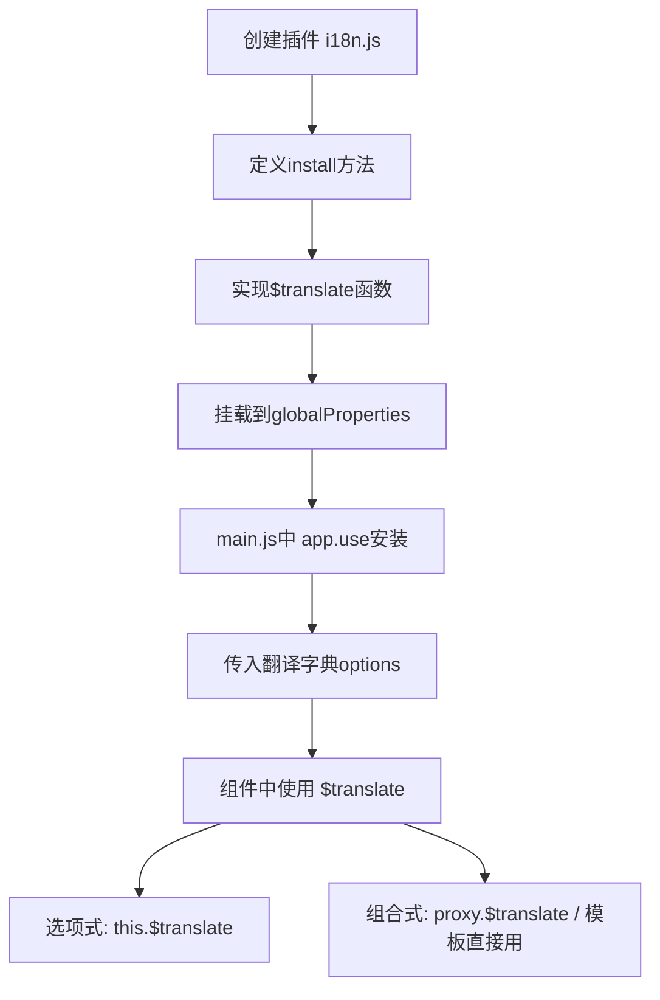

扫描[二维码](https://api2.cmdragon.cn/upload/cmder/20250304_012821924.jpg)关注或者微信搜一搜：`编程智域 前端至全栈交流与成长`

[发现1000+提升效率与开发的AI工具和实用程序](https://tools.cmdragon.cn/zh/apps?category=ai_chat)：https://tools.cmdragon.cn/zh/apps?category=ai_chat

## 一、先搞明白我们要干啥

i18n是"国际化"（Internationalization）的缩写——那个18是因为I和n之间有18个字母，程序员就是这么懒，能缩写绝不写全。

咱们要做的就是一个**翻译插件**：你给它一个key，它帮你找到对应的翻译文本。比如：

```html
<h1>{{ $translate('greetings.hello') }}</h1>
<!-- 输出：<h1>Bonjour!</h1> -->
```

这个`$translate`函数，我们希望它在**任何组件的模板里**都能直接用，不用每个组件单独导入。这就是插件的活儿了。

## 二、第一步：创建插件文件

建议把插件放在单独的文件里，方便管理：

```javascript
// plugins/i18n.js
export default {
  install(app, options) {
    // 插件代码写在这里
  },
};
```

就这么简单——一个对象，里面有个`install`方法。`app`是Vue应用实例，`options`是安装时传进来的配置。

## 三、第二步：实现翻译函数

咱们要实现的功能是：给一个`greetings.hello`这样的key，去翻译字典里找到对应的值。

翻译字典长这样：

```javascript
{
  greetings: {
    hello: '你好',
    goodbye: '再见'
  },
  menu: {
    home: '首页',
    about: '关于'
  }
}
```

那`greetings.hello`怎么找到`你好`呢？把key按`.`拆开，一层层往里找：

```javascript
// 'greetings.hello'.split('.') → ['greetings', 'hello']
// 先找 obj['greetings']，再找 obj['greetings']['hello']
key.split(".").reduce((obj, k) => {
  if (obj) return obj[k];
}, translations);
```

这个`reduce`可能看着有点绕，来拆解一下：

```javascript
// 假设 key = 'greetings.hello', translations = { greetings: { hello: '你好' } }

// 第一轮：obj = translations, k = 'greetings'
//   obj['greetings'] → { hello: '你好' }

// 第二轮：obj = { hello: '你好' }, k = 'hello'
//   obj['hello'] → '你好'

// 最终结果：'你好'
```

## 四、第三步：把翻译函数挂到globalProperties上

```javascript
// plugins/i18n.js
export default {
  install(app, options) {
    app.config.globalProperties.$translate = (key) => {
      return key.split(".").reduce((obj, k) => {
        if (obj) return obj[k];
      }, options);
    };
  },
};
```

`app.config.globalProperties`是Vue提供的一个对象，往上面挂的东西，所有组件都能通过`this`访问到。所以挂了`$translate`之后，任何组件里都能用`this.$translate()`。

按惯例，全局属性名以`$`开头，这样一眼就能看出这是个Vue注入的全局方法，跟你自己定义的data/methods区分开。

## 五、第四步：在main.js中安装插件

```javascript
// main.js
import { createApp } from "vue";
import App from "./App.vue";
import i18nPlugin from "./plugins/i18n.js";

const app = createApp(App);

app.use(i18nPlugin, {
  greetings: {
    hello: "你好",
    goodbye: "再见",
  },
  menu: {
    home: "首页",
    about: "关于",
  },
});

app.mount("#app");
```

注意`app.use()`的第二个参数——这就是传给插件`install`方法的`options`。翻译字典就是通过这个参数传进去的。

## 六、在组件中使用

### 选项式API

```vue
<template>
  <h1>{{ $translate("greetings.hello") }}</h1>
  <p>{{ $translate("menu.home") }}</p>
</template>
```

在选项式API的模板中，`$translate`可以直接用，因为模板会自动从`this`上找属性。

在JS中：

```javascript
export default {
  mounted() {
    const hello = this.$translate("greetings.hello");
    console.log(hello); // '你好'
  },
};
```

### 组合式API（script setup）

在`<script setup>`中没有`this`，所以不能直接用`this.$translate`。需要通过`getCurrentInstance`来访问：

```vue
<script setup>
import { getCurrentInstance } from "vue";

const { proxy } = getCurrentInstance();

const hello = proxy.$translate("greetings.hello");
console.log(hello); // '你好'
</script>

<template>
  <!-- 模板中还是可以直接用 -->
  <h1>{{ $translate("greetings.hello") }}</h1>
</template>
```

不过说实话，在组合式API中用`getCurrentInstance`来访问globalProperties有点别扭。后面我们会讲更优雅的方式——用`app.provide()` + `inject()`。



## 七、让翻译函数更健壮

上面的`$translate`还有几个问题，咱们来修一修：

### 问题一：key找不到时返回undefined

```javascript
$translate("not.exist.key"); // undefined
```

加个默认值：

```javascript
app.config.globalProperties.$translate = (key, defaultValue = "") => {
  const result = key.split(".").reduce((obj, k) => {
    if (obj) return obj[k];
  }, options);
  return result !== undefined ? result : defaultValue;
};
```

### 问题二：key不是字符串时会报错

```javascript
$translate(123); // split不是数字的方法，报错
```

加个类型检查：

```javascript
app.config.globalProperties.$translate = (key, defaultValue = "") => {
  if (typeof key !== "string") return defaultValue;
  const result = key.split(".").reduce((obj, k) => {
    if (obj) return obj[k];
  }, options);
  return result !== undefined ? result : defaultValue;
};
```

### 问题三：支持动态切换语言

现在的翻译字典是安装时写死的，不能动态切换。咱们加个响应式的语言切换功能：

```javascript
// plugins/i18n.js
import { ref, computed } from "vue";

export default {
  install(app, options) {
    const locale = ref("zh");
    const messages = options;

    const $translate = (key, defaultValue = "") => {
      if (typeof key !== "string") return defaultValue;
      const currentMessages = messages[locale.value] || {};
      const result = key.split(".").reduce((obj, k) => {
        if (obj) return obj[k];
      }, currentMessages);
      return result !== undefined ? result : defaultValue;
    };

    app.config.globalProperties.$translate = $translate;
    app.config.globalProperties.$locale = locale;

    app.provide("i18n", {
      locale,
      translate: $translate,
      setLocale(lang) {
        if (messages[lang]) {
          locale.value = lang;
        }
      },
    });
  },
};
```

安装时传入多语言字典：

```javascript
app.use(i18nPlugin, {
  zh: {
    greetings: { hello: "你好", goodbye: "再见" },
    menu: { home: "首页", about: "关于" },
  },
  en: {
    greetings: { hello: "Hello", goodbye: "Goodbye" },
    menu: { home: "Home", about: "About" },
  },
});
```

组件里切换语言：

```vue
<script setup>
import { inject } from "vue";

const { locale, translate, setLocale } = inject("i18n");

function switchToEnglish() {
  setLocale("en");
}

function switchToChinese() {
  setLocale("zh");
}
</script>

<template>
  <h1>{{ translate("greetings.hello") }}</h1>
  <button @click="switchToEnglish">English</button>
  <button @click="switchToChinese">中文</button>
</template>
```

## 八、完整的插件代码

```javascript
// plugins/i18n.js
import { ref } from "vue";

export default {
  install(app, options) {
    const locale = ref("zh");
    const messages = options;

    function $translate(key, defaultValue = "") {
      if (typeof key !== "string") return defaultValue;
      const currentMessages = messages[locale.value] || {};
      const result = key.split(".").reduce((obj, k) => {
        if (obj) return obj[k];
      }, currentMessages);
      return result !== undefined ? result : defaultValue;
    }

    app.config.globalProperties.$translate = $translate;
    app.config.globalProperties.$locale = locale;

    app.provide("i18n", {
      locale,
      translate: $translate,
      setLocale(lang) {
        if (messages[lang]) {
          locale.value = lang;
        }
      },
      availableLocales: Object.keys(messages),
    });
  },
};
```

## 课后 Quiz

### 问题 1

`app.config.globalProperties`上挂的方法，在`<script setup>`中怎么访问？

#### 答案解析

`<script setup>`中没有`this`，不能直接访问globalProperties。有两种方式：

1. 通过`getCurrentInstance()`获取组件实例，再通过`proxy`访问
2. 更推荐的方式是用`app.provide()`把功能注入，组件中用`inject()`获取

第二种方式更符合组合式API的风格，也更好做类型推断。

### 问题 2

为什么全局属性名建议以`$`开头？

#### 答案解析

这是Vue的约定，以`$`开头的属性表示它是Vue或插件注入的全局方法/属性，跟组件自己定义的data、methods区分开。比如`$router`、`$route`、`$translate`——看到`$`开头就知道这不是你自己写的，是框架或插件提供的。

### 问题 3

`app.use(plugin, options)`中的`options`是怎么传到插件里的？

#### 答案解析

`app.use`内部调用插件的`install`方法时，会把`app`实例作为第一个参数，把`options`作为第二个参数传进去。所以`install(app, options)`中的`options`就是你调用`app.use`时传的第二个参数。

## 常见报错解决方案

### 报错 1：`this.$translate is not a function`

**错误场景**：

```vue
<script setup>
const msg = this.$translate("greetings.hello"); // 💥 setup中没有this
</script>
```

**报错原因**：
`<script setup>`中没有`this`对象，globalProperties上的方法无法通过`this`访问。

**解决方案**：
在模板中可以直接用`$translate`，在JS中用`getCurrentInstance`或`inject`：

```javascript
// 方式一：getCurrentInstance
import { getCurrentInstance } from "vue";
const { proxy } = getCurrentInstance();
const msg = proxy.$translate("greetings.hello");

// 方式二：inject（推荐）
const { translate } = inject("i18n");
const msg = translate("greetings.hello");
```

### 报错 2：`Cannot read property 'split' of undefined`

**错误场景**：

```javascript
$translate(undefined); // 💥 undefined没有split方法
```

**报错原因**：
翻译函数没有对key做类型检查，传入了非字符串类型的值。

**解决方案**：
在函数开头加类型检查：

```javascript
function $translate(key, defaultValue = "") {
  if (typeof key !== "string") return defaultValue;
  // ...
}
```

### 报错 3：翻译字典key写错了，返回undefined

**错误场景**：

```javascript
$translate("greeting.hello"); // 拼写错误：greeting少了个s
// 返回undefined，页面上显示空白
```

**报错原因**：
key拼写错误，在字典中找不到对应的翻译。

**解决方案**：
给`$translate`加默认值参数，找不到翻译时显示默认文本而不是空白：

```javascript
$translate("greeting.hello", "翻译缺失"); // 找不到时显示"翻译缺失"
```

同时在开发环境下可以加个警告：

```javascript
function $translate(key, defaultValue = "") {
  if (typeof key !== "string") return defaultValue;
  const result = key.split(".").reduce((obj, k) => {
    if (obj) return obj[k];
  }, messages[locale.value]);

  if (result === undefined && import.meta.env.DEV) {
    console.warn(`[i18n] Missing translation: ${key}`);
  }

  return result !== undefined ? result : defaultValue;
}
```

## 参考链接

- Vue 3 官方文档 - 插件：https://vuejs.org/guide/reusability/plugins.html
- Vue 3 官方文档 - 应用 API：https://vuejs.org/api/application.html
- Vue 3 官方文档 - globalProperties：https://vuejs.org/api/application.html#app-config-globalproperties

余下文章内容请点击跳转至 个人博客页面 或者 扫描[二维码](https://api2.cmdragon.cn/upload/cmder/20250304_012821924.jpg)关注或者微信搜一搜：`编程智域 前端至全栈交流与成长`，阅读完整的文章：[从零手写一个i18n国际化插件，原来app.use()背后干了这些事](https://blog.cmdragon.cn/posts/p2b3c4d5e6f7a8b9c0d1e2f3a4b5c6d7/)

<details>
<summary>往期文章归档</summary>

- [Vue 3 静态与动态 Props 如何传递？TypeScript 类型约束有何必要？](https://blog.cmdragon.cn/posts/94ab48753b64780ca3ab7a7115ae8522/)
- [Vue 3中组件局部注册的优势与实现方式如何？](https://blog.cmdragon.cn/posts/dbf576e744870f6de26fd8a2e03e47da/)
- [如何在Vue3中优化生命周期钩子性能并规避常见陷阱？](https://blog.cmdragon.cn/posts/12d98b3b9ccd6c19a1b169d720ac5c80/)
- [Vue 3 Composition API生命周期钩子：如何实现从基础理解到高阶复用？](https://blog.cmdragon.cn/posts/8884e2b70287fcb263c57648eeb27419/)
- [Vue 3生命周期钩子实战指南：如何正确选择onMounted、onUpdated与onUnmounted的应用场景？](https://blog.cmdragon.cn/posts/883c6dbc50ae4183770a4462e0b8ae4d/)
- [Vue 3中生命周期钩子与响应式系统如何实现协同工作？](https://blog.cmdragon.cn/posts/70dad360ffa9dce14d0d69611b8cb019/)
- [Vue 3组件生命周期钩子的执行顺序与使用场景是什么？](https://blog.cmdragon.cn/posts/db44294a78dc9f666f67b053f6c83567/)
- [Vue组件全局注册与局部注册如何抉择？](https://blog.cmdragon.cn/posts/43ead630ea17da65d99ad2eb8188e472/)
- [Vue3组件化开发中，Props与Emits如何实现数据流转与事件协作？](https://blog.cmdragon.cn/posts/8cff7d2df113da66ea7be560c4d1d22a/)
- [Vue 3模板引用如何与其他特性协同实现复杂交互？](https://blog.cmdragon.cn/posts/331bf75d114ab09116eadfcdca602b58/)
- [Vue 3 v-for中模板引用如何实现高效管理与动态控制？](https://blog.cmdragon.cn/posts/cb380897ddc3578b180ecf8843c774c1/)
- [Vue 3的defineExpose：如何突破script setup组件默认封装，实现精准的父子通讯？](https://blog.cmdragon.cn/posts/202ae0f4acde7128e0e31baf63732fb5/)
- [Vue 3模板引用的生命周期时机如何把握？常见陷阱该如何避免？](https://blog.cmdragon.cn/posts/7d2a0f6555ecbe92afd7d2491c427463/)
- [Vue 3模板引用如何实现父组件与子组件的高效交互？](https://blog.cmdragon.cn/posts/3fb7bdd84128b7efaaa1c979e1f28dee/)
- [Vue中为何需要模板引用？又如何高效实现DOM与组件实例的直接访问？](https://blog.cmdragon.cn/posts/23f3464ba16c7054b4783cded50c04c6/)

</details>

<details>
<summary>免费好用的热门在线工具</summary>

- [多直播聚合器 - 应用商店 | By cmdragon](https://tools.cmdragon.cn/zh/apps/multi-live-aggregator)
- [Proto文件生成器 - 应用商店 | By cmdragon](https://tools.cmdragon.cn/zh/apps/proto-file-generator)
- [图片转粒子 - 应用商店 | By cmdragon](https://tools.cmdragon.cn/zh/apps/image-to-particles)
- [视频下载器 - 应用商店 | By cmdragon](https://tools.cmdragon.cn/zh/apps/video-downloader)
- [文件格式转换器 - 应用商店 | By cmdragon](https://tools.cmdragon.cn/zh/apps/file-converter)
- [M3U8在线播放器 - 应用商店 | By cmdragon](https://tools.cmdragon.cn/zh/apps/m3u8-player)
- [快图设计 - 应用商店 | By cmdragon](https://tools.cmdragon.cn/zh/apps/quick-image-design)
- [高级文字转图片转换器 - 应用商店 | By cmdragon](https://tools.cmdragon.cn/zh/apps/text-to-image-advanced)
- [RAID 计算器 - 应用商店 | By cmdragon](https://tools.cmdragon.cn/zh/apps/raid-calculator)
- [在线PS - 应用商店 | By cmdragon](https://tools.cmdragon.cn/zh/apps/photoshop-online)
- [Mermaid 在线编辑器 - 应用商店 | By cmdragon](https://tools.cmdragon.cn/zh/apps/mermaid-live-editor)
- [数学求解计算器 - 应用商店 | By cmdragon](https://tools.cmdragon.cn/zh/apps/math-solver-calculator)
- [智能提词器 - 应用商店 | By cmdragon](https://tools.cmdragon.cn/zh/apps/smart-teleprompter)
- [魔法简历 - 应用商店 | By cmdragon](https://tools.cmdragon.cn/zh/apps/magic-resume)
- [Image Puzzle Tool - 图片拼图工具 | By cmdragon](https://tools.cmdragon.cn/zh/apps/image-puzzle-tool)
- [字幕下载工具 - 应用商店 | By cmdragon](https://tools.cmdragon.cn/zh/apps/subtitle-downloader)
- [歌词生成工具 - 应用商店 | By cmdragon](https://tools.cmdragon.cn/zh/apps/lyrics-generator)
- [网盘资源聚合搜索 - 应用商店 | By cmdragon](https://tools.cmdragon.cn/zh/apps/cloud-drive-search)
- [ASCII字符画生成器 - 应用商店 | By cmdragon](https://tools.cmdragon.cn/zh/apps/ascii-art-generator)
- [JSON Web Tokens 工具 - 应用商店 | By cmdragon](https://tools.cmdragon.cn/zh/apps/jwt-tool)
- [Bcrypt 密码工具 - 应用商店 | By cmdragon](https://tools.cmdragon.cn/zh/apps/bcrypt-tool)
- [GIF 合成器 - 应用商店 | By cmdragon](https://tools.cmdragon.cn/zh/apps/gif-composer)
- [GIF 分解器 - 应用商店 | By cmdragon](https://tools.cmdragon.cn/zh/apps/gif-decomposer)
- [文本隐写术 - 应用商店 | By cmdragon](https://tools.cmdragon.cn/zh/apps/text-steganography)
- [CMDragon 在线工具 - 高级AI工具箱与开发者套件 | 免费好用的在线工具](https://tools.cmdragon.cn/zh)
- [应用商店 - 发现1000+提升效率与开发的AI工具和实用程序 | 免费好用的在线工具](https://tools.cmdragon.cn/zh/apps?category=trending)
- [CMDragon 更新日志 - 最新更新、功能与改进 | 免费好用的在线工具](https://tools.cmdragon.cn/zh/changelog)
- [支持我们 - 成为赞助者 | 免费好用的在线工具](https://tools.cmdragon.cn/zh/sponsor)
- [AI文本生成图像 - 应用商店 | 免费好用的在线工具](https://tools.cmdragon.cn/zh/apps/text-to-image-ai)
- [临时邮箱 - 应用商店 | 免费好用的在线工具](https://tools.cmdragon.cn/zh/apps/temp-email)
- [二维码解析器 - 应用商店 | 免费好用的在线工具](https://tools.cmdragon.cn/zh/apps/qrcode-parser)
- [文本转思维导图 - 应用商店 | 免费好用的在线工具](https://tools.cmdragon.cn/zh/apps/text-to-mindmap)
- [正则表达式可视化工具 - 应用商店 | 免费好用的在线工具](https://tools.cmdragon.cn/zh/apps/regex-visualizer)
- [文件隐写工具 - 应用商店 | 免费好用的在线工具](https://tools.cmdragon.cn/zh/apps/steganography-tool)
- [IPTV 频道探索器 - 应用商店 | 免费好用的在线工具](https://tools.cmdragon.cn/zh/apps/iptv-explorer)
- [快传 - 应用商店 | By cmdragon](https://tools.cmdragon.cn/zh/apps/snapdrop)
- [随机抽奖工具 - 应用商店 | 免费好用的在线工具](https://tools.cmdragon.cn/zh/apps/lucky-draw)
- [动漫场景查找器 - 应用商店 | 免费好用的在线工具](https://tools.cmdragon.cn/zh/apps/anime-scene-finder)
- [时间工具箱 - 应用商店 | 免费好用的在线工具](https://tools.cmdragon.cn/zh/apps/time-toolkit)
- [网速测试 - 应用商店 | 免费好用的在线工具](https://tools.cmdragon.cn/zh/apps/speed-test)
- [AI 智能抠图工具 - 应用商店 | 免费好用的在线工具](https://tools.cmdragon.cn/zh/apps/background-remover)
- [背景替换工具 - 应用商店 | 免费好用的在线工具](https://tools.cmdragon.cn/zh/apps/background-replacer)
- [艺术二维码生成器 - 应用商店 | 免费好用的在线工具](https://tools.cmdragon.cn/zh/apps/artistic-qrcode)
- [Open Graph 元标签生成器 - 应用商店 | 免费好用的在线工具](https://tools.cmdragon.cn/zh/apps/open-graph-generator)
- [图像对比工具 - 应用商店 | 免费好用的在线工具](https://tools.cmdragon.cn/zh/apps/image-comparison)
- [图片压缩专业版 - 应用商店 | 免费好用的在线工具](https://tools.cmdragon.cn/zh/apps/image-compressor)
- [密码生成器 - 应用商店 | 免费好用的在线工具](https://tools.cmdragon.cn/zh/apps/password-generator)
- [SVG优化器 - 应用商店 | 免费好用的在线工具](https://tools.cmdragon.cn/zh/apps/svg-optimizer)
- [调色板生成器 - 应用商店 | 免费好用的在线工具](https://tools.cmdragon.cn/zh/apps/color-palette)
- [在线节拍器 - 应用商店 | 免费好用的在线工具](https://tools.cmdragon.cn/zh/apps/online-metronome)
- [IP归属地查询 - 应用商店 | 免费好用的在线工具](https://tools.cmdragon.cn/zh/apps/ip-geolocation)
- [CSS网格布局生成器 - 应用商店 | 免费好用的在线工具](https://tools.cmdragon.cn/zh/apps/css-grid-layout)
- [邮箱验证工具 - 应用商店 | 免费好用的在线工具](https://tools.cmdragon.cn/zh/apps/email-validator)
- [书法练习字帖 - 应用商店 | 免费好用的在线工具](https://tools.cmdragon.cn/zh/apps/calligraphy-practice)
- [金融计算器套件 - 应用商店 | 免费好用的在线工具](https://tools.cmdragon.cn/zh/apps/finance-calculator-suite)
- [中国亲戚关系计算器 - 应用商店 | 免费好用的在线工具](https://tools.cmdragon.cn/zh/apps/chinese-kinship-calculator)
- [Protocol Buffer 工具箱 - 应用商店 | 免费好用的在线工具](https://tools.cmdragon.cn/zh/apps/protobuf-toolkit)
- [IP归属地查询 - 应用商店 | 免费好用的在线工具](https://tools.cmdragon.cn/zh/apps/ip-geolocation)
- [图片无损放大 - 应用商店 | 免费好用的在线工具](https://tools.cmdragon.cn/zh/apps/image-upscaler)
- [文本比较工具 - 应用商店 | 免费好用的在线工具](https://tools.cmdragon.cn/zh/apps/text-compare)
- [IP批量查询工具 - 应用商店 | 免费好用的在线工具](https://tools.cmdragon.cn/zh/apps/ip-batch-lookup)
- [域名查询工具 - 应用商店 | 免费好用的在线工具](https://tools.cmdragon.cn/zh/apps/domain-finder)
- [DNS工具箱 - 应用商店 | 免费好用的在线工具](https://tools.cmdragon.cn/zh/apps/dns-toolkit)
- [网站图标生成器 - 应用商店 | 免费好用的在线工具](https://tools.cmdragon.cn/zh/apps/favicon-generator)
- [XML Sitemap](https://tools.cmdragon.cn/sitemap_index.xml)

</details>
