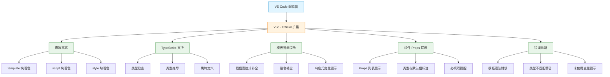
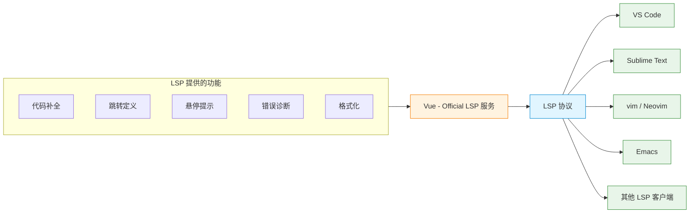
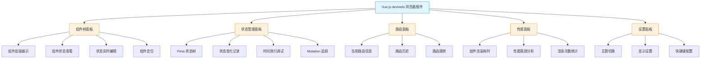

扫描[二维码](https://api2.cmdragon.cn/upload/cmder/20250304_012821924.jpg)关注或者微信搜一搜：`编程智域 前端至全栈交流与成长`

[发现1000+提升效率与开发的AI工具和实用程序](https://tools.cmdragon.cn/zh/apps?category=ai_chat)：https://tools.cmdragon.cn/zh/apps?category=ai_chat

## 一、VS Code + Vue Official——官方推荐的黄金组合

写Vue 3代码，第一件事儿就是得挑个顺手的编辑器。官方文档里明明白白推荐的是 **VS Code** 配合 **Vue - Official** 扩展（这玩意儿之前叫 Volar，后来改名了）。这俩搭一块儿，那叫一个天作之合，写起 Vue 来丝滑得很。

为啥推荐这套组合？咱掰开揉碎了说。VS Code 本身是个挺轻量的编辑器，免费、跨平台、插件生态丰富，但它装完之后默认是不认识 `.vue` 文件的——你打开一个单文件组件，看到的可能就是一堆没颜色的代码，跟看记事本似的。这时候就得靠 Vue - Official 扩展来"教"它认识 Vue 语法。

这个扩展能给咱提供啥呢？主要有这么几样：

- **语法高亮**：`<template>`、`<script setup>`、`<style>` 三块各自有自己的颜色，看着舒服，不容易看花眼
- **TypeScript 支持**：在 `<script setup lang="ts">` 里写 TS 代码，类型检查、类型提示全都有，跟写原生 `.ts` 文件一个体验
- **模板内表达式智能提示**：在 `{{ }}` 里写变量名，它能自动补全；写 `v-if`、`v-for` 的时候还能提示你哪些变量可用
- **组件 props 智能提示**：用别的组件的时候，敲 `<MyComponent` 然后按空格，它会把该组件定义的所有 props 列出来，连类型和默认值都给你标得清清楚楚

打个比方哈，VS Code 就像一套刚交付的"毛坯房"，能住是能住，但啥都没有，灰扑扑的；Vue - Official 扩展就是那套"精装修"方案，装上之后立马好住——地板铺好了、灯具装上了、家具也摆齐了，住进去才舒服嘛。

### 安装方法

安装特别简单，几步就搞定：

1. 先去 [VS Code 官网](https://code.visualstudio.com/) 下载安装 VS Code，这步不用多说了
2. 打开 VS Code，左侧栏点那个四方块图标（扩展面板），或者直接按 `Ctrl+Shift+X`（Mac 是 `Cmd+Shift+X`）
3. 搜索框里输入 `Vue - Official`
4. 找到作者是 `Vue` 的那个（注意别装错了），点 Install 安装
5. 装完重新加载一下窗口，搞定

装完之后随便打开个 `.vue` 文件，立马就能感受到区别——代码有颜色了，鼠标悬停在变量上能看类型了，写代码的时候智能提示也冒出来了。

下面这张流程图把 VS Code + Vue Official 的功能体系梳理了一下，你瞅一眼就明白这套组合到底能干啥：



### 实际体验一把

咱来看个具体的例子，感受下 Vue Official 扩展带来的便利。假设咱有个简单的计数器组件：

```vue
<!-- Counter.vue 一个简单的计数器组件 -->
<template>
  <!-- 点击按钮触发 increment 方法，count 用插值表达式显示 -->
  <div class="counter">
    <p>当前计数：{{ count }}</p>
    <button @click="increment">点我加一</button>
  </div>
</template>

<script setup lang="ts">
// 引入 ref 创建响应式数据
import { ref } from 'vue'

// 定义一个响应式的数字类型变量，初始值是 0
// 这时候鼠标悬停在 count 上，Vue Official 会提示它是 Ref<number> 类型
const count = ref<number>(0)

// 定义加一的方法
// 当你在 template 里敲 @click="in 的时候，它会自动补全成 increment
const increment = (): void => {
  count.value++
}
</script>

<style scoped>
/* scoped 表示样式只作用于当前组件 */
.counter {
  padding: 20px;
  border: 1px solid #eee;
  border-radius: 8px;
}
</style>
```

然后在另一个组件里用它：

```vue
<!-- App.vue 根组件使用 Counter -->
<template>
  <div>
    <!-- 当你敲 <Counter 然后按空格，Vue Official 会提示这个组件接受哪些 props -->
    <!-- 虽然 Counter 没定义 props，但如果有，它会列出来 -->
    <Counter />
  </div>
</template>

<script setup lang="ts">
// 局部注册 Counter 组件
import Counter from './Counter.vue'
</script>
```

你看，写代码的时候各种提示都跟上来了，效率蹭蹭往上涨，再也不用翻来覆去查文档看组件到底接受啥参数了。

## 二、Vetur和Volar（Vue Official）的区别——别装错了

这一节特别重要，好多新手都在这儿栽过跟头。Vue - Official 这个扩展，之前叫 Volar，再往前还有个叫 Vetur 的老扩展。这俩名字长得像，功能也像，但**完全不是一回事儿**，装错了能让你抓狂半天。

### 它俩到底是啥关系

简单捋一下时间线：

- **Vetur**：这是 Vue 2 时代的官方 VS Code 扩展，专门为 Vue 2 设计的。Vue 2 那会儿没有 `<script setup>`，TypeScript 支持也比较弱，Vetur 把这些都照顾得挺好
- **Volar**：Vue 3 出来之后，官方重写了一个新的扩展，叫 Volar。它是专门为 Vue 3 设计的，完美支持 `<script setup>`、TypeScript、组合式 API 这些新特性
- **Vue - Official**：后来 Volar 改名成了 Vue - Official，名字更直白了，就是"Vue 官方扩展"的意思。功能还是那套功能，就是换了个马甲

所以现在的状况是：**Vue - Official 取代了 Vetur**，成为 Vue 3 项目的官方推荐扩展。

### 为啥 Vue 3 项目里不能用 Vetur

好多人电脑上之前装过 Vetur（学 Vue 2 那会儿装的），后来转 Vue 3 了也没卸载，结果就出问题了。Vetur 在 Vue 3 项目里会咋样呢？

- **不认识 `<script setup>`**：你用 `<script setup>` 写代码，它可能给你报一堆莫名其妙的错，或者干脆不提示
- **TypeScript 支持差**：Vue 3 的 TS 支持是重写的，Vetur 还按 Vue 2 那套来，类型推导经常出错
- **模板提示不准**：模板里用的变量，它可能提示不出来，或者提示的是过时的 API
- **跟 Vue Official 打架**：两个扩展同时开着，会互相冲突，编辑器卡得要死，提示也乱七八糟

打个比方哈，Vetur 就像个"老款手机壳"，你拿它去套新款手机（Vue 3），尺寸对不上、按键位置也不对，硬套上去不仅难看，还影响使用。得换个新壳（Vue Official）才行。

### 正确做法

如果你电脑上装了 Vetur，在 Vue 3 项目里得这么处理：

1. **首选方案**：直接卸载 Vetur，装上 Vue - Official。一劳永逸
2. **折中方案**：如果还要维护老的 Vue 2 项目，可以在 VS Code 里对 Vetur 进行**禁用**（Disable），而不是卸载。可以全局禁用，也可以只在工作区禁用

工作区禁用的方法：在扩展面板找到 Vetur，点那个齿轮图标，选"Disable (Workspace)"，这样只在这个项目里禁用它，别的项目还能用。

### Vetur vs Vue Official 对比表

下面这张表把俩扩展的区别列得明明白白，你对照着看：

| 对比项 | Vetur | Vue - Official（原 Volar） |
|--------|-------|---------------------------|
| 适用版本 | Vue 2 | Vue 3（也兼容 Vue 2） |
| `<script setup>` 支持 | ❌ 不支持或支持差 | ✅ 完美支持 |
| TypeScript 支持 | 基础支持，类型推导弱 | 完整支持，类型推导准确 |
| 模板智能提示 | 基础提示 | 精准提示，支持组合式 API |
| 组合式 API | 不识别 | 完整支持 |
| 性能 | 一般 | 更好（多进程架构） |
| 维护状态 | 已停止维护 | 官方持续维护 |
| 推荐场景 | 仅 Vue 2 老项目 | Vue 3 新项目首选 |

记住一句话：**写 Vue 3，认准 Vue - Official**，别再装 Vetur 了。

## 三、WebStorm——不用装插件也行

说完 VS Code，再聊聊另一个主流选择——**WebStorm**。这是 JetBrains 家的 IDE，跟 IntelliJ IDEA、PyCharm 是一家的，号称"前端开发神器"。

### WebStorm 对 Vue 的支持

WebStorm 跟 VS Code 不一样的地方在于，它对 Vue 的单文件组件（`.vue`）提供的是**内置支持**，开箱即用，不用装任何插件。你装完 WebStorm，新建个 `.vue` 文件，立马就能写代码，语法高亮、智能提示、代码补全、跳转定义这些全都有。

具体能干啥呢：

- **语法高亮**：template、script、style 三块都有颜色区分
- **智能补全**：组件名、props、方法、变量都能自动补全
- **代码导航**：`Ctrl+点击`（Mac 是 `Cmd+点击`）能跳转到定义处，组件、变量、方法都行
- **重构支持**：改名、提取组件、提取方法这些操作都支持
- **调试支持**：内置调试器，能直接在 IDE 里打断点调试 Vue 应用
- **Vue 专属功能**：支持 `<script setup>`、组合式 API、Pinia 集成等

### VS Code vs WebStorm 怎么选

这俩到底选哪个？咱从几个维度对比一下：

| 对比项 | VS Code | WebStorm |
|--------|---------|----------|
| 价格 | 免费 | 收费（有试用，学生可免费） |
| Vue 支持 | 需装 Vue - Official 扩展 | 内置，开箱即用 |
| 启动速度 | 快 | 相对慢一些 |
| 内存占用 | 较低 | 较高 |
| 插件生态 | 极其丰富 | 丰富但相对封闭 |
| 配置难度 | 需要折腾 | 默认配置就很好 |
| 适合人群 | 喜欢轻量、爱折腾 | JetBrains 老用户、不差钱 |

简单说哈：

- **选 VS Code**：预算有限、电脑配置一般、喜欢轻量编辑器、愿意花点时间配置
- **选 WebStorm**：公司给买、本来就是 JetBrains 全家桶用户、不想折腾配置、电脑配置不错

我个人觉得，对于初学者来说，VS Code + Vue Official 这套组合更友好一些——免费、轻量、教程多、社区大。等你写熟了，想换个更"重"的工具试试，再考虑 WebStorm 也不迟。

还有个事儿得提一嘴，如果你用的是 JetBrains 系的其他 IDE（比如 IntelliJ IDEA、PyCharm、GoLand），它们也内置了 Vue 支持，不用额外装插件。所以如果你本来就用 IDEA 写后端，顺便写点 Vue 前端，完全不用换工具。

## 四、其他IDE——通过LSP也能用

除了 VS Code 和 WebStorm，还有些同学喜欢用别的编辑器，比如 Sublime Text、vim、Emacs 这些。那这些编辑器能写 Vue 吗？答案是：**能，通过 LSP**。

### 啥是 LSP

LSP 全称是 **Language Server Protocol**（语言服务协议），是微软搞的一套标准。简单说就是，它把"语言服务"（代码补全、跳转、诊断这些功能）从编辑器里抽离出来，做成独立的服务进程，编辑器通过协议跟这个服务通信。

打个比方哈，LSP 就像个"通用翻译器"。以前每种编辑器要支持一种语言，得自己从头写一套支持逻辑，工作量巨大。有了 LSP 之后，只要语言方提供一个 LSP 服务，所有支持 LSP 的编辑器都能用这套服务，相当于"一次编写，处处可用"。

Vue 官方就提供了 Volar 的 LSP 服务，所以理论上任何支持 LSP 的编辑器都能享受 Volar 的核心功能。

### 各编辑器咋配置

下面列几个常见编辑器的配置方式：

**Sublime Text**：

通过 [LSP-Volar](https://github.com/sublimelsp/LSP-volar) 包支持。用 Package Control 安装 LSP 和 LSP-Volar 这俩包，配置一下就能用。

**vim / Neovim**：

通过 [coc-volar](https://github.com/yaegassy/coc-volar) 插件支持。需要先装 [coc.nvim](https://github.com/neoclide/coc.nvim)，然后用 `:CocInstall coc-volar` 安装。配置稍微麻烦点，但 vim 党一般也习惯了。

**Emacs**：

通过 [lsp-mode](https://github.com/emacs-lsp/lsp-mode) 支持。配置 lsp-mode 启用 vue-ls，就能用 Volar 的 LSP 服务了。

下面这张图展示了 LSP 的工作机制，你瞅一眼就明白为啥不同编辑器都能用 Volar 了：



不过说实话哈，对于初学者来说，不太建议一上来就用 vim 或者 Emacs 写 Vue——配置成本太高，容易把精力耗在折腾编辑器上，反而耽误学 Vue 本身。等 Vue 写熟了，再慢慢迁移到这些"硬核"编辑器也不迟。VS Code + Vue Official 这套组合，对新手最友好。

## 五、浏览器开发者插件——调试Vue的神器

前面说的都是编辑器层面的工具，这一节聊聊调试层面的。写 Vue 应用，光有编辑器还不够，你还得有个能"看透"应用内部状态的工具——这就是 **Vue 浏览器开发者插件**（Vue.js devtools）。

### 这插件能干啥

Vue.js devtools 是个浏览器扩展，装上之后能让你在浏览器开发者工具里直接查看和调试 Vue 应用。主要功能有这么几块：

- **浏览组件树**：以树状结构展示整个 Vue 应用的组件层级，点哪个组件就能看哪个组件的详情
- **查看组件状态**：每个组件的 data、props、computed、setup 返回的变量都能看到，还能实时编辑
- **追踪状态管理事件**：如果你用了 Pinia 或 Vuex，能查看状态变化的记录，支持时间旅行调试
- **组件性能分析**：能记录组件渲染耗时，找出性能瓶颈
- **路由调试**：集成 Vue Router 调试，查看当前路由、路由历史
- **自定义插件**：第三方库可以集成自己的调试面板

打个比方哈，这个插件就像个"X光机"，平时 Vue 应用的内部结构是看不见摸不着的，有了它，应用内部的组件树、状态、事件全都"透视"给你看，调试起来那叫一个爽。

### 安装方法

Vue.js devtools 支持主流浏览器，安装方式如下：

- **Chrome**：去 [Chrome 网上应用店](https://chrome.google.com/webstore/detail/vuejs-devtools/nhdogjmejiglipccpnnnanhbledajbpd) 搜索 "Vue.js devtools" 安装
- **Firefox**：去 [Firefox 附加组件页](https://addons.mozilla.org/firefox/addon/vue-js-devtools/) 安装
- **Edge**：去 [Edge 扩展商店](https://microsoftedge.microsoft.com/addons/detail/vuejs-devtools/olifadmmhclfeafebdlnejcechbpcgah) 安装
- **独立 Electron 应用**：如果你用的是不支持扩展的浏览器，或者想调试移动端 WebView，可以下载独立的 [Electron 应用](https://github.com/vuejs/devtools-next)

装完之后，浏览器右上角会出现个 Vue 的图标。打开任意一个用了 Vue 的网页，图标会变亮（如果是灰色说明这页面没用 Vue）。然后按 `F12` 打开开发者工具，能看到最后面多了个 "Vue" 面板，点进去就是 devtools 的界面了。

下面这张流程图把 Vue.js devtools 的功能模块梳理了一下：



### 实际用起来啥感觉

咱来看个实际场景。假设你有个用 Pinia 管理状态的购物车应用，用户反馈"加购之后数量没变化"，你咋排查？

没 devtools 的话，你可能得在代码里到处加 `console.log`，重启应用，一步步试。有 devtools 的话：

1. 打开浏览器，按 `F12`，切到 Vue 面板
2. 左侧组件树找到购物车组件，点开看它的状态——`cartItems` 数组里有没有刚加的商品
3. 切到 Pinia 面板，看 store 的状态——`items` 数组变化了没
4. 看 Mutations/Actions 记录——`addToCart` 这个 action 被调用了没，参数对不对
5. 如果状态变了但页面没更新，可能是响应式丢了；如果状态没变，那是 action 逻辑有问题

整个过程不用改一行代码，全在 devtools 里搞定，效率高得很。

### 一个完整的调试示例

咱写个简单的示例，演示下 devtools 怎么帮咱调试。这是一个带 Pinia 的计数器应用：

```vue
<!-- App.vue 根组件 -->
<template>
  <div>
    <!-- 显示计数器值 -->
    <h1>计数：{{ counterStore.count }}</h1>
    <!-- 双倍计数计算属性 -->
    <p>双倍：{{ counterStore.doubleCount }}</p>
    <!-- 操作按钮 -->
    <button @click="counterStore.increment">加一</button>
    <button @click="counterStore.reset">重置</button>
  </div>
</template>

<script setup lang="ts">
// 引入 useCounterStore
import { useCounterStore } from './stores/counter'

// 获取 store 实例
// 在 devtools 的 Pinia 面板里能看到这个 store 的所有状态
const counterStore = useCounterStore()
</script>
```

```ts
// stores/counter.ts Pinia store 定义
import { defineStore } from 'pinia'
import { ref, computed } from 'vue'

// 定义一个名为 counter 的 store
export const useCounterStore = defineStore('counter', () => {
  // state：响应式的计数变量
  const count = ref<number>(0)
  
  // getters：计算属性，返回双倍值
  const doubleCount = computed(() => count.value * 2)
  
  // action：加一方法
  const increment = (): void => {
    count.value++
  }
  
  // action：重置方法
  const reset = (): void => {
    count.value = 0
  }
  
  // 返回需要暴露的状态和方法
  return { count, doubleCount, increment, reset }
})
```

写完之后，打开 devtools 你能看到：

- **Components 面板**：左侧有 `<App>` 组件，点开能看到它的 setup 状态里有 `counterStore`
- **Pinia 面板**：能看到名为 `counter` 的 store，里面有 `count`（当前值）、`doubleCount`（双倍值）两个状态
- **点"加一"按钮**：能在 Pinia 面板看到 `count` 从 0 变成 1，`doubleCount` 从 0 变成 2，还能看到一条 state 变化记录
- **时间旅行**：点几次加一，然后点 Pinia 面板里的历史记录，能让状态"回到过去"，看看每一步的状态是啥样

这种调试体验，没 devtools 之前根本不敢想。

## 课后 Quiz

### 问题 1：在 Vue 3 项目中，VS Code 应该安装哪个扩展来获得最佳开发体验？为什么不能继续使用 Vetur？

**答案解析**：

在 Vue 3 项目中，VS Code 应该安装 **Vue - Official** 扩展（原 Volar）。

不能继续使用 Vetur 的原因主要有三点：

1. **Vetur 是为 Vue 2 设计的**，对 Vue 3 引入的 `<script setup>` 语法支持不好，会报各种莫名其妙的错误
2. **TypeScript 支持有缺陷**：Vue 3 重写了 TS 支持，Vetur 还按 Vue 2 的逻辑来，类型推导经常出错
3. **会与 Vue Official 冲突**：如果两个扩展同时启用，会导致编辑器卡顿、提示混乱

正确做法是卸载或禁用 Vetur，安装 Vue - Official。如果还要维护 Vue 2 老项目，可以在工作区级别禁用 Vetur，只在使用 Vue 3 的项目中启用 Vue - Official。

### 问题 2：Vue.js devtools 浏览器插件能帮助开发者完成哪些调试任务？请至少列举三项。

**答案解析**：

Vue.js devtools 能帮助开发者完成以下调试任务（任举三项即可）：

1. **浏览组件树**：以树状结构查看整个 Vue 应用的组件层级，点击任意组件查看其详细信息
2. **查看和编辑组件状态**：实时查看每个组件的 data、props、computed、setup 变量，还能直接在面板里编辑这些值进行测试
3. **追踪状态管理事件**：如果使用了 Pinia 或 Vuex，可以查看 state 的变化历史，支持时间旅行调试，回放每一步状态变化
4. **组件性能分析**：记录组件渲染耗时，帮助找出性能瓶颈，优化渲染效率
5. **路由调试**：集成 Vue Router，查看当前路由信息、路由历史，还能直接在面板里进行路由跳转

这些功能让开发者无需在代码中添加大量 `console.log`，就能高效定位问题。

### 问题 3：如果你使用的是 vim 编辑器，如何获得 Vue 3 的智能提示支持？

**答案解析**：

在 vim 中获得 Vue 3 智能提示支持，需要通过 LSP（语言服务协议）来实现。具体步骤如下：

1. **安装 coc.nvim**：这是一个基于 Node.js 的 vim 补全框架，是 LSP 客户端。可以通过 vim 的插件管理器（如 vim-plug）安装
2. **安装 coc-volar 插件**：在 vim 中执行 `:CocInstall coc-volar`，这个插件会自动下载并配置 Volar 的 LSP 服务
3. **配置 coc-settings.json**：根据需要调整配置，比如是否启用 TypeScript 支持、是否启用 Vetur 兼容模式等

原理上，Vue 官方提供了 Volar 的 LSP 服务，coc-volar 只是把这个服务接入了 vim。通过 LSP，vim 能获得代码补全、跳转定义、悬停提示、错误诊断等核心功能，体验接近 VS Code。

不过对于初学者，建议先用 VS Code + Vue Official 熟悉 Vue 本身，再考虑迁移到 vim 这类需要较多配置的编辑器。

## 常见报错解决方案

### 报错 1：VS Code 中打开 `.vue` 文件没有语法高亮和智能提示

**产生原因**：

这种情况通常是以下几种原因导致的：

1. **未安装 Vue - Official 扩展**：VS Code 默认不认识 `.vue` 文件
2. **扩展未启用**：装了但被禁用了
3. **Vetur 和 Vue Official 同时启用**：两个扩展冲突，导致功能异常
4. **VS Code 版本过旧**：Vue Official 需要较新版本的 VS Code

**解决方案**：

1. 打开扩展面板（`Ctrl+Shift+X`），搜索 "Vue - Official"，确认已安装且处于启用状态
2. 如果同时装了 Vetur，将其禁用或卸载。在扩展面板找到 Vetur，点齿轮图标选"Disable"或"Uninstall"
3. 更新 VS Code 到最新版本：Help → Check for Updates
4. 重新加载窗口：`Ctrl+Shift+P` 输入 "Reload Window" 回车

**预防建议**：

- 新装 VS Code 后，第一时间安装 Vue - Official 扩展
- 不要同时安装 Vetur 和 Vue Official，避免冲突
- 定期更新 VS Code 和扩展，保持最新版本

### 报错 2：Vue.js devtools 装上了但图标是灰色的，无法使用

**产生原因**：

devtools 图标灰色表示当前页面没有检测到 Vue 应用，可能原因有：

1. **页面确实没用 Vue**：打开的是普通网页
2. **Vue 处于生产模式**：生产构建的 Vue 默认不暴露 devtools 钩子
3. **页面是 file:// 协议**：devtools 默认不在本地文件协议下工作
4. **扩展权限不足**：扩展没有访问当前网站的权限

**解决方案**：

1. 确认页面确实使用了 Vue 框架
2. 如果是本地开发，确保用的是开发模式的 Vue（`vue-dev` 而非 `vue-prod`）。Vite 开发服务器默认就是开发模式
3. 如果必须在生产环境调试，可以在应用启动前设置 `app.config.performance = true` 并确保 `__VUE_PROD_DEVTOOLS__` 编译标志开启
4. 右键扩展图标 → "管理扩展" → 确认"允许访问文件网址"已开启
5. 尝试刷新页面，devtools 有时候需要页面完全加载后才能检测到 Vue

**预防建议**：

- 开发阶段始终使用 Vite 的开发服务器，确保是开发模式
- 如果需要在生产环境调试，构建时通过 `define: { __VUE_PROD_DEVTOOLS__: true }` 开启 devtools 支持
- 调试完记得关闭，生产环境开启 devtools 会影响性能

### 报错 3：`<script setup>` 中使用 TypeScript 时报 "Cannot find module './xxx.vue' or its corresponding type declarations"

**产生原因**：

这个报错说明 TypeScript 不认识 `.vue` 文件的类型。常见原因：

1. **缺少 `vue/shim` 类型声明文件**：TypeScript 不知道 `.vue` 文件该被当作啥类型
2. **tsconfig.json 配置不对**：没有正确包含 Vue 的类型声明
3. **Vue - Official 扩展未正确安装**：扩展负责提供类型信息
4. **导入路径写错**：路径大小写不对或者文件名拼错

**解决方案**：

1. 在项目根目录创建或检查 `env.d.ts` 文件，确保包含以下内容：

```ts
/// <reference types="vite/client" />

// 声明 .vue 文件的类型，让 TypeScript 认识它
declare module '*.vue' {
  import type { DefineComponent } from 'vue'
  const component: DefineComponent<{}, {}, any>
  export default component
}
```

2. 检查 `tsconfig.json`，确保 `include` 字段包含了 `env.d.ts`：

```json
{
  "include": ["src/**/*.ts", "src/**/*.vue", "env.d.ts"]
}
```

3. 确认 Vue - Official 扩展已正确安装并启用
4. 检查导入路径，Windows 下虽然不区分大小写，但建议保持路径大小写一致
5. 重启 Vue 服务器：`Ctrl+Shift+P` → "Volar: Restart Vue Server"

**预防建议**：

- 使用 Vite 创建项目时，模板会自动生成 `env.d.ts`，不要手动删除
- 团队协作时，确保 `env.d.ts` 文件被提交到版本控制
- 如果自定义了 `tsconfig.json`，仔细检查 `include` 和 `types` 配置

## 参考链接

- https://vuejs.org/guide/scaling-up/tooling.html

余下文章内容请点击跳转至 个人博客页面 或者 扫描[二维码](https://api2.cmdragon.cn/upload/cmder/20250304_012821924.jpg)关注或者微信搜一搜：`编程智域 前端至全栈交流与成长`，阅读完整的文章：[写Vue用啥编辑器最顺手？VS Code和浏览器开发者插件配置指南](https://blog.cmdragon.cn/posts/s5t6u7v8w9x0y1z2a3b4c5d6e7f8a9b0c1/)

<details>
<summary>往期文章归档</summary>

- [Vue 3 静态与动态 Props 如何传递？TypeScript 类型约束有何必要？](https://blog.cmdragon.cn/posts/94ab48753b64780ca3ab7a7115ae8522/)
- [Vue 3中组件局部注册的优势与实现方式如何？](https://blog.cmdragon.cn/posts/dbf576e744870f6de26fd8a2e03e47da/)
- [如何在Vue3中优化生命周期钩子性能并规避常见陷阱？](https://blog.cmdragon.cn/posts/12d98b3b9ccd6c19a1b169d720ac5c80/)
- [Vue 3 Composition API生命周期钩子：如何实现从基础理解到高阶复用？](https://blog.cmdragon.cn/posts/8884e2b70287fcb263c57648eeb27419/)
- [Vue 3生命周期钩子实战指南：如何正确选择onMounted、onUpdated与onUnmounted的应用场景？](https://blog.cmdragon.cn/posts/883c6dbc50ae4183770a4462e0b8ae4d/)
- [Vue 3中生命周期钩子与响应式系统如何实现协同工作？](https://blog.cmdragon.cn/posts/70dad360ffa9dce14d0d69611b8cb019/)
- [Vue 3组件生命周期钩子的执行顺序与使用场景是什么？](https://blog.cmdragon.cn/posts/db44294a78dc9f666f67b053f6c83567/)
- [Vue组件全局注册与局部注册如何抉择？](https://blog.cmdragon.cn/posts/43ead630ea17da65d99ad2eb8188e472/)
- [Vue3组件化开发中，Props与Emits如何实现数据流转与事件协作？](https://blog.cmdragon.cn/posts/8cff7d2df113da66ea7be560c4d1d22a/)
- [Vue 3模板引用如何与其他特性协同实现复杂交互？](https://blog.cmdragon.cn/posts/331bf75d114ab09116eadfcdca602b58/)
- [Vue 3 v-for中模板引用如何实现高效管理与动态控制？](https://blog.cmdragon.cn/posts/cb380897ddc3578b180ecf8843c774c1/)
- [Vue 3的defineExpose：如何突破script setup组件默认封装，实现精准的父子通讯？](https://blog.cmdragon.cn/posts/202ae0f4acde7128e0e31baf63732fb5/)
- [Vue 3模板引用的生命周期时机如何把握？常见陷阱该如何避免？](https://blog.cmdragon.cn/posts/7d2a0f6555ecbe92afd7d2491c427463/)
- [Vue 3模板引用如何实现父组件与子组件的高效交互？](https://blog.cmdragon.cn/posts/3fb7bdd84128b7efaaa1c979e1f28dee/)
- [Vue中为何需要模板引用？又如何高效实现DOM与组件实例的直接访问？](https://blog.cmdragon.cn/posts/23f3464ba16c7054b4783cded50c04c6/)

</details>

<details>
<summary>免费好用的热门在线工具</summary>

- [多直播聚合器 - 应用商店 | By cmdragon](https://tools.cmdragon.cn/zh/apps/multi-live-aggregator)
- [Proto文件生成器 - 应用商店 | By cmdragon](https://tools.cmdragon.cn/zh/apps/proto-file-generator)
- [图片转粒子 - 应用商店 | By cmdragon](https://tools.cmdragon.cn/zh/apps/image-to-particles)
- [视频下载器 - 应用商店 | By cmdragon](https://tools.cmdragon.cn/zh/apps/video-downloader)
- [文件格式转换器 - 应用商店 | By cmdragon](https://tools.cmdragon.cn/zh/apps/file-converter)
- [M3U8在线播放器 - 应用商店 | By cmdragon](https://tools.cmdragon.cn/zh/apps/m3u8-player)
- [快图设计 - 应用商店 | By cmdragon](https://tools.cmdragon.cn/zh/apps/quick-image-design)
- [高级文字转图片转换器 - 应用商店 | By cmdragon](https://tools.cmdragon.cn/zh/apps/text-to-image-advanced)
- [RAID 计算器 - 应用商店 | By cmdragon](https://tools.cmdragon.cn/zh/apps/raid-calculator)
- [在线PS - 应用商店 | By cmdragon](https://tools.cmdragon.cn/zh/apps/photoshop-online)
- [Mermaid 在线编辑器 - 应用商店 | By cmdragon](https://tools.cmdragon.cn/zh/apps/mermaid-live-editor)
- [数学求解计算器 - 应用商店 | By cmdragon](https://tools.cmdragon.cn/zh/apps/math-solver-calculator)
- [智能提词器 - 应用商店 | By cmdragon](https://tools.cmdragon.cn/zh/apps/smart-teleprompter)
- [魔法简历 - 应用商店 | By cmdragon](https://tools.cmdragon.cn/zh/apps/magic-resume)
- [Image Puzzle Tool - 图片拼图工具 | By cmdragon](https://tools.cmdragon.cn/zh/apps/image-puzzle-tool)
- [字幕下载工具 - 应用商店 | By cmdragon](https://tools.cmdragon.cn/zh/apps/subtitle-downloader)
- [歌词生成工具 - 应用商店 | By cmdragon](https://tools.cmdragon.cn/zh/apps/lyrics-generator)
- [网盘资源聚合搜索 - 应用商店 | By cmdragon](https://tools.cmdragon.cn/zh/apps/cloud-drive-search)
- [ASCII字符画生成器 - 应用商店 | By cmdragon](https://tools.cmdragon.cn/zh/apps/ascii-art-generator)
- [JSON Web Tokens 工具 - 应用商店 | By cmdragon](https://tools.cmdragon.cn/zh/apps/jwt-tool)
- [Bcrypt 密码工具 - 应用商店 | By cmdragon](https://tools.cmdragon.cn/zh/apps/bcrypt-tool)
- [GIF 合成器 - 应用商店 | By cmdragon](https://tools.cmdragon.cn/zh/apps/gif-composer)
- [GIF 分解器 - 应用商店 | By cmdragon](https://tools.cmdragon.cn/zh/apps/gif-decomposer)
- [文本隐写术 - 应用商店 | By cmdragon](https://tools.cmdragon.cn/zh/apps/text-steganography)
- [CMDragon 在线工具 - 高级AI工具箱与开发者套件 | 免费好用的在线工具](https://tools.cmdragon.cn/zh)
- [应用商店 - 发现1000+提升效率与开发的AI工具和实用程序 | 免费好用的在线工具](https://tools.cmdragon.cn/zh/apps?category=trending)
- [CMDragon 更新日志 - 最新更新、功能与改进 | 免费好用的在线工具](https://tools.cmdragon.cn/zh/changelog)
- [支持我们 - 成为赞助者 | 免费好用的在线工具](https://tools.cmdragon.cn/zh/sponsor)
- [AI文本生成图像 - 应用商店 | 免费好用的在线工具](https://tools.cmdragon.cn/zh/apps/text-to-image-ai)
- [临时邮箱 - 应用商店 | 免费好用的在线工具](https://tools.cmdragon.cn/zh/apps/temp-email)
- [二维码解析器 - 应用商店 | 免费好用的在线工具](https://tools.cmdragon.cn/zh/apps/qrcode-parser)
- [文本转思维导图 - 应用商店 | 免费好用的在线工具](https://tools.cmdragon.cn/zh/apps/text-to-mindmap)
- [正则表达式可视化工具 - 应用商店 | 免费好用的在线工具](https://tools.cmdragon.cn/zh/apps/regex-visualizer)
- [文件隐写工具 - 应用商店 | 免费好用的在线工具](https://tools.cmdragon.cn/zh/apps/steganography-tool)
- [IPTV 频道探索器 - 应用商店 | 免费好用的在线工具](https://tools.cmdragon.cn/zh/apps/iptv-explorer)
- [快传 - 应用商店 | By cmdragon](https://tools.cmdragon.cn/zh/apps/snapdrop)
- [随机抽奖工具 - 应用商店 | 免费好用的在线工具](https://tools.cmdragon.cn/zh/apps/lucky-draw)
- [动漫场景查找器 - 应用商店 | 免费好用的在线工具](https://tools.cmdragon.cn/zh/apps/anime-scene-finder)
- [时间工具箱 - 应用商店 | 免费好用的在线工具](https://tools.cmdragon.cn/zh/apps/time-toolkit)
- [网速测试 - 应用商店 | 免费好用的在线工具](https://tools.cmdragon.cn/zh/apps/speed-test)
- [AI 智能抠图工具 - 应用商店 | 免费好用的在线工具](https://tools.cmdragon.cn/zh/apps/background-remover)
- [背景替换工具 - 应用商店 | 免费好用的在线工具](https://tools.cmdragon.cn/zh/apps/background-replacer)
- [艺术二维码生成器 - 应用商店 | 免费好用的在线工具](https://tools.cmdragon.cn/zh/apps/artistic-qrcode)
- [Open Graph 元标签生成器 - 应用商店 | 免费好用的在线工具](https://tools.cmdragon.cn/zh/apps/open-graph-generator)
- [图像对比工具 - 应用商店 | 免费好用的在线工具](https://tools.cmdragon.cn/zh/apps/image-comparison)
- [图片压缩专业版 - 应用商店 | 免费好用的在线工具](https://tools.cmdragon.cn/zh/apps/image-compressor)
- [密码生成器 - 应用商店 | 免费好用的在线工具](https://tools.cmdragon.cn/zh/apps/password-generator)
- [SVG优化器 - 应用商店 | 免费好用的在线工具](https://tools.cmdragon.cn/zh/apps/svg-optimizer)
- [调色板生成器 - 应用商店 | 免费好用的在线工具](https://tools.cmdragon.cn/zh/apps/color-palette)
- [在线节拍器 - 应用商店 | 免费好用的在线工具](https://tools.cmdragon.cn/zh/apps/online-metronome)
- [IP归属地查询 - 应用商店 | By cmdragon](https://tools.cmdragon.cn/zh/apps/ip-geolocation)
- [CSS网格布局生成器 - 应用商店 | 免费好用的在线工具](https://tools.cmdragon.cn/zh/apps/css-grid-layout)
- [邮箱验证工具 - 应用商店 | 免费好用的在线工具](https://tools.cmdragon.cn/zh/apps/email-validator)
- [书法练习字帖 - 应用商店 | 免费好用的在线工具](https://tools.cmdragon.cn/zh/apps/calligraphy-practice)
- [金融计算器套件 - 应用商店 | 免费好用的在线工具](https://tools.cmdragon.cn/zh/apps/finance-calculator-suite)
- [中国亲戚关系计算器 - 应用商店 | 免费好用的在线工具](https://tools.cmdragon.cn/zh/apps/chinese-kinship-calculator)
- [Protocol Buffer 工具箱 - 应用商店 | 免费好用的在线工具](https://tools.cmdragon.cn/zh/apps/protobuf-toolkit)
- [IP归属地查询 - 应用商店 | 免费好用的在线工具](https://tools.cmdragon.cn/zh/apps/ip-geolocation)
- [图片无损放大 - 应用商店 | 免费好用的在线工具](https://tools.cmdragon.cn/zh/apps/image-upscaler)
- [文本比较工具 - 应用商店 | 免费好用的在线工具](https://tools.cmdragon.cn/zh/apps/text-compare)
- [IP批量查询工具 - 应用商店 | 免费好用的在线工具](https://tools.cmdragon.cn/zh/apps/ip-batch-lookup)
- [域名查询工具 - 应用商店 | 免费好用的在线工具](https://tools.cmdragon.cn/zh/apps/domain-finder)
- [DNS工具箱 - 应用商店 | 免费好用的在线工具](https://tools.cmdragon.cn/zh/apps/dns-toolkit)
- [网站图标生成器 - 应用商店 | 免费好用的在线工具](https://tools.cmdragon.cn/zh/apps/favicon-generator)
- [XML Sitemap](https://tools.cmdragon.cn/sitemap_index.xml)

</details>
