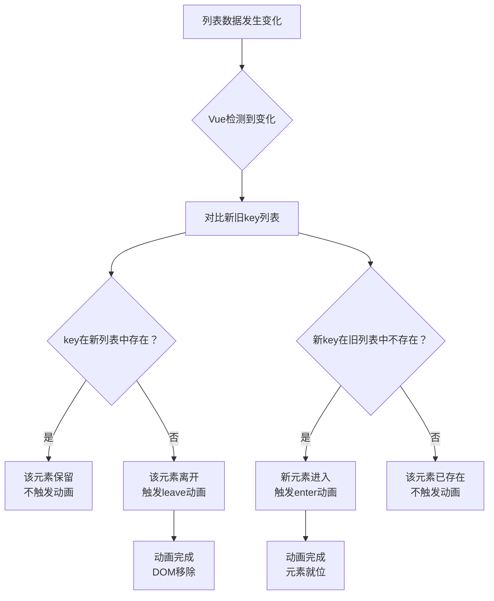
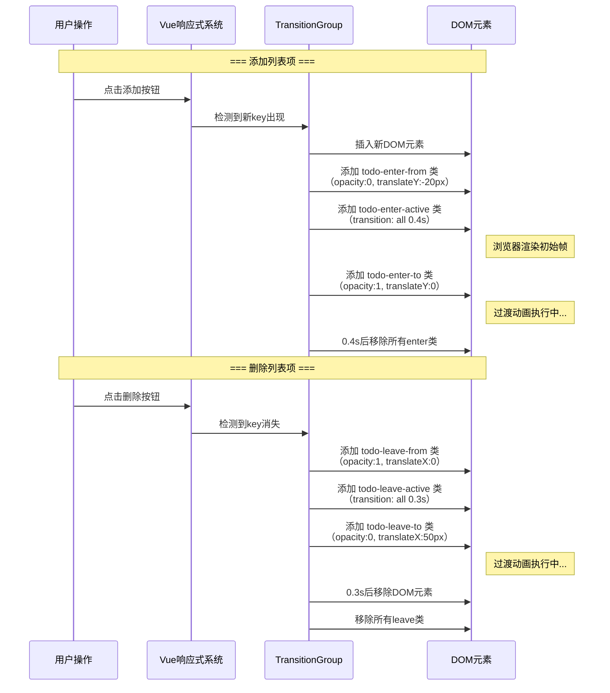

扫描[二维码](https://api2.cmdragon.cn/upload/cmder/20250304_012821924.jpg)关注或者微信搜一搜：`编程智域 前端至全栈交流与成长`

[发现1000+提升效率与开发的AI工具和实用程序](https://tools.cmdragon.cn/zh/apps?category=ai_chat)：https://tools.cmdragon.cn/zh/apps?category=ai_chat

## 一、TransitionGroup是啥？跟Transition有啥不一样？

你肯定用过Vue的`<Transition>`组件吧？给一个元素加个淡入淡出、滑进滑出，那叫一个丝滑。但问题来了——当你有一整个列表，比如待办事项、购物车商品、聊天消息，这些列表项会动态地添加、删除、重新排序，这时候`<Transition>`就有点力不从心了。

为啥？因为`<Transition>`是给**单个元素**或者**两个互斥元素之间的切换**做动画的。它一次只能管一个"人"。而列表里动辄十几个、几十个元素，每个都可能随时进来或者离开，你总不能给每个列表项都套一个`<Transition>`吧？那也太累了。

所以Vue给我们准备了`<TransitionGroup>`——一个专门给`v-for`列表添加动画的内置组件。

打个比方：`<Transition>`就像一个"单人间"，一次只住一个人，进来一个就得出去一个；`<TransitionGroup>`就像一栋"宿舍楼"，里面有很多房间，每个房间住一个人，有人搬进来、有人搬走、还有人换房间，它都能管。

### 它俩的4个核心区别

| 对比项           | Transition                            | TransitionGroup                         |
| ---------------- | ------------------------------------- | --------------------------------------- |
| 容器渲染         | 默认渲染一个容器元素（可用`tag`改变） | 默认**不渲染**容器元素（可用`tag`指定） |
| 过渡模式（mode） | 支持`out-in`和`in-out`                | **不支持**，因为列表不是互斥切换        |
| key要求          | 切换时需要key来区分不同元素           | **每个列表项必须有独一无二的key**       |
| CSS类名应用      | 应用在容器元素的子元素上              | 应用在**列表内的每个元素**上            |

这几个区别看着简单，但每一个都是踩坑高发区，咱们挨个来聊。

先说容器渲染的问题。`<Transition>`默认会渲染一个包裹元素，你写啥它就渲染啥，比如你把`<Transition>`包在一个`<div>`外面，那最终DOM里就有这个`<div>`。但`<TransitionGroup>`不一样，它默认**不渲染任何容器元素**。这意味着如果你不指定`tag`属性，它就像一个隐形的壳子，列表项直接暴露在外层，没有额外的包裹标签。

再说过渡模式。`<Transition>`支持`mode="out-in"`和`mode="in-out"`，这是因为它是两个元素之间的切换——一个出去另一个进来，得有个先后顺序。但`<TransitionGroup>`管的是一整个列表，列表里的元素不是互斥关系，可能同时有好几个在进入、好几个在离开，所以`mode`在这里根本没意义。

然后是key。`<Transition>`里key主要是用来区分切换的不同元素，而`<TransitionGroup>`里的key是**强制要求**的，没有key它就没法追踪哪个元素进了、哪个元素出了，动画直接乱套。

最后是CSS类名的应用位置。`<Transition>`的CSS过渡类名是加在它包裹的那个元素上的，而`<TransitionGroup>`的CSS过渡类名是加在**每个列表项**上的——因为每个列表项都是独立动画的嘛。

## 二、tag属性——给列表加个容器

上面说了，`<TransitionGroup>`默认不渲染任何容器元素。啥意思呢？看个例子就明白了：

```html
<!-- 不加tag -->
<TransitionGroup name="list">
  <div v-for="item in items" :key="item.id">{{ item.text }}</div>
</TransitionGroup>
```

渲染出来的DOM长这样：

```html
<div>项目1</div>
<div>项目2</div>
<div>项目3</div>
```

看到没？外层啥都没有，这些`<div>`直接就是平铺的。这在很多场景下其实没啥问题，但有时候你就需要一个容器来包裹它们——比如你想给列表加个背景色、加个边框、或者语义上需要一个`<ul>`标签。

这时候`tag`属性就派上用场了：

```html
<!-- tag="ul"，渲染成ul标签 -->
<TransitionGroup name="list" tag="ul">
  <li v-for="item in items" :key="item.id">{{ item.text }}</li>
</TransitionGroup>
```

渲染出来的DOM：

```html
<ul>
  <li>项目1</li>
  <li>项目2</li>
  <li>项目3</li>
</ul>
```

再比如用`tag="div"`：

```html
<!-- tag="div"，渲染成div标签 -->
<TransitionGroup name="list" tag="div">
  <div v-for="item in items" :key="item.id">{{ item.text }}</div>
</TransitionGroup>
```

渲染出来就是：

```html
<div>
  <div>项目1</div>
  <div>项目2</div>
  <div>项目3</div>
</div>
```

### 啥时候需要加tag？

主要有两种情况：

1. **需要语义化HTML**：比如你渲染的是一组列表项，外层应该有个`<ul>`或者`<ol>`，不加`tag`的话DOM结构就不规范，对SEO和可访问性都不友好。

2. **需要给容器加样式**：比如你想给列表整体加个背景色、边框、内边距啥的，没有容器元素你就没法用CSS选中它。

来看个完整的例子，一个带样式的待办列表：

```vue
<template>
  <!-- tag="ul"让TransitionGroup渲染成ul标签 -->
  <TransitionGroup name="todo" tag="ul" class="todo-list">
    <li v-for="todo in todos" :key="todo.id" class="todo-item">
      {{ todo.text }}
      <button @click="removeTodo(todo.id)">删除</button>
    </li>
  </TransitionGroup>
</template>

<script setup>
import { ref } from "vue";

// 待办事项列表，每个项都有唯一的id
const todos = ref([
  { id: 1, text: "学习Vue 3基础" },
  { id: 2, text: "搞定TransitionGroup" },
  { id: 3, text: "写一个酷炫的列表动画" },
]);

// 删除待办事项
function removeTodo(id) {
  // 通过id找到对应项的索引
  const index = todos.value.findIndex((todo) => todo.id === id);
  // 从数组中移除
  if (index > -1) {
    todos.value.splice(index, 1);
  }
}
</script>

<style scoped>
/* 给ul容器加样式 */
.todo-list {
  list-style: none;
  padding: 20px;
  background-color: #f5f5f5;
  border-radius: 8px;
  max-width: 400px;
}

.todo-item {
  padding: 10px;
  margin-bottom: 8px;
  background-color: white;
  border-radius: 4px;
  display: flex;
  justify-content: space-between;
  align-items: center;
}
</style>
```

注意看，`tag="ul"`让`<TransitionGroup>`渲染成了一个`<ul>`标签，这样我们就能给`.todo-list`加样式了。如果没加`tag`，这个`.todo-list`的class就没地方挂，样式自然也不生效。

## 三、key属性——不加就完蛋

`<TransitionGroup>`里每个列表项必须有独一无二的`key`，这不是建议，是**硬性要求**。没有key，Vue就分不清哪个元素是哪个，动画效果直接乱成一锅粥。

### 没有key会咋样？

看个反面教材：

```html
<!-- 错误示范：没有key -->
<TransitionGroup name="list" tag="ul">
  <li v-for="item in items">{{ item.text }}</li>
</TransitionGroup>
```

这种写法Vue连编译都过不去，直接给你报错。因为`v-for`在`<TransitionGroup>`里必须加key。

### 用index当key行不行？

很多人图省事，直接用`index`当key：

```html
<!-- 错误示范：用index当key -->
<TransitionGroup name="list" tag="ul">
  <li v-for="(item, index) in items" :key="index">{{ item.text }}</li>
</TransitionGroup>
```

这也不行！为啥？因为`index`是会变的。假设你有三个列表项，key分别是0、1、2：

- 删除key为0的项后，原来的key=1变成了key=0，原来的key=2变成了key=1
- Vue一看，key=0还在（其实是原来的key=1），key=1还在（其实是原来的key=2），key=2没了
- 于是Vue以为key=2离开了，给key=2加了离开动画
- 但实际上离开的是原来的第一项，动画加在了错误的对象上

这就像你给宿舍楼里的每个房间编了号，但编号是按入住顺序排的。有人搬走了，后面的人房间号全变了，宿管大爷完全搞不清谁是谁了。

### 正确的key用法

key必须用**稳定且唯一**的标识，比如数据库里的id：

```html
<!-- 正确示范：用唯一id当key -->
<TransitionGroup name="list" tag="ul">
  <li v-for="item in items" :key="item.id">{{ item.text }}</li>
</TransitionGroup>
```

这样每个列表项的key永远不变，不管数组怎么增删改，Vue都能准确追踪每个元素。

来看个对比示例，感受一下key对动画的影响：

```vue
<template>
  <div>
    <h3>正确的key（用id）</h3>
    <TransitionGroup name="list" tag="ul" class="list-container">
      <!-- 每个项用唯一的id作为key -->
      <li v-for="item in items" :key="item.id" class="list-item">
        <span>{{ item.id }} - {{ item.text }}</span>
        <button @click="removeItem(item.id)">删除</button>
      </li>
    </TransitionGroup>

    <button @click="addItem">添加项</button>
  </div>
</template>

<script setup>
import { ref } from "vue";

// 用一个计数器来生成唯一id
let nextId = 4;

// 初始数据，每项都有唯一id
const items = ref([
  { id: 1, text: "苹果" },
  { id: 2, text: "香蕉" },
  { id: 3, text: "橙子" },
]);

// 添加新项
function addItem() {
  items.value.push({
    id: nextId++, // id递增，保证唯一
    text: `水果${nextId - 1}`,
  });
}

// 删除指定id的项
function removeItem(id) {
  const index = items.value.findIndex((item) => item.id === id);
  if (index > -1) {
    items.value.splice(index, 1);
  }
}
</script>

<style scoped>
.list-container {
  list-style: none;
  padding: 0;
  max-width: 300px;
}

.list-item {
  padding: 8px 12px;
  margin-bottom: 4px;
  background: #e8f4f8;
  border-radius: 4px;
  display: flex;
  justify-content: space-between;
}

/* 进入动画：从左侧滑入 */
.list-enter-from {
  opacity: 0;
  transform: translateX(-30px);
}

.list-enter-active {
  transition: all 0.5s ease;
}

.list-enter-to {
  opacity: 1;
  transform: translateX(0);
}

/* 离开动画：向右侧滑出 */
.list-leave-from {
  opacity: 1;
  transform: translateX(0);
}

.list-leave-active {
  transition: all 0.5s ease;
}

.list-leave-to {
  opacity: 0;
  transform: translateX(30px);
}
</style>
```

### key的作用流程

用个流程图来看看key在`<TransitionGroup>`里是怎么工作的：



简单来说，Vue就是靠key来"认人"的。key不变，Vue就知道这个人还在；key消失了，Vue就知道这个人走了，给他安排离开动画；新的key出现了，Vue就知道来了新人，给他安排进入动画。

## 四、列表项的进入和离开动画

搞清楚了`<TransitionGroup>`和`<Transition>`的区别、`tag`属性怎么用、`key`为啥必须加，现在终于到重头戏了——给列表加上动画！

### 基本用法

`<TransitionGroup>`的CSS类名跟`<Transition>`一模一样，都是6个类名：

| 类名               | 时机     | 说明                                   |
| ------------------ | -------- | -------------------------------------- |
| `xxx-enter-from`   | 进入开始 | 元素刚插入DOM时的初始状态              |
| `xxx-enter-active` | 进入过程 | 整个进入过渡期间生效，用来定义过渡属性 |
| `xxx-enter-to`     | 进入结束 | 元素插入后的最终状态                   |
| `xxx-leave-from`   | 离开开始 | 元素即将被移除时的初始状态             |
| `xxx-leave-active` | 离开过程 | 整个离开过渡期间生效，用来定义过渡属性 |
| `xxx-leave-to`     | 离开结束 | 元素被移除后的最终状态                 |

其中`xxx`就是你在`name`属性里指定的名字，比如`name="list"`，那类名就是`list-enter-from`、`list-leave-active`这样。

### 完整代码示例：可添加/删除的待办列表

来写一个完整的、可运行的例子，一个带动画的待办事项列表：

```vue
<template>
  <div class="todo-app">
    <h2>待办事项</h2>

    <!-- 输入区域 -->
    <div class="input-area">
      <input
        v-model="newTodo"
        @keyup.enter="addTodo"
        placeholder="输入新的待办事项..."
        class="todo-input"
      />
      <button @click="addTodo" class="add-btn">添加</button>
    </div>

    <!-- TransitionGroup包裹v-for列表 -->
    <!-- name="todo"指定动画前缀为todo-xxx -->
    <!-- tag="ul"渲染成ul标签 -->
    <TransitionGroup name="todo" tag="ul" class="todo-list">
      <!-- 每个列表项必须有唯一的key -->
      <li v-for="todo in todos" :key="todo.id" class="todo-item">
        <span class="todo-text">{{ todo.text }}</span>
        <button @click="removeTodo(todo.id)" class="remove-btn">✕</button>
      </li>
    </TransitionGroup>

    <!-- 空状态提示 -->
    <p v-if="todos.length === 0" class="empty-tip">暂无待办事项，添加一个吧~</p>
  </div>
</template>

<script setup>
import { ref } from "vue";

// 新待办事项的输入值
const newTodo = ref("");

// 用计数器生成唯一id
let nextId = 1;

// 待办事项列表
const todos = ref([
  { id: nextId++, text: "学习TransitionGroup基础" },
  { id: nextId++, text: "写一个列表动画demo" },
  { id: nextId++, text: "把动画用到项目里" },
]);

// 添加新待办事项
function addTodo() {
  // 获取输入值并去掉首尾空格
  const text = newTodo.value.trim();
  // 空值不添加
  if (!text) return;

  // 往数组末尾添加新项
  todos.value.push({
    id: nextId++, // 唯一id
    text: text, // 待办内容
  });

  // 清空输入框
  newTodo.value = "";
}

// 删除待办事项
function removeTodo(id) {
  // 根据id找到对应项的索引
  const index = todos.value.findIndex((todo) => todo.id === id);
  // 找到了就删除
  if (index > -1) {
    todos.value.splice(index, 1);
  }
}
</script>

<style scoped>
.todo-app {
  max-width: 450px;
  margin: 0 auto;
  padding: 20px;
}

/* 输入区域样式 */
.input-area {
  display: flex;
  gap: 8px;
  margin-bottom: 16px;
}

.todo-input {
  flex: 1;
  padding: 8px 12px;
  border: 2px solid #ddd;
  border-radius: 6px;
  font-size: 14px;
  outline: none;
  transition: border-color 0.3s;
}

.todo-input:focus {
  border-color: #42b883;
}

.add-btn {
  padding: 8px 16px;
  background-color: #42b883;
  color: white;
  border: none;
  border-radius: 6px;
  cursor: pointer;
  font-size: 14px;
  transition: background-color 0.3s;
}

.add-btn:hover {
  background-color: #35a06e;
}

/* 列表容器样式 */
.todo-list {
  list-style: none;
  padding: 0;
  margin: 0;
}

/* 列表项样式 */
.todo-item {
  display: flex;
  justify-content: space-between;
  align-items: center;
  padding: 12px 16px;
  margin-bottom: 8px;
  background-color: #f8f9fa;
  border-radius: 6px;
  border-left: 4px solid #42b883;
}

.todo-text {
  font-size: 15px;
  color: #333;
}

.remove-btn {
  background: none;
  border: none;
  color: #dc3545;
  font-size: 16px;
  cursor: pointer;
  padding: 2px 6px;
  border-radius: 4px;
  transition: background-color 0.2s;
}

.remove-btn:hover {
  background-color: #fce4e4;
}

/* ====== 进入动画 ====== */

/* 进入的初始状态：透明+从下方滑入 */
.todo-enter-from {
  opacity: 0;
  transform: translateY(-20px);
}

/* 进入过程中：定义过渡属性 */
.todo-enter-active {
  transition: all 0.4s ease-out;
}

/* 进入的最终状态：正常显示 */
.todo-enter-to {
  opacity: 1;
  transform: translateY(0);
}

/* ====== 离开动画 ====== */

/* 离开的初始状态：正常显示 */
.todo-leave-from {
  opacity: 1;
  transform: translateX(0);
}

/* 离开过程中：定义过渡属性 */
.todo-leave-active {
  transition: all 0.3s ease-in;
}

/* 离开的最终状态：透明+向右滑出 */
.todo-leave-to {
  opacity: 0;
  transform: translateX(50px);
}

/* 空状态提示 */
.empty-tip {
  text-align: center;
  color: #999;
  font-size: 14px;
  margin-top: 20px;
}
</style>
```

这段代码跑起来之后，你会看到：

- 添加待办事项时，新项从上方滑入并淡入
- 删除待办事项时，被删的项向右滑出并淡出
- 其他列表项会平滑地移动到新位置

### 进入/离开动画的时序

用流程图来看看动画的完整时序：



这里有个细节值得注意：离开动画期间，被删除的元素仍然占据DOM空间，直到动画结束才会被移除。这意味着其他列表项不会立刻"补位"，而是等离开动画结束后才移动。如果你想让其他项在离开动画进行中就开始移动，需要配合`move`过渡类名来实现，这个咱们后面再聊。

### 运行环境说明

上面的代码需要以下环境：

- **Node.js**：16.x 或更高版本
- **Vue**：3.3.x 或更高版本
- **构建工具**：Vite 5.x（推荐）

用Vite快速搭建项目：

```bash
# 创建Vue 3项目
npm create vite@latest my-transition-demo -- --template vue

# 进入项目目录
cd my-transition-demo

# 安装依赖
npm install

# 启动开发服务器
npm run dev
```

然后把上面的代码复制到`App.vue`里就能看到效果了。

## 课后 Quiz

### 问题1：TransitionGroup为什么不支持过渡模式（mode）？

**答案解析**：

过渡模式（`mode`）是给`<Transition>`用的，它解决的是两个互斥元素切换时的冲突问题——比如`out-in`是让旧元素先出去，新元素再进来。

但`<TransitionGroup>`管的是一整个列表，列表里的元素不是互斥关系。你可能同时有3个元素在进入、2个元素在离开，它们之间不存在"谁先谁后"的问题，每个元素都是独立执行自己的动画。所以`mode`在`<TransitionGroup>`里根本没意义，强行加上的话Vue也会忽略它。

### 问题2：为什么TransitionGroup里的key不能用数组索引（index）？

**答案解析**：

因为index会随着数组的增删而变化。举个例子，假设有三个元素，index分别是0、1、2：

1. 删除index=0的元素后，原来的index=1变成了0，原来的index=2变成了1
2. Vue通过key来追踪元素，它看到key=0还在（其实是原来的第二项），key=1还在（其实是原来的第三项），key=2消失了
3. 于是Vue给key=2（原来的第三项）加了离开动画，但实际上离开的是第一项

这就像你用排队号来认人，但有人插队或离开后号码全变了，你根本认不出谁是谁。正确的做法是用稳定不变的唯一标识（如id）作为key，这样不管数组怎么变，每个元素的key永远不变，Vue就能准确追踪。

### 问题3：TransitionGroup默认不渲染容器元素，那什么时候需要用tag属性？

**答案解析**：

需要加`tag`的情况主要有两种：

1. **需要语义化HTML结构**：比如列表项是`<li>`，外层应该有`<ul>`包裹，不加`tag`的话DOM结构就不完整，影响可访问性和SEO。

2. **需要给容器加样式**：比如你想给整个列表加背景色、边框、内边距，没有容器元素就没法用CSS选中它。

如果你只是简单地给列表项加动画，不需要容器样式，也不在意语义化，那不加`tag`也完全没问题。

## 常见报错解决方案

### 报错1：`<TransitionGroup> children must have keys`

**产生原因**：

`<TransitionGroup>`里的每个列表项都必须有独一无二的`key`属性。如果你忘了加`:key`，或者`v-for`没有写key，Vue就会报这个错。

**解决方案**：

给`v-for`的每一项加上唯一的`:key`：

```html
<!-- 错误：没有key -->
<TransitionGroup name="list" tag="ul">
  <li v-for="item in items">{{ item.text }}</li>
</TransitionGroup>

<!-- 正确：用唯一id作为key -->
<TransitionGroup name="list" tag="ul">
  <li v-for="item in items" :key="item.id">{{ item.text }}</li>
</TransitionGroup>
```

**预防建议**：养成习惯，写`v-for`的时候顺手就把`:key`加上，不管是不是在`<TransitionGroup>`里面。

### 报错2：动画效果错乱，删除的不是目标项

**产生原因**：

大概率是用了`index`作为key。index会随着数组的增删而变化，导致Vue追踪元素时出现混乱，动画加在了错误的元素上。

**解决方案**：

改用稳定不变的唯一标识作为key：

```html
<!-- 错误：用index当key -->
<TransitionGroup name="list" tag="ul">
  <li v-for="(item, index) in items" :key="index">{{ item.text }}</li>
</TransitionGroup>

<!-- 正确：用唯一id当key -->
<TransitionGroup name="list" tag="ul">
  <li v-for="item in items" :key="item.id">{{ item.text }}</li>
</TransitionGroup>
```

**预防建议**：永远不要用`index`当key，尤其是在列表会增删的场景下。如果后端数据没有id，就在前端用计数器生成一个。

### 报错3：加了tag属性但样式不生效

**产生原因**：

`<TransitionGroup>`的`tag`属性只是指定了容器元素的标签名，但如果你把class写在`<TransitionGroup>`上，这个class是加在容器元素上的。有时候你可能误以为class加在了列表项上，导致CSS选择器写错了。

**解决方案**：

确认你的CSS选择器对应的是正确的元素层级：

```html
<!-- class="todo-list"会加在tag渲染出的ul上 -->
<TransitionGroup name="todo" tag="ul" class="todo-list">
  <li v-for="todo in todos" :key="todo.id" class="todo-item">
    {{ todo.text }}
  </li>
</TransitionGroup>
```

```css
/* 正确：选中ul容器 */
.todo-list {
  padding: 20px;
  background: #f5f5f5;
}

/* 正确：选中li列表项 */
.todo-item {
  padding: 10px;
  margin-bottom: 8px;
}

/* 错误：以为.todo-list是列表项的class */
/* .todo-list { padding: 10px; } 这样写样式会加到ul上而不是li上 */
```

**预防建议**：写样式前先用浏览器开发者工具检查一下DOM结构，确认class到底加在了哪个元素上。

参考链接：https://vuejs.org/guide/built-ins/transition-group.html

余下文章内容请点击跳转至 个人博客页面 或者 扫描[二维码](https://api2.cmdragon.cn/upload/cmder/20250304_012821924.jpg)关注或者微信搜一搜：`编程智域 前端至全栈交流与成长`，阅读完整的文章：[列表动画用TransitionGroup还是Transition？它俩到底啥区别](https://blog.cmdragon.cn/posts/g3h4i5j6k7l8m9n0o1p2q3r4s5t6u7v8/)

<details>
<summary>往期文章归档</summary>

- [Vue 3 静态与动态 Props 如何传递？TypeScript 类型约束有何必要？](https://blog.cmdragon.cn/posts/94ab48753b64780ca3ab7a7115ae8522/)
- [Vue 3中组件局部注册的优势与实现方式如何？](https://blog.cmdragon.cn/posts/dbf576e744870f6de26fd8a2e03e47da/)
- [如何在Vue3中优化生命周期钩子性能并规避常见陷阱？](https://blog.cmdragon.cn/posts/12d98b3b9ccd6c19a1b169d720ac5c80/)
- [Vue 3 Composition API生命周期钩子：如何实现从基础理解到高阶复用？](https://blog.cmdragon.cn/posts/8884e2b70287fcb263c57648eeb27419/)
- [Vue 3生命周期钩子实战指南：如何正确选择onMounted、onUpdated与onUnmounted的应用场景？](https://blog.cmdragon.cn/posts/883c6dbc50ae4183770a4462e0b8ae4d/)
- [Vue 3中生命周期钩子与响应式系统如何实现协同工作？](https://blog.cmdragon.cn/posts/70dad360ffa9dce14d0d69611b8cb019/)
- [Vue 3组件生命周期钩子的执行顺序与使用场景是什么？](https://blog.cmdragon.cn/posts/db44294a78dc9f666f67b053f6c83567/)
- [Vue组件全局注册与局部注册如何抉择？](https://blog.cmdragon.cn/posts/43ead630ea17da65d99ad2eb8188e472/)
- [Vue3组件化开发中，Props与Emits如何实现数据流转与事件协作？](https://blog.cmdragon.cn/posts/8cff7d2df113da66ea7be560c4d1d22a/)
- [Vue 3模板引用如何与其他特性协同实现复杂交互？](https://blog.cmdragon.cn/posts/331bf75d114ab09116eadfcdca602b58/)
- [Vue 3 v-for中模板引用如何实现高效管理与动态控制？](https://blog.cmdragon.cn/posts/cb380897ddc3578b180ecf8843c774c1/)
- [Vue 3的defineExpose：如何突破script setup组件默认封装，实现精准的父子通讯？](https://blog.cmdragon.cn/posts/202ae0f4acde7128e0e31baf63732fb5/)
- [Vue 3模板引用的生命周期时机如何把握？常见陷阱该如何避免？](https://blog.cmdragon.cn/posts/7d2a0f6555ecbe92afd7d2491c427463/)
- [Vue 3模板引用如何实现父组件与子组件的高效交互？](https://blog.cmdragon.cn/posts/3fb7bdd84128b7efaaa1c979e1f28dee/)
- [Vue中为何需要模板引用？又如何高效实现DOM与组件实例的直接访问？](https://blog.cmdragon.cn/posts/23f3464ba16c7054b4783cded50c04c6/)

</details>

<details>
<summary>免费好用的热门在线工具</summary>

- [多直播聚合器 - 应用商店 | By cmdragon](https://tools.cmdragon.cn/zh/apps/multi-live-aggregator)
- [Proto文件生成器 - 应用商店 | By cmdragon](https://tools.cmdragon.cn/zh/apps/proto-file-generator)
- [图片转粒子 - 应用商店 | By cmdragon](https://tools.cmdragon.cn/zh/apps/image-to-particles)
- [视频下载器 - 应用商店 | By cmdragon](https://tools.cmdragon.cn/zh/apps/video-downloader)
- [文件格式转换器 - 应用商店 | By cmdragon](https://tools.cmdragon.cn/zh/apps/file-converter)
- [M3U8在线播放器 - 应用商店 | By cmdragon](https://tools.cmdragon.cn/zh/apps/m3u8-player)
- [快图设计 - 应用商店 | By cmdragon](https://tools.cmdragon.cn/zh/apps/quick-image-design)
- [高级文字转图片转换器 - 应用商店 | By cmdragon](https://tools.cmdragon.cn/zh/apps/text-to-image-advanced)
- [RAID 计算器 - 应用商店 | By cmdragon](https://tools.cmdragon.cn/zh/apps/raid-calculator)
- [在线PS - 应用商店 | By cmdragon](https://tools.cmdragon.cn/zh/apps/photoshop-online)
- [Mermaid 在线编辑器 - 应用商店 | By cmdragon](https://tools.cmdragon.cn/zh/apps/mermaid-live-editor)
- [数学求解计算器 - 应用商店 | By cmdragon](https://tools.cmdragon.cn/zh/apps/math-solver-calculator)
- [智能提词器 - 应用商店 | By cmdragon](https://tools.cmdragon.cn/zh/apps/smart-teleprompter)
- [魔法简历 - 应用商店 | By cmdragon](https://tools.cmdragon.cn/zh/apps/magic-resume)
- [Image Puzzle Tool - 图片拼图工具 | By cmdragon](https://tools.cmdragon.cn/zh/apps/image-puzzle-tool)
- [字幕下载工具 - 应用商店 | By cmdragon](https://tools.cmdragon.cn/zh/apps/subtitle-downloader)
- [歌词生成工具 - 应用商店 | By cmdragon](https://tools.cmdragon.cn/zh/apps/lyrics-generator)
- [网盘资源聚合搜索 - 应用商店 | By cmdragon](https://tools.cmdragon.cn/zh/apps/cloud-drive-search)
- [ASCII字符画生成器 - 应用商店 | By cmdragon](https://tools.cmdragon.cn/zh/apps/ascii-art-generator)
- [JSON Web Tokens 工具 - 应用商店 | By cmdragon](https://tools.cmdragon.cn/zh/apps/jwt-tool)
- [Bcrypt 密码工具 - 应用商店 | By cmdragon](https://tools.cmdragon.cn/zh/apps/bcrypt-tool)
- [GIF 合成器 - 应用商店 | By cmdragon](https://tools.cmdragon.cn/zh/apps/gif-composer)
- [GIF 分解器 - 应用商店 | By cmdragon](https://tools.cmdragon.cn/zh/apps/gif-decomposer)
- [文本隐写术 - 应用商店 | By cmdragon](https://tools.cmdragon.cn/zh/apps/text-steganography)
- [CMDragon 在线工具 - 高级AI工具箱与开发者套件 | 免费好用的在线工具](https://tools.cmdragon.cn/zh)
- [应用商店 - 发现1000+提升效率与开发的AI工具和实用程序 | 免费好用的在线工具](https://tools.cmdragon.cn/zh/apps?category=trending)
- [CMDragon 更新日志 - 最新更新、功能与改进 | 免费好用的在线工具](https://tools.cmdragon.cn/zh/changelog)
- [支持我们 - 成为赞助者 | 免费好用的在线工具](https://tools.cmdragon.cn/zh/sponsor)
- [AI文本生成图像 - 应用商店 | 免费好用的在线工具](https://tools.cmdragon.cn/zh/apps/text-to-image-ai)
- [临时邮箱 - 应用商店 | 免费好用的在线工具](https://tools.cmdragon.cn/zh/apps/temp-email)
- [二维码解析器 - 应用商店 | 免费好用的在线工具](https://tools.cmdragon.cn/zh/apps/qrcode-parser)
- [文本转思维导图 - 应用商店 | 免费好用的在线工具](https://tools.cmdragon.cn/zh/apps/text-to-mindmap)
- [正则表达式可视化工具 - 应用商店 | 免费好用的在线工具](https://tools.cmdragon.cn/zh/apps/regex-visualizer)
- [文件隐写工具 - 应用商店 | 免费好用的在线工具](https://tools.cmdragon.cn/zh/apps/steganography-tool)
- [IPTV 频道探索器 - 应用商店 | 免费好用的在线工具](https://tools.cmdragon.cn/zh/apps/iptv-explorer)
- [快传 - 应用商店 | By cmdragon](https://tools.cmdragon.cn/zh/apps/snapdrop)
- [随机抽奖工具 - 应用商店 | 免费好用的在线工具](https://tools.cmdragon.cn/zh/apps/lucky-draw)
- [动漫场景查找器 - 应用商店 | 免费好用的在线工具](https://tools.cmdragon.cn/zh/apps/anime-scene-finder)
- [时间工具箱 - 应用商店 | 免费好用的在线工具](https://tools.cmdragon.cn/zh/apps/time-toolkit)
- [网速测试 - 应用商店 | 免费好用的在线工具](https://tools.cmdragon.cn/zh/apps/speed-test)
- [AI 智能抠图工具 - 应用商店 | 免费好用的在线工具](https://tools.cmdragon.cn/zh/apps/background-remover)
- [背景替换工具 - 应用商店 | 免费好用的在线工具](https://tools.cmdragon.cn/zh/apps/background-replacer)
- [艺术二维码生成器 - 应用商店 | 免费好用的在线工具](https://tools.cmdragon.cn/zh/apps/artistic-qrcode)
- [Open Graph 元标签生成器 - 应用商店 | 免费好用的在线工具](https://tools.cmdragon.cn/zh/apps/open-graph-generator)
- [图像对比工具 - 应用商店 | 免费好用的在线工具](https://tools.cmdragon.cn/zh/apps/image-comparison)
- [图片压缩专业版 - 应用商店 | 免费好用的在线工具](https://tools.cmdragon.cn/zh/apps/image-compressor)
- [密码生成器 - 应用商店 | 免费好用的在线工具](https://tools.cmdragon.cn/zh/apps/password-generator)
- [SVG优化器 - 应用商店 | 免费好用的在线工具](https://tools.cmdragon.cn/zh/apps/svg-optimizer)
- [调色板生成器 - 应用商店 | 免费好用的在线工具](https://tools.cmdragon.cn/zh/apps/color-palette)
- [在线节拍器 - 应用商店 | 免费好用的在线工具](https://tools.cmdragon.cn/zh/apps/online-metronome)
- [IP归属地查询 - 应用商店 | By cmdragon](https://tools.cmdragon.cn/zh/apps/ip-geolocation)
- [CSS网格布局生成器 - 应用商店 | 免费好用的在线工具](https://tools.cmdragon.cn/zh/apps/css-grid-layout)
- [邮箱验证工具 - 应用商店 | 免费好用的在线工具](https://tools.cmdragon.cn/zh/apps/email-validator)
- [书法练习字帖 - 应用商店 | 免费好用的在线工具](https://tools.cmdragon.cn/zh/apps/calligraphy-practice)
- [金融计算器套件 - 应用商店 | 免费好用的在线工具](https://tools.cmdragon.cn/zh/apps/finance-calculator-suite)
- [中国亲戚关系计算器 - 应用商店 | 免费好用的在线工具](https://tools.cmdragon.cn/zh/apps/chinese-kinship-calculator)
- [Protocol Buffer 工具箱 - 应用商店 | 免费好用的在线工具](https://tools.cmdragon.cn/zh/apps/protobuf-toolkit)
- [IP归属地查询 - 应用商店 | 免费好用的在线工具](https://tools.cmdragon.cn/zh/apps/ip-geolocation)
- [图片无损放大 - 应用商店 | 免费好用的在线工具](https://tools.cmdragon.cn/zh/apps/image-upscaler)
- [文本比较工具 - 应用商店 | 免费好用的在线工具](https://tools.cmdragon.cn/zh/apps/text-compare)
- [IP批量查询工具 - 应用商店 | 免费好用的在线工具](https://tools.cmdragon.cn/zh/apps/ip-batch-lookup)
- [域名查询工具 - 应用商店 | 免费好用的在线工具](https://tools.cmdragon.cn/zh/apps/domain-finder)
- [DNS工具箱 - 应用商店 | 免费好用的在线工具](https://tools.cmdragon.cn/zh/apps/dns-toolkit)
- [网站图标生成器 - 应用商店 | 免费好用的在线工具](https://tools.cmdragon.cn/zh/apps/favicon-generator)
- [XML Sitemap](https://tools.cmdragon.cn/sitemap_index.xml)

</details>
