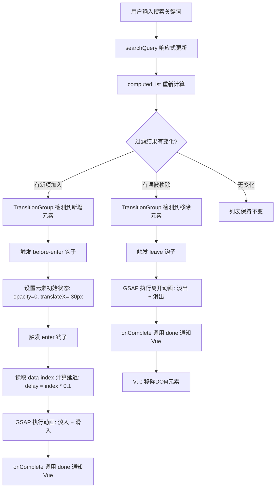

扫描[二维码](https://api2.cmdragon.cn/upload/cmder/20250304_012821924.jpg)关注或者微信搜一搜：`编程智域 前端至全栈交流与成长`

[发现1000+提升效率与开发的AI工具和实用程序](https://tools.cmdragon.cn/zh/apps?category=ai_chat)：https://tools.cmdragon.cn/zh/apps?category=ai_chat

## 一、啥是渐进延迟动画？

你有没有注意过，有些网站的通知列表、聊天消息或者搜索结果，它们不是"唰"一下全部同时冒出来的，而是一个接一个、像排队一样依次入场？第一个先出来，隔一小会儿第二个出来，再隔一小会儿第三个出来……这种效果就是**渐进延迟动画**（Staggered Animation）。

打个比方，就像多米诺骨牌——你推倒第一块，第一块倒下碰到第二块，第二块再碰到第三块，每块之间有那么一点点时间差，看起来就特别有节奏感。而如果所有骨牌同时倒下，那画面就少了那种"一浪接一浪"的韵味。

在 Vue 3 里，`TransitionGroup` 组件天生就适合做列表的过渡动画。但默认情况下，所有列表项是同时开始动画的。要想实现"一个接一个"的效果，就得借助 **JavaScript 钩子** 和 **data 属性** 来手动控制每个列表项的延迟时间。

先感受一下两种效果的差异：

- **同时入场**：所有列表项在同一时刻开始淡入，视觉上就像一块板子突然出现
- **渐进延迟入场**：第1项0秒开始，第2项0.15秒开始，第3项0.3秒开始……形成"瀑布"般的视觉效果

日常开发中，这种动画特别适合这些场景：

- 通知中心的消息列表
- 聊天应用的新消息
- 搜索结果的展示
- 卡片列表的加载
- 导航菜单的展开

说白了，只要是列表数据有"新增"或"移除"的操作，加上渐进延迟动画都能让用户体验上一个档次。

## 二、data-index——给每个列表项标个号

要实现渐进延迟，核心问题就是：**每个列表项的动画延迟时间怎么算？**

答案很简单——给每个列表项绑一个序号，然后根据序号算延迟。比如第0个项延迟0秒，第1个延迟0.15秒，第2个延迟0.3秒……以此类推。

在 Vue 里，我们可以用 `:data-index` 这个自定义 data 属性来实现：

```html
<TransitionGroup name="list" tag="ul">
  <li v-for="(item, index) in items" :key="item.id" :data-index="index">
    {{ item.text }}
  </li>
</TransitionGroup>
```

关键就在 `:data-index="index"` 这一行。它做了啥呢？

1. `v-for="(item, index) in items"` 遍历列表，`index` 就是当前项的索引（0、1、2、3……）
2. `:data-index="index"` 把这个索引绑定到 DOM 元素的 `data-index` 属性上
3. 在 JavaScript 钩子里，通过 `el.dataset.index` 就能读到这个值

渲染出来的 DOM 长这样：

```html
<ul>
  <li data-index="0">第一条</li>
  <li data-index="1">第二条</li>
  <li data-index="2">第三条</li>
</ul>
```

然后在 JS 钩子里，我们就能根据这个索引来计算延迟：

```js
// 读取当前元素的索引
const index = Number(el.dataset.index);
// 根据索引计算延迟时间，每项间隔0.15秒
const delay = index * 0.15;
```

这样，第0项延迟0秒，第1项延迟0.15秒，第2项延迟0.3秒……渐进延迟的效果就出来了。

> 小提示：`el.dataset.index` 读出来的是字符串类型，记得用 `Number()` 转成数字，不然 `0.15 * "2"` 这种运算虽然 JS 会自动转换，但显式转换更稳妥，也避免一些边界情况。

## 三、:css="false"配合JS钩子

`TransitionGroup` 和 `Transition` 一样，都支持 JavaScript 钩子。当你想用 JS 来完全控制动画（而不是用 CSS 类名），就需要加上 `:css="false"` 这个属性。

### 3.1 为啥要加 :css="false"

默认情况下，Vue 会去检测 CSS 类名（比如 `v-enter-from`、`v-enter-active` 这些），即使你同时用了 JS 钩子，Vue 也会等 CSS 过渡结束才调用 `after-enter`。这就会导致 JS 动画和 CSS 类名"打架"——你明明用 GSAP 控制了动画，Vue 还在那傻等 CSS transition 结束。

加上 `:css="false"` 就等于告诉 Vue："别去找 CSS 类名了，动画完全由我的 JS 钩子来管。"这样 Vue 就会跳过 CSS 检测，完全依赖你 JS 钩子里的 `done()` 回调来判断动画结束。

### 3.2 三个核心钩子

在列表过渡中，最常用的三个钩子是：

- **@before-enter**：元素进入之前调用，用来设置初始状态（比如 opacity: 0）
- **@enter**：元素进入时调用，在这里写动画逻辑，动画结束后必须调用 `done()`
- **@leave**：元素离开时调用，在这里写离开动画，动画结束后也必须调用 `done()`

### 3.3 基本代码框架

```html
<TransitionGroup
  name="stagger"
  tag="ul"
  :css="false"
  @before-enter="onBeforeEnter"
  @enter="onEnter"
  @leave="onLeave"
>
  <li v-for="(item, index) in items" :key="item.id" :data-index="index">
    {{ item.text }}
  </li>
</TransitionGroup>
```

```js
import { ref } from "vue";

const items = ref([
  { id: 1, text: "学习 Vue 3" },
  { id: 2, text: "写 TransitionGroup" },
  { id: 3, text: "搞定渐进延迟" },
]);

// 进入前：设置初始状态
function onBeforeEnter(el) {
  // 先让元素不可见
  el.style.opacity = 0;
  // 稍微往下偏移一点，后面动画会从下方滑入
  el.style.transform = "translateY(20px)";
}

// 进入时：执行动画
function onEnter(el, done) {
  // 读取索引，计算延迟
  const index = Number(el.dataset.index);
  const delay = index * 0.15;

  // 用 GSAP 执行动画
  gsap.to(el, {
    opacity: 1, // 淡入
    y: 0, // 滑到原位
    duration: 0.4, // 动画持续0.4秒
    delay: delay, // 根据索引延迟
    onComplete: done, // 动画结束后通知Vue
  });
}

// 离开时：执行离开动画
function onLeave(el, done) {
  gsap.to(el, {
    opacity: 0, // 淡出
    y: -20, // 往上滑出
    duration: 0.3, // 动画持续0.3秒
    onComplete: done, // 动画结束后通知Vue
  });
}
```

这里有个关键点：**`done` 回调必须调用**。Vue 靠这个回调知道动画啥时候结束，不调用的话元素就会卡在那，后续的清理工作也不会执行。

## 四、GSAP实现交错动画

上一节已经提到了 GSAP，这节咱把它讲透。GSAP（GreenSock Animation Platform）是前端动画领域的"老大哥"，性能好、API 简洁，跟 Vue 的 JS 钩子配合起来简直天衣无缝。

### 4.1 安装 GSAP

```bash
npm install gsap
```

截至2026年5月，GSAP最新版本为 **3.12.5**。

### 4.2 gsap.to()配合delay参数

GSAP 最常用的方法就是 `gsap.to()`，意思是"把元素从当前状态动画到目标状态"：

```js
gsap.to(element, {
  opacity: 1, // 目标透明度
  y: 0, // 目标Y位置
  duration: 0.4, // 动画时长（秒）
  delay: 0.3, // 延迟多久开始（秒）
  ease: "power2.out", // 缓动函数
  onComplete: done, // 动画结束回调
});
```

在渐进延迟场景里，`delay` 的值就是根据 `data-index` 算出来的：

```js
const delay = Number(el.dataset.index) * 0.15;
```

这意味着：

- 第0项：delay = 0，立即开始
- 第1项：delay = 0.15s
- 第2项：delay = 0.3s
- 第3项：delay = 0.45s
- ……

### 4.3 onComplete: done——告诉Vue动画结束了

当 `:css="false"` 时，Vue 不知道动画啥时候结束，它全靠你手动调用 `done()` 来通知。GSAP 的 `onComplete` 回调正好在动画播放完毕时触发，所以把 `done` 传给它就完事了：

```js
function onEnter(el, done) {
  gsap.to(el, {
    opacity: 1,
    y: 0,
    duration: 0.4,
    delay: Number(el.dataset.index) * 0.15,
    onComplete: done, // 动画播完，通知Vue
  });
}
```

### 4.4 before-enter设置初始状态

`onBeforeEnter` 钩子在元素插入 DOM 之后、动画开始之前调用。这时候元素已经在页面上了，但用户还没看到——因为我们在 `onEnter` 之前就把它的初始状态设成了"不可见"。

```js
function onBeforeEnter(el) {
  el.style.opacity = 0; // 完全透明
  el.style.transform = "translateY(30px)"; // 往下偏移30px
}
```

这样动画开始时，元素会从"透明+偏移"的状态过渡到"可见+原位"，看起来就是从下方滑入并淡入。

### 4.5 leave钩子实现离开动画

离开动画和进入动画是镜像关系——进入是从下往上滑入淡入，离开就是从上往下滑出淡出：

```js
function onLeave(el, done) {
  gsap.to(el, {
    opacity: 0,
    y: -30, // 往上偏移
    duration: 0.3,
    onComplete: done,
  });
}
```

### 4.6 完整代码示例

下面是一个完整的渐进延迟列表动画组件：

```vue
<template>
  <div class="stagger-demo">
    <button @click="addItem">添加项目</button>
    <button @click="removeItem">移除最后一项</button>

    <TransitionGroup
      name="staggered"
      tag="ul"
      :css="false"
      @before-enter="onBeforeEnter"
      @enter="onEnter"
      @leave="onLeave"
    >
      <li
        v-for="(item, index) in items"
        :key="item.id"
        :data-index="index"
        class="list-item"
      >
        {{ item.text }}
      </li>
    </TransitionGroup>
  </div>
</template>

<script setup>
import { ref } from "vue";
import gsap from "gsap";

// 列表数据，每项有唯一id和文本
let nextId = 4;
const items = ref([
  { id: 1, text: "第一条数据" },
  { id: 2, text: "第二条数据" },
  { id: 3, text: "第三条数据" },
]);

// 添加新项目
function addItem() {
  items.value.push({
    id: nextId++,
    text: `第${nextId - 1}条数据`,
  });
}

// 移除最后一项
function removeItem() {
  items.value.pop();
}

// 进入前：设置初始状态（不可见）
function onBeforeEnter(el) {
  el.style.opacity = 0;
  el.style.transform = "translateY(30px)";
}

// 进入时：带渐进延迟的动画
function onEnter(el, done) {
  // 读取当前项的索引
  const index = Number(el.dataset.index);
  // 每项间隔0.15秒
  const delay = index * 0.15;

  gsap.to(el, {
    opacity: 1, // 淡入到完全可见
    y: 0, // 滑回原位
    duration: 0.4, // 动画持续0.4秒
    delay: delay, // 根据索引计算延迟
    ease: "power2.out", // 缓动函数，先快后慢
    onComplete: done, // 动画结束，通知Vue
  });
}

// 离开时：淡出+上滑
function onLeave(el, done) {
  gsap.to(el, {
    opacity: 0, // 淡出到不可见
    y: -30, // 往上滑出
    duration: 0.3, // 动画持续0.3秒
    ease: "power2.in", // 缓动函数，先慢后快
    onComplete: done, // 动画结束，通知Vue
  });
}
</script>

<style scoped>
.stagger-demo {
  max-width: 400px;
  margin: 20px auto;
}

button {
  margin-right: 10px;
  margin-bottom: 16px;
  padding: 8px 16px;
  border: none;
  border-radius: 6px;
  background: #42b883;
  color: #fff;
  cursor: pointer;
  font-size: 14px;
}

button:hover {
  background: #35a06e;
}

ul {
  list-style: none;
  padding: 0;
}

.list-item {
  padding: 12px 16px;
  margin-bottom: 8px;
  background: #f0f9f4;
  border-radius: 8px;
  border-left: 4px solid #42b883;
  font-size: 15px;
}
</style>
```

运行环境说明：

- Node.js >= 16
- Vue 3.4+
- GSAP 3.12.5
- Vite 5.x 作为构建工具

安装步骤：

```bash
# 创建项目
npm create vite@latest stagger-demo -- --template vue

# 进入项目目录
cd stagger-demo

# 安装依赖
npm install

# 安装GSAP
npm install gsap

# 启动开发服务器
npm run dev
```

## 五、实战——搜索过滤列表动画

前面讲了原理和基础用法，现在来个真实场景的完整案例：一个搜索过滤列表，输入关键词后，匹配的结果项一个接一个地淡入，不匹配的项淡出离开。

### 5.1 效果说明

- 输入框里打字，实时过滤列表
- 匹配的项以渐进延迟的方式一个接一个淡入
- 不匹配的项淡出离开
- 清空输入框后，所有项重新以渐进延迟方式入场

### 5.2 完整代码

```vue
<template>
  <div class="search-demo">
    <h2>搜索过滤列表</h2>

    <!-- 搜索输入框 -->
    <input
      v-model="searchQuery"
      type="text"
      placeholder="输入关键词搜索..."
      class="search-input"
    />

    <!-- TransitionGroup包裹列表，:css="false"使用JS钩子 -->
    <TransitionGroup
      name="filtered-list"
      tag="ul"
      :css="false"
      @before-enter="onBeforeEnter"
      @enter="onEnter"
      @leave="onLeave"
    >
      <li
        v-for="(item, index) in computedList"
        :key="item.id"
        :data-index="index"
        class="list-item"
      >
        <span class="item-name">{{ item.name }}</span>
        <span class="item-tag">{{ item.tag }}</span>
      </li>
    </TransitionGroup>

    <!-- 无结果提示 -->
    <p v-if="computedList.length === 0" class="no-result">没有匹配的结果 😅</p>
  </div>
</template>

<script setup>
import { ref, computed } from "vue";
import gsap from "gsap";

// 搜索关键词
const searchQuery = ref("");

// 原始数据列表
const sourceList = ref([
  { id: 1, name: "Vue 3 响应式系统", tag: "基础" },
  { id: 2, name: "Composition API 详解", tag: "进阶" },
  { id: 3, name: "TransitionGroup 动画", tag: "动画" },
  { id: 4, name: "Pinia 状态管理", tag: "进阶" },
  { id: 5, name: "Vue Router 路由", tag: "基础" },
  { id: 6, name: "自定义指令开发", tag: "进阶" },
  { id: 7, name: "GSAP 动画库", tag: "动画" },
  { id: 8, name: "TypeScript 集成", tag: "进阶" },
  { id: 9, name: "组件通信方案", tag: "基础" },
  { id: 10, name: "CSS 过渡动画", tag: "动画" },
]);

// 根据搜索词过滤列表
const computedList = computed(() => {
  // 没有搜索词时返回全部
  if (!searchQuery.value) {
    return sourceList.value;
  }
  // 按名称和标签进行模糊匹配
  const query = searchQuery.value.toLowerCase();
  return sourceList.value.filter(
    (item) =>
      item.name.toLowerCase().includes(query) ||
      item.tag.toLowerCase().includes(query),
  );
});

// 进入前：设置初始不可见状态
function onBeforeEnter(el) {
  el.style.opacity = 0;
  el.style.transform = "translateX(-30px)";
}

// 进入时：带渐进延迟的滑入动画
function onEnter(el, done) {
  const index = Number(el.dataset.index);
  const delay = index * 0.1; // 每项间隔0.1秒，比之前快一点

  gsap.to(el, {
    opacity: 1, // 淡入
    x: 0, // 滑回原位
    duration: 0.35, // 动画时长
    delay: delay, // 渐进延迟
    ease: "back.out(1.2)", // 带一点回弹的缓动
    onComplete: done, // 通知Vue动画结束
  });
}

// 离开时：向右滑出并淡出
function onLeave(el, done) {
  gsap.to(el, {
    opacity: 0, // 淡出
    x: 30, // 向右滑出
    duration: 0.25, // 离开动画稍快
    ease: "power2.in", // 先慢后快
    onComplete: done, // 通知Vue动画结束
  });
}
</script>

<style scoped>
.search-demo {
  max-width: 500px;
  margin: 30px auto;
  padding: 20px;
}

.search-input {
  width: 100%;
  padding: 10px 14px;
  font-size: 15px;
  border: 2px solid #e0e0e0;
  border-radius: 8px;
  outline: none;
  transition: border-color 0.3s;
  box-sizing: border-box;
}

.search-input:focus {
  border-color: #42b883;
}

ul {
  list-style: none;
  padding: 0;
  margin-top: 16px;
}

.list-item {
  display: flex;
  justify-content: space-between;
  align-items: center;
  padding: 12px 16px;
  margin-bottom: 8px;
  background: #fff;
  border-radius: 8px;
  box-shadow: 0 2px 8px rgba(0, 0, 0, 0.06);
  border-left: 4px solid #42b883;
}

.item-name {
  font-size: 15px;
  color: #333;
}

.item-tag {
  font-size: 12px;
  padding: 3px 10px;
  border-radius: 12px;
  background: #e8f5e9;
  color: #42b883;
}

.no-result {
  text-align: center;
  color: #999;
  margin-top: 30px;
  font-size: 15px;
}
</style>
```

### 5.3 搜索过滤动画流程

下面用流程图把整个搜索过滤动画的流程梳理一下：



### 5.4 代码要点解析

**computedList 的作用**：它是一个计算属性，根据 `searchQuery` 的值实时过滤 `sourceList`。当搜索词变化时，`computedList` 自动更新，`TransitionGroup` 检测到子元素变化，就会触发对应的进入/离开钩子。

**data-index 绑定在 computedList 上**：注意 `:data-index="index"` 的 `index` 是过滤后列表的索引，不是原始列表的索引。这意味着每次搜索结果更新后，可见项的索引都会从0开始重新排列，动画延迟也会重新计算——这正好是我们想要的效果。

**进入方向和离开方向相反**：进入时从左滑入（`translateX(-30px)` → `x: 0`），离开时向右滑出（`x: 30`），视觉上形成"从左边进来、往右边出去"的流畅感。

**缓动函数的选择**：进入动画用了 `back.out(1.2)`，带一点点回弹效果，让入场更有活力；离开动画用了 `power2.in`，先慢后快，让离开更干脆利落。

### 5.5 运行环境与依赖

| 依赖    | 版本   | 说明     |
| ------- | ------ | -------- |
| Vue     | 3.4+   | 核心框架 |
| GSAP    | 3.12.5 | 动画库   |
| Vite    | 5.x    | 构建工具 |
| Node.js | >= 16  | 运行环境 |

---

## 课后 Quiz

### Quiz 1

**问题**：在 TransitionGroup 中使用 JS 钩子控制动画时，为什么必须加 `:css="false"`？不加会怎样？

**答案解析**：

不加 `:css="false"` 的话，Vue 会同时检测 CSS 类名和 JS 钩子。即使你用 GSAP 完全控制了动画，Vue 还会去查找 CSS 过渡类名（如 `v-enter-active`），并等待 CSS `transitionend` 事件。这就导致两个问题：

1. **时序混乱**：Vue 可能等 CSS 过渡结束才认为动画完成，而你的 GSAP 动画早就播完了，`done()` 调用和 CSS 检测的时机对不上
2. **性能浪费**：Vue 白白去检测根本不存在的 CSS 类名，增加了不必要的开销

加了 `:css="false"` 后，Vue 直接跳过 CSS 检测，完全依赖 JS 钩子中的 `done()` 回调来判断动画结束，干净利落。

### Quiz 2

**问题**：`data-index` 的值是绑定在过滤后的列表索引上，还是原始列表的索引上？这种设计对动画效果有什么影响？

**答案解析**：

`data-index` 绑定的是过滤后列表（`computedList`）的索引，不是原始列表（`sourceList`）的索引。因为 `v-for` 遍历的是 `computedList`，所以 `index` 自然就是过滤后列表的序号。

这种设计对动画效果的影响是正面的：每次搜索结果更新后，可见项的索引都从0开始重新排列。比如搜索"动画"后只匹配到3项，它们的 `data-index` 分别是0、1、2，延迟分别是0s、0.1s、0.2s——动画间隔均匀，视觉效果流畅。如果用原始索引，匹配到的项可能是索引2、6、9，延迟就是0.2s、0.6s、0.9s，间隔不均匀，第一项还要等0.2秒才开始，体验就差了。

### Quiz 3

**问题**：在 `onEnter` 钩子中，如果忘记调用 `done()` 会发生什么？如何避免这个问题？

**答案解析**：

忘记调用 `done()` 会导致 Vue 认为 enter 动画一直没有结束，产生以下后果：

1. **元素卡在过渡状态**：Vue 不会执行后续的清理工作，元素可能停留在动画中间状态
2. **后续动画被阻塞**：如果同一个元素需要再次触发过渡，Vue 会认为上一次过渡还没完成
3. **内存泄漏风险**：过渡状态未清理，可能导致不必要的 DOM 引用被保留

避免方法：

- 在 GSAP 的 `onComplete` 中始终传入 `done`：`onComplete: done`
- 如果动画有条件分支（比如某些情况下跳过动画），也要手动调用 `done()`
- 可以用 `try...finally` 确保 `done()` 一定被调用：

```js
function onEnter(el, done) {
  try {
    gsap.to(el, {
      opacity: 1,
      duration: 0.4,
      onComplete: done,
    });
  } catch (e) {
    // GSAP出错时也要通知Vue
    done();
  }
}
```

---

## 常见报错解决方案

### 报错1：`Failed to execute 'animate' on 'Element'` 或 GSAP 动画不生效

**原因分析**：

这个报错通常是因为在 `onBeforeEnter` 中设置的初始样式和 GSAP 动画的目标属性不匹配。比如 `onBeforeEnter` 里用了 `el.style.transform = 'translateY(30px)'`，但 GSAP 里写的是 `x: 0` 而不是 `y: 0`。GSAP 的 `x` 对应 `translateX`，`y` 对应 `translateY`，搞混了动画就不会按预期执行。

**解决方案**：

确保 `onBeforeEnter` 设置的初始状态和 GSAP 动画的目标属性使用同一套坐标系：

```js
// 正确：before-enter 用 translateY，GSAP 用 y
function onBeforeEnter(el) {
  el.style.opacity = 0;
  el.style.transform = "translateY(30px)"; // Y轴偏移
}

function onEnter(el, done) {
  gsap.to(el, {
    opacity: 1,
    y: 0, // 对应 translateY，和初始状态一致
    duration: 0.4,
    onComplete: done,
  });
}
```

**预防建议**：统一使用 GSAP 的简写属性（`x`、`y`、`scale`、`rotation`），不要混用 `el.style.transform` 和 GSAP 属性。如果必须在 `onBeforeEnter` 中设置初始状态，可以用 GSAP 的 `gsap.set()` 方法：

```js
function onBeforeEnter(el) {
  gsap.set(el, {
    opacity: 0,
    y: 30,
  });
}
```

### 报错2：列表项动画结束后位置错乱，出现重叠

**原因分析**：

`TransitionGroup` 的离开动画期间，即将离开的元素还在 DOM 中占据空间，而新进入的元素已经开始布局，导致两者重叠。这是 `TransitionGroup` 的经典问题——离开动画的元素需要用绝对定位脱离文档流，才能给新元素腾出位置。

**解决方案**：

给离开动画的元素加上绝对定位，让它在离开期间不占据空间：

```css
/* 离开中的元素使用绝对定位 */
.list-item {
  transition: all 0.3s;
}

/* 用Vue自动添加的类名来控制 */
.filtered-list-leave-active {
  position: absolute;
}
```

但如果用了 `:css="false"`，CSS 类名不会被添加。这时需要在 `onLeave` 钩子中手动设置：

```js
function onLeave(el, done) {
  // 让离开的元素脱离文档流
  el.style.position = "absolute";
  el.style.width = el.offsetWidth + "px"; // 固定宽度防止塌缩

  gsap.to(el, {
    opacity: 0,
    y: -20,
    duration: 0.3,
    onComplete: done,
  });
}
```

**预防建议**：对于列表的增删动画，始终考虑离开元素的空间问题。如果列表项高度固定，也可以用 `FLIP` 动画技术来处理位置变化。

### 报错3：`el.dataset.index` 为 undefined，导致延迟计算为 NaN

**原因分析**：

这个报错说明 JS 钩子中读取不到 `data-index` 属性。常见原因有两个：

1. **忘记绑定 `:data-index`**：模板中没有写 `:data-index="index"`
2. **key 冲突导致 DOM 复用**：如果 `:key` 绑定的值不唯一，Vue 可能复用已有 DOM 元素，而复用的元素可能没有更新 `data-index`

**解决方案**：

1. 确保模板中绑定了 `:data-index="index"`：

```html
<li
  v-for="(item, index) in computedList"
  :key="item.id"
  :data-index="index"
></li>
```

2. 确保 `:key` 使用唯一标识（如 `item.id`），不要用 `index` 作为 key

3. 在钩子中加一个防御性检查：

```js
function onEnter(el, done) {
  const index = Number(el.dataset.index) || 0; // 兜底为0
  const delay = index * 0.15;

  gsap.to(el, {
    opacity: 1,
    y: 0,
    duration: 0.4,
    delay: delay,
    onComplete: done,
  });
}
```

**预防建议**：始终用唯一的 `id` 作为 `:key`，不要用数组索引。养成在钩子里加防御性检查的习惯，避免 `undefined` 导致的连锁报错。

---

参考链接：https://vuejs.org/guide/built-ins/transition-group.html

余下文章内容请点击跳转至 个人博客页面 或者 扫描[二维码](https://api2.cmdragon.cn/upload/cmder/20250304_012821924.jpg)关注或者微信搜一搜：`编程智域 前端至全栈交流与成长`，阅读完整的文章：[列表项一个接一个入场？渐进延迟动画让列表活起来](https://blog.cmdragon.cn/posts/i5j6k7l8m9n0o1p2q3r4s5t6u7v8w9x0/)

<details>
<summary>往期文章归档</summary>

- [Vue 3 静态与动态 Props 如何传递？TypeScript 类型约束有何必要？](https://blog.cmdragon.cn/posts/94ab48753b64780ca3ab7a7115ae8522/)
- [Vue 3中组件局部注册的优势与实现方式如何？](https://blog.cmdragon.cn/posts/dbf576e744870f6de26fd8a2e03e47da/)
- [如何在Vue3中优化生命周期钩子性能并规避常见陷阱？](https://blog.cmdragon.cn/posts/12d98b3b9ccd6c19a1b169d720ac5c80/)
- [Vue 3 Composition API生命周期钩子：如何实现从基础理解到高阶复用？](https://blog.cmdragon.cn/posts/8884e2b70287fcb263c57648eeb27419/)
- [Vue 3生命周期钩子实战指南：如何正确选择onMounted、onUpdated与onUnmounted的应用场景？](https://blog.cmdragon.cn/posts/883c6dbc50ae4183770a4462e0b8ae4d/)
- [Vue 3中生命周期钩子与响应式系统如何实现协同工作？](https://blog.cmdragon.cn/posts/70dad360ffa9dce14d0d69611b8cb019/)
- [Vue 3组件生命周期钩子的执行顺序与使用场景是什么？](https://blog.cmdragon.cn/posts/db44294a78dc9f666f67b053f6c83567/)
- [Vue组件全局注册与局部注册如何抉择？](https://blog.cmdragon.cn/posts/43ead630ea17da65d99ad2eb8188e472/)
- [Vue3组件化开发中，Props与Emits如何实现数据流转与事件协作？](https://blog.cmdragon.cn/posts/8cff7d2df113da66ea7be560c4d1d22a/)
- [Vue 3模板引用如何与其他特性协同实现复杂交互？](https://blog.cmdragon.cn/posts/331bf75d114ab09116eadfcdca602b58/)
- [Vue 3 v-for中模板引用如何实现高效管理与动态控制？](https://blog.cmdragon.cn/posts/cb380897ddc3578b180ecf8843c774c1/)
- [Vue 3的defineExpose：如何突破script setup组件默认封装，实现精准的父子通讯？](https://blog.cmdragon.cn/posts/202ae0f4acde7128e0e31baf63732fb5/)
- [Vue 3模板引用的生命周期时机如何把握？常见陷阱该如何避免？](https://blog.cmdragon.cn/posts/7d2a0f6555ecbe92afd7d2491c427463/)
- [Vue 3模板引用如何实现父组件与子组件的高效交互？](https://blog.cmdragon.cn/posts/3fb7bdd84128b7efaaa1c979e1f28dee/)
- [Vue中为何需要模板引用？又如何高效实现DOM与组件实例的直接访问？](https://blog.cmdragon.cn/posts/23f3464ba16c7054b4783cded50c04c6/)

</details>

<details>
<summary>免费好用的热门在线工具</summary>

- [多直播聚合器 - 应用商店 | By cmdragon](https://tools.cmdragon.cn/zh/apps/multi-live-aggregator)
- [Proto文件生成器 - 应用商店 | By cmdragon](https://tools.cmdragon.cn/zh/apps/proto-file-generator)
- [图片转粒子 - 应用商店 | By cmdragon](https://tools.cmdragon.cn/zh/apps/image-to-particles)
- [视频下载器 - 应用商店 | By cmdragon](https://tools.cmdragon.cn/zh/apps/video-downloader)
- [文件格式转换器 - 应用商店 | By cmdragon](https://tools.cmdragon.cn/zh/apps/file-converter)
- [M3U8在线播放器 - 应用商店 | By cmdragon](https://tools.cmdragon.cn/zh/apps/m3u8-player)
- [快图设计 - 应用商店 | By cmdragon](https://tools.cmdragon.cn/zh/apps/quick-image-design)
- [高级文字转图片转换器 - 应用商店 | By cmdragon](https://tools.cmdragon.cn/zh/apps/text-to-image-advanced)
- [RAID 计算器 - 应用商店 | By cmdragon](https://tools.cmdragon.cn/zh/apps/raid-calculator)
- [在线PS - 应用商店 | By cmdragon](https://tools.cmdragon.cn/zh/apps/photoshop-online)
- [Mermaid 在线编辑器 - 应用商店 | By cmdragon](https://tools.cmdragon.cn/zh/apps/mermaid-live-editor)
- [数学求解计算器 - 应用商店 | By cmdragon](https://tools.cmdragon.cn/zh/apps/math-solver-calculator)
- [智能提词器 - 应用商店 | By cmdragon](https://tools.cmdragon.cn/zh/apps/smart-teleprompter)
- [魔法简历 - 应用商店 | By cmdragon](https://tools.cmdragon.cn/zh/apps/magic-resume)
- [Image Puzzle Tool - 图片拼图工具 | By cmdragon](https://tools.cmdragon.cn/zh/apps/image-puzzle-tool)
- [字幕下载工具 - 应用商店 | By cmdragon](https://tools.cmdragon.cn/zh/apps/subtitle-downloader)
- [歌词生成工具 - 应用商店 | By cmdragon](https://tools.cmdragon.cn/zh/apps/lyrics-generator)
- [网盘资源聚合搜索 - 应用商店 | By cmdragon](https://tools.cmdragon.cn/zh/apps/cloud-drive-search)
- [ASCII字符画生成器 - 应用商店 | By cmdragon](https://tools.cmdragon.cn/zh/apps/ascii-art-generator)
- [JSON Web Tokens 工具 - 应用商店 | By cmdragon](https://tools.cmdragon.cn/zh/apps/jwt-tool)
- [Bcrypt 密码工具 - 应用商店 | By cmdragon](https://tools.cmdragon.cn/zh/apps/bcrypt-tool)
- [GIF 合成器 - 应用商店 | By cmdragon](https://tools.cmdragon.cn/zh/apps/gif-composer)
- [GIF 分解器 - 应用商店 | By cmdragon](https://tools.cmdragon.cn/zh/apps/gif-decomposer)
- [文本隐写术 - 应用商店 | By cmdragon](https://tools.cmdragon.cn/zh/apps/text-steganography)
- [CMDragon 在线工具 - 高级AI工具箱与开发者套件 | 免费好用的在线工具](https://tools.cmdragon.cn/zh)
- [应用商店 - 发现1000+提升效率与开发的AI工具和实用程序 | 免费好用的在线工具](https://tools.cmdragon.cn/zh/apps?category=trending)
- [CMDragon 更新日志 - 最新更新、功能与改进 | 免费好用的在线工具](https://tools.cmdragon.cn/zh/changelog)
- [支持我们 - 成为赞助者 | 免费好用的在线工具](https://tools.cmdragon.cn/zh/sponsor)
- [AI文本生成图像 - 应用商店 | 免费好用的在线工具](https://tools.cmdragon.cn/zh/apps/text-to-image-ai)
- [临时邮箱 - 应用商店 | 免费好用的在线工具](https://tools.cmdragon.cn/zh/apps/temp-email)
- [二维码解析器 - 应用商店 | 免费好用的在线工具](https://tools.cmdragon.cn/zh/apps/qrcode-parser)
- [文本转思维导图 - 应用商店 | 免费好用的在线工具](https://tools.cmdragon.cn/zh/apps/text-to-mindmap)
- [正则表达式可视化工具 - 应用商店 | 免费好用的在线工具](https://tools.cmdragon.cn/zh/apps/regex-visualizer)
- [文件隐写工具 - 应用商店 | 免费好用的在线工具](https://tools.cmdragon.cn/zh/apps/steganography-tool)
- [IPTV 频道探索器 - 应用商店 | 免费好用的在线工具](https://tools.cmdragon.cn/zh/apps/iptv-explorer)
- [快传 - 应用商店 | By cmdragon](https://tools.cmdragon.cn/zh/apps/snapdrop)
- [随机抽奖工具 - 应用商店 | 免费好用的在线工具](https://tools.cmdragon.cn/zh/apps/lucky-draw)
- [动漫场景查找器 - 应用商店 | 免费好用的在线工具](https://tools.cmdragon.cn/zh/apps/anime-scene-finder)
- [时间工具箱 - 应用商店 | 免费好用的在线工具](https://tools.cmdragon.cn/zh/apps/time-toolkit)
- [网速测试 - 应用商店 | 免费好用的在线工具](https://tools.cmdragon.cn/zh/apps/speed-test)
- [AI 智能抠图工具 - 应用商店 | 免费好用的在线工具](https://tools.cmdragon.cn/zh/apps/background-remover)
- [背景替换工具 - 应用商店 | 免费好用的在线工具](https://tools.cmdragon.cn/zh/apps/background-replacer)
- [艺术二维码生成器 - 应用商店 | 免费好用的在线工具](https://tools.cmdragon.cn/zh/apps/artistic-qrcode)
- [Open Graph 元标签生成器 - 应用商店 | 免费好用的在线工具](https://tools.cmdragon.cn/zh/apps/open-graph-generator)
- [图像对比工具 - 应用商店 | 免费好用的在线工具](https://tools.cmdragon.cn/zh/apps/image-comparison)
- [图片压缩专业版 - 应用商店 | 免费好用的在线工具](https://tools.cmdragon.cn/zh/apps/image-compressor)
- [密码生成器 - 应用商店 | 免费好用的在线工具](https://tools.cmdragon.cn/zh/apps/password-generator)
- [SVG优化器 - 应用商店 | 免费好用的在线工具](https://tools.cmdragon.cn/zh/apps/svg-optimizer)
- [调色板生成器 - 应用商店 | 免费好用的在线工具](https://tools.cmdragon.cn/zh/apps/color-palette)
- [在线节拍器 - 应用商店 | 免费好用的在线工具](https://tools.cmdragon.cn/zh/apps/online-metronome)
- [IP归属地查询 - 应用商店 | By cmdragon](https://tools.cmdragon.cn/zh/apps/ip-geolocation)
- [CSS网格布局生成器 - 应用商店 | 免费好用的在线工具](https://tools.cmdragon.cn/zh/apps/css-grid-layout)
- [邮箱验证工具 - 应用商店 | 免费好用的在线工具](https://tools.cmdragon.cn/zh/apps/email-validator)
- [书法练习字帖 - 应用商店 | 免费好用的在线工具](https://tools.cmdragon.cn/zh/apps/calligraphy-practice)
- [金融计算器套件 - 应用商店 | 免费好用的在线工具](https://tools.cmdragon.cn/zh/apps/finance-calculator-suite)
- [中国亲戚关系计算器 - 应用商店 | 免费好用的在线工具](https://tools.cmdragon.cn/zh/apps/chinese-kinship-calculator)
- [Protocol Buffer 工具箱 - 应用商店 | 免费好用的在线工具](https://tools.cmdragon.cn/zh/apps/protobuf-toolkit)
- [IP归属地查询 - 应用商店 | 免费好用的在线工具](https://tools.cmdragon.cn/zh/apps/ip-geolocation)
- [图片无损放大 - 应用商店 | 免费好用的在线工具](https://tools.cmdragon.cn/zh/apps/image-upscaler)
- [文本比较工具 - 应用商店 | 免费好用的在线工具](https://tools.cmdragon.cn/zh/apps/text-compare)
- [IP批量查询工具 - 应用商店 | 免费好用的在线工具](https://tools.cmdragon.cn/zh/apps/ip-batch-lookup)
- [域名查询工具 - 应用商店 | 免费好用的在线工具](https://tools.cmdragon.cn/zh/apps/domain-finder)
- [DNS工具箱 - 应用商店 | 免费好用的在线工具](https://tools.cmdragon.cn/zh/apps/dns-toolkit)
- [网站图标生成器 - 应用商店 | 免费好用的在线工具](https://tools.cmdragon.cn/zh/apps/favicon-generator)
- [XML Sitemap](https://tools.cmdragon.cn/sitemap_index.xml)

</details>
