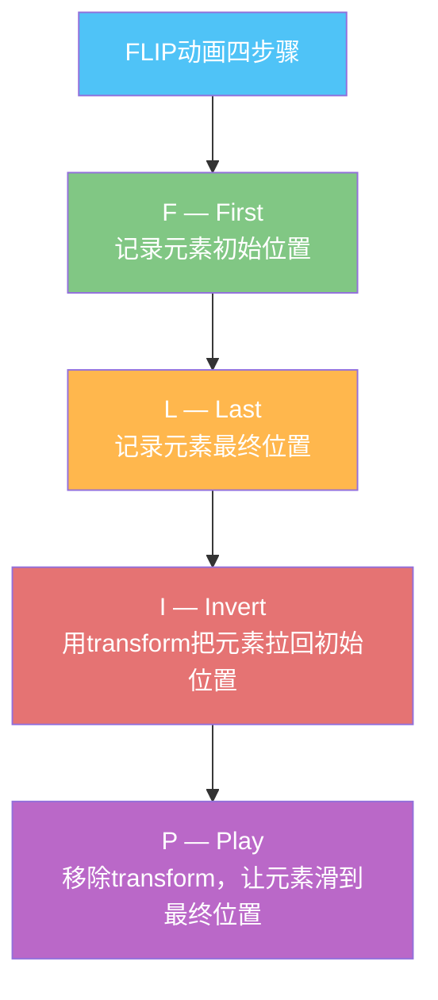
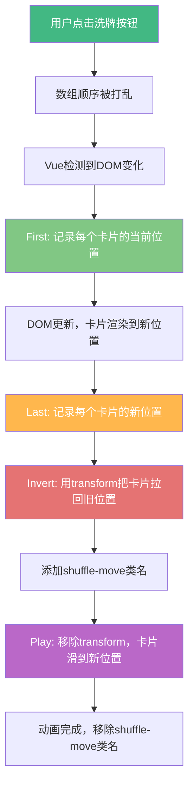

扫描[二维码](https://api2.cmdragon.cn/upload/cmder/20250304_012821924.jpg)关注或者微信搜一搜：`编程智域 前端至全栈交流与成长`

[发现1000+提升效率与开发的AI工具和实用程序](https://tools.cmdragon.cn/zh/apps?category=ai_chat)：https://tools.cmdragon.cn/zh/apps?category=ai_chat

## 一、问题来了——删一个，旁边全"蹦"了

你肯定遇到过这种情况：用TransitionGroup给列表加了进入和离开动画，看起来挺美，结果一删除中间某个列表项，旁边的元素"唰"地一下就跳到了新位置，毫无过渡可言。这种感觉就像排队买奶茶，前面突然走了一个，后面的人瞬间往前挪了一步，连个缓冲都没有，看着就别扭。

先来看一段"有问题"的代码，只有enter和leave动画，没有move动画：

```vue
<template>
  <!-- TransitionGroup包裹列表，name指定过渡类名前缀 -->
  <TransitionGroup name="list" tag="ul">
    <li v-for="item in items" :key="item.id">
      {{ item.text }}
      <!-- 点击删除按钮移除该项 -->
      <button @click="removeItem(item.id)">删除</button>
    </li>
  </TransitionGroup>
</template>

<script setup>
import { ref } from "vue";

// 初始列表数据，每项有唯一id和文本内容
const items = ref([
  { id: 1, text: "苹果" },
  { id: 2, text: "香蕉" },
  { id: 3, text: "橘子" },
  { id: 4, text: "葡萄" },
  { id: 5, text: "西瓜" },
]);

// 根据id找到对应项并从数组中移除
function removeItem(id) {
  const index = items.value.findIndex((item) => item.id === id);
  if (index > -1) {
    items.value.splice(index, 1);
  }
}
</script>

<style>
/* 进入和离开的过渡效果 */
.list-enter-active,
.list-leave-active {
  transition: all 0.5s ease;
}

/* 进入的初始状态：从右侧滑入且透明 */
.list-enter-from {
  opacity: 0;
  transform: translateX(30px);
}

/* 离开的最终状态：向左滑出且透明 */
.list-leave-to {
  opacity: 0;
  transform: translateX(-30px);
}
</style>
```

跑一下这段代码你会发现：被删除的元素确实有个淡出+滑走的动画，但它下面的元素呢？直接"蹦"上来了！没有任何过渡，就像瞬移一样。

**为啥会这样？** 因为离开的元素一旦从DOM中被移除，它原来占的空间就没了，其他元素会立刻填充这个空位。浏览器在渲染的时候，这种位置变化是瞬间完成的，不会自动给你加过渡效果。你只给enter和leave加了动画，但"位置移动"这件事压根没管，那当然就"蹦"了嘛。

要解决这个问题，就得让那些位置发生变化的元素也能平滑地"滑"到新位置——这就是move动画干的事儿。

## 二、FLIP动画原理——Vue是怎么做到的

在讲move动画怎么用之前，咱得先搞明白它背后的原理，不然你只会复制粘贴，出了bug都不知道咋查。

Vue的move动画用的是一种叫**FLIP**的动画技术。这玩意儿不是Vue发明的，是Google的Paul Lewis提出来的，全称是四个单词的首字母：



来，一步步拆解：

**First（记录初始位置）**：在DOM发生变化之前，Vue会先通过`getBoundingClientRect()`记录下每个元素当前的位置和尺寸。就好比你拍了一张"搬家前"的照片，记下每件家具摆在哪。

**Last（记录最终位置）**：DOM变化完成后，Vue再记录一次每个元素的新位置。这时候家具已经搬好了，你再拍一张"搬家后"的照片。

**Invert（反转）**：这是最巧妙的一步。Vue算出初始位置和最终位置的差值，然后用CSS的`transform`属性把元素从最终位置"拉回"到初始位置。也就是说，虽然DOM上元素已经在最终位置了，但视觉上它还待在原来的地方。就像你把家具搬到新位置了，但用魔法让它看起来还在老位置。

**Play（播放）**：最后，Vue移除那个`transform`，元素就从"看起来还在老位置"自然地过渡到最终位置了。因为CSS transition对`transform`生效，所以这个移动过程就是丝滑的动画。

用个具体的例子来说：假设一个元素原来在y=100的位置，DOM变化后它跑到了y=200的位置。Vue先算出差值是100px，然后给它加`transform: translateY(-100px)`，让它视觉上还在y=100。接着移除这个transform，配合CSS transition，元素就平滑地从y=100滑到y=200了。

整个FLIP过程对用户来说是完全无感知的——First和Last的记录是瞬间完成的，Invert也是瞬间设置的，用户只能看到Play那一步的平滑动画。

## 三、move类名——给移动的元素加过渡

知道了FLIP原理，接下来看Vue怎么把它落地成我们写的代码。

TransitionGroup在检测到子元素位置变化时，会给正在移动的元素添加一个特殊的CSS类名：**`xxx-move`**，其中`xxx`是你设置的`name`属性值。比如`name="list"`，那移动类名就是`list-move`。

你只需要在CSS里给这个类名加上`transition`属性，Vue的FLIP机制就能让移动动画生效了。来看代码：

```vue
<template>
  <!-- name="list"表示过渡类名前缀为list -->
  <TransitionGroup name="list" tag="ul">
    <li v-for="item in items" :key="item.id">
      {{ item.text }}
      <button @click="removeItem(item.id)">删除</button>
    </li>
  </TransitionGroup>
</template>

<script setup>
import { ref } from "vue";

// 列表数据
const items = ref([
  { id: 1, text: "苹果" },
  { id: 2, text: "香蕉" },
  { id: 3, text: "橘子" },
  { id: 4, text: "葡萄" },
  { id: 5, text: "西瓜" },
]);

// 删除指定id的项
function removeItem(id) {
  const index = items.value.findIndex((item) => item.id === id);
  if (index > -1) {
    items.value.splice(index, 1);
  }
}
</script>

<style>
/* 关键！给move类名加上transition，让位置变化有过渡效果 */
.list-move,
.list-enter-active,
.list-leave-active {
  transition: all 0.5s ease;
}

/* 进入的初始状态 */
.list-enter-from {
  opacity: 0;
  transform: translateX(30px);
}

/* 离开的最终状态 */
.list-leave-to {
  opacity: 0;
  transform: translateX(-30px);
}
</style>
```

注意看CSS部分，`.list-move`和`.list-enter-active`、`.list-leave-active`写在一起，都加了`transition: all 0.5s ease`。这就是move动画生效的关键——**你必须在CSS里给`xxx-move`类名声明transition属性**，否则FLIP的Play阶段没有过渡效果，元素还是会"蹦"过去。

这里有个小细节：`list-move`类名只在元素移动的过程中被添加，移动完成后就移除了。所以你不用担心这个类名会一直挂在元素上影响其他样式。

另外，`transition`属性里写的是`all`，这意味着不仅位置变化有过渡，其他属性（比如宽高、透明度）变化也会有过渡。如果你只想让位置变化有过渡，可以改成`transition: transform 0.5s ease`，这样更精确，性能也更好。

## 四、position: absolute——离开动画的"让位"秘诀

加了move类名之后，你会发现一个问题：删除元素时，离开动画还没播完，其他元素就已经开始移动了，而且移动的目标位置不对——它们会先跳到一个"错误"的位置，然后再滑到正确位置。

这又是咋回事？

原因是：**正在离开的元素还占据着文档流中的空间**。其他元素要移动到新位置，但离开的元素还没完全消失，还占着坑呢，所以其他元素算出来的"最终位置"是不对的。等离开的元素彻底从DOM移除后，其他元素又得重新调整位置，就出现了"先跳再滑"的奇怪效果。

解决办法很简单：给离开的元素加上`position: absolute`，让它脱离文档流。这样一来，离开的元素虽然还在播动画，但已经不占空间了，其他元素就能正确地计算自己的最终位置，FLIP也能正常工作。

打个比方：排队的时候，要走的人先站起来离开座位（脱离文档流），后面的人才能顺滑地往前挪。如果走的人还赖在座位上不走，后面的人就没法动嘛。

```vue
<template>
  <TransitionGroup name="list" tag="ul">
    <li v-for="item in items" :key="item.id">
      {{ item.text }}
      <button @click="removeItem(item.id)">删除</button>
    </li>
  </TransitionGroup>
</template>

<script setup>
import { ref } from "vue";

const items = ref([
  { id: 1, text: "苹果" },
  { id: 2, text: "香蕉" },
  { id: 3, text: "橘子" },
  { id: 4, text: "葡萄" },
  { id: 5, text: "西瓜" },
]);

function removeItem(id) {
  const index = items.value.findIndex((item) => item.id === id);
  if (index > -1) {
    items.value.splice(index, 1);
  }
}
</script>

<style>
/* move、enter、leave都加上过渡 */
.list-move,
.list-enter-active,
.list-leave-active {
  transition: all 0.5s ease;
}

/* 进入的初始状态 */
.list-enter-from {
  opacity: 0;
  transform: translateX(30px);
}

/* 离开的最终状态 */
.list-leave-to {
  opacity: 0;
  transform: translateX(-30px);
}

/* 关键！离开的元素脱离文档流，让出空间 */
.list-leave-active {
  position: absolute;
}
</style>
```

对比一下没有`position: absolute`和有`position: absolute`的效果：

**没有`position: absolute`**：删除中间元素时，离开动画还在播，下面的元素就开始往上挤，但挤到的位置不对（因为离开元素还占着空间），等离开元素消失后又跳一下。

**有`position: absolute`**：删除中间元素时，离开元素立刻脱离文档流（视觉上还在淡出），下面的元素平滑地滑上来，整个过程丝滑无比。

这里还有一点要注意：父容器（这里是`ul`）需要设置`position: relative`，因为`position: absolute`的元素会相对于最近的定位祖先来定位。虽然大多数情况下不设置也能正常工作，但为了保险，还是加上比较好：

```css
ul {
  position: relative;
}
```

## 五、moveClass——自定义移动过渡类名

有时候你可能不想用默认的`xxx-move`类名，比如你想跟Animate.css这种第三方CSS动画库配合，或者你的项目有统一的命名规范，那就可以用`moveClass`属性来自定义类名。

用法跟Transition组件的`enter-active-class`、`leave-active-class`类似：

```vue
<template>
  <!-- moveClass指定自定义的移动过渡类名 -->
  <TransitionGroup name="list" moveClass="slide-move" tag="ul">
    <li v-for="item in items" :key="item.id">
      {{ item.text }}
      <button @click="removeItem(item.id)">删除</button>
    </li>
  </TransitionGroup>
</template>

<script setup>
import { ref } from "vue";

const items = ref([
  { id: 1, text: "苹果" },
  { id: 2, text: "香蕉" },
  { id: 3, text: "橘子" },
  { id: 4, text: "葡萄" },
  { id: 5, text: "西瓜" },
]);

function removeItem(id) {
  const index = items.value.findIndex((item) => item.id === id);
  if (index > -1) {
    items.value.splice(index, 1);
  }
}
</script>

<style>
/* 不再用list-move，改用自定义的slide-move类名 */
.slide-move {
  transition: transform 0.8s cubic-bezier(0.68, -0.55, 0.27, 1.55);
}

/* 进入和离开仍然用name前缀的类名 */
.list-enter-active,
.list-leave-active {
  transition: all 0.5s ease;
}

.list-enter-from {
  opacity: 0;
  transform: translateX(30px);
}

.list-leave-to {
  opacity: 0;
  transform: translateX(-30px);
}

.list-leave-active {
  position: absolute;
}
</style>
```

在这个例子里，`moveClass="slide-move"`替换了默认的`list-move`。我在`slide-move`里用了一个弹性缓动函数`cubic-bezier(0.68, -0.55, 0.27, 1.55)`，让移动动画有点"弹弹的"效果，比普通的ease看着更有趣。

**什么时候该用moveClass？**

1. 跟第三方动画库（如Animate.css）配合时，你可能需要用库提供的类名
2. 项目有CSS命名规范，不想用Vue默认的命名方式
3. 同一个页面有多组TransitionGroup，需要不同的移动动画效果
4. 想给move动画用跟enter/leave不一样的过渡时长或缓动函数

## 六、实战——洗牌动画

学了这么多理论，来搞个完整的实战案例——洗牌动画。这个案例包含添加、删除和随机排序三种操作，把前面学的move动画、position: absolute、moveClass全用上。

```vue
<template>
  <div class="shuffle-container">
    <!-- 操作按钮区 -->
    <div class="controls">
      <button @click="addItem">添加</button>
      <button @click="removeRandom">随机删除</button>
      <button @click="shuffle">洗牌</button>
    </div>

    <!-- TransitionGroup实现列表动画 -->
    <!-- name="shuffle"作为默认类名前缀 -->
    <!-- moveClass自定义移动过渡类名 -->
    <TransitionGroup
      name="shuffle"
      moveClass="shuffle-move"
      tag="div"
      class="list"
    >
      <div
        v-for="item in items"
        :key="item.id"
        class="item"
        @click="removeItem(item.id)"
      >
        {{ item.number }}
      </div>
    </TransitionGroup>
  </div>
</template>

<script setup>
import { ref } from "vue";

// 下一个可用的id，保证唯一性
let nextId = 1;

// 生成初始数据，9个数字卡片
const items = ref(
  Array.from({ length: 9 }, () => ({
    id: nextId++,
    number: Math.floor(Math.random() * 100),
  })),
);

// 添加一个新项
function addItem() {
  items.value.push({
    id: nextId++,
    number: Math.floor(Math.random() * 100),
  });
}

// 根据id删除指定项
function removeItem(id) {
  const index = items.value.findIndex((item) => item.id === id);
  if (index > -1) {
    items.value.splice(index, 1);
  }
}

// 随机删除一个项
function removeRandom() {
  if (items.value.length === 0) return; // 空列表就不删了
  const randomIndex = Math.floor(Math.random() * items.value.length);
  items.value.splice(randomIndex, 1);
}

// Fisher-Yates洗牌算法，随机打乱数组顺序
function shuffle() {
  items.value = [...items.value].sort(() => Math.random() - 0.5);
}
</script>

<style>
.shuffle-container {
  max-width: 500px;
  margin: 0 auto;
}

.controls {
  margin-bottom: 20px;
  display: flex;
  gap: 10px;
}

.controls button {
  padding: 8px 16px;
  border: none;
  border-radius: 6px;
  background: #42b883;
  color: #fff;
  cursor: pointer;
  font-size: 14px;
  transition: background 0.3s;
}

.controls button:hover {
  background: #35a06e;
}

/* 列表容器用CSS Grid布局，3列排列 */
.list {
  display: grid;
  grid-template-columns: repeat(3, 1fr);
  gap: 10px;
  position: relative; /* 为absolute定位的离开元素提供参照 */
}

/* 每个卡片项的样式 */
.item {
  padding: 20px;
  background: #f0f0f0;
  border-radius: 8px;
  text-align: center;
  font-size: 24px;
  font-weight: bold;
  cursor: pointer;
  user-select: none;
  transition: background 0.3s;
}

.item:hover {
  background: #e0e0e0;
}

/* 自定义move类名，用弹性缓动让移动更有趣 */
.shuffle-move {
  transition: transform 0.6s cubic-bezier(0.25, 0.8, 0.25, 1);
}

/* 进入动画 */
.shuffle-enter-active {
  transition: all 0.5s ease;
}

.shuffle-enter-from {
  opacity: 0;
  transform: scale(0.5);
}

/* 离开动画 */
.shuffle-leave-active {
  transition: all 0.5s ease;
  position: absolute; /* 关键！离开时脱离文档流 */
}

.shuffle-leave-to {
  opacity: 0;
  transform: scale(0.5);
}
</style>
```

这个案例里，点击卡片可以删除它，点击"洗牌"按钮会随机打乱顺序，点击"添加"会在末尾追加一个新卡片。所有操作都有丝滑的动画效果：

- **添加**：新卡片从缩小+透明状态渐入
- **删除**：被删的卡片缩小+淡出，其他卡片平滑移动到新位置
- **洗牌**：所有卡片同时平滑移动到新位置，因为FLIP在背后默默工作

洗牌动画的完整流程如下：



这里有个值得注意的点：洗牌操作我用的是`[...items.value].sort(() => Math.random() - 0.5)`，先展开成新数组再排序。直接修改原数组的sort方法虽然也能触发响应式更新，但展开成新数组赋值更符合Vue的响应式最佳实践，确保所有变化都能被正确追踪。

另外，CSS Grid布局和move动画配合得非常好。因为Grid布局中每个格子的位置是确定的，FLIP能精确计算出每个元素从哪个格子移动到哪个格子，动画效果特别丝滑。

## 课后 Quiz

**问题1：为什么只写了enter和leave动画，删除列表项时其他元素会"跳跃"？**

答案：因为离开的元素从DOM中被移除后，它原来占据的空间消失了，其他元素会立即填充空位。浏览器对这种文档流中的位置变化不会自动添加过渡效果，所以看起来就像"蹦"过去了一样。要解决这个问题，需要给位置变化的元素添加move过渡类名，让FLIP动画生效。

**问题2：FLIP的四个步骤分别是什么？每一步在做什么？**

答案：FLIP是四个英文单词的缩写——First、Last、Invert、Play。First是在DOM变化前记录每个元素的初始位置；Last是DOM变化后记录每个元素的最终位置；Invert是算出位置差值，用transform把元素从最终位置"拉回"到初始位置，让视觉上元素还在原位；Play是移除transform，配合CSS transition让元素平滑地从初始位置过渡到最终位置。整个过程用户只能看到Play阶段的平滑动画。

**问题3：为什么离开动画需要加`position: absolute`？不加会怎样？**

答案：因为正在执行离开动画的元素仍然占据文档流中的空间，其他元素在计算自己的最终位置时会把离开元素的空间也算进去，导致FLIP算出的目标位置不准确。加上`position: absolute`后，离开的元素脱离了文档流，不再占据空间，其他元素就能正确地计算最终位置，move动画才能正常工作。不加的话，其他元素会先跳到一个错误位置，等离开元素彻底消失后再跳到正确位置，出现"先跳再滑"的异常效果。

## 常见报错解决方案

**报错1：列表项移动时没有过渡效果，直接跳到新位置**

原因：CSS中没有给`xxx-move`类名添加`transition`属性。FLIP的Play阶段需要CSS transition来驱动动画，没有transition，transform的移除就是瞬间的。

解决方案：在CSS中添加move类名的transition声明：

```css
.list-move {
  transition: transform 0.5s ease;
}
```

同时确保enter和leave的active类名也有transition，可以合并写：

```css
.list-move,
.list-enter-active,
.list-leave-active {
  transition: all 0.5s ease;
}
```

**报错2：删除元素时，其他元素先跳一下再滑到正确位置**

原因：离开的元素没有设置`position: absolute`，仍然占据文档流空间。其他元素在FLIP的Last阶段计算出的最终位置包含了离开元素的空间，导致位置计算错误。

解决方案：给`xxx-leave-active`类名添加`position: absolute`：

```css
.list-leave-active {
  position: absolute;
}
```

同时建议给父容器添加`position: relative`作为定位参照：

```css
ul {
  position: relative;
}
```

**报错3：洗牌或排序后动画不生效，元素直接跳到新位置**

原因：可能是key值设置不当。如果key用的是数组索引（index），那么Vue会认为是同一个元素在更新内容，而不是位置发生了变化，FLIP就不会触发。或者修改数组的方式没有触发Vue的响应式更新。

解决方案：确保每个列表项的key是唯一且稳定的id，不要用index：

```vue
<!-- 错误：用index作key -->
<li v-for="(item, index) in items" :key="index">

<!-- 正确：用唯一id作key -->
<li v-for="item in items" :key="item.id">
```

同时确保数组操作能触发响应式更新，比如用`items.value = [...items.value].sort(...)`而不是直接`items.value.sort(...)`，展开成新数组赋值更可靠。

参考链接：https://vuejs.org/guide/built-ins/transition-group.html

余下文章内容请点击跳转至 个人博客页面 或者 扫描[二维码](https://api2.cmdragon.cn/upload/cmder/20250304_012821924.jpg)关注或者微信搜一搜：`编程智域 前端至全栈交流与成长`，阅读完整的文章：[列表项删了旁边的却蹦走了？move动画和FLIP让你丝滑如初](https://blog.cmdragon.cn/posts/h4i5j6k7l8m9n0o1p2q3r4s5t6u7v8w9/)

<details>
<summary>往期文章归档</summary>

- [Vue 3 静态与动态 Props 如何传递？TypeScript 类型约束有何必要？](https://blog.cmdragon.cn/posts/94ab48753b64780ca3ab7a7115ae8522/)
- [Vue 3中组件局部注册的优势与实现方式如何？](https://blog.cmdragon.cn/posts/dbf576e744870f6de26fd8a2e03e47da/)
- [如何在Vue3中优化生命周期钩子性能并规避常见陷阱？](https://blog.cmdragon.cn/posts/12d98b3b9ccd6c19a1b169d720ac5c80/)
- [Vue 3 Composition API生命周期钩子：如何实现从基础理解到高阶复用？](https://blog.cmdragon.cn/posts/8884e2b70287fcb263c57648eeb27419/)
- [Vue 3生命周期钩子实战指南：如何正确选择onMounted、onUpdated与onUnmounted的应用场景？](https://blog.cmdragon.cn/posts/883c6dbc50ae4183770a4462e0b8ae4d/)
- [Vue 3中生命周期钩子与响应式系统如何实现协同工作？](https://blog.cmdragon.cn/posts/70dad360ffa9dce14d0d69611b8cb019/)
- [Vue 3组件生命周期钩子的执行顺序与使用场景是什么？](https://blog.cmdragon.cn/posts/db44294a78dc9f666f67b053f6c83567/)
- [Vue组件全局注册与局部注册如何抉择？](https://blog.cmdragon.cn/posts/43ead630ea17da65d99ad2eb8188e472/)
- [Vue3组件化开发中，Props与Emits如何实现数据流转与事件协作？](https://blog.cmdragon.cn/posts/8cff7d2df113da66ea7be560c4d1d22a/)
- [Vue 3模板引用如何与其他特性协同实现复杂交互？](https://blog.cmdragon.cn/posts/331bf75d114ab09116eadfcdca602b58/)
- [Vue 3 v-for中模板引用如何实现高效管理与动态控制？](https://blog.cmdragon.cn/posts/cb380897ddc3578b180ecf8843c774c1/)
- [Vue 3的defineExpose：如何突破script setup组件默认封装，实现精准的父子通讯？](https://blog.cmdragon.cn/posts/202ae0f4acde7128e0e31baf63732fb5/)
- [Vue 3模板引用的生命周期时机如何把握？常见陷阱该如何避免？](https://blog.cmdragon.cn/posts/7d2a0f6555ecbe92afd7d2491c427463/)
- [Vue 3模板引用如何实现父组件与子组件的高效交互？](https://blog.cmdragon.cn/posts/3fb7bdd84128b7efaaa1c979e1f28dee/)
- [Vue中为何需要模板引用？又如何高效实现DOM与组件实例的直接访问？](https://blog.cmdragon.cn/posts/23f3464ba16c7054b4783cded50c04c6/)

</details>

<details>
<summary>免费好用的热门在线工具</summary>

- [多直播聚合器 - 应用商店 | By cmdragon](https://tools.cmdragon.cn/zh/apps/multi-live-aggregator)
- [Proto文件生成器 - 应用商店 | By cmdragon](https://tools.cmdragon.cn/zh/apps/proto-file-generator)
- [图片转粒子 - 应用商店 | By cmdragon](https://tools.cmdragon.cn/zh/apps/image-to-particles)
- [视频下载器 - 应用商店 | By cmdragon](https://tools.cmdragon.cn/zh/apps/video-downloader)
- [文件格式转换器 - 应用商店 | By cmdragon](https://tools.cmdragon.cn/zh/apps/file-converter)
- [M3U8在线播放器 - 应用商店 | By cmdragon](https://tools.cmdragon.cn/zh/apps/m3u8-player)
- [快图设计 - 应用商店 | By cmdragon](https://tools.cmdragon.cn/zh/apps/quick-image-design)
- [高级文字转图片转换器 - 应用商店 | By cmdragon](https://tools.cmdragon.cn/zh/apps/text-to-image-advanced)
- [RAID 计算器 - 应用商店 | By cmdragon](https://tools.cmdragon.cn/zh/apps/raid-calculator)
- [在线PS - 应用商店 | By cmdragon](https://tools.cmdragon.cn/zh/apps/photoshop-online)
- [Mermaid 在线编辑器 - 应用商店 | By cmdragon](https://tools.cmdragon.cn/zh/apps/mermaid-live-editor)
- [数学求解计算器 - 应用商店 | By cmdragon](https://tools.cmdragon.cn/zh/apps/math-solver-calculator)
- [智能提词器 - 应用商店 | By cmdragon](https://tools.cmdragon.cn/zh/apps/smart-teleprompter)
- [魔法简历 - 应用商店 | By cmdragon](https://tools.cmdragon.cn/zh/apps/magic-resume)
- [Image Puzzle Tool - 图片拼图工具 | By cmdragon](https://tools.cmdragon.cn/zh/apps/image-puzzle-tool)
- [字幕下载工具 - 应用商店 | By cmdragon](https://tools.cmdragon.cn/zh/apps/subtitle-downloader)
- [歌词生成工具 - 应用商店 | By cmdragon](https://tools.cmdragon.cn/zh/apps/lyrics-generator)
- [网盘资源聚合搜索 - 应用商店 | By cmdragon](https://tools.cmdragon.cn/zh/apps/cloud-drive-search)
- [ASCII字符画生成器 - 应用商店 | By cmdragon](https://tools.cmdragon.cn/zh/apps/ascii-art-generator)
- [JSON Web Tokens 工具 - 应用商店 | By cmdragon](https://tools.cmdragon.cn/zh/apps/jwt-tool)
- [Bcrypt 密码工具 - 应用商店 | By cmdragon](https://tools.cmdragon.cn/zh/apps/bcrypt-tool)
- [GIF 合成器 - 应用商店 | By cmdragon](https://tools.cmdragon.cn/zh/apps/gif-composer)
- [GIF 分解器 - 应用商店 | By cmdragon](https://tools.cmdragon.cn/zh/apps/gif-decomposer)
- [文本隐写术 - 应用商店 | By cmdragon](https://tools.cmdragon.cn/zh/apps/text-steganography)
- [CMDragon 在线工具 - 高级AI工具箱与开发者套件 | 免费好用的在线工具](https://tools.cmdragon.cn/zh)
- [应用商店 - 发现1000+提升效率与开发的AI工具和实用程序 | 免费好用的在线工具](https://tools.cmdragon.cn/zh/apps?category=trending)
- [CMDragon 更新日志 - 最新更新、功能与改进 | 免费好用的在线工具](https://tools.cmdragon.cn/zh/changelog)
- [支持我们 - 成为赞助者 | 免费好用的在线工具](https://tools.cmdragon.cn/zh/sponsor)
- [AI文本生成图像 - 应用商店 | 免费好用的在线工具](https://tools.cmdragon.cn/zh/apps/text-to-image-ai)
- [临时邮箱 - 应用商店 | 免费好用的在线工具](https://tools.cmdragon.cn/zh/apps/temp-email)
- [二维码解析器 - 应用商店 | 免费好用的在线工具](https://tools.cmdragon.cn/zh/apps/qrcode-parser)
- [文本转思维导图 - 应用商店 | 免费好用的在线工具](https://tools.cmdragon.cn/zh/apps/text-to-mindmap)
- [正则表达式可视化工具 - 应用商店 | 免费好用的在线工具](https://tools.cmdragon.cn/zh/apps/regex-visualizer)
- [文件隐写工具 - 应用商店 | 免费好用的在线工具](https://tools.cmdragon.cn/zh/apps/steganography-tool)
- [IPTV 频道探索器 - 应用商店 | 免费好用的在线工具](https://tools.cmdragon.cn/zh/apps/iptv-explorer)
- [快传 - 应用商店 | By cmdragon](https://tools.cmdragon.cn/zh/apps/snapdrop)
- [随机抽奖工具 - 应用商店 | 免费好用的在线工具](https://tools.cmdragon.cn/zh/apps/lucky-draw)
- [动漫场景查找器 - 应用商店 | 免费好用的在线工具](https://tools.cmdragon.cn/zh/apps/anime-scene-finder)
- [时间工具箱 - 应用商店 | 免费好用的在线工具](https://tools.cmdragon.cn/zh/apps/time-toolkit)
- [网速测试 - 应用商店 | 免费好用的在线工具](https://tools.cmdragon.cn/zh/apps/speed-test)
- [AI 智能抠图工具 - 应用商店 | 免费好用的在线工具](https://tools.cmdragon.cn/zh/apps/background-remover)
- [背景替换工具 - 应用商店 | 免费好用的在线工具](https://tools.cmdragon.cn/zh/apps/background-replacer)
- [艺术二维码生成器 - 应用商店 | 免费好用的在线工具](https://tools.cmdragon.cn/zh/apps/artistic-qrcode)
- [Open Graph 元标签生成器 - 应用商店 | 免费好用的在线工具](https://tools.cmdragon.cn/zh/apps/open-graph-generator)
- [图像对比工具 - 应用商店 | 免费好用的在线工具](https://tools.cmdragon.cn/zh/apps/image-comparison)
- [图片压缩专业版 - 应用商店 | 免费好用的在线工具](https://tools.cmdragon.cn/zh/apps/image-compressor)
- [密码生成器 - 应用商店 | 免费好用的在线工具](https://tools.cmdragon.cn/zh/apps/password-generator)
- [SVG优化器 - 应用商店 | 免费好用的在线工具](https://tools.cmdragon.cn/zh/apps/svg-optimizer)
- [调色板生成器 - 应用商店 | 免费好用的在线工具](https://tools.cmdragon.cn/zh/apps/color-palette)
- [在线节拍器 - 应用商店 | 免费好用的在线工具](https://tools.cmdragon.cn/zh/apps/online-metronome)
- [IP归属地查询 - 应用商店 | By cmdragon](https://tools.cmdragon.cn/zh/apps/ip-geolocation)
- [CSS网格布局生成器 - 应用商店 | 免费好用的在线工具](https://tools.cmdragon.cn/zh/apps/css-grid-layout)
- [邮箱验证工具 - 应用商店 | 免费好用的在线工具](https://tools.cmdragon.cn/zh/apps/email-validator)
- [书法练习字帖 - 应用商店 | 免费好用的在线工具](https://tools.cmdragon.cn/zh/apps/calligraphy-practice)
- [金融计算器套件 - 应用商店 | 免费好用的在线工具](https://tools.cmdragon.cn/zh/apps/finance-calculator-suite)
- [中国亲戚关系计算器 - 应用商店 | 免费好用的在线工具](https://tools.cmdragon.cn/zh/apps/chinese-kinship-calculator)
- [Protocol Buffer 工具箱 - 应用商店 | 免费好用的在线工具](https://tools.cmdragon.cn/zh/apps/protobuf-toolkit)
- [IP归属地查询 - 应用商店 | 免费好用的在线工具](https://tools.cmdragon.cn/zh/apps/ip-geolocation)
- [图片无损放大 - 应用商店 | 免费好用的在线工具](https://tools.cmdragon.cn/zh/apps/image-upscaler)
- [文本比较工具 - 应用商店 | 免费好用的在线工具](https://tools.cmdragon.cn/zh/apps/text-compare)
- [IP批量查询工具 - 应用商店 | 免费好用的在线工具](https://tools.cmdragon.cn/zh/apps/ip-batch-lookup)
- [域名查询工具 - 应用商店 | 免费好用的在线工具](https://tools.cmdragon.cn/zh/apps/domain-finder)
- [DNS工具箱 - 应用商店 | 免费好用的在线工具](https://tools.cmdragon.cn/zh/apps/dns-toolkit)
- [网站图标生成器 - 应用商店 | 免费好用的在线工具](https://tools.cmdragon.cn/zh/apps/favicon-generator)
- [XML Sitemap](https://tools.cmdragon.cn/sitemap_index.xml)

</details>
