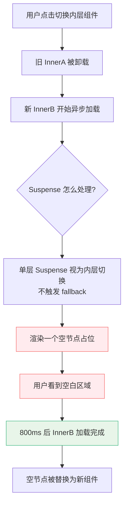
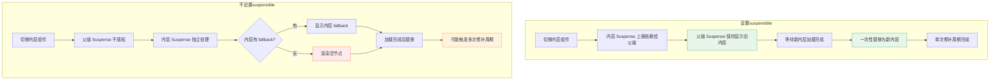
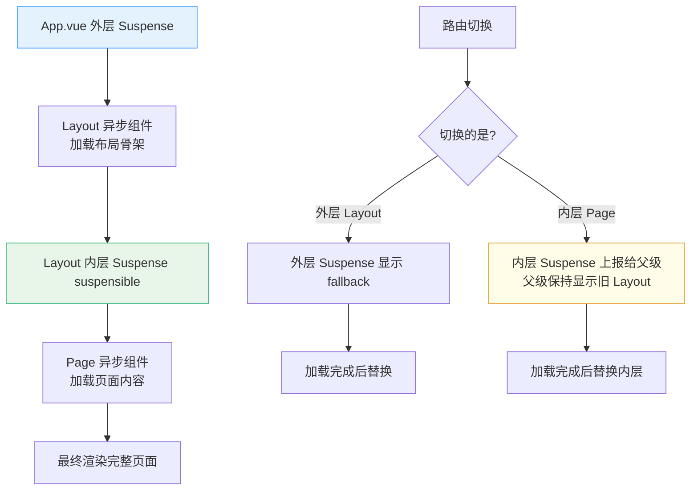
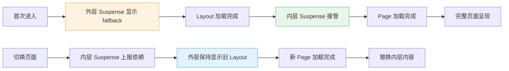

扫描[二维码](https://api2.cmdragon.cn/upload/cmder/20250304_012821924.jpg)关注或者微信搜一搜：`编程智域 前端至全栈交流与成长`

[发现1000+提升效率与开发的AI工具和实用程序](https://tools.cmdragon.cn/zh/apps?category=ai_chat)：https://tools.cmdragon.cn/zh/apps?category=ai_chat

## 一、啥时候需要嵌套Suspense？

玩 Vue 3 的小伙伴应该都接触过 `<Suspense>` 这个内置组件了，它就像个"快递代收点"，专门帮你处理异步组件加载那段时间的尴尬期——还没到货的时候显示个 fallback 占位，到货了再换上真家伙。但是呢，从 Vue 3.3 开始，官方给它加了个新本事：**支持嵌套使用**。

那啥时候会用到嵌套呢？最常见的场景就是**嵌套路由**或者**基于布局的路由**，页面上同时存在多个异步组件，而且它们之间还有层级关系。

举个栗子，你有一个外层组件叫 `DynamicAsyncOuter`，它内部又套了一个内层组件 `DynamicAsyncInner`，两个都是异步加载的。这就好比大盒子套小盒子，每个盒子都可能有自己的"快递要等"——外层盒子在等外层的数据，内层盒子在内层的数据没到之前也得有个交代。

来看个最基础的嵌套异步组件结构：

```vue
<!-- App.vue -->
<script setup>
import { ref, shallowRef, defineAsyncComponent } from 'vue'

// 外层异步组件：模拟 1 秒后加载完成
const DynamicAsyncOuter = defineAsyncComponent(() =>
  new Promise(resolve => {
    setTimeout(() => {
      // 内部又嵌套了一个异步组件
      resolve({
        name: 'DynamicAsyncOuter',
        setup() {
          // 内层异步组件，再等 1 秒
          const DynamicAsyncInner = defineAsyncComponent(() =>
            new Promise(r => setTimeout(() => r({
              name: 'DynamicAsyncInner',
              template: '<div style="color:#42b883">内层组件加载完成啦 🎉</div>'
            }), 1000))
          )
          return { DynamicAsyncInner }
        },
        template: `
          <div style="border:2px dashed #409eff;padding:10px">
            <p>外层组件已就绪</p>
            <DynamicAsyncInner />
          </div>
        `
      })
    }, 1000)
  })
)

// 当前展示的组件引用
const current = shallowRef(DynamicAsyncOuter)
</script>

<template>
  <!-- 单层 Suspense 包裹 -->
  <Suspense>
    <template #default>
      <component :is="current" />
    </template>
    <template #fallback>
      <div style="color:#999">外层加载中...</div>
    </template>
  </Suspense>
</template>
```

你看，外层等 1 秒，内层又等 1 秒，这种"盒中盒"的结构就是嵌套异步组件的典型形态。如果只用一个 `<Suspense>` 把它们都罩住，看起来好像也能跑，但问题就藏在这种"看起来能跑"的表象下面。

## 二、不嵌套Suspense会出啥问题？

很多人一开始的想法很简单：一个 `<Suspense>` 罩住所有异步组件不就完事了嘛，省事。确实，单个 `<Suspense>` 会解析它下面整棵树里的所有异步组件，外层切换的时候它也能正确地等待。

但是！一旦你切换的是**内层**的 `DynamicAsyncInner`，问题就来了——内层组件会直接呈现为一个**空节点**，啥都不显示，直到它自己被解析完成。它既不会显示之前的旧节点，也不会显示 fallback，就是干巴巴地"空了一块"。

打个比方，你换内层组件的时候，屏幕上突然出现一个"黑洞"，啥都没有，用户看着一脸懵：我是不是网断了？是不是页面崩了？

来看个能复现问题的代码：

```vue
<!-- App.vue：复现空节点问题 -->
<script setup>
import { ref, shallowRef, defineAsyncComponent } from 'vue'

// 工厂函数：制造异步组件
function makeAsync(name, delay = 1000, color = '#42b883') {
  return defineAsyncComponent(() =>
    new Promise(resolve => {
      setTimeout(() => resolve({
        name,
        template: `<div style="color:${color};padding:8px;border:1px solid ${color}">${name} 已加载</div>`
      }), delay)
    })
  )
}

// 内层组件 A 和 B，用来切换
const InnerA = makeAsync('InnerA', 800, '#42b883')
const InnerB = makeAsync('InnerB', 800, '#f56c6c')

// 外层组件，内部根据 prop 决定渲染哪个内层
const Outer = {
  props: ['inner'],
  setup(props) {
    return () => {
      // 这里切换 inner 时，旧组件卸载、新组件加载
      // 单层 Suspense 罩不住这种"内层切换"
      const Comp = props.inner === 'A' ? InnerA : InnerB
      return <Comp />
    }
  }
}

// 当前内层标识
const innerKey = ref('A')

// 切换内层组件
function toggleInner() {
  innerKey.value = innerKey.value === 'A' ? 'B' : 'A'
}
</script>

<template>
  <div>
    <button @click="toggleInner">切换内层组件</button>
    <!-- 只有一层 Suspense -->
    <Suspense>
      <template #default>
        <Outer :inner="innerKey" />
      </template>
      <template #fallback>
        <div>加载中...</div>
      </template>
    </Suspense>
  </div>
</template>
```

当你点击"切换内层组件"按钮的时候，你会看到：旧的内层组件瞬间消失，然后屏幕上空空如也，过了 800ms 新组件才冒出来。这中间的"空白期"就是空节点问题。

下面这张流程图把这个问题画得明明白白：



问题根源在于：单层 `<Suspense>` 只在**首次进入挂起状态**或者**根 default 插槽的依赖发生变化**时才会显示 fallback。内层组件切换属于"子树内部的事"，外层 Suspense 根本不感知，所以它不会帮你显示 fallback，结果就是空节点。

## 三、suspensible属性——把控制权交给父级

那咋整？Vue 3.3 给了个专门的解法：在内层再套一个 `<Suspense>`，并加上 `suspensible` 属性。写法长这样：

```vue
<Suspense suspensible>
  <!-- 内层异步组件 -->
</Suspense>
```

这个 `suspensible` 属性是干啥用的呢？简单说就是：**把内层 Suspense 的"控制权"上交给父级 Suspense**。

具体一点，设置 `suspensible` 之后会发生这些事：

1. 内层 Suspense 不再自己单独处理异步依赖，而是把所有异步依赖（包括相关事件）都"上报"给最近的父级 Suspense
2. 内层 Suspense 退化为一个**依赖项解析和修补的边界**，只负责划清"我这一层有哪些异步依赖"
3. 父级 Suspense 会统一协调所有层级的异步依赖，避免出现空节点

来看正确的嵌套写法：

```vue
<!-- App.vue：使用 suspensible 的正确嵌套写法 -->
<script setup>
import { ref, shallowRef, defineAsyncComponent, h } from 'vue'

// 制造异步组件的工厂
function makeAsync(name, delay = 800, color = '#42b883') {
  return defineAsyncComponent({
    loader: () =>
      new Promise(resolve => {
        setTimeout(() => resolve({
          name,
          setup() {
            return () => h('div', {
              style: `color:${color};padding:8px;border:1px solid ${color}`
            }, `${name} 已加载`)
          }
        }), delay)
      }),
    // 加载中时显示的组件（可选）
    loadingComponent: () => h('div', { style: 'color:#999' }, `${name} 加载中...`)
  })
}

const InnerA = makeAsync('InnerA', 800, '#42b883')
const InnerB = makeAsync('InnerB', 800, '#f56c6c')

// 外层组件：内部用嵌套 Suspense + suspensible 包裹内层
const Outer = {
  props: ['inner'],
  setup(props) {
    return () => h(
      // 内层 Suspense，关键就是 suspensible 属性
      resolveComponent('Suspense'),
      { suspensible: true },
      {
        default: () => props.inner === 'A' ? h(InnerA) : h(InnerB),
        // 内层 fallback 一般不会触发，因为控制权交给父级了
        fallback: () => h('div', { style: 'color:#e6a23c' }, '内层 fallback')
      }
    )
  }
}

import { resolveComponent } from 'vue'

const innerKey = ref('A')
function toggleInner() {
  innerKey.value = innerKey.value === 'A' ? 'B' : 'A'
}
</script>

<template>
  <div>
    <button @click="toggleInner">切换内层组件</button>
    <!-- 外层 Suspense：统一协调 -->
    <Suspense>
      <template #default>
        <Outer :inner="innerKey" />
      </template>
      <template #fallback>
        <div style="color:#409eff">外层加载中...</div>
      </template>
    </Suspense>
  </div>
</template>
```

为了让大家看得更清楚，下面用更贴近模板写法的形式再写一遍核心结构：

```vue
<!-- Outer.vue：外层组件，内部嵌套 Suspense -->
<script setup>
import { defineAsyncComponent } from 'vue'

const props = defineProps({
  inner: String
})

// 两个内层异步组件
const InnerA = defineAsyncComponent(() =>
  import('./InnerA.vue')
)
const InnerB = defineAsyncComponent(() =>
  import('./InnerB.vue')
)
</script>

<template>
  <div class="outer">
    <p>外层组件已就绪</p>
    <!-- 关键：suspensible 属性 -->
    <Suspense suspensible>
      <component :is="inner === 'A' ? InnerA : InnerB" />
      <template #fallback>
        <div>内层加载中...</div>
      </template>
    </Suspense>
  </div>
</template>
```

加上 `suspensible` 之后，当你切换内层组件时，父级 Suspense 会感知到"嘿，我下面有新的异步依赖了"，于是它会**保持显示之前的内容**（或者 fallback），直到新的内层组件加载完成，再一次性替换上去。空节点问题就这么被解决了。

## 四、不设置suspensible会咋样？

那有同学可能会问：我就不加 `suspensible`，内层自己套个 Suspense 不行吗？答案是：**能跑，但会出问题**。

不设置 `suspensible` 的话，内层 Suspense 会被父级 Suspense 当成一个**同步组件**对待——父级觉得"你内层 Suspense 又不是异步的，我管你里面干啥"。这时候内层 Suspense 就只能靠自己了，它会有自己的 fallback 插槽，自己处理自己的异步依赖。

问题来了，如果**外层的 DynamicAsyncOuter 和内层的 DynamicAsyncInner 同时被修改**（比如路由跳转，外层和内层都换了），子 Suspense 在加载自己那棵依赖树的时候，就可能出现空节点——因为父级 Suspense 觉得外层已经就绪了，就把控制权交出去了，但内层其实还没准备好。

更麻烦的是，还可能出现**多次修补周期（patch cycles）**。啥意思呢？就是 Vue 的渲染器要来回修补好几次 DOM 才能稳定下来，性能上不划算，也不是理想情况。

下面这张表格把两种情况对比得清清楚楚：

| 对比项 | 设置 `suspensible` | 不设置 `suspensible` |
|--------|-------------------|---------------------|
| 异步依赖处理 | 上交给父级 Suspense 统一协调 | 内层自己处理，父级不感知 |
| fallback 触发 | 由父级统一决定是否显示 | 内层有自己的 fallback，独立触发 |
| 内层切换时空节点 | 不会出现，父级会保持旧内容 | 可能出现，内层独立加载时屏幕空白 |
| 多次修补周期 | 不会出现，单次修补即可 | 可能出现，性能不理想 |
| 同时修改内外层 | 父级统一等待所有依赖 | 内外层各自为政，可能错位 |
| 适用场景 | 嵌套路由、布局路由 | 内层完全独立的异步区域 |

再来看张流程图，把两种情况的差异画出来：



所以记住一个口诀：**嵌套 Suspense 必加 suspensible，除非你明确知道内层要完全独立**。

## 五、实战——嵌套布局路由的完整示例

光说不练假把式，下面来个完整的实战案例：一个带布局的路由，外层是 `Layout` 组件（包含导航栏、侧边栏），内层是 `Page` 组件（实际页面内容），两个都是异步组件。我们用嵌套 Suspense + `suspensible` 解决空节点问题。

先看整体结构图：



下面是完整代码，包含模板和脚本：

```vue
<!-- App.vue：应用根组件，外层 Suspense -->
<script setup>
import { shallowRef, defineAsyncComponent } from 'vue'

// 异步加载 Layout 组件（模拟 1 秒加载）
const Layout = defineAsyncComponent(() =>
  new Promise(resolve => {
    setTimeout(() => resolve({
      name: 'Layout',
      props: ['page'],
      setup(props, { slots }) {
        return () => {
          // 这里用 h 函数手动构造嵌套结构
          const { h, resolveComponent } = require('vue')
          return h('div', { class: 'layout' }, [
            h('header', { class: 'layout-header' }, '我是布局头部导航'),
            h('aside', { class: 'layout-sidebar' }, '我是侧边栏'),
            h('main', { class: 'layout-main' }, [
              // 关键：内层 Suspense + suspensible
              h(resolveComponent('Suspense'), { suspensible: true }, {
                default: () => slots.default?.(),
                fallback: () => h('div', '页面加载中...')
              })
            ])
          ])
        }
      }
    }), 1000)
  })
)

// 当前页面标识
const currentPage = shallowRef('home')

// 切换页面
function goPage(page) {
  currentPage.value = page
}

// 异步页面组件工厂
function makePage(name, color) {
  return defineAsyncComponent(() =>
    new Promise(resolve => {
      setTimeout(() => resolve({
        name,
        setup() {
          return () => {
            const { h } = require('vue')
            return h('div', {
              style: `padding:20px;background:${color};color:#fff;border-radius:4px`
            }, `这是 ${name} 页面的内容，加载完成于 ${new Date().toLocaleTimeString()}`)
          }
        }
      }), 800)
    })
  )
}

const HomePage = makePage('首页', '#42b883')
const AboutPage = makePage('关于', '#409eff')
const ContactPage = makePage('联系', '#e6a23c')

// 根据当前页返回对应组件
function currentPageComp() {
  switch (currentPage.value) {
    case 'home': return HomePage
    case 'about': return AboutPage
    case 'contact': return ContactPage
    default: return HomePage
  }
}
</script>

<template>
  <div id="app">
    <nav class="top-nav">
      <button @click="goPage('home')">首页</button>
      <button @click="goPage('about')">关于</button>
      <button @click="goPage('contact')">联系</button>
    </nav>

    <!-- 外层 Suspense：负责 Layout 的加载 -->
    <Suspense>
      <template #default>
        <Layout :page="currentPage">
          <!-- 这里的内容会被 Layout 的内层 Suspense 包裹 -->
          <component :is="currentPageComp()" />
        </Layout>
      </template>
      <template #fallback>
        <div class="global-loading">整个应用加载中，请稍候...</div>
      </template>
    </Suspense>
  </div>
</template>

<style scoped>
.top-nav {
  padding: 12px;
  background: #2c3e50;
  display: flex;
  gap: 8px;
}
.top-nav button {
  padding: 6px 12px;
  cursor: pointer;
  border: none;
  border-radius: 4px;
  background: #42b883;
  color: #fff;
}
.top-nav button:hover {
  background: #33a06f;
}
.global-loading {
  padding: 40px;
  text-align: center;
  color: #999;
}
.layout {
  display: grid;
  grid-template-columns: 200px 1fr;
  grid-template-rows: auto 1fr;
  gap: 10px;
  padding: 10px;
}
.layout-header {
  grid-column: 1 / 3;
  background: #f5f7fa;
  padding: 12px;
  border-radius: 4px;
}
.layout-sidebar {
  background: #f5f7fa;
  padding: 12px;
  border-radius: 4px;
}
.layout-main {
  background: #fff;
  padding: 12px;
  border-radius: 4px;
  border: 1px solid #ebeef5;
}
</style>
```

上面这个例子用 `h` 函数有点绕，下面给一个更易读的模板版本，把 Layout 拆成单独的 `.vue` 文件：

```vue
<!-- Layout.vue：布局组件，内部嵌套 Suspense -->
<script setup>
import { defineAsyncComponent } from 'vue'

// 异步加载页面组件
const HomePage = defineAsyncComponent(() => import('./pages/Home.vue'))
const AboutPage = defineAsyncComponent(() => import('./pages/About.vue'))
const ContactPage = defineAsyncComponent(() => import('./pages/Contact.vue'))

const props = defineProps({
  page: String
})

// 根据传入的 page 决定渲染哪个页面
const pageMap = {
  home: HomePage,
  about: AboutPage,
  contact: ContactPage
}
</script>

<template>
  <div class="layout">
    <header class="layout-header">布局头部导航</header>
    <aside class="layout-sidebar">侧边栏菜单</aside>
    <main class="layout-main">
      <!-- 关键：内层 Suspense 加上 suspensible -->
      <Suspense suspensible>
        <component :is="pageMap[page]" />
        <template #fallback>
          <div class="page-loading">页面加载中...</div>
        </template>
      </Suspense>
    </main>
  </div>
</template>

<style scoped>
.layout {
  display: grid;
  grid-template-columns: 200px 1fr;
  grid-template-rows: auto 1fr;
  gap: 10px;
  padding: 10px;
}
.layout-header {
  grid-column: 1 / 3;
  background: #f5f7fa;
  padding: 12px;
  border-radius: 4px;
}
.layout-sidebar {
  background: #f5f7fa;
  padding: 12px;
  border-radius: 4px;
}
.layout-main {
  background: #fff;
  padding: 12px;
  border-radius: 4px;
  border: 1px solid #ebeef5;
  min-height: 300px;
}
.page-loading {
  color: #999;
  text-align: center;
  padding: 40px;
}
</style>
```

```vue
<!-- App.vue：根组件，外层 Suspense -->
<script setup>
import { ref, defineAsyncComponent } from 'vue'

// 异步加载 Layout
const Layout = defineAsyncComponent(() => import('./Layout.vue'))

const currentPage = ref('home')
</script>

<template>
  <div id="app">
    <nav>
      <button @click="currentPage = 'home'">首页</button>
      <button @click="currentPage = 'about'">关于</button>
      <button @click="currentPage = 'contact'">联系</button>
    </nav>

    <!-- 外层 Suspense：负责 Layout 的首次加载 -->
    <Suspense>
      <template #default>
        <Layout :page="currentPage" />
      </template>
      <template #fallback>
        <div class="global-loading">应用加载中...</div>
      </template>
    </Suspense>
  </div>
</template>
```

```vue
<!-- pages/Home.vue：首页组件 -->
<script setup>
import { ref, onMounted } from 'vue'

const data = ref(null)

// 模拟异步数据请求
onMounted(async () => {
  await new Promise(r => setTimeout(r, 800))
  data.value = '首页数据加载完成'
})
</script>

<template>
  <div>
    <h2>首页</h2>
    <p>{{ data || '加载中...' }}</p>
  </div>
</template>
```

这样一来，整个工作流程就清晰了：



切换页面的时候，你会看到 Layout 一直稳稳地待在那儿，只有中间内容区会"等一下"再换新内容，再也不会出现整个页面闪一下的尴尬情况了。

## 课后 Quiz

**问题 1：为什么单个 Suspense 包裹嵌套异步组件时，切换内层组件会出现空节点？**

**答案解析：** 单个 `<Suspense>` 只在首次进入挂起状态或者根 default 插槽的依赖发生变化时才会显示 fallback。内层组件的切换属于"子树内部的事"，外层 Suspense 不感知这种变化，所以它既不会显示 fallback，也不会保持旧内容，而是直接渲染一个空节点，直到新的内层组件加载完成。这就好比快递代收点只盯着"大包裹"到没到，至于大包裹里的小包裹啥时候到，它根本不管，结果就是大包裹到了但小包裹还没到时，你打开大包裹发现里面是空的。

**问题 2：suspensible 属性的作用是什么？设置之后内层 Suspense 的行为有哪些变化？**

**答案解析：** `suspensible` 属性的作用是把内层 Suspense 的异步依赖处理控制权上交给父级 Suspense。设置之后：①内层 Suspense 不再单独处理异步依赖，而是把所有依赖（包括事件）上报给父级；②内层 Suspense 退化为一个依赖项解析和修补的边界，只负责划清"我这一层有哪些异步依赖"；③父级 Suspense 统一协调所有层级的异步依赖，避免空节点和多次修补周期。简单说，内层 Suspense 从"自管自"变成了"上报给上级统一管理"。

**问题 3：在什么场景下应该使用嵌套 Suspense + suspensible？什么场景下可以不用？**

**答案解析：** 应该使用的场景：嵌套路由、基于布局的路由、外层和内层都是异步组件且存在层级关系的情况。这种场景下，外层组件（如 Layout）加载完成后内层组件（如 Page）还需要异步加载，用 `suspensible` 可以让外层保持显示，内层切换不出现空节点。可以不用的场景：内层是完全独立的异步区域，不依赖外层，且你希望内层有自己的 fallback 显示逻辑。比如一个独立的异步图表组件，它自己处理自己的加载状态，不和外层联动。但绝大多数嵌套场景下，加上 `suspensible` 都是更稳妥的选择。

## 常见报错解决方案

**报错 1：`[Vue warn]: <Suspense> slots expect a single root node.`**

**产生原因：** `<Suspense>` 的 `default` 插槽只能有一个根节点，如果你在里面放了多个兄弟节点，Vue 就会报这个警告。这通常是因为在 `<Suspense>` 里直接写了多个组件或者多个 `<div>`。

**解决方案：** 把 `default` 插槽里的内容用一个外层容器包裹起来，确保只有一个根节点。

```vue
<!-- 错误写法 -->
<Suspense>
  <ComponentA />
  <ComponentB />
</Suspense>

<!-- 正确写法 -->
<Suspense>
  <div>
    <ComponentA />
    <ComponentB />
  </div>
</Suspense>
```

**预防建议：** 写完 `<Suspense>` 后检查一下 default 插槽里是不是只有一个根节点，养成习惯就不会踩坑。

---

**报错 2：`Uncaught (in promise) TypeError: Cannot read properties of undefined (reading 'suspensible')`**

**产生原因：** 这个报错通常是因为你在非 Suspense 组件上使用了 `suspensible` 属性，或者你的 Vue 版本低于 3.3，还不支持嵌套 Suspense 的 `suspensible` 属性。

**解决方案：** ①确认你的 Vue 版本 >= 3.3，可以通过 `npm list vue` 查看；②确认 `suspensible` 属性只用在 `<Suspense>` 组件上，不要用在普通组件或 HTML 元素上。如果版本过低，升级 Vue：`npm install vue@latest`。

**预防建议：** 项目初始化时就锁定 Vue 3.3+ 版本，并在 `package.json` 里写明最低版本要求，避免后续依赖升级时出问题。

---

**报错 3：嵌套 Suspense 切换时控制台出现 `Maximum recursive updates exceeded` 警告**

**产生原因：** 这通常是因为不设置 `suspensible` 的内层 Suspense 和父级 Suspense 之间形成了"循环依赖"——内层加载触发父级修补，父级修补又触发内层重新加载，如此往复。这就是前面说的"多次修补周期"的极端情况。

**解决方案：** 给内层 Suspense 加上 `suspensible` 属性，把控制权统一交给父级，打破循环。另外检查一下内层异步组件的 `loader` 函数是不是每次调用都返回新的 Promise，如果是，考虑用 `shallowRef` 缓存组件引用，避免重复创建。

```vue
<!-- 错误写法：每次渲染都创建新的异步组件 -->
<template>
  <Suspense>
    <component :is="defineAsyncComponent(() => import('./Page.vue'))" />
  </Suspense>
</template>

<!-- 正确写法：缓存组件引用 -->
<script setup>
import { shallowRef, defineAsyncComponent } from 'vue'
const Page = shallowRef(defineAsyncComponent(() => import('./Page.vue')))
</script>

<template>
  <Suspense suspensible>
    <component :is="Page" />
  </Suspense>
</template>
```

**预防建议：** 异步组件的定义放在 `<script setup>` 顶层，用 `shallowRef` 或普通变量缓存，绝不在模板里直接调用 `defineAsyncComponent`。

## 参考链接

- https://vuejs.org/guide/built-ins/suspense.html

余下文章内容请点击跳转至 个人博客页面 或者 扫描[二维码](https://api2.cmdragon.cn/upload/cmder/20250304_012821924.jpg)关注或者微信搜一搜：`编程智域 前端至全栈交流与成长`，阅读完整的文章：[嵌套Suspense出现空节点？suspensible属性帮你理清边界](https://blog.cmdragon.cn/posts/m9n0o1p2q3r4s5t6u7v8w9x0y1z2a3b4/)

<details>
<summary>往期文章归档</summary>

- [Vue 3 静态与动态 Props 如何传递？TypeScript 类型约束有何必要？](https://blog.cmdragon.cn/posts/94ab48753b64780ca3ab7a7115ae8522/)
- [Vue 3中组件局部注册的优势与实现方式如何？](https://blog.cmdragon.cn/posts/dbf576e744870f6de26fd8a2e03e47da/)
- [如何在Vue3中优化生命周期钩子性能并规避常见陷阱？](https://blog.cmdragon.cn/posts/12d98b3b9ccd6c19a1b169d720ac5c80/)
- [Vue 3 Composition API生命周期钩子：如何实现从基础理解到高阶复用？](https://blog.cmdragon.cn/posts/8884e2b70287fcb263c57648eeb27419/)
- [Vue 3生命周期钩子实战指南：如何正确选择onMounted、onUpdated与onUnmounted的应用场景？](https://blog.cmdragon.cn/posts/883c6dbc50ae4183770a4462e0b8ae4d/)
- [Vue 3中生命周期钩子与响应式系统如何实现协同工作？](https://blog.cmdragon.cn/posts/70dad360ffa9dce14d0d69611b8cb019/)
- [Vue 3组件生命周期钩子的执行顺序与使用场景是什么？](https://blog.cmdragon.cn/posts/db44294a78dc9f666f67b053f6c83567/)
- [Vue组件全局注册与局部注册如何抉择？](https://blog.cmdragon.cn/posts/43ead630ea17da65d99ad2eb8188e472/)
- [Vue3组件化开发中，Props与Emits如何实现数据流转与事件协作？](https://blog.cmdragon.cn/posts/8cff7d2df113da66ea7be560c4d1d22a/)
- [Vue 3模板引用如何与其他特性协同实现复杂交互？](https://blog.cmdragon.cn/posts/331bf75d114ab09116eadfcdca602b58/)
- [Vue 3 v-for中模板引用如何实现高效管理与动态控制？](https://blog.cmdragon.cn/posts/cb380897ddc3578b180ecf8843c774c1/)
- [Vue 3的defineExpose：如何突破script setup组件默认封装，实现精准的父子通讯？](https://blog.cmdragon.cn/posts/202ae0f4acde7128e0e31baf63732fb5/)
- [Vue 3模板引用的生命周期时机如何把握？常见陷阱该如何避免？](https://blog.cmdragon.cn/posts/7d2a0f6555ecbe92afd7d2491c427463/)
- [Vue 3模板引用如何实现父组件与子组件的高效交互？](https://blog.cmdragon.cn/posts/3fb7bdd84128b7efaaa1c979e1f28dee/)
- [Vue中为何需要模板引用？又如何高效实现DOM与组件实例的直接访问？](https://blog.cmdragon.cn/posts/23f3464ba16c7054b4783cded50c04c6/)

</details>

<details>
<summary>免费好用的热门在线工具</summary>

- [多直播聚合器 - 应用商店 | By cmdragon](https://tools.cmdragon.cn/zh/apps/multi-live-aggregator)
- [Proto文件生成器 - 应用商店 | By cmdragon](https://tools.cmdragon.cn/zh/apps/proto-file-generator)
- [图片转粒子 - 应用商店 | By cmdragon](https://tools.cmdragon.cn/zh/apps/image-to-particles)
- [视频下载器 - 应用商店 | By cmdragon](https://tools.cmdragon.cn/zh/apps/video-downloader)
- [文件格式转换器 - 应用商店 | By cmdragon](https://tools.cmdragon.cn/zh/apps/file-converter)
- [M3U8在线播放器 - 应用商店 | By cmdragon](https://tools.cmdragon.cn/zh/apps/m3u8-player)
- [快图设计 - 应用商店 | By cmdragon](https://tools.cmdragon.cn/zh/apps/quick-image-design)
- [高级文字转图片转换器 - 应用商店 | By cmdragon](https://tools.cmdragon.cn/zh/apps/text-to-image-advanced)
- [RAID 计算器 - 应用商店 | By cmdragon](https://tools.cmdragon.cn/zh/apps/raid-calculator)
- [在线PS - 应用商店 | By cmdragon](https://tools.cmdragon.cn/zh/apps/photoshop-online)
- [Mermaid 在线编辑器 - 应用商店 | By cmdragon](https://tools.cmdragon.cn/zh/apps/mermaid-live-editor)
- [数学求解计算器 - 应用商店 | By cmdragon](https://tools.cmdragon.cn/zh/apps/math-solver-calculator)
- [智能提词器 - 应用商店 | By cmdragon](https://tools.cmdragon.cn/zh/apps/smart-teleprompter)
- [魔法简历 - 应用商店 | By cmdragon](https://tools.cmdragon.cn/zh/apps/magic-resume)
- [Image Puzzle Tool - 图片拼图工具 | By cmdragon](https://tools.cmdragon.cn/zh/apps/image-puzzle-tool)
- [字幕下载工具 - 应用商店 | By cmdragon](https://tools.cmdragon.cn/zh/apps/subtitle-downloader)
- [歌词生成工具 - 应用商店 | By cmdragon](https://tools.cmdragon.cn/zh/apps/lyrics-generator)
- [网盘资源聚合搜索 - 应用商店 | By cmdragon](https://tools.cmdragon.cn/zh/apps/cloud-drive-search)
- [ASCII字符画生成器 - 应用商店 | By cmdragon](https://tools.cmdragon.cn/zh/apps/ascii-art-generator)
- [JSON Web Tokens 工具 - 应用商店 | By cmdragon](https://tools.cmdragon.cn/zh/apps/jwt-tool)
- [Bcrypt 密码工具 - 应用商店 | By cmdragon](https://tools.cmdragon.cn/zh/apps/bcrypt-tool)
- [GIF 合成器 - 应用商店 | By cmdragon](https://tools.cmdragon.cn/zh/apps/gif-composer)
- [GIF 分解器 - 应用商店 | By cmdragon](https://tools.cmdragon.cn/zh/apps/gif-decomposer)
- [文本隐写术 - 应用商店 | By cmdragon](https://tools.cmdragon.cn/zh/apps/text-steganography)
- [CMDragon 在线工具 - 高级AI工具箱与开发者套件 | 免费好用的在线工具](https://tools.cmdragon.cn/zh)
- [应用商店 - 发现1000+提升效率与开发的AI工具和实用程序 | 免费好用的在线工具](https://tools.cmdragon.cn/zh/apps?category=trending)
- [CMDragon 更新日志 - 最新更新、功能与改进 | 免费好用的在线工具](https://tools.cmdragon.cn/zh/changelog)
- [支持我们 - 成为赞助者 | 免费好用的在线工具](https://tools.cmdragon.cn/zh/sponsor)
- [AI文本生成图像 - 应用商店 | 免费好用的在线工具](https://tools.cmdragon.cn/zh/apps/text-to-image-ai)
- [临时邮箱 - 应用商店 | 免费好用的在线工具](https://tools.cmdragon.cn/zh/apps/temp-email)
- [二维码解析器 - 应用商店 | 免费好用的在线工具](https://tools.cmdragon.cn/zh/apps/qrcode-parser)
- [文本转思维导图 - 应用商店 | 免费好用的在线工具](https://tools.cmdragon.cn/zh/apps/text-to-mindmap)
- [正则表达式可视化工具 - 应用商店 | 免费好用的在线工具](https://tools.cmdragon.cn/zh/apps/regex-visualizer)
- [文件隐写工具 - 应用商店 | 免费好用的在线工具](https://tools.cmdragon.cn/zh/apps/steganography-tool)
- [IPTV 频道探索器 - 应用商店 | 免费好用的在线工具](https://tools.cmdragon.cn/zh/apps/iptv-explorer)
- [快传 - 应用商店 | By cmdragon](https://tools.cmdragon.cn/zh/apps/snapdrop)
- [随机抽奖工具 - 应用商店 | 免费好用的在线工具](https://tools.cmdragon.cn/zh/apps/lucky-draw)
- [动漫场景查找器 - 应用商店 | 免费好用的在线工具](https://tools.cmdragon.cn/zh/apps/anime-scene-finder)
- [时间工具箱 - 应用商店 | 免费好用的在线工具](https://tools.cmdragon.cn/zh/apps/time-toolkit)
- [网速测试 - 应用商店 | 免费好用的在线工具](https://tools.cmdragon.cn/zh/apps/speed-test)
- [AI 智能抠图工具 - 应用商店 | 免费好用的在线工具](https://tools.cmdragon.cn/zh/apps/background-remover)
- [背景替换工具 - 应用商店 | 免费好用的在线工具](https://tools.cmdragon.cn/zh/apps/background-replacer)
- [艺术二维码生成器 - 应用商店 | 免费好用的在线工具](https://tools.cmdragon.cn/zh/apps/artistic-qrcode)
- [Open Graph 元标签生成器 - 应用商店 | 免费好用的在线工具](https://tools.cmdragon.cn/zh/apps/open-graph-generator)
- [图像对比工具 - 应用商店 | 免费好用的在线工具](https://tools.cmdragon.cn/zh/apps/image-comparison)
- [图片压缩专业版 - 应用商店 | 免费好用的在线工具](https://tools.cmdragon.cn/zh/apps/image-compressor)
- [密码生成器 - 应用商店 | 免费好用的在线工具](https://tools.cmdragon.cn/zh/apps/password-generator)
- [SVG优化器 - 应用商店 | 免费好用的在线工具](https://tools.cmdragon.cn/zh/apps/svg-optimizer)
- [调色板生成器 - 应用商店 | 免费好用的在线工具](https://tools.cmdragon.cn/zh/apps/color-palette)
- [在线节拍器 - 应用商店 | 免费好用的在线工具](https://tools.cmdragon.cn/zh/apps/online-metronome)
- [IP归属地查询 - 应用商店 | By cmdragon](https://tools.cmdragon.cn/zh/apps/ip-geolocation)
- [CSS网格布局生成器 - 应用商店 | 免费好用的在线工具](https://tools.cmdragon.cn/zh/apps/css-grid-layout)
- [邮箱验证工具 - 应用商店 | 免费好用的在线工具](https://tools.cmdragon.cn/zh/apps/email-validator)
- [书法练习字帖 - 应用商店 | 免费好用的在线工具](https://tools.cmdragon.cn/zh/apps/calligraphy-practice)
- [金融计算器套件 - 应用商店 | 免费好用的在线工具](https://tools.cmdragon.cn/zh/apps/finance-calculator-suite)
- [中国亲戚关系计算器 - 应用商店 | 免费好用的在线工具](https://tools.cmdragon.cn/zh/apps/chinese-kinship-calculator)
- [Protocol Buffer 工具箱 - 应用商店 | 免费好用的在线工具](https://tools.cmdragon.cn/zh/apps/protobuf-toolkit)
- [IP归属地查询 - 应用商店 | 免费好用的在线工具](https://tools.cmdragon.cn/zh/apps/ip-geolocation)
- [图片无损放大 - 应用商店 | 免费好用的在线工具](https://tools.cmdragon.cn/zh/apps/image-upscaler)
- [文本比较工具 - 应用商店 | 免费好用的在线工具](https://tools.cmdragon.cn/zh/apps/text-compare)
- [IP批量查询工具 - 应用商店 | 免费好用的在线工具](https://tools.cmdragon.cn/zh/apps/ip-batch-lookup)
- [域名查询工具 - 应用商店 | 免费好用的在线工具](https://tools.cmdragon.cn/zh/apps/domain-finder)
- [DNS工具箱 - 应用商店 | 免费好用的在线工具](https://tools.cmdragon.cn/zh/apps/dns-toolkit)
- [网站图标生成器 - 应用商店 | 免费好用的在线工具](https://tools.cmdragon.cn/zh/apps/favicon-generator)
- [XML Sitemap](https://tools.cmdragon.cn/sitemap_index.xml)

</details>
