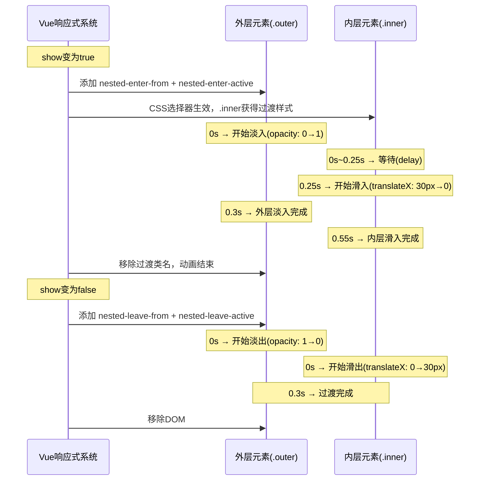

扫描[二维码](https://api2.cmdragon.cn/upload/cmder/20250304_012821924.jpg)关注或者微信搜一搜：`编程智域 前端至全栈交流与成长`

[发现1000+提升效率与开发的AI工具和实用程序](https://tools.cmdragon.cn/zh/apps?category=ai_chat)：https://tools.cmdragon.cn/zh/apps?category=ai_chat

## 一、嵌套元素的过渡——子元素也想动怎么办

上一篇咱们聊了Transition组件的6个CSS类名和基本用法，但你有没有想过一个问题：如果你的Transition里面包了一个div，这个div里面又套了一个div，那里面那个div能不能也有动画效果？

答案是：能，但不是自动的，得你自己写CSS。

### Transition只管直接子元素

先说一个关键点：`<Transition>`组件添加的那些过渡类名（`v-enter-from`、`v-enter-active`之类的），只会加在它的**直接子元素**上。嵌套在里面的子元素，Vue不会自动给它们加类名。

打个比方，Transition就像一个快递员，他只负责把包裹送到你家门口（直接子元素），至于包裹里面还有没有小盒子（嵌套子元素），他不管。小盒子要拆开，得你自己来。

### 用CSS选择器让子元素也动起来

虽然Vue不会自动给嵌套子元素加类名，但我们可以利用CSS的**后代选择器**来实现。原理很简单：当父元素被加上了`v-enter-active`之类的类名时，我们用`.v-enter-active .inner`这样的选择器，让子元素也跟着有过渡效果。

来看一个完整的例子，外层div淡入，内层div滑入：

```vue
<template>
  <!-- Transition包裹外层容器 -->
  <Transition name="nested">
    <!-- v-if控制整个区块的显示隐藏 -->
    <div v-if="show" class="outer">
      <!-- 内层嵌套元素，也会有自己的动画 -->
      <div class="inner">我是内层元素，我会滑进来</div>
    </div>
  </Transition>
  <!-- 按钮切换显示状态 -->
  <button @click="show = !show">切换</button>
</template>

<script setup>
import { ref } from "vue";

// 控制元素是否显示
const show = ref(false);
</script>

<style>
/* 外层元素的进入和离开过渡 */
.nested-enter-active,
.nested-leave-active {
  transition: all 0.3s ease-in-out;
}

/* 外层元素的进入起始状态和离开结束状态 */
.nested-enter-from,
.nested-leave-to {
  opacity: 0;
}

/* 内层元素的过渡效果——用后代选择器选中 */
.nested-enter-active .inner,
.nested-leave-active .inner {
  transition: all 0.3s ease-in-out;
}

/* 内层元素的进入起始状态：向右偏移30px且透明 */
.nested-enter-from .inner,
.nested-leave-to .inner {
  transform: translateX(30px);
  opacity: 0;
}

/* 外层容器样式 */
.outer {
  background: #42b883;
  padding: 30px;
  border-radius: 8px;
  min-height: 100px;
}

/* 内层元素样式 */
.inner {
  background: #35495e;
  color: white;
  padding: 20px;
  border-radius: 4px;
}
</style>
```

看到没？关键就是`.nested-enter-active .inner`和`.nested-enter-from .inner`这两组选择器。当外层元素被加上`nested-enter-active`类名时，内层的`.inner`元素也会被CSS选中，从而拥有自己的过渡效果。

### 子元素过渡时长别超过父元素

这里有个很重要的原则：**子元素的过渡时长不应该超过父元素的过渡时长**。为啥呢？你想啊，父元素0.3秒就淡入完成了，子元素0.5秒才滑完——这时候父元素已经完全显示了，子元素还在那慢慢悠悠地滑，看着就很别扭，而且可能导致过渡结束时机判断出问题。

### 做个交错动画效果

嵌套过渡有个很好玩的用法：给子元素加一个`transition-delay`，让子元素的动画比父元素晚一点开始，形成一种"交错进入"的效果，视觉上特别有层次感：

```css
/* 进入时内层元素延迟0.25秒再开始动画 */
.nested-enter-active .inner {
  transition-delay: 0.25s;
}
```

就这么一行CSS，外层先淡入，0.25秒后内层再滑入，效果一下子就高级了。

### 嵌套过渡的时间关系

用流程图来看看嵌套过渡的时间线是怎么走的：



从这个时间线可以清楚地看到：外层先动，内层延迟后跟上。离开的时候两者同时开始。这就是嵌套过渡的基本节奏。

## 二、duration属性——手动告诉Vue动画多长

### Vue怎么知道动画啥时候结束？

默认情况下，Vue会自动检测元素的CSS `transition-duration`或`animation-duration`来判断过渡啥时候结束。它监听的是`transitionend`或`animationend`事件——哪个先触发就认哪个。

这就像你跟朋友说"等我一下"，然后朋友就盯着你看，等你动了他就知道你准备好了。Vue也是盯着DOM元素，等浏览器告诉它"动画播完了"，它就收工。

### 啥时候Vue会判断失误？

但有些情况下，Vue的自动检测会翻车：

1. **嵌套元素的过渡**：就像上面说的，外层元素0.3秒就播完了，Vue监听到外层的`transitionend`事件就以为"哦，结束了"，但其实内层元素0.55秒才播完。结果Vue提前收工，内层动画被截断。

2. **JavaScript动画**：如果你用GSAP、Anime.js这些库来做动画，Vue根本检测不到CSS的`transitionend`事件，因为压根就没有CSS过渡。

3. **复杂的CSS动画组合**：一个元素上同时有transition和animation，Vue可能搞混该听哪个。

### duration属性登场

这时候就需要`duration`属性出马了。它的作用很简单：**手动告诉Vue过渡要多久**，别自己瞎猜。

用法有两种：

**方式一：统一时长**

```vue
<template>
  <!-- 告诉Vue：整个过渡过程550毫秒 -->
  <Transition :duration="550">
    <div v-if="show" class="outer">
      <div class="inner">嵌套元素</div>
    </div>
  </Transition>
  <button @click="show = !show">切换</button>
</template>

<script setup>
import { ref } from "vue";

const show = ref(false);
</script>

<style>
.outer {
  background: #42b883;
  padding: 30px;
  border-radius: 8px;
}

.inner {
  background: #35495e;
  color: white;
  padding: 20px;
  border-radius: 4px;
  transition: all 0.3s ease-in-out;
}

/* 外层淡入淡出 */
.v-enter-active,
.v-leave-active {
  transition: opacity 0.3s ease;
}

.v-enter-from,
.v-leave-to {
  opacity: 0;
}

/* 内层滑入滑出，带0.25秒延迟 */
.v-enter-active .inner {
  transition: all 0.3s ease-in-out 0.25s;
  transform: translateX(30px);
  opacity: 0;
}

.v-enter-to .inner {
  transform: translateX(0);
  opacity: 1;
}

.v-leave-active .inner {
  transition: all 0.3s ease-in-out;
}

.v-leave-to .inner {
  transform: translateX(30px);
  opacity: 0;
}
</style>
```

这里`duration`设为550，因为内层元素有0.25秒延迟+0.3秒动画=0.55秒，所以总时长就是550毫秒。

**方式二：分别指定进入和离开时长**

```vue
<template>
  <!-- 进入500毫秒，离开800毫秒 -->
  <Transition :duration="{ enter: 500, leave: 800 }">
    <div v-if="show" class="box">我有明确的时长</div>
  </Transition>
  <button @click="show = !show">切换</button>
</template>

<script setup>
import { ref } from "vue";

const show = ref(false);
</script>

<style>
.box {
  background: #42b883;
  color: white;
  padding: 30px;
  border-radius: 8px;
}

.v-enter-active {
  transition: all 0.5s ease;
}

.v-leave-active {
  transition: all 0.8s ease;
}

.v-enter-from,
.v-leave-to {
  opacity: 0;
  transform: translateY(20px);
}
</style>
```

对象形式的`duration`让你可以分别控制进入和离开的时长，更灵活。

### duration的值怎么算？

算duration其实不难，记住这个公式就行：

> **总时长 = 最大延迟 + 最大动画时长**

比如内层元素`transition-delay: 0.25s`，`transition-duration: 0.3s`，那总时长就是`250 + 300 = 550`毫秒。把所有嵌套元素的时长都算一遍，取最大的那个，就是duration该设的值。

## 三、appear——首次渲染也要动画

### 默认行为：首次渲染没动画

你有没有注意过这个现象：页面刚加载的时候，Transition里面的元素直接就出现了，没有任何动画。但之后你切换显示/隐藏，动画就正常了。

这是因为Transition默认只在元素的**插入**和**移除**时触发过渡动画。"首次渲染"虽然也是元素插入DOM的过程，但Vue默认不把它当作一次"过渡"来处理。

打个比方，就像你新搬进一个房子，家具直接就摆好了（首次渲染），不会有搬家具的过程动画。但之后你把家具搬出去再搬回来，就有动画了。

### appear属性：让首次渲染也有动画

如果你希望元素首次渲染时也播一个进入动画，加上`appear`属性就行：

```vue
<template>
  <!-- 加上appear，首次渲染也会触发进入动画 -->
  <Transition appear>
    <div class="box">我首次出现也会有动画哦</div>
  </Transition>
</template>

<style>
.v-enter-active,
.v-leave-active {
  transition: opacity 0.5s ease;
}

.v-enter-from,
.v-leave-to {
  opacity: 0;
}

.box {
  background: #42b883;
  color: white;
  padding: 30px;
  border-radius: 8px;
}
</style>
```

就这么简单，加一个`appear`，首次渲染时元素就会从透明(opacity: 0)淡入到完全显示(opacity: 1)。

### appear的类名体系

appear有自己的一套类名，结构和enter一模一样：

| 类名              | 作用                 |
| ----------------- | -------------------- |
| `v-appear-from`   | 出现动画的起始状态   |
| `v-appear-active` | 出现动画的进行中状态 |
| `v-appear-to`     | 出现动画的结束状态   |

如果你用了命名过渡（比如`name="fade"`），那类名就变成`fade-appear-from`、`fade-appear-active`、`fade-appear-to`。

如果你没单独写appear的类名，Vue会**回退使用enter的类名**。也就是说，`v-appear-from`没写就用`v-enter-from`，`v-appear-active`没写就用`v-enter-active`，以此类推。所以大多数情况下，你加个`appear`属性就够了，不用额外写CSS。

### appear的自定义类名

和enter/leave一样，appear也支持自定义类名：

- `appear-from-class`：自定义出现起始状态的类名
- `appear-active-class`：自定义出现进行中状态的类名
- `appear-to-class`：自定义出现结束状态的类名

来看一个完整示例，appear动画和enter动画用不同的效果：

```vue
<template>
  <!-- appear让首次渲染也有动画，自定义appear的类名 -->
  <Transition
    appear
    appear-from-class="custom-appear-from"
    appear-active-class="custom-appear-active"
    appear-to-class="custom-appear-to"
    name="slide"
  >
    <div v-if="show" class="box">
      我首次出现会从下方弹上来，之后切换会左右滑动
    </div>
  </Transition>
  <button @click="show = !show">切换</button>
</template>

<script setup>
import { ref } from "vue";

const show = ref(true);
</script>

<style>
.box {
  background: #42b883;
  color: white;
  padding: 30px;
  border-radius: 8px;
  margin-top: 20px;
}

/* 自定义appear动画：从下方弹上来 */
.custom-appear-from {
  opacity: 0;
  transform: translateY(50px);
}

.custom-appear-active {
  transition: all 0.6s cubic-bezier(0.34, 1.56, 0.64, 1);
}

.custom-appear-to {
  opacity: 1;
  transform: translateY(0);
}

/* 正常的enter/leave动画：左右滑动 */
.slide-enter-active {
  transition: all 0.3s ease-out;
}

.slide-leave-active {
  transition: all 0.5s cubic-bezier(1, 0.5, 0.8, 1);
}

.slide-enter-from,
.slide-leave-to {
  transform: translateX(20px);
  opacity: 0;
}
</style>
```

这个例子中，首次出现时元素从下方弹上来（有个弹性曲线），之后切换显示隐藏时则是左右滑动。两种不同的动画效果，各司其职。

## 四、key属性——不换元素也能触发过渡

### 正常情况下过渡怎么触发？

前面咱们说的过渡，都是靠`v-if`、`v-show`或者动态组件来触发的。核心逻辑是：元素从"不存在"变成"存在"（进入过渡），或者从"存在"变成"不存在"（离开过渡）。

但有时候你会遇到一种情况：**元素一直存在，只是内容变了，你也想加个过渡动画**。比如一个展示用户信息的卡片，切换不同用户时，卡片本身没变，只是里面的文字换了。这时候用`v-if`是不行的，因为元素一直都在。

### key属性触发过渡的原理

Vue的Transition组件支持通过改变`key`属性来触发过渡。原理是这样的：

当你给Transition里面的元素设置了`key`属性，Vue会根据`key`的值来判断这是不是"同一个元素"。如果`key`变了，Vue就认为旧元素"离开"了、新元素"进入"了，即使它们其实是同一种元素。

这就像换身份证——虽然人还是那个人，但身份证号变了，系统就认为是"新的人"了。key就是元素的"身份证号"。

来看个例子：

```vue
<template>
  <div>
    <!-- 按钮组：切换不同的用户 -->
    <button
      v-for="user in users"
      :key="user.id"
      @click="currentId = user.id"
      :class="{ active: currentId === user.id }"
    >
      {{ user.name }}
    </button>

    <!-- 用key触发过渡：currentId变了，过渡就触发 -->
    <Transition name="fade" mode="out-in">
      <!-- key绑定currentId，值变了就触发过渡 -->
      <div :key="currentId" class="user-card">
        <h3>{{ currentUser.name }}</h3>
        <p>{{ currentUser.email }}</p>
        <p>{{ currentUser.role }}</p>
      </div>
    </Transition>
  </div>
</template>

<script setup>
import { ref, computed } from "vue";

// 用户列表数据
const users = [
  { id: 1, name: "张三", email: "zhangsan@example.com", role: "前端开发" },
  { id: 2, name: "李四", email: "lisi@example.com", role: "后端开发" },
  { id: 3, name: "王五", email: "wangwu@example.com", role: "UI设计" },
];

// 当前选中的用户ID
const currentId = ref(1);

// 计算属性：根据ID找到当前用户
const currentUser = computed(() => {
  return users.find((user) => user.id === currentId.value) || users[0];
});
</script>

<style>
/* 按钮样式 */
button {
  margin-right: 10px;
  padding: 8px 16px;
  border: 2px solid #42b883;
  border-radius: 4px;
  background: white;
  cursor: pointer;
  transition: all 0.2s;
}

button.active {
  background: #42b883;
  color: white;
}

button:hover {
  opacity: 0.8;
}

/* 用户卡片样式 */
.user-card {
  margin-top: 20px;
  padding: 20px;
  background: #f5f5f5;
  border-radius: 8px;
  border-left: 4px solid #42b883;
}

/* 淡入淡出过渡 */
.fade-enter-active,
.fade-leave-active {
  transition: opacity 0.3s ease;
}

.fade-enter-from,
.fade-leave-to {
  opacity: 0;
}
</style>
```

注意这里用了`mode="out-in"`，意思是旧元素先离开，新元素再进入。如果不用mode，两个元素会同时存在，可能会出现布局跳动的问题。

### key触发的典型场景

key触发过渡特别适合这些场景：

1. **同组件不同数据切换**：就像上面的用户卡片，组件结构不变，只是数据变了
2. **路由视图过渡**：不同路由对应同一个组件，但参数不同
3. **步骤指示器**：当前步骤变了，显示区域需要过渡
4. **图片轮播**：同一位置切换不同图片

### key触发机制流程图

用流程图来看看key触发过渡的完整过程：

```mermaid
flowchart TD
    A[用户操作：切换用户] --> B[currentId的值发生变化]
    B --> C{Vue检测到key值变了}
    C --> D[Vue认为旧key元素要"离开"]
    C --> E[Vue认为新key元素要"进入"]
    D --> F[添加 leave-from + leave-active 类名]
    E --> G[等待旧元素离开完成]
    F --> H[触发transitionend事件]
    H --> G
    G --> I[添加 enter-from + enter-active 类名]
    I --> J[新元素开始进入动画]
    J --> K[触发transitionend事件]
    K --> L[移除过渡类名，过渡完成]

    style A fill:#42b883,color:#fff
    style C fill:#35495e,color:#fff
    style L fill:#42b883,color:#fff
```

从这个流程图可以看出，key变了之后，Vue的处理流程和`v-if`切换是一模一样的。只不过触发条件从"元素是否存在"变成了"key值是否改变"。

### key和v-if的区别

| 对比项           | v-if                           | key                               |
| ---------------- | ------------------------------ | --------------------------------- |
| 触发条件         | 条件为true/false               | key值发生变化                     |
| 元素是否销毁重建 | 是，条件为false时元素从DOM移除 | 是，key变了旧元素移除、新元素创建 |
| 适用场景         | 元素确实需要显示/隐藏          | 元素一直存在但内容需要切换        |
| 是否需要mode     | 多元素时需要                   | 通常配合out-in使用                |

说白了，key触发过渡的本质就是：**让Vue误以为换了一个新元素**，从而触发完整的进入/离开过渡流程。这招在组件内容切换时特别好用。

---

## 课后 Quiz

### 问题一

你在用Transition包裹一个嵌套结构，外层div淡入0.3秒，内层div有0.25秒延迟+0.3秒动画。如果不设duration属性，会发生什么？

**答案解析**：

Vue默认监听的是**根元素**（也就是外层div）的`transitionend`事件。外层div的过渡0.3秒就结束了，Vue听到`transitionend`就认为整个过渡完成了，于是移除过渡类名。但此时内层div的动画才刚开始0.05秒（0.3 - 0.25 = 0.05），还没播完就被强制中断了。

解决办法就是加上`:duration="550"`（250 + 300 = 550毫秒），手动告诉Vue等够550毫秒再收工。这样内层动画就能完整播放了。

### 问题二

appear属性和v-if的enter过渡有什么区别？如果我只加了appear但没写appear相关的CSS类名，会怎样？

**答案解析**：

两者的触发时机不同：

- `appear`是在**组件首次渲染**时触发，只触发一次
- `enter`是在元素每次**从DOM插入**时触发，可以触发多次

如果你加了`appear`但没写`v-appear-from`、`v-appear-active`、`v-appear-to`这些CSS类名，Vue会**回退使用enter的类名**。也就是说，`v-appear-from`没找到就用`v-enter-from`，`v-appear-active`没找到就用`v-enter-active`，以此类推。

所以大多数情况下，你只需要加个`appear`属性，不用额外写CSS，首次渲染的动画效果和后续的enter动画效果是一样的。只有当你需要首次出现和后续进入用不同动画时，才需要单独写appear的类名。

### 问题三

下面的代码中，切换按钮时会有过渡动画吗？为什么？

```vue
<Transition name="fade">
  <div :class="{ active: isActive }">内容</div>
</Transition>
```

**答案解析**：

**不会有过渡动画**。因为Transition组件触发过渡的条件是：元素被插入DOM或从DOM移除。这里`div`一直存在于DOM中，只是`class`在变化。`class`的变化不会触发Transition的过渡流程。

要让这个场景有过渡效果，有两种方式：

1. **用key属性**：给div加`:key="isActive"`，当`isActive`变化时key也变了，Transition就会触发过渡
2. **用v-if/v-show**：把条件渲染改成`v-if="isActive"`或`v-show="isActive"`

方式一适合元素内容也需要跟着变的场景，方式二适合元素确实需要显示/隐藏的场景。

---

## 常见报错解决方案

### 报错一：嵌套过渡动画被截断，内层元素动画没播完就停了

**产生原因**：

Vue默认监听根元素的`transitionend`事件来判断过渡结束。嵌套元素的动画时长如果超过根元素，根元素先播完，Vue就提前移除了过渡类名，导致内层动画被截断。

**解决方案**：

使用`duration`属性手动指定过渡总时长。计算方式是所有嵌套元素中最大的"延迟+动画时长"：

```vue
<!-- 内层有0.25s延迟 + 0.3s动画 = 0.55s -->
<Transition :duration="550">
  <div v-if="show" class="outer">
    <div class="inner">内容</div>
  </div>
</Transition>
```

**预防建议**：

写嵌套过渡时，养成习惯先算好总时长再设duration。也可以把内层动画时长控制在和外层一样，或者比外层更短，这样就不需要额外设duration了。

### 报错二：加了appear但首次渲染没有动画

**产生原因**：

最常见的原因是CSS类名写错了。比如你用了命名过渡`<Transition name="slide" appear>`，但CSS里写的是`v-appear-from`而不是`slide-appear-from`。命名过渡的appear类名前缀要和name一致。

**解决方案**：

检查CSS类名前缀是否和Transition的name属性匹配：

```vue
<!-- 命名过渡 -->
<Transition name="slide" appear>
  <div>内容</div>
</Transition>
```

```css
/* 正确：前缀是slide */
.slide-appear-from {
  opacity: 0;
}
.slide-appear-active {
  transition: opacity 0.5s ease;
}
.slide-appear-to {
  opacity: 1;
}

/* 错误：前缀是v，和name不匹配 */
/* .v-appear-from { ... } */
```

**预防建议**：

如果appear和enter用同样的动画效果，可以不写appear的类名，Vue会自动回退使用enter的类名。这样既省代码又不容易写错。

### 报错三：key触发过渡时两个元素同时出现，布局跳动

**产生原因**：

Transition默认行为是：旧元素离开和新元素进入**同时进行**。当key变化时，旧元素还没完全消失，新元素就已经插入了，两个元素同时占据空间，导致布局跳动。

**解决方案**：

加上`mode`属性，指定过渡模式。最常用的是`mode="out-in"`，让旧元素先离开，新元素再进入：

```vue
<Transition name="fade" mode="out-in">
  <div :key="currentId">内容</div>
</Transition>
```

另一种模式是`mode="in-out"`，新元素先进入，旧元素再离开。不过这种模式用得比较少，因为两个元素会短暂重叠。

**预防建议**：

凡是使用key触发过渡的场景，基本都应该加`mode="out-in"`。除非你有特殊的视觉需求（比如两个元素重叠的交叉淡入淡出效果），否则out-in是最稳妥的选择。

---

参考链接：https://vuejs.org/guide/built-ins/transition.html

余下文章内容请点击跳转至 个人博客页面 或者 扫描[二维码](https://api2.cmdragon.cn/upload/cmder/20250304_012821924.jpg)关注或者微信搜一搜：`编程智域 前端至全栈交流与成长`，阅读完整的文章：[嵌套元素、首次出现、key触发——Transition那些容易被忽略的细节](https://blog.cmdragon.cn/posts/e1f2a3b4c5d6e7f8a9b0c1d2e3f4a5b6/)

<details>
<summary>往期文章归档</summary>

- [Vue 3 静态与动态 Props 如何传递？TypeScript 类型约束有何必要？](https://blog.cmdragon.cn/posts/94ab48753b64780ca3ab7a7115ae8522/)
- [Vue 3中组件局部注册的优势与实现方式如何？](https://blog.cmdragon.cn/posts/dbf576e744870f6de26fd8a2e03e47da/)
- [如何在Vue3中优化生命周期钩子性能并规避常见陷阱？](https://blog.cmdragon.cn/posts/12d98b3b9ccd6c19a1b169d720ac5c80/)
- [Vue 3 Composition API生命周期钩子：如何实现从基础理解到高阶复用？](https://blog.cmdragon.cn/posts/8884e2b70287fcb263c57648eeb27419/)
- [Vue 3生命周期钩子实战指南：如何正确选择onMounted、onUpdated与onUnmounted的应用场景？](https://blog.cmdragon.cn/posts/883c6dbc50ae4183770a4462e0b8ae4d/)
- [Vue 3中生命周期钩子与响应式系统如何实现协同工作？](https://blog.cmdragon.cn/posts/70dad360ffa9dce14d0d69611b8cb019/)
- [Vue 3组件生命周期钩子的执行顺序与使用场景是什么？](https://blog.cmdragon.cn/posts/db44294a78dc9f666f67b053f6c83567/)
- [Vue组件全局注册与局部注册如何抉择？](https://blog.cmdragon.cn/posts/43ead630ea17da65d99ad2eb8188e472/)
- [Vue3组件化开发中，Props与Emits如何实现数据流转与事件协作？](https://blog.cmdragon.cn/posts/8cff7d2df113da66ea7be560c4d1d22a/)
- [Vue 3模板引用如何与其他特性协同实现复杂交互？](https://blog.cmdragon.cn/posts/331bf75d114ab09116eadfcdca602b58/)
- [Vue 3 v-for中模板引用如何实现高效管理与动态控制？](https://blog.cmdragon.cn/posts/cb380897ddc3578b180ecf8843c774c1/)
- [Vue 3的defineExpose：如何突破script setup组件默认封装，实现精准的父子通讯？](https://blog.cmdragon.cn/posts/202ae0f4acde7128e0e31baf63732fb5/)
- [Vue 3模板引用的生命周期时机如何把握？常见陷阱该如何避免？](https://blog.cmdragon.cn/posts/7d2a0f6555ecbe92afd7d2491c427463/)
- [Vue 3模板引用如何实现父组件与子组件的高效交互？](https://blog.cmdragon.cn/posts/3fb7bdd84128b7efaaa1c979e1f28dee/)
- [Vue中为何需要模板引用？又如何高效实现DOM与组件实例的直接访问？](https://blog.cmdragon.cn/posts/23f3464ba16c7054b4783cded50c04c6/)

</details>

<details>
<summary>免费好用的热门在线工具</summary>

- [多直播聚合器 - 应用商店 | By cmdragon](https://tools.cmdragon.cn/zh/apps/multi-live-aggregator)
- [Proto文件生成器 - 应用商店 | By cmdragon](https://tools.cmdragon.cn/zh/apps/proto-file-generator)
- [图片转粒子 - 应用商店 | By cmdragon](https://tools.cmdragon.cn/zh/apps/image-to-particles)
- [视频下载器 - 应用商店 | By cmdragon](https://tools.cmdragon.cn/zh/apps/video-downloader)
- [文件格式转换器 - 应用商店 | By cmdragon](https://tools.cmdragon.cn/zh/apps/file-converter)
- [M3U8在线播放器 - 应用商店 | By cmdragon](https://tools.cmdragon.cn/zh/apps/m3u8-player)
- [快图设计 - 应用商店 | By cmdragon](https://tools.cmdragon.cn/zh/apps/quick-image-design)
- [高级文字转图片转换器 - 应用商店 | By cmdragon](https://tools.cmdragon.cn/zh/apps/text-to-image-advanced)
- [RAID 计算器 - 应用商店 | By cmdragon](https://tools.cmdragon.cn/zh/apps/raid-calculator)
- [在线PS - 应用商店 | By cmdragon](https://tools.cmdragon.cn/zh/apps/photoshop-online)
- [Mermaid 在线编辑器 - 应用商店 | By cmdragon](https://tools.cmdragon.cn/zh/apps/mermaid-live-editor)
- [数学求解计算器 - 应用商店 | By cmdragon](https://tools.cmdragon.cn/zh/apps/math-solver-calculator)
- [智能提词器 - 应用商店 | By cmdragon](https://tools.cmdragon.cn/zh/apps/smart-teleprompter)
- [魔法简历 - 应用商店 | By cmdragon](https://tools.cmdragon.cn/zh/apps/magic-resume)
- [Image Puzzle Tool - 图片拼图工具 | By cmdragon](https://tools.cmdragon.cn/zh/apps/image-puzzle-tool)
- [字幕下载工具 - 应用商店 | By cmdragon](https://tools.cmdragon.cn/zh/apps/subtitle-downloader)
- [歌词生成工具 - 应用商店 | By cmdragon](https://tools.cmdragon.cn/zh/apps/lyrics-generator)
- [网盘资源聚合搜索 - 应用商店 | By cmdragon](https://tools.cmdragon.cn/zh/apps/cloud-drive-search)
- [ASCII字符画生成器 - 应用商店 | By cmdragon](https://tools.cmdragon.cn/zh/apps/ascii-art-generator)
- [JSON Web Tokens 工具 - 应用商店 | By cmdragon](https://tools.cmdragon.cn/zh/apps/jwt-tool)
- [Bcrypt 密码工具 - 应用商店 | By cmdragon](https://tools.cmdragon.cn/zh/apps/bcrypt-tool)
- [GIF 合成器 - 应用商店 | By cmdragon](https://tools.cmdragon.cn/zh/apps/gif-composer)
- [GIF 分解器 - 应用商店 | By cmdragon](https://tools.cmdragon.cn/zh/apps/gif-decomposer)
- [文本隐写术 - 应用商店 | By cmdragon](https://tools.cmdragon.cn/zh/apps/text-steganography)
- [CMDragon 在线工具 - 高级AI工具箱与开发者套件 | 免费好用的在线工具](https://tools.cmdragon.cn/zh)
- [应用商店 - 发现1000+提升效率与开发的AI工具和实用程序 | 免费好用的在线工具](https://tools.cmdragon.cn/zh/apps?category=trending)
- [CMDragon 更新日志 - 最新更新、功能与改进 | 免费好用的在线工具](https://tools.cmdragon.cn/zh/changelog)
- [支持我们 - 成为赞助者 | 免费好用的在线工具](https://tools.cmdragon.cn/zh/sponsor)
- [AI文本生成图像 - 应用商店 | 免费好用的在线工具](https://tools.cmdragon.cn/zh/apps/text-to-image-ai)
- [临时邮箱 - 应用商店 | 免费好用的在线工具](https://tools.cmdragon.cn/zh/apps/temp-email)
- [二维码解析器 - 应用商店 | 免费好用的在线工具](https://tools.cmdragon.cn/zh/apps/qrcode-parser)
- [文本转思维导图 - 应用商店 | 免费好用的在线工具](https://tools.cmdragon.cn/zh/apps/text-to-mindmap)
- [正则表达式可视化工具 - 应用商店 | 免费好用的在线工具](https://tools.cmdragon.cn/zh/apps/regex-visualizer)
- [文件隐写工具 - 应用商店 | 免费好用的在线工具](https://tools.cmdragon.cn/zh/apps/steganography-tool)
- [IPTV 频道探索器 - 应用商店 | 免费好用的在线工具](https://tools.cmdragon.cn/zh/apps/iptv-explorer)
- [快传 - 应用商店 | By cmdragon](https://tools.cmdragon.cn/zh/apps/snapdrop)
- [随机抽奖工具 - 应用商店 | 免费好用的在线工具](https://tools.cmdragon.cn/zh/apps/lucky-draw)
- [动漫场景查找器 - 应用商店 | 免费好用的在线工具](https://tools.cmdragon.cn/zh/apps/anime-scene-finder)
- [时间工具箱 - 应用商店 | 免费好用的在线工具](https://tools.cmdragon.cn/zh/apps/time-toolkit)
- [网速测试 - 应用商店 | 免费好用的在线工具](https://tools.cmdragon.cn/zh/apps/speed-test)
- [AI 智能抠图工具 - 应用商店 | 免费好用的在线工具](https://tools.cmdragon.cn/zh/apps/background-remover)
- [背景替换工具 - 应用商店 | 免费好用的在线工具](https://tools.cmdragon.cn/zh/apps/background-replacer)
- [艺术二维码生成器 - 应用商店 | 免费好用的在线工具](https://tools.cmdragon.cn/zh/apps/artistic-qrcode)
- [Open Graph 元标签生成器 - 应用商店 | 免费好用的在线工具](https://tools.cmdragon.cn/zh/apps/open-graph-generator)
- [图像对比工具 - 应用商店 | 免费好用的在线工具](https://tools.cmdragon.cn/zh/apps/image-comparison)
- [图片压缩专业版 - 应用商店 | 免费好用的在线工具](https://tools.cmdragon.cn/zh/apps/image-compressor)
- [密码生成器 - 应用商店 | 免费好用的在线工具](https://tools.cmdragon.cn/zh/apps/password-generator)
- [SVG优化器 - 应用商店 | 免费好用的在线工具](https://tools.cmdragon.cn/zh/apps/svg-optimizer)
- [调色板生成器 - 应用商店 | 免费好用的在线工具](https://tools.cmdragon.cn/zh/apps/color-palette)
- [在线节拍器 - 应用商店 | 免费好用的在线工具](https://tools.cmdragon.cn/zh/apps/online-metronome)
- [IP归属地查询 - 应用商店 | By cmdragon](https://tools.cmdragon.cn/zh/apps/ip-geolocation)
- [CSS网格布局生成器 - 应用商店 | 免费好用的在线工具](https://tools.cmdragon.cn/zh/apps/css-grid-layout)
- [邮箱验证工具 - 应用商店 | 免费好用的在线工具](https://tools.cmdragon.cn/zh/apps/email-validator)
- [书法练习字帖 - 应用商店 | 免费好用的在线工具](https://tools.cmdragon.cn/zh/apps/calligraphy-practice)
- [金融计算器套件 - 应用商店 | 免费好用的在线工具](https://tools.cmdragon.cn/zh/apps/finance-calculator-suite)
- [中国亲戚关系计算器 - 应用商店 | 免费好用的在线工具](https://tools.cmdragon.cn/zh/apps/chinese-kinship-calculator)
- [Protocol Buffer 工具箱 - 应用商店 | 免费好用的在线工具](https://tools.cmdragon.cn/zh/apps/protobuf-toolkit)
- [IP归属地查询 - 应用商店 | 免费好用的在线工具](https://tools.cmdragon.cn/zh/apps/ip-geolocation)
- [图片无损放大 - 应用商店 | 免费好用的在线工具](https://tools.cmdragon.cn/zh/apps/image-upscaler)
- [文本比较工具 - 应用商店 | 免费好用的在线工具](https://tools.cmdragon.cn/zh/apps/text-compare)
- [IP批量查询工具 - 应用商店 | 免费好用的在线工具](https://tools.cmdragon.cn/zh/apps/ip-batch-lookup)
- [域名查询工具 - 应用商店 | 免费好用的在线工具](https://tools.cmdragon.cn/zh/apps/domain-finder)
- [DNS工具箱 - 应用商店 | 免费好用的在线工具](https://tools.cmdragon.cn/zh/apps/dns-toolkit)
- [网站图标生成器 - 应用商店 | 免费好用的在线工具](https://tools.cmdragon.cn/zh/apps/favicon-generator)
- [XML Sitemap](https://tools.cmdragon.cn/sitemap_index.xml)

</details>
