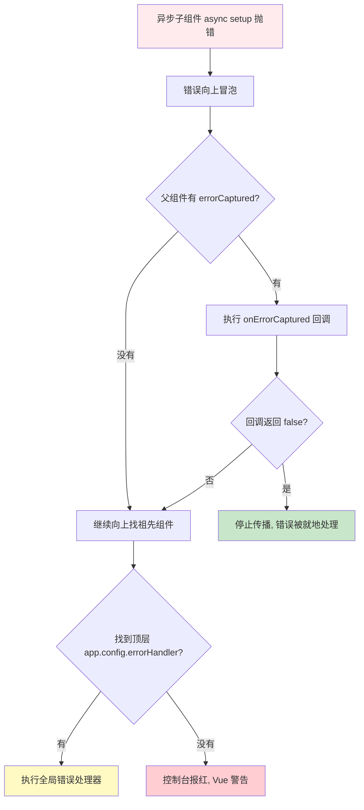
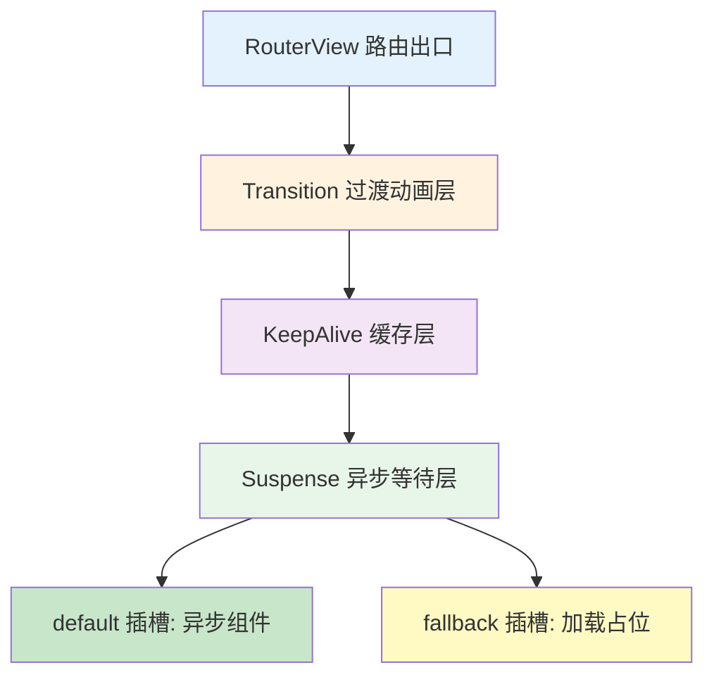

扫描[二维码](https://api2.cmdragon.cn/upload/cmder/20250304_012821924.jpg)关注或者微信搜一搜：`编程智域 前端至全栈交流与成长`

[发现1000+提升效率与开发的AI工具和实用程序](https://tools.cmdragon.cn/zh/apps?category=ai_chat)：https://tools.cmdragon.cn/zh/apps?category=ai_chat

## 一、Suspense自己不管错误？那咋办

咱先把话撂这儿：Vue 3 的 `Suspense` 这哥们儿，目前就是个"只会等"的保安，它能在异步组件加载、`async setup()` 没解析完之前帮你顶住场子，显示个 `#fallback` 兜底内容。但要是异步过程中真出了错——比如接口 500、组件加载失败、`setup()` 里 `throw` 了——它自个儿是**不会**帮你处理错误的，顶多把错误往上传，传到没人接，那就直接报红屏。

打个比方，Suspense 像小区门口那个保安大爷，他只负责"等快递到了再放你进去"，可要是快递半路被偷了（异步出错），他不会去抓小偷，只会冲着楼上喊一嗓子"出事啦"。真正去抓小偷的，得是警察——也就是 `errorCaptured` 这个钩子。

所以官方文档里也明说了：Suspense 自身**目前**还不提供错误处理，你得在外层用 `errorCaptured` 选项（选项式 API）或者 `onErrorCaptured()` 钩子（组合式 API）来捕获这些异步错误。注意这个"目前"俩字，意思是以后可能会加，但当下你得自己来。

那具体咋写呢？咱看个最小可运行的例子。先来个会出错的异步子组件：

```vue
<!-- AsyncUser.vue：模拟一个会抛错的异步组件 -->
<script setup>
// 引入 ref 用来存用户数据
import { ref } from 'vue'

// async setup() 是 Suspense 能识别的异步依赖
// 这里模拟一个接口请求，故意让它有 50% 概率失败
const user = ref(null)

// 模拟请求：返回一个 Promise，随机 resolve 或 reject
await new Promise((resolve, reject) => {
  setTimeout(() => {
    // 用 Math.random 模拟 50% 的失败率
    if (Math.random() > 0.5) {
      user.value = { name: 'cmdragon', age: 3 }
      resolve()
    } else {
      // 接口失败，抛个错出去
      reject(new Error('用户接口挂了，状态码 500'))
    }
  }, 800)
})
</script>

<template>
  <!-- 正常展示用户信息 -->
  <div class="user-card">
    <h3>用户信息</h3>
    <p>姓名：{{ user.name }}</p>
    <p>年龄：{{ user.age }}</p>
  </div>
</template>
```

然后是父组件，这里用 `Suspense` 包着它，再用 `onErrorCaptured` 接错误：

```vue
<!-- Parent.vue：父组件，负责用 Suspense 包裹 + 捕获错误 -->
<script setup>
import { ref, onErrorCaptured } from 'vue'
// 异步引入子组件，defineAsyncComponent 让它变成异步组件
import { defineAsyncComponent } from 'vue'

// 异步加载子组件
const AsyncUser = defineAsyncComponent(() => import('./AsyncUser.vue'))

// 用 ref 存错误信息和是否出错的状态
const errorMsg = ref('')
const hasError = ref(false)

// onErrorCaptured 是组合式 API 的错误捕获钩子
// 它能捕获后代组件抛出的所有错误，包括 async setup 里的
onErrorCaptured((err, instance, info) => {
  // err 就是捕获到的错误对象
  errorMsg.value = err.message
  hasError.value = true
  // 返回 false 阻止错误继续向上传播到 app.config.errorHandler
  return false
})
</script>

<template>
  <div class="parent">
    <!-- 出错了就显示错误提示，不出错才显示 Suspense -->
    <div v-if="hasError" class="error-box">
      <p>哎呀，出错了：{{ errorMsg }}</p>
    </div>

    <!-- Suspense 包裹异步组件 -->
    <Suspense v-else>
      <template #default>
        <AsyncUser />
      </template>
      <template #fallback>
        <p>加载中，稍等会儿...</p>
      </template>
    </Suspense>
  </div>
</template>

<style scoped>
.error-box {
  color: #fff;
  background: #e74c3c;
  padding: 12px;
  border-radius: 6px;
}
</style>
```

你看，关键就三步：子组件 `async setup()` 里 `throw`/`reject` → 父组件用 `Suspense` 包着 → 父组件里 `onErrorCaptured` 把错误接住。少了哪一环都不行。

这里有个坑得提一嘴：`onErrorCaptured` 必须写在**使用 Suspense 的那个父组件**里（或者更上层的祖先组件），写在 Suspense 内部的 default 插槽组件里是接不到的，因为错误是从那个组件里抛出来的，它自己捕不到自己。

## 二、errorCaptured和onErrorCaptured怎么用

上一节咱已经用了 `onErrorCaptured`，这节把它掰开揉碎讲讲。它对应的选项式 API 写法是 `errorCaptured` 钩子，组合式 API 就是 `onErrorCaptured()`，哥俩干的是同一件事。

### 2.1 三个参数都代表啥

这个钩子的回调签名长这样：

```js
onErrorCaptured((err, instance, info) => {
  // ...
})
```

三个参数一个都不能少认识：

- **`err`**：捕获到的错误对象，就是 `throw` 出去那个东西，通常是 `Error` 实例，也能是任意值。
- **`instance`**：触发错误的组件实例。注意是"触发错误"的那个组件，不是捕获错误的组件。比如上面例子，`instance` 就是 `AsyncUser` 的实例，不是 `Parent` 的。
- **`info`**：一个字符串，描述错误来源。比如 `'setup function'`、`'render function'`、`'before mount'` 之类的，帮你定位错误发生在哪个生命周期阶段。

### 2.2 返回值能控制传播

这个钩子的返回值有讲究：

- 返回 `false`：阻止错误继续往上冒，祖先组件的 `errorCaptured` 和全局 `app.config.errorHandler` 都不会再收到。
- 返回别的（或者不返回）：错误会继续往上传播，直到被某个钩子返回 `false` 拦住，或者一路传到全局处理器。

这个机制特别像 DOM 事件的 `stopPropagation`，你想"就地正法"就返回 `false`，想让上层也知道就别返回。

### 2.3 完整示例：错误捕获 + 错误 UI + 重试

光显示个错误信息不够爽，咱加个"重试"按钮，点一下重新加载：

```vue
<!-- ParentRetry.vue：带重试机制的错误处理 -->
<script setup>
import { ref, onErrorCaptured, shallowRef } from 'vue'
import { defineAsyncComponent } from 'vue'

// 用 shallowRef 存异步组件的引用，方便重试时重新赋值
// 用一个 key 来强制 Suspense 重新创建子组件
const reloadKey = ref(0)

// 动态加载子组件的函数，方便重试时调用
function loadAsyncUser() {
  return defineAsyncComponent(() => import('./AsyncUser.vue'))
}

// 当前要渲染的异步组件
const AsyncUser = shallowRef(loadAsyncUser())

const errorMsg = ref('')
const hasError = ref(false)

// 捕获错误
onErrorCaptured((err, instance, info) => {
  errorMsg.value = `错误信息：${err.message} | 来源：${info}`
  hasError.value = true
  // 返回 false 阻止继续传播
  return false
})

// 重试：重置状态 + 换个 key 让 Suspense 重新挂载子组件
function handleRetry() {
  hasError.value = false
  errorMsg.value = ''
  reloadKey.value++
  // 重新创建一份异步组件引用
  AsyncUser.value = loadAsyncUser()
}
</script>

<template>
  <div class="parent">
    <!-- 出错时显示错误框 + 重试按钮 -->
    <div v-if="hasError" class="error-box">
      <p>{{ errorMsg }}</p>
      <button @click="handleRetry">点我重试</button>
    </div>

    <!-- 正常情况：Suspense 包裹，用 :key 强制重建 -->
    <Suspense v-else :key="reloadKey">
      <template #default>
        <component :is="AsyncUser" />
      </template>
      <template #fallback>
        <div class="loading">加载中，转圈圈...</div>
      </template>
    </Suspense>
  </div>
</template>

<style scoped>
.error-box {
  background: #fff3f3;
  border: 1px solid #e74c3c;
  padding: 16px;
  border-radius: 8px;
}
.error-box button {
  margin-top: 8px;
  padding: 6px 16px;
  background: #e74c3c;
  color: #fff;
  border: none;
  border-radius: 4px;
  cursor: pointer;
}
.loading {
  color: #888;
  padding: 20px;
}
</style>
```

这里有个小技巧：重试的时候不能光改 `hasError`，因为 Suspense 内部的异步组件实例还在那挂着，错误状态没清掉。所以用 `:key="reloadKey"` 强制 Suspense 把内部组件销毁重建，配合重新赋值 `AsyncUser`，才能真重新走一遍异步流程。

### 2.4 错误捕获和传播流程图

光看代码可能有点绕，画个流程图把错误从抛出到被捕获的整个过程理清楚：



这张图你记住一个核心：错误是**自下而上**传播的，每一层的 `errorCaptured` 都有机会拦截，返回 `false` 就拦住，不返回就放行。这跟 JS 原生的 `try/catch` 思路是一致的，只不过作用域变成了组件树。

## 三、Suspense和Transition、KeepAlive一起用

实际项目里，Suspense 很少单打独斗，它一般会和 `Transition`（过渡动画）、`KeepAlive`（组件缓存）凑一块儿用。但这仨兄弟的**嵌套顺序**特别讲究，写反了要么动画不触发，要么缓存失效，要么 Suspense 干脆不工作。

### 3.1 正确的嵌套顺序

官方推荐（也是社区验证过最稳的）顺序，从外到内是：

```
RouterView → Transition → KeepAlive → Suspense → 你的组件
```

为啥是这个顺序？咱一个个说：

- **Transition 最外**：它要管的是"组件切换"的进出动画，得把整个 KeepAlive + Suspense + 组件都包进去，才能在路由切换时看到淡入淡出。
- **KeepAlive 中间**：它缓存的是"已经渲染好"的组件实例，必须在 Suspense 外面。要是放 Suspense 里面，Suspense 一显示 fallback，KeepAlive 缓存的内容就被顶掉了。
- **Suspense 最内**：它直接包裹异步组件，负责等异步解析完。放最内层是因为它要"贴身"伺候异步组件，外面套太多层反而会干扰它的 fallback 机制。

### 3.2 完整嵌套示例

来个完整能跑的例子，把仨兄弟凑齐：

```vue
<!-- AppLayout.vue：Transition + KeepAlive + Suspense 三件套 -->
<script setup>
import { ref, defineAsyncComponent } from 'vue'

// 假装这是两个异步的页面组件
const AsyncHome = defineAsyncComponent(() => import('./pages/Home.vue'))
const AsyncAbout = defineAsyncComponent(() => import('./pages/About.vue'))

// 当前要显示的组件，用 ref 切换
const current = ref(AsyncHome)

// 切换组件的方法
function switchTo(name) {
  current.value = name === 'home' ? AsyncHome : AsyncAbout
}
</script>

<template>
  <div class="layout">
    <nav>
      <button @click="switchTo('home')">首页</button>
      <button @click="switchTo('about')">关于</button>
    </nav>

    <!-- 注意这个嵌套顺序：Transition > KeepAlive > Suspense > component -->
    <Transition name="fade" mode="out-in">
      <KeepAlive>
        <Suspense>
          <template #default>
            <!-- 用 is 动态渲染当前组件 -->
            <component :is="current" />
          </template>
          <template #fallback>
            <div class="loading">页面加载中...</div>
          </template>
        </Suspense>
      </KeepAlive>
    </Transition>
  </div>
</template>

<style scoped>
/* fade 过渡的 CSS */
.fade-enter-active,
.fade-leave-active {
  transition: opacity 0.3s ease;
}
.fade-enter-from,
.fade-leave-to {
  opacity: 0;
}
.loading {
  padding: 40px;
  text-align: center;
  color: #888;
}
</style>
```

这里有个细节：`Transition` 加了 `mode="out-in"`，意思是"先让旧的离开，再让新的进来"。不加这个的话，新旧组件会同时存在一小会儿，异步组件还没加载完，旧组件已经走了，画面会闪一下。

### 3.3 嵌套层级流程图

再用一张图把层级关系画清楚，省得记混：



记住一句话：**从外到内，先动画、再缓存、最后异步**。这顺序背下来，基本不会错。

## 四、和Vue Router的RouterView配合

上一节用的是手动的 `component :is`，实际项目里咱更多的是配合 Vue Router 的 `RouterView`。RouterView 提供了个 `v-slot`，能拿到当前要渲染的组件，配合 Transition + KeepAlive + Suspense 一起用，是中后台项目最经典的写法。

### 4.1 RouterView 的 v-slot 用法

RouterView 的 `v-slot` 会给你一个对象，里面有 `Component`（当前路由组件）和 `route`（当前路由对象）。咱用 `v-if="Component"` 判断一下，避免路由还没匹配上时渲染出 `undefined`。

完整模板长这样：

```vue
<!-- App.vue：Vue Router + Transition + KeepAlive + Suspense 标准组合 -->
<script setup>
// 引入 RouterView，不用引 RouterLink 因为它全局注册了
import { RouterView } from 'vue-router'
</script>

<template>
  <div class="app">
    <!-- 顶部导航，RouterLink 全局可用 -->
    <nav class="nav">
      <RouterLink to="/">首页</RouterLink>
      <RouterLink to="/user">用户</RouterLink>
      <RouterLink to="/settings">设置</RouterLink>
    </nav>

    <!-- RouterView 用 v-slot 拿到当前组件 -->
    <RouterView v-slot="{ Component }">
      <!-- Transition 包在最外层，mode 用 out-in 避免闪烁 -->
      <Transition name="page" mode="out-in">
        <!-- KeepAlive 包中间，可以加 include/exclude 控制缓存范围 -->
        <KeepAlive :include="['Home', 'UserList']">
          <!-- Suspense 包最内层，处理异步组件 -->
          <Suspense>
            <template #default>
              <!-- v-if 判断 Component 是否存在，避免渲染 undefined -->
              <component :is="Component" v-if="Component" />
            </template>
            <template #fallback>
              <div class="page-loading">
                <span class="spinner"></span>
                页面加载中，请稍候...
              </div>
            </template>
          </Suspense>
        </KeepAlive>
      </Transition>
    </RouterView>
  </div>
</template>

<style scoped>
.nav {
  display: flex;
  gap: 16px;
  padding: 12px;
  background: #f5f5f5;
  border-bottom: 1px solid #eee;
}
.nav a {
  text-decoration: none;
  color: #333;
}
.nav a.router-link-active {
  color: #42b883;
  font-weight: bold;
}

/* 页面切换动画 */
.page-enter-active,
.page-leave-active {
  transition: opacity 0.25s ease, transform 0.25s ease;
}
.page-enter-from {
  opacity: 0;
  transform: translateY(10px);
}
.page-leave-to {
  opacity: 0;
  transform: translateY(-10px);
}

.page-loading {
  padding: 60px;
  text-align: center;
  color: #888;
}
.spinner {
  display: inline-block;
  width: 20px;
  height: 20px;
  border: 2px solid #ddd;
  border-top-color: #42b883;
  border-radius: 50%;
  animation: spin 0.8s linear infinite;
  margin-right: 8px;
  vertical-align: middle;
}
@keyframes spin {
  to {
    transform: rotate(360deg);
  }
}
</style>
```

这套写法是 Vue Router 官方文档里推荐的标准姿势，几乎能覆盖 90% 的中后台场景。几个关键点再强调一下：

1. **`v-slot="{ Component }"`**：解构出当前组件，名字随便起，叫 `Component` 是约定俗成。
2. **`v-if="Component"`**：必须加！不然首次渲染或者路由没匹配时，`Component` 是 `undefined`，`component :is` 会报警告。
3. **`mode="out-in"`**：路由切换时先出后进，避免两个页面同时存在导致布局错乱。
4. **`:include="['Home', 'UserList']"`**：KeepAlive 的 include 按组件的 `name` 选项匹配，记得在子组件里声明 `name`。

## 五、Vue Router懒加载和Suspense的关系

这一节是很多人迷糊的地方：Vue Router 用动态 `import()` 做懒加载，那这些懒加载的路由组件会不会触发 Suspense？

答案是：**目前不会**。这俩是两码事。

### 5.1 路由懒加载 vs 异步组件

先看路由懒加载咋写的：

```js
// router/index.js
import { createRouter, createWebHistory } from 'vue-router'

const router = createRouter({
  history: createWebHistory(),
  routes: [
    {
      path: '/',
      // 动态 import() 让这个组件变成单独的 chunk，按需加载
      component: () => import('../views/Home.vue')
    },
    {
      path: '/user',
      component: () => import('../views/User.vue')
    }
  ]
})

export default router
```

这里的 `() => import('../views/Home.vue')` 是路由级别的懒加载，它干的事是：**把这个组件的代码拆成一个独立的 JS 文件，第一次访问这个路由时才去下载**。下载完了，组件就是个普通组件，没有 `async setup()`，也不会再等啥异步依赖。

而 Suspense 等的是**组件内部的异步依赖**，比如 `async setup()` 里的 `await`，或者 `defineAsyncComponent` 包裹的异步组件。这俩是不同环节的东西。

打个比方：

- **路由懒加载**像快递分拣中心：把包裹（组件代码）按目的地（路由）分好，等你要用了再派送过来。派送完就完事了。
- **Suspense**像你在家等快递拆包：快递到了（组件代码加载完），但里面有个零件要组装（async setup 里的异步操作），你得等组装完才能用。Suspense 管的是这个"等组装"的过程。

### 5.2 啥时候路由组件才会触发 Suspense

只有当路由组件**自己**是异步组件（用了 `async setup()`），或者它的**后代**有异步组件时，才会触发 Suspense。看个例子：

```vue
<!-- views/User.vue：路由组件，自己有 async setup，会触发 Suspense -->
<script setup>
import { ref } from 'vue'

const userInfo = ref(null)

// 这里的 await 会让这个组件变成异步依赖
// Suspense 会等它解析完才显示
const res = await fetch('/api/user/1')
userInfo.value = await res.json()
</script>

<template>
  <div>
    <h2>{{ userInfo.name }}</h2>
    <p>{{ userInfo.email }}</p>
  </div>
</template>
```

这种写法下，访问 `/user` 路由时，外层的 Suspense（就是第四节那套）就会显示 fallback，直到 `fetch` 完成。

但如果 `User.vue` 里没有 `await`，就是个普通的同步组件，那 Suspense 的 fallback 压根不会显示——因为没啥可等的。

### 5.3 后代异步组件也能触发

还有一种情况：路由组件本身是同步的，但它内部用了异步子组件。这时候 Suspense 一样会工作：

```vue
<!-- views/Dashboard.vue：同步的路由组件 -->
<script setup>
import { defineAsyncComponent } from 'vue'

// 内部用异步组件，这个会触发外层 Suspense
const AsyncChart = defineAsyncComponent(() => import('../components/Chart.vue'))
</script>

<template>
  <div>
    <h2>仪表盘</h2>
    <!-- 这个异步子组件加载时，外层 Suspense 会显示 fallback -->
    <AsyncChart />
  </div>
</template>
```

所以记住这条：**Suspense 看的是"组件树里有没有异步依赖"，跟路由懒加载本身没关系**。路由懒加载只是把代码拆包了，拆完是不是异步依赖，得看组件内部有没有 `await` 或 `defineAsyncComponent`。

## 课后 Quiz

**问题 1：onErrorCaptured 钩子的三个参数分别是什么？返回 false 会发生啥？**

答：三个参数是：
- `err`：捕获到的错误对象，通常是 `Error` 实例。
- `instance`：触发错误的组件实例（不是捕获错误的组件）。
- `info`：描述错误来源的字符串，比如 `'setup function'`、`'render function'`。

返回 `false` 会阻止错误继续向上传播，祖先组件的 `errorCaptured` 和全局 `app.config.errorHandler` 都不会再收到这个错误。不返回或返回别的值，错误会继续往上冒。这个机制类似事件冒泡里的 `stopPropagation`，想"就地处理"就返回 `false`。

**问题 2：Suspense、Transition、KeepAlive 三个一起用，正确的嵌套顺序是啥？为啥是这个顺序？**

答：从外到内是 `Transition → KeepAlive → Suspense → 组件`。

原因：
- Transition 最外：它要管整个组件切换的进出动画，得把里面所有东西都包进去。
- KeepAlive 中间：它缓存的是已渲染的组件实例，必须在 Suspense 外，否则 Suspense 显示 fallback 时会把缓存内容顶掉。
- Suspense 最内：它直接包裹异步组件，贴身处理异步等待和 fallback。

记一句话：**先动画、再缓存、最后异步**。

**问题 3：Vue Router 用 `() => import()` 做的懒加载组件，会触发 Suspense 吗？**

答：**不会**。路由懒加载只是把组件代码拆成独立 chunk 按需下载，下载完就是个普通同步组件，Suspense 不会等它。

只有当路由组件**自己**用了 `async setup()`（里面有 `await`），或者它的**后代组件**是异步组件（`defineAsyncComponent` 或 `async setup`）时，才会触发 Suspense。

打个比方：路由懒加载是"快递分拣派送"，Suspense 是"等快递拆包组装"，俩环节不同。路由懒加载完不等于异步依赖完，得看组件内部有没有真正的异步操作。

## 常见报错解决方案

### 报错 1：`[Vue warn]: Unhandled error during execution of async setup function`

**原因**：异步组件的 `async setup()` 里抛了错，但没有父组件用 `errorCaptured`/`onErrorCaptured` 接住，错误一路冒泡到顶层没人管，Vue 就警告了。

**解决方案**：
1. 在使用 Suspense 的父组件里加 `onErrorCaptured` 钩子。
2. 钩子里记得 `return false` 阻止传播，或者至少把错误处理掉（显示错误 UI）。
3. 全局兜底：在 `main.js` 里配置 `app.config.errorHandler` 作为最后一道防线。

```js
// main.js 全局错误兜底
app.config.errorHandler = (err, instance, info) => {
  console.error('全局捕获到错误：', err, info)
  // 可以上报到日志服务
}
```

**预防建议**：只要用了 Suspense，就一定配套写 `onErrorCaptured`，别图省事。异步操作（接口请求、定时器）总有失败的时候，不接错误就是给自己埋雷。

### 报错 2：Suspense 的 fallback 一直显示，组件不出来

**原因**：通常是异步依赖的 Promise 一直没 `resolve`，卡住了。常见情况：
- `async setup()` 里的 `await` 永远不返回（接口超时没处理）。
- `defineAsyncComponent` 加载组件失败但没配 `errorComponent`。
- 异步组件里写了死循环的 `await`。

**解决方案**：
1. 给异步操作加超时机制，别让它无限等：
```js
// 给 fetch 加超时
const res = await Promise.race([
  fetch('/api/user'),
  new Promise((_, reject) => 
    setTimeout(() => reject(new Error('请求超时')), 5000)
  )
])
```
2. `defineAsyncComponent` 配上 `errorComponent` 和 `timeout` 选项：
```js
const AsyncComp = defineAsyncComponent({
  loader: () => import('./Comp.vue'),
  errorComponent: ErrorTip,    // 加载失败时显示
  timeout: 3000,                // 3 秒还没加载完就报错
  delay: 200                    // 延迟 200ms 再显示 loading
})
```
3. 检查异步组件的 `async setup()` 里有没有 `await` 没处理的 Promise。

**预防建议**：所有 `await` 都要考虑失败情况，用 `try/catch` 包一层，或者配 `errorComponent`。

### 报错 3：Transition 切换动画不触发 / 闪烁

**原因**：Transition 和 Suspense 配合时，常见问题：
- 没加 `mode="out-in"`，新旧组件同时存在导致布局错乱。
- Transition 直接包在 Suspense 内部（顺序反了），动画失效。
- 异步组件没加载完就触发切换，Transition 检测不到变化。

**解决方案**：
1. 确认嵌套顺序是 `Transition > KeepAlive > Suspense`，别写反。
2. 加 `mode="out-in"`：
```vue
<Transition name="fade" mode="out-in">
  <KeepAlive>
    <Suspense>...</Suspense>
  </KeepAlive>
</Transition>
```
3. 如果还是闪烁，给 Transition 加 `appear` 属性处理首次渲染：
```vue
<Transition name="fade" mode="out-in" appear>
```
4. 检查 CSS 类名有没有写对，`name="fade"` 对应的类是 `fade-enter-active`、`fade-leave-active` 等，名字得对上。

**预防建议**：写完 Transition 一定在浏览器里实际切换几次看看效果，别光看代码。动画这东西，跑起来才知道有没有问题。

## 参考链接

- https://vuejs.org/guide/built-ins/suspense.html

余下文章内容请点击跳转至 个人博客页面 或者 扫描[二维码](https://api2.cmdragon.cn/upload/cmder/20250304_012821924.jpg)关注或者微信搜一搜：`编程智域 前端至全栈交流与成长`，阅读完整的文章：[异步出错了Suspense不管？errorCaptured和组件嵌套顺序得搞清楚](https://blog.cmdragon.cn/posts/l8m9n0o1p2q3r4s5t6u7v8w9x0y1z2a3/)

<details>
<summary>往期文章归档</summary>

- [Vue 3 静态与动态 Props 如何传递？TypeScript 类型约束有何必要？](https://blog.cmdragon.cn/posts/94ab48753b64780ca3ab7a7115ae8522/)
- [Vue 3中组件局部注册的优势与实现方式如何？](https://blog.cmdragon.cn/posts/dbf576e744870f6de26fd8a2e03e47da/)
- [如何在Vue3中优化生命周期钩子性能并规避常见陷阱？](https://blog.cmdragon.cn/posts/12d98b3b9ccd6c19a1b169d720ac5c80/)
- [Vue 3 Composition API生命周期钩子：如何实现从基础理解到高阶复用？](https://blog.cmdragon.cn/posts/8884e2b70287fcb263c57648eeb27419/)
- [Vue 3生命周期钩子实战指南：如何正确选择onMounted、onUpdated与onUnmounted的应用场景？](https://blog.cmdragon.cn/posts/883c6dbc50ae4183770a4462e0b8ae4d/)
- [Vue 3中生命周期钩子与响应式系统如何实现协同工作？](https://blog.cmdragon.cn/posts/70dad360ffa9dce14d0d69611b8cb019/)
- [Vue 3组件生命周期钩子的执行顺序与使用场景是什么？](https://blog.cmdragon.cn/posts/db44294a78dc9f666f67b053f6c83567/)
- [Vue组件全局注册与局部注册如何抉择？](https://blog.cmdragon.cn/posts/43ead630ea17da65d99ad2eb8188e472/)
- [Vue3组件化开发中，Props与Emits如何实现数据流转与事件协作？](https://blog.cmdragon.cn/posts/8cff7d2df113da66ea7be560c4d1d22a/)
- [Vue 3模板引用如何与其他特性协同实现复杂交互？](https://blog.cmdragon.cn/posts/331bf75d114ab09116eadfcdca602b58/)
- [Vue 3 v-for中模板引用如何实现高效管理与动态控制？](https://blog.cmdragon.cn/posts/cb380897ddc3578b180ecf8843c774c1/)
- [Vue 3的defineExpose：如何突破script setup组件默认封装，实现精准的父子通讯？](https://blog.cmdragon.cn/posts/202ae0f4acde7128e0e31baf63732fb5/)
- [Vue 3模板引用的生命周期时机如何把握？常见陷阱该如何避免？](https://blog.cmdragon.cn/posts/7d2a0f6555ecbe92afd7d2491c427463/)
- [Vue 3模板引用如何实现父组件与子组件的高效交互？](https://blog.cmdragon.cn/posts/3fb7bdd84128b7efaaa1c979e1f28dee/)
- [Vue中为何需要模板引用？又如何高效实现DOM与组件实例的直接访问？](https://blog.cmdragon.cn/posts/23f3464ba16c7054b4783cded50c04c6/)

</details>

<details>
<summary>免费好用的热门在线工具</summary>

- [多直播聚合器 - 应用商店 | By cmdragon](https://tools.cmdragon.cn/zh/apps/multi-live-aggregator)
- [Proto文件生成器 - 应用商店 | By cmdragon](https://tools.cmdragon.cn/zh/apps/proto-file-generator)
- [图片转粒子 - 应用商店 | By cmdragon](https://tools.cmdragon.cn/zh/apps/image-to-particles)
- [视频下载器 - 应用商店 | By cmdragon](https://tools.cmdragon.cn/zh/apps/video-downloader)
- [文件格式转换器 - 应用商店 | By cmdragon](https://tools.cmdragon.cn/zh/apps/file-converter)
- [M3U8在线播放器 - 应用商店 | By cmdragon](https://tools.cmdragon.cn/zh/apps/m3u8-player)
- [快图设计 - 应用商店 | By cmdragon](https://tools.cmdragon.cn/zh/apps/quick-image-design)
- [高级文字转图片转换器 - 应用商店 | By cmdragon](https://tools.cmdragon.cn/zh/apps/text-to-image-advanced)
- [RAID 计算器 - 应用商店 | By cmdragon](https://tools.cmdragon.cn/zh/apps/raid-calculator)
- [在线PS - 应用商店 | By cmdragon](https://tools.cmdragon.cn/zh/apps/photoshop-online)
- [Mermaid 在线编辑器 - 应用商店 | By cmdragon](https://tools.cmdragon.cn/zh/apps/mermaid-live-editor)
- [数学求解计算器 - 应用商店 | By cmdragon](https://tools.cmdragon.cn/zh/apps/math-solver-calculator)
- [智能提词器 - 应用商店 | By cmdragon](https://tools.cmdragon.cn/zh/apps/smart-teleprompter)
- [魔法简历 - 应用商店 | By cmdragon](https://tools.cmdragon.cn/zh/apps/magic-resume)
- [Image Puzzle Tool - 图片拼图工具 | By cmdragon](https://tools.cmdragon.cn/zh/apps/image-puzzle-tool)
- [字幕下载工具 - 应用商店 | By cmdragon](https://tools.cmdragon.cn/zh/apps/subtitle-downloader)
- [歌词生成工具 - 应用商店 | By cmdragon](https://tools.cmdragon.cn/zh/apps/lyrics-generator)
- [网盘资源聚合搜索 - 应用商店 | By cmdragon](https://tools.cmdragon.cn/zh/apps/cloud-drive-search)
- [ASCII字符画生成器 - 应用商店 | By cmdragon](https://tools.cmdragon.cn/zh/apps/ascii-art-generator)
- [JSON Web Tokens 工具 - 应用商店 | By cmdragon](https://tools.cmdragon.cn/zh/apps/jwt-tool)
- [Bcrypt 密码工具 - 应用商店 | By cmdragon](https://tools.cmdragon.cn/zh/apps/bcrypt-tool)
- [GIF 合成器 - 应用商店 | By cmdragon](https://tools.cmdragon.cn/zh/apps/gif-composer)
- [GIF 分解器 - 应用商店 | By cmdragon](https://tools.cmdragon.cn/zh/apps/gif-decomposer)
- [文本隐写术 - 应用商店 | By cmdragon](https://tools.cmdragon.cn/zh/apps/text-steganography)
- [CMDragon 在线工具 - 高级AI工具箱与开发者套件 | 免费好用的在线工具](https://tools.cmdragon.cn/zh)
- [应用商店 - 发现1000+提升效率与开发的AI工具和实用程序 | 免费好用的在线工具](https://tools.cmdragon.cn/zh/apps?category=trending)
- [CMDragon 更新日志 - 最新更新、功能与改进 | 免费好用的在线工具](https://tools.cmdragon.cn/zh/changelog)
- [支持我们 - 成为赞助者 | 免费好用的在线工具](https://tools.cmdragon.cn/zh/sponsor)
- [AI文本生成图像 - 应用商店 | 免费好用的在线工具](https://tools.cmdragon.cn/zh/apps/text-to-image-ai)
- [临时邮箱 - 应用商店 | 免费好用的在线工具](https://tools.cmdragon.cn/zh/apps/temp-email)
- [二维码解析器 - 应用商店 | 免费好用的在线工具](https://tools.cmdragon.cn/zh/apps/qrcode-parser)
- [文本转思维导图 - 应用商店 | 免费好用的在线工具](https://tools.cmdragon.cn/zh/apps/text-to-mindmap)
- [正则表达式可视化工具 - 应用商店 | 免费好用的在线工具](https://tools.cmdragon.cn/zh/apps/regex-visualizer)
- [文件隐写工具 - 应用商店 | 免费好用的在线工具](https://tools.cmdragon.cn/zh/apps/steganography-tool)
- [IPTV 频道探索器 - 应用商店 | 免费好用的在线工具](https://tools.cmdragon.cn/zh/apps/iptv-explorer)
- [快传 - 应用商店 | By cmdragon](https://tools.cmdragon.cn/zh/apps/snapdrop)
- [随机抽奖工具 - 应用商店 | 免费好用的在线工具](https://tools.cmdragon.cn/zh/apps/lucky-draw)
- [动漫场景查找器 - 应用商店 | 免费好用的在线工具](https://tools.cmdragon.cn/zh/apps/anime-scene-finder)
- [时间工具箱 - 应用商店 | 免费好用的在线工具](https://tools.cmdragon.cn/zh/apps/time-toolkit)
- [网速测试 - 应用商店 | 免费好用的在线工具](https://tools.cmdragon.cn/zh/apps/speed-test)
- [AI 智能抠图工具 - 应用商店 | 免费好用的在线工具](https://tools.cmdragon.cn/zh/apps/background-remover)
- [背景替换工具 - 应用商店 | 免费好用的在线工具](https://tools.cmdragon.cn/zh/apps/background-replacer)
- [艺术二维码生成器 - 应用商店 | 免费好用的在线工具](https://tools.cmdragon.cn/zh/apps/artistic-qrcode)
- [Open Graph 元标签生成器 - 应用商店 | 免费好用的在线工具](https://tools.cmdragon.cn/zh/apps/open-graph-generator)
- [图像对比工具 - 应用商店 | 免费好用的在线工具](https://tools.cmdragon.cn/zh/apps/image-comparison)
- [图片压缩专业版 - 应用商店 | 免费好用的在线工具](https://tools.cmdragon.cn/zh/apps/image-compressor)
- [密码生成器 - 应用商店 | 免费好用的在线工具](https://tools.cmdragon.cn/zh/apps/password-generator)
- [SVG优化器 - 应用商店 | 免费好用的在线工具](https://tools.cmdragon.cn/zh/apps/svg-optimizer)
- [调色板生成器 - 应用商店 | 免费好用的在线工具](https://tools.cmdragon.cn/zh/apps/color-palette)
- [在线节拍器 - 应用商店 | 免费好用的在线工具](https://tools.cmdragon.cn/zh/apps/online-metronome)
- [IP归属地查询 - 应用商店 | By cmdragon](https://tools.cmdragon.cn/zh/apps/ip-geolocation)
- [CSS网格布局生成器 - 应用商店 | 免费好用的在线工具](https://tools.cmdragon.cn/zh/apps/css-grid-layout)
- [邮箱验证工具 - 应用商店 | 免费好用的在线工具](https://tools.cmdragon.cn/zh/apps/email-validator)
- [书法练习字帖 - 应用商店 | 免费好用的在线工具](https://tools.cmdragon.cn/zh/apps/calligraphy-practice)
- [金融计算器套件 - 应用商店 | 免费好用的在线工具](https://tools.cmdragon.cn/zh/apps/finance-calculator-suite)
- [中国亲戚关系计算器 - 应用商店 | 免费好用的在线工具](https://tools.cmdragon.cn/zh/apps/chinese-kinship-calculator)
- [Protocol Buffer 工具箱 - 应用商店 | 免费好用的在线工具](https://tools.cmdragon.cn/zh/apps/protobuf-toolkit)
- [IP归属地查询 - 应用商店 | 免费好用的在线工具](https://tools.cmdragon.cn/zh/apps/ip-geolocation)
- [图片无损放大 - 应用商店 | 免费好用的在线工具](https://tools.cmdragon.cn/zh/apps/image-upscaler)
- [文本比较工具 - 应用商店 | 免费好用的在线工具](https://tools.cmdragon.cn/zh/apps/text-compare)
- [IP批量查询工具 - 应用商店 | 免费好用的在线工具](https://tools.cmdragon.cn/zh/apps/ip-batch-lookup)
- [域名查询工具 - 应用商店 | 免费好用的在线工具](https://tools.cmdragon.cn/zh/apps/domain-finder)
- [DNS工具箱 - 应用商店 | 免费好用的在线工具](https://tools.cmdragon.cn/zh/apps/dns-toolkit)
- [网站图标生成器 - 应用商店 | 免费好用的在线工具](https://tools.cmdragon.cn/zh/apps/favicon-generator)
- [XML Sitemap](https://tools.cmdragon.cn/sitemap_index.xml)

</details>
