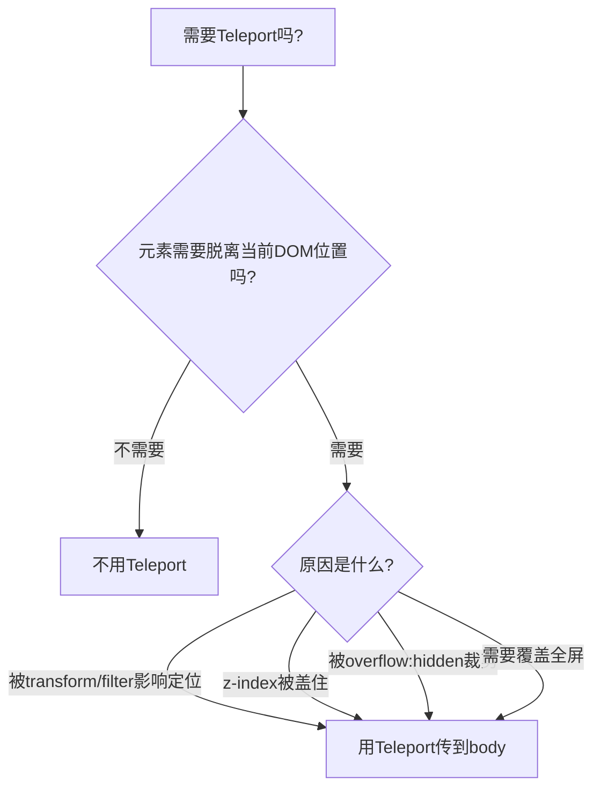

扫描[二维码](https://api2.cmdragon.cn/upload/cmder/20250304_012821924.jpg)关注或者微信搜一搜：`编程智域 前端至全栈交流与成长`

[发现1000+提升效率与开发的AI工具和实用程序](https://tools.cmdragon.cn/zh/apps?category=ai_chat)：https://tools.cmdragon.cn/

## 一、模态框的"爹坑"问题

写模态框（Modal）大概是每个前端都干过的事。逻辑上很简单：点按钮弹出遮罩层，点关闭按钮收起。但CSS层面呢？那可就一言难尽了。

来看一个典型的场景：

```html
<div class="outer" style="transform: translateX(10px);">
  <h3>我的页面</h3>
  <div>
    <MyModal />
  </div>
</div>
```

MyModal组件长这样：

```vue
<!-- MyModal.vue -->
<script setup>
import { ref } from "vue";

const open = ref(false);
</script>

<template>
  <button @click="open = true">打开弹窗</button>

  <div v-if="open" class="modal">
    <p>我是弹窗内容！</p>
    <button @click="open = false">关闭</button>
  </div>
</template>

<style scoped>
.modal {
  position: fixed;
  z-index: 999;
  top: 20%;
  left: 50%;
  width: 300px;
  margin-left: -150px;
}
</style>
```

看起来没啥问题对吧？`position: fixed` 加上 `z-index: 999`，弹窗应该稳稳地浮在页面最上层。

但实际跑起来你会发现——弹窗的位置偏了！不是相对于浏览器窗口居中，而是相对于那个有 `transform` 的父元素偏移了。

这就是"爹坑"：**父元素设置了 `transform`、`perspective` 或 `filter`，子元素的 `position: fixed` 就失效了**，变成了相对于那个有transform的祖先元素定位，而不是浏览器窗口。

更惨的是z-index的问题：如果你的弹窗在一个很深的DOM节点里，外面随便哪个兄弟元素设了个更高的z-index，就能把你的弹窗盖住。你把z-index设成9999也没用，因为CSS的层叠上下文是看祖先的。

## 二、Teleport：Vue 3的"任意门"

Teleport就是Vue 3给你准备的解决方案。它的作用很简单——**把组件内部的一部分模板"传送"到DOM的其他位置去**。

用法就一行：

```vue
<template>
  <button @click="open = true">打开弹窗</button>

  <Teleport to="body">
    <div v-if="open" class="modal">
      <p>我是弹窗内容！</p>
      <button @click="open = false">关闭</button>
    </div>
  </Teleport>
</template>
```

加上 `<Teleport to="body">` 之后，那个 `.modal` 的div就不会渲染在组件原来的位置了，而是直接传送到 `<body>` 标签下面。

渲染前后的DOM结构对比：

```html
<!-- 没用Teleport -->
<div class="outer" style="transform: translateX(10px);">
  <div>
    <button>打开弹窗</button>
    <div class="modal">弹窗内容</div>
    <!-- 被困在深层DOM里 -->
  </div>
</div>

<!-- 用了Teleport -->
<div class="outer" style="transform: translateX(10px);">
  <div>
    <button>打开弹窗</button>
    <!-- 弹窗不在这里了 -->
  </div>
</div>
<!-- 弹窗跑到body下面了！ -->
<body>
  <div id="app">...</div>
  <div class="modal">弹窗内容</div>
  <!-- 直接在body下，不受任何祖先影响 -->
</body>
```

这下 `position: fixed` 正常了，z-index也不怕被盖了，因为弹窗直接挂在body下面，没有任何transform/filter的祖先来捣乱。

## 三、Teleport不影响逻辑关系

这是很多人担心的问题——内容被传送到body下面了，那组件的逻辑关系还在吗？

答案是：**完全在！**

Teleport只改变了渲染的DOM结构，不会影响组件间的逻辑关系。具体来说：

1. **props和emits照常工作** — Teleport里的组件该接收props还是接收，该触发事件还是触发
2. **provide/inject照常工作** — 父组件注入的数据，Teleport里的子组件照样能拿到
3. **Vue DevTools中层级不变** — 在DevTools里，Teleport里的组件还是嵌套在父组件下面，不是放在body下面
4. **作用域样式不受影响** — scoped样式依然生效

```vue
<!-- ParentComponent.vue -->
<script setup>
import { provide, ref } from "vue";
import ChildInTeleport from "./ChildInTeleport.vue";

const theme = ref("dark");
provide("theme", theme);
</script>

<template>
  <Teleport to="body">
    <!-- 子组件照样能拿到provide的theme -->
    <ChildInTeleport />
  </Teleport>
</template>
```

说白了，Teleport就是个"任意门"——人（DOM）过去了，但户口（逻辑关系）还在原地。

## 四、Teleport的适用场景

不只是模态框，这些场景都适合用Teleport：

| 场景           | 为啥需要Teleport                               |
| -------------- | ---------------------------------------------- |
| 模态框/弹窗    | 避免被父元素transform影响定位，避免z-index被盖 |
| 全局通知/Toast | 逻辑属于触发组件，但DOM应该在最外层            |
| 全屏遮罩       | 遮罩需要覆盖整个页面，不能被任何父元素裁剪     |
| 下拉菜单       | 菜单可能被overflow:hidden的父元素裁掉          |
| Tooltip提示    | 提示框需要脱离当前容器，避免被遮挡             |



## 课后Quiz

### 问题1：为什么模态框在设置了transform的父元素内会定位偏移？

**答案解析：** CSS规范规定，当元素的祖先设置了 `transform`、`perspective` 或 `filter` 属性时，该元素的 `position: fixed` 不再相对于浏览器窗口定位，而是相对于那个有transform属性的祖先元素定位。这就导致模态框的位置偏移了。

### 问题2：Teleport传送内容后，组件的provide/inject还能正常工作吗？

**答案解析：** 能。Teleport只改变了DOM渲染位置，不影响组件的逻辑关系。父组件provide的数据，Teleport内的子组件通过inject照样能拿到，因为它们在Vue的组件树中仍然是父子关系。

## 常见报错解决方案

### 1. Teleport目标不存在报错

**错误现象：** 控制台报错 "Invalid Teleport target"，内容没有传送成功。

**可能原因：** `to` 属性指定的目标元素在Teleport挂载时还不存在于DOM中。

**解决方案：** 确保目标元素在Teleport挂载之前已经渲染。如果目标是Vue渲染的元素，可以使用 `defer` prop（Vue 3.5+）延迟解析目标。

### 2. Teleport内容不显示

**错误现象：** 用了Teleport后内容消失了。

**可能原因：** `to` 属性的CSS选择器写错了，或者目标元素不存在。

**解决方案：** 检查 `to` 属性的值，确保CSS选择器能正确匹配到目标元素。可以在浏览器DevTools中搜索目标元素确认它存在。

参考链接：

- https://cn.vuejs.org/guide/built-ins/teleport.html

余下文章内容请点击跳转至 个人博客页面 或者 扫描[二维码](https://api2.cmdragon.cn/upload/cmder/20250304_012821924.jpg)关注或者微信搜一搜：`编程智域 前端至全栈交流与成长`，阅读完整的文章：[弹窗被爹坑了？Teleport帮你逃出DOM嵌套魔咒](https://blog.cmdragon.cn/posts/t1a2b3c4d5e6f7a8b9c0d1e2f3a4b5c6/)

<details>
<summary>往期文章归档</summary>

- [Vue 3 静态与动态 Props 如何传递？TypeScript 类型约束有何必要？](https://blog.cmdragon.cn/posts/94ab48753b64780ca3ab7a7115ae8522/)
- [Vue 3中组件局部注册的优势与实现方式如何？](https://blog.cmdragon.cn/posts/dbf576e744870f6de26fd8a2e03e47da/)
- [如何在Vue3中优化生命周期钩子性能并规避常见陷阱？](https://blog.cmdragon.cn/posts/12d98b3b9ccd6c19a1b169d720ac5c80/)
- [Vue 3 Composition API生命周期钩子：如何实现从基础理解到高阶复用？](https://blog.cmdragon.cn/posts/8884e2b70287fcb263c57648eeb27419/)
- [Vue 3生命周期钩子实战指南：如何正确选择onMounted、onUpdated与onUnmounted的应用场景？](https://blog.cmdragon.cn/posts/883c6dbc50ae4183770a4462e0b8ae4d/)

</details>

<details>
<summary>免费好用的热门在线工具</summary>

- [多直播聚合器 - 应用商店 | By cmdragon](https://tools.cmdragon.cn/zh/apps/multi-live-aggregator)
- [Proto文件生成器 - 应用商店 | By cmdragon](https://tools.cmdragon.cn/zh/apps/proto-file-generator)
- [图片转粒子 - 应用商店 | By cmdragon](https://tools.cmdragon.cn/zh/apps/image-to-particles)
- [视频下载器 - 应用商店 | By cmdragon](https://tools.cmdragon.cn/zh/apps/video-downloader)
- [文件格式转换器 - 应用商店 | By cmdragon](https://tools.cmdragon.cn/zh/apps/file-converter)
- [M3U8在线播放器 - 应用商店 | By cmdragon](https://tools.cmdragon.cn/zh/apps/m3u8-player)
- [CMDragon 在线工具 - 高级AI工具箱与开发者套件 | 免费好用的在线工具](https://tools.cmdragon.cn/zh)
- [应用商店 - 发现1000+提升效率与开发的AI工具和实用程序 | 免费好用的在线工具](https://tools.cmdragon.cn/zh/apps?category=trending)

</details>
