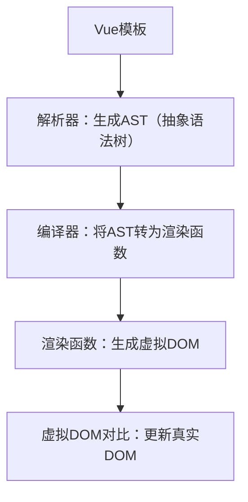

扫描[二维码](https://api2.cmdragon.cn/upload/cmder/20250304_012821924.jpg)关注或者微信搜一搜：`编程智域 前端至全栈交流与成长`

[发现1000+提升效率与开发的AI工具和实用程序](https://tools.cmdragon.cn/zh/apps?category=ai_chat)：https://tools.cmdragon.cn/

### 一、Vue3 模板语法基础入门

#### 1.1 什么是Vue模板语法？

Vue的模板语法是**基于HTML的声明式语法**，它允许你在HTML中嵌入Vue的特殊标记（如插值、指令），将响应式数据与DOM绑定。Vue会将模板
**编译为渲染函数**，最终生成真实DOM并实现“数据变化→页面自动更新”的响应式效果。

简单来说，模板是“带Vue语法的HTML”，比如：

```html

<div>{{ message }}</div>
```

这里的`{{ message }}`是**文本插值**，Vue会把`data`中的`message`值替换到此处。

#### 1.2 第一个Vue模板实例

让我们从最基础的“Hello Vue3”开始，体验模板语法的作用：

```html
<!-- 1. 引入Vue3 CDN（最新版本：3.4.21） -->
<script src="https://unpkg.com/vue@3/dist/vue.global.js"></script>

<!-- 2. 模板容器：Vue会渲染这里的内容 -->
<div id="app">
    {{ message }}
</div>

<!-- 3. 创建并挂载Vue应用 -->
<script>
    const {createApp} = Vue

    // 创建应用实例
    const app = createApp({
        // data选项：返回响应式数据（必须是函数）
        data() {
            return {
                message: 'Hello Vue3!'
            }
        }
    })

    // 将应用挂载到#app元素（触发模板渲染）
    app.mount('#app')
</script>
```

**运行效果**：页面显示`Hello Vue3!`。  
**核心知识点拆解**：

- `createApp()`：创建Vue应用的“根实例”；
- `data()`：返回组件的响应式数据对象（数据变化时，模板自动更新）；
- `app.mount('#app')`：将Vue实例与DOM元素关联，启动渲染；
- `{{ message }}`：“插值语法”，将`data`中的`message`值插入模板。

#### 1.3 模板语法的核心逻辑：声明式渲染

Vue的模板语法遵循**“声明式渲染”**原则：你只需描述“数据应该如何呈现”，Vue会处理“数据变化时如何更新DOM”的细节。其核心流程如下（用流程图辅助理解）：



**关键说明**：

- **AST**：将模板中的HTML标签、插值、指令转换为结构化的“语法树”（方便后续编译）；
- **渲染函数**：一段生成虚拟DOM的JavaScript代码；
- **虚拟DOM**：Vue的“轻量级DOM副本”，通过对比虚拟DOM的变化，Vue能高效更新真实DOM（避免全量渲染）。

### 第一章常见报错解决方案

1. **报错**：`Cannot find element: #app`  
   **原因**：`app.mount('#app')`执行时，`#app`元素还未加载（比如脚本放在`<head>`中）。  
   **解决**：将`<script>`标签放在`#app`元素**之后**，或用`DOMContentLoaded`事件包裹：
   ```javascript
   document.addEventListener('DOMContentLoaded', () => {
     app.mount('#app')
   })
   ```

2. **报错**：`Property "message" was accessed during render but is not defined on instance.`  
   **原因**：模板中用了`{{ message }}`，但`data()`中未定义`message`属性。  
   **解决**：检查`data()`返回的对象，确保包含`message`：
   ```javascript
   data() {
     return {
       message: 'Hello Vue3!' // 必须定义
     }
   }
   ```

### 二、文本插值与原始HTML渲染

#### 2.1 文本插值：最基础的“数据→DOM”绑定

文本插值是Vue中最常用的语法，用`{{ }}`（双大括号）将响应式数据插入模板。

**示例**：

```html

<div id="app">
    <!-- 插入字符串 -->
    {{ message }}
    <!-- 插入表达式结果（仅支持简单表达式） -->
    {{ message + '!' }}
    <!-- 插入方法返回值 -->
    {{ message.toUpperCase() }}
</div>

<script>
    const app = createApp({
        data() {
            return {
                message: 'hello'
            }
        }
    })
    app.mount('#app')
</script>
```

**运行效果**：页面显示`hello hello! HELLO`。  
**规则限制**：

- 插值中只能写**简单JavaScript表达式**（比如`1+1`、`message.toUpperCase()`）；
- 不能写**语句**（比如`if (message) { ... }`、`for (let i=0; i<10; i++)`）；
- 自动**转义HTML**（比如`{{ '<span>hi</span>' }}`会显示为字符串`<span>hi</span>`，而非真实的`<span>`标签）。

#### 2.2 原始HTML渲染：`v-html`指令

如果需要渲染**包含HTML标签的字符串**（比如后端返回的富文本），需用`v-html`指令（**注意：此指令有安全风险！**）。

**示例**：

```html

<div id="app">
    <!-- 文本插值：转义HTML -->
    {{ rawHtml }}
    <!-- v-html：渲染原始HTML -->
    <div v-html="rawHtml"></div>
</div>

<script>
    const app = createApp({
        data() {
            return {
                rawHtml: '<span style="color: red;">Hello Vue3!</span>'
            }
        }
    })
    app.mount('#app')
</script>
```

**运行对比**：

- 文本插值：显示`<span style="color: red;">Hello Vue3!</span>`（字符串）；
- `v-html`：显示红色的`Hello Vue3!`（真实的`<span>`标签）。

#### 2.3 `v-html`的安全红线：禁止用于用户输入

`v-html`会**直接插入原始HTML**，如果内容来自用户输入（比如评论、私信），可能导致**XSS攻击**（跨站脚本攻击）。例如：
用户输入`<script>alert('窃取密码')</script>`，用`v-html`渲染会执行该脚本，窃取用户信息。  
**安全准则**：

- 永远不要用`v-html`渲染**用户提交的内容**；
- 只渲染**你信任的内容**（比如后端严格过滤后的富文本）。

### 第二章常见报错解决方案

1. **报错**：`Interpolations inside attributes are not allowed. Use v-bind instead.`  
   **原因**：试图在HTML属性中用`{{ }}`插值（比如``）。  
   **解决**：用`v-bind`指令绑定属性（后续第三章详细讲）：
   ```html
    <!-- :是v-bind的缩写 -->
   ```

2. **报错**：`v-html directive cannot be used on a self-closing element`  
   **原因**：`v-html`用在**自闭合标签**上（比如``），而`v-html`需要插入子内容。  
   **解决**：将`v-html`用在**非自闭合标签**（比如`<div>`、`<span>`）上：
   ```html
   <div v-html="html"></div> <!-- 正确 -->
   ```

### 三、Attribute绑定与动态属性

HTML属性（如`src`、`class`、`style`）是“静态”的，但Vue允许用`v-bind`指令将属性**动态绑定**到响应式数据。

#### 3.1 `v-bind`的基础用法：绑定单个属性

`v-bind`的作用是**将HTML属性与Vue数据关联**，其**缩写**是`:`（冒号），这是开发中最常用的语法。

**示例：绑定图片`src`**

```html

<div id="app">
    <!-- 完整语法：v-bind:src -->
    
    <!-- 缩写语法（推荐）：:src -->
    
</div>

<script>
    const app = createApp({
        data() {
            return {
                imageUrl: 'https://vuejs.org/images/logo.png'
            }
        }
    })
    app.mount('#app')
</script>
```

**运行效果**：页面显示Vue的logo图片。  
**关键说明**：

- 当`imageUrl`变化时，`img`的`src`属性会**自动更新**（响应式）；
- 缩写语法`:`是`v-bind:`的“语法糖”，更简洁。

#### 3.2 动态属性名：`:[dynamicAttr]`

如果属性名本身是动态的（比如根据数据变化切换`class`或`style`），可以用**方括号**包裹属性名。

**示例**：

```html

<div id="app">
    <!-- 动态属性名：attrName是数据中的属性 -->
    <div :[attrName]="attrValue">动态属性示例</div>
</div>

<script>
    const app = createApp({
        data() {
            return {
                attrName: 'class', // 属性名是class
                attrValue: 'text-red' // 属性值是text-red
            }
        }
    })
    app.mount('#app')
</script>
```

**运行结果**：`<div class="text-red">动态属性示例</div>`。  
**说明**：当`attrName`变为`style`时，属性会变成`style="text-red"`（当然`style`需要合法值，这里只是演示）。

#### 3.3 绑定多个属性：对象语法

如果要绑定**多个属性**，可以用`v-bind`绑定一个**属性对象**（对象的键是属性名，值是属性值）。

**示例：绑定图片的多个属性**

```html

<div id="app">
    <!-- 用v-bind绑定整个属性对象 -->
    
</div>

<script>
    const app = createApp({
        data() {
            return {
                imageAttrs: {
                    src: 'https://vuejs.org/images/logo.png',
                    alt: 'Vue Logo',
                    title: 'Vue.js' // 鼠标 hover 显示的标题
                }
            }
        }
    })
    app.mount('#app')
</script>
```

**运行结果**：

```html

```

#### 3.4 常用场景：绑定`class`与`style`

`class`和`style`是最常动态绑定的属性，Vue提供了**对象语法**和**数组语法**简化操作。

##### 场景1：动态切换`class`

```html

<div id="app">
    <!--  对象语法：class名=布尔值（true则添加，false则移除） -->
    <div :class="{ active: isActive, 'text-red': hasError }">
        动态Class示例
    </div>
</div>

<script>
    const app = createApp({
        data() {
            return {
                isActive: true, // 添加active类
                hasError: false // 不添加text-red类
            }
        }
    })
    app.mount('#app')
</script>
```

**运行结果**：`<div class="active">动态Class示例</div>`。  
**说明**：当`hasError`变为`true`时，会添加`text-red`类（类名带横线时需用引号包裹）。

##### 场景2：动态绑定`style`

```html

<div id="app">
    <!-- 对象语法：style属性=值（支持驼峰或短横线） -->
    <div :style="{ color: textColor, fontSize: fontSize + 'px' }">
        动态Style示例
    </div>
</div>

<script>
    const app = createApp({
        data() {
            return {
                textColor: 'blue', // 文字颜色
                fontSize: 16 // 字体大小（需拼接单位）
            }
        }
    })
    app.mount('#app')
</script>
```

**运行结果**：`<div style="color: blue; font-size: 16px;">动态Style示例</div>`。

#### 3.5 动态属性的响应式特性

所有用`v-bind`绑定的属性都是**响应式**的：当数据变化时，HTML属性会自动更新。例如：

```javascript
// 修改imageUrl的值（假设app是Vue实例）
app.imageUrl = 'https://vuejs.org/images/vue-logo.png'
// 图片的src会自动更新为新地址
```

### 第三章常见报错解决方案

1. **报错**：`Invalid dynamic argument expression: Expected a string or symbol`  
   **原因**：动态属性名的表达式结果不是字符串（比如`<div :[123]="value">`）。  
   **解决**：确保动态属性名的表达式返回**字符串**：
   ```html
   <div :[attrName]="value"> <!-- attrName是字符串 -->
   ```

2. **报错**：`v-bind without argument expects an object`  
   **原因**：`v-bind`没有参数，但绑定的值不是对象（比如``）。  
   **解决**：
    - 绑定单个属性：用`v-bind:src="imageUrl"`；
    - 绑定多个属性：确保值是**对象**（比如``）。

### 课后Quiz

#### 问题1：请解释`v-bind`的缩写语法，并写一个绑定图片`src`的示例。

**答案**：

- `v-bind`的缩写是`:`（冒号）；
- 示例：
  ```html
  
  ```

#### 问题2：如何用`v-bind`动态切换一个按钮的`disabled`状态？

**答案**：
用`v-bind:disabled`绑定一个布尔值：

```html

<div id="app">
    <button :disabled="isDisabled">点击我</button>
</div>

<script>
    const app = createApp({
        data() {
            return {
                isDisabled: true // 按钮禁用
            }
        }
    })
    app.mount('#app')
</script>
```

**说明**：当`isDisabled`变为`false`时，按钮恢复可点击。

#### 问题3：`v-bind`绑定多个属性时，值需要是什么类型？请举一个示例。

**答案**：
值需要是**对象**（键是属性名，值是属性值）。示例：

```html

<div id="app">
    <a :href="link.url" :target="link.target">
        {{ link.text }}
    </a>
</div>

<script>
    const app = createApp({
        data() {
            return {
                link: {
                    url: 'https://vuejs.org',
                    target: '_blank',
                    text: 'Vue官网'
                }
            }
        }
    })
    app.mount('#app')
</script>
```

**运行结果**：`<a href="https://vuejs.org" target="_blank">Vue官网</a>`。

参考链接：

- Vue3 模板语法基础：https://vuejs.org/guide/essentials/template-syntax.html
- 文本插值与v-html：https://vuejs.org/guide/essentials/template-syntax.html#text-interpolation
- Attribute绑定：https://vuejs.org/guide/essentials/template-syntax.html#attribute-bindings
- 动态属性名：https://vuejs.org/guide/essentials/template-syntax.html#dynamic-arguments

余下文章内容请点击跳转至 个人博客页面 或者 扫码关注或者微信搜一搜：`编程智域 前端至全栈交流与成长`
，阅读完整的文章：[想入门Vue3模板语法？插值、动态绑定和避坑技巧你都搞懂了吗？](https://blog.cmdragon.cn/posts/999ce4fb32259ff4fbf4bf7bcb851654/)


<details>
<summary>往期文章归档</summary>

- [想让PostgreSQL快到飞起？先找健康密码还是先换引擎？ - cmdragon's Blog](https://blog.cmdragon.cn/posts/a6997d81b49cd232b87e1cf603888ad1/)
- [想让PostgreSQL查询快到飞起？分区表、物化视图、并行查询这三招灵不灵？ - cmdragon's Blog](https://blog.cmdragon.cn/posts/1fee7afbb9abd4540b8aa9c141d6845d/)
- [子查询总拖慢查询？把它变成连接就能解决？ - cmdragon's Blog](https://blog.cmdragon.cn/posts/79c590fbd87ece535b11a71c9667884f/)
- [PostgreSQL全表扫描慢到崩溃？建索引+改查询+更统计信息三招能破？ - cmdragon's Blog](https://blog.cmdragon.cn/posts/748cdac2536008199abf8a8a2cd0ec85/)
- [复杂查询总拖后腿？PostgreSQL多列索引+覆盖索引的神仙技巧你get没？ - cmdragon's Blog](https://blog.cmdragon.cn/posts/32ca943703226d317d4276a8fb53b0dd/)
- [只给表子集建索引？用函数结果建索引？PostgreSQL这俩操作凭啥能省空间又加速？ - cmdragon's Blog](https://blog.cmdragon.cn/posts/ca93f1d53aa910e7ba5ffd8df611c12b/)
- [B-tree索引像字典查词一样工作？那哪些数据库查询它能加速，哪些不能？ - cmdragon's Blog](https://blog.cmdragon.cn/posts/f507856ebfddd592448813c510a53669/)
- [想抓PostgreSQL里的慢SQL？pg_stat_statements基础黑匣子和pg_stat_monitor时间窗，谁能帮你更准揪出性能小偷？ - cmdragon's Blog](https://blog.cmdragon.cn/posts/b2213bfcb5b88a862f2138404c03d596/)
- [PostgreSQL的“时光机”MVCC和锁机制是怎么搞定高并发的？ - cmdragon's Blog](https://blog.cmdragon.cn/posts/26614eb7da6c476dde41d367ad888d2f/)
- [PostgreSQL性能暴涨的关键？内存IO并发参数居然要这么设置？ - cmdragon's Blog](https://blog.cmdragon.cn/posts/69f99bc6972a860d559c74aad7280da4/)
- [大表查询慢到翻遍整个书架？PostgreSQL分区表教你怎么“分类”才高效](https://blog.cmdragon.cn/posts/7b7053f392147a8b3b1a16bebeb08d0a/)
- [PostgreSQL 查询慢？是不是忘了优化 GROUP BY、ORDER BY 和窗口函数？ - cmdragon's Blog](https://blog.cmdragon.cn/posts/c856e3cb073822349f3bf2d29995dcfc/)
- [PostgreSQL里的子查询和CTE居然在性能上“掐架”？到底该站哪边？ - cmdragon's Blog](https://blog.cmdragon.cn/posts/c096347d18e67b7431faacd2c4757093/)
- [PostgreSQL选Join策略有啥小九九？Nested Loop/Merge/Hash谁是它的菜？ - cmdragon's Blog](https://blog.cmdragon.cn/posts/2eca89463454fd4250d7b66243b9fe5a/)
- [PostgreSQL新手SQL总翻车？这7个性能陷阱你踩过没？ - cmdragon's Blog](https://blog.cmdragon.cn/posts/068ecb772a87d7df20a8c9fb4b233f8e/)
- [PostgreSQL索引选B-Tree还是GiST？“瑞士军刀”和“多面手”的差别你居然还不知道？ - cmdragon's Blog](https://blog.cmdragon.cn/posts/d498f63cd0a2d5a77e445c688a8b88db/)
- [想知道数据库怎么给查询“算成本选路线”？EXPLAIN能帮你看明白？ - cmdragon's Blog](https://blog.cmdragon.cn/posts/9101b75bdec6faea9b35d54f14e37f36/)
- [PostgreSQL处理SQL居然像做蛋糕？解析到执行的4步里藏着多少查询优化的小心机？ - cmdragon's Blog](https://blog.cmdragon.cn/posts/d527f8ebb6e3dae2c7dfe4c8d8979444/)
- [PostgreSQL备份不是复制文件？物理vs逻辑咋选？误删还能精准恢复到1分钟前？ - cmdragon's Blog](https://blog.cmdragon.cn/posts/6bfdae84f313cf7ad0bb7045c4392347/)
- [转账不翻车、并发不干扰，PostgreSQL的ACID特性到底有啥魔法？ - cmdragon's Blog](https://blog.cmdragon.cn/posts/de3672803de34dbad244d0a8d48b0eb5/)
- [银行转账不白扣钱、电商下单不超卖，PostgreSQL事务的诀窍是啥？ - cmdragon's Blog](https://blog.cmdragon.cn/posts/e463e8a2668abdf00a228c9b79324ded/)
- [PostgreSQL里的PL/pgSQL到底是啥？能让SQL从“说目标”变“讲步骤”？ - cmdragon's Blog](https://blog.cmdragon.cn/posts/5c967e595058c4a1fc4474a68e64031d/)
- [PostgreSQL视图不存数据？那它怎么简化查询还能递归生成序列和控制权限？ - cmdragon's Blog](https://blog.cmdragon.cn/posts/325047855e3e23b5ef82f7d2db134fbd/)
- [PostgreSQL索引这么玩，才能让你的查询真的“飞”起来？ - cmdragon's Blog](https://blog.cmdragon.cn/posts/d2dba50bb6e4df7b27e735245a06a2a2/)
- [PostgreSQL的表关系和约束，咋帮你搞定用户订单不混乱、学生选课不重复？ - cmdragon's Blog](https://blog.cmdragon.cn/posts/849ae5bab0f8c66e94c2f6ad1bb798e3/)
- [PostgreSQL查询的筛子、排序、聚合、分组？你会用它们搞定数据吗？ - cmdragon's Blog](https://blog.cmdragon.cn/posts/ef4800975ffa84f1ca51976a70a1585b/)
- [PostgreSQL数据类型怎么选才高效不踩坑？ - cmdragon's Blog](https://blog.cmdragon.cn/posts/bf54711525c507c5eacfa7b0151c39d2/)
- [想解锁PostgreSQL查询从基础到进阶的核心知识点？你都get了吗？ - cmdragon's Blog](https://blog.cmdragon.cn/posts/887809b3e0375f5956873cd442f516d8/)
- [PostgreSQL DELETE居然有这些操作？返回数据、连表删你试过没？ - cmdragon's Blog](https://blog.cmdragon.cn/posts/934be1203725e8be9d6f6e9104e5abcc/)
- [PostgreSQL UPDATE语句怎么玩？从改邮箱到批量更新的避坑技巧你都会吗？ - cmdragon's Blog](https://blog.cmdragon.cn/posts/0f0622e9b7402b599e618150d0596ffe/)
- [PostgreSQL插入数据还在逐条敲？批量、冲突处理、返回自增ID的技巧你会吗？ - cmdragon's Blog](https://blog.cmdragon.cn/posts/0e3bf7efc030b024ea67ee855a00f2de/)
- [PostgreSQL的“仓库-房间-货架”游戏，你能建出电商数据库和表吗？ - cmdragon's Blog](https://blog.cmdragon.cn/posts/b6cd3c86da6aac26ed829e472d34078e/)
- [PostgreSQL 17安装总翻车？Windows/macOS/Linux避坑指南帮你搞定？ - cmdragon's Blog](https://blog.cmdragon.cn/posts/ba1f545a3410144552fbdbfcf31b5265/)
- [能当关系型数据库还能玩对象特性，能拆复杂查询还能自动管库存，PostgreSQL凭什么这么香？ - cmdragon's Blog](https://blog.cmdragon.cn/posts/b5474d1480509c5072085abc80b3dd9f/)
- [给接口加新字段又不搞崩老客户端？FastAPI的多版本API靠哪三招实现？ - cmdragon's Blog](https://blog.cmdragon.cn/posts/cc098d8836e787baa8a4d92e4d56d5c5/)
- [流量突增要搞崩FastAPI？熔断测试是怎么防系统雪崩的？ - cmdragon's Blog](https://blog.cmdragon.cn/posts/46d05151c5bd31cf37a7bcf0b8f5b0b8/)
- [FastAPI秒杀库存总变负数？Redis分布式锁能帮你守住底线吗 - cmdragon's Blog](https://blog.cmdragon.cn/posts/65ce343cc5df9faf3a8e2eeaab42ae45/)
- [FastAPI的CI流水线怎么自动测端点，还能让Allure报告美到犯规？ - cmdragon's Blog](https://blog.cmdragon.cn/posts/eed6cd8985d9be0a4b092a7da38b3e0c/)
- [如何用GitHub Actions为FastAPI项目打造自动化测试流水线？ - cmdragon's Blog](https://blog.cmdragon.cn/posts/6157d87338ce894d18c013c3c4777abb/)
- [如何用Git Hook和CI流水线为FastAPI项目保驾护航？ - cmdragon's Blog](https://blog.cmdragon.cn/posts/fc4ef84559e04693a620d0714cb30787/)
- [FastAPI如何用契约测试确保API的「菜单」与「菜品」一致？](https://blog.cmdragon.cn/posts/02b0c96842d1481c72dab63a149ce0dd/)
- [为什么TDD能让你的FastAPI开发飞起来？ - cmdragon's Blog](https://blog.cmdragon.cn/posts/c9c1e3bb0fdc15303b9b3b1f20124b0b/)
- [如何用FastAPI玩转多模块测试与异步任务，让代码不再“闹脾气”？ - cmdragon's Blog](https://blog.cmdragon.cn/posts/ddbfa0447a5d0d6f9af12e7a6b206f70/)
- [如何在FastAPI中玩转“时光倒流”的数据库事务回滚测试？](https://blog.cmdragon.cn/posts/bf9883a75ffa46b523a03b16ec56ce48/)
- [如何在FastAPI中优雅地模拟多模块集成测试？ - cmdragon's Blog](https://blog.cmdragon.cn/posts/be553dbd5d51835d2c69553f4a773e2d/)
- [多环境配置切换机制能否让开发与生产无缝衔接？ - cmdragon's Blog](https://blog.cmdragon.cn/posts/533874f5700b8506d4c68781597db659/)
- [如何在 FastAPI 中巧妙覆盖依赖注入并拦截第三方服务调用？ - cmdragon's Blog](https://blog.cmdragon.cn/posts/2d992ef9e8962dc0a4a0b5348d486114/)
- [为什么你的单元测试需要Mock数据库才能飞起来？ - cmdragon's Blog](https://blog.cmdragon.cn/posts/6e69c0eedd8b1e5a74a148d36c85d7ce/)
- [如何在FastAPI中巧妙隔离依赖项，让单元测试不再头疼？ - cmdragon's Blog](https://blog.cmdragon.cn/posts/77ae327dc941b0e74ecc6a8794c084d0/)

</details>


<details>
<summary>免费好用的热门在线工具</summary>

- [Mermaid 在线编辑器 - 应用商店 | By cmdragon](https://tools.cmdragon.cn/zh/apps/mermaid-live-editor)
- [数学求解计算器 - 应用商店 | By cmdragon](https://tools.cmdragon.cn/zh/apps/math-solver-calculator)
- [智能提词器 - 应用商店 | By cmdragon](https://tools.cmdragon.cn/zh/apps/smart-teleprompter)
- [魔法简历 - 应用商店 | By cmdragon](https://tools.cmdragon.cn/zh/apps/magic-resume)
- [Image Puzzle Tool - 图片拼图工具 | By cmdragon](https://tools.cmdragon.cn/zh/apps/image-puzzle-tool)
- [字幕下载工具 - 应用商店 | By cmdragon](https://tools.cmdragon.cn/zh/apps/subtitle-downloader)
- [歌词生成工具 - 应用商店 | By cmdragon](https://tools.cmdragon.cn/zh/apps/lyrics-generator)
- [网盘资源聚合搜索 - 应用商店 | By cmdragon](https://tools.cmdragon.cn/zh/apps/cloud-drive-search)
- [ASCII字符画生成器 - 应用商店 | By cmdragon](https://tools.cmdragon.cn/zh/apps/ascii-art-generator)
- [JSON Web Tokens 工具 - 应用商店 | By cmdragon](https://tools.cmdragon.cn/zh/apps/jwt-tool)
- [Bcrypt 密码工具 - 应用商店 | By cmdragon](https://tools.cmdragon.cn/zh/apps/bcrypt-tool)
- [GIF 合成器 - 应用商店 | By cmdragon](https://tools.cmdragon.cn/zh/apps/gif-composer)
- [GIF 分解器 - 应用商店 | By cmdragon](https://tools.cmdragon.cn/zh/apps/gif-decomposer)
- [文本隐写术 - 应用商店 | By cmdragon](https://tools.cmdragon.cn/zh/apps/text-steganography)
- [CMDragon 在线工具 - 高级AI工具箱与开发者套件 | 免费好用的在线工具](https://tools.cmdragon.cn/zh)
- [应用商店 - 发现1000+提升效率与开发的AI工具和实用程序 | 免费好用的在线工具](https://tools.cmdragon.cn/zh/apps?category=trending)
- [CMDragon 更新日志 - 最新更新、功能与改进 | 免费好用的在线工具](https://tools.cmdragon.cn/zh/changelog)
- [支持我们 - 成为赞助者 | 免费好用的在线工具](https://tools.cmdragon.cn/zh/sponsor)
- [AI文本生成图像 - 应用商店 | 免费好用的在线工具](https://tools.cmdragon.cn/zh/apps/text-to-image-ai)
- [临时邮箱 - 应用商店 | 免费好用的在线工具](https://tools.cmdragon.cn/zh/apps/temp-email)
- [二维码解析器 - 应用商店 | 免费好用的在线工具](https://tools.cmdragon.cn/zh/apps/qrcode-parser)
- [文本转思维导图 - 应用商店 | 免费好用的在线工具](https://tools.cmdragon.cn/zh/apps/text-to-mindmap)
- [正则表达式可视化工具 - 应用商店 | 免费好用的在线工具](https://tools.cmdragon.cn/zh/apps/regex-visualizer)
- [文件隐写工具 - 应用商店 | 免费好用的在线工具](https://tools.cmdragon.cn/zh/apps/steganography-tool)
- [IPTV 频道探索器 - 应用商店 | 免费好用的在线工具](https://tools.cmdragon.cn/zh/apps/iptv-explorer)
- [快传 - 应用商店 | 免费好用的在线工具](https://tools.cmdragon.cn/zh/apps/snapdrop)
- [随机抽奖工具 - 应用商店 | 免费好用的在线工具](https://tools.cmdragon.cn/zh/apps/lucky-draw)
- [动漫场景查找器 - 应用商店 | 免费好用的在线工具](https://tools.cmdragon.cn/zh/apps/anime-scene-finder)
- [时间工具箱 - 应用商店 | 免费好用的在线工具](https://tools.cmdragon.cn/zh/apps/time-toolkit)
- [网速测试 - 应用商店 | 免费好用的在线工具](https://tools.cmdragon.cn/zh/apps/speed-test)
- [AI 智能抠图工具 - 应用商店 | 免费好用的在线工具](https://tools.cmdragon.cn/zh/apps/background-remover)
- [背景替换工具 - 应用商店 | 免费好用的在线工具](https://tools.cmdragon.cn/zh/apps/background-replacer)
- [艺术二维码生成器 - 应用商店 | 免费好用的在线工具](https://tools.cmdragon.cn/zh/apps/artistic-qrcode)
- [Open Graph 元标签生成器 - 应用商店 | 免费好用的在线工具](https://tools.cmdragon.cn/zh/apps/open-graph-generator)
- [图像对比工具 - 应用商店 | 免费好用的在线工具](https://tools.cmdragon.cn/zh/apps/image-comparison)
- [图片压缩专业版 - 应用商店 | 免费好用的在线工具](https://tools.cmdragon.cn/zh/apps/image-compressor)
- [密码生成器 - 应用商店 | 免费好用的在线工具](https://tools.cmdragon.cn/zh/apps/password-generator)
- [SVG优化器 - 应用商店 | 免费好用的在线工具](https://tools.cmdragon.cn/zh/apps/svg-optimizer)
- [调色板生成器 - 应用商店 | 免费好用的在线工具](https://tools.cmdragon.cn/zh/apps/color-palette)
- [在线节拍器 - 应用商店 | 免费好用的在线工具](https://tools.cmdragon.cn/zh/apps/online-metronome)
- [IP归属地查询 - 应用商店 | 免费好用的在线工具](https://tools.cmdragon.cn/zh/apps/ip-geolocation)
- [CSS网格布局生成器 - 应用商店 | 免费好用的在线工具](https://tools.cmdragon.cn/zh/apps/css-grid-layout)
- [邮箱验证工具 - 应用商店 | 免费好用的在线工具](https://tools.cmdragon.cn/zh/apps/email-validator)
- [书法练习字帖 - 应用商店 | 免费好用的在线工具](https://tools.cmdragon.cn/zh/apps/calligraphy-practice)
- [金融计算器套件 - 应用商店 | 免费好用的在线工具](https://tools.cmdragon.cn/zh/apps/finance-calculator-suite)
- [中国亲戚关系计算器 - 应用商店 | 免费好用的在线工具](https://tools.cmdragon.cn/zh/apps/chinese-kinship-calculator)
- [Protocol Buffer 工具箱 - 应用商店 | 免费好用的在线工具](https://tools.cmdragon.cn/zh/apps/protobuf-toolkit)
- [IP归属地查询 - 应用商店 | 免费好用的在线工具](https://tools.cmdragon.cn/zh/apps/ip-geolocation)
- [图片无损放大 - 应用商店 | 免费好用的在线工具](https://tools.cmdragon.cn/zh/apps/image-upscaler)
- [文本比较工具 - 应用商店 | 免费好用的在线工具](https://tools.cmdragon.cn/zh/apps/text-compare)
- [IP批量查询工具 - 应用商店 | 免费好用的在线工具](https://tools.cmdragon.cn/zh/apps/ip-batch-lookup)
- [域名查询工具 - 应用商店 | 免费好用的在线工具](https://tools.cmdragon.cn/zh/apps/domain-finder)
- [DNS工具箱 - 应用商店 | 免费好用的在线工具](https://tools.cmdragon.cn/zh/apps/dns-toolkit)
- [网站图标生成器 - 应用商店 | 免费好用的在线工具](https://tools.cmdragon.cn/zh/apps/favicon-generator)
- [XML Sitemap](https://tools.cmdragon.cn/sitemap_index.xml)

</details>