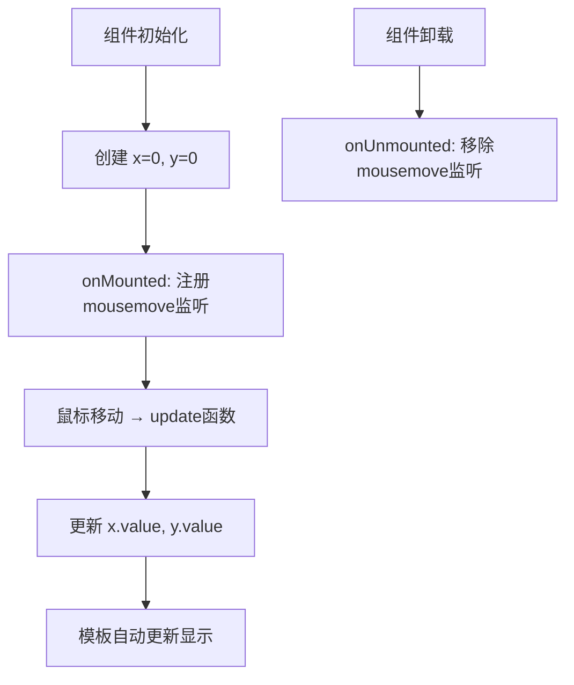
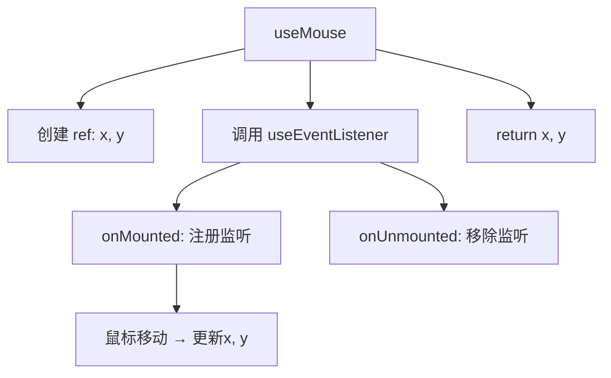

扫描[二维码](https://api2.cmdragon.cn/upload/cmder/20250304_012821924.jpg)关注或者微信搜一搜：`编程智域 前端至全栈交流与成长`

[发现1000+提升效率与开发的AI工具和实用程序](https://tools.cmdragon.cn/zh/apps?category=ai_chat)：https://tools.cmdragon.cn/zh/apps?category=ai_chat

## 一、先在组件里把功能跑通

写Composable有个很重要的原则——**先把功能在组件里实现出来，确认能跑，再往外面提**。别上来就想着封装，容易把自己搞晕。

咱们先来实现一个鼠标位置追踪的功能，就在组件里写：

```vue
<!-- MouseTracker.vue -->
<script setup>
import { ref, onMounted, onUnmounted } from "vue";

const x = ref(0);
const y = ref(0);

function update(event) {
  x.value = event.pageX;
  y.value = event.pageY;
}

onMounted(() => {
  window.addEventListener("mousemove", update);
});

onUnmounted(() => {
  window.removeEventListener("mousemove", update);
});
</script>

<template>
  <div>鼠标位置：{{ x }}, {{ y }}</div>
</template>
```

跑一下，鼠标移动的时候x和y跟着变，没问题。好，功能验证通过了。

来捋一下这段代码做了啥：

1. 用`ref`创建了两个响应式变量x和y，初始值都是0
2. 定义了`update`函数，鼠标移动时把pageX和pageY赋值给x和y
3. 在`onMounted`里注册mousemove事件监听
4. 在`onUnmounted`里移除mousemove事件监听（这个千万别忘了，不然内存泄漏）



## 二、把逻辑提出来变成Composable

功能跑通了，现在来把它提取成一个Composable。其实很简单，就是把组件里的逻辑原封不动搬到外面去，然后return需要暴露的东西。

### 创建useMouse.js

```javascript
// composables/useMouse.js
import { ref, onMounted, onUnmounted } from "vue";

export function useMouse() {
  const x = ref(0);
  const y = ref(0);

  function update(event) {
    x.value = event.pageX;
    y.value = event.pageY;
  }

  onMounted(() => {
    window.addEventListener("mousemove", update);
  });

  onUnmounted(() => {
    window.removeEventListener("mousemove", update);
  });

  return { x, y };
}
```

你看，和组件里的代码基本一模一样，就是：

1. 外面包了一个函数，函数名叫`useMouse`
2. 最后`return { x, y }`把状态暴露出去
3. 加了`export`让外面能导入

### 在组件里用

```vue
<!-- MouseTracker.vue -->
<script setup>
import { useMouse } from "./composables/useMouse.js";

const { x, y } = useMouse();
</script>

<template>
  <div>鼠标位置：{{ x }}, {{ y }}</div>
</template>
```

看到了吧？组件的代码一下子清爽了好多。原来十几行逻辑，现在就一行调用加一行解构。

### 多个组件复用

现在任何组件想用鼠标追踪，直接导入调用就行：

```vue
<!-- ComponentA.vue -->
<script setup>
import { useMouse } from "./composables/useMouse.js";
const { x, y } = useMouse();
</script>

<template>
  <p>组件A看到的位置：{{ x }}, {{ y }}</p>
</template>
```

```vue
<!-- ComponentB.vue -->
<script setup>
import { useMouse } from "./composables/useMouse.js";
const { x, y } = useMouse();
</script>

<template>
  <p>组件B看到的位置：{{ x }}, {{ y }}</p>
</template>
```

这里有个很重要的点——**每个组件调用`useMouse()`都会创建自己独立的x和y**。组件A的x变了不会影响组件B的x，它们各管各的。这就像每个人各自买了一台计算器，你按你的我按我的，互不干扰。

## 三、再进一步：把事件监听也封装起来

写完useMouse之后你可能会想：注册事件监听、移除事件监听这个模式，好像很多地方都会用到啊。比如监听窗口resize、监听键盘按键、监听滚动……

那咱们把这个也封装成一个Composable：

```javascript
// composables/useEventListener.js
import { onMounted, onUnmounted } from "vue";

export function useEventListener(target, event, callback) {
  onMounted(() => {
    target.addEventListener(event, callback);
  });

  onUnmounted(() => {
    target.removeEventListener(event, callback);
  });
}
```

就这么几行代码，但它帮我们把"注册+移除"这个模式给标准化了。以后不管监听啥事件，都不用再手写`onMounted`和`onUnmounted`了。

### 用useEventListener改造useMouse

```javascript
// composables/useMouse.js
import { ref } from "vue";
import { useEventListener } from "./useEventListener.js";

export function useMouse() {
  const x = ref(0);
  const y = ref(0);

  useEventListener(window, "mousemove", (event) => {
    x.value = event.pageX;
    y.value = event.pageY;
  });

  return { x, y };
}
```

对比一下改造前后的useMouse：

| 改造前                         | 改造后                   |
| ------------------------------ | ------------------------ |
| 手动导入onMounted、onUnmounted | 只需导入useEventListener |
| 手动注册addEventListener       | useEventListener帮你注册 |
| 手动移除removeEventListener    | useEventListener帮你移除 |
| 代码约15行                     | 代码约10行               |

代码更短了，而且逻辑更清晰——你一眼就能看出"哦，这是在监听window的mousemove事件"。



## 四、useEventListener还能干啥？

既然把事件监听封装好了，那其他场景也能用。来几个例子：

### 监听窗口大小变化

```javascript
// composables/useWindowSize.js
import { ref } from "vue";
import { useEventListener } from "./useEventListener.js";

export function useWindowSize() {
  const width = ref(window.innerWidth);
  const height = ref(window.innerHeight);

  useEventListener(window, "resize", () => {
    width.value = window.innerWidth;
    height.value = window.innerHeight;
  });

  return { width, height };
}
```

组件里用：

```vue
<script setup>
import { useWindowSize } from "./composables/useWindowSize.js";
const { width, height } = useWindowSize();
</script>

<template>
  <p>窗口大小：{{ width }} x {{ height }}</p>
</template>
```

### 监听键盘按键

```javascript
// composables/useKeydown.js
import { useEventListener } from "./useEventListener.js";

export function useKeydown(key, callback) {
  useEventListener(window, "keydown", (event) => {
    if (event.key === key) {
      callback(event);
    }
  });
}
```

组件里用：

```vue
<script setup>
import { useKeydown } from "./composables/useKeydown.js";
import { ref } from "vue";

const lastKey = ref("");

useKeydown("Escape", () => {
  lastKey.value = "你按了ESC！";
});

useKeydown("Enter", () => {
  lastKey.value = "你按了回车！";
});
</script>

<template>
  <p>{{ lastKey || "按个键试试..." }}</p>
</template>
```

## 五、项目里怎么组织Composable文件？

写多了你会发现Composable文件越来越多，得有个合理的目录结构。推荐这样组织：

```
src/
├── composables/          # 所有Composable放这里
│   ├── useMouse.js
│   ├── useEventListener.js
│   ├── useWindowSize.js
│   ├── useFetch.js
│   └── useLocalStorage.js
├── components/
├── views/
└── App.vue
```

或者按功能分组：

```
src/
├── composables/
│   ├── dom/              # DOM相关的
│   │   ├── useMouse.js
│   │   ├── useEventListener.js
│   │   └── useWindowSize.js
│   ├── network/          # 网络请求相关的
│   │   └── useFetch.js
│   └── storage/          # 存储相关的
│       └── useLocalStorage.js
```

哪种都行，看项目大小和个人喜好。小项目就放一个文件夹里，大项目再细分。

## 课后 Quiz

### 问题 1

写Composable的时候，为什么要先在组件里把功能跑通再提取？

#### 答案解析

因为直接封装容易把逻辑搞复杂。先在组件里写，你能确认功能是OK的，逻辑是通的。然后再提取就只是"搬代码"的事，不用同时思考"功能对不对"和"封装对不对"两个问题。这就像先确认菜谱能做出好菜，再把菜谱整理成食谱书，比边做菜边写食谱靠谱多了。

### 问题 2

下面这段useMouse的代码有什么问题？

```javascript
export function useMouse() {
  const x = ref(0);
  const y = ref(0);

  window.addEventListener("mousemove", (event) => {
    x.value = event.pageX;
    y.value = event.pageY;
  });

  return { x, y };
}
```

#### 答案解析

问题在于没有在组件卸载时移除事件监听器。每次调用`useMouse()`都会往window上添加一个监听器，但组件卸载后这个监听器还在，就造成了内存泄漏。而且如果组件反复挂载卸载，监听器会越积越多，性能也会越来越差。正确做法是用`onMounted`注册、`onUnmounted`移除，或者用`useEventListener`来帮你自动管理。

### 问题 3

两个组件同时调用`useMouse()`，它们的鼠标位置数据是共享的还是独立的？

#### 答案解析

独立的。每次调用`useMouse()`都会执行函数体，创建新的`ref(0)`，所以每个组件拿到的x和y是各自独立的ref。这就像每次调用函数都会创建新的局部变量一样。如果需要共享状态，应该用Pinia等状态管理工具。

## 常见报错解决方案

### 报错 1：`onMounted is called when there is no active component instance`

**错误场景**：

```javascript
// 在普通JS文件里直接调用，不在组件setup上下文中
import { useMouse } from "./composables/useMouse.js";

const { x, y } = useMouse(); // 💥 报错
```

**报错原因**：
`useMouse`内部调用了`onMounted`和`onUnmounted`，这些生命周期钩子必须在组件的setup上下文中才能注册。在组件外面调用，Vue找不到当前组件实例。

**解决方案**：
确保在`<script setup>`或`setup()`函数中调用：

```vue
<script setup>
import { useMouse } from "./composables/useMouse.js";
const { x, y } = useMouse(); // ✅ 正确
</script>
```

### 报错 2：事件监听器没有移除导致内存泄漏

**错误场景**：

```javascript
// 忘记在onUnmounted中移除监听器
export function useMouse() {
  const x = ref(0);
  const y = ref(0);

  onMounted(() => {
    window.addEventListener("mousemove", update); // 只注册不移除
  });
  // 忘了写 onUnmounted...

  return { x, y };
}
```

**报错原因**：
组件卸载后，mousemove的监听器还在运行，但组件已经不存在了。反复挂载卸载组件，监听器越积越多，最终导致内存泄漏和性能下降。

**解决方案**：
始终在`onUnmounted`中移除事件监听器，或者直接使用`useEventListener`来帮你自动管理：

```javascript
import { useEventListener } from "./useEventListener.js";

export function useMouse() {
  const x = ref(0);
  const y = ref(0);

  // useEventListener会自动在组件卸载时移除监听
  useEventListener(window, "mousemove", (event) => {
    x.value = event.pageX;
    y.value = event.pageY;
  });

  return { x, y };
}
```

### 报错 3：解构Composable返回值后数据不更新

**错误场景**：

```javascript
// Composable返回的是reactive对象
export function useMouse() {
  const state = reactive({ x: 0, y: 0 });
  // ...
  return state;
}

// 组件里解构
const { x, y } = useMouse(); // 💥 x和y变成普通数字，不响应式了
```

**报错原因**：
`reactive`对象被解构后，属性就变成了普通值，丢失了响应性。

**解决方案**：
Composable应该返回包含`ref`的普通对象：

```javascript
export function useMouse() {
  const x = ref(0);
  const y = ref(0);
  // ...
  return { x, y }; // ✅ ref解构后依然响应式
}
```

## 参考链接

- Vue 3 官方文档 - 组合式函数：https://vuejs.org/guide/reusability/composables.html
- Vue 3 官方文档 - 生命周期钩子：https://vuejs.org/guide/essentials/lifecycle.html

余下文章内容请点击跳转至 个人博客页面 或者 扫描[二维码](https://api2.cmdragon.cn/upload/cmder/20250304_012821924.jpg)关注或者微信搜一搜：`编程智域 前端至全栈交流与成长`，阅读完整的文章：[手把手教你写第一个Composable，鼠标追踪器原来这么简单](https://blog.cmdragon.cn/posts/b2c3d4e5f6a7b8c9d0e1f2a3b4c5d6e7/)

<details>
<summary>往期文章归档</summary>

- [Vue 3 静态与动态 Props 如何传递？TypeScript 类型约束有何必要？](https://blog.cmdragon.cn/posts/94ab48753b64780ca3ab7a7115ae8522/)
- [Vue 3中组件局部注册的优势与实现方式如何？](https://blog.cmdragon.cn/posts/dbf576e744870f6de26fd8a2e03e47da/)
- [如何在Vue3中优化生命周期钩子性能并规避常见陷阱？](https://blog.cmdragon.cn/posts/12d98b3b9ccd6c19a1b169d720ac5c80/)
- [Vue 3 Composition API生命周期钩子：如何实现从基础理解到高阶复用？](https://blog.cmdragon.cn/posts/8884e2b70287fcb263c57648eeb27419/)
- [Vue 3生命周期钩子实战指南：如何正确选择onMounted、onUpdated与onUnmounted的应用场景？](https://blog.cmdragon.cn/posts/883c6dbc50ae4183770a4462e0b8ae4d/)
- [Vue 3中生命周期钩子与响应式系统如何实现协同工作？](https://blog.cmdragon.cn/posts/70dad360ffa9dce14d0d69611b8cb019/)
- [Vue 3组件生命周期钩子的执行顺序与使用场景是什么？](https://blog.cmdragon.cn/posts/db44294a78dc9f666f67b053f6c83567/)
- [Vue组件全局注册与局部注册如何抉择？](https://blog.cmdragon.cn/posts/43ead630ea17da65d99ad2eb8188e472/)
- [Vue3组件化开发中，Props与Emits如何实现数据流转与事件协作？](https://blog.cmdragon.cn/posts/8cff7d2df113da66ea7be560c4d1d22a/)
- [Vue 3模板引用如何与其他特性协同实现复杂交互？](https://blog.cmdragon.cn/posts/331bf75d114ab09116eadfcdca602b58/)
- [Vue 3 v-for中模板引用如何实现高效管理与动态控制？](https://blog.cmdragon.cn/posts/cb380897ddc3578b180ecf8843c774c1/)
- [Vue 3的defineExpose：如何突破script setup组件默认封装，实现精准的父子通讯？](https://blog.cmdragon.cn/posts/202ae0f4acde7128e0e31baf63732fb5/)
- [Vue 3模板引用的生命周期时机如何把握？常见陷阱该如何避免？](https://blog.cmdragon.cn/posts/7d2a0f6555ecbe92afd7d2491c427463/)
- [Vue 3模板引用如何实现父组件与子组件的高效交互？](https://blog.cmdragon.cn/posts/3fb7bdd84128b7efaaa1c979e1f28dee/)
- [Vue中为何需要模板引用？又如何高效实现DOM与组件实例的直接访问？](https://blog.cmdragon.cn/posts/23f3464ba16c7054b4783cded50c04c6/)
- [Vue 3 watch与watchEffect如何区分使用？常见陷阱与性能优化技巧有哪些？](https://blog.cmdragon.cn/posts/68a26cc0023e4994a6bc54fb767365c8/)
- [Vue3侦听器实战：组件与Pinia状态监听如何高效应用？](https://blog.cmdragon.cn/posts/fd4695f668d64332dda9962c24214f32/)
- [Vue 3中何时用watch，何时用watchEffect？核心区别及性能优化策略是什么？](https://blog.cmdragon.cn/posts/cdbbb1837f8c093252e61f46dbf0a2e7/)
- [Vue 3中如何有效管理侦听器的暂停、恢复与副作用清理？](https://blog.cmdragon.cn/posts/09551ab614c463a6d6ca69818e8c2d52/)
- [Vue 3 watchEffect：如何实现响应式依赖的自动追踪与副作用管理？](https://blog.cmdragon.cn/posts/b7bca5d20f628ac09f7192ad935ef664/)

</details>

<details>
<summary>免费好用的热门在线工具</summary>

- [多直播聚合器 - 应用商店 | By cmdragon](https://tools.cmdragon.cn/zh/apps/multi-live-aggregator)
- [Proto文件生成器 - 应用商店 | By cmdragon](https://tools.cmdragon.cn/zh/apps/proto-file-generator)
- [图片转粒子 - 应用商店 | By cmdragon](https://tools.cmdragon.cn/zh/apps/image-to-particles)
- [视频下载器 - 应用商店 | By cmdragon](https://tools.cmdragon.cn/zh/apps/video-downloader)
- [文件格式转换器 - 应用商店 | By cmdragon](https://tools.cmdragon.cn/zh/apps/file-converter)
- [M3U8在线播放器 - 应用商店 | By cmdragon](https://tools.cmdragon.cn/zh/apps/m3u8-player)
- [快图设计 - 应用商店 | By cmdragon](https://tools.cmdragon.cn/zh/apps/quick-image-design)
- [高级文字转图片转换器 - 应用商店 | By cmdragon](https://tools.cmdragon.cn/zh/apps/text-to-image-advanced)
- [RAID 计算器 - 应用商店 | By cmdragon](https://tools.cmdragon.cn/zh/apps/raid-calculator)
- [在线PS - 应用商店 | By cmdragon](https://tools.cmdragon.cn/zh/apps/photoshop-online)
- [Mermaid 在线编辑器 - 应用商店 | By cmdragon](https://tools.cmdragon.cn/zh/apps/mermaid-live-editor)
- [数学求解计算器 - 应用商店 | By cmdragon](https://tools.cmdragon.cn/zh/apps/math-solver-calculator)
- [智能提词器 - 应用商店 | By cmdragon](https://tools.cmdragon.cn/zh/apps/smart-teleprompter)
- [魔法简历 - 应用商店 | By cmdragon](https://tools.cmdragon.cn/zh/apps/magic-resume)
- [Image Puzzle Tool - 图片拼图工具 | By cmdragon](https://tools.cmdragon.cn/zh/apps/image-puzzle-tool)
- [字幕下载工具 - 应用商店 | By cmdragon](https://tools.cmdragon.cn/zh/apps/subtitle-downloader)
- [歌词生成工具 - 应用商店 | By cmdragon](https://tools.cmdragon.cn/zh/apps/lyrics-generator)
- [网盘资源聚合搜索 - 应用商店 | By cmdragon](https://tools.cmdragon.cn/zh/apps/cloud-drive-search)
- [ASCII字符画生成器 - 应用商店 | By cmdragon](https://tools.cmdragon.cn/zh/apps/ascii-art-generator)
- [JSON Web Tokens 工具 - 应用商店 | By cmdragon](https://tools.cmdragon.cn/zh/apps/jwt-tool)
- [Bcrypt 密码工具 - 应用商店 | By cmdragon](https://tools.cmdragon.cn/zh/apps/bcrypt-tool)
- [GIF 合成器 - 应用商店 | By cmdragon](https://tools.cmdragon.cn/zh/apps/gif-composer)
- [GIF 分解器 - 应用商店 | By cmdragon](https://tools.cmdragon.cn/zh/apps/gif-decomposer)
- [文本隐写术 - 应用商店 | By cmdragon](https://tools.cmdragon.cn/zh/apps/text-steganography)
- [CMDragon 在线工具 - 高级AI工具箱与开发者套件 | 免费好用的在线工具](https://tools.cmdragon.cn/zh)
- [应用商店 - 发现1000+提升效率与开发的AI工具和实用程序 | 免费好用的在线工具](https://tools.cmdragon.cn/zh/apps?category=trending)
- [CMDragon 更新日志 - 最新更新、功能与改进 | 免费好用的在线工具](https://tools.cmdragon.cn/zh/changelog)
- [支持我们 - 成为赞助者 | 免费好用的在线工具](https://tools.cmdragon.cn/zh/sponsor)
- [AI文本生成图像 - 应用商店 | 免费好用的在线工具](https://tools.cmdragon.cn/zh/apps/text-to-image-ai)
- [临时邮箱 - 应用商店 | 免费好用的在线工具](https://tools.cmdragon.cn/zh/apps/temp-email)
- [二维码解析器 - 应用商店 | 免费好用的在线工具](https://tools.cmdragon.cn/zh/apps/qrcode-parser)
- [文本转思维导图 - 应用商店 | 免费好用的在线工具](https://tools.cmdragon.cn/zh/apps/text-to-mindmap)
- [正则表达式可视化工具 - 应用商店 | 免费好用的在线工具](https://tools.cmdragon.cn/zh/apps/regex-visualizer)
- [文件隐写工具 - 应用商店 | 免费好用的在线工具](https://tools.cmdragon.cn/zh/apps/steganography-tool)
- [IPTV 频道探索器 - 应用商店 | 免费好用的在线工具](https://tools.cmdragon.cn/zh/apps/iptv-explorer)
- [快传 - 应用商店 | 免费好用的在线工具](https://tools.cmdragon.cn/zh/apps/snapdrop)
- [随机抽奖工具 - 应用商店 | 免费好用的在线工具](https://tools.cmdragon.cn/zh/apps/lucky-draw)
- [动漫场景查找器 - 应用商店 | 免费好用的在线工具](https://tools.cmdragon.cn/zh/apps/anime-scene-finder)
- [时间工具箱 - 应用商店 | 免费好用的在线工具](https://tools.cmdragon.cn/zh/apps/time-toolkit)
- [网速测试 - 应用商店 | 免费好用的在线工具](https://tools.cmdragon.cn/zh/apps/speed-test)
- [AI 智能抠图工具 - 应用商店 | 免费好用的在线工具](https://tools.cmdragon.cn/zh/apps/background-remover)
- [背景替换工具 - 应用商店 | 免费好用的在线工具](https://tools.cmdragon.cn/zh/apps/background-replacer)
- [艺术二维码生成器 - 应用商店 | 免费好用的在线工具](https://tools.cmdragon.cn/zh/apps/artistic-qrcode)
- [Open Graph 元标签生成器 - 应用商店 | 免费好用的在线工具](https://tools.cmdragon.cn/zh/apps/open-graph-generator)
- [图像对比工具 - 应用商店 | 免费好用的在线工具](https://tools.cmdragon.cn/zh/apps/image-comparison)
- [图片压缩专业版 - 应用商店 | 免费好用的在线工具](https://tools.cmdragon.cn/zh/apps/image-compressor)
- [密码生成器 - 应用商店 | 免费好用的在线工具](https://tools.cmdragon.cn/zh/apps/password-generator)
- [SVG优化器 - 应用商店 | 免费好用的在线工具](https://tools.cmdragon.cn/zh/apps/svg-optimizer)
- [调色板生成器 - 应用商店 | 免费好用的在线工具](https://tools.cmdragon.cn/zh/apps/color-palette)
- [在线节拍器 - 应用商店 | 免费好用的在线工具](https://tools.cmdragon.cn/zh/apps/online-metronome)
- [IP归属地查询 - 应用商店 | 免费好用的在线工具](https://tools.cmdragon.cn/zh/apps/ip-geolocation)
- [CSS网格布局生成器 - 应用商店 | 免费好用的在线工具](https://tools.cmdragon.cn/zh/apps/css-grid-layout)
- [邮箱验证工具 - 应用商店 | 免费好用的在线工具](https://tools.cmdragon.cn/zh/apps/email-validator)
- [书法练习字帖 - 应用商店 | 免费好用的在线工具](https://tools.cmdragon.cn/zh/apps/calligraphy-practice)
- [金融计算器套件 - 应用商店 | 免费好用的在线工具](https://tools.cmdragon.cn/zh/apps/finance-calculator-suite)
- [中国亲戚关系计算器 - 应用商店 | 免费好用的在线工具](https://tools.cmdragon.cn/zh/apps/chinese-kinship-calculator)
- [Protocol Buffer 工具箱 - 应用商店 | 免费好用的在线工具](https://tools.cmdragon.cn/zh/apps/protobuf-toolkit)
- [IP归属地查询 - 应用商店 | 免费好用的在线工具](https://tools.cmdragon.cn/zh/apps/ip-geolocation)
- [图片无损放大 - 应用商店 | 免费好用的在线工具](https://tools.cmdragon.cn/zh/apps/image-upscaler)
- [文本比较工具 - 应用商店 | 免费好用的在线工具](https://tools.cmdragon.cn/zh/apps/text-compare)
- [IP批量查询工具 - 应用商店 | 免费好用的在线工具](https://tools.cmdragon.cn/zh/apps/ip-batch-lookup)
- [域名查询工具 - 应用商店 | 免费好用的在线工具](https://tools.cmdragon.cn/zh/apps/domain-finder)
- [DNS工具箱 - 应用商店 | 免费好用的在线工具](https://tools.cmdragon.cn/zh/apps/dns-toolkit)
- [网站图标生成器 - 应用商店 | 免费好用的在线工具](https://tools.cmdragon.cn/zh/apps/favicon-generator)
- [XML Sitemap](https://tools.cmdragon.cn/sitemap_index.xml)

</details>
