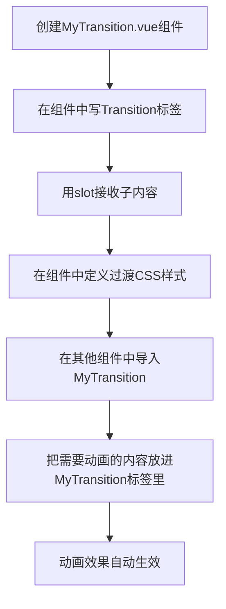
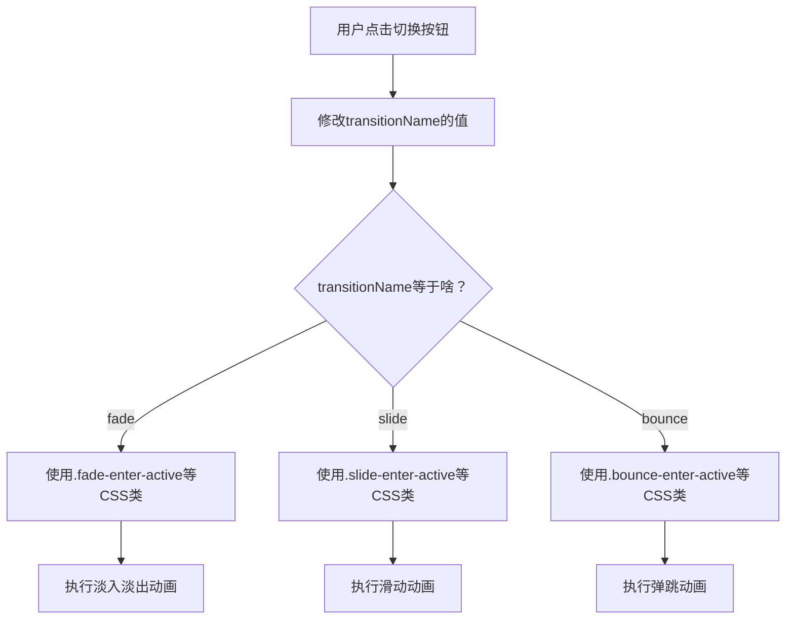

扫描[二维码](https://api2.cmdragon.cn/upload/cmder/20250304_012821924.jpg)关注或者微信搜一搜：`编程智域 前端至全栈交流与成长`

[发现1000+提升效率与开发的AI工具和实用程序](https://tools.cmdragon.cn/zh/apps?category=ai_chat)：https://tools.cmdragon.cn/zh/apps?category=ai_chat

## 一、为啥要封装Transition？

上回咱们聊了Transition组件的6个CSS类名和基本用法，应该已经能写出像模像样的进出动画了。但有个问题你肯定很快就会碰到——同一个项目里，好几个地方都要用一模一样的过渡效果。

比如你写了一个淡入淡出的弹窗动画，CSS类名写好了，时长配好了，缓动函数也调舒服了。结果产品经理说"侧边栏也要这个效果"、"下拉菜单也要这个效果"、"标签页切换也要这个效果"……你总不能每个地方都把那几行CSS和Transition配置再抄一遍吧？抄两遍还行，抄十遍你自己都想打自己。

这就好比你在家里经常需要拧螺丝，每次都去工具箱里翻螺丝刀，翻到之后用完随手一扔，下次又要翻。聪明人的做法是啥？把螺丝刀固定放在一个位置，随用随取。封装Transition组件也是这个道理——把过渡效果"打包"成一个独立组件，哪里需要往哪里搬，改一处全局生效。

封装Transition的好处总结一下：

- **不用重复写CSS**：过渡样式定义一次，到处引用
- **改一处全局生效**：产品说"动画改慢一点"，改一个组件就行，不用满项目找
- **团队协作更方便**：别人用你的组件不用关心动画细节，直接用就完事
- **代码更干净**：业务组件里不会堆一堆过渡相关的CSS

那具体咋封装呢？往下看。

## 二、用插槽封装可复用Transition组件

### 基本封装思路

封装Transition组件的核心思路特别简单：把`<Transition>`和它对应的CSS样式放在一个独立的`.vue`文件里，然后用`<slot>`把子内容"接"进来。这样外面用的时候，只需要把想要动画的内容塞进去就行。

先看个流程图，把封装思路理一理：



说白了就是三步：建组件、放slot、写样式。下面直接上代码。

### MyTransition组件代码

先创建`MyTransition.vue`：

```vue
<!-- MyTransition.vue - 可复用的淡入淡出过渡组件 -->
<template>
  <!-- Transition组件，name设为my-transition -->
  <!-- duration可以控制过渡时长，这里先写死，后面会改成props -->
  <Transition name="my-transition">
    <!-- 用slot把父组件传进来的子内容渲染出来 -->
    <slot></slot>
  </Transition>
</template>

<script setup>
// 目前不需要任何JS逻辑
// 过渡效果完全由CSS控制
</script>

<style scoped>
/* 进入动画的活跃状态：定义过渡属性和时长 */
.my-transition-enter-active {
  transition:
    opacity 0.5s ease,
    transform 0.5s ease;
}

/* 离开动画的活跃状态：和进入一样的过渡配置 */
.my-transition-leave-active {
  transition:
    opacity 0.3s ease,
    transform 0.3s ease;
}

/* 进入的起始状态：透明 + 向下偏移20px */
.my-transition-enter-from {
  opacity: 0;
  transform: translateY(20px);
}

/* 离开的结束状态：透明 + 向下偏移20px */
.my-transition-leave-to {
  opacity: 0;
  transform: translateY(20px);
}
</style>
```

你看，这个组件做的事情就是：定义了一个名叫`my-transition`的过渡效果，包含淡入淡出+轻微上下移动的动画。所有CSS都封装在组件内部，外面完全不用管。

### 使用MyTransition组件

在别的组件里用起来特别简单：

```vue
<!-- App.vue - 使用可复用的MyTransition组件 -->
<template>
  <div class="app">
    <!-- 切换按钮 -->
    <button @click="show = !show">切换显示</button>

    <!-- 用MyTransition包裹需要动画的元素 -->
    <MyTransition>
      <div v-if="show" class="box">我是被动画包裹的内容</div>
    </MyTransition>

    <!-- 同一个动画效果，另一个地方也能用 -->
    <MyTransition>
      <p v-if="show" class="text">这段文字也有一样的动画</p>
    </MyTransition>
  </div>
</template>

<script setup>
import { ref } from "vue";
// 导入封装好的MyTransition组件
import MyTransition from "./MyTransition.vue";

// 控制显示/隐藏
const show = ref(true);
</script>

<style>
.box {
  width: 200px;
  height: 200px;
  background: #42b883;
  color: white;
  display: flex;
  align-items: center;
  justify-content: center;
  border-radius: 8px;
  margin-top: 20px;
}

.text {
  margin-top: 10px;
  color: #333;
  font-size: 16px;
}
</style>
```

就这么简单！导入组件、包上去、完事。以后产品说"动画改成0.8秒"，你只需要去`MyTransition.vue`里改一个数字，所有用到这个组件的地方自动更新。

不过你可能已经发现了——现在这个组件的动画参数是写死的，时长0.5秒、偏移20px，都没法改。要是有的地方想慢一点、有的地方想快一点咋办？这就需要给组件加props了。

## 三、带props的可复用Transition

### 让过渡参数可配置

给MyTransition加上props，让外部可以控制过渡时长、延迟、缓动函数这些参数。这样同一个组件，传不同的props就能有不同的效果。

```vue
<!-- MyTransition.vue - 带props的可复用过渡组件 -->
<template>
  <!-- 通过v-bind把props传给Transition -->
  <!-- name、duration、mode等属性都可以动态绑定 -->
  <Transition :name="name" :duration="duration" :mode="mode">
    <slot></slot>
  </Transition>
</template>

<script setup>
// 定义props，让外部可以控制过渡参数
defineProps({
  // 过渡名称，决定CSS类名前缀，默认my-transition
  name: {
    type: String,
    default: "my-transition",
  },
  // 过渡持续时间（毫秒），可以是一个数字或对象{ enter: number, leave: number }
  duration: {
    type: [Number, Object],
    default: undefined,
  },
  // 过渡模式：out-in（先出后进）、in-out（先进后出）、默认（同时）
  mode: {
    type: String,
    default: undefined,
  },
  // 进入动画时长（秒），用于CSS变量
  enterDuration: {
    type: Number,
    default: 0.5,
  },
  // 离开动画时长（秒），用于CSS变量
  leaveDuration: {
    type: Number,
    default: 0.3,
  },
  // 缓动函数
  easing: {
    type: String,
    default: "ease",
  },
  // 进入时的偏移距离（px）
  offset: {
    type: Number,
    default: 20,
  },
});
</script>

<style scoped>
/* 用CSS自定义属性（变量）来接收props的值 */
/* 这样CSS里的时长、偏移量等都可以动态控制 */
.my-transition-enter-active {
  transition:
    opacity var(--enter-duration) var(--easing),
    transform var(--enter-duration) var(--easing);
}

.my-transition-leave-active {
  transition:
    opacity var(--leave-duration) var(--easing),
    transform var(--leave-duration) var(--easing);
}

.my-transition-enter-from {
  opacity: 0;
  transform: translateY(var(--offset));
}

.my-transition-leave-to {
  opacity: 0;
  transform: translateY(var(--offset));
}
</style>
```

等一下，上面的代码有个问题——CSS自定义属性不能直接从Vue的props传进去。我们需要用`v-bind`在`<style>`里绑定，或者换一种方式。Vue 3的`<style>`标签支持`v-bind()`函数来绑定响应式数据，但这里props不是响应式的CSS变量。

更好的做法是通过Transition的内联样式或者用计算属性来动态生成CSS变量。咱们换一个方案——直接在模板上绑定style：

```vue
<!-- MyTransition.vue - 用CSS变量+内联style实现动态props -->
<template>
  <!-- 根元素上绑定CSS变量，这样子元素都能继承 -->
  <div
    class="my-transition-wrapper"
    :style="{
      '--enter-duration': enterDuration + 's',
      '--leave-duration': leaveDuration + 's',
      '--easing': easing,
      '--offset': offset + 'px',
    }"
  >
    <Transition :name="name" :duration="duration" :mode="mode">
      <slot></slot>
    </Transition>
  </div>
</template>

<script setup>
defineProps({
  name: {
    type: String,
    default: "my-transition",
  },
  duration: {
    type: [Number, Object],
    default: undefined,
  },
  mode: {
    type: String,
    default: undefined,
  },
  enterDuration: {
    type: Number,
    default: 0.5,
  },
  leaveDuration: {
    type: Number,
    default: 0.3,
  },
  easing: {
    type: String,
    default: "ease",
  },
  offset: {
    type: Number,
    default: 20,
  },
});
</script>

<style scoped>
/* CSS变量从父元素的style中继承 */
.my-transition-enter-active {
  transition:
    opacity var(--enter-duration) var(--easing),
    transform var(--enter-duration) var(--easing);
}

.my-transition-leave-active {
  transition:
    opacity var(--leave-duration) var(--easing),
    transform var(--leave-duration) var(--easing);
}

.my-transition-enter-from {
  opacity: 0;
  transform: translateY(var(--offset));
}

.my-transition-leave-to {
  opacity: 0;
  transform: translateY(var(--offset));
}
</style>
```

不过这个方案有个小瑕疵——外层多了一个`<div>`包裹。如果你介意这个额外的DOM节点，可以用Vue 3的`v-bind()` in CSS语法，这是最优雅的方案：

```vue
<!-- MyTransition.vue - 最优雅的方案：v-bind() in CSS -->
<template>
  <Transition :name="name" :duration="duration" :mode="mode">
    <slot></slot>
  </Transition>
</template>

<script setup>
const props = defineProps({
  name: {
    type: String,
    default: "my-transition",
  },
  duration: {
    type: [Number, Object],
    default: undefined,
  },
  mode: {
    type: String,
    default: undefined,
  },
  enterDuration: {
    type: Number,
    default: 0.5,
  },
  leaveDuration: {
    type: Number,
    default: 0.3,
  },
  easing: {
    type: String,
    default: "ease",
  },
  offset: {
    type: Number,
    default: 20,
  },
});
</script>

<style scoped>
/* Vue 3的v-bind()可以直接在CSS中绑定组件的响应式数据 */
.my-transition-enter-active {
  transition:
    opacity v-bind('props.enterDuration + "s"') v-bind("props.easing"),
    transform v-bind('props.enterDuration + "s"') v-bind("props.easing");
}

.my-transition-leave-active {
  transition:
    opacity v-bind('props.leaveDuration + "s"') v-bind("props.easing"),
    transform v-bind('props.leaveDuration + "s"') v-bind("props.easing");
}

.my-transition-enter-from {
  opacity: 0;
  transform: translateY(v-bind('props.offset + "px"'));
}

.my-transition-leave-to {
  opacity: 0;
  transform: translateY(v-bind('props.offset + "px"'));
}
</style>
```

`v-bind()` in CSS 是Vue 3.2+引入的特性，它会在运行时把组件的响应式数据注入到CSS中。这样既没有多余的DOM节点，又能动态控制样式参数，简直完美。

### 不同场景传不同props

现在你可以在不同场景下用同一个组件，但传不同的参数：

```vue
<!-- 不同场景使用带props的MyTransition -->
<template>
  <div>
    <!-- 弹窗：慢速淡入淡出，偏移大 -->
    <MyTransition
      :enter-duration="0.8"
      :leave-duration="0.5"
      :offset="40"
      easing="cubic-bezier(0.4, 0, 0.2, 1)"
    >
      <div v-if="showModal" class="modal">弹窗内容</div>
    </MyTransition>

    <!-- 提示条：快速出现消失，偏移小 -->
    <MyTransition :enter-duration="0.3" :leave-duration="0.2" :offset="10">
      <div v-if="showToast" class="toast">操作成功</div>
    </MyTransition>

    <!-- 侧边栏：中等速度，从左滑入 -->
    <MyTransition name="slide" :enter-duration="0.4" :leave-duration="0.3">
      <div v-if="showSidebar" class="sidebar">侧边栏内容</div>
    </MyTransition>
  </div>
</template>

<script setup>
import { ref } from "vue";
import MyTransition from "./MyTransition.vue";

const showModal = ref(false);
const showToast = ref(false);
const showSidebar = ref(false);
</script>
```

一个组件，三种效果，全靠props控制。这就是封装的威力。

## 四、动态过渡——运行时切换动画

### 动态name属性

前面封装的组件虽然能通过props配置参数，但动画的"类型"（淡入淡出、滑动、弹跳……）还是由CSS类名决定的。那如果我想在运行时切换动画类型呢？比如用户点个按钮，动画从"淡入淡出"变成"弹跳"？

Transition组件的`name`属性是可以动态绑定的。`:name="transitionName"`，只要`transitionName`的值变了，对应的CSS类名前缀就变了，动画效果自然就跟着变了。



这个流程图说的很清楚：name变了，CSS类名前缀就变了，动画效果就切换了。

### 完整代码示例：动态切换三种动画

```vue
<!-- DynamicTransition.vue - 动态切换过渡效果 -->
<template>
  <div class="demo">
    <!-- 三个按钮，切换不同的过渡名称 -->
    <div class="controls">
      <button
        v-for="item in transitions"
        :key="item.name"
        :class="{ active: currentTransition === item.name }"
        @click="currentTransition = item.name"
      >
        {{ item.label }}
      </button>
    </div>

    <!-- 动态绑定name属性 -->
    <Transition :name="currentTransition" mode="out-in">
      <!-- key很重要！让Vue知道这是不同的元素，需要触发过渡 -->
      <div :key="currentTransition" class="box">
        当前动画：{{ currentTransition }}
      </div>
    </Transition>

    <!-- 切换显示/隐藏来触发动画 -->
    <button @click="show = !show" class="toggle-btn">触发动画</button>

    <!-- 用动态name触发进出动画 -->
    <Transition :name="currentTransition">
      <div v-if="show" class="content">我有动画效果哦</div>
    </Transition>
  </div>
</template>

<script setup>
import { ref } from "vue";

// 当前选中的过渡名称
const currentTransition = ref("fade");

// 控制元素的显示隐藏
const show = ref(true);

// 可选的过渡效果列表
const transitions = [
  { name: "fade", label: "淡入淡出" },
  { name: "slide", label: "滑动" },
  { name: "bounce", label: "弹跳" },
];
</script>

<style>
/* 淡入淡出效果 */
.fade-enter-active,
.fade-leave-active {
  transition: opacity 0.5s ease;
}
.fade-enter-from,
.fade-leave-to {
  opacity: 0;
}

/* 滑动效果 */
.slide-enter-active,
.slide-leave-active {
  transition: all 0.5s ease;
}
.slide-enter-from {
  transform: translateX(-30px);
  opacity: 0;
}
.slide-leave-to {
  transform: translateX(30px);
  opacity: 0;
}

/* 弹跳效果 */
.bounce-enter-active {
  animation: bounce-in 0.5s;
}
.bounce-leave-active {
  animation: bounce-in 0.5s reverse;
}

@keyframes bounce-in {
  0% {
    transform: scale(0);
    opacity: 0;
  }
  50% {
    transform: scale(1.1);
  }
  100% {
    transform: scale(1);
    opacity: 1;
  }
}

/* 样式 */
.controls {
  margin-bottom: 20px;
}
.controls button {
  margin-right: 10px;
  padding: 8px 16px;
  border: 1px solid #ddd;
  border-radius: 4px;
  background: white;
  cursor: pointer;
}
.controls button.active {
  background: #42b883;
  color: white;
  border-color: #42b883;
}
.box {
  width: 200px;
  height: 80px;
  background: #42b883;
  color: white;
  display: flex;
  align-items: center;
  justify-content: center;
  border-radius: 8px;
  margin: 20px 0;
}
.content {
  padding: 20px;
  background: #f0f0f0;
  border-radius: 8px;
  margin-top: 10px;
}
.toggle-btn {
  margin-top: 10px;
  padding: 8px 20px;
  background: #35495e;
  color: white;
  border: none;
  border-radius: 4px;
  cursor: pointer;
}
</style>
```

这段代码的核心就是`:name="currentTransition"`——当`currentTransition`从`fade`变成`slide`，Transition组件就会去找`.slide-enter-active`这些CSS类名，动画效果自然就切换了。

### 动态props：计算属性生成过渡参数

除了动态name，你还可以通过计算属性动态生成Transition的其他属性。比如根据当前主题色来决定动画时长：

```vue
<!-- 动态props示例 -->
<template>
  <!-- 根据isDark动态切换不同的过渡配置 -->
  <Transition
    :name="transitionName"
    :duration="isDark ? { enter: 800, leave: 600 } : { enter: 300, leave: 200 }"
    mode="out-in"
  >
    <div :key="currentView" class="view">
      {{ currentView }}
    </div>
  </Transition>
</template>

<script setup>
import { ref, computed } from "vue";

const isDark = ref(false);
const currentView = ref("首页");

// 根据主题动态选择过渡名称
const transitionName = computed(() => {
  return isDark.value ? "dark-fade" : "light-fade";
});
</script>
```

这种写法让过渡效果可以根据应用状态动态调整，灵活性拉满。暗色主题下动画慢一点、优雅一点；亮色主题下动画快一点、利落一点——用户体验一下子就不一样了。

### 封装动态过渡组件

把动态过渡也封装成组件，用起来更方便：

```vue
<!-- DynamicTransition.vue - 封装动态过渡组件 -->
<template>
  <Transition :name="currentName" v-bind="$attrs">
    <slot></slot>
  </Transition>
</template>

<script setup>
import { computed } from "vue";

const props = defineProps({
  // 过渡类型：fade / slide / bounce
  type: {
    type: String,
    default: "fade",
  },
  // 方向：up / down / left / right（用于slide类型）
  direction: {
    type: String,
    default: "up",
  },
});

// 根据type和direction计算最终的过渡名称
const currentName = computed(() => {
  if (props.type === "slide") {
    return `slide-${props.direction}`;
  }
  return props.type;
});
</script>
```

使用的时候：

```vue
<!-- 滑动方向也能动态切换 -->
<DynamicTransition :type="animType" :direction="animDirection">
  <div v-if="show">内容</div>
</DynamicTransition>
```

这样你就有了一个既能切换动画类型、又能控制方向的过渡组件，基本上覆盖了大部分场景。

## 五、TransitionGroup——列表也能有动画

### TransitionGroup是啥？

到目前为止咱们聊的都是单个元素的过渡。但实际开发中，你经常会碰到列表的增删改——比如待办事项列表里加一条、删一条，或者标签列表里拖拽排序。这些操作如果硬邦邦地出现和消失，看着也不舒服。

Vue 3提供了一个`<TransitionGroup>`组件，专门给列表加过渡动画。它和`<Transition>`有几个关键区别：

| 特性         | Transition    | TransitionGroup         |
| ------------ | ------------- | ----------------------- |
| 包裹内容     | 单个元素/组件 | v-for列表               |
| 渲染包裹元素 | 不渲染额外DOM | 默认不渲染（可配置tag） |
| 移动动画     | 不支持        | 支持（通过FLIP动画）    |
| key要求      | 不需要        | 每个列表项必须有唯一key |

其中最厉害的是"移动动画"——当列表项的位置发生变化时（比如排序、删除中间项导致后面的项往前移），TransitionGroup可以自动给这些位移加上平滑的过渡效果。这个用的是FLIP动画技术（First, Last, Invert, Play），不用你自己算位置，Vue全帮你搞定了。

### 基本用法

```vue
<!-- TransitionGroup基本示例 -->
<template>
  <div>
    <button @click="addItem">添加项目</button>
    <button @click="removeItem">删除项目</button>

    <!-- TransitionGroup包裹v-for列表 -->
    <!-- tag属性指定渲染的容器元素，不写就不渲染额外标签 -->
    <TransitionGroup name="list" tag="ul">
      <li v-for="item in items" :key="item.id" class="list-item">
        {{ item.text }}
        <button @click="removeById(item.id)">删除</button>
      </li>
    </TransitionGroup>
  </div>
</template>

<script setup>
import { ref } from "vue";

// 初始列表数据
const items = ref([
  { id: 1, text: "学习Vue 3" },
  { id: 2, text: "写博客文章" },
  { id: 3, text: "喝杯咖啡" },
]);

// 自增ID
let nextId = 4;

// 添加项目
function addItem() {
  items.value.push({
    id: nextId++,
    text: `新项目 ${nextId - 1}`,
  });
}

// 删除最后一个项目
function removeItem() {
  items.value.pop();
}

// 根据ID删除指定项目
function removeById(id) {
  const index = items.value.findIndex((item) => item.id === id);
  if (index > -1) {
    items.value.splice(index, 1);
  }
}
</script>

<style>
/* 列表项进入动画 */
.list-enter-active {
  transition: all 0.5s ease;
}

/* 列表项离开动画 */
.list-leave-active {
  transition: all 0.3s ease;
}

/* 进入起始状态：从右侧滑入 + 透明 */
.list-enter-from {
  opacity: 0;
  transform: translateX(30px);
}

/* 离开结束状态：向左滑出 + 透明 */
.list-leave-to {
  opacity: 0;
  transform: translateX(-30px);
}

/* 关键！列表项移动时的过渡效果 */
/* 没有这个，删除中间项时后面的项会"瞬移"而不是"滑动" */
.list-move {
  transition: transform 0.5s ease;
}

/* 离开的项脱离文档流，这样移动动画才不会被挡住 */
.list-leave-active {
  position: absolute;
}

.list-item {
  padding: 10px 16px;
  margin: 4px 0;
  background: #f5f5f5;
  border-radius: 4px;
  display: flex;
  justify-content: space-between;
  align-items: center;
  width: 300px;
}
</style>
```

有几个要点需要特别注意：

1. **每个列表项必须有唯一的`key`**：不能用index，因为index会变，Vue就分不清哪个是哪个了
2. **`.list-move`类**：这个是TransitionGroup专属的，控制列表项移动时的过渡效果。没有它，删除中间项时后面的项会瞬间跳过去
3. **离开时`position: absolute`**：让正在离开的元素脱离文档流，这样其他元素的移动动画才不会被"卡住"

TransitionGroup的功能远不止这些，比如还有自定义移动过渡、交错动画、和GSAP等动画库配合等高级用法。不过这些属于进阶内容了，咱们先把基础打牢，后面再单独开一篇细聊。

## 课后 Quiz

### 问题一：封装可复用Transition组件时，用`<slot>`的作用是啥？能不能不用slot？

**答案解析：**

`<slot>`的作用是接收父组件传进来的子内容，让MyTransition组件变成一个"壳子"——动画效果是固定的，但里面放什么内容由使用者决定。

如果不用slot，你就得把内容硬编码在组件里，那这个组件就只能给那一个元素做动画了，完全失去了复用的意义。slot就像一个"占位符"，告诉Vue"这里将来会塞进来真正的DOM内容"。

这就好比一个相框——框是固定的（过渡效果），但里面放什么照片（子内容）由你决定。没有slot就相当于相框和照片焊死在一起了，那还叫啥相框。

### 问题二：动态过渡中，`:name="transitionName"`切换动画类型的原理是啥？

**答案解析：**

Transition组件的`name`属性决定了CSS类名的前缀。比如`name="fade"`时，Vue会找`.fade-enter-active`、`.fade-leave-active`这些类名；`name="slide"`时，就找`.slide-enter-active`、`.slide-leave-active`。

当`transitionName`的值从`fade`变成`slide`时，Transition组件下次触发过渡时就会使用新的类名前缀，对应的CSS样式不同，动画效果自然就不同了。

需要注意的是，name的切换不会影响当前正在执行的动画——它只影响下一次触发的过渡。所以切换name之后，需要再次触发元素的显示/隐藏（比如v-if从false变true）才能看到新动画效果。

### 问题三：TransitionGroup中`.list-move`类和离开时`position: absolute`分别起什么作用？

**答案解析：**

`.list-move`类控制的是列表项位置变化时的过渡效果。当你删除列表中间的一项时，后面的项需要往前移填补空位。没有`.list-move`，这个移动是瞬间完成的；有了它，移动就有了平滑的过渡动画。

离开时设置`position: absolute`是因为：正在执行离开动画的元素还占据着文档流中的位置，这会导致后面的元素无法开始移动动画（因为位置还没空出来）。把离开的元素设为绝对定位，它就脱离了文档流，其他元素就可以立刻开始移动了。

这两个配合起来，才能实现"删一项，后面的项平滑滑过来"的效果。缺了任何一个，动画都会"卡"或者"跳"。

## 常见报错解决方案

### 报错一：`<Transition> expects exactly one child element or component`

**产生原因：**

Transition组件只能包裹一个直接子元素。如果你在里面放了多个兄弟元素，或者啥都没放，Vue就会报这个错。

**解决方案：**

确保Transition里面只有一个直接子元素。如果有多个元素需要同时动画，用`<template>`不行（template不是真实DOM），应该用`<TransitionGroup>`或者把多个元素包在一个`<div>`里。

```vue
<!-- 错误写法：两个兄弟元素 -->
<Transition>
  <div v-if="show">内容1</div>
  <div v-if="show">内容2</div>
</Transition>

<!-- 正确写法一：包在一个div里 -->
<Transition>
  <div v-if="show">
    <div>内容1</div>
    <div>内容2</div>
  </div>
</Transition>

<!-- 正确写法二：用TransitionGroup -->
<TransitionGroup name="fade">
  <div v-if="show" key="1">内容1</div>
  <div v-if="show" key="2">内容2</div>
</TransitionGroup>
```

**预防建议：** 每次写Transition的时候，养成习惯检查里面是不是只有一个直接子元素。

### 报错二：封装的Transition组件动画不生效

**产生原因：**

最常见的原因是CSS类名前缀和`name`属性不匹配。比如你设了`name="my-transition"`，但CSS写的是`.fade-enter-active`，那Vue根本找不到对应的样式。

另一个常见原因是`<style scoped>`导致的。scoped会给CSS选择器加上属性选择器，但Transition组件动态添加的CSS类名可能无法正确匹配。

**解决方案：**

1. 确保CSS类名前缀和name属性一致
2. 如果用了scoped，过渡相关的CSS要么不加scoped，要么用`:deep()`穿透

```vue
<!-- 确保name和CSS前缀一致 -->
<Transition name="my-fade">
  <div v-if="show">内容</div>
</Transition>

<!-- 对应的CSS必须是 .my-fade-xxx -->
<style>
/* 不要加scoped，或者用:deep() */
.my-fade-enter-active {
  transition: opacity 0.5s ease;
}
.my-fade-enter-from {
  opacity: 0;
}
</style>
```

**预防建议：** 封装组件时，先在非scoped环境下测试动画是否生效，确认没问题后再处理样式隔离问题。

### 报错三：TransitionGroup列表项移动时没有动画，直接"瞬移"

**产生原因：**

缺少`.xxx-move`类的过渡样式，或者离开的元素没有设置`position: absolute`。这两个缺一不可——move类提供移动过渡效果，absolute让离开的元素让出位置。

**解决方案：**

确保同时添加move过渡类和离开时的绝对定位：

```css
/* 必须有这个！控制移动动画 */
.list-move {
  transition: transform 0.5s ease;
}

/* 离开时脱离文档流，让其他元素能移动 */
.list-leave-active {
  transition: all 0.3s ease;
  position: absolute; /* 关键！ */
}

.list-leave-to {
  opacity: 0;
}
```

**预防建议：** 每次用TransitionGroup的时候，把move类和absolute定位当作"标配"一起写上，别等出了问题再补。

参考链接：https://vuejs.org/guide/built-ins/transition.html

余下文章内容请点击跳转至 个人博客页面 或者 扫描[二维码](https://api2.cmdragon.cn/upload/cmder/20250304_012821924.jpg)关注或者微信搜一搜：`编程智域 前端至全栈交流与成长`，阅读完整的文章：[把Transition包成组件复用，还能动态切换动画效果](https://blog.cmdragon.cn/posts/f2a3b4c5d6e7f8a9b0c1d2e3f4a5b6c7/)

<details>
<summary>往期文章归档</summary>

- [Vue 3 静态与动态 Props 如何传递？TypeScript 类型约束有何必要？](https://blog.cmdragon.cn/posts/94ab48753b64780ca3ab7a7115ae8522/)
- [Vue 3中组件局部注册的优势与实现方式如何？](https://blog.cmdragon.cn/posts/dbf576e744870f6de26fd8a2e03e47da/)
- [如何在Vue3中优化生命周期钩子性能并规避常见陷阱？](https://blog.cmdragon.cn/posts/12d98b3b9ccd6c19a1b169d720ac5c80/)
- [Vue 3 Composition API生命周期钩子：如何实现从基础理解到高阶复用？](https://blog.cmdragon.cn/posts/8884e2b70287fcb263c57648eeb27419/)
- [Vue 3生命周期钩子实战指南：如何正确选择onMounted、onUpdated与onUnmounted的应用场景？](https://blog.cmdragon.cn/posts/883c6dbc50ae4183770a4462e0b8ae4d/)
- [Vue 3中生命周期钩子与响应式系统如何实现协同工作？](https://blog.cmdragon.cn/posts/70dad360ffa9dce14d0d69611b8cb019/)
- [Vue 3组件生命周期钩子的执行顺序与使用场景是什么？](https://blog.cmdragon.cn/posts/db44294a78dc9f666f67b053f6c83567/)
- [Vue组件全局注册与局部注册如何抉择？](https://blog.cmdragon.cn/posts/43ead630ea17da65d99ad2eb8188e472/)
- [Vue3组件化开发中，Props与Emits如何实现数据流转与事件协作？](https://blog.cmdragon.cn/posts/8cff7d2df113da66ea7be560c4d1d22a/)
- [Vue 3模板引用如何与其他特性协同实现复杂交互？](https://blog.cmdragon.cn/posts/331bf75d114ab09116eadfcdca602b58/)
- [Vue 3 v-for中模板引用如何实现高效管理与动态控制？](https://blog.cmdragon.cn/posts/cb380897ddc3578b180ecf8843c774c1/)
- [Vue 3的defineExpose：如何突破script setup组件默认封装，实现精准的父子通讯？](https://blog.cmdragon.cn/posts/202ae0f4acde7128e0e31baf63732fb5/)
- [Vue 3模板引用的生命周期时机如何把握？常见陷阱该如何避免？](https://blog.cmdragon.cn/posts/7d2a0f6555ecbe92afd7d2491c427463/)
- [Vue 3模板引用如何实现父组件与子组件的高效交互？](https://blog.cmdragon.cn/posts/3fb7bdd84128b7efaaa1c979e1f28dee/)
- [Vue中为何需要模板引用？又如何高效实现DOM与组件实例的直接访问？](https://blog.cmdragon.cn/posts/23f3464ba16c7054b4783cded50c04c6/)

</details>

<details>
<summary>免费好用的热门在线工具</summary>

- [多直播聚合器 - 应用商店 | By cmdragon](https://tools.cmdragon.cn/zh/apps/multi-live-aggregator)
- [Proto文件生成器 - 应用商店 | By cmdragon](https://tools.cmdragon.cn/zh/apps/proto-file-generator)
- [图片转粒子 - 应用商店 | By cmdragon](https://tools.cmdragon.cn/zh/apps/image-to-particles)
- [视频下载器 - 应用商店 | By cmdragon](https://tools.cmdragon.cn/zh/apps/video-downloader)
- [文件格式转换器 - 应用商店 | By cmdragon](https://tools.cmdragon.cn/zh/apps/file-converter)
- [M3U8在线播放器 - 应用商店 | By cmdragon](https://tools.cmdragon.cn/zh/apps/m3u8-player)
- [快图设计 - 应用商店 | By cmdragon](https://tools.cmdragon.cn/zh/apps/quick-image-design)
- [高级文字转图片转换器 - 应用商店 | By cmdragon](https://tools.cmdragon.cn/zh/apps/text-to-image-advanced)
- [RAID 计算器 - 应用商店 | By cmdragon](https://tools.cmdragon.cn/zh/apps/raid-calculator)
- [在线PS - 应用商店 | By cmdragon](https://tools.cmdragon.cn/zh/apps/photoshop-online)
- [Mermaid 在线编辑器 - 应用商店 | By cmdragon](https://tools.cmdragon.cn/zh/apps/mermaid-live-editor)
- [数学求解计算器 - 应用商店 | By cmdragon](https://tools.cmdragon.cn/zh/apps/math-solver-calculator)
- [智能提词器 - 应用商店 | By cmdragon](https://tools.cmdragon.cn/zh/apps/smart-teleprompter)
- [魔法简历 - 应用商店 | By cmdragon](https://tools.cmdragon.cn/zh/apps/magic-resume)
- [Image Puzzle Tool - 图片拼图工具 | By cmdragon](https://tools.cmdragon.cn/zh/apps/image-puzzle-tool)
- [字幕下载工具 - 应用商店 | By cmdragon](https://tools.cmdragon.cn/zh/apps/subtitle-downloader)
- [歌词生成工具 - 应用商店 | By cmdragon](https://tools.cmdragon.cn/zh/apps/lyrics-generator)
- [网盘资源聚合搜索 - 应用商店 | By cmdragon](https://tools.cmdragon.cn/zh/apps/cloud-drive-search)
- [ASCII字符画生成器 - 应用商店 | By cmdragon](https://tools.cmdragon.cn/zh/apps/ascii-art-generator)
- [JSON Web Tokens 工具 - 应用商店 | By cmdragon](https://tools.cmdragon.cn/zh/apps/jwt-tool)
- [Bcrypt 密码工具 - 应用商店 | By cmdragon](https://tools.cmdragon.cn/zh/apps/bcrypt-tool)
- [GIF 合成器 - 应用商店 | By cmdragon](https://tools.cmdragon.cn/zh/apps/gif-composer)
- [GIF 分解器 - 应用商店 | By cmdragon](https://tools.cmdragon.cn/zh/apps/gif-decomposer)
- [文本隐写术 - 应用商店 | By cmdragon](https://tools.cmdragon.cn/zh/apps/text-steganography)
- [CMDragon 在线工具 - 高级AI工具箱与开发者套件 | 免费好用的在线工具](https://tools.cmdragon.cn/zh)
- [应用商店 - 发现1000+提升效率与开发的AI工具和实用程序 | 免费好用的在线工具](https://tools.cmdragon.cn/zh/apps?category=trending)
- [CMDragon 更新日志 - 最新更新、功能与改进 | 免费好用的在线工具](https://tools.cmdragon.cn/zh/changelog)
- [支持我们 - 成为赞助者 | 免费好用的在线工具](https://tools.cmdragon.cn/zh/sponsor)
- [AI文本生成图像 - 应用商店 | 免费好用的在线工具](https://tools.cmdragon.cn/zh/apps/text-to-image-ai)
- [临时邮箱 - 应用商店 | 免费好用的在线工具](https://tools.cmdragon.cn/zh/apps/temp-email)
- [二维码解析器 - 应用商店 | 免费好用的在线工具](https://tools.cmdragon.cn/zh/apps/qrcode-parser)
- [文本转思维导图 - 应用商店 | 免费好用的在线工具](https://tools.cmdragon.cn/zh/apps/text-to-mindmap)
- [正则表达式可视化工具 - 应用商店 | 免费好用的在线工具](https://tools.cmdragon.cn/zh/apps/regex-visualizer)
- [文件隐写工具 - 应用商店 | 免费好用的在线工具](https://tools.cmdragon.cn/zh/apps/steganography-tool)
- [IPTV 频道探索器 - 应用商店 | 免费好用的在线工具](https://tools.cmdragon.cn/zh/apps/iptv-explorer)
- [快传 - 应用商店 | By cmdragon](https://tools.cmdragon.cn/zh/apps/snapdrop)
- [随机抽奖工具 - 应用商店 | 免费好用的在线工具](https://tools.cmdragon.cn/zh/apps/lucky-draw)
- [动漫场景查找器 - 应用商店 | 免费好用的在线工具](https://tools.cmdragon.cn/zh/apps/anime-scene-finder)
- [时间工具箱 - 应用商店 | 免费好用的在线工具](https://tools.cmdragon.cn/zh/apps/time-toolkit)
- [网速测试 - 应用商店 | 免费好用的在线工具](https://tools.cmdragon.cn/zh/apps/speed-test)
- [AI 智能抠图工具 - 应用商店 | 免费好用的在线工具](https://tools.cmdragon.cn/zh/apps/background-remover)
- [背景替换工具 - 应用商店 | 免费好用的在线工具](https://tools.cmdragon.cn/zh/apps/background-replacer)
- [艺术二维码生成器 - 应用商店 | 免费好用的在线工具](https://tools.cmdragon.cn/zh/apps/artistic-qrcode)
- [Open Graph 元标签生成器 - 应用商店 | 免费好用的在线工具](https://tools.cmdragon.cn/zh/apps/open-graph-generator)
- [图像对比工具 - 应用商店 | 免费好用的在线工具](https://tools.cmdragon.cn/zh/apps/image-comparison)
- [图片压缩专业版 - 应用商店 | 免费好用的在线工具](https://tools.cmdragon.cn/zh/apps/image-compressor)
- [密码生成器 - 应用商店 | 免费好用的在线工具](https://tools.cmdragon.cn/zh/apps/password-generator)
- [SVG优化器 - 应用商店 | 免费好用的在线工具](https://tools.cmdragon.cn/zh/apps/svg-optimizer)
- [调色板生成器 - 应用商店 | 免费好用的在线工具](https://tools.cmdragon.cn/zh/apps/color-palette)
- [在线节拍器 - 应用商店 | 免费好用的在线工具](https://tools.cmdragon.cn/zh/apps/online-metronome)
- [IP归属地查询 - 应用商店 | By cmdragon](https://tools.cmdragon.cn/zh/apps/ip-geolocation)
- [CSS网格布局生成器 - 应用商店 | 免费好用的在线工具](https://tools.cmdragon.cn/zh/apps/css-grid-layout)
- [邮箱验证工具 - 应用商店 | 免费好用的在线工具](https://tools.cmdragon.cn/zh/apps/email-validator)
- [书法练习字帖 - 应用商店 | 免费好用的在线工具](https://tools.cmdragon.cn/zh/apps/calligraphy-practice)
- [金融计算器套件 - 应用商店 | 免费好用的在线工具](https://tools.cmdragon.cn/zh/apps/finance-calculator-suite)
- [中国亲戚关系计算器 - 应用商店 | 免费好用的在线工具](https://tools.cmdragon.cn/zh/apps/chinese-kinship-calculator)
- [Protocol Buffer 工具箱 - 应用商店 | 免费好用的在线工具](https://tools.cmdragon.cn/zh/apps/protobuf-toolkit)
- [IP归属地查询 - 应用商店 | 免费好用的在线工具](https://tools.cmdragon.cn/zh/apps/ip-geolocation)
- [图片无损放大 - 应用商店 | 免费好用的在线工具](https://tools.cmdragon.cn/zh/apps/image-upscaler)
- [文本比较工具 - 应用商店 | 免费好用的在线工具](https://tools.cmdragon.cn/zh/apps/text-compare)
- [IP批量查询工具 - 应用商店 | 免费好用的在线工具](https://tools.cmdragon.cn/zh/apps/ip-batch-lookup)
- [域名查询工具 - 应用商店 | 免费好用的在线工具](https://tools.cmdragon.cn/zh/apps/domain-finder)
- [DNS工具箱 - 应用商店 | 免费好用的在线工具](https://tools.cmdragon.cn/zh/apps/dns-toolkit)
- [网站图标生成器 - 应用商店 | 免费好用的在线工具](https://tools.cmdragon.cn/zh/apps/favicon-generator)
- [XML Sitemap](https://tools.cmdragon.cn/sitemap_index.xml)

</details>
