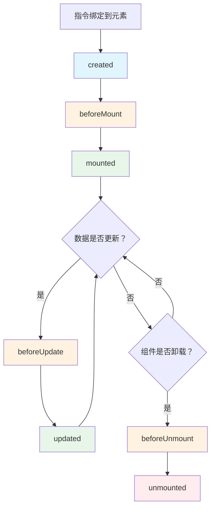
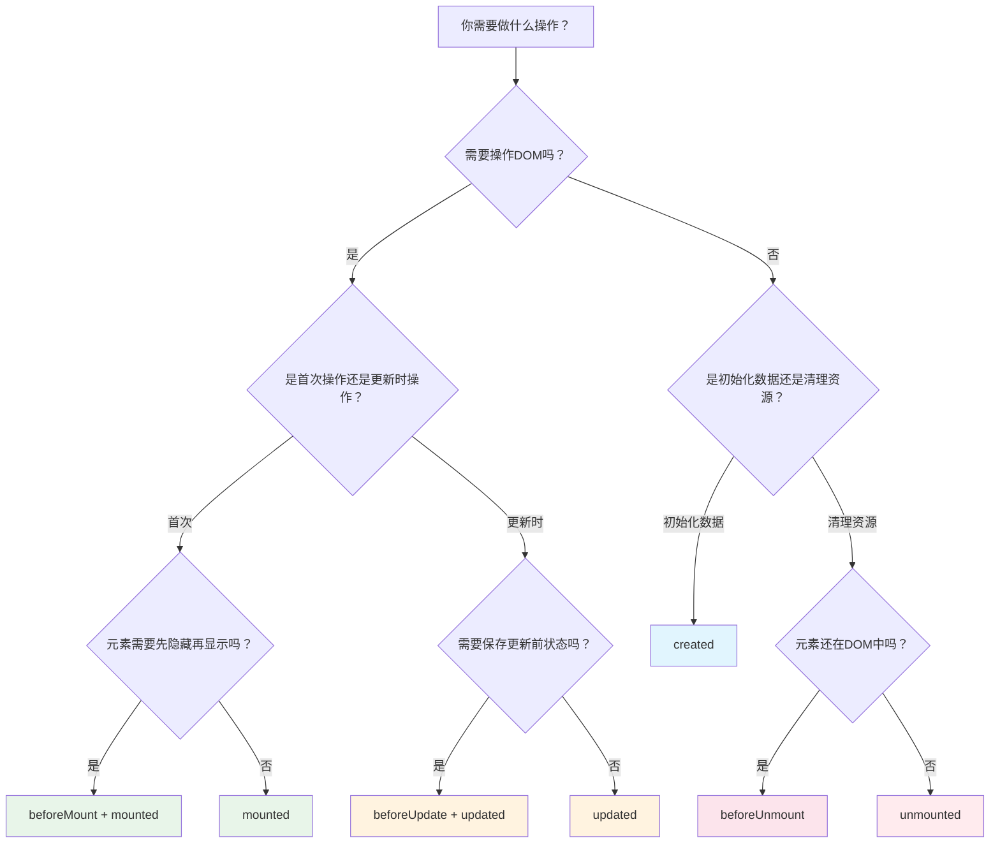

扫描[二维码](https://api2.cmdragon.cn/upload/cmder/20250304_012821924.jpg)关注或者微信搜一搜：`编程智域 前端至全栈交流与成长`

[发现1000+提升效率与开发的AI工具和实用程序](https://tools.cmdragon.cn/zh/apps?category=ai_chat)：https://tools.cmdragon.cn/

## 一、指令也有生命周期？跟组件的生命周期有啥区别？

写过Vue组件的同学肯定对`onMounted`、`onUpdated`这些钩子不陌生，但你可能不知道，自定义指令也有一套自己的生命周期钩子，而且跟组件的还不完全一样。

先说个最直观的区别：**组件钩子关注的是组件自己**，比如组件挂载了没、更新了没；而**指令钩子关注的是它绑定的那个元素**——元素挂载了没、属性变了没、被移除了没。打个比方，组件钩子像是"我的人生大事"，指令钩子像是"我盯的那个人的人生大事"。

还有一个容易忽略的点：指令钩子的触发时机跟**父组件的渲染周期**绑定。也就是说，当父组件重新渲染的时候，指令的`beforeUpdate`和`updated`才会被触发，而不是绑定元素自身有什么变化就触发。这一点后面会反复提到，先留个印象。

下面这个流程图把七个钩子的触发顺序画出来了，一目了然：



可以看到，整个流程其实跟组件的生命周期很像，但触发条件是围绕"绑定元素"来转的。接下来咱们逐个拆解。

## 二、七个钩子逐个拆解

### 2.1 created——元素还没影儿呢，但数据可以先准备

**触发时机**：绑定元素的attribute或事件监听器被应用之前。

说白了，这个时候元素虽然已经被Vue"认识"了，但还没真正出现在页面上。你可以理解为：房子已经画好图纸了，但还没开始盖。

**能做啥**：

- 初始化一些跟DOM无关的数据
- 提前设置事件监听器的引用（注意，只是准备，不是真的绑定到DOM上）
- 根据binding.value做一些前置判断

**不能做啥**：

- 操作DOM——因为元素还不存在，`el`虽然传进来了，但它还没挂载到页面上，很多DOM操作会失败

来看个简单的例子：

```js
const vPermission = {
  created(el, binding) {
    // 在created阶段记录权限信息，不做DOM操作
    const userRole = binding.value;
    // 把权限信息存到元素的dataset里，后面其他钩子可以用
    el.dataset.role = userRole;
    console.log(`指令created：当前用户角色是 ${userRole}`);
  },
};
```

这里我们用`el.dataset`来存数据，这是Vue官方推荐的方式——在不同钩子之间共享信息，用元素的`dataset`属性最靠谱。

### 2.2 beforeMount——元素即将登场前的最后准备

**触发时机**：元素被插入到DOM之前。

这个钩子用的不多，但有些场景确实需要它。比如你想在元素真正显示到页面上之前，给它设置一些初始样式，避免"闪烁"问题。

**注意**：此时元素还不在页面上！虽然`el`对象已经存在了，但`document.querySelector`是找不到它的，因为它还没被插入到DOM树里。

```js
const vFadeIn = {
  beforeMount(el) {
    // 在元素插入DOM之前，先把它设为透明
    // 这样用户就不会看到元素突然出现的"闪烁"
    el.style.opacity = "0";
    el.style.transition = "opacity 0.5s ease";
  },
  mounted(el) {
    // 元素挂载后再显示出来，实现淡入效果
    requestAnimationFrame(() => {
      el.style.opacity = "1";
    });
  },
};
```

这个`v-fade-in`指令就是`beforeMount`的经典用法：先藏起来，挂载了再显示，避免元素突然蹦出来的尴尬。

### 2.3 mounted——最常用的钩子，DOM操作的主战场

**触发时机**：绑定元素的父组件及其所有子节点都挂载完成后。

这是你用得最多的钩子，没有之一。因为到了这个阶段，元素已经在DOM树里了，你可以放心大胆地操作它——获取尺寸、添加事件监听、触发动画，啥都行。

**能做啥**：

- 操作DOM（获取元素尺寸、修改样式、添加class等）
- 添加事件监听器
- 初始化第三方库（比如ECharts、地图SDK等）
- 触发CSS动画

**经典示例：v-focus自动聚焦**

```vue
<script setup>
const vFocus = {
  mounted(el) {
    el.focus();
  },
};
</script>

<template>
  <input v-focus placeholder="我会自动获得焦点" />
</template>
```

这个指令比HTML原生的`autofocus`属性好用多了——原生`autofocus`只在页面第一次加载时生效，而`v-focus`在Vue动态插入元素时也能正常工作，比如弹窗里的输入框。

**再来看个v-resize的例子**：

```js
const vResize = {
  mounted(el, binding) {
    const callback = binding.value;
    // 创建ResizeObserver监听元素尺寸变化
    const observer = new ResizeObserver((entries) => {
      for (const entry of entries) {
        callback({
          width: entry.contentRect.width,
          height: entry.contentRect.height,
        });
      }
    });
    observer.observe(el);
    // 把observer存起来，unmounted的时候要清理
    el._resizeObserver = observer;
  },
};
```

注意这里我们把`observer`存到了`el._resizeObserver`上，这又是跨钩子共享数据的一种方式。不过更推荐用`el.dataset`或者`WeakMap`，因为直接往DOM元素上挂属性不太优雅。

### 2.4 beforeUpdate——更新前的"快照"时刻

**触发时机**：绑定元素的父组件更新前。

这个钩子的核心价值在于：**此时DOM还是旧的**。你可以在这个时机保存一些更新前的状态，比如记录元素当前的滚动位置、输入框的选区范围等。

**注意**：`beforeUpdate`不是因为指令的绑定值变了才触发的，而是因为**父组件重新渲染**了。哪怕指令的绑定值没变，只要父组件re-render了，这个钩子也会被调用。

```js
const vScroll = {
  beforeUpdate(el) {
    // 在更新前保存滚动位置
    el._savedScrollTop = el.scrollTop;
  },
  updated(el) {
    // 更新后恢复滚动位置，避免页面跳动
    if (el._savedScrollTop !== undefined) {
      el.scrollTop = el._savedScrollTop;
    }
  },
};
```

这种"保存-恢复"的模式在`beforeUpdate`/`updated`组合中非常常见。

### 2.5 updated——更新完成后的善后工作

**触发时机**：绑定元素的父组件及其所有子节点都更新完成后。

到了这个阶段，DOM已经更新好了，你可以根据新的绑定值来更新DOM状态。

**⚠️ 大坑警告**：千万不要在`updated`里修改会触发组件重新渲染的响应式数据！不然就会陷入"更新→触发updated→修改数据→再次更新→再次触发updated"的死循环，直接把浏览器卡死。

**正确用法：v-color指令根据绑定值更新颜色**

```vue
<script setup>
import { ref } from "vue";

const themeColor = ref("#42b883");

const vColor = {
  mounted(el, binding) {
    el.style.color = binding.value;
  },
  updated(el, binding) {
    // 绑定值变了，更新元素颜色
    // 这里只操作DOM样式，不修改响应式数据，安全！
    el.style.color = binding.value;
  },
};

function changeColor() {
  themeColor.value = "#35495e";
}
</script>

<template>
  <p v-color="themeColor">我的颜色会跟着themeColor变</p>
  <button @click="changeColor">换颜色</button>
</template>
```

这里`updated`里只做了`el.style.color = binding.value`，是纯DOM操作，不会触发Vue的响应式更新，所以没问题。

**错误示范（千万别这么写）**：

```js
// ❌ 错误！在updated里修改响应式数据会导致无限循环
const vBad = {
  updated(el, binding) {
    // 假设binding.value是个ref，修改它会触发重新渲染
    binding.value = "新值"; // 💀 死循环警告
  },
};
```

### 2.6 beforeUnmount——卸载前的告别准备

**触发时机**：绑定元素的父组件卸载前。

这个钩子用得比较少，因为大部分清理工作放在`unmounted`里就行。但如果你需要在元素还存在于DOM中时做一些"临终遗言"式的操作，比如通知其他组件"我要走了"，可以在这里做。

```js
const vTrack = {
  beforeUnmount(el, binding) {
    // 组件卸载前，上报最后一次数据
    const tracker = binding.value;
    tracker.reportLastState();
  },
};
```

### 2.7 unmounted——清理战场，不留垃圾

**触发时机**：绑定元素的父组件卸载后。

**这个钩子超级重要！** 如果你在`mounted`里添加了事件监听器、定时器、Observer等，就必须在`unmounted`里清理掉，否则就会内存泄漏——浏览器以为你还在用这些资源，一直不释放，时间长了页面就越来越卡。

**示例：移除resize监听**

```js
const vResize = {
  mounted(el, binding) {
    const callback = binding.value;
    const observer = new ResizeObserver((entries) => {
      for (const entry of entries) {
        callback({
          width: entry.contentRect.width,
          height: entry.contentRect.height,
        });
      }
    });
    observer.observe(el);
    el._resizeObserver = observer;
  },
  unmounted(el) {
    // 关键！不清理就会内存泄漏
    if (el._resizeObserver) {
      el._resizeObserver.disconnect();
      el._resizeObserver = null;
    }
  },
};
```

再来看个清理定时器的例子：

```js
const vAutoScroll = {
  mounted(el, binding) {
    const speed = binding.value || 1;
    el._scrollTimer = setInterval(() => {
      el.scrollTop += speed;
    }, 16);
  },
  unmounted(el) {
    // 不清理这个定时器，组件卸载后它还会一直跑
    if (el._scrollTimer) {
      clearInterval(el._scrollTimer);
      el._scrollTimer = null;
    }
  },
};
```

**一句话总结**：凡是在`mounted`里"借"的东西（事件监听、定时器、Observer），都必须在`unmounted`里"还"回去。

## 三、一个完整的v-resize指令，七个钩子全用上

前面都是零散的例子，现在咱们来写一个完整的指令，把七个钩子都用上，看看它们在实际项目中是怎么配合的。

这个`v-resize`指令的功能是：监听绑定元素的尺寸变化，当尺寸改变时回调通知外部，并且支持设置最小尺寸阈值（低于阈值不触发回调）。

```vue
<script setup>
import { ref, onMounted } from "vue";

const boxWidth = ref(0);
const boxHeight = ref(0);
const showBox = ref(true);
const minSize = ref(100);

const vResize = {
  created(el, binding) {
    // 初始化：记录回调函数和配置
    const { callback, min } = binding.value;
    el._resizeCallback = callback;
    el._resizeMinSize = min || 0;
    console.log("v-resize created：指令已创建，准备就绪");
  },

  beforeMount(el) {
    // 在元素插入前设置初始样式，避免闪烁
    el.style.transition = "width 0.3s, height 0.3s";
    console.log("v-resize beforeMount：元素即将插入DOM");
  },

  mounted(el, binding) {
    // 元素已挂载，创建ResizeObserver开始监听
    const observer = new ResizeObserver((entries) => {
      for (const entry of entries) {
        const { width, height } = entry.contentRect;
        // 尺寸低于阈值就不触发回调
        if (width < el._resizeMinSize || height < el._resizeMinSize) {
          console.log(
            `尺寸 ${width}x${height} 低于阈值 ${el._resizeMinSize}，忽略`,
          );
          return;
        }
        el._resizeCallback({ width, height });
      }
    });
    observer.observe(el);
    el._resizeObserver = observer;
    console.log("v-resize mounted：ResizeObserver已启动");
  },

  beforeUpdate(el) {
    // 更新前保存当前尺寸，方便对比
    el._prevSize = {
      width: el.offsetWidth,
      height: el.offsetHeight,
    };
    console.log("v-resize beforeUpdate：保存更新前尺寸", el._prevSize);
  },

  updated(el, binding) {
    // 更新后检查配置是否变化
    const { callback, min } = binding.value;
    if (min !== el._resizeMinSize) {
      el._resizeMinSize = min || 0;
      console.log(`v-resize updated：最小尺寸阈值更新为 ${min}`);
    }
    el._resizeCallback = callback;
  },

  beforeUnmount(el) {
    // 卸载前上报最后一次尺寸数据
    if (el._resizeCallback) {
      el._resizeCallback({
        width: el.offsetWidth,
        height: el.offsetHeight,
        final: true,
      });
    }
    console.log("v-resize beforeUnmount：上报最终尺寸");
  },

  unmounted(el) {
    // 清理ResizeObserver，防止内存泄漏
    if (el._resizeObserver) {
      el._resizeObserver.disconnect();
      el._resizeObserver = null;
    }
    el._resizeCallback = null;
    el._prevSize = null;
    console.log("v-resize unmounted：资源已清理");
  },
};

function onResize({ width, height, final }) {
  boxWidth.value = Math.round(width);
  boxHeight.value = Math.round(height);
  if (final) {
    console.log("元素即将被移除，最终尺寸已记录");
  }
}

const boxStyle = ref({
  width: "300px",
  height: "200px",
  background: "#42b883",
  resize: "both",
  overflow: "hidden",
  padding: "20px",
  color: "#fff",
});
</script>

<template>
  <div>
    <p>当前尺寸：{{ boxWidth }} x {{ boxHeight }}</p>
    <p>最小尺寸阈值：{{ minSize }}px</p>

    <button @click="showBox = !showBox">
      {{ showBox ? "隐藏元素（触发卸载）" : "显示元素（触发挂载）" }}
    </button>

    <div
      v-if="showBox"
      v-resize="{ callback: onResize, min: minSize }"
      :style="boxStyle"
    >
      拖拽右下角调整我的大小
    </div>
  </div>
</template>
```

运行环境说明：

- Vue 3.5+（`<script setup>`语法）
- 现代浏览器（需要支持`ResizeObserver`，主流浏览器都已支持）
- 无需额外安装第三方库

打开浏览器控制台，你会看到七个钩子依次打印的日志。拖拽元素右下角改变尺寸，`mounted`里创建的`ResizeObserver`就会触发回调；点击隐藏按钮，`beforeUnmount`和`unmounted`会依次执行清理工作。

## 四、钩子选择的决策流程

写了这么多，你可能还是会有点懵："我这段代码到底该放哪个钩子里？"别急，下面这个决策流程图帮你理清思路：



用文字总结一下就是：

| 操作类型           | 推荐钩子        | 原因                            |
| ------------------ | --------------- | ------------------------------- |
| 操作DOM（首次）    | `mounted`       | 元素已在DOM中，可以安全操作     |
| 操作DOM（更新时）  | `updated`       | DOM已更新完成，操作的是最新状态 |
| 初始化数据         | `created`       | 最早可用的钩子，提前准备数据    |
| 清理资源           | `unmounted`     | 元素已移除，做最后的清理        |
| 保存更新前状态     | `beforeUpdate`  | DOM还是旧的，可以拿到更新前的值 |
| 元素插入前设置样式 | `beforeMount`   | 避免元素闪烁                    |
| 卸载前通知         | `beforeUnmount` | 元素还在，可以做最后的交互      |

有个小技巧：如果你发现自己在`mounted`和`updated`里写了完全一样的逻辑，那可以直接用**简化形式**——把指令定义成一个函数，Vue会自动在`mounted`和`updated`时都调用它：

```js
// 简化形式：mounted和updated时都会执行
app.directive("color", (el, binding) => {
  el.style.color = binding.value;
});
```

但如果你需要区分首次挂载和更新的逻辑，或者需要用到`beforeUpdate`、`unmounted`等钩子，那就老老实实用对象形式写全。

## 课后Quiz

### 问题1：为什么不能在created钩子中操作DOM？

**答案解析**：

`created`钩子触发的时候，绑定元素虽然已经被Vue创建了，但还没有被插入到DOM树中。你可以把`el`理解成一张"设计图"——图纸上画好了房子的样子，但房子还没盖呢。这时候你去做`el.offsetWidth`、`el.getBoundingClientRect()`这类需要元素在DOM中才能生效的操作，拿到的值要么是0，要么直接报错。

正确的做法是：在`created`里只做跟DOM无关的初始化工作（比如准备数据、设置标志位），等`mounted`触发后再操作DOM。如果你确实需要在元素插入前设置一些初始样式来避免闪烁，可以用`beforeMount`——虽然元素也不在DOM中，但`el.style`的设置会被保留，等元素真正插入时就会生效。

### 问题2：updated钩子中修改响应式数据会有什么后果？

**答案解析**：

会导致**无限循环**，浏览器直接卡死。原理是这样的：

1. 响应式数据变化 → 触发组件重新渲染
2. 组件重新渲染 → 触发指令的`updated`钩子
3. `updated`里又修改了响应式数据 → 回到第1步
4. 无限循环……💀

Vue虽然会在内部做一些保护，比如对同一个值的重复赋值做去重，但如果你修改的是不同的值或者修改后确实产生了新值，循环就停不下来了。

解决办法很简单：**在`updated`里只做纯DOM操作**，比如修改`el.style`、`el.classList`等，这些操作不会触发Vue的响应式系统。如果确实需要根据更新结果修改数据，考虑用`watch`或`watchEffect`来代替，它们有更完善的防循环机制。

## 常见报错解决方案

### 报错1：在created中操作DOM报错——"Cannot read property of null"或获取的尺寸为0

**产生原因**：`created`阶段元素还没挂载到DOM，`el.getBoundingClientRect()`、`el.offsetWidth`等依赖DOM渲染的API无法正常工作。

**解决办法**：把DOM操作移到`mounted`钩子中。如果只是设置样式（不需要读取DOM信息），可以放在`beforeMount`中。

**预防建议**：养成习惯——`created`只做数据初始化，`mounted`才做DOM操作。如果你不确定某个API是否依赖DOM渲染，默认放`mounted`里就对了。

### 报错2：updated中无限循环——页面卡死或控制台疯狂报错

**产生原因**：在`updated`钩子中修改了响应式数据，导致组件再次渲染，再次触发`updated`，形成死循环。

**解决办法**：

- 方案一：把`updated`里的逻辑改成纯DOM操作，不触碰响应式数据
- 方案二：加一个判断条件，只在绑定值真正变化时才执行操作

```js
const vSafe = {
  updated(el, binding) {
    // 用oldValue判断值是否真的变了
    if (binding.value !== binding.oldValue) {
      el.style.color = binding.value;
    }
  },
};
```

- 方案三：用`watch`替代`updated`，`watch`天然支持新旧值对比

**预防建议**：牢记"updated里不碰响应式数据"这条铁律。如果逻辑确实需要修改数据，重新审视你的设计——也许这个逻辑不该放在指令里，而应该放在组件的`watch`中。

### 报错3：内存泄漏——组件卸载后定时器/事件监听还在跑

**产生原因**：在`mounted`中添加了事件监听器、定时器、Observer等，但忘记在`unmounted`中清理。组件虽然卸载了，但这些"租客"还占着"房子"不走，浏览器就一直留着对应的内存。

**解决办法**：在`unmounted`中逐一清理：

```js
const vExample = {
  mounted(el) {
    // 添加事件监听
    el._handleClick = () => {
      console.log("clicked");
    };
    el.addEventListener("click", el._handleClick);

    // 添加定时器
    el._timer = setInterval(() => {
      console.log("tick");
    }, 1000);

    // 添加Observer
    el._observer = new ResizeObserver(() => {});
    el._observer.observe(el);
  },
  unmounted(el) {
    // 一个都不能少！
    el.removeEventListener("click", el._handleClick);
    clearInterval(el._timer);
    el._observer?.disconnect();

    // 清理引用
    el._handleClick = null;
    el._timer = null;
    el._observer = null;
  },
};
```

**预防建议**：每次在`mounted`里添加事件监听、定时器、Observer时，立刻在`unmounted`里写好对应的清理代码，别想着"等会儿再补"——你一定会忘的。也可以用`WeakMap`来管理指令与元素的关联数据，这样元素被垃圾回收时，对应的数据也会自动释放。

参考链接：https://cn.vuejs.org/guide/reusability/custom-directives.html

余下文章内容请点击跳转至 个人博客页面 或者 扫描[二维码](https://api2.cmdragon.cn/upload/cmder/20250304_012821924.jpg)关注或者微信搜一搜：`编程智域 前端至全栈交流与成长`，阅读完整的文章：[指令的七个生命周期钩子，到底该在哪个时机操作DOM？](https://blog.cmdragon.cn/posts/b8d2e4f6a1c39d7e0b5a8f3c2d6e4b1a/)

<details>
<summary>往期文章归档</summary>

- [Vue 3 静态与动态 Props 如何传递？TypeScript 类型约束有何必要？](https://blog.cmdragon.cn/posts/94ab48753b64780ca3ab7a7115ae8522/)
- [Vue 3中组件局部注册的优势与实现方式如何？](https://blog.cmdragon.cn/posts/dbf576e744870f6de26fd8a2e03e47da/)
- [如何在Vue3中优化生命周期钩子性能并规避常见陷阱？](https://blog.cmdragon.cn/posts/12d98b3b9ccd6c19a1b169d720ac5c80/)
- [Vue 3 Composition API生命周期钩子：如何实现从基础理解到高阶复用？](https://blog.cmdragon.cn/posts/8884e2b70287fcb263c57648eeb27419/)
- [Vue 3生命周期钩子实战指南：如何正确选择onMounted、onUpdated与onUnmounted的应用场景？](https://blog.cmdragon.cn/posts/883c6dbc50ae4183770a4462e0b8ae4d/)

</details>

<details>
<summary>免费好用的热门在线工具</summary>

- [多直播聚合器 - 应用商店 | By cmdragon](https://tools.cmdragon.cn/zh/apps/multi-live-aggregator)
- [Proto文件生成器 - 应用商店 | By cmdragon](https://tools.cmdragon.cn/zh/apps/proto-file-generator)
- [图片转粒子 - 应用商店 | By cmdragon](https://tools.cmdragon.cn/zh/apps/image-to-particles)
- [视频下载器 - 应用商店 | By cmdragon](https://tools.cmdragon.cn/zh/apps/video-downloader)
- [文件格式转换器 - 应用商店 | By cmdragon](https://tools.cmdragon.cn/zh/apps/file-converter)
- [M3U8在线播放器 - 应用商店 | By cmdragon](https://tools.cmdragon.cn/zh/apps/m3u8-player)
- [CMDragon 在线工具 - 高级AI工具箱与开发者套件 | 免费好用的在线工具](https://tools.cmdragon.cn/zh)
- [应用商店 - 发现1000+提升效率与开发的AI工具和实用程序 | 免费好用的在线工具](https://tools.cmdragon.cn/zh/apps?category=trending)

</details>
