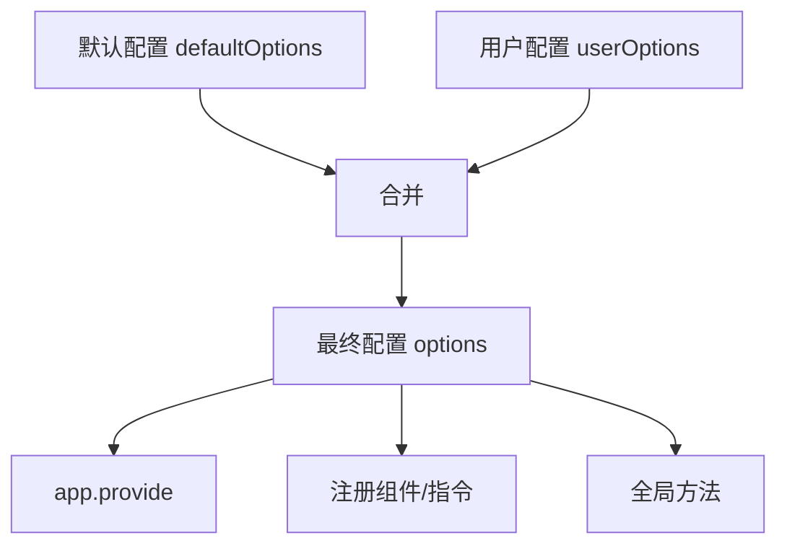

扫描[二维码](https://api2.cmdragon.cn/upload/cmder/20250304_012821924.jpg)关注或者微信搜一搜：`编程智域 前端至全栈交流与成长`

[发现1000+提升效率与开发的AI工具和实用程序](https://tools.cmdragon.cn/zh/apps?category=ai_chat)：https://tools.cmdragon.cn/zh/apps?category=ai_chat

## 一、配置项设计：让插件灵活又不失约束

一个好的插件应该允许用户自定义配置，同时提供合理的默认值。来看看怎么设计。

### 默认值 + 用户配置合并

```typescript
// plugins/myPlugin.ts
interface PluginOptions {
  prefix: string;
  theme: "light" | "dark";
  locale: string;
  zIndex: number;
}

const defaultOptions: PluginOptions = {
  prefix: "My",
  theme: "light",
  locale: "zh",
  zIndex: 2000,
};

export default {
  install(app, userOptions: Partial<PluginOptions> = {}) {
    // 合并默认配置和用户配置
    const options = { ...defaultOptions, ...userOptions };

    // 用合并后的配置
    app.provide("myPluginOptions", options);
  },
};
```

使用时可以只传你想改的：

```typescript
app.use(myPlugin, {
  theme: "dark",
  zIndex: 3000,
  // prefix和locale用默认值
});
```

### 深层配置合并

如果配置项是嵌套对象，简单的展开运算符就不够了，需要深合并：

```typescript
interface PluginOptions {
  theme: {
    primaryColor: string;
    fontSize: number;
    borderRadius: number;
  };
  components: {
    button: boolean;
    input: boolean;
    modal: boolean;
  };
}

const defaultOptions: PluginOptions = {
  theme: {
    primaryColor: "#409eff",
    fontSize: 14,
    borderRadius: 4,
  },
  components: {
    button: true,
    input: true,
    modal: true,
  },
};

function deepMerge<T extends Record<string, any>>(
  target: T,
  source: Partial<T>,
): T {
  const result = { ...target };
  for (const key in source) {
    if (
      source[key] &&
      typeof source[key] === "object" &&
      !Array.isArray(source[key])
    ) {
      result[key] = deepMerge(target[key], source[key]!);
    } else {
      result[key] = source[key] as any;
    }
  }
  return result;
}

export default {
  install(app, userOptions: DeepPartial<PluginOptions> = {}) {
    const options = deepMerge(defaultOptions, userOptions);
    app.provide("myPluginOptions", options);
  },
};
```



## 二、TypeScript类型声明

如果你用TypeScript开发插件，类型声明非常重要——它能让使用者获得完整的类型提示和检查。

### 给install方法加类型

```typescript
import type { App } from "vue";

interface MyPluginOptions {
  theme?: "light" | "dark";
  locale?: string;
}

export default {
  install(app: App, options?: MyPluginOptions) {
    // app有完整的类型提示
    // options也有类型约束
  },
};
```

### 给provide/inject加类型

用`InjectionKey`来保证provide和inject的类型一致：

```typescript
import { inject, type InjectionKey } from "vue";

interface I18nInstance {
  locale: Ref<string>;
  translate: (key: string, defaultValue?: string) => string;
  setLocale: (lang: string) => void;
}

const I18N_KEY: InjectionKey<I18nInstance> = Symbol("i18n");

export function useI18n(): I18nInstance {
  const i18n = inject(I18N_KEY);
  if (!i18n) {
    throw new Error("[i18n] Plugin not installed!");
  }
  return i18n;
}

export default {
  install(app: App, options: any) {
    const instance: I18nInstance = {
      locale: ref("zh"),
      translate: (key, defaultValue = "") => {
        /* ... */
      },
      setLocale: (lang) => {
        /* ... */
      },
    };

    app.provide(I18N_KEY, instance);
  },
};
```

组件中使用时，`useI18n()`返回的类型就是`I18nInstance`，所有属性和方法都有类型提示。

### 扩展globalProperties的类型

如果你用了`app.config.globalProperties`，需要扩展Vue的类型声明，否则TypeScript不认识你的全局属性：

```typescript
// plugins/myPlugin.ts
import type { App } from "vue";

declare module "vue" {
  export interface ComponentCustomProperties {
    $translate: (key: string, defaultValue?: string) => string;
    $locale: Ref<string>;
  }
}

export default {
  install(app: App, options: any) {
    app.config.globalProperties.$translate = (key, defaultValue = "") => {
      // ...
    };
    app.config.globalProperties.$locale = ref("zh");
  },
};
```

加了这段`declare module 'vue'`之后，`this.$translate`和`this.$locale`在选项式API中就有类型提示了。

## 三、打包发布到NPM

如果你想把插件分享给别人用，需要打包并发布到NPM。

### 用Vite库模式打包

Vite提供了专门的库模式，适合打包Vue插件：

```typescript
// vite.config.ts
import { defineConfig } from "vite";
import vue from "@vitejs/plugin-vue";

export default defineConfig({
  plugins: [vue()],
  build: {
    lib: {
      entry: "./src/index.ts",
      name: "MyPlugin",
      fileName: (format) => `my-plugin.${format}.js`,
    },
    rollupOptions: {
      external: ["vue"],
      output: {
        globals: {
          vue: "Vue",
        },
      },
    },
  },
});
```

关键配置说明：

- `entry`：插件的入口文件
- `name`：UMD格式的全局变量名
- `fileName`：输出文件名
- `external: ['vue']`：Vue不打包进去，由使用者提供
- `globals: { vue: 'Vue' }`：UMD格式中vue对应的全局变量

### 入口文件导出

```typescript
// src/index.ts
import type { App } from "vue";
import MyButton from "./components/MyButton.vue";
import MyInput from "./components/MyInput.vue";
import { useI18n } from "./composables/useI18n";

const components = { MyButton, MyInput };

export { useI18n };
export { MyButton, MyInput };

export default {
  install(app: App, options?: any) {
    Object.entries(components).forEach(([name, component]) => {
      app.component(name, component);
    });
  },
};
```

### package.json配置

```json
{
  "name": "my-vue-plugin",
  "version": "1.0.0",
  "description": "A Vue 3 plugin",
  "main": "./dist/my-plugin.umd.js",
  "module": "./dist/my-plugin.es.js",
  "exports": {
    ".": {
      "import": "./dist/my-plugin.es.js",
      "require": "./dist/my-plugin.umd.js"
    }
  },
  "files": ["dist"],
  "peerDependencies": {
    "vue": "^3.3.0"
  },
  "keywords": ["vue", "vue3", "plugin"],
  "license": "MIT"
}
```

关键字段：

- `main`：CommonJS入口
- `module`：ES Module入口
- `exports`：现代的导出声明
- `files`：只发布dist目录
- `peerDependencies`：vue是外部依赖，不打包

### 发布流程

```bash
# 1. 打包
npm run build

# 2. 登录NPM
npm login

# 3. 发布
npm publish

# 如果是 scoped package（如 @myorg/plugin）
npm publish --access public
```

```mermaid
flowchart TD
    A[开发插件] --> B[编写入口文件 index.ts]
    B --> C[配置 vite.config.ts 库模式]
    C --> D[配置 package.json]
    D --> E[npm run build 打包]
    E --> F[生成 dist/ 目录]
    F --> G[npm publish 发布]
    G --> H[用户 npm install 安装]
    H --> I[app.use() 使用]
```

## 四、插件开发的最佳实践清单

| 实践                                | 说明                       |
| ----------------------------------- | -------------------------- |
| ✅ 提供默认配置                     | 用户不传配置也能正常工作   |
| ✅ 用Symbol做provide的key           | 避免命名冲突               |
| ✅ 提供useXxx函数                   | 组合式API友好的使用方式    |
| ✅ 加TypeScript类型                 | 更好的开发体验             |
| ✅ 扩展ComponentCustomProperties    | globalProperties有类型提示 |
| ✅ Vue作为peerDependencies          | 不重复打包Vue              |
| ✅ 提供文档和示例                   | 降低使用门槛               |
| ✅ 没装插件时给明确报错             | inject返回undefined时throw |
| ❌ 不要往globalProperties挂太多东西 | 难以维护                   |
| ❌ 不要在install里做异步操作        | app.use是同步的            |

## 课后 Quiz

### 问题 1

为什么Vue要放在`peerDependencies`而不是`dependencies`里？

#### 答案解析

因为插件是给Vue应用用的，使用者的项目里已经有了Vue。如果把Vue放在`dependencies`里，会导致安装两份Vue——一份是项目本身的，一份是插件自带的。两份Vue会导致响应式系统失效、组件无法正常工作等问题。放在`peerDependencies`里表示"我需要Vue，但由你来提供"。

### 问题 2

`declare module 'vue'`这段代码是干啥的？

#### 答案解析

这是TypeScript的模块扩展（Module Augmentation）语法。它告诉TypeScript编译器："我要往Vue的类型定义里加东西"。通过扩展`ComponentCustomProperties`接口，我们给`app.config.globalProperties`上挂的全局属性添加了类型声明，这样在选项式API中使用`this.$translate`时就能获得类型提示和检查。

### 问题 3

Vite库模式打包时，为什么要设置`external: ['vue']`？

#### 答案解析

因为Vue应该由使用插件的项目提供，不应该打包进插件里。如果打包进去，会导致：1）插件包体积变大；2）使用者的项目中出现两份Vue代码，可能导致响应式系统失效。设置`external`告诉打包工具"vue这个依赖不要打包，运行时由外部提供"。

## 常见报错解决方案

### 报错 1：`Property '$translate' does not exist on type 'ComponentCustomProperties'`

**错误场景**：

```typescript
// 选项式API中使用
this.$translate("hello"); // 💥 TypeScript报错
```

**报错原因**：
TypeScript不知道`$translate`是全局属性，因为没有扩展`ComponentCustomProperties`的类型声明。

**解决方案**：
添加模块扩展声明：

```typescript
declare module "vue" {
  export interface ComponentCustomProperties {
    $translate: (key: string, defaultValue?: string) => string;
  }
}
```

### 报错 2：发布NPM包后安装使用报错`Cannot find module`

**错误场景**：

```javascript
import myPlugin from "my-vue-plugin"; // 💥 找不到模块
```

**报错原因**：
package.json中的`main`或`exports`字段配置不正确，或者打包输出路径不对。

**解决方案**：

1. 确认`npm run build`后dist目录下有文件
2. 检查package.json的`main`和`module`字段指向正确的文件
3. 检查`exports`字段配置

```json
{
  "main": "./dist/my-plugin.umd.js",
  "module": "./dist/my-plugin.es.js",
  "exports": {
    ".": {
      "import": "./dist/my-plugin.es.js",
      "require": "./dist/my-plugin.umd.js"
    }
  }
}
```

### 报错 3：打包后组件样式丢失

**错误场景**：
插件安装后组件能渲染，但没有样式。

**报错原因**：
Vite库模式默认不处理CSS，或者CSS没有被正确导入。

**解决方案**：

1. 在入口文件中导入CSS：`import './styles/index.css'`
2. 在vite.config.ts中配置CSS代码分割：

```typescript
build: {
  lib: {
    // ...
  },
  cssCodeSplit: false
}
```

3. 或者让用户手动导入CSS：`import 'my-vue-plugin/dist/style.css'`

## 参考链接

- Vue 3 官方文档 - 插件：https://vuejs.org/guide/reusability/plugins.html
- Vue 3 官方文档 - TypeScript支持：https://vuejs.org/guide/typescript/options-api.html#augmenting-global-properties
- Vite 文档 - 库模式：https://vitejs.dev/guide/build.html#library-mode

余下文章内容请点击跳转至 个人博客页面 或者 扫描[二维码](https://api2.cmdragon.cn/upload/cmder/20250304_012821924.jpg)关注或者微信搜一搜：`编程智域 前端至全栈交流与成长`，阅读完整的文章：[插件配置项怎么设计？TypeScript类型怎么加？打包发布要注意啥？](https://blog.cmdragon.cn/posts/p5e6f7a8b9c0d1e2f3a4b5c6d7e8f9a0/)

<details>
<summary>往期文章归档</summary>

- [Vue 3 静态与动态 Props 如何传递？TypeScript 类型约束有何必要？](https://blog.cmdragon.cn/posts/94ab48753b64780ca3ab7a7115ae8522/)
- [Vue 3中组件局部注册的优势与实现方式如何？](https://blog.cmdragon.cn/posts/dbf576e744870f6de26fd8a2e03e47da/)
- [如何在Vue3中优化生命周期钩子性能并规避常见陷阱？](https://blog.cmdragon.cn/posts/12d98b3b9ccd6c19a1b169d720ac5c80/)
- [Vue 3 Composition API生命周期钩子：如何实现从基础理解到高阶复用？](https://blog.cmdragon.cn/posts/8884e2b70287fcb263c57648eeb27419/)
- [Vue 3生命周期钩子实战指南：如何正确选择onMounted、onUpdated与onUnmounted的应用场景？](https://blog.cmdragon.cn/posts/883c6dbc50ae4183770a4462e0b8ae4d/)
- [Vue 3中生命周期钩子与响应式系统如何实现协同工作？](https://blog.cmdragon.cn/posts/70dad360ffa9dce14d0d69611b8cb019/)
- [Vue 3组件生命周期钩子的执行顺序与使用场景是什么？](https://blog.cmdragon.cn/posts/db44294a78dc9f666f67b053f6c83567/)
- [Vue组件全局注册与局部注册如何抉择？](https://blog.cmdragon.cn/posts/43ead630ea17da65d99ad2eb8188e472/)
- [Vue3组件化开发中，Props与Emits如何实现数据流转与事件协作？](https://blog.cmdragon.cn/posts/8cff7d2df113da66ea7be560c4d1d22a/)
- [Vue 3模板引用如何与其他特性协同实现复杂交互？](https://blog.cmdragon.cn/posts/331bf75d114ab09116eadfcdca602b58/)
- [Vue 3 v-for中模板引用如何实现高效管理与动态控制？](https://blog.cmdragon.cn/posts/cb380897ddc3578b180ecf8843c774c1/)
- [Vue 3的defineExpose：如何突破script setup组件默认封装，实现精准的父子通讯？](https://blog.cmdragon.cn/posts/202ae0f4acde7128e0e31baf63732fb5/)
- [Vue 3模板引用的生命周期时机如何把握？常见陷阱该如何避免？](https://blog.cmdragon.cn/posts/7d2a0f6555ecbe92afd7d2491c427463/)
- [Vue 3模板引用如何实现父组件与子组件的高效交互？](https://blog.cmdragon.cn/posts/3fb7bdd84128b7efaaa1c979e1f28dee/)
- [Vue中为何需要模板引用？又如何高效实现DOM与组件实例的直接访问？](https://blog.cmdragon.cn/posts/23f3464ba16c7054b4783cded50c04c6/)

</details>

<details>
<summary>免费好用的热门在线工具</summary>

- [多直播聚合器 - 应用商店 | By cmdragon](https://tools.cmdragon.cn/zh/apps/multi-live-aggregator)
- [Proto文件生成器 - 应用商店 | By cmdragon](https://tools.cmdragon.cn/zh/apps/proto-file-generator)
- [图片转粒子 - 应用商店 | By cmdragon](https://tools.cmdragon.cn/zh/apps/image-to-particles)
- [视频下载器 - 应用商店 | By cmdragon](https://tools.cmdragon.cn/zh/apps/video-downloader)
- [文件格式转换器 - 应用商店 | By cmdragon](https://tools.cmdragon.cn/zh/apps/file-converter)
- [M3U8在线播放器 - 应用商店 | By cmdragon](https://tools.cmdragon.cn/zh/apps/m3u8-player)
- [快图设计 - 应用商店 | By cmdragon](https://tools.cmdragon.cn/zh/apps/quick-image-design)
- [高级文字转图片转换器 - 应用商店 | By cmdragon](https://tools.cmdragon.cn/zh/apps/text-to-image-advanced)
- [RAID 计算器 - 应用商店 | By cmdragon](https://tools.cmdragon.cn/zh/apps/raid-calculator)
- [在线PS - 应用商店 | By cmdragon](https://tools.cmdragon.cn/zh/apps/photoshop-online)
- [Mermaid 在线编辑器 - 应用商店 | By cmdragon](https://tools.cmdragon.cn/zh/apps/mermaid-live-editor)
- [数学求解计算器 - 应用商店 | By cmdragon](https://tools.cmdragon.cn/zh/apps/math-solver-calculator)
- [智能提词器 - 应用商店 | By cmdragon](https://tools.cmdragon.cn/zh/apps/smart-teleprompter)
- [魔法简历 - 应用商店 | By cmdragon](https://tools.cmdragon.cn/zh/apps/magic-resume)
- [Image Puzzle Tool - 图片拼图工具 | By cmdragon](https://tools.cmdragon.cn/zh/apps/image-puzzle-tool)
- [字幕下载工具 - 应用商店 | By cmdragon](https://tools.cmdragon.cn/zh/apps/subtitle-downloader)
- [歌词生成工具 - 应用商店 | By cmdragon](https://tools.cmdragon.cn/zh/apps/lyrics-generator)
- [网盘资源聚合搜索 - 应用商店 | By cmdragon](https://tools.cmdragon.cn/zh/apps/cloud-drive-search)
- [ASCII字符画生成器 - 应用商店 | By cmdragon](https://tools.cmdragon.cn/zh/apps/ascii-art-generator)
- [JSON Web Tokens 工具 - 应用商店 | By cmdragon](https://tools.cmdragon.cn/zh/apps/jwt-tool)
- [Bcrypt 密码工具 - 应用商店 | By cmdragon](https://tools.cmdragon.cn/zh/apps/bcrypt-tool)
- [GIF 合成器 - 应用商店 | By cmdragon](https://tools.cmdragon.cn/zh/apps/gif-composer)
- [GIF 分解器 - 应用商店 | By cmdragon](https://tools.cmdragon.cn/zh/apps/gif-decomposer)
- [文本隐写术 - 应用商店 | By cmdragon](https://tools.cmdragon.cn/zh/apps/text-steganography)
- [CMDragon 在线工具 - 高级AI工具箱与开发者套件 | 免费好用的在线工具](https://tools.cmdragon.cn/zh)
- [应用商店 - 发现1000+提升效率与开发的AI工具和实用程序 | 免费好用的在线工具](https://tools.cmdragon.cn/zh/apps?category=trending)
- [CMDragon 更新日志 - 最新更新、功能与改进 | 免费好用的在线工具](https://tools.cmdragon.cn/zh/changelog)
- [支持我们 - 成为赞助者 | 免费好用的在线工具](https://tools.cmdragon.cn/zh/sponsor)
- [AI文本生成图像 - 应用商店 | 免费好用的在线工具](https://tools.cmdragon.cn/zh/apps/text-to-image-ai)
- [临时邮箱 - 应用商店 | 免费好用的在线工具](https://tools.cmdragon.cn/zh/apps/temp-email)
- [二维码解析器 - 应用商店 | 免费好用的在线工具](https://tools.cmdragon.cn/zh/apps/qrcode-parser)
- [文本转思维导图 - 应用商店 | 免费好用的在线工具](https://tools.cmdragon.cn/zh/apps/text-to-mindmap)
- [正则表达式可视化工具 - 应用商店 | 免费好用的在线工具](https://tools.cmdragon.cn/zh/apps/regex-visualizer)
- [文件隐写工具 - 应用商店 | 免费好用的在线工具](https://tools.cmdragon.cn/zh/apps/steganography-tool)
- [IPTV 频道探索器 - 应用商店 | 免费好用的在线工具](https://tools.cmdragon.cn/zh/apps/iptv-explorer)
- [快传 - 应用商店 | By cmdragon](https://tools.cmdragon.cn/zh/apps/snapdrop)
- [随机抽奖工具 - 应用商店 | 免费好用的在线工具](https://tools.cmdragon.cn/zh/apps/lucky-draw)
- [动漫场景查找器 - 应用商店 | 免费好用的在线工具](https://tools.cmdragon.cn/zh/apps/anime-scene-finder)
- [时间工具箱 - 应用商店 | 免费好用的在线工具](https://tools.cmdragon.cn/zh/apps/time-toolkit)
- [网速测试 - 应用商店 | 免费好用的在线工具](https://tools.cmdragon.cn/zh/apps/speed-test)
- [AI 智能抠图工具 - 应用商店 | 免费好用的在线工具](https://tools.cmdragon.cn/zh/apps/background-remover)
- [背景替换工具 - 应用商店 | 免费好用的在线工具](https://tools.cmdragon.cn/zh/apps/background-replacer)
- [艺术二维码生成器 - 应用商店 | 免费好用的在线工具](https://tools.cmdragon.cn/zh/apps/artistic-qrcode)
- [Open Graph 元标签生成器 - 应用商店 | 免费好用的在线工具](https://tools.cmdragon.cn/zh/apps/open-graph-generator)
- [图像对比工具 - 应用商店 | 免费好用的在线工具](https://tools.cmdragon.cn/zh/apps/image-comparison)
- [图片压缩专业版 - 应用商店 | 免费好用的在线工具](https://tools.cmdragon.cn/zh/apps/image-compressor)
- [密码生成器 - 应用商店 | 免费好用的在线工具](https://tools.cmdragon.cn/zh/apps/password-generator)
- [SVG优化器 - 应用商店 | 免费好用的在线工具](https://tools.cmdragon.cn/zh/apps/svg-optimizer)
- [调色板生成器 - 应用商店 | 免费好用的在线工具](https://tools.cmdragon.cn/zh/apps/color-palette)
- [在线节拍器 - 应用商店 | 免费好用的在线工具](https://tools.cmdragon.cn/zh/apps/online-metronome)
- [IP归属地查询 - 应用商店 | 免费好用的在线工具](https://tools.cmdragon.cn/zh/apps/ip-geolocation)
- [CSS网格布局生成器 - 应用商店 | 免费好用的在线工具](https://tools.cmdragon.cn/zh/apps/css-grid-layout)
- [邮箱验证工具 - 应用商店 | 免费好用的在线工具](https://tools.cmdragon.cn/zh/apps/email-validator)
- [书法练习字帖 - 应用商店 | 免费好用的在线工具](https://tools.cmdragon.cn/zh/apps/calligraphy-practice)
- [金融计算器套件 - 应用商店 | 免费好用的在线工具](https://tools.cmdragon.cn/zh/apps/finance-calculator-suite)
- [中国亲戚关系计算器 - 应用商店 | 免费好用的在线工具](https://tools.cmdragon.cn/zh/apps/chinese-kinship-calculator)
- [Protocol Buffer 工具箱 - 应用商店 | 免费好用的在线工具](https://tools.cmdragon.cn/zh/apps/protobuf-toolkit)
- [IP归属地查询 - 应用商店 | 免费好用的在线工具](https://tools.cmdragon.cn/zh/apps/ip-geolocation)
- [图片无损放大 - 应用商店 | 免费好用的在线工具](https://tools.cmdragon.cn/zh/apps/image-upscaler)
- [文本比较工具 - 应用商店 | 免费好用的在线工具](https://tools.cmdragon.cn/zh/apps/text-compare)
- [IP批量查询工具 - 应用商店 | 免费好用的在线工具](https://tools.cmdragon.cn/zh/apps/ip-batch-lookup)
- [域名查询工具 - 应用商店 | 免费好用的在线工具](https://tools.cmdragon.cn/zh/apps/domain-finder)
- [DNS工具箱 - 应用商店 | 免费好用的在线工具](https://tools.cmdragon.cn/zh/apps/dns-toolkit)
- [网站图标生成器 - 应用商店 | 免费好用的在线工具](https://tools.cmdragon.cn/zh/apps/favicon-generator)
- [XML Sitemap](https://tools.cmdragon.cn/sitemap_index.xml)

</details>
