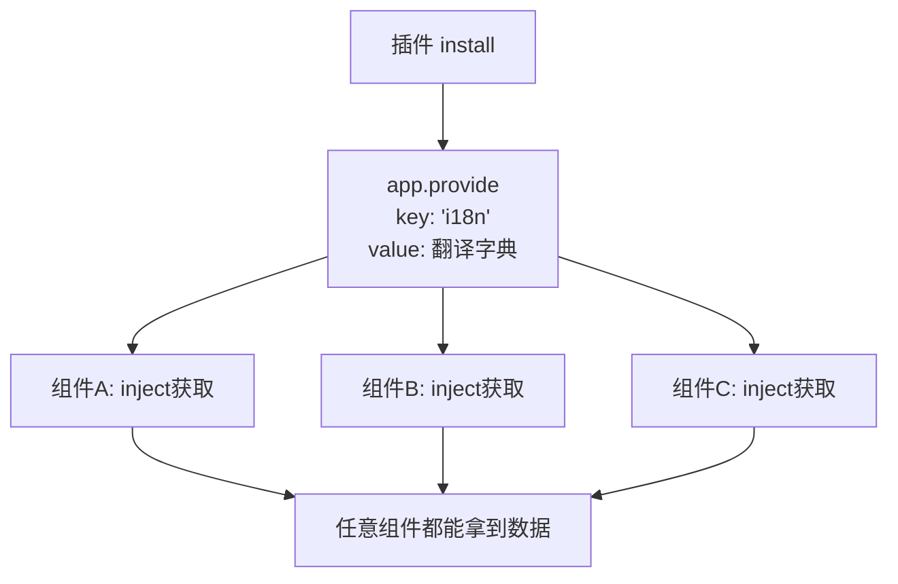
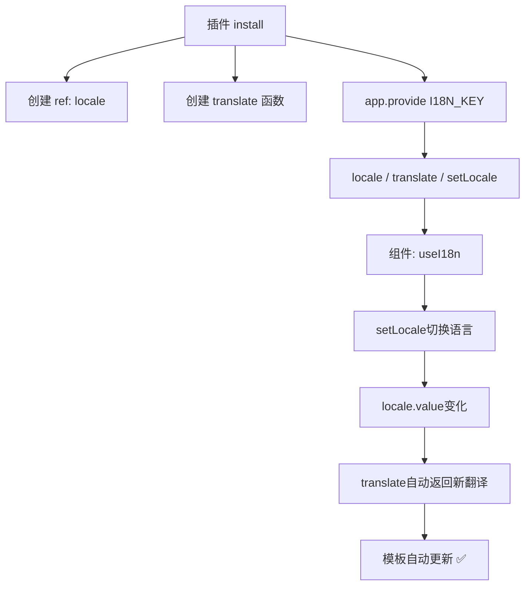

扫描[二维码](https://api2.cmdragon.cn/upload/cmder/20250304_012821924.jpg)关注或者微信搜一搜：`编程智域 前端至全栈交流与成长`

[发现1000+提升效率与开发的AI工具和实用程序](https://tools.cmdragon.cn/zh/apps?category=ai_chat)：https://tools.cmdragon.cn/zh/apps?category=ai_chat

## 一、globalProperties的痛点

上一篇文章咱们用`app.config.globalProperties`挂了`$translate`方法，确实能用，但在组合式API中有个大问题——`<script setup>`里没有`this`，你得这么搞：

```javascript
import { getCurrentInstance } from "vue";
const { proxy } = getCurrentInstance();
const msg = proxy.$translate("greetings.hello");
```

说实话，这写法看着就别扭。而且`getCurrentInstance`官方都说"只在开发调试时使用"，拿来当正经API用总觉得不太对劲。

那有没有更优雅的方式？有——`app.provide()` + `inject()`。

## 二、app.provide()：插件给全应用发"广播"

`app.provide()`的作用就是往整个应用里"广播"一个数据，任何组件都能通过`inject()`接收到。这就像学校广播站播了一条消息，所有教室都能听到。

### 在插件中使用provide

```javascript
// plugins/i18n.js
export default {
  install(app, options) {
    // 把翻译字典提供给整个应用
    app.provide("i18n", options);
  },
};
```

就这么一行代码！`app.provide('i18n', options)`的意思是：以`'i18n'`为key，把`options`（翻译字典）注入到整个应用中。

### 在组件中用inject接收

```vue
<script setup>
import { inject } from "vue";

const i18n = inject("i18n");

console.log(i18n.greetings.hello); // '你好'
</script>
```

比`getCurrentInstance`清爽多了吧？

选项式API中也能用：

```javascript
export default {
  inject: ["i18n"],
  created() {
    console.log(this.i18n.greetings.hello);
  },
};
```



## 三、provide/inject vs globalProperties

两种方式都能实现"插件给组件传数据"，但差别不小：

| 特性            | globalProperties       | provide/inject        |
| --------------- | ---------------------- | --------------------- |
| 选项式API模板中 | 直接用`$xxx`           | 需要inject后用        |
| 组合式API中     | 需要getCurrentInstance | 直接inject ✅         |
| TypeScript支持  | 需要额外声明           | 更好的类型推断 ✅     |
| 作用域          | 全局唯一               | 可按key区分 ✅        |
| 命名冲突        | 容易冲突               | 用Symbol避免 ✅       |
| 响应式          | 需要额外处理           | 直接传ref/reactive ✅ |
| 官方推荐        | 谨慎使用               | 推荐方式 ✅           |

结论很明确——**在组合式API中，provide/inject是更好的选择**。

## 四、用Symbol做注入键，避免命名冲突

上面咱们用的是字符串`'i18n'`作为provide的key。这有个隐患——万一另一个插件也用了`'i18n'`这个key，就冲突了。

Vue推荐用**Symbol**作为注入键，因为Symbol是唯一的，不可能重复：

```javascript
// plugins/i18n.js
export const i18nKey = Symbol("i18n");

export default {
  install(app, options) {
    app.provide(i18nKey, options);
  },
};
```

组件中：

```vue
<script setup>
import { inject } from "vue";
import { i18nKey } from "./plugins/i18n.js";

const i18n = inject(i18nKey);
</script>
```

这样即使有别的插件也叫`i18n`，因为Symbol是唯一的，所以不会冲突。

### 更规范的做法：把key和类型放一起

```javascript
// plugins/i18n.js
import { inject } from 'vue'

export const I18N_KEY = Symbol('i18n') as InjectionKey<I18nOptions>

// 提供一个useI18n函数，组件里直接调用就行
export function useI18n() {
  const i18n = inject(I18N_KEY)
  if (!i18n) {
    throw new Error('i18n plugin is not installed!')
  }
  return i18n
}

export default {
  install(app, options) {
    app.provide(I18N_KEY, options)
  }
}
```

组件中使用：

```vue
<script setup>
import { useI18n } from "./plugins/i18n.js";

const { translate, locale, setLocale } = useI18n();
</script>
```

你看，这跟Composable的用法一模一样！`useI18n()`看起来就像个Composable函数，但它的数据来源是插件通过`app.provide`注入的。这就是插件和Composable的完美结合。

## 五、provide响应式数据

`app.provide()`提供的数据默认不是响应式的。如果你需要组件中能响应式地获取更新，就要传ref或reactive：

```javascript
// plugins/i18n.js
import { ref, reactive } from "vue";

export const I18N_KEY = Symbol("i18n");

export function useI18n() {
  const i18n = inject(I18N_KEY);
  if (!i18n) {
    throw new Error("i18n plugin is not installed!");
  }
  return i18n;
}

export default {
  install(app, options) {
    const locale = ref("zh");
    const messages = options;

    function translate(key, defaultValue = "") {
      if (typeof key !== "string") return defaultValue;
      const currentMessages = messages[locale.value] || {};
      const result = key.split(".").reduce((obj, k) => {
        if (obj) return obj[k];
      }, currentMessages);
      return result !== undefined ? result : defaultValue;
    }

    function setLocale(lang) {
      if (messages[lang]) {
        locale.value = lang;
      }
    }

    // 提供响应式数据
    app.provide(I18N_KEY, {
      locale,
      translate,
      setLocale,
      availableLocales: Object.keys(messages),
    });
  },
};
```

组件中：

```vue
<script setup>
import { useI18n } from "./plugins/i18n.js";

const { locale, translate, setLocale } = useI18n();
</script>

<template>
  <h1>{{ translate("greetings.hello") }}</h1>
  <p>当前语言：{{ locale }}</p>
  <button @click="setLocale('en')">English</button>
  <button @click="setLocale('zh')">中文</button>
</template>
```

切换语言时，`locale`是ref，`translate`函数内部读取了`locale.value`，所以翻译内容会自动更新。



## 六、inject的默认值

如果插件没安装，`inject`会返回`undefined`。你可以给`inject`传第二个参数作为默认值：

```javascript
// 如果没安装i18n插件，返回一个空的翻译对象
const i18n = inject(I18N_KEY, {
  locale: ref("zh"),
  translate: () => "",
  setLocale: () => {},
});
```

或者传一个工厂函数（当默认值需要计算时）：

```javascript
const i18n = inject(
  I18N_KEY,
  () => ({
    locale: ref("zh"),
    translate: () => "",
    setLocale: () => {},
  }),
  true,
); // 第三个参数true表示默认值是工厂函数
```

不过更好的做法是在`useI18n`里直接抛错，这样没装插件的时候你能第一时间发现：

```javascript
export function useI18n() {
  const i18n = inject(I18N_KEY);
  if (!i18n) {
    throw new Error(
      "[i18n] Plugin is not installed! Did you forget app.use(i18nPlugin)?",
    );
  }
  return i18n;
}
```

## 七、一个完整的插件模板

把上面说的最佳实践合在一起，来一个完整的插件模板：

```javascript
// plugins/myPlugin.js
import { ref, inject } from "vue";

const PLUGIN_KEY = Symbol("myPlugin");

export function useMyPlugin() {
  const plugin = inject(PLUGIN_KEY);
  if (!plugin) {
    throw new Error("MyPlugin is not installed!");
  }
  return plugin;
}

export default {
  install(app, options = {}) {
    const state = ref(options.initialValue || null);

    function doSomething() {
      // ...
    }

    app.provide(PLUGIN_KEY, {
      state,
      doSomething,
    });
  },
};
```

使用：

```javascript
// main.js
import myPlugin from "./plugins/myPlugin.js";
app.use(myPlugin, { initialValue: "hello" });
```

```vue
<!-- 组件中 -->
<script setup>
import { useMyPlugin } from "./plugins/myPlugin.js";
const { state, doSomething } = useMyPlugin();
</script>
```

## 课后 Quiz

### 问题 1

为什么在插件中推荐用`app.provide()`而不是`globalProperties`？

#### 答案解析

三个主要原因：

1. **组合式API友好**：`inject()`可以直接在`<script setup>`中使用，不需要`getCurrentInstance`
2. **TypeScript支持更好**：配合`InjectionKey`可以获得完整的类型推断
3. **避免命名冲突**：用Symbol做key，不会跟其他插件冲突

### 问题 2

为什么推荐用Symbol而不是字符串作为provide的key？

#### 答案解析

因为Symbol是唯一的。如果用字符串`'i18n'`作为key，另一个插件也用了`'i18n'`，后注册的会覆盖先注册的。而Symbol即使名字一样，每次创建的都是不同的值，所以不可能冲突。

### 问题 3

`app.provide()`提供的数据默认是响应式的吗？

#### 答案解析

不是。`app.provide()`本身不会让数据变成响应式的。如果你需要组件中能响应式地获取更新，需要传入ref或reactive对象。比如`app.provide('count', ref(0))`，组件中`inject('count')`拿到的就是一个ref，可以响应式地追踪变化。

## 常见报错解决方案

### 报错 1：`inject() can only be used inside setup()`

**错误场景**：

```javascript
// 在组件外面调用inject
const i18n = inject("i18n"); // 💥 不在组件上下文中
```

**报错原因**：
`inject`必须在组件的setup上下文中调用，就像Composable一样。

**解决方案**：
把inject封装在use函数里，在组件中调用：

```javascript
// 插件文件
export function useI18n() {
  return inject(I18N_KEY);
}

// 组件中
<script setup>const {translate} = useI18n() // ✅ 在setup上下文中</script>;
```

### 报错 2：inject返回undefined

**错误场景**：

```javascript
const i18n = inject("i18n"); // undefined
```

**报错原因**：
可能的原因：

1. 插件没安装（没调用`app.use`）
2. provide的key和inject的key不一致
3. 用了字符串key但拼写不一致

**解决方案**：

1. 确认`app.use()`已调用
2. 使用Symbol key确保一致性
3. 给inject加默认值或错误提示：

```javascript
export function useI18n() {
  const i18n = inject(I18N_KEY);
  if (!i18n) {
    throw new Error("[i18n] Plugin not installed!");
  }
  return i18n;
}
```

### 报错 3：provide的数据变了但组件不更新

**错误场景**：

```javascript
// 插件中provide普通对象
app.provide("config", { theme: "dark" });

// 组件中inject
const config = inject("config");
config.theme = "light"; // 改了但页面没更新
```

**报错原因**：
provide的是普通对象，不是响应式的。修改普通对象的属性不会触发视图更新。

**解决方案**：
用reactive或ref包装数据：

```javascript
// 插件中
const config = reactive({ theme: "dark" });
app.provide("config", config);

// 或者用ref
const theme = ref("dark");
app.provide("theme", theme);
```

## 参考链接

- Vue 3 官方文档 - 插件：https://vuejs.org/guide/reusability/plugins.html
- Vue 3 官方文档 - Provide / Inject：https://vuejs.org/guide/components/provide-inject.html
- Vue 3 官方文档 - 应用 API：https://vuejs.org/api/application.html

余下文章内容请点击跳转至 个人博客页面 或者 扫描[二维码](https://api2.cmdragon.cn/upload/cmder/20250304_012821924.jpg)关注或者微信搜一搜：`编程智域 前端至全栈交流与成长`，阅读完整的文章：[插件里用provide/inject，让全应用都能拿到你的数据](https://blog.cmdragon.cn/posts/p3c4d5e6f7a8b9c0d1e2f3a4b5c6d7e8/)

<details>
<summary>往期文章归档</summary>

- [Vue 3 静态与动态 Props 如何传递？TypeScript 类型约束有何必要？](https://blog.cmdragon.cn/posts/94ab48753b64780ca3ab7a7115ae8522/)
- [Vue 3中组件局部注册的优势与实现方式如何？](https://blog.cmdragon.cn/posts/dbf576e744870f6de26fd8a2e03e47da/)
- [如何在Vue3中优化生命周期钩子性能并规避常见陷阱？](https://blog.cmdragon.cn/posts/12d98b3b9ccd6c19a1b169d720ac5c80/)
- [Vue 3 Composition API生命周期钩子：如何实现从基础理解到高阶复用？](https://blog.cmdragon.cn/posts/8884e2b70287fcb263c57648eeb27419/)
- [Vue 3生命周期钩子实战指南：如何正确选择onMounted、onUpdated与onUnmounted的应用场景？](https://blog.cmdragon.cn/posts/883c6dbc50ae4183770a4462e0b8ae4d/)
- [Vue 3中生命周期钩子与响应式系统如何实现协同工作？](https://blog.cmdragon.cn/posts/70dad360ffa9dce14d0d69611b8cb019/)
- [Vue 3组件生命周期钩子的执行顺序与使用场景是什么？](https://blog.cmdragon.cn/posts/db44294a78dc9f666f67b053f6c83567/)
- [Vue组件全局注册与局部注册如何抉择？](https://blog.cmdragon.cn/posts/43ead630ea17da65d99ad2eb8188e472/)
- [Vue3组件化开发中，Props与Emits如何实现数据流转与事件协作？](https://blog.cmdragon.cn/posts/8cff7d2df113da66ea7be560c4d1d22a/)
- [Vue 3模板引用如何与其他特性协同实现复杂交互？](https://blog.cmdragon.cn/posts/331bf75d114ab09116eadfcdca602b58/)
- [Vue 3 v-for中模板引用如何实现高效管理与动态控制？](https://blog.cmdragon.cn/posts/cb380897ddc3578b180ecf8843c774c1/)
- [Vue 3的defineExpose：如何突破script setup组件默认封装，实现精准的父子通讯？](https://blog.cmdragon.cn/posts/202ae0f4acde7128e0e31baf63732fb5/)
- [Vue 3模板引用的生命周期时机如何把握？常见陷阱该如何避免？](https://blog.cmdragon.cn/posts/7d2a0f6555ecbe92afd7d2491c427463/)
- [Vue 3模板引用如何实现父组件与子组件的高效交互？](https://blog.cmdragon.cn/posts/3fb7bdd84128b7efaaa1c979e1f28dee/)
- [Vue中为何需要模板引用？又如何高效实现DOM与组件实例的直接访问？](https://blog.cmdragon.cn/posts/23f3464ba16c7054b4783cded50c04c6/)

</details>

<details>
<summary>免费好用的热门在线工具</summary>

- [多直播聚合器 - 应用商店 | By cmdragon](https://tools.cmdragon.cn/zh/apps/multi-live-aggregator)
- [Proto文件生成器 - 应用商店 | By cmdragon](https://tools.cmdragon.cn/zh/apps/proto-file-generator)
- [图片转粒子 - 应用商店 | By cmdragon](https://tools.cmdragon.cn/zh/apps/image-to-particles)
- [视频下载器 - 应用商店 | By cmdragon](https://tools.cmdragon.cn/zh/apps/video-downloader)
- [文件格式转换器 - 应用商店 | By cmdragon](https://tools.cmdragon.cn/zh/apps/file-converter)
- [M3U8在线播放器 - 应用商店 | By cmdragon](https://tools.cmdragon.cn/zh/apps/m3u8-player)
- [快图设计 - 应用商店 | By cmdragon](https://tools.cmdragon.cn/zh/apps/quick-image-design)
- [高级文字转图片转换器 - 应用商店 | By cmdragon](https://tools.cmdragon.cn/zh/apps/text-to-image-advanced)
- [RAID 计算器 - 应用商店 | By cmdragon](https://tools.cmdragon.cn/zh/apps/raid-calculator)
- [在线PS - 应用商店 | By cmdragon](https://tools.cmdragon.cn/zh/apps/photoshop-online)
- [Mermaid 在线编辑器 - 应用商店 | By cmdragon](https://tools.cmdragon.cn/zh/apps/mermaid-live-editor)
- [数学求解计算器 - 应用商店 | By cmdragon](https://tools.cmdragon.cn/zh/apps/math-solver-calculator)
- [智能提词器 - 应用商店 | By cmdragon](https://tools.cmdragon.cn/zh/apps/smart-teleprompter)
- [魔法简历 - 应用商店 | By cmdragon](https://tools.cmdragon.cn/zh/apps/magic-resume)
- [Image Puzzle Tool - 图片拼图工具 | By cmdragon](https://tools.cmdragon.cn/zh/apps/image-puzzle-tool)
- [字幕下载工具 - 应用商店 | By cmdragon](https://tools.cmdragon.cn/zh/apps/subtitle-downloader)
- [歌词生成工具 - 应用商店 | By cmdragon](https://tools.cmdragon.cn/zh/apps/lyrics-generator)
- [网盘资源聚合搜索 - 应用商店 | By cmdragon](https://tools.cmdragon.cn/zh/apps/cloud-drive-search)
- [ASCII字符画生成器 - 应用商店 | By cmdragon](https://tools.cmdragon.cn/zh/apps/ascii-art-generator)
- [JSON Web Tokens 工具 - 应用商店 | By cmdragon](https://tools.cmdragon.cn/zh/apps/jwt-tool)
- [Bcrypt 密码工具 - 应用商店 | By cmdragon](https://tools.cmdragon.cn/zh/apps/bcrypt-tool)
- [GIF 合成器 - 应用商店 | By cmdragon](https://tools.cmdragon.cn/zh/apps/gif-composer)
- [GIF 分解器 - 应用商店 | By cmdragon](https://tools.cmdragon.cn/zh/apps/gif-decomposer)
- [文本隐写术 - 应用商店 | By cmdragon](https://tools.cmdragon.cn/zh/apps/text-steganography)
- [CMDragon 在线工具 - 高级AI工具箱与开发者套件 | 免费好用的在线工具](https://tools.cmdragon.cn/zh)
- [应用商店 - 发现1000+提升效率与开发的AI工具和实用程序 | 免费好用的在线工具](https://tools.cmdragon.cn/zh/apps?category=trending)
- [CMDragon 更新日志 - 最新更新、功能与改进 | 免费好用的在线工具](https://tools.cmdragon.cn/zh/changelog)
- [支持我们 - 成为赞助者 | 免费好用的在线工具](https://tools.cmdragon.cn/zh/sponsor)
- [AI文本生成图像 - 应用商店 | 免费好用的在线工具](https://tools.cmdragon.cn/zh/apps/text-to-image-ai)
- [临时邮箱 - 应用商店 | 免费好用的在线工具](https://tools.cmdragon.cn/zh/apps/temp-email)
- [二维码解析器 - 应用商店 | 免费好用的在线工具](https://tools.cmdragon.cn/zh/apps/qrcode-parser)
- [文本转思维导图 - 应用商店 | 免费好用的在线工具](https://tools.cmdragon.cn/zh/apps/text-to-mindmap)
- [正则表达式可视化工具 - 应用商店 | 免费好用的在线工具](https://tools.cmdragon.cn/zh/apps/regex-visualizer)
- [文件隐写工具 - 应用商店 | 免费好用的在线工具](https://tools.cmdragon.cn/zh/apps/steganography-tool)
- [IPTV 频道探索器 - 应用商店 | 免费好用的在线工具](https://tools.cmdragon.cn/zh/apps/iptv-explorer)
- [快传 - 应用商店 | By cmdragon](https://tools.cmdragon.cn/zh/apps/snapdrop)
- [随机抽奖工具 - 应用商店 | 免费好用的在线工具](https://tools.cmdragon.cn/zh/apps/lucky-draw)
- [动漫场景查找器 - 应用商店 | 免费好用的在线工具](https://tools.cmdragon.cn/zh/apps/anime-scene-finder)
- [时间工具箱 - 应用商店 | 免费好用的在线工具](https://tools.cmdragon.cn/zh/apps/time-toolkit)
- [网速测试 - 应用商店 | 免费好用的在线工具](https://tools.cmdragon.cn/zh/apps/speed-test)
- [AI 智能抠图工具 - 应用商店 | 免费好用的在线工具](https://tools.cmdragon.cn/zh/apps/background-remover)
- [背景替换工具 - 应用商店 | 免费好用的在线工具](https://tools.cmdragon.cn/zh/apps/background-replacer)
- [艺术二维码生成器 - 应用商店 | 免费好用的在线工具](https://tools.cmdragon.cn/zh/apps/artistic-qrcode)
- [Open Graph 元标签生成器 - 应用商店 | 免费好用的在线工具](https://tools.cmdragon.cn/zh/apps/open-graph-generator)
- [图像对比工具 - 应用商店 | 免费好用的在线工具](https://tools.cmdragon.cn/zh/apps/image-comparison)
- [图片压缩专业版 - 应用商店 | 免费好用的在线工具](https://tools.cmdragon.cn/zh/apps/image-compressor)
- [密码生成器 - 应用商店 | 免费好用的在线工具](https://tools.cmdragon.cn/zh/apps/password-generator)
- [SVG优化器 - 应用商店 | 免费好用的在线工具](https://tools.cmdragon.cn/zh/apps/svg-optimizer)
- [调色板生成器 - 应用商店 | 免费好用的在线工具](https://tools.cmdragon.cn/zh/apps/color-palette)
- [在线节拍器 - 应用商店 | 免费好用的在线工具](https://tools.cmdragon.cn/zh/apps/online-metronome)
- [IP归属地查询 - 应用商店 | 免费好用的在线工具](https://tools.cmdragon.cn/zh/apps/ip-geolocation)
- [CSS网格布局生成器 - 应用商店 | 免费好用的在线工具](https://tools.cmdragon.cn/zh/apps/css-grid-layout)
- [邮箱验证工具 - 应用商店 | 免费好用的在线工具](https://tools.cmdragon.cn/zh/apps/email-validator)
- [书法练习字帖 - 应用商店 | 免费好用的在线工具](https://tools.cmdragon.cn/zh/apps/calligraphy-practice)
- [金融计算器套件 - 应用商店 | 免费好用的在线工具](https://tools.cmdragon.cn/zh/apps/finance-calculator-suite)
- [中国亲戚关系计算器 - 应用商店 | 免费好用的在线工具](https://tools.cmdragon.cn/zh/apps/chinese-kinship-calculator)
- [Protocol Buffer 工具箱 - 应用商店 | 免费好用的在线工具](https://tools.cmdragon.cn/zh/apps/protobuf-toolkit)
- [IP归属地查询 - 应用商店 | 免费好用的在线工具](https://tools.cmdragon.cn/zh/apps/ip-geolocation)
- [图片无损放大 - 应用商店 | 免费好用的在线工具](https://tools.cmdragon.cn/zh/apps/image-upscaler)
- [文本比较工具 - 应用商店 | 免费好用的在线工具](https://tools.cmdragon.cn/zh/apps/text-compare)
- [IP批量查询工具 - 应用商店 | 免费好用的在线工具](https://tools.cmdragon.cn/zh/apps/ip-batch-lookup)
- [域名查询工具 - 应用商店 | 免费好用的在线工具](https://tools.cmdragon.cn/zh/apps/domain-finder)
- [DNS工具箱 - 应用商店 | 免费好用的在线工具](https://tools.cmdragon.cn/zh/apps/dns-toolkit)
- [网站图标生成器 - 应用商店 | 免费好用的在线工具](https://tools.cmdragon.cn/zh/apps/favicon-generator)
- [XML Sitemap](https://tools.cmdragon.cn/sitemap_index.xml)

</details>
