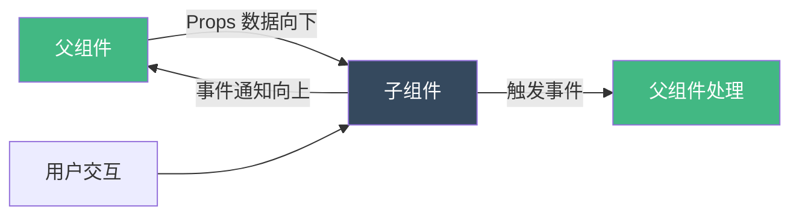
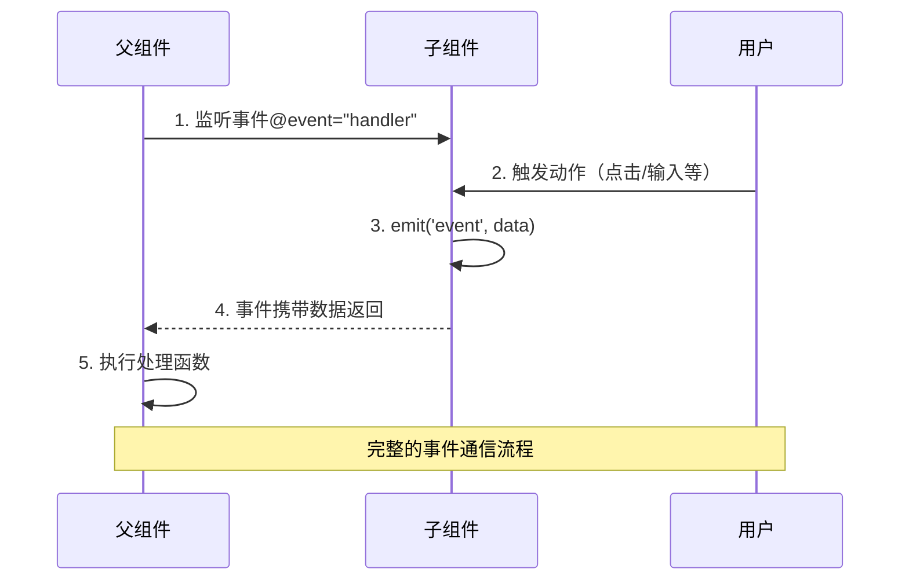
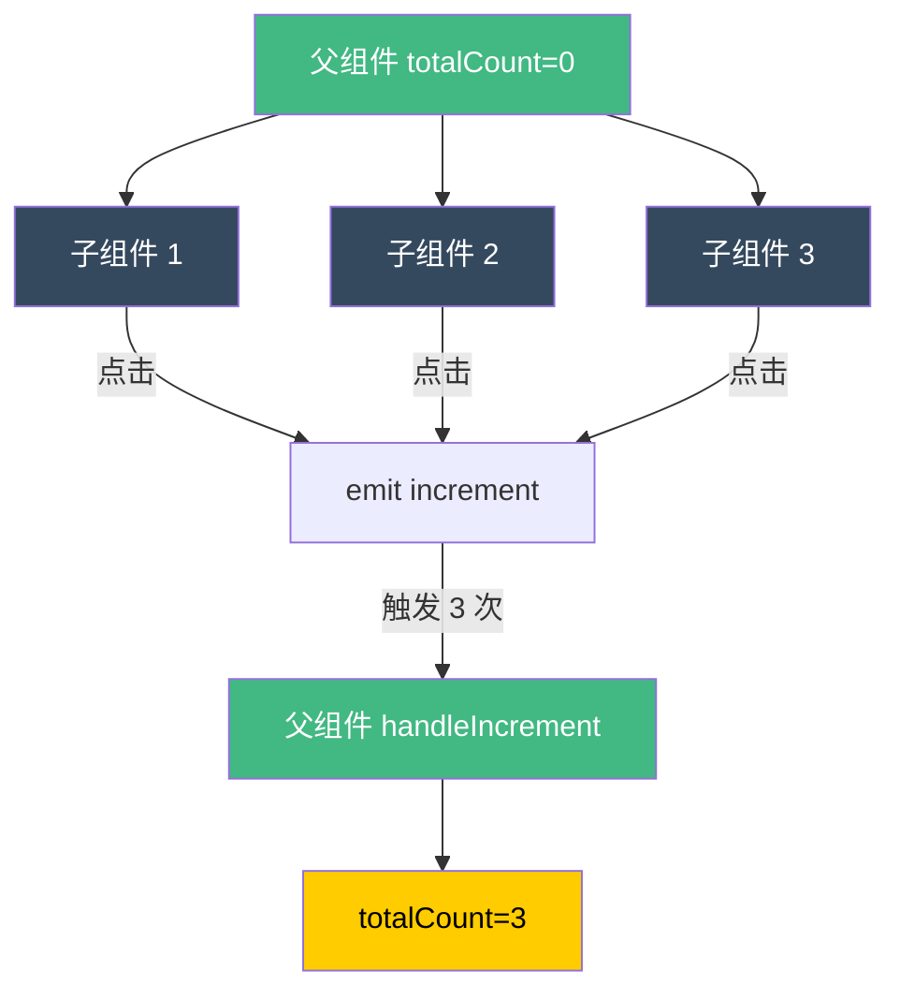

扫描 [二维码](https://api2.cmdragon.cn/upload/cmder/20250304_012821924.jpg) 关注或者微信搜一搜：`编程智域 前端至全栈交流与成长`

[发现 1000+ 提升效率与开发的 AI 工具和实用程序](https://tools.cmdragon.cn/zh/apps?category=ai_chat)：https://tools.cmdragon.cn/

## 1. 父子组件事件通信基础

在 Vue 3 组件化开发中，父子组件间的通信是构建复杂应用的核心。Props 负责从父组件向子组件传递数据，而自定义事件则实现从子组件到父组件的通信。理解并掌握这一通信机制，是成为 Vue 高手的必经之路。

### 1.1 单向数据流原则

Vue 遵循单向数据流原则，这意味着数据只能从父组件流向子组件，而不能反向流动。



**为什么需要单向数据流？**

- **可预测性**：数据流向清晰，便于调试和维护
- **避免耦合**：子组件不直接修改父组件数据，降低组件间耦合
- **易于测试**：每个组件的数据来源明确，测试更简单

### 1.2 事件通信的完整流程

父子组件事件通信包含三个关键步骤：



## 2. 基础实战：按钮点击计数

让我们从最简单的例子开始，实现一个按钮点击计数器。

### 2.1 子组件：定义和触发事件

```vue
<!-- ButtonCounter.vue -->
<template>
  <div class="button-counter">
    <button @click="handleClick">点击次数：{{ count }}</button>
  </div>
</template>

<script setup>
import { ref } from "vue";

// 1. 声明要触发的事件
const emit = defineEmits(["increment"]);

const count = ref(0);

// 2. 触发事件
function handleClick() {
  count.value++;
  // 触发 increment 事件，不传递参数
  emit("increment");
}
</script>

<style scoped>
.button-counter {
  display: inline-block;
  padding: 1rem;
  border: 2px solid #42b883;
  border-radius: 8px;
}

button {
  padding: 0.5rem 1rem;
  font-size: 1rem;
  color: #fff;
  background-color: #42b883;
  border: none;
  border-radius: 4px;
  cursor: pointer;
  transition: background-color 0.3s;
}

button:hover {
  background-color: #35495e;
}
</style>
```

**关键点解析：**

1. **`defineEmits(['increment'])`**：声明组件将触发 `increment` 事件
2. **`emit('increment')`**：触发事件，可以传递参数
3. **事件命名**：使用小写字母和连字符（如 `item-click`）

### 2.2 父组件：监听和处理事件

```vue
<!-- ParentComponent.vue -->
<template>
  <div class="parent">
    <h2>总点击次数：{{ totalCount }}</h2>

    <!-- 监听子组件的 increment 事件 -->
    <ButtonCounter @increment="handleIncrement" />
    <ButtonCounter @increment="handleIncrement" />
    <ButtonCounter @increment="handleIncrement" />
  </div>
</template>

<script setup>
import { ref } from "vue";
import ButtonCounter from "./ButtonCounter.vue";

const totalCount = ref(0);

// 处理子组件触发的事件
function handleIncrement() {
  totalCount.value++;
  console.log("子组件触发了 increment 事件");
}
</script>

<style scoped>
.parent {
  padding: 2rem;
  text-align: center;
}

h2 {
  color: #35495e;
  margin-bottom: 2rem;
}
</style>
```

### 2.3 运行效果



## 3. 进阶实战：传递事件参数

实际开发中，我们经常需要从子组件向父组件传递数据。

### 3.1 传递单个参数

```vue
<!-- ProductList.vue - 子组件 -->
<template>
  <div class="product-list">
    <div v-for="product in products" :key="product.id" class="product-item">
      <h3>{{ product.name }}</h3>
      <p>价格：¥{{ product.price }}</p>
      <button @click="handleAddToCart(product)">加入购物车</button>
    </div>
  </div>
</template>

<script setup>
const emit = defineEmits(["add-to-cart"]);

const products = [
  { id: 1, name: "iPhone 15", price: 6999 },
  { id: 2, name: "MacBook Pro", price: 12999 },
  { id: 3, name: "AirPods Pro", price: 1899 },
];

function handleAddToCart(product) {
  // 传递整个产品对象
  emit("add-to-cart", product);
}
</script>
```

```vue
<!-- ShoppingCart.vue - 父组件 -->
<template>
  <div class="shopping-cart">
    <h2>购物车</h2>

    <!-- 监听事件并接收参数 -->
    <ProductList @add-to-cart="handleAddProduct" />

    <div class="cart-items" v-if="cartItems.length > 0">
      <h3>已选商品：</h3>
      <ul>
        <li v-for="item in cartItems" :key="item.id">
          {{ item.name }} - ¥{{ item.price }}
        </li>
      </ul>
      <p class="total">总计：¥{{ totalAmount }}</p>
    </div>
  </div>
</template>

<script setup>
import { ref, computed } from "vue";
import ProductList from "./ProductList.vue";

const cartItems = ref([]);

// 接收子组件传递的产品参数
function handleAddProduct(product) {
  console.log("添加商品到购物车:", product);
  cartItems.value.push(product);
}

// 计算总金额
const totalAmount = computed(() => {
  return cartItems.value.reduce((sum, item) => sum + item.price, 0);
});
</script>
```

### 3.2 传递多个参数

当需要传递多个数据时，可以传递多个参数：

```vue
<!-- RatingStars.vue - 评分组件 -->
<template>
  <div class="rating-stars">
    <span
      v-for="star in 5"
      :key="star"
      class="star"
      :class="{ active: star <= currentRating }"
      @click="handleRate(star)"
    >
      ★
    </span>
  </div>
</template>

<script setup>
import { ref } from "vue";

const emit = defineEmits(["rate"]);
const currentRating = ref(0);

function handleRate(star) {
  currentRating.value = star;
  // 传递多个参数：评分和用户 ID
  const userId = "user123";
  const timestamp = Date.now();

  emit("rate", star, userId, timestamp);
}
</script>
```

```vue
<!-- ProductReview.vue - 父组件 -->
<template>
  <div>
    <h3>给商品评分：</h3>
    <RatingStars @rate="handleRating" />

    <div v-if="lastRating" class="rating-info">
      <p>您给出了 {{ lastRating.stars }} 星好评</p>
      <p>用户 ID: {{ lastRating.userId }}</p>
      <p>评分时间：{{ formatTime(lastRating.timestamp) }}</p>
    </div>
  </div>
</template>

<script setup>
import { ref } from "vue";
import RatingStars from "./RatingStars.vue";

const lastRating = ref(null);

// 接收多个参数
function handleRating(stars, userId, timestamp) {
  lastRating.value = {
    stars,
    userId,
    timestamp,
  };

  console.log("评分详情:", lastRating.value);
}

function formatTime(timestamp) {
  return new Date(timestamp).toLocaleString();
}
</script>
```

### 3.3 传递事件对象

有时需要同时传递自定义参数和原生事件对象：

```vue
<!-- CustomButton.vue -->
<template>
  <button @click="handleClick">
    <slot></slot>
  </button>
</template>

<script setup>
const emit = defineEmits(["custom-click"]);

function handleClick(event) {
  const buttonData = {
    id: "btn-001",
    name: "提交按钮",
  };

  // 同时传递自定义数据和原生事件对象
  emit("custom-click", buttonData, event);
}
</script>
```

```vue
<!-- ParentForm.vue -->
<template>
  <CustomButton @custom-click="handleCustomClick"> 提交 </CustomButton>
</template>

<script setup>
import CustomButton from "./CustomButton.vue";

function handleCustomClick(data, event) {
  console.log("按钮数据:", data);
  console.log("原生事件对象:", event);
  console.log("触发元素:", event.target);
  console.log("鼠标位置:", event.clientX, event.clientY);
}
</script>
```

## 4. 事件验证：确保数据安全

Vue 3 提供了事件验证功能，确保子组件触发的事件符合预期。

### 4.1 对象语法验证

```vue
<!-- ValidatedForm.vue -->
<template>
  <form @submit.prevent="handleSubmit">
    <input v-model="username" placeholder="用户名" />
    <input v-model="email" type="email" placeholder="邮箱" />
    <button type="submit">提交</button>
  </form>
</template>

<script setup>
import { ref } from "vue";

const emit = defineEmits({
  // 返回 true 表示验证通过
  submit: (payload) => {
    if (payload.username && payload.email) {
      return true;
    } else {
      console.warn("用户名和邮箱不能为空！");
      return false;
    }
  },
});

const username = ref("");
const email = ref("");

function handleSubmit() {
  // 验证通过才会触发
  emit("submit", {
    username: username.value,
    email: email.value,
  });
}
</script>
```

### 4.2 TypeScript 类型验证

使用 TypeScript 可以获得更好的类型安全：

```vue
<!-- TypedEvents.vue -->
<template>
  <div>
    <button @click="handleLogin">登录</button>
    <button @click="handleLogout">退出</button>
  </div>
</template>

<script setup lang="ts">
// 定义事件类型
interface Emits {
  (e: "login", userId: number, username: string): void;
  (e: "logout", timestamp: number): void;
  (e: "error", code: number, message: string): void;
}

const emit = defineEmits<Emits>();

function handleLogin() {
  // TypeScript 会检查参数类型和数量
  emit("login", 123, "cmdragon");
}

function handleLogout() {
  emit("logout", Date.now());
}
</script>
```

## 5. 实战案例：表单提交系统

让我们构建一个完整的表单提交系统，综合运用所有事件通信技巧。

### 5.1 子组件：通用表单组件

```vue
<!-- UniversalForm.vue -->
<template>
  <form class="universal-form" @submit.prevent="handleSubmit">
    <!-- 动态表单字段 -->
    <div v-for="field in fields" :key="field.name" class="form-field">
      <label :for="field.name">{{ field.label }}</label>

      <!-- 文本输入 -->
      <input
        v-if="field.type === 'text'"
        :id="field.name"
        :type="field.type"
        :placeholder="field.placeholder"
        v-model="formData[field.name]"
        :required="field.required"
      />

      <!-- 数字输入 -->
      <input
        v-else-if="field.type === 'number'"
        :id="field.name"
        type="number"
        v-model.number="formData[field.name]"
        :required="field.required"
      />

      <!-- 下拉选择 -->
      <select
        v-else-if="field.type === 'select'"
        :id="field.name"
        v-model="formData[field.name]"
        :required="field.required"
      >
        <option value="" disabled>{{ field.placeholder }}</option>
        <option
          v-for="option in field.options"
          :key="option.value"
          :value="option.value"
        >
          {{ option.label }}
        </option>
      </select>

      <!-- 错误提示 -->
      <span v-if="errors[field.name]" class="error">
        {{ errors[field.name] }}
      </span>
    </div>

    <!-- 提交按钮 -->
    <button type="submit" :disabled="isSubmitting">
      {{ isSubmitting ? "提交中..." : "提交" }}
    </button>
  </form>
</template>

<script setup>
import { ref, reactive } from "vue";

// 定义事件
const emit = defineEmits({
  // 验证事件
  validate: (formData) => {
    return formData !== null;
  },
  // 提交事件
  submit: (formData) => {
    return formData !== null;
  },
});

// 接收表单配置
const props = defineProps({
  fields: {
    type: Array,
    required: true,
  },
});

// 表单数据
const formData = reactive({});
const errors = ref({});
const isSubmitting = ref(false);

// 初始化表单数据
props.fields.forEach((field) => {
  formData[field.name] = field.default || "";
});

// 验证表单
function validateForm() {
  errors.value = {};

  props.fields.forEach((field) => {
    const value = formData[field.name];

    if (field.required && !value) {
      errors.value[field.name] = `${field.label}不能为空`;
    }

    if (field.type === "email" && value && !/\S+@\S+\.\S+/.test(value)) {
      errors.value[field.name] = "邮箱格式不正确";
    }
  });

  return Object.keys(errors.value).length === 0;
}

// 处理提交
function handleSubmit() {
  if (!validateForm()) {
    emit("error", { type: "validation", errors: errors.value });
    return;
  }

  isSubmitting.value = true;

  // 触发验证事件
  emit("validate", formData);

  // 模拟异步提交
  setTimeout(() => {
    // 触发提交事件
    emit("submit", formData);
    emit("success", { message: "提交成功" });

    isSubmitting.value = false;
  }, 1000);
}
</script>

<style scoped>
.universal-form {
  max-width: 500px;
  margin: 0 auto;
  padding: 2rem;
  border: 1px solid #e0e0e0;
  border-radius: 8px;
}

.form-field {
  margin-bottom: 1.5rem;
}

label {
  display: block;
  margin-bottom: 0.5rem;
  font-weight: 600;
  color: #35495e;
}

input,
select {
  width: 100%;
  padding: 0.75rem;
  border: 2px solid #e0e0e0;
  border-radius: 4px;
  font-size: 1rem;
  transition: border-color 0.3s;
}

input:focus,
select:focus {
  outline: none;
  border-color: #42b883;
}

.error {
  color: #ff4444;
  font-size: 0.875rem;
  margin-top: 0.25rem;
}

button {
  width: 100%;
  padding: 0.75rem;
  color: #fff;
  background-color: #42b883;
  border: none;
  border-radius: 4px;
  font-size: 1rem;
  cursor: pointer;
  transition: background-color 0.3s;
}

button:hover:not(:disabled) {
  background-color: #35495e;
}

button:disabled {
  background-color: #ccc;
  cursor: not-allowed;
}
</style>
```

### 5.2 父组件：使用表单组件

```vue
<!-- UserRegistration.vue -->
<template>
  <div class="user-registration">
    <h2>用户注册</h2>

    <UniversalForm
      :fields="formFields"
      @validate="handleValidate"
      @submit="handleSubmit"
      @success="handleSuccess"
      @error="handleError"
    />

    <!-- 提交结果展示 -->
    <div v-if="submitResult" :class="['result', submitResult.type]">
      <h3>{{ submitResult.title }}</h3>
      <p>{{ submitResult.message }}</p>
      <pre>{{ JSON.stringify(submitResult.data, null, 2) }}</pre>
    </div>
  </div>
</template>

<script setup>
import { ref, reactive } from "vue";
import UniversalForm from "./UniversalForm.vue";

// 表单字段配置
const formFields = [
  {
    name: "username",
    label: "用户名",
    type: "text",
    placeholder: "请输入用户名",
    required: true,
  },
  {
    name: "email",
    label: "邮箱",
    type: "email",
    placeholder: "请输入邮箱",
    required: true,
  },
  {
    name: "age",
    label: "年龄",
    type: "number",
    placeholder: "请输入年龄",
    required: false,
    default: 18,
  },
  {
    name: "gender",
    label: "性别",
    type: "select",
    placeholder: "请选择性别",
    required: true,
    options: [
      { value: "male", label: "男" },
      { value: "female", label: "女" },
      { value: "other", label: "其他" },
    ],
  },
];

const submitResult = ref(null);

// 处理验证事件
function handleValidate(formData) {
  console.log("验证表单数据:", formData);
  // 可以在这里进行额外的验证逻辑
}

// 处理提交事件
function handleSubmit(formData) {
  console.log("提交表单数据:", formData);

  // 模拟发送到服务器
  // fetch('/api/register', {
  //   method: 'POST',
  //   headers: { 'Content-Type': 'application/json' },
  //   body: JSON.stringify(formData)
  // })
}

// 处理成功事件
function handleSuccess(payload) {
  submitResult.value = {
    type: "success",
    title: "注册成功",
    message: payload.message,
    data: null,
  };

  console.log("注册成功:", payload);
}

// 处理错误事件
function handleError(payload) {
  if (payload.type === "validation") {
    console.log("验证错误:", payload.errors);
  } else {
    submitResult.value = {
      type: "error",
      title: "提交失败",
      message: "请稍后重试",
      data: payload,
    };
  }
}
</script>

<style scoped>
.user-registration {
  max-width: 600px;
  margin: 2rem auto;
  padding: 2rem;
}

h2 {
  text-align: center;
  color: #35495e;
  margin-bottom: 2rem;
}

.result {
  margin-top: 2rem;
  padding: 1.5rem;
  border-radius: 8px;
}

.result.success {
  background-color: #d4edda;
  border: 1px solid #c3e6cb;
  color: #155724;
}

.result.error {
  background-color: #f8d7da;
  border: 1px solid #f5c6cb;
  color: #721c24;
}

pre {
  background-color: rgba(0, 0, 0, 0.05);
  padding: 1rem;
  border-radius: 4px;
  overflow-x: auto;
  font-size: 0.875rem;
}
</style>
```

## 6. 最佳实践与常见陷阱

### 6.1 事件命名规范

```javascript
// ✅ 好的命名：使用连字符，小写字母
defineEmits(["item-click", "update:data", "form-submit"]);

// ❌ 不好的命名：驼峰命名，大写字母
defineEmits(["itemClick", "UpdateData", "FORM_SUBMIT"]);
```

### 6.2 避免事件冲突

```vue
<!-- 使用命名空间避免冲突 -->
<script setup>
const emit = defineEmits([
  "form:submit",
  "form:reset",
  "modal:open",
  "modal:close",
]);
</script>
```

### 6.3 及时清理监听器

```vue
<script setup>
import { onUnmounted } from "vue";

const emit = defineEmits(["data-change"]);

// 如果有定时器或订阅，记得在组件卸载时清理
onUnmounted(() => {
  // 清理逻辑
  console.log("组件已卸载，清理监听器");
});
</script>
```

### 6.4 使用常量管理事件名

```javascript
// events.js
export const USER_EVENTS = {
  LOGIN: 'user:login',
  LOGOUT: 'user:logout',
  UPDATE: 'user:update'
}

// 子组件
<script setup>
import { USER_EVENTS } from '@/constants/events'

const emit = defineEmits([USER_EVENTS.LOGIN])

emit(USER_EVENTS.LOGIN, userData)
</script>

<!-- 父组件 -->
<template>
  <ChildComponent @user:login="handleLogin" />
</template>
```

## 7. 课后 Quiz

### 问题 1：以下代码有什么问题？

```vue
<!-- 子组件 -->
<script setup>
const emit = defineEmits(["update"]);

function handleClick() {
  emit("update", { value: 123 });
}
</script>

<!-- 父组件 -->
<template>
  <Child @update="handleUpdate" />
</template>

<script setup>
function handleUpdate() {
  console.log("接收到的数据:", arguments[0]);
}
</script>
```

<details>
<summary>点击查看答案解析</summary>

**答案**：父组件的处理函数没有正确接收参数。

**正确写法**：

```javascript
function handleUpdate(data) {
  console.log("接收到的数据:", data);
  // 输出：{ value: 123 }
}
```

**解析**：子组件通过 `emit('update', data)` 传递数据，父组件需要在处理函数中声明参数来接收。

</details>

### 问题 2：如何实现一次性事件监听？

<details>
<summary>点击查看答案解析</summary>

**答案**：使用 `.once` 修饰符（Vue 2）或在处理后手动移除监听器（Vue 3）。

**Vue 3 实现方式**：

```vue
<template>
  <ChildComponent @custom-event="handleOnce" />
</template>

<script setup>
import { onMounted, onUnmounted } from "vue";

function handleOnce(data) {
  console.log("只执行一次", data);
  // 处理完后可以设置标记不再响应
}
</script>
```

**或者使用标记**：

```javascript
const hasTriggered = ref(false);

function handleOnce(data) {
  if (hasTriggered.value) return;
  hasTriggered.value = true;
  console.log("只执行一次", data);
}
```

</details>

## 8. 常见报错解决方案

### 报错 1：`[Vue warn]: Component emitted event "xxx" but it is neither declared`

**产生原因**：

- 触发了未在 `emits` 选项中声明的事件
- 事件名称拼写错误

**解决办法**：

```vue
<script setup>
// 声明所有要触发的事件
const emit = defineEmits(["click", "submit", "change"]);

// 确保事件名称一致
emit("click"); // ✅
// emit('Click') // ❌ 大小写不一致
</script>
```

### 报错 2：事件处理函数接收到的参数是 `undefined`

**产生原因**：

- 子组件触发事件时没有传递参数
- 父组件处理函数的参数名不匹配

**解决办法**：

```vue
<!-- 子组件 -->
<script setup>
const emit = defineEmits(["update"]);

// 确保传递参数
emit("update", { value: 123 });
</script>

<!-- 父组件 -->
<script setup>
// 确保接收参数
function handleUpdate(data) {
  console.log(data); // { value: 123 }
}
</script>
```

### 报错 3：事件触发但父组件没有响应

**产生原因**：

- 事件名称包含大写字母，Vue 自动转换为小写
- 监听器绑定错误

**解决办法**：

```vue
<!-- 子组件 -->
<script setup>
const emit = defineEmits(["item-click"]); // 使用连字符

// 触发
emit("item-click", data);
</script>

<!-- 父组件 -->
<template>
  <!-- 使用连字符 -->
  <Child @item-click="handleItemClick" />

  <!-- 或使用驼峰（Vue 会自动转换） -->
  <Child @itemClick="handleItemClick" />
</template>
```

### 报错 4：事件参数在父组件中丢失响应式

**产生原因**：

- 直接修改传递的对象属性
- 没有保持响应式引用

**解决办法**：

```vue
<!-- 父组件 -->
<script setup>
import { reactive } from "vue";

const userData = reactive({
  name: "",
  email: "",
});

function handleUpdate(data) {
  // ✅ 保持响应式
  Object.assign(userData, data);

  // ❌ 会丢失响应式
  // userData = data
}
</script>
```

## 9. 性能优化建议

### 9.1 避免频繁触发事件

```vue
<script setup>
import { ref } from "vue";

const emit = defineEmits(["input"]);

// 使用防抖
let timer = null;
function handleInput(value) {
  clearTimeout(timer);
  timer = setTimeout(() => {
    emit("input", value);
  }, 300);
}
</script>
```

### 9.2 使用计算属性预处理数据

```vue
<script setup>
import { computed } from "vue";

const emit = defineEmits(["update"]);

const processedData = computed(() => {
  // 预处理数据
  return expensiveOperation();
});

function handleSubmit() {
  emit("update", processedData.value);
}
</script>
```

---

余下文章内容请点击跳转至 个人博客页面 或者 扫描 [二维码](https://api2.cmdragon.cn/upload/cmder/20250304_012821924.jpg) 关注或者微信搜一搜：`编程智域 前端至全栈交流与成长`，阅读完整的文章：[Vue 3 父子组件事件通信：子传父实战指南](https://blog.cmdragon.cn/posts/vue3-parent-child-component-event-communication/)

<details>
<summary>免费好用的热门在线工具</summary>

- [多直播聚合器 - 应用商店 | By cmdragon](https://tools.cmdragon.cn/zh/apps/multi-live-aggregator)
- [Proto 文件生成器 - 应用商店 | By cmdragon](https://tools.cmdragon.cn/zh/apps/proto-file-generator)
- [图片转粒子 - 应用商店 | By cmdragon](https://tools.cmdragon.cn/zh/apps/image-to-particles)
- [视频下载器 - 应用商店 | By cmdragon](https://tools.cmdragon.cn/zh/apps/video-downloader)
- [文件格式转换器 - 应用商店 | By cmdragon](https://tools.cmdragon.cn/zh/apps/file-converter)
- [M3U8 在线播放器 - 应用商店 | By cmdragon](https://tools.cmdragon.cn/zh/apps/m3u8-player)
- [快图设计 - 应用商店 | By cmdragon](https://tools.cmdragon.cn/zh/apps/quick-image-design)
- [高级文字转图片转换器 - 应用商店 | By cmdragon](https://tools.cmdragon.cn/zh/apps/text-to-image-advanced)
- [RAID 计算器 - 应用商店 | By cmdragon](https://tools.cmdragon.cn/zh/apps/raid-calculator)
- [在线 PS - 应用商店 | By cmdragon](https://tools.cmdragon.cn/zh/apps/photoshop-online)
- [Mermaid 在线编辑器 - 应用商店 | By cmdragon](https://tools.cmdragon.cn/zh/apps/mermaid-live-editor)
- [数学求解计算器 - 应用商店 | By cmdragon](https://tools.cmdragon.cn/zh/apps/math-solver-calculator)
- [智能提词器 - 应用商店 | By cmdragon](https://tools.cmdragon.cn/zh/apps/smart-teleprompter)
- [魔法简历 - 应用商店 | By cmdragon](https://tools.cmdragon.cn/zh/apps/magic-resume)
- [Image Puzzle Tool - 图片拼图工具 | By cmdragon](https://tools.cmdragon.cn/zh/apps/image-puzzle-tool)
- [字幕下载工具 - 应用商店 | By cmdragon](https://tools.cmdragon.cn/zh/apps/subtitle-downloader)
- [歌词生成工具 - 应用商店 | By cmdragon](https://tools.cmdragon.cn/zh/apps/lyrics-generator)
- [网盘资源聚合搜索 - 应用商店 | By cmdragon](https://tools.cmdragon.cn/zh/apps/cloud-drive-search)
- [ASCII 字符画生成器 - 应用商店 | By cmdragon](https://tools.cmdragon.cn/zh/apps/ascii-art-generator)
- [JWT 工具 - 应用商店 | By cmdragon](https://tools.cmdragon.cn/zh/apps/jwt-tool)
- [Bcrypt 密码工具 - 应用商店 | By cmdragon](https://tools.cmdragon.cn/zh/apps/bcrypt-tool)
- [GIF 合成器 - 应用商店 | By cmdragon](https://tools.cmdragon.cn/zh/apps/gif-composer)
- [GIF 分解器 - 应用商店 | By cmdragon](https://tools.cmdragon.cn/zh/apps/gif-decomposer)
- [文本隐写术 - 应用商店 | By cmdragon](https://tools.cmdragon.cn/zh/apps/text-steganography)
- [CMDragon 在线工具 - 高级 AI 工具箱与开发者套件 | 免费好用的在线工具](https://tools.cmdragon.cn/zh)
- [应用商店 - 发现 1000+ 提升效率与开发的 AI 工具和实用程序 | 免费好用的在线工具](https://tools.cmdragon.cn/zh/apps?category=trending)
- [CMDragon 更新日志 - 最新更新、功能与改进 | 免费好用的在线工具](https://tools.cmdragon.cn/zh/changelog)
- [支持我们 - 成为赞助者 | 免费好用的在线工具](https://tools.cmdragon.cn/zh/sponsor)
- [AI 文本生成图像 - 应用商店 | 免费好用的在线工具](https://tools.cmdragon.cn/zh/apps/text-to-image-ai)
- [临时邮箱 - 应用商店 | 免费好用的在线工具](https://tools.cmdragon.cn/zh/apps/temp-email)
- [二维码解析器 - 应用商店 | 免费好用的在线工具](https://tools.cmdragon.cn/zh/apps/qrcode-parser)
- [文本转思维导图 - 应用商店 | 免费好用的在线工具](https://tools.cmdragon.cn/zh/apps/text-to-mindmap)
- [正则表达式可视化工具 - 应用商店 | 免费好用的在线工具](https://tools.cmdragon.cn/zh/apps/regex-visualizer)
- [文件隐写工具 - 应用商店 | By cmdragon](https://tools.cmdragon.cn/zh/apps/steganography-tool)
- [IPTV 频道探索器 - 应用商店 | 免费好用的在线工具](https://tools.cmdragon.cn/zh/apps/iptv-explorer)
- [快传 - 应用商店 | 免费好用的在线工具](https://tools.cmdragon.cn/zh/apps/snapdrop)
- [随机抽奖工具 - 应用商店 | 免费好用的在线工具](https://tools.cmdragon.cn/zh/apps/lucky-draw)
- [动漫场景查找器 - 应用商店 | 免费好用的在线工具](https://tools.cmdragon.cn/zh/apps/anime-scene-finder)
- [时间工具箱 - 应用商店 | 免费好用的在线工具](https://tools.cmdragon.cn/zh/apps/time-toolkit)
- [网速测试 - 应用商店 | 免费好用的在线工具](https://tools.cmdragon.cn/zh/apps/speed-test)
- [AI 智能抠图工具 - 应用商店 | 免费好用的在线工具](https://tools.cmdragon.cn/zh/apps/background-remover)
- [背景替换工具 - 应用商店 | 免费好用的在线工具](https://tools.cmdragon.cn/zh/apps/background-replacer)
- [艺术二维码生成器 - 应用商店 | 免费好用的在线工具](https://tools.cmdragon.cn/zh/apps/artistic-qrcode)
- [Open Graph 元标签生成器 - 应用商店 | 免费好用的在线工具](https://tools.cmdragon.cn/zh/apps/open-graph-generator)
- [图像对比工具 - 应用商店 | 免费好用的在线工具](https://tools.cmdragon.cn/zh/apps/image-comparison)
- [图片压缩专业版 - 应用商店 | 免费好用的在线工具](https://tools.cmdragon.cn/zh/apps/image-compressor)
- [密码生成器 - 应用商店 | 免费好用的在线工具](https://tools.cmdragon.cn/zh/apps/password-generator)
- [SVG 优化器 - 应用商店 | 免费好用的在线工具](https://tools.cmdragon.cn/zh/apps/svg-optimizer)
- [调色板生成器 - 应用商店 | 免费好用的在线工具](https://tools.cmdragon.cn/zh/apps/color-palette)
- [在线节拍器 - 应用商店 | 免费好用的在线工具](https://tools.cmdragon.cn/zh/apps/online-metronome)
- [IP 归属地查询 - 应用商店 | 免费好用的在线工具](https://tools.cmdragon.cn/zh/apps/ip-geolocation)
- [CSS 网格布局生成器 - 应用商店 | 免费好用的在线工具](https://tools.cmdragon.cn/zh/apps/css-grid-layout)
- [邮箱验证工具 - 应用商店 | 免费好用的在线工具](https://tools.cmdragon.cn/zh/apps/email-validator)
- [书法练习字帖 - 应用商店 | 免费好用的在线工具](https://tools.cmdragon.cn/zh/apps/calligraphy-practice)
- [金融计算器套件 - 应用商店 | 免费好用的在线工具](https://tools.cmdragon.cn/zh/apps/finance-calculator-suite)
- [中国亲戚关系计算器 - 应用商店 | 免费好用的在线工具](https://tools.cmdragon.cn/zh/apps/chinese-kinship-calculator)
- [Protocol Buffer 工具箱 - 应用商店 | 免费好用的在线工具](https://tools.cmdragon.cn/zh/apps/protobuf-toolkit)
- [IP 归属地查询 - 应用商店 | 免费好用的在线工具](https://tools.cmdragon.cn/zh/apps/ip-geolocation)
- [图片无损放大 - 应用商店 | 免费好用的在线工具](https://tools.cmdragon.cn/zh/apps/image-upscaler)
- [文本比较工具 - 应用商店 | 免费好用的在线工具](https://tools.cmdragon.cn/zh/apps/text-compare)
- [IP 批量查询工具 - 应用商店 | 免费好用的在线工具](https://tools.cmdragon.cn/zh/apps/ip-batch-lookup)
- [域名查询工具 - 应用商店 | 免费好用的在线工具](https://tools.cmdragon.cn/zh/apps/domain-finder)
- [DNS 工具箱 - 应用商店 | 免费好用的在线工具](https://tools.cmdragon.cn/zh/apps/dns-toolkit)
- [网站图标生成器 - 应用商店 | 免费好用的在线工具](https://tools.cmdragon.cn/zh/apps/favicon-generator)
- [XML Sitemap](https://tools.cmdragon.cn/sitemap_index.xml)

</details>
