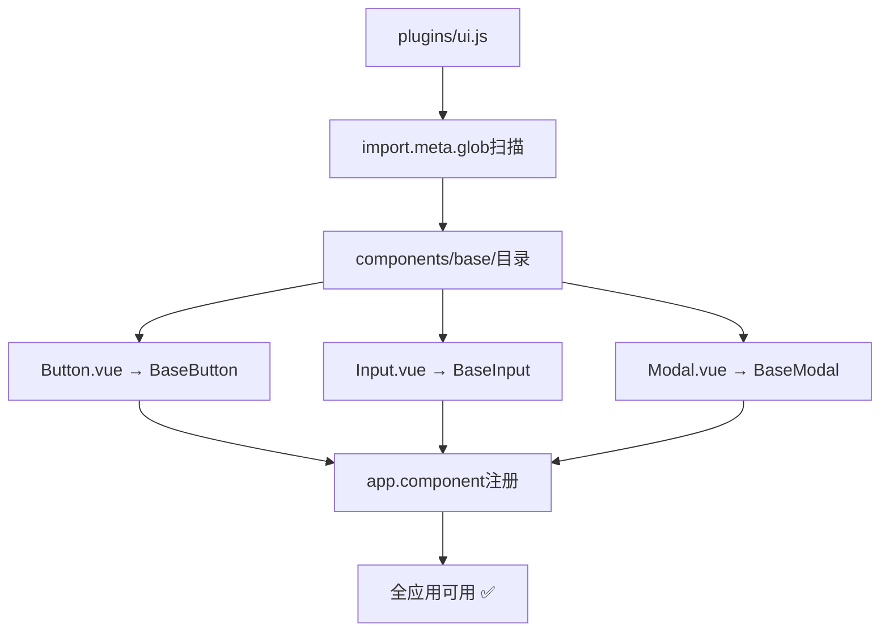
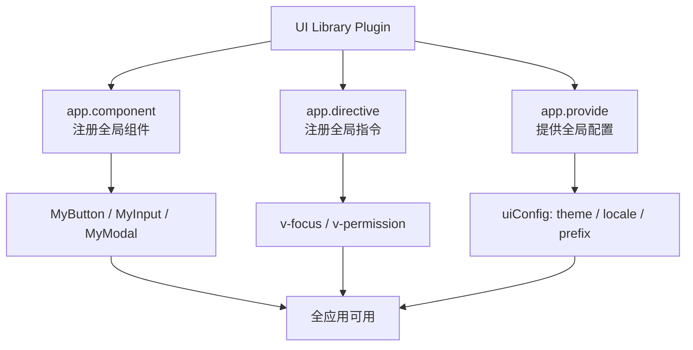

扫描[二维码](https://api2.cmdragon.cn/upload/cmder/20250304_012821924.jpg)关注或者微信搜一搜：`编程智域 前端至全栈交流与成长`

[发现1000+提升效率与开发的AI工具和实用程序](https://tools.cmdragon.cn/zh/apps?category=ai_chat)：https://tools.cmdragon.cn/zh/apps?category=ai_chat

## 一、为啥要用插件注册全局组件？

你有没有写过这样的代码——每个组件都要导入同一个按钮组件：

```vue
<!-- 每个组件都要写这几行 -->
<script setup>
import MyButton from "@/components/MyButton.vue";
import MyInput from "@/components/MyInput.vue";
import MyModal from "@/components/MyModal.vue";
</script>
```

一个项目几十个组件，每个都写一遍import，烦不烦？

用插件注册全局组件后，**任何地方直接用，不用import**：

```vue
<template>
  <MyButton>点我</MyButton>
  <MyInput v-model="name" />
  <MyModal v-model:show="visible" />
</template>
```

这就是插件注册全局组件的好处——**一劳永逸**。

## 二、用app.component()注册全局组件

### 注册单个组件

```javascript
// plugins/ui.js
import MyButton from "@/components/MyButton.vue";

export default {
  install(app) {
    app.component("MyButton", MyButton);
  },
};
```

### 批量注册组件

实际项目中你不可能一个一个注册，太累了。咱们来个批量注册：

```javascript
// plugins/ui.js
import MyButton from "@/components/MyButton.vue";
import MyInput from "@/components/MyInput.vue";
import MyModal from "@/components/MyModal.vue";
import MyCard from "@/components/MyCard.vue";
import MyAlert from "@/components/MyAlert.vue";

const components = {
  MyButton,
  MyInput,
  MyModal,
  MyCard,
  MyAlert,
};

export default {
  install(app) {
    Object.entries(components).forEach(([name, component]) => {
      app.component(name, component);
    });
  },
};
```

### 更优雅：自动导入注册

用`import.meta.glob`（Vite环境）自动扫描组件目录：

```javascript
// plugins/ui.js
export default {
  install(app) {
    const components = import.meta.glob("@/components/base/*.vue", {
      eager: true,
    });

    Object.entries(components).forEach(([path, module]) => {
      const fileName = path.split("/").pop().replace(".vue", "");
      const componentName = `Base${fileName}`;
      app.component(componentName, module.default);
    });
  },
};
```

这样只要你在`@/components/base/`目录下新建一个`.vue`文件，它就会自动被注册为全局组件，连插件代码都不用改。

假设目录下有：

- `Button.vue` → 注册为`<BaseButton>`
- `Input.vue` → 注册为`<BaseInput>`
- `Modal.vue` → 注册为`<BaseModal>`



## 三、用app.directive()注册全局指令

### 注册单个指令

```javascript
// plugins/directives.js
export default {
  install(app) {
    app.directive("focus", {
      mounted(el) {
        el.focus();
      },
    });
  },
};
```

用起来：

```vue
<template>
  <input v-focus />
  <!-- 页面加载后自动聚焦 -->
</template>
```

### 常用指令封装

#### v-permission：权限控制

```javascript
app.directive("permission", {
  mounted(el, binding) {
    const requiredPermission = binding.value;
    const userPermissions = []; // 从store或inject获取

    if (!userPermissions.includes(requiredPermission)) {
      el.parentNode?.removeChild(el);
    }
  },
});
```

用起来：

```vue
<template>
  <button v-permission="'admin'">删除用户</button>
  <!-- 只有admin权限的用户才能看到这个按钮 -->
</template>
```

#### v-debounce：防抖点击

```javascript
app.directive("debounce", {
  mounted(el, binding) {
    const delay = binding.arg ? parseInt(binding.arg) : 300;
    const handler = binding.value;
    let timer = null;

    el.addEventListener("click", () => {
      if (timer) clearTimeout(timer);
      timer = setTimeout(() => {
        handler();
      }, delay);
    });
  },
});
```

用起来：

```vue
<template>
  <button v-debounce="handleSubmit">提交</button>
  <button v-debounce:500="handleSave">保存（500ms防抖）</button>
</template>
```

#### v-loading：加载状态

```javascript
app.directive("loading", {
  mounted(el, binding) {
    const mask = document.createElement("div");
    mask.className = "v-loading-mask";
    mask.innerHTML = '<div class="spinner"></div>';
    mask.style.display = binding.value ? "flex" : "none";
    el.style.position = "relative";
    el.appendChild(mask);
  },
  updated(el, binding) {
    const mask = el.querySelector(".v-loading-mask");
    if (mask) {
      mask.style.display = binding.value ? "flex" : "none";
    }
  },
});
```

用起来：

```vue
<template>
  <div v-loading="isLoading">
    <!-- 内容 -->
  </div>
</template>
```

### 批量注册指令

跟组件一样，指令也可以批量注册：

```javascript
// plugins/directives.js
const focus = {
  mounted(el) {
    el.focus();
  },
};

const permission = {
  mounted(el, binding) {
    // ...
  },
};

const debounce = {
  mounted(el, binding) {
    // ...
  },
};

const directives = { focus, permission, debounce };

export default {
  install(app) {
    Object.entries(directives).forEach(([name, directive]) => {
      app.directive(name, directive);
    });
  },
};
```

## 四、把组件和指令放一个插件里

如果你的UI组件库既有组件又有指令，可以都放一个插件里：

```javascript
// plugins/uiLibrary.js
import MyButton from "@/components/MyButton.vue";
import MyInput from "@/components/MyInput.vue";
import MyModal from "@/components/MyModal.vue";

const components = { MyButton, MyInput, MyModal };

const directives = {
  focus: {
    mounted(el) {
      el.focus();
    },
  },
  permission: {
    mounted(el, binding) {
      /* ... */
    },
  },
};

export default {
  install(app, options = {}) {
    // 注册组件
    Object.entries(components).forEach(([name, component]) => {
      app.component(name, component);
    });

    // 注册指令
    Object.entries(directives).forEach(([name, directive]) => {
      app.directive(name, directive);
    });

    // 还可以provide全局配置
    app.provide("uiConfig", options);
  },
};
```

安装时传配置：

```javascript
// main.js
import uiLibrary from "./plugins/uiLibrary.js";

app.use(uiLibrary, {
  theme: "dark",
  locale: "zh",
  prefix: "My",
});
```



## 五、全局注册的注意事项

### 命名冲突

全局组件和指令的名字是全局唯一的。如果你的插件注册了一个`MyButton`，另一个插件也注册了`MyButton`，后者会覆盖前者。

建议给组件名加个前缀：

```javascript
app.component("MyButton", MyButton); // 加前缀My
app.component("BaseInput", MyInput); // 加前缀Base
app.component("AppModal", MyModal); // 加前缀App
```

### Tree-shaking问题

全局注册的组件和指令无法被Tree-shaking优化。也就是说，即使某个组件你只在个别页面用了，它也会被打包进最终产物。

如果你的项目对包体积很敏感，建议：

- 高频使用的组件用全局注册（如按钮、输入框）
- 低频使用的组件用局部导入

### 调试困难

全局注册的组件在DevTools里看不到导入来源，调试的时候可能搞不清这个组件是从哪来的。所以全局注册要适度，别啥都往全局塞。

## 课后 Quiz

### 问题 1

用插件注册全局组件和局部import组件，各有什么优缺点？

#### 答案解析

**全局注册优点**：不用每个组件都import，直接用；适合高频使用的通用组件。
**全局注册缺点**：无法Tree-shaking，增加包体积；命名容易冲突；调试时看不出组件来源。
**局部import优点**：按需加载，包体积小；来源清晰，方便调试。
**局部import缺点**：每个组件都要写import，重复劳动。

建议：高频通用组件全局注册，低频特殊组件局部导入。

### 问题 2

`import.meta.glob`是什么？为什么用它来批量注册组件？

#### 答案解析

`import.meta.glob`是Vite提供的特殊API，用来批量导入匹配某个模式的文件。它返回一个对象，key是文件路径，value是动态导入函数。用它来批量注册组件的好处是——新建组件文件后不用手动修改插件代码，组件会自动被发现和注册。

### 问题 3

为什么全局注册的组件无法被Tree-shaking？

#### 答案解析

因为Tree-shaking依赖静态分析——打包工具需要确定哪些代码没被使用才能移除。全局注册的组件通过`app.component()`动态注册，打包工具无法确定哪些组件在模板中被使用了，所以只能全部保留在最终产物中。而局部import是静态的，打包工具可以分析出哪些组件没被使用并移除。

## 常见报错解决方案

### 报错 1：`Failed to resolve component: MyButton`

**错误场景**：

```vue
<template>
  <MyButton>点我</MyButton>
  <!-- 💥 找不到组件 -->
</template>
```

**报错原因**：
组件没有被注册。可能是插件没安装，或者组件名写错了。

**解决方案**：

1. 确认`app.use()`已调用
2. 检查组件名是否一致（大小写敏感）
3. 检查组件是否正确导出

```javascript
// 确认注册
app.component("MyButton", MyButton); // 名字要一致

// 确认安装
app.use(uiPlugin); // 别忘了这行
```

### 报错 2：`Failed to resolve directive: focus`

**错误场景**：

```vue
<template>
  <input v-focus />
  <!-- 💥 找不到指令 -->
</template>
```

**报错原因**：
指令没有被注册，或者指令名写错了。注意指令名不需要加`v-`前缀。

**解决方案**：
注册时用不带`v-`的名字：

```javascript
app.directive('focus', { ... }) // ✅ 注册时用 'focus'
// 使用时用 v-focus
```

### 报错 3：`import.meta.glob is not a function`

**错误场景**：

```javascript
const components = import.meta.glob("./*.vue"); // 💥 报错
```

**报错原因**：
`import.meta.glob`是Vite特有的API，在Webpack或其他构建工具中不可用。

**解决方案**：
如果用Webpack，用`require.context`替代：

```javascript
const requireComponent = require.context("./", false, /\.vue$/);
requireComponent.keys().forEach((fileName) => {
  const component = requireComponent(fileName).default;
  const name = fileName.replace(/^\.\//, "").replace(/\.vue$/, "");
  app.component(name, component);
});
```

或者手动导入，不依赖自动扫描。

## 参考链接

- Vue 3 官方文档 - 插件：https://vuejs.org/guide/reusability/plugins.html
- Vue 3 官方文档 - app.component()：https://vuejs.org/api/application.html#app-component
- Vue 3 官方文档 - app.directive()：https://vuejs.org/api/application.html#app-directive
- Vite 文档 - Glob导入：https://vitejs.dev/guide/features.html#glob-import

余下文章内容请点击跳转至 个人博客页面 或者 扫描[二维码](https://api2.cmdragon.cn/upload/cmder/20250304_012821924.jpg)关注或者微信搜一搜：`编程智域 前端至全栈交流与成长`，阅读完整的文章：[用插件注册全局组件和自定义指令，一劳永逸](https://blog.cmdragon.cn/posts/p4d5e6f7a8b9c0d1e2f3a4b5c6d7e8f9/)

<details>
<summary>往期文章归档</summary>

- [Vue 3 静态与动态 Props 如何传递？TypeScript 类型约束有何必要？](https://blog.cmdragon.cn/posts/94ab48753b64780ca3ab7a7115ae8522/)
- [Vue 3中组件局部注册的优势与实现方式如何？](https://blog.cmdragon.cn/posts/dbf576e744870f6de26fd8a2e03e47da/)
- [如何在Vue3中优化生命周期钩子性能并规避常见陷阱？](https://blog.cmdragon.cn/posts/12d98b3b9ccd6c19a1b169d720ac5c80/)
- [Vue 3 Composition API生命周期钩子：如何实现从基础理解到高阶复用？](https://blog.cmdragon.cn/posts/8884e2b70287fcb263c57648eeb27419/)
- [Vue 3生命周期钩子实战指南：如何正确选择onMounted、onUpdated与onUnmounted的应用场景？](https://blog.cmdragon.cn/posts/883c6dbc50ae4183770a4462e0b8ae4d/)
- [Vue 3中生命周期钩子与响应式系统如何实现协同工作？](https://blog.cmdragon.cn/posts/70dad360ffa9dce14d0d69611b8cb019/)
- [Vue 3组件生命周期钩子的执行顺序与使用场景是什么？](https://blog.cmdragon.cn/posts/db44294a78dc9f666f67b053f6c83567/)
- [Vue组件全局注册与局部注册如何抉择？](https://blog.cmdragon.cn/posts/43ead630ea17da65d99ad2eb8188e472/)
- [Vue3组件化开发中，Props与Emits如何实现数据流转与事件协作？](https://blog.cmdragon.cn/posts/8cff7d2df113da66ea7be560c4d1d22a/)
- [Vue 3模板引用如何与其他特性协同实现复杂交互？](https://blog.cmdragon.cn/posts/331bf75d114ab09116eadfcdca602b58/)
- [Vue 3 v-for中模板引用如何实现高效管理与动态控制？](https://blog.cmdragon.cn/posts/cb380897ddc3578b180ecf8843c774c1/)
- [Vue 3的defineExpose：如何突破script setup组件默认封装，实现精准的父子通讯？](https://blog.cmdragon.cn/posts/202ae0f4acde7128e0e31baf63732fb5/)
- [Vue 3模板引用的生命周期时机如何把握？常见陷阱该如何避免？](https://blog.cmdragon.cn/posts/7d2a0f6555ecbe92afd7d2491c427463/)
- [Vue 3模板引用如何实现父组件与子组件的高效交互？](https://blog.cmdragon.cn/posts/3fb7bdd84128b7efaaa1c979e1f28dee/)
- [Vue中为何需要模板引用？又如何高效实现DOM与组件实例的直接访问？](https://blog.cmdragon.cn/posts/23f3464ba16c7054b4783cded50c04c6/)

</details>

<details>
<summary>免费好用的热门在线工具</summary>

- [多直播聚合器 - 应用商店 | By cmdragon](https://tools.cmdragon.cn/zh/apps/multi-live-aggregator)
- [Proto文件生成器 - 应用商店 | By cmdragon](https://tools.cmdragon.cn/zh/apps/proto-file-generator)
- [图片转粒子 - 应用商店 | By cmdragon](https://tools.cmdragon.cn/zh/apps/image-to-particles)
- [视频下载器 - 应用商店 | By cmdragon](https://tools.cmdragon.cn/zh/apps/video-downloader)
- [文件格式转换器 - 应用商店 | By cmdragon](https://tools.cmdragon.cn/zh/apps/file-converter)
- [M3U8在线播放器 - 应用商店 | By cmdragon](https://tools.cmdragon.cn/zh/apps/m3u8-player)
- [快图设计 - 应用商店 | By cmdragon](https://tools.cmdragon.cn/zh/apps/quick-image-design)
- [高级文字转图片转换器 - 应用商店 | By cmdragon](https://tools.cmdragon.cn/zh/apps/text-to-image-advanced)
- [RAID 计算器 - 应用商店 | By cmdragon](https://tools.cmdragon.cn/zh/apps/raid-calculator)
- [在线PS - 应用商店 | By cmdragon](https://tools.cmdragon.cn/zh/apps/photoshop-online)
- [Mermaid 在线编辑器 - 应用商店 | By cmdragon](https://tools.cmdragon.cn/zh/apps/mermaid-live-editor)
- [数学求解计算器 - 应用商店 | By cmdragon](https://tools.cmdragon.cn/zh/apps/math-solver-calculator)
- [智能提词器 - 应用商店 | By cmdragon](https://tools.cmdragon.cn/zh/apps/smart-teleprompter)
- [魔法简历 - 应用商店 | By cmdragon](https://tools.cmdragon.cn/zh/apps/magic-resume)
- [Image Puzzle Tool - 图片拼图工具 | By cmdragon](https://tools.cmdragon.cn/zh/apps/image-puzzle-tool)
- [字幕下载工具 - 应用商店 | By cmdragon](https://tools.cmdragon.cn/zh/apps/subtitle-downloader)
- [歌词生成工具 - 应用商店 | By cmdragon](https://tools.cmdragon.cn/zh/apps/lyrics-generator)
- [网盘资源聚合搜索 - 应用商店 | By cmdragon](https://tools.cmdragon.cn/zh/apps/cloud-drive-search)
- [ASCII字符画生成器 - 应用商店 | By cmdragon](https://tools.cmdragon.cn/zh/apps/ascii-art-generator)
- [JSON Web Tokens 工具 - 应用商店 | By cmdragon](https://tools.cmdragon.cn/zh/apps/jwt-tool)
- [Bcrypt 密码工具 - 应用商店 | By cmdragon](https://tools.cmdragon.cn/zh/apps/bcrypt-tool)
- [GIF 合成器 - 应用商店 | By cmdragon](https://tools.cmdragon.cn/zh/apps/gif-composer)
- [GIF 分解器 - 应用商店 | By cmdragon](https://tools.cmdragon.cn/zh/apps/gif-decomposer)
- [文本隐写术 - 应用商店 | By cmdragon](https://tools.cmdragon.cn/zh/apps/text-steganography)
- [CMDragon 在线工具 - 高级AI工具箱与开发者套件 | 免费好用的在线工具](https://tools.cmdragon.cn/zh)
- [应用商店 - 发现1000+提升效率与开发的AI工具和实用程序 | 免费好用的在线工具](https://tools.cmdragon.cn/zh/apps?category=trending)
- [CMDragon 更新日志 - 最新更新、功能与改进 | 免费好用的在线工具](https://tools.cmdragon.cn/zh/changelog)
- [支持我们 - 成为赞助者 | 免费好用的在线工具](https://tools.cmdragon.cn/zh/sponsor)
- [AI文本生成图像 - 应用商店 | 免费好用的在线工具](https://tools.cmdragon.cn/zh/apps/text-to-image-ai)
- [临时邮箱 - 应用商店 | 免费好用的在线工具](https://tools.cmdragon.cn/zh/apps/temp-email)
- [二维码解析器 - 应用商店 | 免费好用的在线工具](https://tools.cmdragon.cn/zh/apps/qrcode-parser)
- [文本转思维导图 - 应用商店 | 免费好用的在线工具](https://tools.cmdragon.cn/zh/apps/text-to-mindmap)
- [正则表达式可视化工具 - 应用商店 | 免费好用的在线工具](https://tools.cmdragon.cn/zh/apps/regex-visualizer)
- [文件隐写工具 - 应用商店 | 免费好用的在线工具](https://tools.cmdragon.cn/zh/apps/steganography-tool)
- [IPTV 频道探索器 - 应用商店 | 免费好用的在线工具](https://tools.cmdragon.cn/zh/apps/iptv-explorer)
- [快传 - 应用商店 | By cmdragon](https://tools.cmdragon.cn/zh/apps/snapdrop)
- [随机抽奖工具 - 应用商店 | 免费好用的在线工具](https://tools.cmdragon.cn/zh/apps/lucky-draw)
- [动漫场景查找器 - 应用商店 | 免费好用的在线工具](https://tools.cmdragon.cn/zh/apps/anime-scene-finder)
- [时间工具箱 - 应用商店 | 免费好用的在线工具](https://tools.cmdragon.cn/zh/apps/time-toolkit)
- [网速测试 - 应用商店 | 免费好用的在线工具](https://tools.cmdragon.cn/zh/apps/speed-test)
- [AI 智能抠图工具 - 应用商店 | 免费好用的在线工具](https://tools.cmdragon.cn/zh/apps/background-remover)
- [背景替换工具 - 应用商店 | 免费好用的在线工具](https://tools.cmdragon.cn/zh/apps/background-replacer)
- [艺术二维码生成器 - 应用商店 | 免费好用的在线工具](https://tools.cmdragon.cn/zh/apps/artistic-qrcode)
- [Open Graph 元标签生成器 - 应用商店 | 免费好用的在线工具](https://tools.cmdragon.cn/zh/apps/open-graph-generator)
- [图像对比工具 - 应用商店 | 免费好用的在线工具](https://tools.cmdragon.cn/zh/apps/image-comparison)
- [图片压缩专业版 - 应用商店 | 免费好用的在线工具](https://tools.cmdragon.cn/zh/apps/image-compressor)
- [密码生成器 - 应用商店 | 免费好用的在线工具](https://tools.cmdragon.cn/zh/apps/password-generator)
- [SVG优化器 - 应用商店 | 免费好用的在线工具](https://tools.cmdragon.cn/zh/apps/svg-optimizer)
- [调色板生成器 - 应用商店 | 免费好用的在线工具](https://tools.cmdragon.cn/zh/apps/color-palette)
- [在线节拍器 - 应用商店 | 免费好用的在线工具](https://tools.cmdragon.cn/zh/apps/online-metronome)
- [IP归属地查询 - 应用商店 | 免费好用的在线工具](https://tools.cmdragon.cn/zh/apps/ip-geolocation)
- [CSS网格布局生成器 - 应用商店 | 免费好用的在线工具](https://tools.cmdragon.cn/zh/apps/css-grid-layout)
- [邮箱验证工具 - 应用商店 | 免费好用的在线工具](https://tools.cmdragon.cn/zh/apps/email-validator)
- [书法练习字帖 - 应用商店 | 免费好用的在线工具](https://tools.cmdragon.cn/zh/apps/calligraphy-practice)
- [金融计算器套件 - 应用商店 | 免费好用的在线工具](https://tools.cmdragon.cn/zh/apps/finance-calculator-suite)
- [中国亲戚关系计算器 - 应用商店 | 免费好用的在线工具](https://tools.cmdragon.cn/zh/apps/chinese-kinship-calculator)
- [Protocol Buffer 工具箱 - 应用商店 | 免费好用的在线工具](https://tools.cmdragon.cn/zh/apps/protobuf-toolkit)
- [IP归属地查询 - 应用商店 | 免费好用的在线工具](https://tools.cmdragon.cn/zh/apps/ip-geolocation)
- [图片无损放大 - 应用商店 | 免费好用的在线工具](https://tools.cmdragon.cn/zh/apps/image-upscaler)
- [文本比较工具 - 应用商店 | 免费好用的在线工具](https://tools.cmdragon.cn/zh/apps/text-compare)
- [IP批量查询工具 - 应用商店 | 免费好用的在线工具](https://tools.cmdragon.cn/zh/apps/ip-batch-lookup)
- [域名查询工具 - 应用商店 | 免费好用的在线工具](https://tools.cmdragon.cn/zh/apps/domain-finder)
- [DNS工具箱 - 应用商店 | 免费好用的在线工具](https://tools.cmdragon.cn/zh/apps/dns-toolkit)
- [网站图标生成器 - 应用商店 | 免费好用的在线工具](https://tools.cmdragon.cn/zh/apps/favicon-generator)
- [XML Sitemap](https://tools.cmdragon.cn/sitemap_index.xml)

</details>
