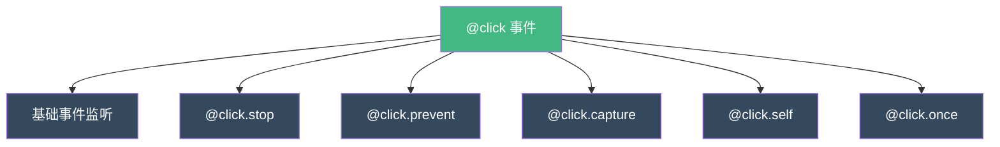
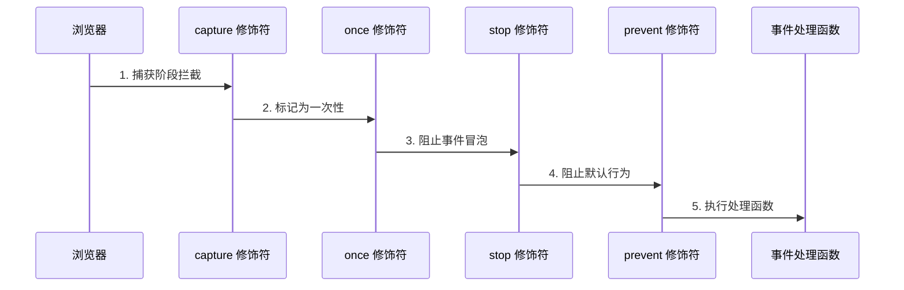
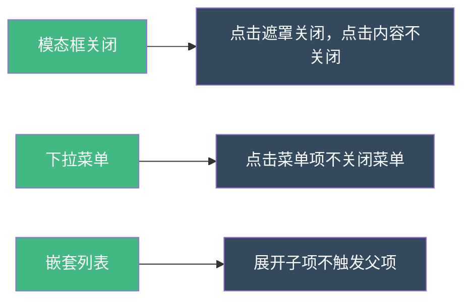
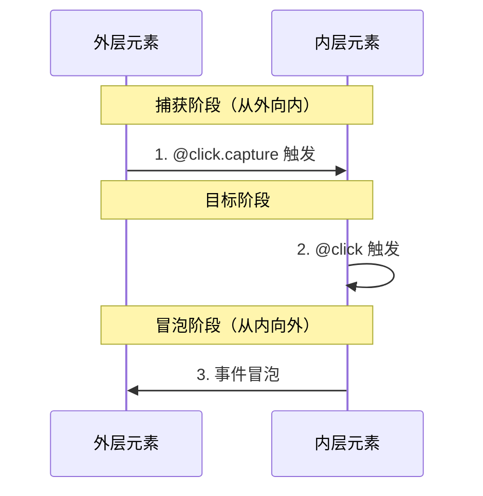

扫描 [二维码](https://api2.cmdragon.cn/upload/cmder/20250304_012821924.jpg) 关注或者微信搜一搜：`编程智域 前端至全栈交流与成长`

[发现 1000+ 提升效率与开发的 AI 工具和实用程序](https://tools.cmdragon.cn/zh/apps?category=ai_chat)：https://tools.cmdragon.cn/

## 1. 事件修饰符的核心概念

在 Vue 3 中，事件修饰符是处理 DOM 事件的强大工具。它们允许我们以声明式的方式处理常见的事件行为，无需在组件方法中编写冗余代码。

### 1.1 什么是事件修饰符？

事件修饰符是以点号（`.`）结尾的指令后缀，用于修改事件监听器的行为。



### 1.2 修饰符的执行顺序

多个修饰符可以同时使用，Vue 会按照特定顺序处理它们：

```vue
<template>
  <!-- 修饰符顺序：capture -> once -> stop -> prevent -->
  <div @click.capture.once.stop="handleClick">点击我</div>
</template>

<script setup>
function handleClick() {
  console.log("事件被触发");
}
</script>
```

**执行顺序规则：**



## 2. 基础事件修饰符详解

### 2.1 `.stop` - 阻止事件冒泡

相当于调用 `event.stopPropagation()`

```vue
<template>
  <div class="outer" @click="handleOuterClick">
    外层元素

    <div class="inner" @click.stop="handleInnerClick">
      内层元素（点击我不会触发外层事件）
    </div>
  </div>
</template>

<script setup>
function handleOuterClick() {
  console.log("外层元素被点击");
}

function handleInnerClick() {
  console.log("内层元素被点击");
}
</script>

<style scoped>
.outer {
  padding: 2rem;
  background-color: #42b883;
  color: #fff;
}

.inner {
  padding: 1rem;
  margin-top: 1rem;
  background-color: #35495e;
  cursor: pointer;
}
</style>
```

**应用场景：**



### 2.2 `.prevent` - 阻止默认行为

相当于调用 `event.preventDefault()`

```vue
<template>
  <!-- 表单提交不刷新页面 -->
  <form @submit.prevent="handleSubmit">
    <input v-model="username" placeholder="用户名" />
    <input v-model="password" type="password" placeholder="密码" />
    <button type="submit">登录</button>
  </form>

  <!-- 链接不跳转 -->
  <a href="https://example.com" @click.prevent="handleLinkClick">
    点击我（不会跳转）
  </a>

  <!-- 右键菜单 -->
  <div @contextmenu.prevent="handleContextMenu">
    右键点击我（显示自定义菜单）
  </div>
</template>

<script setup>
import { ref } from "vue";

const username = ref("");
const password = ref("");

function handleSubmit() {
  console.log("提交登录:", {
    username: username.value,
    password: password.value,
  });
  // 使用 AJAX 提交，不刷新页面
}

function handleLinkClick() {
  console.log("链接被点击，但不跳转");
}

function handleContextMenu(event) {
  event.preventDefault();
  console.log("显示自定义菜单", event.clientX, event.clientY);
}
</script>
```

### 2.3 `.capture` - 捕获模式监听

使用捕获模式添加事件监听器，事件从外向内传播时触发。

```vue
<template>
  <div class="outer" @click.capture="handleOuterCapture">
    外层（捕获模式）

    <div class="inner" @click="handleInnerClick">内层（冒泡模式）</div>
  </div>
</template>

<script setup>
function handleOuterCapture() {
  console.log("1. 外层捕获阶段触发");
}

function handleInnerClick() {
  console.log("2. 内层冒泡阶段触发");
}

// 点击顺序：
// 1. 外层捕获阶段触发
// 2. 内层冒泡阶段触发
// 3. 外层冒泡阶段（如果有 @click）
</script>
```

**事件传播流程：**



### 2.4 `.self` - 仅自身触发

只有当事件的目标元素是元素本身时才触发。

```vue
<template>
  <div class="container" @click.self="handleContainerClick">
    <p>点击我会触发</p>
    <button @click="handleButtonClick">点击按钮不会触发容器事件</button>
  </div>
</template>

<script setup>
function handleContainerClick() {
  console.log("容器本身被点击");
}

function handleButtonClick() {
  console.log("按钮被点击");
}
</script>

<style scoped>
.container {
  padding: 2rem;
  background-color: #f0f0f0;
  border: 2px solid #42b883;
}

.container p {
  cursor: pointer;
  color: #35495e;
}

.container button {
  margin-top: 1rem;
  padding: 0.5rem 1rem;
  background-color: #42b883;
  color: #fff;
  border: none;
  border-radius: 4px;
}
</style>
```

### 2.5 `.once` - 只触发一次

事件监听器只会触发一次，触发后自动移除。

```vue
<template>
  <button @click.once="handleOnceClick">只能点击一次</button>

  <!-- 组合使用 -->
  <form @submit.once="handleSubmit">
    <input type="text" placeholder="只能提交一次" />
    <button type="submit">提交</button>
  </form>
</template>

<script setup>
function handleOnceClick() {
  console.log("第一次点击");
  // 第二次点击不会触发
}

function handleSubmit() {
  console.log("表单只能提交一次");
}
</script>
```

## 3. 按键修饰符深度应用

### 3.1 基础按键修饰符

Vue 提供了常用的按键修饰符：

```vue
<template>
  <div>
    <!-- 回车键提交 -->
    <input
      v-model="username"
      @keyup.enter="handleSubmit"
      placeholder="按回车提交"
    />

    <!-- ESC 键取消 -->
    <input
      v-model="searchQuery"
      @keyup.esc="handleCancel"
      placeholder="按 ESC 取消"
    />

    <!-- 删除键清空 -->
    <input
      v-model="text"
      @keyup.delete="handleClear"
      placeholder="按删除键清空"
    />

    <!-- 制表键聚焦 -->
    <input v-model="value" @keyup.tab="handleFocus" placeholder="按 Tab 聚焦" />
  </div>
</template>

<script setup>
import { ref } from "vue";

const username = ref("");
const searchQuery = ref("");
const text = ref("");
const value = ref("");

function handleSubmit() {
  console.log("提交:", username.value);
}

function handleCancel() {
  console.log("取消搜索");
  searchQuery.value = "";
}

function handleClear() {
  console.log("清空文本");
  text.value = "";
}

function handleFocus() {
  console.log("聚焦输入");
}
</script>
```

### 3.2 字母按键修饰符

可以直接使用字母作为修饰符：

```vue
<template>
  <div @keyup.a="handleA" @keyup.b="handleB">
    <p>按 A 键：{{ countA }} 次</p>
    <p>按 B 键：{{ countB }} 次</p>
  </div>
</template>

<script setup>
import { ref } from "vue";

const countA = ref(0);
const countB = ref(0);

function handleA() {
  countA.value++;
  console.log("按下了 A 键");
}

function handleB() {
  countB.value++;
  console.log("按下了 B 键");
}
</script>
```

### 3.3 系统修饰键

配合 Ctrl、Alt、Shift、Meta 使用：

```vue
<template>
  <div>
    <!-- 单个系统修饰键 -->
    <input @keyup.ctrl="handleCtrl" placeholder="按住 Ctrl + 任意键" />

    <input @keyup.alt="handleAlt" placeholder="按住 Alt + 任意键" />

    <input @keyup.shift="handleShift" placeholder="按住 Shift + 任意键" />

    <input @keyup.meta="handleMeta" placeholder="按住 Win/Cmd + 任意键" />

    <!-- 组合键 -->
    <input @keyup.ctrl.s="handleSave" placeholder="Ctrl + S 保存" />

    <input @keyup.alt.enter="handleAltEnter" placeholder="Alt + Enter 换行" />
  </div>
</template>

<script setup>
function handleCtrl() {
  console.log("Ctrl 组合键");
}

function handleAlt() {
  console.log("Alt 组合键");
}

function handleShift() {
  console.log("Shift 组合键");
}

function handleMeta() {
  console.log("Meta 组合键");
}

function handleSave() {
  console.log("保存操作 (Ctrl+S)");
}

function handleAltEnter() {
  console.log("Alt + Enter");
}
</script>
```

### 3.4 `.exact` 修饰符

确保只有指定的修饰键被按下时才触发：

```vue
<template>
  <div>
    <!-- 仅 Ctrl 键，不包含其他修饰键 -->
    <button @click.ctrl.exact="handleCtrlOnly">
      仅 Ctrl 键（不包含 Alt/Shift）
    </button>

    <!-- Ctrl + Shift 组合，不包含其他键 -->
    <button @click.ctrl.shift.exact="handleCtrlShift">Ctrl + Shift 组合</button>

    <!-- 没有任何修饰键 -->
    <button @click.exact="handleNoModifier">直接点击（无任何修饰键）</button>
  </div>
</template>

<script setup>
function handleCtrlOnly() {
  console.log("仅按下了 Ctrl 键");
}

function handleCtrlShift() {
  console.log("按下了 Ctrl + Shift");
}

function handleNoModifier() {
  console.log("直接点击，没有按任何修饰键");
}
</script>
```

## 4. 实战案例：快捷键系统

### 4.1 全局快捷键管理器

```vue
<!-- App.vue -->
<template>
  <div
    class="app"
    @keydown.ctrl.s.prevent="handleSave"
    @keydown.ctrl.n.prevent="handleNew"
    @keydown.ctrl.o.prevent="handleOpen"
    @keydown.esc.prevent="handleCancel"
    @keydown.f1.prevent="handleHelp"
    tabindex="-1"
  >
    <header>
      <h1>文本编辑器</h1>
      <div class="shortcuts-hint">
        <span>Ctrl+S: 保存</span>
        <span>Ctrl+N: 新建</span>
        <span>Ctrl+O: 打开</span>
        <span>ESC: 取消</span>
        <span>F1: 帮助</span>
      </div>
    </header>

    <main>
      <textarea
        v-model="content"
        placeholder="开始编辑..."
        @keydown.ctrl.s.prevent="handleSave"
      ></textarea>
    </main>

    <footer>
      <p>状态：{{ status }}</p>
    </footer>
  </div>
</template>

<script setup>
import { ref, onMounted, onUnmounted } from "vue";

const content = ref("");
const status = ref("就绪");

function handleSave() {
  status.value = "保存中...";
  console.log("保存内容:", content.value);

  setTimeout(() => {
    status.value = "已保存";
  }, 1000);
}

function handleNew() {
  if (confirm("确定要新建吗？未保存的内容将丢失。")) {
    content.value = "";
    status.value = "新建文档";
  }
}

function handleOpen() {
  console.log("打开文件对话框");
  status.value = "打开文件";
}

function handleCancel() {
  console.log("取消操作");
  status.value = "已取消";
}

function handleHelp() {
  alert(
    "快捷键帮助:\nCtrl+S: 保存\nCtrl+N: 新建\nCtrl+O: 打开\nESC: 取消\nF1: 帮助",
  );
}

// 确保 div 可以接收键盘事件
onMounted(() => {
  document.querySelector(".app")?.focus();
});
</script>

<style scoped>
.app {
  min-height: 100vh;
  display: flex;
  flex-direction: column;
  outline: none;
}

header {
  background-color: #35495e;
  color: #fff;
  padding: 1rem 2rem;
  display: flex;
  justify-content: space-between;
  align-items: center;
}

.shortcuts-hint {
  display: flex;
  gap: 1rem;
  font-size: 0.875rem;
  opacity: 0.8;
}

main {
  flex: 1;
  padding: 2rem;
}

textarea {
  width: 100%;
  height: 100%;
  min-height: 400px;
  padding: 1rem;
  font-size: 1rem;
  border: 2px solid #e0e0e0;
  border-radius: 8px;
  resize: vertical;
}

footer {
  background-color: #f0f0f0;
  padding: 0.5rem 2rem;
  border-top: 1px solid #e0e0e0;
}
</style>
```

### 4.2 模态框快捷键

```vue
<!-- Modal.vue -->
<template>
  <div
    class="modal-overlay"
    @click.self="handleOverlayClick"
    @keydown.esc="handleEscKey"
    tabindex="-1"
  >
    <div class="modal-content">
      <header>
        <h2>{{ title }}</h2>
        <button class="close-btn" @click="handleClose">✕</button>
      </header>

      <main>
        <slot></slot>
      </main>

      <footer>
        <button @click="handleCancel">取消 (ESC)</button>
        <button @click="handleConfirm" class="confirm-btn">确定 (Enter)</button>
      </footer>
    </div>
  </div>
</template>

<script setup>
const emit = defineEmits(["close", "confirm"]);

defineProps({
  title: {
    type: String,
    required: true,
  },
});

function handleOverlayClick() {
  emit("close");
}

function handleEscKey() {
  emit("close");
}

function handleClose() {
  emit("close");
}

function handleCancel() {
  emit("close");
}

function handleConfirm() {
  emit("confirm");
}
</script>

<style scoped>
.modal-overlay {
  position: fixed;
  top: 0;
  left: 0;
  right: 0;
  bottom: 0;
  background-color: rgba(0, 0, 0, 0.5);
  display: flex;
  align-items: center;
  justify-content: center;
  z-index: 1000;
  outline: none;
}

.modal-content {
  background: #fff;
  border-radius: 8px;
  min-width: 400px;
  max-width: 90%;
  max-height: 90vh;
  overflow: auto;
  box-shadow: 0 10px 25px rgba(0, 0, 0, 0.3);
}

header {
  display: flex;
  justify-content: space-between;
  align-items: center;
  padding: 1rem 1.5rem;
  border-bottom: 1px solid #e0e0e0;
}

.close-btn {
  background: none;
  border: none;
  font-size: 1.5rem;
  cursor: pointer;
  color: #666;
}

main {
  padding: 1.5rem;
}

footer {
  display: flex;
  justify-content: flex-end;
  gap: 1rem;
  padding: 1rem 1.5rem;
  border-top: 1px solid #e0e0e0;
}

button {
  padding: 0.5rem 1rem;
  border: 1px solid #e0e0e0;
  border-radius: 4px;
  cursor: pointer;
}

.confirm-btn {
  background-color: #42b883;
  color: #fff;
  border-color: #42b883;
}
</style>
```

## 5. 组件事件修饰符

### 5.1 原生事件修饰符

在组件上使用事件修饰符：

```vue
<!-- ChildComponent.vue -->
<template>
  <button @click="handleClick">点击我</button>
</template>

<script setup>
const emit = defineEmits(["click"]);

function handleClick(event) {
  emit("click", event);
}
</script>
```

```vue
<!-- ParentComponent.vue -->
<template>
  <!-- 阻止事件冒泡 -->
  <ChildComponent @click.stop="handleClick" />

  <!-- 只触发一次 -->
  <ChildComponent @click.once="handleClickOnce" />

  <!-- 阻止默认行为 -->
  <ChildComponent @click.prevent="handleClickPrevent" />
</template>

<script setup>
import ChildComponent from "./ChildComponent.vue";

function handleClick() {
  console.log("点击事件（阻止冒泡）");
}

function handleClickOnce() {
  console.log("只触发一次");
}

function handleClickPrevent() {
  console.log("阻止默认行为");
}
</script>
```

### 5.2 自定义事件修饰符（Vue 3.3+）

Vue 3.3 引入了自定义事件修饰符功能：

```vue
<!-- MyInput.vue -->
<template>
  <input :value="modelValue" @input="handleInput" />
</template>

<script setup>
defineProps(["modelValue"]);
const emit = defineEmits({
  // 声明支持 uppercase 修饰符
  "update:modelValue": (value) => true,
});

function handleInput(event) {
  let value = event.target.value;

  // 检查是否使用了 uppercase 修饰符
  if (event.detail?.uppercase) {
    value = value.toUpperCase();
  }

  emit("update:modelValue", value);
}
</script>
```

## 6. 高级技巧与最佳实践

### 6.1 修饰符链式调用

```vue
<template>
  <!-- 多个修饰符组合 -->
  <form @submit.stop.prevent.once="handleSubmit">
    <button type="submit">提交</button>
  </form>

  <!-- 系统修饰键组合 -->
  <div @keydown.ctrl.alt.delete="handleDangerousAction">
    按 Ctrl+Alt+Delete 触发危险操作
  </div>
</template>

<script setup>
function handleSubmit() {
  console.log("表单提交（阻止冒泡、阻止默认、只触发一次）");
}

function handleDangerousAction() {
  console.log("危险操作被触发！");
}
</script>
```

### 6.2 动态修饰符

```vue
<template>
  <input :value="modelValue" @keydown.[keyModifier]="handleKey" />
</template>

<script setup>
import { ref, computed } from "vue";

const props = defineProps({
  modelValue: String,
  modifier: {
    type: String,
    default: "enter",
  },
});

const emit = defineEmits(["update:modelValue"]);

const keyModifier = computed(() => props.modifier);

function handleKey(event) {
  emit("update:modelValue", event.target.value);
}
</script>
```

### 6.3 性能优化

```vue
<script setup>
import { ref, onUnmounted } from "vue";

// 使用 once 修饰符自动清理
function setupOnceListener() {
  window.addEventListener("resize", handleResize, { once: true });
}

// 手动清理事件监听器
const controller = new AbortController();

function setupManualListener() {
  window.addEventListener("scroll", handleScroll, {
    signal: controller.signal,
  });
}

function cleanup() {
  controller.abort();
}

onUnmounted(() => {
  cleanup();
});

function handleResize() {
  console.log("窗口大小改变");
}

function handleScroll() {
  console.log("页面滚动");
}
</script>
```

## 7. 常见报错与解决方案

### 报错 1：修饰符不生效

**问题代码：**

```vue
<!-- ❌ 错误：修饰符位置不对 -->
<input @keyup.enter.prevent="handleSubmit" />
```

**解决方案：**

```vue
<!-- ✅ 正确：修饰符顺序 -->
<input @keyup.enter.prevent="handleSubmit" />
```

### 报错 2：组合键冲突

**问题代码：**

```vue
<!-- ❌ 多个组合键可能冲突 -->
<input @keyup.ctrl.s="handleSave" @keyup.ctrl.a="handleSelectAll" />
```

**解决方案：**

```vue
<!-- ✅ 使用 .exact 确保精确匹配 -->
<input @keyup.ctrl.s.exact="handleSave" @keyup.ctrl.a.exact="handleSelectAll" />
```

### 报错 3：修饰符与事件对象

**问题代码：**

```vue
<!-- ❌ 忘记接收事件对象 -->
<input @keyup.enter="handleKey" />

<script setup>
function handleKey() {
  console.log(event.target.value); // event 未定义
}
</script>
```

**解决方案：**

```vue
<input @keyup.enter="handleKey" />

<script setup>
function handleKey(event) {
  console.log(event.target.value);
}
</script>
```

## 8. 课后 Quiz

### 问题 1：以下代码的执行顺序是什么？

```vue
<div @click.capture="outer">
  <button @click.stop.once="inner">点击</button>
</div>
```

<details>
<summary>点击查看答案解析</summary>

**答案：**

1. `outer` 函数在捕获阶段执行
2. `inner` 函数执行（但阻止了冒泡）
3. `outer` 的冒泡阶段不会执行（被 stop 阻止）
4. 第二次点击时，`inner` 不会执行（once 修饰符）

**解析：** 修饰符执行顺序为：capture → stop → once

</details>

### 问题 2：如何实现仅当按下 Ctrl 键（不按其他修饰键）时触发？

<details>
<summary>点击查看答案解析</summary>

**答案：**

```vue
<div @keydown.ctrl.exact="handleCtrl">
  按 Ctrl 键
</div>
```

**解析：** `.exact` 修饰符确保只有指定的修饰键被按下，排除其他修饰键的干扰。

</details>

## 9. 性能优化建议

### 9.1 避免过度使用修饰符

```vue
<!-- ❌ 不推荐：修饰符过多 -->
<button @click.stop.prevent.capture.once.self="handleClick">
  点击
</button>

<!-- ✅ 推荐：简化逻辑 -->
<button @click="handleClick">
  点击
</button>

<script setup>
function handleClick(event) {
  event.stopPropagation();
  event.preventDefault();
  // 在函数中处理其他逻辑
}
</script>
```

### 9.2 使用事件委托

```vue
<template>
  <!-- ❌ 不推荐：每个按钮都绑定事件 -->
  <div>
    <button @click="handleClick(1)">按钮 1</button>
    <button @click="handleClick(2)">按钮 2</button>
    <button @click="handleClick(3)">按钮 3</button>
  </div>

  <!-- ✅ 推荐：事件委托 -->
  <div @click="handleDelegate">
    <button data-id="1">按钮 1</button>
    <button data-id="2">按钮 2</button>
    <button data-id="3">按钮 3</button>
  </div>
</template>

<script setup>
function handleClick(id) {
  console.log("按钮", id, "被点击");
}

function handleDelegate(event) {
  if (event.target.tagName === "BUTTON") {
    const id = event.target.dataset.id;
    handleClick(id);
  }
}
</script>
```

---

余下文章内容请点击跳转至 个人博客页面 或者 扫描 [二维码](https://api2.cmdragon.cn/upload/cmder/20250304_012821924.jpg) 关注或者微信搜一搜：`编程智域 前端至全栈交流与成长`，阅读完整的文章：[Vue 3 组件事件修饰符与按键修饰符的深度应用](https://blog.cmdragon.cn/posts/vue3-component-event-modifiers-and-key-modifiers/)

<details>
<summary>免费好用的热门在线工具</summary>

- [多直播聚合器 - 应用商店 | By cmdragon](https://tools.cmdragon.cn/zh/apps/multi-live-aggregator)
- [Proto 文件生成器 - 应用商店 | By cmdragon](https://tools.cmdragon.cn/zh/apps/proto-file-generator)
- [图片转粒子 - 应用商店 | By cmdragon](https://tools.cmdragon.cn/zh/apps/image-to-particles)
- [视频下载器 - 应用商店 | By cmdragon](https://tools.cmdragon.cn/zh/apps/video-downloader)
- [文件格式转换器 - 应用商店 | By cmdragon](https://tools.cmdragon.cn/zh/apps/file-converter)
- [M3U8 在线播放器 - 应用商店 | By cmdragon](https://tools.cmdragon.cn/zh/apps/m3u8-player)
- [快图设计 - 应用商店 | By cmdragon](https://tools.cmdragon.cn/zh/apps/quick-image-design)
- [高级文字转图片转换器 - 应用商店 | By cmdragon](https://tools.cmdragon.cn/zh/apps/text-to-image-advanced)
- [RAID 计算器 - 应用商店 | By cmdragon](https://tools.cmdragon.cn/zh/apps/raid-calculator)
- [在线 PS - 应用商店 | By cmdragon](https://tools.cmdragon.cn/zh/apps/photoshop-online)
- [Mermaid 在线编辑器 - 应用商店 | By cmdragon](https://tools.cmdragon.cn/zh/apps/mermaid-live-editor)
- [数学求解计算器 - 应用商店 | By cmdragon](https://tools.cmdragon.cn/zh/apps/math-solver-calculator)
- [智能提词器 - 应用商店 | By cmdragon](https://tools.cmdragon.cn/zh/apps/smart-teleprompter)
- [魔法简历 - 应用商店 | By cmdragon](https://tools.cmdragon.cn/zh/apps/magic-resume)
- [Image Puzzle Tool - 图片拼图工具 | By cmdragon](https://tools.cmdragon.cn/zh/apps/image-puzzle-tool)
- [字幕下载工具 - 应用商店 | By cmdragon](https://tools.cmdragon.cn/zh/apps/subtitle-downloader)
- [歌词生成工具 - 应用商店 | By cmdragon](https://tools.cmdragon.cn/zh/apps/lyrics-generator)
- [网盘资源聚合搜索 - 应用商店 | By cmdragon](https://tools.cmdragon.cn/zh/apps/cloud-drive-search)
- [ASCII 字符画生成器 - 应用商店 | By cmdragon](https://tools.cmdragon.cn/zh/apps/ascii-art-generator)
- [JWT 工具 - 应用商店 | By cmdragon](https://tools.cmdragon.cn/zh/apps/jwt-tool)
- [Bcrypt 密码工具 - 应用商店 | By cmdragon](https://tools.cmdragon.cn/zh/apps/bcrypt-tool)
- [GIF 合成器 - 应用商店 | By cmdragon](https://tools.cmdragon.cn/zh/apps/gif-composer)
- [GIF 分解器 - 应用商店 | By cmdragon](https://tools.cmdragon.cn/zh/apps/gif-decomposer)
- [文本隐写术 - 应用商店 | By cmdragon](https://tools.cmdragon.cn/zh/apps/text-steganography)
- [CMDragon 在线工具 - 高级 AI 工具箱与开发者套件 | 免费好用的在线工具](https://tools.cmdragon.cn/zh)
- [应用商店 - 发现 1000+ 提升效率与开发的 AI 工具和实用程序 | 免费好用的在线工具](https://tools.cmdragon.cn/zh/apps?category=trending)
- [CMDragon 更新日志 - 最新更新、功能与改进 | 免费好用的在线工具](https://tools.cmdragon.cn/zh/changelog)
- [支持我们 - 成为赞助者 | 免费好用的在线工具](https://tools.cmdragon.cn/zh/sponsor)
- [AI 文本生成图像 - 应用商店 | 免费好用的在线工具](https://tools.cmdragon.cn/zh/apps/text-to-image-ai)
- [临时邮箱 - 应用商店 | 免费好用的在线工具](https://tools.cmdragon.cn/zh/apps/temp-email)
- [二维码解析器 - 应用商店 | 免费好用的在线工具](https://tools.cmdragon.cn/zh/apps/qrcode-parser)
- [文本转思维导图 - 应用商店 | 免费好用的在线工具](https://tools.cmdragon.cn/zh/apps/text-to-mindmap)
- [正则表达式可视化工具 - 应用商店 | 免费好用的在线工具](https://tools.cmdragon.cn/zh/apps/regex-visualizer)
- [文件隐写工具 - 应用商店 | By cmdragon](https://tools.cmdragon.cn/zh/apps/steganography-tool)
- [IPTV 频道探索器 - 应用商店 | 免费好用的在线工具](https://tools.cmdragon.cn/zh/apps/iptv-explorer)
- [快传 - 应用商店 | 免费好用的在线工具](https://tools.cmdragon.cn/zh/apps/snapdrop)
- [随机抽奖工具 - 应用商店 | 免费好用的在线工具](https://tools.cmdragon.cn/zh/apps/lucky-draw)
- [动漫场景查找器 - 应用商店 | 免费好用的在线工具](https://tools.cmdragon.cn/zh/apps/anime-scene-finder)
- [时间工具箱 - 应用商店 | 免费好用的在线工具](https://tools.cmdragon.cn/zh/apps/time-toolkit)
- [网速测试 - 应用商店 | 免费好用的在线工具](https://tools.cmdragon.cn/zh/apps/speed-test)
- [AI 智能抠图工具 - 应用商店 | 免费好用的在线工具](https://tools.cmdragon.cn/zh/apps/background-remover)
- [背景替换工具 - 应用商店 | 免费好用的在线工具](https://tools.cmdragon.cn/zh/apps/background-replacer)
- [艺术二维码生成器 - 应用商店 | 免费好用的在线工具](https://tools.cmdragon.cn/zh/apps/artistic-qrcode)
- [Open Graph 元标签生成器 - 应用商店 | 免费好用的在线工具](https://tools.cmdragon.cn/zh/apps/open-graph-generator)
- [图像对比工具 - 应用商店 | 免费好用的在线工具](https://tools.cmdragon.cn/zh/apps/image-comparison)
- [图片压缩专业版 - 应用商店 | 免费好用的在线工具](https://tools.cmdragon.cn/zh/apps/image-compressor)
- [密码生成器 - 应用商店 | 免费好用的在线工具](https://tools.cmdragon.cn/zh/apps/password-generator)
- [SVG 优化器 - 应用商店 | 免费好用的在线工具](https://tools.cmdragon.cn/zh/apps/svg-optimizer)
- [调色板生成器 - 应用商店 | 免费好用的在线工具](https://tools.cmdragon.cn/zh/apps/color-palette)
- [在线节拍器 - 应用商店 | 免费好用的在线工具](https://tools.cmdragon.cn/zh/apps/online-metronome)
- [IP 归属地查询 - 应用商店 | 免费好用的在线工具](https://tools.cmdragon.cn/zh/apps/ip-geolocation)
- [CSS 网格布局生成器 - 应用商店 | 免费好用的在线工具](https://tools.cmdragon.cn/zh/apps/css-grid-layout)
- [邮箱验证工具 - 应用商店 | 免费好用的在线工具](https://tools.cmdragon.cn/zh/apps/email-validator)
- [书法练习字帖 - 应用商店 | 免费好用的在线工具](https://tools.cmdragon.cn/zh/apps/calligraphy-practice)
- [金融计算器套件 - 应用商店 | 免费好用的在线工具](https://tools.cmdragon.cn/zh/apps/finance-calculator-suite)
- [中国亲戚关系计算器 - 应用商店 | 免费好用的在线工具](https://tools.cmdragon.cn/zh/apps/chinese-kinship-calculator)
- [Protocol Buffer 工具箱 - 应用商店 | 免费好用的在线工具](https://tools.cmdragon.cn/zh/apps/protobuf-toolkit)
- [IP 归属地查询 - 应用商店 | 免费好用的在线工具](https://tools.cmdragon.cn/zh/apps/ip-geolocation)
- [图片无损放大 - 应用商店 | 免费好用的在线工具](https://tools.cmdragon.cn/zh/apps/image-upscaler)
- [文本比较工具 - 应用商店 | 免费好用的在线工具](https://tools.cmdragon.cn/zh/apps/text-compare)
- [IP 批量查询工具 - 应用商店 | 免费好用的在线工具](https://tools.cmdragon.cn/zh/apps/ip-batch-lookup)
- [域名查询工具 - 应用商店 | 免费好用的在线工具](https://tools.cmdragon.cn/zh/apps/domain-finder)
- [DNS 工具箱 - 应用商店 | 免费好用的在线工具](https://tools.cmdragon.cn/zh/apps/dns-toolkit)
- [网站图标生成器 - 应用商店 | 免费好用的在线工具](https://tools.cmdragon.cn/zh/apps/favicon-generator)
- [XML Sitemap](https://tools.cmdragon.cn/sitemap_index.xml)

</details>

参考链接：https://vuejs.org/guide/essentials/event-modifiers.html
