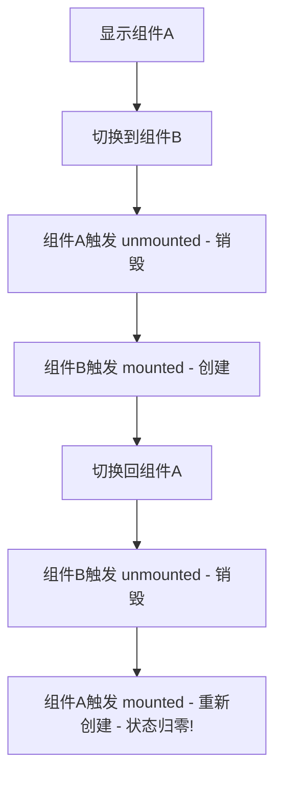
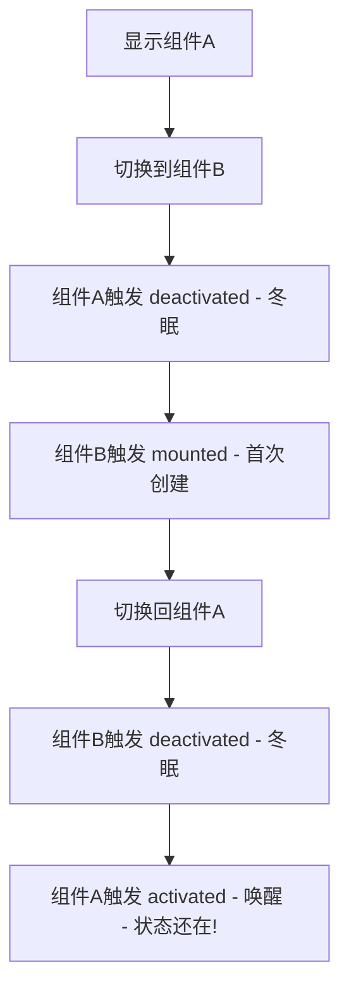

扫描[二维码](https://api2.cmdragon.cn/upload/cmder/20250304_012821924.jpg)关注或者微信搜一搜：`编程智域 前端至全栈交流与成长`

[发现1000+提升效率与开发的AI工具和实用程序](https://tools.cmdragon.cn/zh/apps?category=ai_chat)：https://tools.cmdragon.cn/

## 一、动态组件切换的"失忆症"

在Vue 3里，动态组件是个特别方便的东西，你可以用 `<component :is="xxx">` 来根据条件切换不同的组件，就像翻牌子一样——想看谁就翻谁的牌。

```vue
<script setup>
import { ref } from "vue";
import CompA from "./CompA.vue";
import CompB from "./CompB.vue";

const current = ref("CompA");
</script>

<template>
  <button @click="current = 'CompA'">显示A</button>
  <button @click="current = 'CompB'">显示B</button>

  <component :is="current === 'CompA' ? CompA : CompB" />
</template>
```

但是呢，这个动态组件有个让人头疼的毛病——**切换就失忆**。

你辛辛苦苦填了一堆表单，点了个标签页切走，再切回来一看——白屏了，啥都没了，心态崩不崩？

来，咱看个具体的例子。组件A里有个计数器，组件B里有个输入框：

```vue
<!-- CompA.vue -->
<script setup>
import { ref } from "vue";

const count = ref(0);
</script>

<template>
  <div style="padding: 20px; border: 2px solid #42b983;">
    <h3>组件A - 计数器</h3>
    <p>当前计数：{{ count }}</p>
    <button @click="count++">点我+1</button>
  </div>
</template>
```

```vue
<!-- CompB.vue -->
<script setup>
import { ref } from "vue";

const text = ref("");
</script>

<template>
  <div style="padding: 20px; border: 2px solid #ff6b6b;">
    <h3>组件B - 输入框</h3>
    <input v-model="text" placeholder="随便写点啥" />
    <p>你输入了：{{ text }}</p>
  </div>
</template>
```

现在你在组件A里点了5下计数器，切到组件B输入了"你好"，再切回A——计数器归零了！切到B——输入框也空了！

这就是默认行为：**组件被替换掉后会被销毁，所有状态跟着一起灰飞烟灭**。下次再显示的时候，Vue会创建一个全新的实例，只有初始状态，之前的操作痕迹全没了。

## 二、KeepAlive：给组件贴上"保鲜膜"

Vue 3早就料到你会遇到这个问题，所以给你准备了一个内置组件——`<KeepAlive>`。

用法简单到离谱，就一步：**把动态组件用KeepAlive包起来**。

```vue
<script setup>
import { ref } from "vue";
import CompA from "./CompA.vue";
import CompB from "./CompB.vue";

const current = ref("CompA");
</script>

<template>
  <button @click="current = 'CompA'">显示A</button>
  <button @click="current = 'CompB'">显示B</button>

  <!-- 不加KeepAlive：切换后状态丢失 -->
  <!-- <component :is="current === 'CompA' ? CompA : CompB" /> -->

  <!-- 加了KeepAlive：切换后状态保留！ -->
  <KeepAlive>
    <component :is="current === 'CompA' ? CompA : CompB" />
  </KeepAlive>
</template>
```

加了KeepAlive之后，你在组件A里点了5下，切到B输入了"你好"，再切回A——计数器还是5！切到B——"你好"还在！

就这么简单，一行代码搞定状态保持。

## 三、KeepAlive到底做了啥？

光知道怎么用还不够，咱得搞明白KeepAlive背后的原理，不然遇到坑都不知道咋回事。

### 普通切换 vs KeepAlive切换

不用KeepAlive的时候，组件切换的流程是这样的：



用了KeepAlive之后，流程变成了这样：



看出区别了吧？

| 对比项   | 不用KeepAlive       | 用KeepAlive         |
| -------- | ------------------- | ------------------- |
| 切走时   | unmounted（销毁）   | deactivated（冬眠） |
| 切回时   | mounted（重新创建） | activated（唤醒）   |
| 状态     | 全部丢失            | 完整保留            |
| 组件实例 | 被销毁，内存释放    | 保留在内存中        |

说白了，KeepAlive就是让被切走的组件"冬眠"而不是"死亡"。组件实例还活着，只是从DOM树上摘下来了，安安静静躺在内存里等你回来。等你切回来的时候，把它"唤醒"重新挂到DOM上，之前的状态一个不落全都在。

这就好比你把吃了一半的零食放进保鲜盒（KeepAlive），而不是直接扔垃圾桶（unmounted）。下次打开保鲜盒，零食还是那个零食。

## 四、DOM内模板的注意事项

有个小细节提一嘴：如果你是在DOM内模板（就是直接写在HTML文件里的模板）中使用KeepAlive，要写成 `<keep-alive>` 而不是 `<KeepAlive>`。

原因是HTML不区分大小写，驼峰命名的组件在DOM模板里会被浏览器自动转成小写，Vue就认不出来了。所以在DOM模板里要用短横线命名：

```html
<!-- DOM模板中要这样写 -->
<keep-alive>
  <component :is="currentView"></component>
</keep-alive>
```

而在SFC（.vue文件）里，两种写法都行，但推荐用 `<KeepAlive>` 驼峰写法，因为这是Vue 3的官方风格。

## 课后Quiz

### 问题1：不使用KeepAlive时，动态组件切换后原组件会触发什么生命周期钩子？

**答案解析：** 会触发 `unmounted` 钩子。组件被替换掉后会被完全销毁，触发unmounted，组件实例从内存中移除，所有状态丢失。下次再显示时会重新创建，触发mounted。

### 问题2：KeepAlive包裹的组件被切走时，组件是被销毁还是被缓存？

**答案解析：** 是被缓存，不是被销毁。组件会触发 `deactivated` 钩子进入"冬眠"状态，组件实例仍然保留在内存中。切回来时触发 `activated` 钩子被"唤醒"，之前的状态完整保留。

## 常见报错解决方案

### 1. KeepAlive不生效

**错误现象：** 明明用了KeepAlive包裹组件，但切换后状态还是丢了。

**可能原因：**

- KeepAlive里面有多个直接子组件。KeepAlive只能包一个动态组件，如果有多个兄弟元素就不生效。
- 动态组件的值不是组件对象或组件名字符串。

**解决方案：**

确保KeepAlive只有一个直接子组件，并且这个子组件是动态组件：

```vue
<!-- 错误：KeepAlive里有多个子元素 -->
<KeepAlive>
  <div>标题</div>
  <component :is="current" />
</KeepAlive>

<!-- 正确：KeepAlive里只有一个动态组件 -->
<KeepAlive>
  <component :is="current" />
</KeepAlive>
```

### 2. 组件切换报错"Component is not a valid element"

**错误现象：** 切换组件时控制台报错。

**可能原因：** 动态组件绑定的值不是已注册的组件。

**解决方案：** 确保传入的组件已经正确导入和注册。在script setup中需要import组件，或者传入已全局注册的组件名字符串。

参考链接：

- https://cn.vuejs.org/guide/built-ins/keep-alive.html

余下文章内容请点击跳转至 个人博客页面 或者 扫描[二维码](https://api2.cmdragon.cn/upload/cmder/20250304_012821924.jpg)关注或者微信搜一搜：`编程智域 前端至全栈交流与成长`，阅读完整的文章：[组件切来切去状态全丢了？KeepAlive帮你保住](https://blog.cmdragon.cn/posts/k1a2b3c4d5e6f7a8b9c0d1e2f3a4b5c6/)

<details>
<summary>往期文章归档</summary>

- [Vue 3 静态与动态 Props 如何传递？TypeScript 类型约束有何必要？](https://blog.cmdragon.cn/posts/94ab48753b64780ca3ab7a7115ae8522/)
- [Vue 3中组件局部注册的优势与实现方式如何？](https://blog.cmdragon.cn/posts/dbf576e744870f6de26fd8a2e03e47da/)
- [如何在Vue3中优化生命周期钩子性能并规避常见陷阱？](https://blog.cmdragon.cn/posts/12d98b3b9ccd6c19a1b169d720ac5c80/)
- [Vue 3 Composition API生命周期钩子：如何实现从基础理解到高阶复用？](https://blog.cmdragon.cn/posts/8884e2b70287fcb263c57648eeb27419/)
- [Vue 3生命周期钩子实战指南：如何正确选择onMounted、onUpdated与onUnmounted的应用场景？](https://blog.cmdragon.cn/posts/883c6dbc50ae4183770a4462e0b8ae4d/)

</details>

<details>
<summary>免费好用的热门在线工具</summary>

- [多直播聚合器 - 应用商店 | By cmdragon](https://tools.cmdragon.cn/zh/apps/multi-live-aggregator)
- [Proto文件生成器 - 应用商店 | By cmdragon](https://tools.cmdragon.cn/zh/apps/proto-file-generator)
- [图片转粒子 - 应用商店 | By cmdragon](https://tools.cmdragon.cn/zh/apps/image-to-particles)
- [视频下载器 - 应用商店 | By cmdragon](https://tools.cmdragon.cn/zh/apps/video-downloader)
- [文件格式转换器 - 应用商店 | By cmdragon](https://tools.cmdragon.cn/zh/apps/file-converter)
- [M3U8在线播放器 - 应用商店 | By cmdragon](https://tools.cmdragon.cn/zh/apps/m3u8-player)
- [CMDragon 在线工具 - 高级AI工具箱与开发者套件 | 免费好用的在线工具](https://tools.cmdragon.cn/zh)
- [应用商店 - 发现1000+提升效率与开发的AI工具和实用程序 | 免费好用的在线工具](https://tools.cmdragon.cn/zh/apps?category=trending)

</details>
