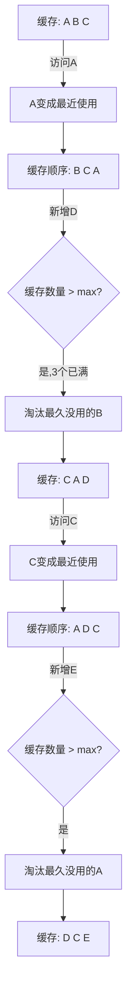

扫描[二维码](https://api2.cmdragon.cn/upload/cmder/20250304_012821924.jpg)关注或者微信搜一搜：`编程智域 前端至全栈交流与成长`

[发现1000+提升效率与开发的AI工具和实用程序](https://tools.cmdragon.cn/zh/apps?category=ai_chat)：https://tools.cmdragon.cn/

## 一、缓存是好事，但别贪多

前面咱学了KeepAlive的基本用法和include/exclude过滤，已经能精准控制哪些组件该缓存了。但还有一个问题——**缓存太多怎么办？**

每个被缓存的组件实例都占着内存呢。组件越复杂、数据越多，占的内存就越大。你想想，一个列表页缓存了几百条数据，一个表单页缓存了一大堆表单状态，再来几个图表页……内存占用蹭蹭往上涨。

在PC端可能还好，但在移动端或者低配设备上，内存一紧张页面就卡，严重的直接白屏闪退。

缓存就像冰箱，塞满了就放不进去了，而且电费（内存）还贵。所以你得给冰箱设个容量上限。

## 二、max属性：给缓存设个上限

KeepAlive提供了一个 `max` prop，用来限制最多缓存多少个组件实例：

```vue
<KeepAlive :max="5">
  <component :is="currentComponent" />
</KeepAlive>
```

就这么简单，加个 `:max="5"` 就行，表示最多缓存5个组件实例。

当缓存数量即将超过max时，KeepAlive会自动淘汰最久没有被访问的缓存实例，给新的腾地方。

注意max需要加v-bind（冒号），因为你要传的是数字不是字符串。`max="5"` 传的是字符串"5"，`:max="5"` 传的才是数字5。

## 三、LRU是啥？用生活例子讲明白

KeepAlive用的淘汰策略叫 **LRU**，全称 Least Recently Used，翻译过来就是"最近最少使用"。

听着挺唬人，其实道理特别简单——**谁最久没被碰过，谁先滚蛋**。

打个比方：你的衣柜容量有限（max），新衣服进来就得淘汰旧衣服。你肯定先淘汰那些积灰最久没穿过的，对吧？这就是LRU。

来，咱用流程图演示一下LRU是怎么工作的（假设max=3）：



关键点来了：**访问顺序很重要**。同样是A、B、C三个组件被缓存，如果你最近访问过A，那A就不会被优先淘汰。只有最久没被访问的那个才会被淘汰。

这就是LRU的精妙之处——它不是简单地"先进先出"，而是根据使用频率和最近使用时间来决定淘汰谁。

## 四、被淘汰的组件会怎样？

被LRU淘汰的组件会被**真正销毁**，触发 `unmounted` 钩子。不是冬眠，是真的没了。

下次再显示这个组件时，会重新创建，触发 `mounted`，状态归零。

来验证一下：

```vue
<!-- TestComponent.vue -->
<script setup>
import { onMounted, onUnmounted, onActivated, onDeactivated } from "vue";

onMounted(() => console.log("🟢 mounted - 创建"));
onUnmounted(() => console.log("🔴 unmounted - 销毁"));
onActivated(() => console.log("⚡ activated - 激活"));
onDeactivated(() => console.log("💤 deactivated - 冬眠"));
</script>

<template>
  <div>测试组件</div>
</template>
```

当这个组件被LRU淘汰时，控制台会打印 `🔴 unmounted - 销毁`，说明它是被真正销毁了，不是简单的隐藏。

## 五、max配多少合适？

这个问题没有标准答案，取决于几个因素：

| 因素         | 建议                                 |
| ------------ | ------------------------------------ |
| 组件复杂度   | 复杂组件（大量数据/图表）→ max小一点 |
| 目标设备     | 移动端/低配设备 → max 3-5            |
| 用户切换频率 | 频繁切换多个页面 → max大一点         |
| 内存限制     | 内存紧张 → max小一点                 |

**一般建议：**

- PC端：5-10
- 移动端：3-5
- 如果组件很轻量（纯展示型）：可以适当增大
- 如果组件很重（大量数据/图表）：适当减小

**更好的做法是max和include配合使用：**

```vue
<KeepAlive :include="['ListPage', 'SearchPage']" :max="5">
  <component :is="currentComponent" />
</KeepAlive>
```

先用include过滤出需要缓存的组件，再用max限制总数，双重保险。

## 课后Quiz

### 问题1：当缓存数量超过max时，哪个组件会被优先淘汰？

**答案解析：** 最久没有被访问的组件会被优先淘汰。KeepAlive使用LRU（最近最少使用）策略，根据组件的最近访问时间来决定淘汰顺序，最久没被"碰"过的最先被淘汰。

### 问题2：被LRU淘汰的组件，下次显示时状态还在吗？

**答案解析：** 不在了。被淘汰的组件会被真正销毁（触发unmounted），不是冬眠。下次显示时会重新创建（触发mounted），状态会重置为初始值。

## 常见报错解决方案

### 1. max设太小导致频繁重建组件

**错误现象：** 组件经常被淘汰重建，用户体验差，感觉缓存没起作用。

**解决方案：** 适当增大max值，或者配合include只缓存真正需要的组件，这样有限的max名额都用在刀刃上。

### 2. max设太大移动端卡顿

**错误现象：** 移动端页面越来越卡，内存占用持续增长。

**解决方案：** 移动端建议max设3-5，优先缓存轻量组件。重组件（大数据列表、图表）尽量不缓存，或者缓存时在onDeactivated中释放大数据。

### 3. max和include同时使用时的优先级

**疑问：** max和include谁先生效？

**答案：** 先过滤再淘汰。include决定谁能进缓存（不在include里的直接不缓存），max决定缓存上限（超了就LRU淘汰）。两者是配合关系，不是覆盖关系。

参考链接：

- https://cn.vuejs.org/guide/built-ins/keep-alive.html
- https://en.wikipedia.org/wiki/Cache_replacement_policies#Least_recently_used_(LRU)

余下文章内容请点击跳转至 个人博客页面 或者 扫描[二维码](https://api2.cmdragon.cn/upload/cmder/20250304_012821924.jpg)关注或者微信搜一搜：`编程智域 前端至全栈交流与成长`，阅读完整的文章：[缓存太多内存炸了？max属性和LRU淘汰策略来救场](https://blog.cmdragon.cn/posts/k3c4d5e6f7a8b9c0d1e2f3a4b5c6d7e8/)

<details>
<summary>往期文章归档</summary>

- [Vue 3 静态与动态 Props 如何传递？TypeScript 类型约束有何必要？](https://blog.cmdragon.cn/posts/94ab48753b64780ca3ab7a7115ae8522/)
- [Vue 3中组件局部注册的优势与实现方式如何？](https://blog.cmdragon.cn/posts/dbf576e744870f6de26fd8a2e03e47da/)
- [如何在Vue3中优化生命周期钩子性能并规避常见陷阱？](https://blog.cmdragon.cn/posts/12d98b3b9ccd6c19a1b169d720ac5c80/)
- [Vue 3 Composition API生命周期钩子：如何实现从基础理解到高阶复用？](https://blog.cmdragon.cn/posts/8884e2b70287fcb263c57648eeb27419/)
- [Vue 3生命周期钩子实战指南：如何正确选择onMounted、onUpdated与onUnmounted的应用场景？](https://blog.cmdragon.cn/posts/883c6dbc50ae4183770a4462e0b8ae4d/)

</details>

<details>
<summary>免费好用的热门在线工具</summary>

- [多直播聚合器 - 应用商店 | By cmdragon](https://tools.cmdragon.cn/zh/apps/multi-live-aggregator)
- [Proto文件生成器 - 应用商店 | By cmdragon](https://tools.cmdragon.cn/zh/apps/proto-file-generator)
- [图片转粒子 - 应用商店 | By cmdragon](https://tools.cmdragon.cn/zh/apps/image-to-particles)
- [视频下载器 - 应用商店 | By cmdragon](https://tools.cmdragon.cn/zh/apps/video-downloader)
- [文件格式转换器 - 应用商店 | By cmdragon](https://tools.cmdragon.cn/zh/apps/file-converter)
- [M3U8在线播放器 - 应用商店 | By cmdragon](https://tools.cmdragon.cn/zh/apps/m3u8-player)
- [CMDragon 在线工具 - 高级AI工具箱与开发者套件 | 免费好用的在线工具](https://tools.cmdragon.cn/zh)
- [应用商店 - 发现1000+提升效率与开发的AI工具和实用程序 | 免费好用的在线工具](https://tools.cmdragon.cn/zh/apps?category=trending)

</details>
