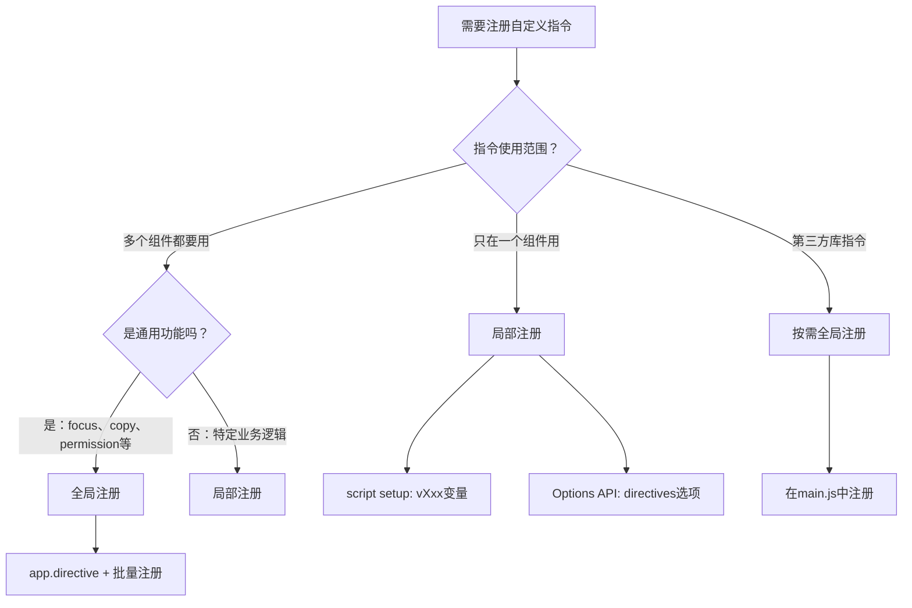

扫描[二维码](https://api2.cmdragon.cn/upload/cmder/20250304_012821924.jpg)关注或者微信搜一搜：`编程智域 前端至全栈交流与成长`

[发现1000+提升效率与开发的AI工具和实用程序](https://tools.cmdragon.cn/zh/apps?category=ai_chat)：https://tools.cmdragon.cn/zh/

## 一、局部注册：在组件里用，用完即走

咱先说局部注册，这个比较简单好理解——你就在自己组件里声明一个指令，别的组件看不见也用不了，关起门来自己玩。

### script setup中的自动注册

Vue 3 里有个特别方便的设计：在 `<script setup>` 中，任何以 `v` 开头的驼峰式变量，都会自动被识别为自定义指令。说白了就是 Vue 帮你做了注册这件事，你只管写变量名就行。

命名规则也很直觉：

- `vFocus` → 模板里用 `v-focus`
- `vMyDir` → 模板里用 `v-my-dir`
- `vWatermark` → 模板里用 `v-watermark`

驼峰转短横线，跟组件名的规则一模一样。

来看个实际例子：

```vue
<script setup>
// 以v开头的驼峰变量，自动注册为指令
const vFocus = {
  mounted(el) {
    // 元素挂载后自动聚焦
    el.focus();
  },
};

const vColor = {
  mounted(el, binding) {
    // 根据传入的值设置文字颜色
    el.style.color = binding.value;
  },
};
</script>

<template>
  <!-- 页面加载后输入框自动获得焦点 -->
  <input v-focus placeholder="我会自动聚焦" />

  <!-- 文字颜色由指令控制 -->
  <p v-color="'#e74c3c'">这段文字是红色的</p>
</template>
```

是不是贼简单？连 `directives` 选项都不用写，变量名以 `v` 开头就完事了。Vue 在编译模板的时候会自动帮你把这些变量和模板中的指令关联起来。

### 选项式API中的directives选项

如果你还在用选项式 API（Options API），那就得通过 `directives` 选项来注册局部指令了。这种方式跟 Vue 2 时代的写法基本一致：

```vue
<script>
const focusDirective = {
  mounted(el) {
    el.focus();
  },
};

const colorDirective = {
  mounted(el, binding) {
    el.style.color = binding.value;
  },
};

export default {
  // 通过directives选项注册局部指令
  directives: {
    focus: focusDirective,
    color: colorDirective,
  },
  data() {
    return {
      textColor: "#2ecc71",
    };
  },
};
</script>

<template>
  <input v-focus placeholder="自动聚焦" />
  <p v-color="textColor">这段文字的颜色由data控制</p>
</template>
```

这里有个小细节：`directives` 对象的 key 就是模板里用的指令名（不带 `v-` 前缀），value 就是指令定义对象。你也可以直接把定义写在里面，不用单独声明变量，但抽出来可读性更好。

### 局部注册的优缺点

咱就是说，局部注册这事儿得辩证地看：

**优点：**

- **不污染全局命名空间**——你的 `v-focus` 只在这个组件里生效，不会跟别的组件或者第三方库的指令打架
- **按需使用**——用到了才注册，没用到就不占地方，干净利落
- **指令逻辑和组件在一起**——维护的时候一眼就能看到这个组件用了哪些指令，不用到处翻文件

**缺点：**

- **每个组件都要重新声明**——如果 10 个组件都要用 `v-focus`，你就得写 10 遍，烦不烦？
- **不能跨组件复用**——A 组件的局部指令，B 组件想用？没门，得重新注册

所以局部注册适合那种"只在某个组件里用一次"的场景，比如一个特殊的表单验证指令，或者某个页面专属的拖拽指令。

## 二、全局注册：一次注册，到处使用

跟局部注册相对的，就是全局注册了。全局注册的指令就像小区里的公共设施——装一次，所有住户都能用。

### app.directive()方法

全局注册用的是 `app.directive()` 方法，一般在 `main.js` 或 `main.ts` 里注册：

```javascript
// main.js
import { createApp } from "vue";
import App from "./App.vue";

const app = createApp(App);

// 全局注册v-focus指令
app.directive("focus", {
  mounted(el) {
    el.focus();
  },
});

// 全局注册v-color指令（函数简写形式）
app.directive("color", (el, binding) => {
  el.style.color = binding.value;
});

app.mount("#app");
```

注册完之后，项目里任何组件的模板里都能直接用 `v-focus` 和 `v-color`，不用再额外声明。

注意 `app.directive()` 的第一个参数是指令名（不带 `v-` 前缀），第二个参数是指令定义对象或者函数。

### 全局注册的优缺点

**优点：**

- **所有组件都能用**——注册一次，全项目通用，省事
- **不用每个组件都声明**——不用写 `directives` 选项，也不用写 `vXxx` 变量

**缺点：**

- **污染全局命名空间**——你注册了一个 `v-color`，万一某个第三方库也叫 `v-color`，那就撞车了，后注册的会覆盖先注册的
- **增加初始包体积**——不管组件用不用这个指令，指令的代码都会被打包进去
- **调试困难**——出了问题你不知道是哪个指令在作怪，因为全局指令到处都是

### 批量注册的技巧

实际项目里，自定义指令往往不止一两个。如果都堆在 `main.js` 里，那文件会变得又长又乱。比较好的做法是把每个指令抽离到单独的文件，然后统一注册。

先看目录结构：

```
src/
├── directives/
│   ├── vFocus.js
│   ├── vColor.js
│   ├── vWatermark.js
│   └── index.js
├── main.js
└── App.vue
```

每个指令文件只负责导出自己的定义：

```javascript
// directives/vFocus.js
export const vFocus = {
  mounted(el) {
    el.focus();
  },
};
```

```javascript
// directives/vColor.js
export const vColor = {
  mounted(el, binding) {
    el.style.color = binding.value;
  },
};
```

```javascript
// directives/vWatermark.js
export const vWatermark = {
  mounted(el, binding) {
    const { text, color = "#ccc", fontSize = "14px" } = binding.value;
    // 创建水印层并添加到元素上
    const watermark = document.createElement("div");
    watermark.style.cssText = `
      position: absolute;
      top: 0;
      left: 0;
      width: 100%;
      height: 100%;
      pointer-events: none;
      background-image: url("data:image/svg+xml,...");
      opacity: 0.1;
    `;
    watermark.textContent = text;
    watermark.style.color = color;
    watermark.style.fontSize = fontSize;
    el.style.position = "relative";
    el.appendChild(watermark);
  },
};
```

然后在 `index.js` 里统一注册：

```javascript
// directives/index.js
import { vFocus } from "./vFocus";
import { vColor } from "./vColor";
import { vWatermark } from "./vWatermark";

export function registerDirectives(app) {
  app.directive("focus", vFocus);
  app.directive("color", vColor);
  app.directive("watermark", vWatermark);
}
```

最后在 `main.js` 里一行搞定：

```javascript
// main.js
import { createApp } from "vue";
import App from "./App.vue";
import { registerDirectives } from "./directives";

const app = createApp(App);
registerDirectives(app);

app.mount("#app");
```

这样 `main.js` 就保持清爽了，以后要新增指令，只需要在 `directives/` 目录下新建文件，然后在 `index.js` 里加一行注册代码就行。搞起！

## 三、全局还是局部？选择指南

说了这么多，到底什么时候用全局注册，什么时候用局部注册呢？咱用一个决策流程图来帮你理清思路：



再用一个表格总结一下：

| 场景                                                | 推荐方式     | 理由                               |
| --------------------------------------------------- | ------------ | ---------------------------------- |
| 只在一个组件里用                                    | 局部注册     | 没必要全局，省空间                 |
| 多个组件都要用的通用功能（focus、copy、permission） | 全局注册     | 一处注册处处使用，避免重复         |
| 特定业务逻辑（某个表单专属验证）                    | 局部注册     | 业务逻辑跟组件绑定，别的地方用不上 |
| 第三方库提供的指令                                  | 按需全局注册 | 只注册你用到的，别一股脑全注册     |

说白了就一个原则：**能局部就局部，实在要跨组件复用再全局**。全局注册虽然方便，但用多了就像公共区域堆杂物——看着碍眼，找东西还费劲。

## 四、TypeScript类型增强

如果你的项目用了 TypeScript，那自定义指令这块默认是没有类型提示的——你在模板里写 `v-focus`，TS 根本不知道这是个啥。这就像你跟朋友说"帮我拿那个东西"，朋友一脸懵：哪个东西？

所以咱得给指令加上类型定义，让 TS 知道这些指令的存在和用法。

### 全局指令的类型定义

Vue 提供了一个 `ComponentCustomProperties` 接口，专门用来扩展全局自定义属性。全局指令的类型也是通过扩展这个接口来实现的。

关键规则：**属性名要以 `v` 开头，采用驼峰命名**。比如 `v-focus` 对应的属性名就是 `vFocus`，`v-watermark` 对应 `vWatermark`。

```typescript
// env.d.ts 或 directives.d.ts
import type { Directive } from "vue";

declare module "vue" {
  interface ComponentCustomProperties {
    // v-focus指令：绑定在HTMLElement上，binding.value无额外值
    vFocus: Directive<HTMLElement, void>;
    // v-color指令：binding.value是字符串（颜色值）
    vColor: Directive<HTMLElement, string>;
    // v-watermark指令：binding.value是对象
    vWatermark: Directive<
      HTMLElement,
      {
        text: string;
        color?: string;
        fontSize?: string;
      }
    >;
  }
}
```

写完这个类型定义文件后，你在模板里用 `v-focus`、`v-color`、`v-watermark` 的时候，TS 就能识别了，而且 `binding.value` 的类型也会被正确推断。

比如在 `v-watermark` 的钩子函数里，`binding.value` 的类型会被推断为 `{ text: string; color?: string; fontSize?: string }`，你访问 `binding.value.text` 不会有任何类型错误，但访问 `binding.value.xxx` 就会报错——这就是类型安全的好处。

### 指令定义对象的类型

Vue 提供了 `Directive<T, V>` 这个泛型类型来给指令定义对象标注类型：

- **T**：指令绑定的元素类型，比如 `HTMLElement`、`HTMLInputElement`
- **V**：`binding.value` 的类型

来看几个例子：

```typescript
import type { Directive } from "vue";

// v-focus：绑定在HTMLInputElement上，不需要binding.value
const vFocus: Directive<HTMLInputElement, void> = {
  mounted(el) {
    // el的类型是HTMLInputElement，可以安全访问input特有的属性
    el.focus();
  },
};

// v-color：绑定在HTMLElement上，binding.value是string
const vColor: Directive<HTMLElement, string> = {
  mounted(el, binding) {
    // binding.value的类型是string
    el.style.color = binding.value;
  },
  updated(el, binding) {
    el.style.color = binding.value;
  },
};

// v-watermark：绑定在HTMLElement上，binding.value是对象
const vWatermark: Directive<
  HTMLElement,
  {
    text: string;
    color?: string;
    fontSize?: string;
  }
> = {
  mounted(el, binding) {
    const { text, color = "#ccc", fontSize = "14px" } = binding.value;
    // binding.value的类型被正确推断，可以安全解构
    console.log(text, color, fontSize);
  },
};
```

有了 `Directive<T, V>` 类型，你在写钩子函数的时候就能享受到完整的类型提示和检查了。`el` 参数会被正确推断为 `T` 类型，`binding.value` 会被推断为 `V` 类型。

还可以用 `satisfies` 操作符来确保指令定义对象符合类型要求：

```typescript
import type { Directive } from "vue";

type HighlightDirective = Directive<HTMLElement, string>;

export default {
  mounted(el, binding) {
    // binding.value的类型是string
    el.style.backgroundColor = binding.value;
  },
} satisfies HighlightDirective;
```

`satisfies` 的好处是：既检查了类型，又不会丢失字面量类型的推断。比直接用 `: HighlightDirective` 注解更灵活。

### 局部指令的类型

在 `<script setup>` 中声明的局部指令，TypeScript 可以根据变量声明自动推断类型，不需要额外的类型定义文件：

```vue
<script setup lang="ts">
import type { Directive } from "vue";

// 方式1：直接声明，类型自动推断
const vFocus = {
  mounted(el: HTMLInputElement) {
    el.focus();
  },
};

// 方式2：显式标注类型
const vColor: Directive<HTMLElement, string> = {
  mounted(el, binding) {
    el.style.color = binding.value;
  },
};
</script>

<template>
  <input v-focus />
  <p v-color="'#e74c3c'">红色文字</p>
</template>
```

局部指令不需要扩展 `ComponentCustomProperties`，因为它只在当前组件生效，Vue 的编译器会自动处理模板中的指令匹配。

## 五、完整项目结构示例

最后咱把上面讲的内容串起来，看一个规范的 TypeScript 项目中，自定义指令应该怎么组织。

目录结构：

```
src/
├── directives/
│   ├── vFocus.ts
│   ├── vColor.ts
│   ├── vWatermark.ts
│   ├── index.ts
│   └── types.ts
├── App.vue
└── main.ts
```

先看类型定义文件：

```typescript
// directives/types.ts
import type { Directive } from "vue";

// 水印指令的binding.value类型
export interface WatermarkOptions {
  text: string;
  color?: string;
  fontSize?: string;
}

// 导出各指令的类型，方便类型定义文件和指令文件共用
export type FocusDirective = Directive<HTMLInputElement, void>;
export type ColorDirective = Directive<HTMLElement, string>;
export type WatermarkDirective = Directive<HTMLElement, WatermarkOptions>;
```

然后是全局类型增强文件（可以放在 `src/directives/types.ts` 里，也可以单独放 `src/env.d.ts`）：

```typescript
// directives/types.ts（续）
// 或者放在 env.d.ts 中

declare module "vue" {
  interface ComponentCustomProperties {
    vFocus: FocusDirective;
    vColor: ColorDirective;
    vWatermark: WatermarkDirective;
  }
}
```

各个指令文件：

```typescript
// directives/vFocus.ts
import type { FocusDirective } from "./types";

export const vFocus: FocusDirective = {
  mounted(el) {
    el.focus();
  },
};
```

```typescript
// directives/vColor.ts
import type { ColorDirective } from "./types";

export const vColor: ColorDirective = {
  mounted(el, binding) {
    el.style.color = binding.value;
  },
  updated(el, binding) {
    el.style.color = binding.value;
  },
};
```

```typescript
// directives/vWatermark.ts
import type { WatermarkDirective, WatermarkOptions } from "./types";

export const vWatermark: WatermarkDirective = {
  mounted(el, binding) {
    const options: WatermarkOptions = binding.value;
    createWatermark(el, options);
  },
  updated(el, binding) {
    // 更新时先清除旧水印，再创建新的
    removeWatermark(el);
    createWatermark(el, binding.value);
  },
  unmounted(el) {
    removeWatermark(el);
  },
};

function createWatermark(el: HTMLElement, options: WatermarkOptions) {
  const { text, color = "#ccc", fontSize = "14px" } = options;
  const watermark = document.createElement("div");
  watermark.className = "__watermark__";
  watermark.style.cssText = `
    position: absolute;
    top: 0;
    left: 0;
    width: 100%;
    height: 100%;
    pointer-events: none;
    display: flex;
    align-items: center;
    justify-content: center;
    color: ${color};
    font-size: ${fontSize};
    opacity: 0.15;
    transform: rotate(-30deg);
  `;
  watermark.textContent = text;
  el.style.position = "relative";
  el.appendChild(watermark);
}

function removeWatermark(el: HTMLElement) {
  const watermark = el.querySelector(".__watermark__");
  if (watermark) {
    el.removeChild(watermark);
  }
}
```

统一注册入口：

```typescript
// directives/index.ts
import { vFocus } from "./vFocus";
import { vColor } from "./vColor";
import { vWatermark } from "./vWatermark";

export function registerDirectives(app) {
  app.directive("focus", vFocus);
  app.directive("color", vColor);
  app.directive("watermark", vWatermark);
}
```

最后在 `main.ts` 中调用：

```typescript
// main.ts
import { createApp } from "vue";
import App from "./App.vue";
import { registerDirectives } from "./directives";

const app = createApp(App);
registerDirectives(app);

app.mount("#app");
```

在组件中使用：

```vue
<!-- App.vue -->
<script setup lang="ts">
import { ref } from "vue";

const textColor = ref("#2ecc71");
const watermarkConfig = ref({
  text: "机密文件",
  color: "#ff0000",
  fontSize: "20px",
});
</script>

<template>
  <input v-focus placeholder="自动聚焦" />
  <p v-color="textColor">绿色文字</p>
  <div
    v-watermark="watermarkConfig"
    style="height: 200px; border: 1px solid #ddd;"
  >
    这是加了水印的内容区域
  </div>
</template>
```

整个流程串下来就是：**类型定义 → 指令实现 → 统一注册 → 全局类型增强 → 组件中使用**。每一步各司其职，文件职责清晰，维护起来也方便。

## 课后Quiz

**问题1：在 `<script setup>` 中，`vMyCustomDir` 变量对应的模板指令名是什么？**

答案：对应的模板指令名是 `v-my-custom-dir`。在 `<script setup>` 中，以 `v` 开头的驼峰式变量会自动注册为自定义指令，驼峰命名会转换为短横线命名。`vMyCustomDir` → `v-my-custom-dir`，跟组件名的命名转换规则一致。

**问题2：全局注册自定义指令的方法是什么？在哪个文件中注册？**

答案：全局注册使用 `app.directive('指令名', 指令定义)` 方法，一般在 `main.ts`（或 `main.js`）中注册。实际项目中推荐把指令抽离到单独的文件，通过一个 `registerDirectives` 函数统一注册，然后在 `main.ts` 中调用这个函数，保持入口文件清爽。

## 常见报错解决方案

### 1. 全局指令和局部指令同名冲突

**现象：** 你在全局注册了 `v-focus`，又在某个组件里局部注册了同名的 `v-focus`，结果局部指令的行为跟全局的不一样。

**原因：** 当全局指令和局部指令同名时，局部指令的优先级更高，会覆盖全局指令。这跟 CSS 的就近原则类似——离得近的优先。

**解决办法：** 避免同名冲突。如果确实需要在某个组件里覆盖全局指令的行为，确保这是你有意为之，而不是不小心重名了。建议在命名全局指令时加上项目前缀，比如 `v-app-focus`，这样就不容易跟局部指令撞车。

### 2. TypeScript中指令没有类型提示

**现象：** 在模板中使用 `v-focus`、`v-color` 等自定义指令时，IDE 没有任何类型提示，甚至可能报红线。

**原因：** TypeScript 默认不认识你注册的全局自定义指令，需要通过扩展 `ComponentCustomProperties` 接口来告诉 TS 这些指令的存在。

**解决办法：** 创建一个类型声明文件（如 `env.d.ts` 或 `directives.d.ts`），扩展 `vue` 模块的 `ComponentCustomProperties` 接口：

```typescript
import type { Directive } from "vue";

declare module "vue" {
  interface ComponentCustomProperties {
    vFocus: Directive<HTMLElement, void>;
  }
}
```

注意属性名要以 `v` 开头采用驼峰命名，跟模板中的指令名对应。写完之后重启一下 TS 服务（VS Code 里按 `Ctrl+Shift+P` 输入 `TypeScript: Restart TS Server`），类型提示就回来了。

### 3. 指令注册后还是报未注册

**现象：** 明明在 `main.ts` 里注册了指令，但组件里用的时候还是报 `Failed to resolve directive: xxx`。

**原因：** 最常见的原因是注册顺序不对——你在 `app.mount('#app')` 之后才注册指令，这时候已经晚了，Vue 已经完成了应用的挂载，后续注册的指令不会生效。

**解决办法：** 确保所有 `app.directive()` 调用都在 `app.mount()` 之前执行：

```typescript
// ✅ 正确：先注册再挂载
const app = createApp(App);
registerDirectives(app);
app.mount("#app");

// ❌ 错误：先挂载再注册
const app = createApp(App);
app.mount("#app");
registerDirectives(app); // 太晚了！
```

还有一个容易忽略的点：检查指令名是否拼写正确。`app.directive('focus', ...)` 注册的是 `v-focus`，如果你模板里写成了 `v-foucs`（拼错了），那当然找不到。

参考链接：

- https://cn.vuejs.org/guide/reusability/custom-directives.html
- https://cn.vuejs.org/guide/typescript/composition-api.html#typing-global-custom-directives

余下文章内容请点击跳转至 个人博客页面 或者 扫描[二维码](https://api2.cmdragon.cn/upload/cmder/20250304_012821924.jpg)关注或者微信搜一搜：`编程智域 前端至全栈交流与成长`，阅读完整的文章：[自定义指令全局注册还是局部注册？TypeScript类型怎么加？](https://blog.cmdragon.cn/posts/f2b4d6e8a0c3e5f7a9d1b3c5e7f9a1d3/)

<details>
<summary>往期文章归档</summary>

- [Vue 3 静态与动态 Props 如何传递？TypeScript 类型约束有何必要？](https://blog.cmdragon.cn/posts/94ab48753b64780ca3ab7a7115ae8522/)
- [Vue 3中组件局部注册的优势与实现方式如何？](https://blog.cmdragon.cn/posts/dbf576e744870f6de26fd8a2e03e47da/)
- [如何在Vue3中优化生命周期钩子性能并规避常见陷阱？](https://blog.cmdragon.cn/posts/12d98b3b9ccd6c19a1b169d720ac5c80/)
- [Vue 3 Composition API生命周期钩子：如何实现从基础理解到高阶复用？](https://blog.cmdragon.cn/posts/8884e2b70287fcb263c57648eeb27419/)
- [Vue 3生命周期钩子实战指南：如何正确选择onMounted、onUpdated与onUnmounted的应用场景？](https://blog.cmdragon.cn/posts/883c6dbc50ae4183770a4462e0b8ae4d/)

</details>

<details>
<summary>免费好用的热门在线工具</summary>

- [多直播聚合器 - 应用商店 | By cmdragon](https://tools.cmdragon.cn/zh/apps/multi-live-aggregator)
- [Proto文件生成器 - 应用商店 | By cmdragon](https://tools.cmdragon.cn/zh/apps/proto-file-generator)
- [图片转粒子 - 应用商店 | By cmdragon](https://tools.cmdragon.cn/zh/apps/image-to-particles)
- [视频下载器 - 应用商店 | By cmdragon](https://tools.cmdragon.cn/zh/apps/video-downloader)
- [文件格式转换器 - 应用商店 | By cmdragon](https://tools.cmdragon.cn/zh/apps/file-converter)
- [M3U8在线播放器 - 应用商店 | By cmdragon](https://tools.cmdragon.cn/zh/apps/m3u8-player)
- [CMDragon 在线工具 - 高级AI工具箱与开发者套件 | 免费好用的在线工具](https://tools.cmdragon.cn/zh)
- [应用商店 - 发现1000+提升效率与开发的AI工具和实用程序 | 免费好用的在线工具](https://tools.cmdragon.cn/zh/apps?category=trending)

</details>
