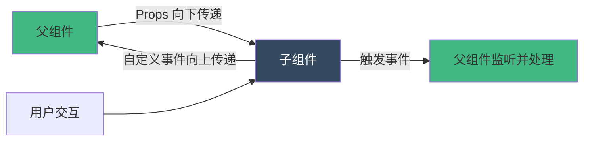
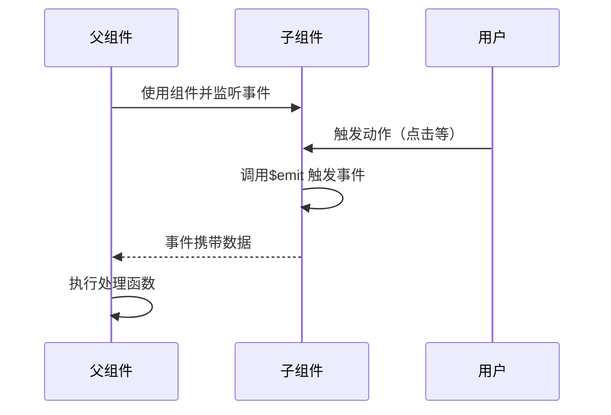
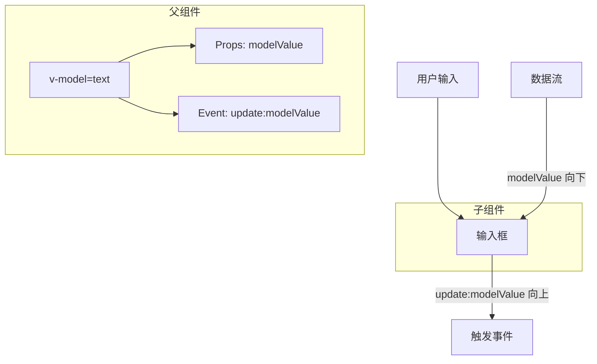

扫描 [二维码](https://api2.cmdragon.cn/upload/cmder/20250304_012821924.jpg) 关注或者微信搜一搜：`编程智域 前端至全栈交流与成长`

[发现 1000+ 提升效率与开发的 AI 工具和实用程序](https://tools.cmdragon.cn/zh/apps?category=ai_chat)：<https://tools.cmdragon.cn/>

## 1. 自定义事件的核心概念

在 Vue 3 组件化开发中，组件间通信是我们每天都要面对的核心问题。Props 负责父到子的数据流，而自定义事件则承担子到父的通信任务。理解并掌握自定义事件的定义、触发与监听，是构建可维护 Vue 应用的关键。

### 1.1 为什么需要自定义事件？

想象这样一个场景：你开发了一个按钮组件，当用户点击时，需要通知父组件执行某些操作。这时就不能用 Props 了，因为 Props 是单向数据流，子组件不能修改父组件的数据。自定义事件就是为了解决这个问题而存在的。



### 1.2 事件通信的基本流程

自定义事件的完整流程包含三个步骤：

1. **定义事件**：在子组件中声明要触发的事件
2. **触发事件**：在子组件中通过 `$emit` 触发事件
3. **监听事件**：在父组件中监听并处理子组件事件



## 2. emits 选项：事件的类型声明

Vue 3 提供了 `emits` 选项来声明组件将要触发的事件。这不仅是文档，还能提供运行时验证和更好的 TypeScript 支持。

### 2.1 数组语法：简单声明

当你只需要简单声明事件名称时，使用数组语法最方便：

```vue
<!-- 子组件：ButtonCounter.vue -->
<template>
  <button @click="increment">点击次数：{{ count }}</button>
</template>

<script setup>
import { ref } from "vue";

// 声明要触发的事件
defineEmits(["increment"]);

const count = ref(0);

function increment() {
  count.value++;
  // 触发 increment 事件
  emit("increment");
}
</script>
```

**父组件使用：**

```vue
<!-- 父组件 -->
<template>
  <ButtonCounter @increment="handleIncrement" />
  <p>总点击次数：{{ total }}</p>
</template>

<script setup>
import { ref } from "vue";
import ButtonCounter from "./ButtonCounter.vue";

const total = ref(0);

function handleIncrement() {
  total.value++;
  console.log("子组件触发了 increment 事件");
}
</script>
```

### 2.2 对象语法：事件验证

对象语法允许你为事件提供验证逻辑，确保传递的参数符合预期：

```vue
<!-- 子组件：SubmitForm.vue -->
<template>
  <form @submit.prevent="handleSubmit">
    <input v-model="username" placeholder="用户名" />
    <input v-model="email" type="email" placeholder="邮箱" />
    <button type="submit">提交</button>
  </form>
</template>

<script setup>
import { ref } from "vue";

// 对象语法声明事件并验证
const emit = defineEmits({
  // 不带验证的事件
  submit: null,

  // 带验证的事件
  submitForm: (payload) => {
    // 验证 payload 是否包含必需字段
    if (payload.username && payload.email) {
      return true;
    } else {
      console.warn("submitForm 事件需要 username 和 email 字段");
      return false;
    }
  },
});

const username = ref("");
const email = ref("");

function handleSubmit() {
  // 触发带验证的事件
  emit("submitForm", {
    username: username.value,
    email: email.value,
  });
}
</script>
```

**验证函数的返回值：**

- 返回 `true`：验证通过，事件正常触发
- 返回 `false`：验证失败，触发警告但事件仍会触发
- 验证主要用于开发环境的提示，不会阻止事件触发

### 2.3 TypeScript 支持：类型安全的事件

使用 TypeScript 时，可以为事件提供完整的类型约束：

```vue
<!-- 子组件：ProductList.vue -->
<template>
  <div class="product-list">
    <div v-for="product in products" :key="product.id" class="product-item">
      <h3>{{ product.name }}</h3>
      <p>价格：¥{{ product.price }}</p>
      <button @click="handleAddToCart(product)">加入购物车</button>
      <button @click="handleRemove(product.id)">移除</button>
    </div>
  </div>
</template>

<script setup lang="ts">
interface Product {
  id: number;
  name: string;
  price: number;
  stock: number;
}

// TypeScript 类型安全的事件声明
const emit = defineEmits<{
  // 简单事件
  (e: "add-to-cart", product: Product): void;

  // 带多个参数的事件
  (e: "remove", productId: number, reason?: string): void;

  // 复合事件
  (e: "update", action: "create" | "update" | "delete", data: Product): void;
}>();

const products = ref<Product[]>([
  { id: 1, name: "手机", price: 3999, stock: 100 },
  { id: 2, name: "电脑", price: 6999, stock: 50 },
]);

function handleAddToCart(product: Product) {
  emit("add-to-cart", product);
}

function handleRemove(productId: number) {
  emit("remove", productId, "用户操作");
}
</script>
```

**父组件使用（TypeScript）：**

```vue
<!-- 父组件 -->
<template>
  <ProductList
    @add-to-cart="handleAddToCart"
    @remove="handleRemove"
    @update="handleUpdate"
  />
  <p>购物车商品数：{{ cartCount }}</p>
</template>

<script setup lang="ts">
import { ref } from "vue";
import ProductList from "./ProductList.vue";

interface Product {
  id: number;
  name: string;
  price: number;
  stock: number;
}

const cartCount = ref(0);

// TypeScript 会提供类型提示和检查
function handleAddToCart(product: Product) {
  cartCount.value++;
  console.log(`添加 ${product.name} 到购物车`);
}

function handleRemove(productId: number, reason?: string) {
  cartCount.value = Math.max(0, cartCount.value - 1);
  console.log(`移除商品 ${productId}, 原因：${reason}`);
}

function handleUpdate(action: "create" | "update" | "delete", data: Product) {
  console.log(`更新操作：${action}`, data);
}
</script>
```

## 3. $emit：触发事件的方法

`$emit` 是 Vue 提供的核心方法，用于触发自定义事件。在 `<script setup>` 中，通过 `defineEmits` 获取 emit 函数。

### 3.1 基础事件触发

最简单的事件触发，不传递任何参数：

```vue
<!-- 子组件：CloseButton.vue -->
<template>
  <button @click="close" class="close-btn">× 关闭</button>
</template>

<script setup>
const emit = defineEmits(["close"]);

function close() {
  emit("close");
}
</script>

<style scoped>
.close-btn {
  background: #f44336;
  color: white;
  border: none;
  padding: 5px 10px;
  cursor: pointer;
}
</style>
```

**父组件监听：**

```vue
<template>
  <div v-if="showModal" class="modal">
    <p>这是一个模态框</p>
    <CloseButton @close="handleClose" />
  </div>
</template>

<script setup>
import { ref } from "vue";
import CloseButton from "./CloseButton.vue";

const showModal = ref(true);

function handleClose() {
  showModal.value = false;
}
</script>
```

### 3.2 传递单个参数

事件可以携带一个参数传递给父组件：

```vue
<!-- 子组件：SearchInput.vue -->
<template>
  <div class="search-box">
    <input
      v-model="query"
      @input="handleInput"
      @keyup.enter="handleSearch"
      placeholder="搜索..."
    />
  </div>
</template>

<script setup>
import { ref } from "vue";

const emit = defineEmits(["search"]);

const query = ref("");

function handleInput() {
  // 实时搜索：传递当前输入值
  emit("search", query.value);
}

function handleSearch() {
  // 回车搜索：传递搜索关键词
  emit("search", query.value);
}
</script>
```

**父组件接收参数：**

```vue
<template>
  <SearchInput @search="handleSearch" />
  <div v-if="searchResults.length">
    <h3>搜索结果：</h3>
    <ul>
      <li v-for="item in searchResults" :key="item.id">
        {{ item.name }}
      </li>
    </ul>
  </div>
</template>

<script setup>
import { ref } from "vue";
import SearchInput from "./SearchInput.vue";

const searchResults = ref([]);

async function handleSearch(keyword) {
  console.log("搜索关键词:", keyword);
  // 模拟 API 调用
  const response = await fetch(`/api/search?q=${keyword}`);
  searchResults.value = await response.json();
}
</script>
```

### 3.3 传递多个参数

事件可以传递多个参数，父组件按顺序接收：

```vue
<!-- 子组件：RatingStar.vue -->
<template>
  <div class="rating">
    <span
      v-for="star in 5"
      :key="star"
      class="star"
      :class="{ active: star <= currentRating }"
      @click="handleRate(star)"
    >
      ★
    </span>
  </div>
</template>

<script setup>
import { ref } from "vue";

const emit = defineEmits(["rate"]);

const currentRating = ref(0);

function handleRate(star) {
  currentRating.value = star;
  // 传递评分和评分时间
  emit("rate", star, new Date().toISOString());
}
</script>

<style scoped>
.rating {
  display: flex;
  gap: 5px;
}

.star {
  font-size: 24px;
  color: #ccc;
  cursor: pointer;
  transition: color 0.3s;
}

.star.active {
  color: #ffc107;
}

.star:hover {
  color: #ff9800;
}
</style>
```

**父组件接收多个参数：**

```vue
<template>
  <div class="product-review">
    <h3>商品评价</h3>
    <RatingStar @rate="handleRate" />
    <p v-if="lastRating">
      评分：{{ lastRating.stars }} 星， 时间：{{ formatTime(lastRating.time) }}
    </p>
  </div>
</template>

<script setup>
import { ref } from "vue";
import RatingStar from "./RatingStar.vue";

const lastRating = ref(null);

function handleRate(stars, time) {
  lastRating.value = {
    stars,
    time,
  };
  console.log(`用户评分：${stars}星，时间：${time}`);
}

function formatTime(isoString) {
  return new Date(isoString).toLocaleString("zh-CN");
}
</script>
```

### 3.4 传递对象参数

当需要传递多个相关数据时，使用对象更清晰：

```vue
<!-- 子组件：UserForm.vue -->
<template>
  <form @submit.prevent="handleSubmit" class="user-form">
    <div class="form-group">
      <label>用户名：</label>
      <input v-model="formData.username" required />
    </div>
    <div class="form-group">
      <label>邮箱：</label>
      <input v-model="formData.email" type="email" required />
    </div>
    <div class="form-group">
      <label>年龄：</label>
      <input v-model.number="formData.age" type="number" />
    </div>
    <button type="submit">提交</button>
  </form>
</template>

<script setup>
import { reactive } from "vue";

const emit = defineEmits(["submit"]);

const formData = reactive({
  username: "",
  email: "",
  age: null,
});

function handleSubmit() {
  // 传递对象参数
  emit("submit", {
    user: {
      username: formData.username,
      email: formData.email,
      age: formData.age,
    },
    timestamp: Date.now(),
    source: "UserForm",
  });
}
</script>

<style scoped>
.user-form {
  max-width: 400px;
  margin: 20px auto;
  padding: 20px;
  border: 1px solid #ddd;
  border-radius: 8px;
}

.form-group {
  margin-bottom: 15px;
}

.form-group label {
  display: block;
  margin-bottom: 5px;
}

.form-group input {
  width: 100%;
  padding: 8px;
  border: 1px solid #ccc;
  border-radius: 4px;
}

button {
  width: 100%;
  padding: 10px;
  background-color: #42b883;
  color: white;
  border: none;
  border-radius: 4px;
  cursor: pointer;
}

button:hover {
  background-color: #35495e;
}
</style>
```

**父组件接收对象：**

```vue
<template>
  <UserForm @submit="handleUserSubmit" />

  <div v-if="submittedUser" class="user-info">
    <h3>已提交用户：</h3>
    <p>用户名：{{ submittedUser.user.username }}</p>
    <p>邮箱：{{ submittedUser.user.email }}</p>
    <p>年龄：{{ submittedUser.user.age }}</p>
    <p>提交时间：{{ formatTime(submittedUser.timestamp) }}</p>
    <p>来源：{{ submittedUser.source }}</p>
  </div>
</template>

<script setup>
import { ref } from "vue";
import UserForm from "./UserForm.vue";

const submittedUser = ref(null);

function handleUserSubmit(payload) {
  // payload 是一个对象
  console.log("收到用户数据:", payload);

  // 可以在这里调用 API
  // await api.createUser(payload.user)

  submittedUser.value = payload;
}

function formatTime(timestamp) {
  return new Date(timestamp).toLocaleString("zh-CN");
}
</script>
```

## 4. 事件命名规范与最佳实践

正确的事件命名能让代码更易读、易维护。Vue 3 提供了一些约定和最佳实践。

### 4.1 事件命名风格

**kebab-case（短横线命名）：**

```vue
<!-- 模板中推荐使用 kebab-case -->
<template>
  <MyComponent
    @item-added="handleItemAdded"
    @item-deleted="handleItemDeleted"
    @update:visible="handleVisibleUpdate"
  />
</template>
```

**camelCase（小驼峰命名）：**

```vue
<!-- JavaScript 中使用 camelCase -->
<script setup>
const emit = defineEmits(["itemAdded", "itemDeleted", "update:visible"]);

function addItem() {
  emit("itemAdded", { id: 1 });
}
</script>
```

**命名建议：**

- 模板中使用 `@item-added`（kebab-case）
- JavaScript 中使用 `'itemAdded'`（camelCase）
- Vue 会自动转换，两者等价

### 4.2 事件命名前缀约定

**使用动词开头：**

```vue
<script setup>
const emit = defineEmits([
  "submit-form", // ✓ 好：动词开头
  "form-submit", // ✗ 避免：名词开头
  "user-created", // ✓ 好：被动语态
  "create-user", // ✓ 好：主动语态
  "update:data", // ✓ 好：update:前缀
  "change", // ✗ 避免：太泛
]);
</script>
```

**update: 前缀用于 v-model：**

```vue
<script setup>
const emit = defineEmits([
  "update:modelValue", // v-model 默认
  "update:text", // v-model:text
  "update:visible", // 控制显示隐藏
  "update:selected", // 控制选中状态
]);
</script>
```

### 4.3 避免事件命名冲突

**不要使用原生事件名：**

```vue
<script setup>
const emit = defineEmits([
  "click", // ✗ 避免：与原生事件冲突
  "change", // ✗ 避免：与原生事件冲突
  "input", // ✗ 避免：与原生事件冲突

  "btn-click", // ✓ 好：添加前缀
  "form-change", // ✓ 好：添加上下文
  "input-update", // ✓ 好：明确用途
]);
</script>
```

## 5. v-model：双向绑定的语法糖

`v-model` 是 Vue 中最常用的指令之一，本质上是 Props + 自定义事件的语法糖。

### 5.1 v-model 的原理

v-model 在组件上的工作原理：



**展开形式：**

```vue
<!-- 父组件：简写形式 -->
<template>
  <CustomInput v-model="searchText" />
</template>

<!-- 等价于 -->
<template>
  <CustomInput
    :modelValue="searchText"
    @update:modelValue="(value) => (searchText = value)"
  />
</template>

<script setup>
import { ref } from "vue";
import CustomInput from "./CustomInput.vue";

const searchText = ref("");
</script>
```

### 5.2 实现自定义 v-model

**子组件实现：**

```vue
<!-- 子组件：CustomInput.vue -->
<template>
  <input
    :value="modelValue"
    @input="emit('update:modelValue', $event.target.value)"
    class="custom-input"
  />
</template>

<script setup>
// 接收 modelValue prop
defineProps({
  modelValue: {
    type: String,
    default: "",
  },
});

// 声明 update:modelValue 事件
const emit = defineEmits(["update:modelValue"]);
</script>

<style scoped>
.custom-input {
  padding: 10px;
  border: 2px solid #ddd;
  border-radius: 4px;
  font-size: 14px;
  transition: border-color 0.3s;
}

.custom-input:focus {
  outline: none;
  border-color: #42b883;
}
</style>
```

**父组件使用：**

```vue
<template>
  <div class="search-form">
    <CustomInput v-model="searchText" placeholder="搜索..." />
    <p>当前搜索词：{{ searchText }}</p>
  </div>
</template>

<script setup>
import { ref } from "vue";
import CustomInput from "./CustomInput.vue";

const searchText = ref("");
</script>
```

### 5.3 多个 v-model 绑定

Vue 3 允许在同一个组件上使用多个 `v-model`：

**子组件：支持多个 v-model**

```vue
<!-- 子组件：UserForm.vue -->
<template>
  <div class="user-form">
    <div class="form-group">
      <label>用户名：</label>
      <input
        :value="username"
        @input="emit('update:username', $event.target.value)"
      />
    </div>

    <div class="form-group">
      <label>邮箱：</label>
      <input
        :value="email"
        @input="emit('update:email', $event.target.value)"
        type="email"
      />
    </div>

    <div class="form-group">
      <label>
        <input
          type="checkbox"
          :checked="agree"
          @change="emit('update:agree', $event.target.checked)"
        />
        同意条款
      </label>
    </div>
  </div>
</template>

<script setup>
defineProps({
  username: String,
  email: String,
  agree: Boolean,
});

const emit = defineEmits(["update:username", "update:email", "update:agree"]);
</script>

<style scoped>
.user-form {
  max-width: 400px;
  margin: 20px auto;
  padding: 20px;
  border: 1px solid #ddd;
  border-radius: 8px;
}

.form-group {
  margin-bottom: 15px;
}

.form-group label {
  display: block;
  margin-bottom: 5px;
  font-weight: bold;
}

.form-group input {
  width: 100%;
  padding: 8px;
  border: 1px solid #ccc;
  border-radius: 4px;
}
</style>
```

**父组件使用多个 v-model：**

```vue
<template>
  <UserForm
    v-model:username="formData.username"
    v-model:email="formData.email"
    v-model:agree="formData.agree"
  />

  <div class="form-preview">
    <h3>表单数据预览：</h3>
    <pre>{{ formData }}</pre>
  </div>
</template>

<script setup>
import { reactive } from "vue";
import UserForm from "./UserForm.vue";

const formData = reactive({
  username: "",
  email: "",
  agree: false,
});
</script>

<style scoped>
.form-preview {
  max-width: 400px;
  margin: 20px auto;
  padding: 15px;
  background: #f5f5f5;
  border-radius: 4px;
}

.form-preview pre {
  margin: 0;
  white-space: pre-wrap;
}
</style>
```

### 5.4 v-model 的参数与修饰符

**传递参数：**

```vue
<!-- 子组件：CurrencyInput.vue -->
<template>
  <input
    :value="modelValue"
    @input="emit('update:modelValue', $event.target.value)"
    type="text"
    class="currency-input"
  />
</template>

<script setup>
defineProps({
  modelValue: [String, Number],
});

const emit = defineEmits(["update:modelValue"]);
</script>

<style scoped>
.currency-input {
  text-align: right;
  font-family: monospace;
}
</style>
```

**自定义修饰符：**

```vue
<!-- 子组件：UppercaseInput.vue -->
<template>
  <input :value="modelValue" @input="handleInput" class="uppercase-input" />
</template>

<script setup>
const props = defineProps({
  modelValue: String,
  modelModifiers: {
    default: () => ({}),
  },
});

const emit = defineEmits(["update:modelValue"]);

function handleInput(event) {
  let value = event.target.value;

  // 处理 uppercase 修饰符
  if (props.modelModifiers.uppercase) {
    value = value.toUpperCase();
  }

  // 处理 trim 修饰符
  if (props.modelModifiers.trim) {
    value = value.trim();
  }

  emit("update:modelValue", value);
}
</script>
```

**父组件使用修饰符：**

```vue
<template>
  <div class="input-demo">
    <!-- 大写转换 -->
    <UppercaseInput v-model.uppercase="text1" placeholder="自动转大写" />
    <p>结果：{{ text1 }}</p>

    <!-- 去除空格 -->
    <UppercaseInput v-model.trim="text2" placeholder="自动去空格" />
    <p>结果：{{ text2 }}</p>

    <!-- 组合修饰符 -->
    <UppercaseInput
      v-model.uppercase.trim="text3"
      placeholder="大写 + 去空格"
    />
    <p>结果：{{ text3 }}</p>
  </div>
</template>

<script setup>
import { ref } from "vue";
import UppercaseInput from "./UppercaseInput.vue";

const text1 = ref("");
const text2 = ref("");
const text3 = ref("");
</script>

<style scoped>
.input-demo {
  max-width: 400px;
  margin: 20px auto;
}

.input-demo input {
  width: 100%;
  padding: 8px;
  margin-bottom: 10px;
  border: 1px solid #ccc;
  border-radius: 4px;
}

.input-demo p {
  margin: 5px 0 20px;
  padding: 5px;
  background: #f0f0f0;
  border-radius: 4px;
}
</style>
```

## 6. 事件处理的常见误区

### 6.1 误区一：忘记声明 emits

```vue
<!-- ✗ 不推荐：没有声明 emits -->
<script setup>
const emit = defineEmits([]); // 或完全没定义

function handleClick() {
  emit("click"); // 会产生警告
}
</script>

<!-- ✓ 推荐：明确声明 -->
<script setup>
const emit = defineEmits(["click"]);

function handleClick() {
  emit("click");
}
</script>
```

### 6.2 误区二：事件命名不规范

```vue
<!-- ✗ 避免：使用原生事件名 -->
<script setup>
const emit = defineEmits(["click", "change", "input"]);
</script>

<!-- ✓ 推荐：添加组件前缀 -->
<script setup>
const emit = defineEmits(["button-click", "value-change", "input-update"]);
</script>
```

### 6.3 误区三：过度使用事件

```vue
<!-- ✗ 避免：每个小操作都触发事件 -->
<script setup>
const emit = defineEmits([
  "input-focus",
  "input-blur",
  "input-keydown",
  "input-keyup",
  "input-click",
  "input-change",
]);
</script>

<!-- ✓ 推荐：只暴露必要的事件 -->
<script setup>
const emit = defineEmits([
  "update", // 统一处理值变化
  "submit", // 提交事件
]);
</script>
```

## 7. 实战案例：完整的表单组件

让我们创建一个完整的表单组件，综合运用所有事件知识：

```vue
<!-- 子组件：TodoForm.vue -->
<template>
  <form @submit.prevent="handleSubmit" class="todo-form">
    <div class="form-group">
      <label for="title">标题：</label>
      <input
        id="title"
        v-model="formData.title"
        type="text"
        placeholder="输入待办事项"
        required
      />
    </div>

    <div class="form-group">
      <label for="priority">优先级：</label>
      <select
        id="priority"
        v-model="formData.priority"
        @change="handlePriorityChange"
      >
        <option value="low">低</option>
        <option value="medium">中</option>
        <option value="high">高</option>
      </select>
    </div>

    <div class="form-group">
      <label for="description">描述：</label>
      <textarea
        id="description"
        v-model="formData.description"
        placeholder="详细描述..."
        rows="3"
      ></textarea>
    </div>

    <div class="form-actions">
      <button type="button" @click="handleReset" class="btn-reset">重置</button>
      <button type="submit" class="btn-submit">添加</button>
    </div>
  </form>
</template>

<script setup>
import { reactive } from "vue";

// 声明事件
const emit = defineEmits({
  // 带验证的 submit 事件
  submit: (payload) => {
    if (payload.title && payload.priority) {
      return true;
    }
    console.warn("提交数据不完整");
    return false;
  },
  reset: null,
  "update:priority": null,
});

// 表单数据
const formData = reactive({
  title: "",
  priority: "medium",
  description: "",
});

function handleSubmit() {
  const payload = {
    ...formData,
    id: Date.now(),
    completed: false,
    createdAt: new Date().toISOString(),
  };

  emit("submit", payload);

  // 提交后重置表单
  handleReset();
}

function handleReset() {
  formData.title = "";
  formData.priority = "medium";
  formData.description = "";
  emit("reset");
}

function handlePriorityChange(event) {
  emit("update:priority", event.target.value);
}
</script>

<style scoped>
.todo-form {
  max-width: 500px;
  margin: 20px auto;
  padding: 20px;
  background: #fff;
  border: 1px solid #e0e0e0;
  border-radius: 8px;
  box-shadow: 0 2px 8px rgba(0, 0, 0, 0.1);
}

.form-group {
  margin-bottom: 15px;
}

.form-group label {
  display: block;
  margin-bottom: 5px;
  font-weight: 600;
  color: #333;
}

.form-group input,
.form-group select,
.form-group textarea {
  width: 100%;
  padding: 10px;
  border: 1px solid #ddd;
  border-radius: 4px;
  font-size: 14px;
  font-family: inherit;
}

.form-group input:focus,
.form-group select:focus,
.form-group textarea:focus {
  outline: none;
  border-color: #42b883;
  box-shadow: 0 0 0 2px rgba(66, 184, 131, 0.2);
}

.form-actions {
  display: flex;
  gap: 10px;
  justify-content: flex-end;
  margin-top: 20px;
}

.btn-reset,
.btn-submit {
  padding: 10px 20px;
  border: none;
  border-radius: 4px;
  font-size: 14px;
  cursor: pointer;
  transition: all 0.3s;
}

.btn-reset {
  background: #f5f5f5;
  color: #666;
}

.btn-reset:hover {
  background: #e0e0e0;
}

.btn-submit {
  background: #42b883;
  color: white;
}

.btn-submit:hover {
  background: #35495e;
}
</style>
```

**父组件使用：**

```vue
<!-- 父组件：TodoApp.vue -->
<template>
  <div class="todo-app">
    <h1>待办事项管理</h1>

    <TodoForm
      @submit="handleAddTodo"
      @reset="handleFormReset"
      @update:priority="handlePriorityUpdate"
    />

    <div v-if="todos.length" class="todo-list">
      <h2>待办列表（{{ todos.length }}）</h2>
      <ul>
        <li
          v-for="todo in todos"
          :key="todo.id"
          class="todo-item"
          :class="todo.priority"
        >
          <span class="todo-title">{{ todo.title }}</span>
          <span class="todo-priority">
            {{ getPriorityLabel(todo.priority) }}
          </span>
          <button @click="handleDelete(todo.id)" class="btn-delete">
            删除
          </button>
        </li>
      </ul>
    </div>

    <div v-else class="empty-state">
      <p>暂无待办事项，添加一个吧！</p>
    </div>
  </div>
</template>

<script setup>
import { ref } from "vue";
import TodoForm from "./TodoForm.vue";

const todos = ref([]);

function handleAddTodo(payload) {
  console.log("添加待办:", payload);
  todos.value.unshift(payload);
}

function handleFormReset() {
  console.log("表单已重置");
}

function handlePriorityUpdate(priority) {
  console.log("优先级变更为:", priority);
}

function handleDelete(id) {
  todos.value = todos.value.filter((todo) => todo.id !== id);
}

function getPriorityLabel(priority) {
  const map = {
    low: "低",
    medium: "中",
    high: "高",
  };
  return map[priority] || priority;
}
</script>

<style scoped>
.todo-app {
  max-width: 800px;
  margin: 0 auto;
  padding: 20px;
}

.todo-app h1 {
  text-align: center;
  color: #35495e;
  margin-bottom: 30px;
}

.todo-list {
  margin-top: 30px;
}

.todo-list h2 {
  color: #35495e;
  font-size: 20px;
  margin-bottom: 15px;
}

.todo-item {
  display: flex;
  align-items: center;
  padding: 15px;
  margin-bottom: 10px;
  background: #fff;
  border: 1px solid #e0e0e0;
  border-radius: 8px;
  transition: transform 0.2s;
}

.todo-item:hover {
  transform: translateX(5px);
}

.todo-item.high {
  border-left: 4px solid #f44336;
}

.todo-item.medium {
  border-left: 4px solid #ff9800;
}

.todo-item.low {
  border-left: 4px solid #4caf50;
}

.todo-title {
  flex: 1;
  font-size: 16px;
}

.todo-priority {
  padding: 4px 8px;
  margin: 0 10px;
  background: #f5f5f5;
  border-radius: 4px;
  font-size: 12px;
}

.btn-delete {
  padding: 6px 12px;
  background: #f44336;
  color: white;
  border: none;
  border-radius: 4px;
  cursor: pointer;
  font-size: 12px;
}

.btn-delete:hover {
  background: #d32f2f;
}

.empty-state {
  text-align: center;
  padding: 40px;
  color: #999;
}
</style>
```

## 8. 课后 Quiz

### 问题 1：v-model 的本质是什么？如何手动实现相同效果？

**答案解析：**

v-model 是 Props + 自定义事件的语法糖。在组件上使用时：

```vue
<!-- 简写 -->
<CustomInput v-model="text" />

<!-- 展开形式 -->
<CustomInput
  :modelValue="text"
  @update:modelValue="(value) => (text = value)"
/>
```

**手动实现步骤：**

1. 子组件接收 `modelValue` prop
2. 子组件声明 `update:modelValue` 事件
3. 子组件在值变化时触发 `update:modelValue` 事件
4. 父组件监听事件并更新数据

```vue
<!-- 子组件实现 -->
<template>
  <input
    :value="modelValue"
    @input="$emit('update:modelValue', $event.target.value)"
  />
</template>

<script setup>
defineProps(["modelValue"]);
defineEmits(["update:modelValue"]);
</script>
```

### 问题 2：如何为自定义事件添加验证逻辑？

**答案解析：**

使用对象语法声明 emits，为事件提供验证函数：

```vue
<script setup>
const emit = defineEmits({
  // 不带验证
  simpleEvent: null,

  // 带验证
  submitForm: (payload) => {
    // 验证逻辑
    if (payload.username && payload.email) {
      return true; // 验证通过
    }
    console.warn("验证失败：缺少必需字段");
    return false; // 验证失败（仍会触发事件）
  },
});

function handleSubmit() {
  emit("submitForm", {
    username: "John",
    email: "john@example.com",
  });
}
</script>
```

**验证函数特点：**

- 接收事件参数
- 返回 true/false
- false 时会在开发环境产生警告
- 不会阻止事件触发

### 问题 3：TypeScript 中如何为事件提供类型约束？

**答案解析：**

使用泛型语法为 defineEmits 提供类型定义：

```vue
<script setup lang="ts">
interface Product {
  id: number;
  name: string;
  price: number;
}

const emit = defineEmits<{
  // 单个参数
  (e: "add-to-cart", product: Product): void;

  // 多个参数
  (e: "remove", id: number, reason?: string): void;

  // 联合类型
  (e: "update", action: "create" | "update" | "delete", data: Product): void;
}>();

// TypeScript 会提供类型检查和提示
emit("add-to-cart", { id: 1, name: "手机", price: 3999 });
emit("remove", 1, "库存不足");
</script>
```

**类型安全的好处：**

- 编译时检查事件名是否正确
- 参数类型自动推断
- IDE 提供智能提示
- 减少运行时错误

### 问题 4：如何在组件上实现多个 v-model 绑定？

**答案解析：**

Vue 3 支持多个 v-model，每个绑定对应不同的 prop 和 event：

**子组件：**

```vue
<script setup>
defineProps({
  modelValue: String, // 默认 v-model
  firstName: String, // v-model:firstName
  lastName: String, // v-model:lastName
});

const emit = defineEmits([
  "update:modelValue",
  "update:firstName",
  "update:lastName",
]);
</script>
```

**父组件：**

```vue
<template>
  <UserForm
    v-model="fullName"           <!-- 默认 -->
    v-model:firstName="first"    <!-- 具名 -->
    v-model:lastName="last"      <!-- 具名 -->
  />
</template>
```

**每个 v-model 的展开形式：**

```vue
<UserForm
  :modelValue="fullName"
  @update:modelValue="(v) => (fullName = v)"
  :firstName="first"
  @update:firstName="(v) => (first = v)"
  :lastName="last"
  @update:lastName="(v) => (last = v)"
/>
```

## 9. 常见报错解决方案

### 报错 1：Component is missing template or render function

**产生原因：**

- 组件文件没有正确导出
- `<script setup>` 语法错误
- 文件路径错误

**解决办法：**

```vue
<!-- ✗ 错误：没有 template -->
<script setup>
// 只有脚本
</script>

<!-- ✓ 正确：包含 template -->
<template>
  <div>组件内容</div>
</template>

<script setup>
// 脚本内容
</script>
```

**预防建议：**

- 确保 `.vue` 文件包含 `<template>`
- 检查文件路径是否正确
- 使用 IDE 的 Vue 插件检查语法

### 报错 2：DefineEmits comes after DefineProps

**产生原因：**

- Vue 3.3+ 要求 `defineProps` 必须在 `defineEmits` 之前调用

**解决办法：**

```vue
<script setup>
// ✗ 错误顺序
const emit = defineEmits(["click"]);
const props = defineProps({ name: String });

// ✓ 正确顺序
const props = defineProps({ name: String });
const emit = defineEmits(["click"]);
</script>
```

**预防建议：**

- 始终先声明 props，再声明 emits
- 使用 ESLint 的 Vue 插件自动检查

### 报错 3：\[Vue warn]: Missing required prop: "modelValue"

**产生原因：**

- 使用 v-model 但子组件没有声明 modelValue prop
- prop 名称不匹配

**解决办法：**

```vue
<!-- 子组件 -->
<script setup>
// ✓ 必须声明 modelValue
defineProps({
  modelValue: {
    type: String,
    required: true,
  },
});

defineEmits(["update:modelValue"]);
</script>
```

**预防建议：**

- 使用 v-model 时必须声明对应的 prop
- 为 prop 设置默认值避免必填错误
- 使用 TypeScript 提供类型检查

### 报错 4：Event validation failed

**产生原因：**

- emits 验证函数返回 false
- 传递的参数不符合验证规则

**解决办法：**

```vue
<script setup>
const emit = defineEmits({
  submit: (payload) => {
    // 添加更友好的验证
    if (!payload) {
      console.error("提交数据不能为空");
      return false;
    }
    if (!payload.username) {
      console.error("用户名不能为空");
      return false;
    }
    return true;
  },
});

function handleSubmit() {
  // 确保传递正确的数据
  emit("submit", {
    username: "John",
    email: "john@example.com",
  });
}
</script>
```

**预防建议：**

- 验证函数提供详细的错误信息
- 在触发事件前验证数据
- 开发环境开启 Vue DevTools 查看警告

### 报错 5：Cannot read properties of undefined (reading '$emit')

**产生原因：**

- 在错误的上下文中调用 emit
- setup 函数外使用 this.$emit

**解决办法：**

```vue
<script setup>
// ✓ 正确：使用 defineEmits
const emit = defineEmits(["click"]);

function handleClick() {
  emit("click");
}

// ✗ 错误：setup 中不能使用 this
function wrong() {
  this.$emit("click"); // this 未定义
}
</script>
```

**预防建议：**

- `<script setup>` 中使用 `defineEmits`
- 传统 setup 函数中通过 props 接收 emit
- 避免在模板外使用 this

## 10. 性能优化建议

### 10.1 避免过度触发事件

```vue
<script setup>
const emit = defineEmits(["update"]);

// ✗ 避免：频繁触发
function handleInput(event) {
  emit("update", event.target.value); // 每次输入都触发
}

// ✓ 推荐：使用防抖
import { debounce } from "lodash-es";

const debouncedEmit = debounce((value) => {
  emit("update", value);
}, 300);

function handleInput(event) {
  debouncedEmit(event.target.value);
}
</script>
```

### 10.2 使用事件缓存

```vue
<script setup>
const emit = defineEmits(["change"]);

// ✗ 避免：每次创建新对象
function handleChange() {
  emit("change", {
    timestamp: Date.now(),
    data: getData(),
  });
}

// ✓ 推荐：复用对象
const eventPayload = reactive({
  timestamp: 0,
  data: null,
});

function handleChange() {
  eventPayload.timestamp = Date.now();
  eventPayload.data = getData();
  emit("change", eventPayload);
}
</script>
```

### 10.3 清理事件监听器

```vue
<script setup>
import { onUnmounted } from "vue";

// 如果组件内部添加全局事件监听
onUnmounted(() => {
  // 确保清理
  window.removeEventListener("resize", handleResize);
});
</script>
```

##

记住，良好的事件设计能让组件更清晰、更易维护。在实际开发中，要根据场景选择合适的事件通信方式。

参考链接：<https://vuejs.org/guide/components/events.html>

余下文章内容请点击跳转至 个人博客页面 或者 扫描 [二维码](https://api2.cmdragon.cn/upload/cmder/20250304_012821924.jpg) 关注或者微信搜一搜：`编程智域 前端至全栈交流与成长`，阅读完整的文章：[第三章：自定义组件事件的定义、触发与监听](https://blog.cmdragon.cn/posts/vue3-custom-component-events/)

<details>
<summary>往期文章归档</summary>

- [Vue3 组件中的原生 DOM 事件处理性能优化与最佳实践](https://blog.cmdragon.cn/posts/vue3-dom-event-performance-optimization/)
- [Vue 3 静态与动态 Props 如何传递？TypeScript 类型约束有何必要？](https://blog.cmdragon.cn/posts/94ab48753b64780ca3ab7a7115ae8522/)
- [Vue 3 中组件局部注册的优势与实现方式如何？](https://blog.cmdragon.cn/posts/dbf576e744870f6de26fd8a2e03e47da/)
- [如何在 Vue3 中优化生命周期钩子性能并规避常见陷阱？](https://blog.cmdragon.cn/posts/12d98b3b9ccd6c19a1b169d720ac5c80/)
- [Vue 3 Composition API 生命周期钩子：如何实现从基础理解到高阶复用？](https://blog.cmdragon.cn/posts/8884e2b70287fcb263c57648eeb27419/)
- [Vue 3 生命周期钩子实战指南：如何正确选择 onMounted、onUpdated 与 onUnmounted 的应用场景？](https://blog.cmdragon.cn/posts/883c6dbc50ae4183770a4462e0b8ae4d/)
- [Vue 3 中生命周期钩子与响应式系统如何实现协同工作？](https://blog.cmdragon.cn/posts/70dad360ffa9dce14d0d69611b8cb019/)
- [Vue 3 组件生命周期钩子的执行顺序与使用场景是什么？](https://blog.cmdragon.cn/posts/db44294a78dc9f666f67b053f6c83567/)
- [Vue 组件全局注册与局部注册如何抉择？](https://blog.cmdragon.cn/posts/43ead630ea17da65d99ad2eb8188e472/)
- [Vue3 组件化开发中，Props 与 Emits 如何实现数据流转与事件协作？](https://blog.cmdragon.cn/posts/8cff7d2df113da66ea7be560c4d1d22a/)
- [Vue 3 模板引用如何与其他特性协同实现复杂交互？](https://blog.cmdragon.cn/posts/331bf75d114ab09116eadfcdca602b58/)
- [Vue 3 v-for 中模板引用如何实现高效管理与动态控制？](https://blog.cmdragon.cn/posts/cb380897ddc3578b180ecf8843c774c1/)
- [Vue 3 的 defineExpose：如何突破 script setup 组件默认封装，实现精准的父子通讯？](https://blog.cmdragon.cn/posts/202ae0f4acde7128e0e31baf63732fb5/)
- [Vue 3 模板引用的生命周期时机如何把握？常见陷阱该如何避免？](https://blog.cmdragon.cn/posts/7d2a0f6555ecbe92afd7d2491c427463/)
- [Vue 3 模板引用如何实现父组件与子组件的高效交互？](https://blog.cmdragon.cn/posts/3fb7bdd84128b7efaaa1c979e1f28dee/)
- [Vue 中为何需要模板引用？又如何高效实现 DOM 与组件实例的直接访问？](https://blog.cmdragon.cn/posts/23f3464ba16c7054b4783cded50c04c6/)
- [Vue 3 watch 与 watchEffect 如何区分使用？常见陷阱与性能优化技巧有哪些？](https://blog.cmdragon.cn/posts/68a26cc0023e4994a6bc54fb767365c8/)
- [Vue3 侦听器实战：组件与 Pinia 状态监听如何高效应用？](https://blog.cmdragon.cn/posts/fd4695f668d64332dda9962c24214f32/)
- [Vue 3 中何时用 watch，何时用 watchEffect？核心区别及性能优化策略是什么？](https://blog.cmdragon.cn/posts/cdbbb1837f8c093252e61f46dbf0a2e7/)
- [Vue 3 中如何有效管理侦听器的暂停、恢复与副作用清理？](https://blog.cmdragon.cn/posts/09551ab614c463a6d6ca69818e8c2d52/)
- [Vue 3 watchEffect：如何实现响应式依赖的自动追踪与副作用管理？](https://blog.cmdragon.cn/posts/b7bca5d20f628ac09f7192ad935ef664/)
- [Vue 3 watch 如何利用 immediate、once、deep 选项实现初始化、一次性与深度监听？](https://blog.cmdragon.cn/posts/2c6cdb100a20f10c7e7d4413617c7ea9/)
- [Vue 3 中 watch 如何高效监听多数据源、计算结果与数组变化？](https://blog.cmdragon.cn/posts/757a1728bc1b9c0c8b317b0354d85568/)
- [Vue 3 中 watch 监听 ref 和 reactive 的核心差异与注意事项是什么？](https://blog.cmdragon.cn/posts/8e70552f0f61e0dc8c7f567a2d272345/)
- [Vue3 中 Watch 与 watchEffect 的核心差异及适用场景是什么？](https://blog.cmdragon.cn/posts/dde70ab90dc5062c435e0501f5a6e7cb/)
- [Vue 3 自定义指令如何赋能表单自动聚焦与防抖输入的高效实现？](https://blog.cmdragon.cn/posts/1f5ed5047850ed52c0fd0386f76bd4ae/)
- [Vue3 中如何优雅实现支持多绑定变量和修饰符的双向绑定组件？](https://blog.cmdragon.cn/posts/e3d4e128815ad731611b8ef29e37616b/)
- [Vue 3 表单验证如何从基础规则到异步交互构建完整验证体系？](https://blog.cmdragon.cn/posts/7d1caedd822f70542aa0eed67e30963b/)
- [Vue3 响应式系统如何支撑表单数据的集中管理、动态扩展与实时计算？](https://blog.cmdragon.cn/posts/3687a5437ab56cb082b5b813d5577a40/)
- [Vue3 跨组件通信中，全局事件总线与 provide/inject 该如何正确选择？](https://blog.cmdragon.cn/posts/ad67c4eb6d76cf7707bdfe6a8146c34f/)
- [Vue3 表单事件处理：v-model 如何实现数据绑定、验证与提交？](https://blog.cmdragon.cn/posts/1c1e80d697cca0923f29ec70ebb8ccd1/)
- [Vue 应用如何基于 DOM 事件传播机制与事件修饰符实现高效事件处理？](https://blog.cmdragon.cn/posts/b990828143d70aa87f9aa52e16692e48/)
- [Vue3 中如何在调用事件处理函数时同时传递自定义参数和原生 DOM 事件？参数顺序有哪些注意事项？](https://blog.cmdragon.cn/posts/b44316e0866e9f2e6aef927dbcf5152b/)
- [从捕获到冒泡：Vue 事件修饰符如何重塑事件执行顺序？](https://blog.cmdragon.cn/posts/021636c2a06f5e2d3d01977a12ddf559/)
- [Vue 事件处理：内联还是方法事件处理器，该如何抉择？](https://blog.cmdragon.cn/posts/b3cddf7023ab537e623a61bc01dab6bb/)
- [Vue 事件绑定中 v-on 与@语法如何取舍？参数传递与原生事件处理有哪些实战技巧？](https://blog.cmdragon.cn/posts/bd4d9607ce1bc34cc3bda0a1a46c40f6/)
- [Vue 3 中列表排序时为何必须复制数组而非直接修改原始数据？](https://blog.cmdragon.cn/posts/a5f2bacb74476fd7f5e02bb3f1ba6b2b/)
- [Vue 虚拟滚动如何将列表 DOM 数量从万级降至十位数？](https://blog.cmdragon.cn/posts/d3b06b57fb7f126787e6ed22dce1e341/)
- [Vue3 中 v-if 与 v-for 直接混用为何会报错？计算属性如何解决优先级冲突？](https://blog.cmdragon.cn/posts/3100cc5a2e16f8dac36f722594e6af32/)
- [为何在 Vue3 递归组件中必须用 v-if 判断子项存在？](https://blog.cmdragon.cn/posts/455dc2d47c38d12c1cf350e490041e8b/)
- [Vue3 列表渲染中，如何用数组方法与计算属性优化 v-for 的数据处理？](https://blog.cmdragon.cn/posts/3f842bbd7ba0f9c91151b983bf784c8b/)
- [Vue v-for 的 key：为什么它能解决列表渲染中的"玄学错误"？选错会有哪些后果？](https://blog.cmdragon.cn/posts/1eb3ffac668a743843b5ea1738301d40/)
- [Vue3 中 v-for 与 v-if 为何不能直接共存于同一元素？](https://blog.cmdragon.cn/posts/138b13c5341f6a1fa9015400433a3611/)
- [Vue3 中 v-if 与 v-show 的本质区别及动态组件状态保持的关键策略是什么？](https://blog.cmdragon.cn/posts/0242a94dc552b93a1bc335ac4fc33db5/)
- [Vue3 中 v-show 如何通过 CSS 修改 display 属性控制条件显示？与 v-if 的应用场景该如何区分？](https://blog.cmdragon.cn/posts/97c66a18ae0e9b57c6a69b8b3a41ddf6/)
- [Vue3 条件渲染中 v-if 系列指令如何合理使用与规避错误？](https://blog.cmdragon.cn/posts/8a1ddfac64b25062ac56403e4c1201d2/)
- [Vue3 动态样式控制：ref、reactive、watch 与 computed 的应用场景与区别是什么？](https://blog.cmdragon.cn/posts/218c3a59282c3b757447ee08a01937bb/)
- [Vue3 中动态样式数组的后项覆盖规则如何与计算属性结合实现复杂状态样式管理？](https://blog.cmdragon.cn/posts/1bab953e41f66ac53de099fa9fe76483/)
- [Vue 浅响应式如何解决深层响应式的性能问题？适用场景有哪些？ - cmdragon's Blog](https://blog.cmdragon.cn/posts/c85e1fe16a7ae45e965b4e2df4d9d2f4/)
- [Vue 3 组合式 API 中 ref 与 reactive 的核心响应式差异及使用最佳实践是什么？ - cmdragon's Blog](https://blog.cmdragon.cn/posts/be04b02d2723994632de0d4ca22a3391/)
- [Vue 3 组合式 API 中 ref 与 reactive 的核心响应式差异及使用最佳实践是什么？ - cmdragon's Blog](https://blog.cmdragon.cn/posts/be04b02d2723994632de0d4ca22a3391/)
- [Vue3 响应式系统中，对象新增属性、数组改索引、原始值代理的问题如何解决？ - cmdragon's Blog](https://blog.cmdragon.cn/posts/a0af08dd60a37b9a890a9957f2cbfc9f/)
- [Vue 3 中 watch 侦听器的正确使用姿势你掌握了吗？深度监听、与 watchEffect 的差异及常见报错解析 - cmdragon's Blog](https://blog.cmdragon.cn/posts/bc287e1e36287afd90750fd907eca85e/)
- [Vue 响应式声明的 API 差异、底层原理与常见陷阱你都搞懂了吗 - cmdragon's Blog](https://blog.cmdragon.cn/posts/654b9447ef1ba7ec1126a1bc26a4726d/)
- [Vue 响应式声明的 API 差异、底层原理与常见陷阱你都搞懂了吗 - cmdragon's Blog](https://blog.cmdragon.cn/posts/654b9447ef1ba7ec1126a1bc26a4726d/)
- [为什么 Vue 3 需要 ref 函数？它的响应式原理与正确用法是什么？ - cmdragon's Blog](https://blog.cmdragon.cn/posts/c405a8d9950af5b7c63b56c348ac36b6/)
- [Vue 3 中 reactive 函数如何通过 Proxy 实现响应式？使用时要避开哪些误区？ - cmdragon's Blog](https://blog.cmdragon.cn/posts/a7e9abb9691a81e4404d9facabe0f7c3/)
- [Vue3 响应式系统的底层原理与实践要点你真的懂吗？ - cmdragon's Blog](https://blog.cmdragon.cn/posts/bd995ea45161727597fb85b62566c43d/)
- [Vue 3 模板如何通过编译三阶段实现从声明式语法到高效渲染的跨越 - cmdragon's Blog](https://blog.cmdragon.cn/posts/53e3f270a80675df662c6857a3332c0f/)
- [快速入门 Vue 模板引用：从收 DOM"快递"到调子组件方法，你玩明白了吗？ - cmdragon's Blog](https://blog.cmdragon.cn/posts/ddbce4f2a23aa72c96b1c0473900321e/)
- [快速入门 Vue 模板里的 JS 表达式有啥不能碰？计算属性为啥比方法更能打？ - cmdragon's Blog](https://blog.cmdragon.cn/posts/23a2d5a334e15575277814c16e45df50/)
- [快速入门 Vue 的 v-model 表单绑定：语法糖、动态值、修饰符的小技巧你都掌握了吗？ - cmdragon's Blog](https://blog.cmdragon.cn/posts/6be38de6382e31d282659b689c5b17f0/)
- [快速入门 Vue3 事件处理的挑战题：v-on、修饰符、自定义事件你能通关吗？ - cmdragon's Blog](https://blog.cmdragon.cn/posts/60ce517684f4a418f453d66aa805606c/)
- [快速入门 Vue3 的 v-指令：数据和 DOM 的"翻译官"到底有多少本事？ - cmdragon's Blog](https://blog.cmdragon.cn/posts/e4ae7d5e4a9205bb11b2baccb230c637/)
- [快速入门 Vue3，插值、动态绑定和避坑技巧你都搞懂了吗？ - cmdragon's Blog](https://blog.cmdragon.cn/posts/999ce4fb32259ff4fbf4bf7bcb851654/)
- [想让 PostgreSQL 快到飞起？先找健康密码还是先换引擎？ - cmdragon's Blog](https://blog.cmdragon.cn/posts/a6997d81b49cd232b87e1cf603888ad1/)
- [想让 PostgreSQL 查询快到飞起？分区表、物化视图、并行查询这三招灵不灵？ - cmdragon's Blog](https://blog.cmdragon.cn/posts/1fee7afbb9abd4540b8aa9c141d6845d/)
- [子查询总拖慢查询？把它变成连接就能解决？ - cmdragon's Blog](https://blog.cmdragon.cn/posts/79c590fbd87ece535b11a71c9667884f/)
- [PostgreSQL 全表扫描慢到崩溃？建索引 + 改查询 + 更统计信息三招能破？ - cmdragon's Blog](https://blog.cmdragon.cn/posts/748cdac2536008199abf8a8a2cd0ec85/)
- [复杂查询总拖后腿？PostgreSQL 多列索引 + 覆盖索引的神仙技巧你 get 没？ - cmdragon's Blog](https://blog.cmdragon.cn/posts/32ca943703226d317d4276a8fb53b0dd/)
- [只给表子集建索引？用函数结果建索引？PostgreSQL 这俩操作凭啥能省空间又加速？ - cmdragon's Blog](https://blog.cmdragon.cn/posts/ca93f1d53aa910e7ba5ffd8df611c12b/)
- [B-tree 索引像字典查词一样工作？那哪些数据库查询它能加速，哪些不能？ - cmdragon's Blog](https://blog.cmdragon.cn/posts/f507856ebfddd592448813c510a53669/)
- [想抓 PostgreSQL 里的慢 SQL？pg_stat_statements 基础黑匣子和 pg_stat_monitor 时间窗，谁能帮你更准揪出性能小偷？ - cmdragon's Blog](https://blog.cmdragon.cn/posts/b2213bfcb5b88a862f2138404c03d596/)
- [PostgreSQL 的"时光机"MVCC 和锁机制是怎么搞定高并发的？ - cmdragon's Blog](https://blog.cmdragon.cn/posts/26614eb7da6c476dde41d367ad888d2f/)
- [PostgreSQL 性能暴涨的关键？内存 IO 并发参数居然要这么设置？ - cmdragon's Blog](https://blog.cmdragon.cn/posts/69f99bc6972a860d559c74aad7280da4/)
- [大表查询慢到翻遍整个书架？PostgreSQL 分区表教你怎么"分类"才高效](https://blog.cmdragon.cn/posts/7b7053f392147a8b3b1a16bebeb08d0a/)
- [PostgreSQL 查询慢？是不是忘了优化 GROUP BY、ORDER BY 和窗口函数？ - cmdragon's Blog](https://blog.cmdragon.cn/posts/c856e3cb073822349f3bf2d29995dcfc/)
- [PostgreSQL 里的子查询和 CTE 居然在性能上"掐架"？到底该站哪边？ - cmdragon's Blog](https://blog.cmdragon.cn/posts/c096347d18e67b7431faacd2c4757093/)
- [PostgreSQL 选 Join 策略有啥小九九？Nested Loop/Merge/Hash 谁是它的菜？ - cmdragon's Blog](https://blog.cmdragon.cn/posts/2eca89463454fd4250d7b66243b9fe5a/)
- [PostgreSQL 新手 SQL 总翻车？这 7 个性能陷阱你踩过没？ - cmdragon's Blog](https://blog.cmdragon.cn/posts/068ecb772a87d7df20a8c9fb4b233f8e/)
- [PostgreSQL 索引选 B-Tree 还是 GiST？"瑞士军刀"和"多面手"的差别你居然还不知道？ - cmdragon's Blog](https://blog.cmdragon.cn/posts/d498f63cd0a2d5a77e445c688a8b88db/)
- [想知道数据库怎么给查询"算成本选路线"？EXPLAIN 能帮你看明白？ - cmdragon's Blog](https://blog.cmdragon.cn/posts/9101b75bdec6faea9b35d54f14e37f36/)
- [PostgreSQL 处理 SQL 居然像做蛋糕？解析到执行的 4 步里藏着多少查询优化的小心机？ - cmdragon's Blog](https://blog.cmdragon.cn/posts/d527f8ebb6e3dae2c7dfe4c8d8979444/)
- [PostgreSQL 备份不是复制文件？物理 vs 逻辑咋选？误删还能精准恢复到 1 分钟前？ - cmdragon's Blog](https://blog.cmdragon.cn/posts/6bfdae84f313cf7ad0bb7045c4392347/)
- [转账不翻车、并发不干扰，PostgreSQL 的 ACID 特性到底有啥魔法？ - cmdragon's Blog](https://blog.cmdragon.cn/posts/de3672803de34dbad244d0a8d48b0eb5/)
- [银行转账不白扣钱、电商下单不超卖，PostgreSQL 事务的诀窍是啥？ - cmdragon's Blog](https://blog.cmdragon.cn/posts/e463e8a2668abdf00a228c9b79324ded/)
- [PostgreSQL 里的 PL/pgSQL 到底是啥？能让 SQL 从"说目标"变"讲步骤"？ - cmdragon's Blog](https://blog.cmdragon.cn/posts/5c967e595058c4a1fc4474a68e64031d/)
- [PostgreSQL 视图不存数据？那它怎么简化查询还能递归生成序列和控制权限？ - cmdragon's Blog](https://blog.cmdragon.cn/posts/325047855e3e23b5ef82f7d2db134fbd/)
- [PostgreSQL 索引这么玩，才能让你的查询真的"飞"起来？ - cmdragon's Blog](https://blog.cmdragon.cn/posts/d2dba50bb6e4df7b27e735245a06a2a2/)
- [PostgreSQL 的表关系和约束，咋帮你搞定用户订单不混乱、学生选课不重复？ - cmdragon's Blog](https://blog.cmdragon.cn/posts/849ae5bab0f8c66e94c2f6ad1bb798e3/)
- [PostgreSQL 查询的筛子、排序、聚合、分组？你会用它们搞定数据吗？ - cmdragon's Blog](https://blog.cmdragon.cn/posts/ef4800975ffa84f1ca51976a70a1585b/)
- [PostgreSQL 数据类型怎么选才高效不踩坑？ - cmdragon's Blog](https://blog.cmdragon.cn/posts/bf54711525c507c5eacfa7b0151c39d2/)
- [想解锁 PostgreSQL 查询从基础到进阶的核心知识点？你都 get 了吗？ - cmdragon's Blog](https://blog.cmdragon.cn/posts/887809b3e0375f5956873cd442f516d8/)
- [PostgreSQL DELETE 居然有这些操作？返回数据、连表删你试过没？ - cmdragon's Blog](https://blog.cmdragon.cn/posts/934be1203725e8be9d6f6e9104e5abcc/)
- [PostgreSQL UPDATE 语句怎么玩？从改邮箱到批量更新的避坑技巧你都会吗？ - cmdragon's Blog](https://blog.cmdragon.cn/posts/0f0622e9b7402b599e618150d0596ffe/)
- [PostgreSQL 插入数据还在逐条敲？批量、冲突处理、返回自增 ID 的技巧你会吗？ - cmdragon's Blog](https://blog.cmdragon.cn/posts/0e3bf7efc030b024ea67ee855a00f2de/)
- [PostgreSQL 的"仓库 - 房间 - 货架"游戏，你能建出电商数据库和表吗？ - cmdragon's Blog](https://blog.cmdragon.cn/posts/b6cd3c86da6aac26ed829e472d34078e/)
- [PostgreSQL 17 安装总翻车？Windows/macOS/Linux 避坑指南帮你搞定？ - cmdragon's Blog](https://blog.cmdragon.cn/posts/ba1f545a3410144552fbdbfcf31b5265/)
- [能当关系型数据库还能玩对象特性，能拆复杂查询还能自动管库存，PostgreSQL 凭什么这么香？ - cmdragon's Blog](https://blog.cmdragon.cn/posts/b5474d1480509c5072085abc80b3dd9f/)
- [给接口加新字段又不搞崩老客户端？FastAPI 的多版本 API 靠哪三招实现？ - cmdragon's Blog](https://blog.cmdragon.cn/posts/cc098d8836e787baa8a4d92e4d56d5c5/)
- [流量突增要搞崩 FastAPI？熔断测试是怎么防系统雪崩的？ - cmdragon's Blog](https://blog.cmdragon.cn/posts/46d05151c5bd31cf37a7bcf0b8f5b0b8/)
- [FastAPI 秒杀库存总变负数？Redis 分布式锁能帮你守住底线吗 - cmdragon's Blog](https://blog.cmdragon.cn/posts/65ce343cc5df9faf3a8e2eeaab42ae45/)
- [FastAPI 的 CI 流水线怎么自动测端点，还能让 Allure 报告美到犯规？ - cmdragon's Blog](https://blog.cmdragon.cn/posts/eed6cd8985d9be0a4b092a7da38b3e0c/)
- [如何用 GitHub Actions 为 FastAPI 项目打造自动化测试流水线？ - cmdragon's Blog](https://blog.cmdragon.cn/posts/6157d87338ce894d18c013c3c4777abb/)

</details>

<details>
<summary>免费好用的热门在线工具</summary>

- [多直播聚合器 - 应用商店 | By cmdragon](https://tools.cmdragon.cn/zh/apps/multi-live-aggregator)
- [Proto 文件生成器 - 应用商店 | By cmdragon](https://tools.cmdragon.cn/zh/apps/proto-file-generator)
- [图片转粒子 - 应用商店 | By cmdragon](https://tools.cmdragon.cn/zh/apps/image-to-particles)
- [视频下载器 - 应用商店 | By cmdragon](https://tools.cmdragon.cn/zh/apps/video-downloader)
- [文件格式转换器 - 应用商店 | By cmdragon](https://tools.cmdragon.cn/zh/apps/file-converter)
- [M3U8 在线播放器 - 应用商店 | By cmdragon](https://tools.cmdragon.cn/zh/apps/m3u8-player)
- [快图设计 - 应用商店 | By cmdragon](https://tools.cmdragon.cn/zh/apps/quick-image-design)
- [高级文字转图片转换器 - 应用商店 | By cmdragon](https://tools.cmdragon.cn/zh/apps/text-to-image-advanced)
- [RAID 计算器 - 应用商店 | By cmdragon](https://tools.cmdragon.cn/zh/apps/raid-calculator)
- [在线 PS - 应用商店 | By cmdragon](https://tools.cmdragon.cn/zh/apps/photoshop-online)
- [Mermaid 在线编辑器 - 应用商店 | By cmdragon](https://tools.cmdragon.cn/zh/apps/mermaid-live-editor)
- [数学求解计算器 - 应用商店 | By cmdragon](https://tools.cmdragon.cn/zh/apps/math-solver-calculator)
- [智能提词器 - 应用商店 | By cmdragon](https://tools.cmdragon.cn/zh/apps/smart-teleprompter)
- [魔法简历 - 应用商店 | By cmdragon](https://tools.cmdragon.cn/zh/apps/magic-resume)
- [Image Puzzle Tool - 图片拼图工具 | By cmdragon](https://tools.cmdragon.cn/zh/apps/image-puzzle-tool)
- [字幕下载工具 - 应用商店 | By cmdragon](https://tools.cmdragon.cn/zh/apps/subtitle-downloader)
- [歌词生成工具 - 应用商店 | By cmdragon](https://tools.cmdragon.cn/zh/apps/lyrics-generator)
- [网盘资源聚合搜索 - 应用商店 | By cmdragon](https://tools.cmdragon.cn/zh/apps/cloud-drive-search)
- [ASCII 字符画生成器 - 应用商店 | By cmdragon](https://tools.cmdragon.cn/zh/apps/ascii-art-generator)
- [JSON Web Tokens 工具 - 应用商店 | By cmdragon](https://tools.cmdragon.cn/zh/apps/jwt-tool)
- [Bcrypt 密码工具 - 应用商店 | By cmdragon](https://tools.cmdragon.cn/zh/apps/bcrypt-tool)
- [GIF 合成器 - 应用商店 | By cmdragon](https://tools.cmdragon.cn/zh/apps/gif-composer)
- [GIF 分解器 - 应用商店 | By cmdragon](https://tools.cmdragon.cn/zh/apps/gif-decomposer)
- [文本隐写术 - 应用商店 | By cmdragon](https://tools.cmdragon.cn/zh/apps/text-steganography)
- [CMDragon 在线工具 - 高级 AI 工具箱与开发者套件 | 免费好用的在线工具](https://tools.cmdragon.cn/zh)
- [应用商店 - 发现 1000+ 提升效率与开发的 AI 工具和实用程序 | 免费好用的在线工具](https://tools.cmdragon.cn/zh/apps?category=trending)
- [CMDragon 更新日志 - 最新更新、功能与改进 | 免费好用的在线工具](https://tools.cmdragon.cn/zh/changelog)
- [支持我们 - 成为赞助者 | 免费好用的在线工具](https://tools.cmdragon.cn/zh/sponsor)
- [AI 文本生成图像 - 应用商店 | 免费好用的在线工具](https://tools.cmdragon.cn/zh/apps/text-to-image-ai)
- [临时邮箱 - 应用商店 | 免费好用的在线工具](https://tools.cmdragon.cn/zh/apps/temp-email)
- [二维码解析器 - 应用商店 | 免费好用的在线工具](https://tools.cmdragon.cn/zh/apps/qrcode-parser)
- [文本转思维导图 - 应用商店 | 免费好用的在线工具](https://tools.cmdragon.cn/zh/apps/text-to-mindmap)
- [正则表达式可视化工具 - 应用商店 | 免费好用的在线工具](https://tools.cmdragon.cn/zh/apps/regex-visualizer)
- [文件隐写工具 - 应用商店 | 免费好用的在线工具](https://tools.cmdragon.cn/zh/apps/steganography-tool)
- [IPTV 频道探索器 - 应用商店 | 免费好用的在线工具](https://tools.cmdragon.cn/zh/apps/iptv-explorer)
- [快传 - 应用商店 | 免费好用的在线工具](https://tools.cmdragon.cn/zh/apps/snapdrop)
- [随机抽奖工具 - 应用商店 | 免费好用的在线工具](https://tools.cmdragon.cn/zh/apps/lucky-draw)
- [动漫场景查找器 - 应用商店 | 免费好用的在线工具](https://tools.cmdragon.cn/zh/apps/anime-scene-finder)
- [时间工具箱 - 应用商店 | 免费好用的在线工具](https://tools.cmdragon.cn/zh/apps/time-toolkit)
- [网速测试 - 应用商店 | 免费好用的在线工具](https://tools.cmdragon.cn/zh/apps/speed-test)
- [AI 智能抠图工具 - 应用商店 | 免费好用的在线工具](https://tools.cmdragon.cn/zh/apps/background-remover)
- [背景替换工具 - 应用商店 | 免费好用的在线工具](https://tools.cmdragon.cn/zh/apps/background-replacer)
- [艺术二维码生成器 - 应用商店 | 免费好用的在线工具](https://tools.cmdragon.cn/zh/apps/artistic-qrcode)
- [Open Graph 元标签生成器 - 应用商店 | 免费好用的在线工具](https://tools.cmdragon.cn/zh/apps/open-graph-generator)
- [图像对比工具 - 应用商店 | 免费好用的在线工具](https://tools.cmdragon.cn/zh/apps/image-comparison)
- [图片压缩专业版 - 应用商店 | 免费好用的在线工具](https://tools.cmdragon.cn/zh/apps/image-compressor)
- [密码生成器 - 应用商店 | 免费好用的在线工具](https://tools.cmdragon.cn/zh/apps/password-generator)
- [SVG 优化器 - 应用商店 | 免费好用的在线工具](https://tools.cmdragon.cn/zh/apps/svg-optimizer)
- [调色板生成器 - 应用商店 | 免费好用的在线工具](https://tools.cmdragon.cn/zh/apps/color-palette)
- [在线节拍器 - 应用商店 | 免费好用的在线工具](https://tools.cmdragon.cn/zh/apps/online-metronome)
- [IP 归属地查询 - 应用商店 | 免费好用的在线工具](https://tools.cmdragon.cn/zh/apps/ip-geolocation)
- [CSS 网格布局生成器 - 应用商店 | 免费好用的在线工具](https://tools.cmdragon.cn/zh/apps/css-grid-layout)
- [邮箱验证工具 - 应用商店 | 免费好用的在线工具](https://tools.cmdragon.cn/zh/apps/email-validator)
- [书法练习字帖 - 应用商店 | 免费好用的在线工具](https://tools.cmdragon.cn/zh/apps/calligraphy-practice)
- [金融计算器套件 - 应用商店 | 免费好用的在线工具](https://tools.cmdragon.cn/zh/apps/finance-calculator-suite)
- [中国亲戚关系计算器 - 应用商店 | 免费好用的在线工具](https://tools.cmdragon.cn/zh/apps/chinese-kinship-calculator)
- [Protocol Buffer 工具箱 - 应用商店 | 免费好用的在线工具](https://tools.cmdragon.cn/zh/apps/protobuf-toolkit)
- [IP 归属地查询 - 应用商店 | 免费好用的在线工具](https://tools.cmdragon.cn/zh/apps/ip-geolocation)
- [图片无损放大 - 应用商店 | 免费好用的在线工具](https://tools.cmdragon.cn/zh/apps/image-upscaler)
- [文本比较工具 - 应用商店 | 免费好用的在线工具](https://tools.cmdragon.cn/zh/apps/text-compare)
- [IP 批量查询工具 - 应用商店 | 免费好用的在线工具](https://tools.cmdragon.cn/zh/apps/ip-batch-lookup)
- [域名查询工具 - 应用商店 | 免费好用的在线工具](https://tools.cmdragon.cn/zh/apps/domain-finder)
- [DNS 工具箱 - 应用商店 | 免费好用的在线工具](https://tools.cmdragon.cn/zh/apps/dns-toolkit)
- [网站图标生成器 - 应用商店 | 免费好用的在线工具](https://tools.cmdragon.cn/zh/apps/favicon-generator)
- [XML Sitemap](https://tools.cmdragon.cn/sitemap_index.xml)

</details>
