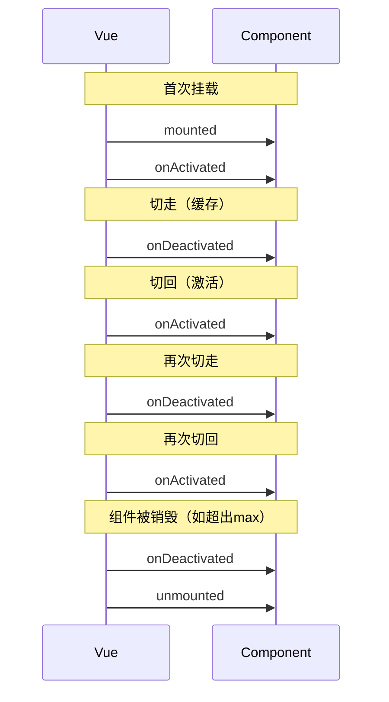

扫描[二维码](https://api2.cmdragon.cn/upload/cmder/20250304_012821924.jpg)关注或者微信搜一搜：`编程智域 前端至全栈交流与成长`

[发现1000+提升效率与开发的AI工具和实用程序](https://tools.cmdragon.cn/zh/apps?category=ai_chat)：https://tools.cmdragon.cn/

## 一、缓存组件的"生死"状态

前面咱说了，KeepAlive让被切走的组件"冬眠"而不是"死亡"。那冬眠的组件到底是个啥状态？它既不是活着（在DOM上），也不是死了（被销毁），而是介于两者之间——**不活跃状态**。

普通组件的一生很简单：创建→挂载→更新→卸载，一锤子买卖。

但缓存组件的一生就丰富多了：创建→挂载→**激活→停用→激活→停用→……**→卸载。这个"激活/停用"的循环就是KeepAlive带来的新状态。

组件冬眠了，不是挂了，别急着烧纸。它还在内存里躺着呢，随时等你叫醒。

## 二、onActivated：组件被叫醒时干啥

`onActivated` 是Vue 3提供的组合式API钩子，在组件被激活时触发。

**触发时机：**

- 首次挂载时（和onMounted一起触发）
- 每次从缓存中被重新插入DOM时

**常见用途：**

1. **刷新数据** — 列表页切回来时，可能需要获取最新数据
2. **恢复定时器** — 之前暂停的定时器重新启动
3. **恢复动画** — 之前暂停的动画继续播放
4. **恢复滚动位置** — 切走时保存的位置，切回来时恢复

```vue
<script setup>
import { onActivated, ref } from "vue";

const dataList = ref([]);
const lastRefreshTime = ref("");

onActivated(() => {
  console.log("组件被激活了！");
  // 每次激活时刷新数据
  fetchData();
});

async function fetchData() {
  // 模拟API请求
  const res = await fetch("/api/list");
  dataList.value = await res.json();
  lastRefreshTime.value = new Date().toLocaleString();
}
</script>
```

注意：首次挂载时，`onActivated` 在 `onMounted` **之后**触发。也就是说执行顺序是：`mounted → activated`。

## 三、onDeactivated：组件去冬眠时干啥

`onDeactivated` 也是Vue 3的组合式API钩子，在组件被停用（进入缓存）时触发。

**触发时机：**

- 从DOM移除、进入缓存时
- 组件卸载时（也会触发！）

**常见用途：**

1. **暂停定时器** — 不清除，等激活时恢复
2. **暂停动画** — 节省性能
3. **保存当前状态** — 滚动位置、筛选条件等

```vue
<script setup>
import { onDeactivated, ref } from "vue";

const scrollTop = ref(0);
let timer = null;

onDeactivated(() => {
  console.log("组件去冬眠了~");
  // 保存滚动位置
  scrollTop.value = document.querySelector(".list-container")?.scrollTop || 0;
  // 暂停定时器（不是清除！）
  if (timer) {
    clearInterval(timer);
    timer = null;
  }
});
</script>
```

**重要提醒：** 组件卸载时 `onDeactivated` 也会触发。所以如果你在 `onDeactivated` 中做清理操作，要考虑组件是真的要卸载了还是只是去冬眠。

## 四、和mounted/unmounted的区别

这是很多人搞混的地方，咱用表格和时序图彻底搞明白：

| 特性           | mounted/unmounted | onActivated/onDeactivated |
| -------------- | ----------------- | ------------------------- |
| 触发次数       | 各只触发1次       | 可多次触发                |
| 缓存组件切走时 | 不触发unmounted   | 触发onDeactivated         |
| 缓存组件切回时 | 不触发mounted     | 触发onActivated           |
| 首次挂载时     | mounted触发       | onActivated也触发         |
| 组件卸载时     | unmounted触发     | onDeactivated也触发       |

完整的触发时序：



**核心区别：** mounted/unmounted是"生与死"，onActivated/onDeactivated是"醒与睡"。缓存组件只会"睡"和"醒"，不会反复"死"和"生"。

## 五、选项式API的写法

如果你用的是选项式API，对应的是 `activated` 和 `deactivated` 选项：

```javascript
export default {
  name: "ListPage",

  mounted() {
    console.log("mounted - 组件创建");
  },

  activated() {
    console.log("activated - 组件被激活");
    // 刷新数据
    this.fetchData();
  },

  deactivated() {
    console.log("deactivated - 组件去冬眠");
    // 保存状态
    this.saveScrollPosition();
  },

  unmounted() {
    console.log("unmounted - 组件销毁");
  },
};
```

两种写法效果一样，选你习惯的就行。

## 六、后代组件也能感知到

这是个容易被忽略的点——`onActivated` 和 `onDeactivated` 不仅适用于KeepAlive缓存的根组件，**也适用于缓存树中的后代组件**。

什么意思呢？比如你的结构是这样的：

```
KeepAlive
  └── ListPage（根组件，被缓存）
        ├── SearchBar（子组件）
        └── DataTable（子组件）
```

当ListPage被deactivated时，SearchBar和DataTable的 `onDeactivated` 也会触发。当ListPage被activated时，子组件们的 `onActivated` 也会触发。

这很合理——爹冬眠了，孩子也跟着睡；爹醒了，孩子也跟着醒。

```vue
<!-- SearchBar.vue -->
<script setup>
import { onActivated, onDeactivated } from "vue";

onActivated(() => {
  console.log("SearchBar也被激活了");
});

onDeactivated(() => {
  console.log("SearchBar也去冬眠了");
});
</script>
```

## 七、实战：列表页缓存与数据刷新

来个完整的实战案例，把前面学的都用上：

```vue
<!-- ListPage.vue -->
<script setup>
import { ref, onMounted, onActivated, onDeactivated } from "vue";

const list = ref([]);
const loading = ref(false);
const scrollTop = ref(0);
const searchQuery = ref("");
const lastFetchTime = ref(null);
const listRef = ref(null);

// 获取数据
async function fetchData(force = false) {
  // 如果不是强制刷新，且数据不超过30秒，就不重新获取
  if (!force && lastFetchTime.value) {
    const elapsed = Date.now() - lastFetchTime.value;
    if (elapsed < 30000) {
      console.log("数据还新鲜，不刷新");
      return;
    }
  }

  loading.value = true;
  try {
    const res = await fetch(`/api/list?q=${searchQuery.value}`);
    list.value = await res.json();
    lastFetchTime.value = Date.now();
  } finally {
    loading.value = false;
  }
}

// 首次挂载获取数据
onMounted(() => {
  fetchData(true);
});

// 每次激活时判断是否需要刷新
onActivated(() => {
  // 恢复滚动位置
  if (listRef.value && scrollTop.value) {
    listRef.value.scrollTop = scrollTop.value;
  }
  // 智能刷新：超过30秒才重新获取
  fetchData();
});

// 停用时保存状态
onDeactivated(() => {
  // 保存滚动位置
  if (listRef.value) {
    scrollTop.value = listRef.value.scrollTop;
  }
});
</script>

<template>
  <div>
    <input
      v-model="searchQuery"
      placeholder="搜索..."
      @keyup.enter="fetchData(true)"
    />
    <div
      ref="listRef"
      class="list-container"
      style="height: 500px; overflow-y: auto;"
    >
      <div v-if="loading">加载中...</div>
      <div v-else>
        <div v-for="item in list" :key="item.id" class="list-item">
          {{ item.name }}
        </div>
      </div>
    </div>
  </div>
</template>
```

这个例子实现了：

- 首次挂载获取数据
- 切回来时智能判断是否需要刷新（30秒内不刷新）
- 切走时保存滚动位置
- 切回来时恢复滚动位置

## 课后Quiz

### 问题1：缓存组件首次挂载时，onActivated和onMounted的触发顺序是什么？

**答案解析：** 先触发 `onMounted`，再触发 `onActivated`。首次挂载时两个钩子都会触发，顺序是 mounted → activated。这是因为组件先完成挂载（mounted），然后被KeepAlive标记为活跃状态（activated）。

### 问题2：组件被KeepAlive缓存后切走时，unmounted会触发吗？

**答案解析：** 不会。被KeepAlive缓存的组件切走时只触发 `onDeactivated`，不触发 `unmounted`。因为组件没有被销毁，只是进入了不活跃状态（冬眠）。只有当组件被真正销毁时（比如超出max被LRU淘汰，或者KeepAlive本身被卸载），才会触发 `unmounted`。

## 常见报错解决方案

### 1. onActivated不触发

**错误现象：** 在组件里写了onActivated，但切换时没反应。

**可能原因：** 组件没有被KeepAlive包裹，或者被exclude排除了。

**解决方案：** 检查组件是否在KeepAlive内部，且没有被exclude排除。可以在组件里同时写onMounted和onActivated，打印日志确认哪个触发了。

### 2. onActivated中刷新数据导致闪烁

**错误现象：** 每次切回来页面都闪一下，因为数据重新加载了。

**可能原因：** 在onActivated中无条件刷新数据，即使数据还是新的。

**解决方案：** 添加判断条件，不是每次激活都刷新。可以用时间戳判断数据是否过期，或者用一个标记位记录是否需要刷新。

### 3. 定时器在onDeactivated中clearInterval导致onActivated中无法恢复

**错误现象：** 定时器被清除后，onActivated中无法恢复。

**可能原因：** 在onDeactivated中用clearInterval清除了定时器，但onActivated中没有重新创建。

**解决方案：** onDeactivated中应该"暂停"而不是"清除"定时器。或者在onActivated中重新创建定时器。具体选择取决于你的业务需求——如果定时器任务可以中断，就清除+重建；如果需要连续执行，就暂停+恢复。

参考链接：

- https://cn.vuejs.org/guide/built-ins/keep-alive.html
- https://cn.vuejs.org/api/composition-api-lifecycle.html#onactivated

余下文章内容请点击跳转至 个人博客页面 或者 扫描[二维码](https://api2.cmdragon.cn/upload/cmder/20250304_012821924.jpg)关注或者微信搜一搜：`编程智域 前端至全栈交流与成长`，阅读完整的文章：[被缓存的组件"死"了吗？onActivated和onDeactivated告诉你答案](https://blog.cmdragon.cn/posts/k4d5e6f7a8b9c0d1e2f3a4b5c6d7e8f9/)

<details>
<summary>往期文章归档</summary>

- [Vue 3 静态与动态 Props 如何传递？TypeScript 类型约束有何必要？](https://blog.cmdragon.cn/posts/94ab48753b64780ca3ab7a7115ae8522/)
- [Vue 3中组件局部注册的优势与实现方式如何？](https://blog.cmdragon.cn/posts/dbf576e744870f6de26fd8a2e03e47da/)
- [如何在Vue3中优化生命周期钩子性能并规避常见陷阱？](https://blog.cmdragon.cn/posts/12d98b3b9ccd6c19a1b169d720ac5c80/)
- [Vue 3 Composition API生命周期钩子：如何实现从基础理解到高阶复用？](https://blog.cmdragon.cn/posts/8884e2b70287fcb263c57648eeb27419/)
- [Vue 3生命周期钩子实战指南：如何正确选择onMounted、onUpdated与onUnmounted的应用场景？](https://blog.cmdragon.cn/posts/883c6dbc50ae4183770a4462e0b8ae4d/)

</details>

<details>
<summary>免费好用的热门在线工具</summary>

- [多直播聚合器 - 应用商店 | By cmdragon](https://tools.cmdragon.cn/zh/apps/multi-live-aggregator)
- [Proto文件生成器 - 应用商店 | By cmdragon](https://tools.cmdragon.cn/zh/apps/proto-file-generator)
- [图片转粒子 - 应用商店 | By cmdragon](https://tools.cmdragon.cn/zh/apps/image-to-particles)
- [视频下载器 - 应用商店 | By cmdragon](https://tools.cmdragon.cn/zh/apps/video-downloader)
- [文件格式转换器 - 应用商店 | By cmdragon](https://tools.cmdragon.cn/zh/apps/file-converter)
- [M3U8在线播放器 - 应用商店 | By cmdragon](https://tools.cmdragon.cn/zh/apps/m3u8-player)
- [CMDragon 在线工具 - 高级AI工具箱与开发者套件 | 免费好用的在线工具](https://tools.cmdragon.cn/zh)
- [应用商店 - 发现1000+提升效率与开发的AI工具和实用程序 | 免费好用的在线工具](https://tools.cmdragon.cn/zh/apps?category=trending)

</details>
