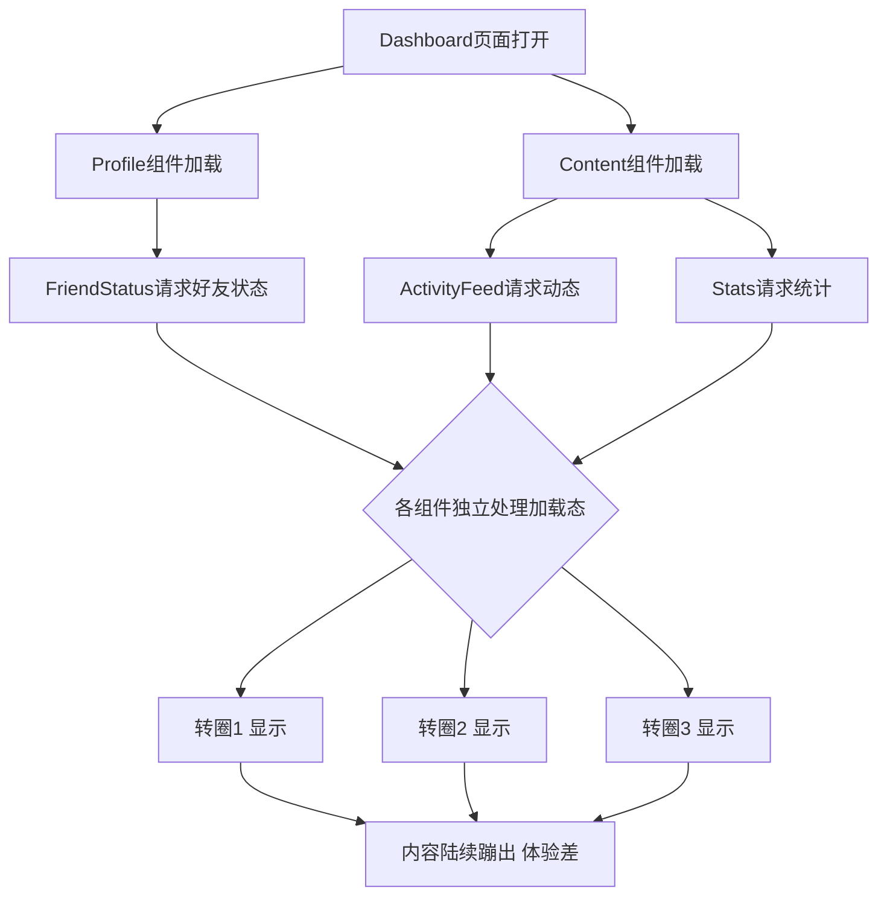
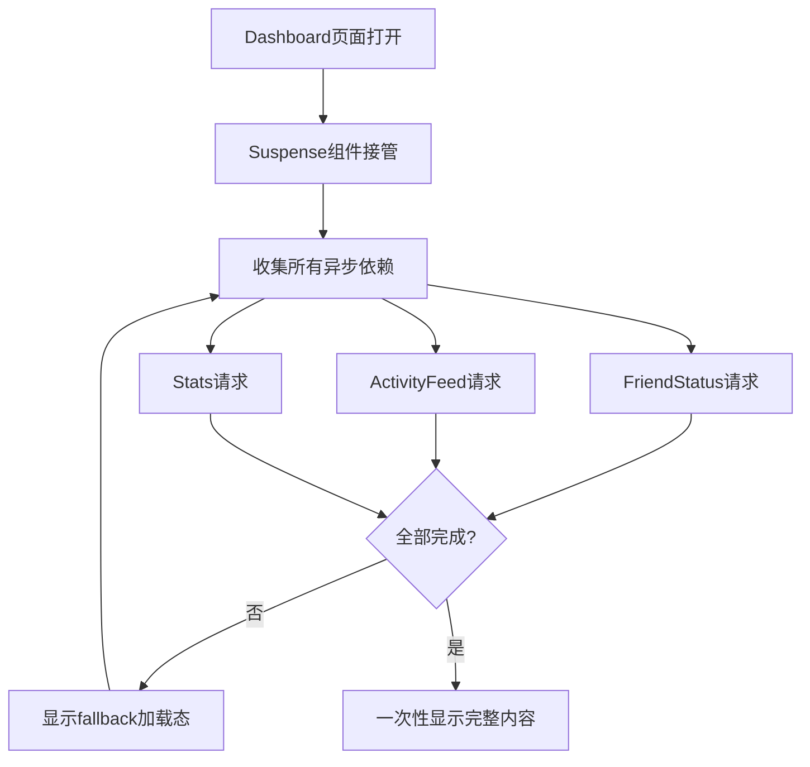
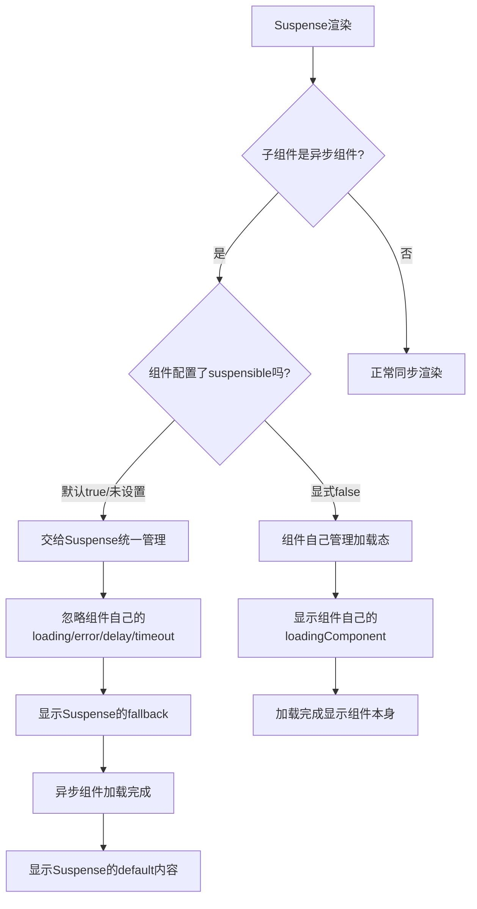
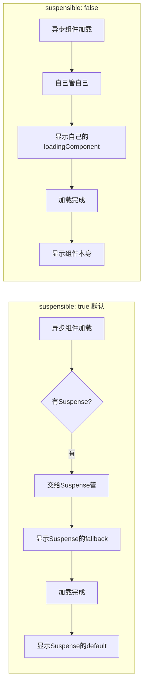

扫描[二维码](https://api2.cmdragon.cn/upload/cmder/20250304_012821924.jpg)关注或者微信搜一搜：`编程智域 前端至全栈交流与成长`

[发现1000+提升效率与开发的AI工具和实用程序](https://tools.cmdragon.cn/zh/apps?category=ai_chat)：https://tools.cmdragon.cn/zh/apps?category=ai_chat

## 一、Suspense是啥？它要解决啥问题？

写Vue项目的时候，你肯定遇到过这种场景：一个页面里嵌了好几层组件，每层组件都要去后端拉数据。结果页面一打开，先转一个圈，过会儿又转一个圈，再过会儿某个角落突然蹦出来内容，另一个角落还在转圈。整个加载过程乱七八糟，用户体验跟坐过山车似的。

Suspense就是Vue 3内置的一个组件，专门用来收拾这种烂摊子。它能在组件树里统一协调对异步依赖的处理，让所有异步操作都乖乖听话，要么一起等着，要么一起显示，不会再出现"半截页面"的尴尬场面。

### 没有Suspense时的痛

咱们先看看官方文档里的Dashboard例子，感受一下没有Suspense时组件层级有多折磨人。假设有个Dashboard页面，结构大概长这样：

```
Dashboard
├── Profile
│   └── FriendStatus（要异步拉好友在线状态）
└── Content
    ├── ActivityFeed（要异步拉动态列表）
    └── Stats（要异步拉统计数据）
```

每个带异步请求的组件都得自己处理加载态。FriendStatus转圈、ActivityFeed转圈、Stats也转圈，三个圈各转各的，谁先回来谁先显示。用户看到的就是页面一会儿冒出来一块，一会儿又冒出来一块，跟挤牙膏一样。



### 有了Suspense之后

Suspense干的事很简单：它在组件树里找个位置"蹲点"，把下面所有异步依赖都收集起来。只要有一个还没完成，它就显示`#fallback`插槽里的内容（一般是loading动画）；等所有异步依赖都搞定了，再把真正的内容一次性显示出来。

打个比方，就像餐厅后厨。没有Suspense的时候，每个厨师各做各的，做好一盘就端出去一盘，客人看到菜一盘盘乱上，有的凉了有的还没好。有了Suspense，相当于有个领班在那盯着，所有菜必须一起做好了一起端上桌，客人体验就舒服多了。



用代码写出来大概是这样：

```vue
<!-- App.vue 根组件，用Suspense包裹整个Dashboard -->
<template>
  <!-- Suspense组件，#fallback是加载中时显示的内容 -->
  <Suspense>
    <!-- 默认插槽，放真正要展示的组件 -->
    <template #default>
      <Dashboard />
    </template>
    <!-- fallback插槽，所有异步依赖未完成时显示 -->
    <template #fallback>
      <div class="loading">
        <span class="spinner"></span>
        页面加载中，稍等一下哈...
      </div>
    </template>
  </Suspense>
</template>

<script setup>
// 引入Dashboard组件，它内部有多个异步依赖
import Dashboard from './components/Dashboard.vue'
</script>

<style>
.loading {
  display: flex;
  align-items: center;
  justify-content: center;
  height: 100vh;
  gap: 12px;
  color: #666;
}
.spinner {
  width: 24px;
  height: 24px;
  border: 3px solid #ddd;
  border-top-color: #42b883;
  border-radius: 50%;
  animation: spin 0.8s linear infinite;
}
@keyframes spin {
  to { transform: rotate(360deg); }
}
</style>
```

这里有个坑得提醒一下：**Suspense目前还是实验性功能**，官方文档明确说了API可能在未来版本变动。生产环境用的话心里得有数，别到时候升个Vue版本发现挂了。不过话说回来，这功能确实好用，社区里用得也挺多，只要不瞎折腾边缘case，一般没啥问题。

## 二、async setup()——让组件自己变成异步的

Suspense要管的"异步依赖"到底是啥？主要有两种来源：一种是异步组件（后面讲），另一种就是`async setup()`。组合式API里的`setup()`函数可以写成异步的，加个`async`关键字就行。

### 基本写法

在`setup()`里直接用`async`，然后就可以`await`等待异步操作了：

```vue
<!-- UserCard.vue 一个需要拉取用户信息的组件 -->
<template>
  <div class="user-card">
    
    <h3>{{ user.name }}</h3>
    <p>{{ user.bio }}</p>
  </div>
</template>

<script>
import { ref } from 'vue'

// 这里把setup写成async函数，组件就变成了异步依赖
export default {
  async setup() {
    // 定义响应式数据，存用户信息
    const user = ref(null)

    // await等待fetch完成，这期间组件处于"挂起"状态
    // 如果外层有Suspense，会显示fallback内容
    const res = await fetch('https://api.example.com/users/1')
    // 把返回的json赋值给user
    user.value = await res.json()

    // 必须返回模板要用到的东西
    return {
      user
    }
  }
}
</script>

<style scoped>
.user-card {
  padding: 16px;
  border: 1px solid #eee;
  border-radius: 8px;
  text-align: center;
}
.user-card img {
  width: 80px;
  height: 80px;
  border-radius: 50%;
}
</style>
```

这段代码的关键点在于：`setup()`变成了`async`函数后，组件在`setup`完成前不会渲染。如果它的祖先组件链上有Suspense，Suspense就会知道"嘿，这小子还没准备好"，然后显示fallback。

### `<script setup>`里的顶层await

实际开发中大家更爱用`<script setup>`，写起来更简洁。在`<script setup>`里写顶层`await`，组件会自动变成异步依赖，不用显式写`async`：

```vue
<!-- ArticleList.vue 用script setup + 顶层await -->
<template>
  <div class="article-list">
    <article v-for="item in list" :key="item.id">
      <h2>{{ item.title }}</h2>
      <p>{{ item.summary }}</p>
    </article>
  </div>
</template>

<script setup>
import { ref } from 'vue'

// 定义文章列表的响应式数据
const list = ref([])

// 顶层await，这一行让整个组件变成异步依赖
// 注意：顶层await必须直接写在script setup根作用域，不能包在函数里
const res = await fetch('https://api.example.com/articles')
// 解析json并赋值
list.value = await res.json()
</script>

<style scoped>
.article-list {
  display: grid;
  gap: 16px;
}
article {
  padding: 16px;
  background: #fafafa;
  border-radius: 8px;
}
</style>
```

这里有个细节得强调一下：**顶层`await`只能写在`<script setup>`的最外层**。如果你把它包在某个函数里再调用，那不算顶层await，组件也不会变成异步依赖。这俩写法效果完全不一样：

```vue
<script setup>
// ✅ 这是顶层await，组件变成异步依赖
const data = await fetch('/api/data').then(r => r.json())

// ❌ 这不是顶层await，只是普通函数里的await
async function loadData() {
  const data = await fetch('/api/data').then(r => r.json())
}
loadData() // 这样组件不会变成异步依赖，Suspense也管不到它
</script>
```

打个比方，`async setup`就像组件跟Suspense说："我先去拿个快递，你们等我一下，回来再开始干活。"Suspense就会耐心等它，等它回来了一起把页面渲染出来。

## 三、异步组件——默认就听Suspense的话

除了`async setup()`，Suspense管的另一种异步依赖是**异步组件**。异步组件就是用`defineAsyncComponent`定义的组件，平时用来做路由懒加载、按需加载啥的。

### 异步组件默认是suspensible的

官方文档说得很清楚：异步组件默认就是"suspensible"的。啥意思呢？就是只要组件链上有Suspense，异步组件就会被当成Suspense的异步依赖，由Suspense统一管理加载状态。

这种情况下，异步组件自己配置的`loadingComponent`、`errorComponent`、`delay`、`timeout`这些选项**全部被忽略**，统统交给Suspense来控制。

```vue
<!-- App.vue 异步组件配合Suspense使用 -->
<template>
  <Suspense>
    <!-- 默认插槽，放异步组件 -->
    <template #default>
      <HeavyChart />
    </template>
    <!-- 加载态由Suspense统一控制 -->
    <template #fallback>
      <div>图表加载中...</div>
    </template>
  </Suspense>
</template>

<script setup>
import { defineAsyncComponent } from 'vue'

// 定义异步组件，动态import一个体积较大的图表组件
// 注意：这里配置的loadingComponent、delay等选项会被Suspense忽略
const HeavyChart = defineAsyncComponent({
  // loader函数，返回Promise，动态加载组件
  loader: () => import('./components/HeavyChart.vue'),
  // 下面这些选项在有Suspense的情况下都不生效
  loadingComponent: { template: '<div>自己的loading（被忽略）</div>' },
  errorComponent: { template: '<div>自己的error（被忽略）</div>' },
  delay: 200,
  timeout: 3000
})
</script>
```

上面这段代码里，虽然`defineAsyncComponent`配置了一堆选项，但因为外层有Suspense，这些选项全都不生效。加载态显示的是Suspense的`#fallback`，报错也是Suspense通过`errorCaptured`或者`@resolve`/`@reject`事件来处理。

### 为啥要这么设计？

这么设计其实挺合理的。你想啊，如果异步组件自己显示自己的loading，Suspense又显示自己的loading，那页面不就又乱套了？所以Vue干脆规定：有Suspense在的时候，异步组件就别瞎掺和了，统一听Suspense的指挥。

打个比方，异步组件默认是个"听话的小孩"，Suspense说啥它听啥。Suspense说"先别显示，等我发话"，它就乖乖藏着；Suspense说"好了，大家都准备好了，出来吧"，它就跟着其他兄弟一起亮相。



## 四、suspensible: false——我要自己管加载状态

虽然Suspense统一管理挺好，但有时候你就是想让某个异步组件"单飞"，自己显示自己的加载态，不想被Suspense管着。这时候就用`suspensible: false`选项。

### 怎么用

在`defineAsyncComponent`的配置对象里加一行`suspensible: false`，这个异步组件就跟Suspense"脱钩"了，始终自己控制加载状态：

```vue
<!-- App.vue 对比suspensible默认true和false -->
<template>
  <div class="app">
    <Suspense>
      <template #default>
        <div class="grid">
          <!-- 这个组件走Suspense统一管理 -->
          <ChartA />
          <!-- 这个组件suspensible:false，自己管自己 -->
          <ChartB />
        </div>
      </template>
      <template #fallback>
        <div class="global-loading">Suspense统一加载中...</div>
      </template>
    </Suspense>
  </div>
</template>

<script setup>
import { defineAsyncComponent } from 'vue'

// ChartA：默认suspensible为true，交给Suspense管
const ChartA = defineAsyncComponent({
  loader: () => import('./components/ChartA.vue'),
  // 没写suspensible，默认就是true
})

// ChartB：显式设置suspensible为false，自己管加载态
const ChartB = defineAsyncComponent({
  loader: () => import('./components/ChartB.vue'),
  // 关键这一行：不交给Suspense管
  suspensible: false,
  // 自己的loading配置，会生效
  loadingComponent: {
    template: '<div class="self-loading">ChartB自己加载中...</div>'
  },
  // 自己的error配置，也会生效
  errorComponent: {
    template: '<div class="self-error">ChartB加载失败</div>'
  },
  // 延迟200ms再显示loading，避免闪烁
  delay: 200,
  // 3秒超时显示error
  timeout: 3000
})
</script>

<style scoped>
.grid {
  display: grid;
  grid-template-columns: 1fr 1fr;
  gap: 16px;
}
.global-loading {
  padding: 40px;
  text-align: center;
  color: #42b883;
}
</style>
```

### 两种模式的区别

这俩模式的区别用流程图看最直观：



### 啥时候用suspensible: false

实际开发中，`suspensible: false`用得不多，但有些场景确实需要：

1. **某个组件加载特别慢**：比如一个大图表要拉10秒，你不想让它拖累整个Suspense，让它自己显示loading，其他该显示的先显示。
2. **组件需要自己的加载逻辑**：比如loading动画要跟组件本身风格一致，用Suspense的fallback不合适。
3. **不想被Suspense的fallback覆盖**：有些组件即使加载中也要显示个骨架屏，不想被统一的loading盖住。

不过大多数情况下，还是建议用默认的`suspensible: true`，让Suspense统一管理，体验更一致。除非真有特殊需求，否则别瞎加`suspensible: false`，容易把简单问题搞复杂。

## 课后 Quiz

**问题1：在`<script setup>`里写顶层`await`，组件会变成异步依赖吗？Suspense能管到它吗？**

答案解析：会的。在`<script setup>`里写顶层`await`（直接写在根作用域，不包在函数里），会让组件自动变成异步依赖。如果这个组件的祖先链上有Suspense，Suspense就会管到它——在`await`完成前显示fallback，完成后才渲染组件内容。这是Vue编译器自动处理的，不用显式声明`async`。但要注意，如果`await`写在普通函数里再调用，就不算顶层await，组件不会变成异步依赖。

**问题2：异步组件默认是suspensible的吗？如果外层有Suspense，异步组件自己配置的`loadingComponent`还生效吗？**

答案解析：异步组件默认是suspensible的（`suspensible: true`）。如果外层有Suspense，异步组件会被当作Suspense的异步依赖，由Suspense统一控制加载状态。这种情况下，异步组件自己配置的`loadingComponent`、`errorComponent`、`delay`、`timeout`这些选项**全部被忽略**，不生效。加载态显示的是Suspense的`#fallback`插槽内容。如果想让自己配置生效，需要显式设置`suspensible: false`。

**问题3：什么场景下应该用`suspensible: false`？会有什么影响？**

答案解析：`suspensible: false`适用于想让异步组件自己管理加载状态的场景，比如：某个组件加载特别慢不想拖累整个Suspense、组件需要自己风格的loading动画、或者不想被Suspense的fallback覆盖。设置`suspensible: false`后，异步组件会脱离Suspense的控制，自己显示`loadingComponent`、`errorComponent`等。影响是：这个组件的加载态跟其他组件不同步，可能出现"其他内容都显示了，就它还在转圈"的情况。所以除非有特殊需求，一般建议保持默认的`suspensible: true`，让Suspense统一管理。

## 常见报错解决方案

**报错1：`Component <XXX> is missing template/render function`**

产生原因：用了`async setup()`或者`<script setup>`顶层await让组件变成异步依赖，但外层没有用Suspense包裹。Vue不知道该在组件加载期间显示啥，就报这个错。

解决方案：在异步组件的祖先组件里用`<Suspense>`包裹它，并提供`#fallback`插槽：

```vue
<template>
  <Suspense>
    <template #default>
      <AsyncComponent />
    </template>
    <template #fallback>
      <div>加载中...</div>
    </template>
  </Suspense>
</template>
```

预防建议：只要用了`async setup()`或顶层`await`，就一定要在外层套Suspense，养成这个习惯就不会忘。

**报错2：`Uncaught (in promise) TypeError: Failed to fetch` 或者异步请求失败导致页面白屏**

产生原因：`async setup()`里的`await`抛错了（比如接口404、网络断了），Suspense默认不会处理这个错误，错误会冒泡上去，导致页面白屏。

解决方案：用`onErrorCaptured`或者Suspense的`@reject`事件捕获错误，显示错误提示而不是白屏：

```vue
<template>
  <Suspense @resolve="onResolve" @reject="onReject">
    <template #default>
      <AsyncComponent />
    </template>
    <template #fallback>
      <div>加载中...</div>
    </template>
  </Suspense>
  <div v-if="error">{{ error }}</div>
</template>

<script setup>
import { ref, onErrorCaptured } from 'vue'

const error = ref(null)

// 捕获子组件异步setup抛出的错误
onErrorCaptured((err) => {
  error.value = err.message
  // 返回false阻止错误继续冒泡
  return false
})

function onResolve() {
  error.value = null
}

function onReject(err) {
  error.value = '加载失败：' + err.message
}
</script>
```

预防建议：永远在用Suspense的地方加上错误处理逻辑，别让异步错误把页面搞白屏。也可以在`async setup()`内部用`try/catch`自己处理错误，返回默认数据。

**报错3：异步组件配置了`loadingComponent`但没显示，一直显示Suspense的fallback**

产生原因：这不是bug，是预期行为。异步组件默认`suspensible: true`，外层有Suspense时，组件自己的`loadingComponent`、`errorComponent`等选项会被忽略，统一由Suspense控制。

解决方案：如果确实想让异步组件显示自己的loading，设置`suspensible: false`：

```js
const AsyncComp = defineAsyncComponent({
  loader: () => import('./AsyncComp.vue'),
  suspensible: false,  // 关键：脱离Suspense控制
  loadingComponent: MyLoading,  // 现在这个会生效
  delay: 200
})
```

预防建议：搞清楚Suspense和异步组件选项的优先级关系。有Suspense时，异步组件的加载相关选项默认不生效；想要自己控制就显式写`suspensible: false`。

## 参考链接

- https://vuejs.org/guide/built-ins/suspense.html

余下文章内容请点击跳转至 个人博客页面 或者 扫描[二维码](https://api2.cmdragon.cn/upload/cmder/20250304_012821924.jpg)关注或者微信搜一搜：`编程智域 前端至全栈交流与成长`，阅读完整的文章：[页面加载转圈圈转个没完？Suspense帮你统一管异步依赖](https://blog.cmdragon.cn/posts/j6k7l8m9n0o1p2q3r4s5t6u7v8w9x0y1/)

<details>
<summary>往期文章归档</summary>

- [Vue 3 静态与动态 Props 如何传递？TypeScript 类型约束有何必要？](https://blog.cmdragon.cn/posts/94ab48753b64780ca3ab7a7115ae8522/)
- [Vue 3中组件局部注册的优势与实现方式如何？](https://blog.cmdragon.cn/posts/dbf576e744870f6de26fd8a2e03e47da/)
- [如何在Vue3中优化生命周期钩子性能并规避常见陷阱？](https://blog.cmdragon.cn/posts/12d98b3b9ccd6c19a1b169d720ac5c80/)
- [Vue 3 Composition API生命周期钩子：如何实现从基础理解到高阶复用？](https://blog.cmdragon.cn/posts/8884e2b70287fcb263c57648eeb27419/)
- [Vue 3生命周期钩子实战指南：如何正确选择onMounted、onUpdated与onUnmounted的应用场景？](https://blog.cmdragon.cn/posts/883c6dbc50ae4183770a4462e0b8ae4d/)
- [Vue 3中生命周期钩子与响应式系统如何实现协同工作？](https://blog.cmdragon.cn/posts/70dad360ffa9dce14d0d69611b8cb019/)
- [Vue 3组件生命周期钩子的执行顺序与使用场景是什么？](https://blog.cmdragon.cn/posts/db44294a78dc9f666f67b053f6c83567/)
- [Vue组件全局注册与局部注册如何抉择？](https://blog.cmdragon.cn/posts/43ead630ea17da65d99ad2eb8188e472/)
- [Vue3组件化开发中，Props与Emits如何实现数据流转与事件协作？](https://blog.cmdragon.cn/posts/8cff7d2df113da66ea7be560c4d1d22a/)
- [Vue 3模板引用如何与其他特性协同实现复杂交互？](https://blog.cmdragon.cn/posts/331bf75d114ab09116eadfcdca602b58/)
- [Vue 3 v-for中模板引用如何实现高效管理与动态控制？](https://blog.cmdragon.cn/posts/cb380897ddc3578b180ecf8843c774c1/)
- [Vue 3的defineExpose：如何突破script setup组件默认封装，实现精准的父子通讯？](https://blog.cmdragon.cn/posts/202ae0f4acde7128e0e31baf63732fb5/)
- [Vue 3模板引用的生命周期时机如何把握？常见陷阱该如何避免？](https://blog.cmdragon.cn/posts/7d2a0f6555ecbe92afd7d2491c427463/)
- [Vue 3模板引用如何实现父组件与子组件的高效交互？](https://blog.cmdragon.cn/posts/3fb7bdd84128b7efaaa1c979e1f28dee/)
- [Vue中为何需要模板引用？又如何高效实现DOM与组件实例的直接访问？](https://blog.cmdragon.cn/posts/23f3464ba16c7054b4783cded50c04c6/)

</details>

<details>
<summary>免费好用的热门在线工具</summary>

- [多直播聚合器 - 应用商店 | By cmdragon](https://tools.cmdragon.cn/zh/apps/multi-live-aggregator)
- [Proto文件生成器 - 应用商店 | By cmdragon](https://tools.cmdragon.cn/zh/apps/proto-file-generator)
- [图片转粒子 - 应用商店 | By cmdragon](https://tools.cmdragon.cn/zh/apps/image-to-particles)
- [视频下载器 - 应用商店 | By cmdragon](https://tools.cmdragon.cn/zh/apps/video-downloader)
- [文件格式转换器 - 应用商店 | By cmdragon](https://tools.cmdragon.cn/zh/apps/file-converter)
- [M3U8在线播放器 - 应用商店 | By cmdragon](https://tools.cmdragon.cn/zh/apps/m3u8-player)
- [快图设计 - 应用商店 | By cmdragon](https://tools.cmdragon.cn/zh/apps/quick-image-design)
- [高级文字转图片转换器 - 应用商店 | By cmdragon](https://tools.cmdragon.cn/zh/apps/text-to-image-advanced)
- [RAID 计算器 - 应用商店 | By cmdragon](https://tools.cmdragon.cn/zh/apps/raid-calculator)
- [在线PS - 应用商店 | By cmdragon](https://tools.cmdragon.cn/zh/apps/photoshop-online)
- [Mermaid 在线编辑器 - 应用商店 | By cmdragon](https://tools.cmdragon.cn/zh/apps/mermaid-live-editor)
- [数学求解计算器 - 应用商店 | By cmdragon](https://tools.cmdragon.cn/zh/apps/math-solver-calculator)
- [智能提词器 - 应用商店 | By cmdragon](https://tools.cmdragon.cn/zh/apps/smart-teleprompter)
- [魔法简历 - 应用商店 | By cmdragon](https://tools.cmdragon.cn/zh/apps/magic-resume)
- [Image Puzzle Tool - 图片拼图工具 | By cmdragon](https://tools.cmdragon.cn/zh/apps/image-puzzle-tool)
- [字幕下载工具 - 应用商店 | By cmdragon](https://tools.cmdragon.cn/zh/apps/subtitle-downloader)
- [歌词生成工具 - 应用商店 | By cmdragon](https://tools.cmdragon.cn/zh/apps/lyrics-generator)
- [网盘资源聚合搜索 - 应用商店 | By cmdragon](https://tools.cmdragon.cn/zh/apps/cloud-drive-search)
- [ASCII字符画生成器 - 应用商店 | By cmdragon](https://tools.cmdragon.cn/zh/apps/ascii-art-generator)
- [JSON Web Tokens 工具 - 应用商店 | By cmdragon](https://tools.cmdragon.cn/zh/apps/jwt-tool)
- [Bcrypt 密码工具 - 应用商店 | By cmdragon](https://tools.cmdragon.cn/zh/apps/bcrypt-tool)
- [GIF 合成器 - 应用商店 | By cmdragon](https://tools.cmdragon.cn/zh/apps/gif-composer)
- [GIF 分解器 - 应用商店 | By cmdragon](https://tools.cmdragon.cn/zh/apps/gif-decomposer)
- [文本隐写术 - 应用商店 | By cmdragon](https://tools.cmdragon.cn/zh/apps/text-steganography)
- [CMDragon 在线工具 - 高级AI工具箱与开发者套件 | 免费好用的在线工具](https://tools.cmdragon.cn/zh)
- [应用商店 - 发现1000+提升效率与开发的AI工具和实用程序 | 免费好用的在线工具](https://tools.cmdragon.cn/zh/apps?category=trending)
- [CMDragon 更新日志 - 最新更新、功能与改进 | 免费好用的在线工具](https://tools.cmdragon.cn/zh/changelog)
- [支持我们 - 成为赞助者 | 免费好用的在线工具](https://tools.cmdragon.cn/zh/sponsor)
- [AI文本生成图像 - 应用商店 | 免费好用的在线工具](https://tools.cmdragon.cn/zh/apps/text-to-image-ai)
- [临时邮箱 - 应用商店 | 免费好用的在线工具](https://tools.cmdragon.cn/zh/apps/temp-email)
- [二维码解析器 - 应用商店 | 免费好用的在线工具](https://tools.cmdragon.cn/zh/apps/qrcode-parser)
- [文本转思维导图 - 应用商店 | 免费好用的在线工具](https://tools.cmdragon.cn/zh/apps/text-to-mindmap)
- [正则表达式可视化工具 - 应用商店 | 免费好用的在线工具](https://tools.cmdragon.cn/zh/apps/regex-visualizer)
- [文件隐写工具 - 应用商店 | 免费好用的在线工具](https://tools.cmdragon.cn/zh/apps/steganography-tool)
- [IPTV 频道探索器 - 应用商店 | 免费好用的在线工具](https://tools.cmdragon.cn/zh/apps/iptv-explorer)
- [快传 - 应用商店 | By cmdragon](https://tools.cmdragon.cn/zh/apps/snapdrop)
- [随机抽奖工具 - 应用商店 | 免费好用的在线工具](https://tools.cmdragon.cn/zh/apps/lucky-draw)
- [动漫场景查找器 - 应用商店 | 免费好用的在线工具](https://tools.cmdragon.cn/zh/apps/anime-scene-finder)
- [时间工具箱 - 应用商店 | 免费好用的在线工具](https://tools.cmdragon.cn/zh/apps/time-toolkit)
- [网速测试 - 应用商店 | 免费好用的在线工具](https://tools.cmdragon.cn/zh/apps/speed-test)
- [AI 智能抠图工具 - 应用商店 | 免费好用的在线工具](https://tools.cmdragon.cn/zh/apps/background-remover)
- [背景替换工具 - 应用商店 | 免费好用的在线工具](https://tools.cmdragon.cn/zh/apps/background-replacer)
- [艺术二维码生成器 - 应用商店 | 免费好用的在线工具](https://tools.cmdragon.cn/zh/apps/artistic-qrcode)
- [Open Graph 元标签生成器 - 应用商店 | 免费好用的在线工具](https://tools.cmdragon.cn/zh/apps/open-graph-generator)
- [图像对比工具 - 应用商店 | 免费好用的在线工具](https://tools.cmdragon.cn/zh/apps/image-comparison)
- [图片压缩专业版 - 应用商店 | 免费好用的在线工具](https://tools.cmdragon.cn/zh/apps/image-compressor)
- [密码生成器 - 应用商店 | 免费好用的在线工具](https://tools.cmdragon.cn/zh/apps/password-generator)
- [SVG优化器 - 应用商店 | 免费好用的在线工具](https://tools.cmdragon.cn/zh/apps/svg-optimizer)
- [调色板生成器 - 应用商店 | 免费好用的在线工具](https://tools.cmdragon.cn/zh/apps/color-palette)
- [在线节拍器 - 应用商店 | 免费好用的在线工具](https://tools.cmdragon.cn/zh/apps/online-metronome)
- [IP归属地查询 - 应用商店 | By cmdragon](https://tools.cmdragon.cn/zh/apps/ip-geolocation)
- [CSS网格布局生成器 - 应用商店 | 免费好用的在线工具](https://tools.cmdragon.cn/zh/apps/css-grid-layout)
- [邮箱验证工具 - 应用商店 | 免费好用的在线工具](https://tools.cmdragon.cn/zh/apps/email-validator)
- [书法练习字帖 - 应用商店 | 免费好用的在线工具](https://tools.cmdragon.cn/zh/apps/calligraphy-practice)
- [金融计算器套件 - 应用商店 | 免费好用的在线工具](https://tools.cmdragon.cn/zh/apps/finance-calculator-suite)
- [中国亲戚关系计算器 - 应用商店 | 免费好用的在线工具](https://tools.cmdragon.cn/zh/apps/chinese-kinship-calculator)
- [Protocol Buffer 工具箱 - 应用商店 | 免费好用的在线工具](https://tools.cmdragon.cn/zh/apps/protobuf-toolkit)
- [IP归属地查询 - 应用商店 | 免费好用的在线工具](https://tools.cmdragon.cn/zh/apps/ip-geolocation)
- [图片无损放大 - 应用商店 | 免费好用的在线工具](https://tools.cmdragon.cn/zh/apps/image-upscaler)
- [文本比较工具 - 应用商店 | 免费好用的在线工具](https://tools.cmdragon.cn/zh/apps/text-compare)
- [IP批量查询工具 - 应用商店 | 免费好用的在线工具](https://tools.cmdragon.cn/zh/apps/ip-batch-lookup)
- [域名查询工具 - 应用商店 | 免费好用的在线工具](https://tools.cmdragon.cn/zh/apps/domain-finder)
- [DNS工具箱 - 应用商店 | 免费好用的在线工具](https://tools.cmdragon.cn/zh/apps/dns-toolkit)
- [网站图标生成器 - 应用商店 | 免费好用的在线工具](https://tools.cmdragon.cn/zh/apps/favicon-generator)
- [XML Sitemap](https://tools.cmdragon.cn/sitemap_index.xml)

</details>
