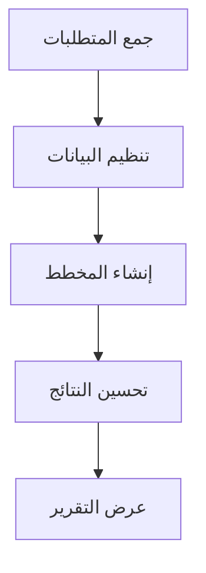
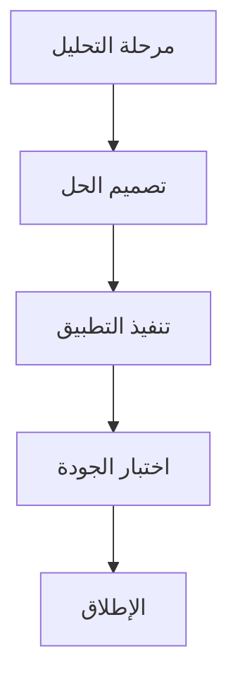

في سياق معالجة البيانات وتصورها، يُعد تحويل بيانات الجداول إلى مخططات مرئية خطوة أساسية لتعزيز كفاءة نقل المعلومات. سواءً كانت جداول تقدم المهام في إدارة المشاريع، أو نتائج التحليل الإحصائي، أو شرح العمليات في الوثائق التقنية، فإن الأداة التي تحوّل بيانات الجداول (خاصةً التي تدعم تنسيق `graph td`) إلى مخططات تصبح ضرورية لتجنب التعقيدات في التصميم اليدوي وتحويل التنسيقات، مما يحوّل البيانات من "جدول ثابت" إلى "مخطط ديناميكي" لنقل المعلومات المعقدة بشكل واضح.

### لماذا نحتاج إلى أداة مُخصصة لتحويل جداول البيانات إلى مخططات؟

في الطرق التقليدية، قد يحاول المستخدمون استخدام إكسل لإنشاء المخططات، أو رسم المخططات في عروض بوربوينت، أو استخدام أدوات عبر الإنترنت مثل Google Charts لتحويل البيانات يدويًّا، لكن هذه الطرق غالبًا ما تواجه قيودًا:

- **تعقيد العمليات اليدوية**: يتطلب إنشاء المخططات في إكسل تكرار تعديل مناطق البيانات، وتحديد نوع المخطط، وضبط التنسيقات، مما يستغرق وقتًا ويؤدي إلى أخطاء.
- **انخفاض توافق التنسيقات**: إذا كانت البيانات تحتوي على هيكل معقد (مثل الجداول المُدمجة أو تعريفات متعددة المستويات)، تُعَد الأدوات التقليدية غير قادرة على تحويلها إلى مخططات مرئية بذكاء.
- **عدم وجود تفاعلية فورية**: لا تسمح بالمعاينة الفورية لمخطط البيانات أثناء تعديلها، مما يؤدي إلى تفاوت في النتائج النهائية مقارنة بالتوقعات.

في المقابل، تدعم الأدوات المُخصصة لتحويل جداول البيانات إلى مخططات عادةً صياغة منظمة (مثل صياغة المخططات في mermaid)، وتُحوّل تلقائيًّا بيانات الجداول المُعَدَّة بتنسيق مثل `graph td` إلى مخططات، مما يحقق تحويلًا فعَّالًا يعتمد على "الصياغة كمخطط".

### الأداة الموصى بها: محرر mermaid-live-editor، لإنشاء المخططات من بيانات `graph td` بسهولة

من بين الأدوات الداعمة لتحويل جداول البيانات إلى مخططات، يبرز **محرر mermaid-live-editor** (https://tools.cmdragon.cn/apps/mermaid-live-editor) بدعمه الأصلي لصياغة `graph td`، ووظائف المعاينة الفورية، والتصدير بتنسيقات متعددة، مما يجعله الخيار المثالي لمعالجة تحويل جداول البيانات إلى مخططات. تكمن ميزاته الأساسية في:

#### 1. دعم صياغة `graph td`، لتلائم احتياجات تحويل جداول البيانات بدقة

تُعد `graph td` جزءًا أساسيًّا من صياغة mermaid المُستخدمة لتعريف **جداول تخطيطية أفقية**، وتُستخدم غالبًا لوصف العمليات ذات العلاقة التسلسلية (مثل مخطط غانت، جداول توزيع المهام، أو مخططات الخطوات). يكفي للمستخدم إدخال بيانات الجدول بتنسيق `graph td` في محرر mermaid-live-editor ليتم إنشاء المخطط المرئي تلقائيًّا. على سبيل المثال، عند إدخال الكود التالي:

سيتم توليد مخطط تخطيطي أفقدي فوري، حيث تُمثل كل عقدة (مثل A، B، C) مربعًا في المخطط، والأسهم تُظهر تسلسل الخطوات، مما يعرض العلاقات بين البيانات بشكل واضح. وهذا يوفر وقتًا كبيرًا مقارنة برسم المخطط يدويًّا، خاصةً في الوثائق التقنية وإدارة المشاريع التي تتطلب تحليلًا سريعًا للعمليات.

#### 2. التحرير الفوري + التصدير بتنسيقات متعددة، لتلبية احتياجات متنوعة

محرر mermaid-live-editor هو أداة **مُتاحة عبر الإنترنت دون تثبيت**، حيث يُمكن البدء في الاستخدام فور فتح الرابط دون أي إعدادات مسبقة. يُدخل المستخدم صياغة `graph td` أو أي صيغة mermaid أخرى (مثل `flowchart`، `gantt`، `pie`) في المربع الأيسر، ويتم تحديث المعاينة على اليمين فورًا، مع دعم **السحب والإفلات لتعديل ترتيب العقد**، و**تعديل التنسيقات (الألوان، الخط، الأسهم)** حسب الرغبة.

بعد إنشاء المخطط، يُمكن تصديره بضغطة زر إلى تنسيقات مثل PNG أو SVG، مما يسهل إدراجه في وثائق Word أو عروض بوربوينت، أو استخدامه في المواقع الإلكترونية.

#### 3. مثال توضيحي

### الخلاصة
يُعد محرر mermaid-live-editor أداة قوية تُحوّل تحويل جداول البيانات إلى مخططات مرئية من مهمة معقدة إلى عملية سلسة، مع الحفاظ على المرونة في التصميم والقدرة على التكامل مع مشاريعك المختلفة. جربه الآن لتحويل بياناتك إلى مخططات احترافية بخطوات بسيطة!