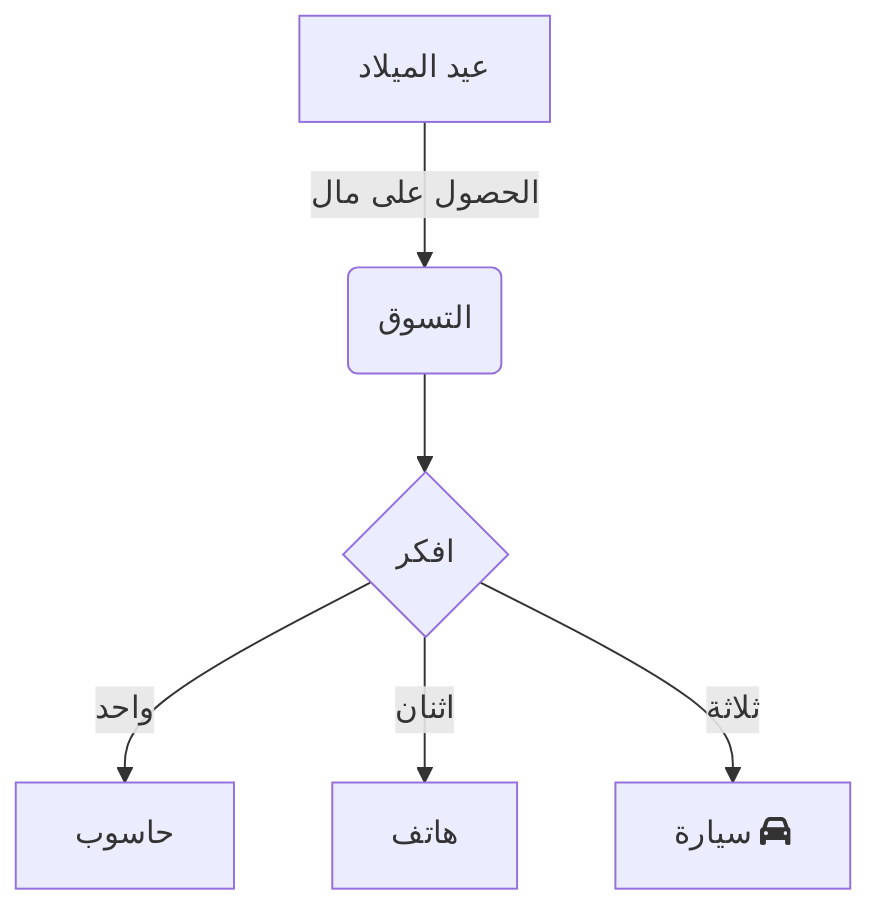

 

  

في العمل والدراسة الحديثين، تُعد مخططات التدفق أداة أساسية لعرض التواصل المرئي، وتُستخدم غالبًا لتنظيم منطق العمليات، وعرض الهياكل النظامية، أو تخطيط خطوات المهام. سواء في تفكيك المشاريع في العمل، أو تنظيم المعرفة في الدراسة، فإن أداة مخططات تدفق بسيطة وسهلة الاستخدام، خالية من الإعدادات المعقدة، تُحسّن الكفاءة بشكل كبير.  

**محرر Mermaid Live**  
([انقر هنا](https://tools.cmdragon.cn/apps/mermaid-live-editor) : https://tools.cmdragon.cn/apps/mermaid-live-editor)  
هو بالضبط أداة رسم مخططات تدفق عبر الإنترنت، تتميز بخفة الوزن، والمعاينة الفورية، والاعتماد على الصياغة النصية، مما يجعلها سهلة الاستخدام حتى للمبتدئين لرسم مخططات تدفق احترافية.  

### 一、لماذا تختار **محرر Mermaid Live**؟  

مقارنة بأدوات مخططات التدفق التقليدية (مثل Visio و Draw.io)، يمتلك **محرر Mermaid Live** مزايا واضحة:  

- **بدون تثبيت**: يمكن استخدامه مباشرة عبر المتصفح، متوافق مع جميع أنظمة التشغيل والأجهزة مثل Windows و Mac و Linux.  
- **الاعتماد على الصياغة النصية، منطق واضح**: تُعرّف الرسوم عبر صياغة نصية تشبه الكود، مع معاينة فورية (العرض يتوافق مع المحتوى)، حيث تُعدّل الصياغة وتُشاهد التغييرات فورًا.  
- **تعاون خفيف الوزن**: يُمكن مشاركة رمز الرسم أو تصديره كصورة/Markdown، لاستخدامه بسهولة في المستندات أو الاجتماعات.  
- **دعم جميع السيناريوهات**: لا يقتصر على مخططات التدفق، بل يدعم مخططات التسلسل الزمني، ومخططات غانت، ومخططات الحالة، ومخططات التفكير، لتلبية احتياجات سيناريوهات متنوعة.  

إذا كنت تبحث عن أداة مخططات تدفق "عبر الإنترنت فورية، صياغة بسيطة، ووظائف متكاملة"، فجرب فورًا **محرر Mermaid Live**  
([https://tools.cmdragon.cn/apps/mermaid-live-editor](https://tools.cmdragon.cn/apps/mermaid-live-editor)).  

### 二、دليل استخدام محرر Mermaid Live بالكامل  

#### 1. البدء السريع: فتح الأداة وفهم الواجهة  

**الخطوة الأولى**: انقر على رابط **محرر Mermaid Live**  
([https://tools.cmdragon.cn/apps/mermaid-live-editor](https://tools.cmdragon.cn/apps/mermaid-live-editor))، لفتح واجهة التحرير. يحتوي الجانب الأيسر على "منطقة تحرير الكود"، والجانب الأيمن على "معاينة فورية"، مع أزرار مُعَدّة في الأعلى مثل "مكتبة قوالب الصياغة"، "تنسيق التصدير"، و"تغيير الموضوع"، بينما توجد في القاع "إشعارات الأخطاء" و"شريط أوامر مختصر".  

#### 2. رسم مخطط التدفق: من الصياغة الأساسية إلى التطبيق الإبداعي  

**الخطوة 1: إدخال كود مخطط التدفق الأساسي**  
تُعرّف Mermaid هيكل الرسم عبر صياغة محددة، مثال بسيط يعتمد على "الاتجاه + العقد + الاتصالات":  

صق هذا الكود في **منطقة التحرير اليسرى**، وستُعرض المعاينة في الجانب الأيمن فورًا. يمكنك تعديل التفاصيل مثل `TD` (الاتجاه)، `graph` (النوع)، و`-->|الوصف|` (اتصال مُرفق بنص) لتعديل منطق الرسم.  

**الخطوة 2: استخدام قوالب الصياغة لتقليل عتبة الاستخدام**  
إذا لم تكن على دراية بالصياغة، انقر على **مكتبة قوالب الصياغة العلوية** (مثل "قالب مخطط التدفق"، "قالب مخطط غانت")، واختر القالب المُعد مسبقًا، ثم عدّل المعلمات (مثل اسم العقدة، مدة المهمة). تدعم الأداة أيضًا **إكمال تلقائي للصياغة**: عند إدخال `graph`، تظهر خيارات التخطيط (مثل TD، LR)، وعند إدخال`[ ]`، تُنشئ تلقائيًا نموذج العقدة القياسي، مما يسمح للمبتدئين بالبدء بسرعة.  

**الخطوة 3: التصدير والمشاركة**  
بعد اكتمال المخطط، انقر على زر **"التصدير" في الزاوية العلوى اليمنى**، واختر تصديره كصورة PNG (عالية الدقة)، أو SVG (صيغة متجهة)، أو نسخ رمز Markdown لدمجه في المستندات. للاستخدام الجماعي، يمكنك مشاركة صفحة التحرير مباشرةً، أو تصدير الملف.  

### ملاحظة:  
- جميع الروابط والرموز البرمجية (مثل `fa:fa-car`) تبقى كما هي لضمان التوافق.  
- تم ترجمة المصطلحات التقنية (مثل "مخطط غانت") وفق المعايير الشائعة في العالم العربي.  
- تم تحسين تنسيق النصوص ليناسب الكتابة من اليمين لليسار مع الحفاظ على التوثيق الدقيق.