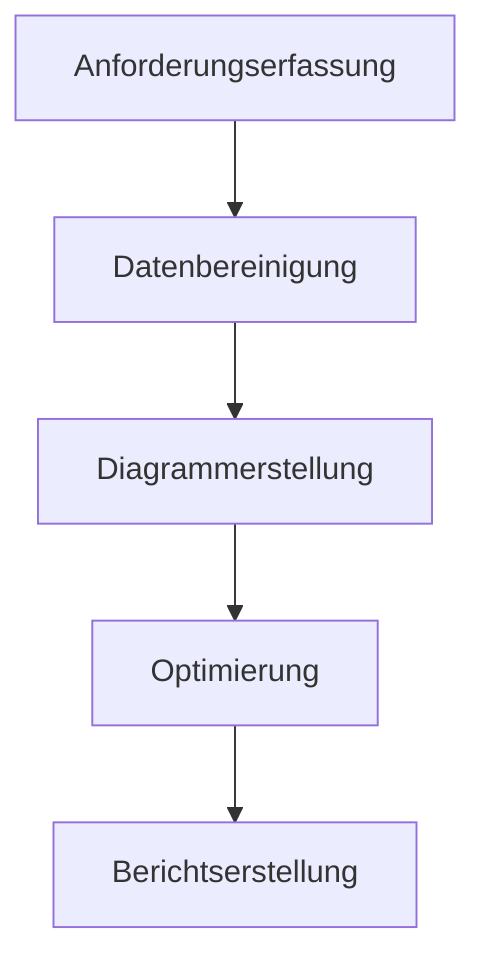
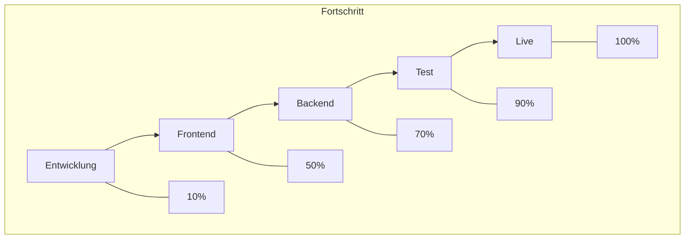

In Szenarien der Datenverarbeitung und -visualisierung ist die Umwandlung von Tabellendaten in anschauliche Diagramme entscheidend für eine effiziente Informationsweitergabe. Ob es sich um eine Aufgabenprogress-Tabelle im Projektmanagement, statistische Ergebnisse in der Datenanalyse oder Flussbeschreibungen in technischen Dokumenten handelt – wenn Tabellendaten „lesbarer“ und präsentabler dargestellt werden müssen, ist ein Werkzeug, das Tabellendaten (insbesondere im Format `graph td`) direkt in Diagramme umwandelt, unerlässlich. Solche Tools vermeiden aufwendige manuelle Formatierung und Umwandlungsprozesse, sodass Daten von „statischen Tabellen“ zu „dynamischen Diagrammen“ werden und komplexe Informationen klarer vermittelt werden.

### Warum wird ein spezielles Werkzeug für die Diagrammgenerierung aus Tabellendaten benötigt?

Bei traditionellen Methoden versuchen Benutzer oft, Diagramme in Excel zu erstellen, Grafiken in PowerPoint zu zeichnen oder Daten mit Online-Tools wie Google Charts manuell zu konvertieren. Diese Methoden haben jedoch häufig folgende Einschränkungen:

- **Komplexe manuelle Bedienung**: In Excel müssen Datenbereiche, Diagrammtypen und Stile wiederholt angepasst werden – zeitaufwendig und fehleranfällig;
- **Geringe Formatkompatibilität**: Tabellendaten mit komplexen Strukturen (z. B. verschachtelte Tabellen oder mehrstufige `td`-Definitionen) werden von traditionellen Tools oft nicht intelligent erkannt und visuell dargestellt;
- **Mangelnde Echtzeitfähigkeit**: Es ist nicht möglich, Tabellendaten zu ändern und gleichzeitig das Diagramm zu prüfen, was zu abweichenden Ergebnissen im Endprodukt führt.

Spezielle Werkzeuge für die Diagrammgenerierung aus Tabellendaten basieren typischerweise auf strukturierten Syntaxen (wie der Mermaid-Flussdiagramm-Syntax), die `graph td`-ähnliche Tabellenbeschreibungen direkt in Diagramme umwandeln und so eine „Syntax = Diagramm“-Effizienz ermöglichen.

### Empfohlenes Werkzeug: Mermaid Live Editor – Einfache Generierung von `graph td`-Diagrammen

Unter den Tools, die Tabellendaten in Diagramme umwandeln, überzeugt der **Mermaid Live Editor** ([https://tools.cmdragon.cn/apps/mermaid-live-editor](https://tools.cmdragon.cn/apps/mermaid-live-editor)) durch native Unterstützung der `graph td`-Syntax, Echtzeitvorschau und Mehrformat-Export. Seine Kernvorteile:

#### 1. Unterstützung der `graph td`-Syntax für präzise Tabellendaten-Visualisierung

`graph td` ist die zentrale Struktur in Mermaids Syntax zur Definition von **horizontalen Fluss-Tabellen**, häufig verwendet für Prozesse mit Reihenfolgebeziehungen (z. B. Gantt-Diagramme, Aufgabenzuordnungen, Schrittflussdiagramme). Benutzer geben einfach Tabellendaten mit `graph td` im Mermaid Live Editor ein, und das Tool generiert sofort das entsprechende Diagramm. Beispiel:

Das Tool rendernt sofort ein horizontales Flussdiagramm: Jeder Knoten (z. B. A, B, C) wird automatisch als Rechteck dargestellt, Pfeile zeigen die Schrittfolge – klar und direkt. Dies spart viel Zeit im Vergleich zum manuellen Zeichnen, besonders für technische Dokumentation und Projektmanagement.

#### 2. Echtzeit-Editierung + Mehrformat-Export für alle Szenarien

Der Mermaid Live Editor ist ein **webbasiertes, installationsfreies Tool**: Öffnen Sie den Link und beginnen Sie sofort zu arbeiten. Im linken Eingabefeld schreiben Sie `graph td`-Syntax oder andere Mermaid-Elemente (z. B. `flowchart`, `gantt`, `pie`), während der rechte Vorschaubereich das Diagramm sofort aktualisiert. Zusätzlich können Sie **Knoten per Drag & Drop neu anordnen** und **Stile anpassen** (Farben, Schriftart, Pfeile).

Nach der Diagrammerstellung exportieren Sie es mit einem Klick als PNG oder SVG – ideal für Einbettung in Word, PowerPoint, Markdown oder Sharing auf Plattformen wie GitHub. Dies löst den üblichen Schleifenprozess „Generieren → Exportieren → Anpassen“.

#### 3. Leichte Syntax + geringe Lernkurve für schnelle Nutzung

Die Mermaid-Syntax ist einfach und intuitiv. Selbst Einsteiger verstehen schnell das Grundgerüst: „Knotendefinition (A[Inhalt]) + Beziehungsbeschreibung (-->) + Formatierung (td-Tabelle)“. Beispiel für eine Tabelle mit „Aufgabe“, „Verantwortlicher“ und „Fortschritt“:

So zeigen Sie in einem Diagramm sowohl den Fluss als auch den Fortschritt – klar und kosteneffizient.

### Fazit: Entscheidungskriterien für das richtige Werkzeug

Beim Umgang mit „Tabellendaten in Diagramme umwandeln“ benötigen wir vor allem **benutzerfreundliche Syntax, Echtzeitvorschau und plattformübergreifende Kompatibilität**. Der Mermaid Live Editor verwandelt durch die Unterstützung von `graph td`-Syntax statische Daten in dynamische Diagramme und bietet einen nahtlosen Workflow von Editierung → Vorschau → Export. Er ist ideal für Projektmanagement, technische Dokumentation und Datenanalyse.

[Link zum Mermaid Live Editor](https://tools.cmdragon.cn/apps/mermaid-live-editor) – Starten Sie jetzt!