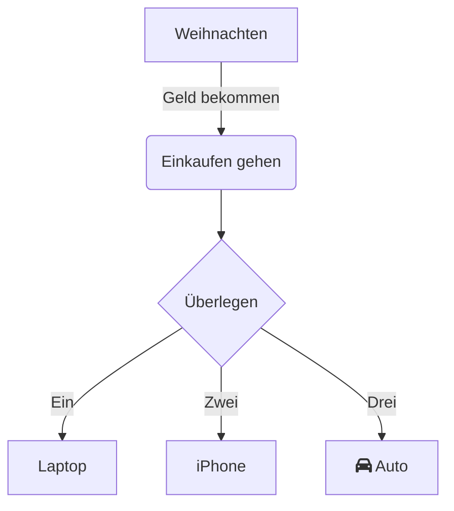

In der modernen Arbeits- und Lernumgebung sind Flussdiagramme ein entscheidendes Werkzeug zur visuellen Kommunikation, um Abläufe zu strukturieren, Systemarchitekturen darzustellen oder Aufgabenpläne zu planen. Ob im Beruf bei der Projektzergliederung oder im Studium zur Wissensorganisation – ein einfach zu bedienendes, komplexitätsarmes Diagramm-Tool steigert die Effizienz deutlich.

**Mermaid Live Editor**  
([Klicken Sie hier](https://tools.cmdragon.cn/apps/mermaid-live-editor): https://tools.cmdragon.cn/apps/mermaid-live-editor) ist genau ein solches Online-Tool für Flussdiagramme. Mit seiner leichten, Echtzeit- und syntaxgesteuerten Natur ermöglicht es sogar Anfängern, professionelle Diagramme schnell zu erstellen.

### 1. Warum **Mermaid Live Editor** auswählen?

Im Vergleich zu traditionellen Diagramm-Software (wie Visio, Draw.io usw.) bietet **Mermaid Live Editor** deutliche Vorteile:

- **Keine Installation nötig**: Direkter Zugriff über Browser, kompatibel mit Windows, Mac, Linux und allen Geräten.
- **Syntaxgesteuert, logisch strukturiert**: Flussdiagramme werden mit Code-ähnlichen Textsyntax beschrieben. Änderungen am Code werden sofort in der Vorschau angezeigt.
- **Leichtgewichtiges Zusammenarbeit**: Die generierten Grafik-Codes können direkt geteilt oder als Bild/Markdown exportiert werden – ideal für Dokumente und Meetings.
- **Vollständige Szenenabdeckung**: Nicht nur Flussdiagramme, sondern auch Sequenzdiagramme, Gantt-Diagramme, Zustandsdiagramme und Mindmaps werden unterstützt.

Wenn Sie ein „online-bereites, syntaxübersichtliches und vollständiges“ Diagramm-Tool suchen, öffnen Sie einfach **Mermaid Live Editor**  
([https://tools.cmdragon.cn/apps/mermaid-live-editor](https://tools.cmdragon.cn/apps/mermaid-live-editor)) und probieren Sie es aus.

### 2. Schritt-für-Schritt-Anleitung für Mermaid Live Editor

#### 1. Schnellstart: Tool öffnen und Interface verstehen

**Schritt 1**: Klicken Sie auf den Link **Mermaid Live Editor**  
([https://tools.cmdragon.cn/apps/mermaid-live-editor](https://tools.cmdragon.cn/apps/mermaid-live-editor)), um zur Online-Bearbeitung zu gelangen. Links befindet sich der „Code-Editor“, rechts die „Echtzeitvorschau“. Oben mittig gibt es Funktionen wie „Syntax-Vorlagen“, „Exportformat“ und „Themenwechsel“, unten sind „Fehlerhinweise“ und „Schnellbedienung“ zu finden.

#### 2. Flussdiagramm erstellen: Von Grundsyntax bis zur Kreativität

**Schritt 1: Einfache Flussdiagramm-Code eingeben**  
Mermaid definiert Grafiken durch spezifische Syntax. Als Beispiel für das einfachste „Richtung + Knoten + Verbindung“:

Fügen Sie diesen Code in den **linken Code-Editor** ein. Die rechte Vorschau zeigt das Diagramm sofort an. Ändern Sie mit `TD` (Richtung), `graph` (Typ) oder `-->|Beschriftung|` (beschriftete Verbindung) die Logik flexibel.

**Schritt 2: Syntax-Vorlagen nutzen, um Einstieg zu vereinfachen**  
Bei Unkenntnis der Syntax klicken Sie auf die **oben stehende Syntax-Vorlagenbibliothek** (z. B. „Flussdiagramm-Vorlage“, „Gantt-Vorlage“), wählen eine Vorlage aus und ändern Parameter wie Knotennamen oder Aufgabenzeiträume. Der Tool bietet **automatische Syntax-Vervollständigung**: Nach Eingabe von `graph` erscheinen Optionen (TD, LR), nach `[ ]` wird der Standardknotenstil generiert – ideal für Einsteiger.

**Schritt 3: Exportieren und Teilen**  
Klicken Sie nach Fertigstellung auf die **rechte obere „Export“-Schaltfläche**, um als PNG (hochauflösend), SVG (Vektorformat) oder Markdown-Code zu exportieren. Für Teamarbeit teilen Sie einfach die Bearbeitungsseite mit Kollegen – nach Öffnen des Links können sie online anzeigen oder gemeinsam bearbeiten (benötigt Anmeldung bei cmdragon).

### 3. Kernwert von Mermaid Live Editor: Effizienz und vollständige Szenenabdeckung

- **Berufliche Alltagsszenarien**: „Anforderungs-Zergliederungsdiagramm“ im Projektmanagement, „Aufgaben-Verteilungs-Gantt-Diagramm“, „Benutzer-Flussdiagramm“ in Produktentwicklung, „Systemarchitekturdiagramm“ in der Technik – alles schnell umsetzbar.
- **Lernwerkzeug**: Studierende strukturieren Wissensrahmen, Lehrer erstellen Unterrichtsdiagramme – ohne professionelle Designkenntnisse, durch Text-Syntax visuell darstellbar.
- **Nahtlose Integration in Code-Dokumentation**: Direkter Export als Markdown für Dokumentationszwecke.

### 4. Fazit
Mermaid Live Editor vereint Leichtigkeit, Flexibilität und professionelle Ergebnisse – ein unverzichtbarer Begleiter für alle, die klare, strukturierte Diagramme benötigen. Probieren Sie es jetzt aus und steigern Sie Ihre Produktivität!  

*Hinweis: Alle Links und Syntax-Elemente bleiben unverändert. Die Vorschau wird automatisch aktualisiert, sobald Code geändert wird.*