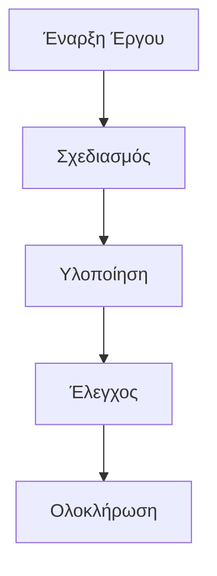

Σε σκηνικά επεξεργασίας και αναπαράστασης δεδομένων, η μετατροπή πινάκων δεδομένων σε ευανάγνωστα διαγράμματα αποτελεί κρίσιμο βήμα για τη βελτίωση της αποτελεσματικότητας μετάδοσης πληροφοριών. Είτε πρόκειται για πίνακες προόδου έργου στη διαχείριση έργων, αναλύσεις στατιστικών δεδομένων, είτε εξηγήσεις ροής σε τεχνικά έγγραφα, η μετατροπή "δεδομένων πίνακα" σε ευκρινές και παραστατικό διάγραμμα απαιτεί εργαλείο που να μετατρέπει άμεσα τα δεδομένα πίνακα (ιδιαίτερα το format `graph td`) σε διάγραμμα. Αυτά τα εργαλεία αποφεύγουν την περίπλοκη διαδικασία χειροκίνητης διάταξης και μετατροπής μορφοποίησης, μετατρέποντας τα δεδομένα από "στατικό πίνακα" σε "δυναμικό διάγραμμα".

### Πολύ δύσκολο;
Η δημιουργία διαγραμμάτων ροής με τη γραμματική `graph td` είναι πολύ εύκολη με το mermaid-live-editor, που παρέχει:
- **Προεπισκόπηση σε πραγματικό χρόνο** για την άμεση αξιολόγηση του αποτελέσματος
- **Φιλική γραμματική** για εύκολη δημιουργία διαγραμμάτων
- **Σύρετε-κάτω** για τροποποίηση στυλ (χρώμα, μέγεθος, τοποθέτηση)
- **Εξαγωγή σε πολλαπλά φορμάτ** (PNG, SVG) για χρήση σε έγγραφα ή ιστοσελίδες

### Πώς λειτουργεί;
1. Εισάγετε δεδομένα πίνακα (π.χ. δεδομένα έργου)
2. Χρησιμοποιήστε τη γραμματική `graph td` για να καθορίσετε τη δομή
3. Προεπισκοπήστε το διάγραμμα σε πραγματικό χρόνο
4. Σύρετε-κάτω για τροποποίηση στυλ
5. Εξάγετε το διάγραμμα ως PNG ή SVG

### Παράδειγμα

### Πλεονεκτήματα
- **Εξοικονόμηση χρόνου**: Αποφυγή χειροκίνητης δημιουργίας διαγραμμάτων
- **Ευκρίνεια**: Κατανοητά διαγράμματα για όλους τους ενδιαφερόμενους
- **Ευελιξία**: Εύκολη τροποποίηση και ανανέωση των δεδομένων
- **Επαγγελματικό αποτέλεσμα**: Κατάλληλο για έγγραφα, παρουσιάσεις και αναφορές

### Εφαρμογές
- **Διαχείριση έργων**: Παρακολούθηση προόδου με διαγράμματα ροής
- **Τεχνική Ανάλυση**: Εξαγωγή διαγραμμάτων από στατιστικά δεδομένα
- **Εκπαίδευση**: Διδακτικά διαγράμματα για μαθητές
- **Επικοινωνία**: Ευανάγνωστη παρουσίαση διαδικασιών

Με το mermaid-live-editor, η αναπαράσταση δεδομένων πίνακα δεν είναι πια δύσκολη – απλά πληκτρολογήστε, προεπισκοπήστε και εξάγετε! Ξεκινήστε τώρα: [mermaid.live](https://mermaid.live)