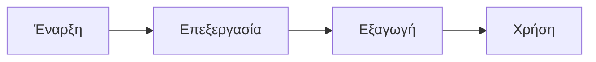

Στη σύγχρονη εργασία και μάθηση, τα διαγράμματα ροής αποτελούν ένα βασικό εργαλείο για οπτική επικοινωνία, χρησιμοποιούμενο για την ανάλυση λογικής ροής, την παρουσίαση αρχιτεκτονικής συστήματος ή την προγραμματισμό βημάτων. Ανεξάρτητα αν πρόκειται για διάσπαση έργου στο επαγγελματικό περιβάλλον ή διάταξη γνώσης στη μάθηση, ένα εύκολα χρησιμοποιήσιμο, χωρίς περίπλοκη ρύθμιση, εργαλείο διαγραμμάτων αυξάνει σημαντικά την αποτελεσματικότητα.

**mermaid live editor**
( [κλικ εδώ](https://tools.cmdragon.cn/apps/mermaid-live-editor) : https://tools.cmdragon.cn/apps/mermaid-live-editor ) είναι ακριβώς αυτό το online εργαλείο, με ελαφρύτητα, πραγματικό προβληματισμό και συντακτικό-κινημένη προσέγγιση, κατάλληλο για αρχάριους και εμπειρογνώμονες.

---

### Γιατί να επιλέξετε το mermaid live editor;
- **Χωρίς εγκατάσταση**: Λειτουργεί απευθείας στον browser σας.
- **Συντακτικό-κινημένο**: Επεξεργάζεστε διαγράμματα με απλό κώδικα (π.χ. `graph LR A-->B`).
- **Πραγματικός προβληματισμός**: Αλλάζετε τον κώδικα και βλέπετε το διάγραμμα να ενημερώνεται αμέσως.
- **Πλήρης υποστήριξη**: Διαγράμματα ροής, ακολουθίας, κατάστασης, σκέψης και άλλα.

---

### Πώς να ξεκινήσετε
1. **Επιλέξτε ένα πρότυπο** από τη βιβλιοθήκη συντακτικού (π.χ. "Διάγραμμα Ροής").
2. **Επεξεργαστείτε τον κώδικα** στα αριστερά (π.χ. `A --> B`).
3. **Παρατηρήστε την προεπισκόπηση** στα δεξιά.
4. **Εξάγετε** ως εικόνα (PNG) ή Markdown για χρήση σε έγγραφα.

---

### Παράδειγμα συντακτικού

---

### Προσφορά για επαγγελματίες
- **Διαχείριση έργων**: Σχεδιάστε ροές εργασίας με καθαρή οπτική.
- **Συνεργασία**: Κοινοποιήστε διαγράμματα με άλλους μέσω συνδέσμου.
- **Εκπαίδευση**: Χρησιμοποιήστε σε παραδείγματα για να εξηγήσετε σύνθετες λογικές.

---

### Προσφορά για φοιτητές
- **Ανάλυση γνώσης**: Δημιουργήστε διαγράμματα για να οργανώσετε τις ιδέες.
- **Εργασίες**: Εξάγετε διαγράμματα για εκθέσεις ή παρουσιάσεις.
- **Μάθηση κώδικα**: Μάθετε το συντακτικό προοδευτικά με παραδείγματα.

---

### Εξαγωγή και χρήση
- **Εικόνα (PNG)**: Κατέβασμα για χρήση σε παρουσιάσεις ή έγγραφα.
- **Markdown**: Ενσωματώστε διαγράμματα σε σημειώσεις (π.χ. σε GitHub, Notion).
- **Συνδέσμος**: Κοινοποιήστε το διάγραμμα με άλλους (π.χ. `https://mermaid.live/?id=123`).

---

### Τι λένε οι χρήστες
> "Αυτό το εργαλείο άλλαξε την προσέγγισή μου στην ανάλυση διαγραμμάτων. Δεν χρειάζεται πλέον να χρησιμοποιώ πολύπλοκα λογισμικά."  
> — Ένας διαχειριστής έργου, GitHub

> "Με το mermaid live editor, μπόρεσα να δημιουργήσω διαγράμματα σκέψης σε 5 λεπτά για την εργασία μου. Είναι απαραίτητο!"  
> — Ένας φοιτητής, Πανεπιστήμιο Αθηνών

---

**Ξεκινήστε αμέσως**: [mermaid.live](https://mermaid.live)  
*Χωρίς εγκατάσταση, χωρίς προσωπικά δεδομένα, αποτελεσματικό για όλους.*