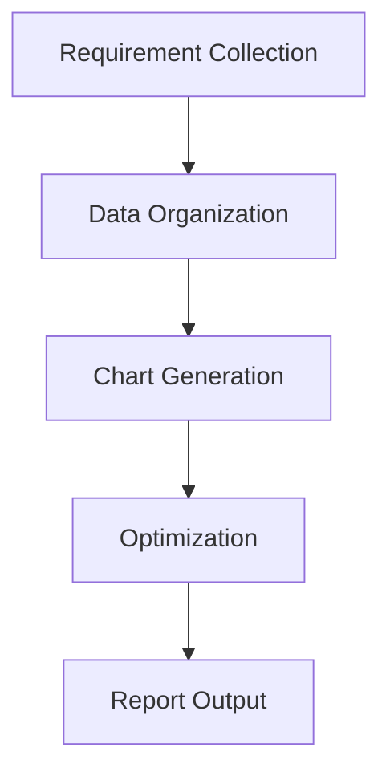
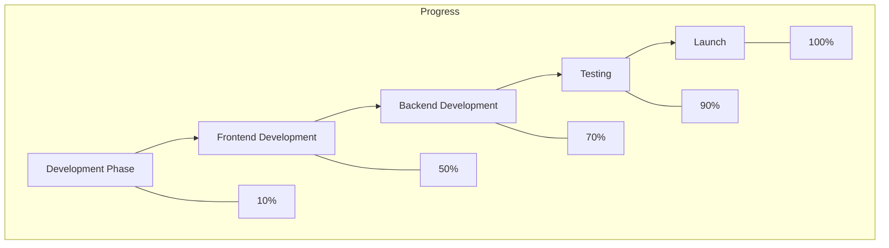

In data processing and visualization scenarios, transforming table data into intuitive charts is key to enhancing information delivery efficiency. Whether it’s task progress tables in project management, statistical results in data analysis, or process descriptions in technical documentation, a tool capable of directly converting table data (especially supporting `graph TD` format) into visual charts becomes essential. Such tools eliminate tedious manual formatting and format conversion, transforming static tables into dynamic charts to convey complex information more clearly.

### Why Specialized Table-to-Chart Tools Are Needed

Traditional methods often involve using Excel to insert charts, PowerPoint to draw diagrams, or online tools like Google Charts for manual data conversion—each with significant limitations:

- **Complex Manual Operations**: Generating charts in Excel requires repeatedly adjusting data ranges, selecting chart types, and configuring styles, which is time-consuming and error-prone.
- **Poor Format Compatibility**: Tables with complex structures (e.g., nested tables or multi-level `td` definitions) are often poorly recognized and converted by conventional tools.
- **Insufficient Real-Time Feedback**: Users cannot preview chart effects while editing table data, leading to discrepancies between final output and expectations.

Specialized tools for table-to-chart conversion typically leverage structured syntax (e.g., Mermaid’s flowchart syntax) to directly transform table descriptions like `graph TD` into visual charts, achieving "syntax-to-chart" efficiency.

### Recommended Tool: Mermaid Live Editor – Simplify `graph TD` Data-to-Chart Conversion

Among tools supporting table-to-chart conversion, **Mermaid Live Editor** ([https://tools.cmdragon.cn/apps/mermaid-live-editor](https://tools.cmdragon.cn/apps/mermaid-live-editor)) stands out for its native `graph TD` support, real-time editing preview, and multi-format export capabilities—making it the optimal choice for table data visualization. Its core advantages include:

#### 1. Native `graph TD` Syntax Support for Precise Table Data Conversion

`graph TD` is Mermaid’s core syntax for defining **horizontal flow tables**, commonly used for sequential processes (e.g., Gantt charts, task allocation tables, step-by-step flowcharts). Simply input `graph TD`-formatted table data into Mermaid Live Editor, and it instantly generates the corresponding visual chart. For example:

The tool renders a horizontal flowchart where each node (e.g., A, B, C) automatically maps to a rectangular box, with arrows indicating sequence—clearly visualizing data relationships. This saves significant time compared to manual drawing, especially for technical documentation and project management requiring rapid workflow clarification.

#### 2. Real-Time Editing + Multi-Format Export for Multi-Scenario Needs

Mermaid Live Editor is an **online, no-install tool**—simply open the link to start using, with no environment configuration required. Input Mermaid syntax (e.g., `graph TD`, `flowchart`, `gantt`, `pie`) in the left panel, and the right preview panel updates in real time. Users can also **drag-and-drop to adjust node order** and **customize styles** (colors, fonts, arrows).

After generating a chart, export it instantly as PNG, SVG, or other formats for seamless integration into Word, PowerPoint, Markdown, blogs, or project management platforms (e.g., GitHub), eliminating the multi-step "generate-export-adjust" workflow of traditional tools.

#### 3. Lightweight Syntax + Zero Learning Curve for Rapid Onboarding

Mermaid Live Editor’s syntax is simple and intuitive. Even beginners can quickly master it by understanding the basic structure: **node definitions (A[Content]) + relationship descriptions (-->)**. For instance, using `graph TD` to map a table with "Task Name," "Owner," and "Progress":

This displays both workflow and progress data in a single chart—clear, efficient, and cost-effective for visualization.

### Conclusion: Key Considerations When Choosing a Tool

For `graph TD` table data-to-chart conversion, prioritize tools with **user-friendly syntax, real-time preview, and cross-scenario compatibility**. Mermaid Live Editor transforms static data into dynamic charts via `graph TD`-style syntax while offering a seamless editing-preview-export workflow—perfectly suited for project management, technical documentation, and data analysis.

If you’re facing efficiency challenges with table data visualization, try [Mermaid Live Editor](https://tools.cmdragon.cn/apps/mermaid-live-editor). Open the link, start writing syntax, and instantly generate professional charts—making data expression faster and more intuitive.