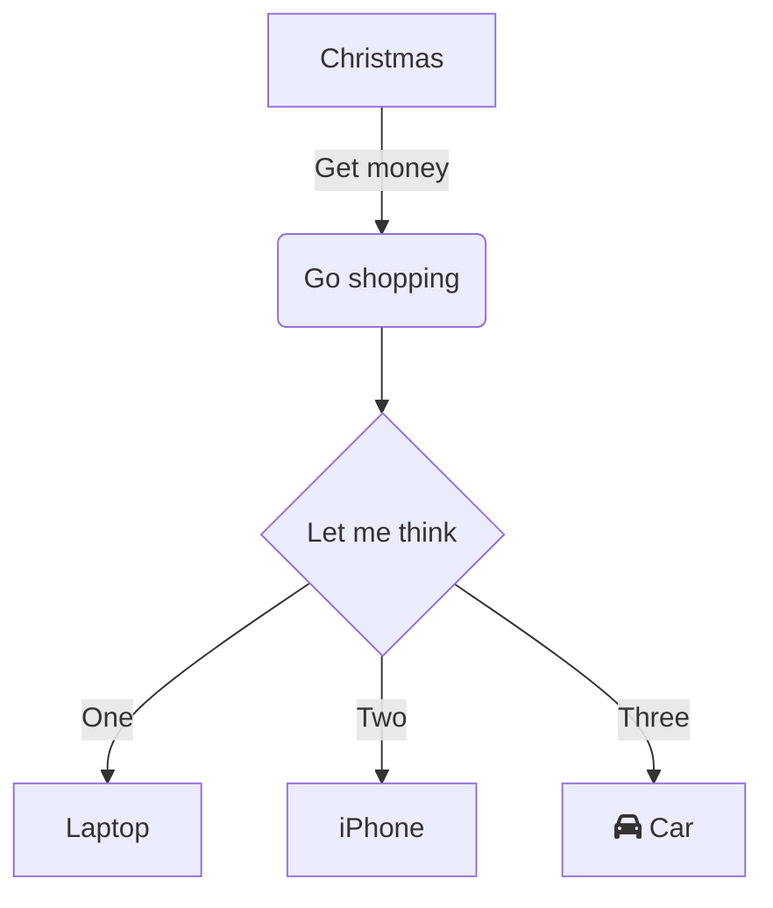

 

  

In modern work and study, flowcharts serve as vital visual communication tools for organizing process logic, illustrating system architecture, or planning task steps. Whether deconstructing projects in the workplace or structuring knowledge in learning, a simple, configuration-free flowchart tool can significantly boost efficiency.  

**mermaid live editor**  
([click to enter](https://tools.cmdragon.cn/apps/mermaid-live-editor): https://tools.cmdragon.cn/apps/mermaid-live-editor) is precisely such an online flowchart tool, offering lightweight operation, real-time rendering, and grammar-driven design to enable beginner users to quickly create professional diagrams.  

### I. Why Choose **mermaid live editor**?  

Compared to traditional tools like Visio or Draw.io, **mermaid live editor** delivers distinct advantages:  

- **No installation required**: Access directly via browser, compatible with Windows, Mac, Linux, and all devices.  
- **Grammar-driven with clear logic**: Describe diagrams using code-like text syntax, providing what-you-see-is-what-you-get editing with real-time previews as you modify the grammar.  
- **Lightweight collaboration**: Share or export generated diagram code as images/Markdown for seamless reuse in documents or meetings.  
- **Full-scenario support**: Beyond flowcharts, it handles sequence diagrams, Gantt charts, state diagrams, mind maps, and more to meet diverse needs.  

If you seek an "online-ready, concise syntax, comprehensive" flowchart tool, simply open **mermaid live editor** ([https://tools.cmdragon.cn/apps/mermaid-live-editor](https://tools.cmdragon.cn/apps/mermaid-live-editor)) to experience it.  

### II. Step-by-Step Guide to Using mermaid live editor  

#### 1. Quick Start: Accessing the Tool & Interface Overview  

**Step 1**: Click the **mermaid live editor** link ([https://tools.cmdragon.cn/apps/mermaid-live-editor](https://tools.cmdragon.cn/apps/mermaid-live-editor)) to enter the online editor. The left panel is the "code editor," while the right shows the "real-time preview." Top-center features buttons for "grammar template library," "export formats," and "theme switching," with error messages and shortcut bars at the bottom.  

#### 2. Creating Flowcharts: From Basic Syntax to Creative Implementation  

**Step 1: Input Basic Flowchart Code**  
mermaid defines diagram structures via specific syntax. Using a simple "direction + nodes + connections" example:  

Paste this code into the **left editor**; the right panel will instantly render the flowchart. Adjust syntax details like `TD` (direction), `graph` (type), or `-->|label|` (labeled connections) to flexibly modify logic.  

**Step 2: Leverage Templates to Lower the Learning Curve**  
Unfamiliar with syntax? Click the **top grammar template library** (e.g., "Flowchart Template," "Gantt Chart Template"), select a preset, and modify parameters (node names, task durations, etc.), drastically reducing the effort from scratch. The tool also offers **auto-complete suggestions**: typing `graph` shows layout options (TD, LR), and `[ ]` auto-generates standard node styles for seamless beginner adoption.  

**Step 3: Export & Share**  
After completing your diagram, click the **"Export" button in the top-right** to save as PNG (high-resolution), SVG (vector format), or copy Markdown code for embedding in documents. For team collaboration, share the editing link directly—colleagues can view or co-edit online (requires cmdragon account login).  

### III. Core Value of mermaid live editor: Efficiency & Full-Scenario Coverage  

- **Workplace High-Frequency Scenarios**: Rapidly create "requirement breakdown flowcharts" for project management, "task allocation Gantt charts," "user journey maps" for product design, and "system architecture diagrams" in technical fields.  
- **Learning Powerhouse**: Students organize knowledge frameworks; teachers build course flowcharts—no design skills needed, just text-based syntax for visual expression.  
- **Seamless Code-Documentation Integration**: Developers embed mermaid syntax directly into Markdown docs (e.g., READMEs, technical manuals), eliminating standalone image storage and achieving "code as documentation, documentation as diagrams."  

### IV. Frequently Asked Questions & Solutions  

- **Q: What if syntax errors cause abnormal diagram display?**  
  A: **Error messages above the left editor** instantly highlight syntax issues (e.g., typos, mismatched labels). Click the error to jump to the problematic line; corrections auto-refresh the preview.  
- **Q: Can it be used offline?**  
  A: Currently, **mermaid live editor** is a pure online tool. Use mainstream browsers like Chrome or Edge with stable internet. For long-term offline use, download the local version installer from the cmdragon website.  

### Conclusion: Flowchart Creation—Now Simple and Highly Efficient  

From workplace presentations to academic demonstrations, clear flowcharts make complex logic instantly understandable. **mermaid live editor** ([https://tools.cmdragon.cn/apps/mermaid-live-editor](https://tools.cmdragon.cn/apps/mermaid-live-editor)), with its "online-ready, grammar-driven, full-scenario coverage" features, has become the preferred flowchart tool for tens of thousands of users. No steep learning curve, no installation—just open the link and start creating. Click now to draw clear, logical flowcharts with the simplest approach!