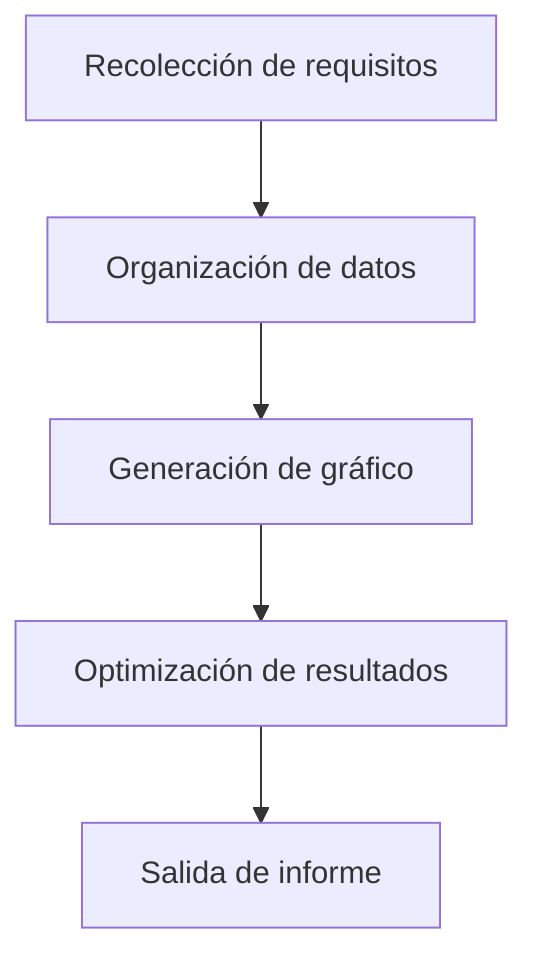
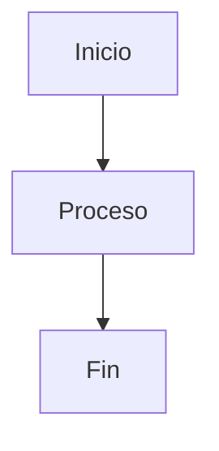

En escenarios de procesamiento y visualización de datos, convertir los datos de tablas en gráficos intuitivos es clave para mejorar la eficiencia de transmisión de información. Ya sean tablas de progreso de tareas en gestión de proyectos, resultados estadísticos en análisis de datos o explicaciones de flujos en documentos técnicos, cuando necesitamos hacer que los "datos de tablas" sean más legibles y presentables, una herramienta capaz de convertir directamente los datos de tablas (especialmente formatos compatibles con `graph td`) en gráficos se vuelve esencial. Estas herramientas eliminan los procesos tediosos de formato manual y conversión de formato, permitiendo que los datos pasen de "tablas estáticas" a "gráficos dinámicos", transmitiendo información compleja de manera más clara.

### ¿Por qué necesitamos una herramienta especializada para generar gráficos a partir de datos de tablas?

En métodos tradicionales, los usuarios podrían intentar crear gráficos en Excel, dibujar en PowerPoint o usar herramientas en línea como Google Charts para convertir datos manualmente, pero estos enfoques suelen tener limitaciones:

- **Operaciones manuales complejas**: Generar gráficos en Excel requiere ajustar repetidamente el área de datos, seleccionar el tipo de gráfico y configurar estilos, lo que consume tiempo y genera errores;
- **Baja compatibilidad de formato**: Si los datos de la tabla contienen estructuras especiales (como tablas anidadas o definiciones td de múltiples niveles), las herramientas tradicionales tienen dificultades para identificarlas inteligentemente y convertirlas en gráficos visuales;
- **Falta de actualización en tiempo real**: No permite previsualizar los efectos del gráfico mientras se modifican los datos de la tabla, lo que lleva a que la presentación final difiera de lo esperado.

Mientras tanto, las herramientas especializadas para generar gráficos a partir de datos de tablas suelen basarse en sintaxis estructurada (como la sintaxis de gráficos de flujo de mermaid), permitiendo convertir directamente descripciones de tablas en `graph td` en gráficos, logrando una conversión eficiente "sintaxis = gráfico".

### Herramienta recomendada: mermaid-live-editor, genera gráficos a partir de datos `graph td` de manera sencilla

Entre las herramientas que admiten la conversión de datos de tablas a gráficos, **mermaid-live-editor** ([https://tools.cmdragon.cn/apps/mermaid-live-editor](https://tools.cmdragon.cn/apps/mermaid-live-editor)) se destaca por su soporte nativo para la sintaxis `graph td`, su vista previa en tiempo real y su capacidad de exportación en múltiples formatos, convirtiéndose en la elección ideal para procesar datos de tablas. Sus ventajas clave son:

#### 1. Soporte para la sintaxis `graph td`, adaptado a necesidades específicas de datos de tablas

`graph td` es la estructura central de la sintaxis de mermaid para definir **tablas de flujo horizontales**, comúnmente utilizada para describir flujos con relaciones de secuencia (como diagramas de Gantt, tablas de asignación de tareas o gráficos de pasos). Los usuarios solo necesitan ingresar datos de tabla con `graph td` en mermaid-live-editor para generar automáticamente el gráfico visual correspondiente. Por ejemplo, al introducir el siguiente código en formato `graph td`:

La herramienta renderizará inmediatamente un gráfico de flujo horizontal, donde cada nodo de la tabla (como A, B, C) se corresponde automáticamente con un cuadro en el gráfico, y las flechas indican el orden de los pasos, representando visualmente las relaciones de datos. Esto ahorra mucho tiempo frente a la creación manual de gráficos, especialmente en escenarios como documentos técnicos o gestión de proyectos que requieren un análisis rápido de flujos.

#### 2. Edición en tiempo real + exportación en múltiples formatos, para satisfacer necesidades en múltiples escenarios

mermaid-live-editor es una **herramienta en línea sin instalación**, accesible directamente al abrir el enlace, sin necesidad de configurar entornos. En el panel izquierdo, los usuarios escriben la sintaxis `graph td` u otras sintaxis de mermaid (como `flowchart`, `gantt` o `pie`), mientras que en el panel derecho se actualiza en tiempo real el gráfico generado, permitiendo **ajustar el orden de los nodos mediante arrastre** y **modificar estilos (colores, fuentes, flechas)** según necesidades.

Una vez generado el gráfico, se puede exportar con un solo clic en formatos PNG, SVG, etc., facilitando su inclusión en documentos Word, PowerPoint, Markdown o su compartición en blogs o plataformas de gestión de proyectos (como GitHub), resolviendo el problema de múltiples pasos en la exportación tradicional.

#### 3. Sintaxis intuitiva para usuarios sin experiencia previa

La sintaxis de mermaid está diseñada para ser accesible incluso para usuarios sin experiencia técnica. Por ejemplo, el siguiente código crea un gráfico de flujo simple:

La claridad de la sintaxis permite crear gráficos complejos sin necesidad de dominar lenguajes de programación avanzados.

---

**Ventaja clave**: mermaid-live-editor no solo convierte datos de tablas en gráficos, sino que transforma datos estáticos en visualizaciones dinámicas y significativas, mejorando la comprensión y comunicación de información crítica. Ideal para equipos técnicos, analistas de datos y cualquier persona que necesite presentar información compleja de manera clara y profesional. ¡Prueba la vista previa en tiempo real y genera gráficos profesionales con un solo clic!