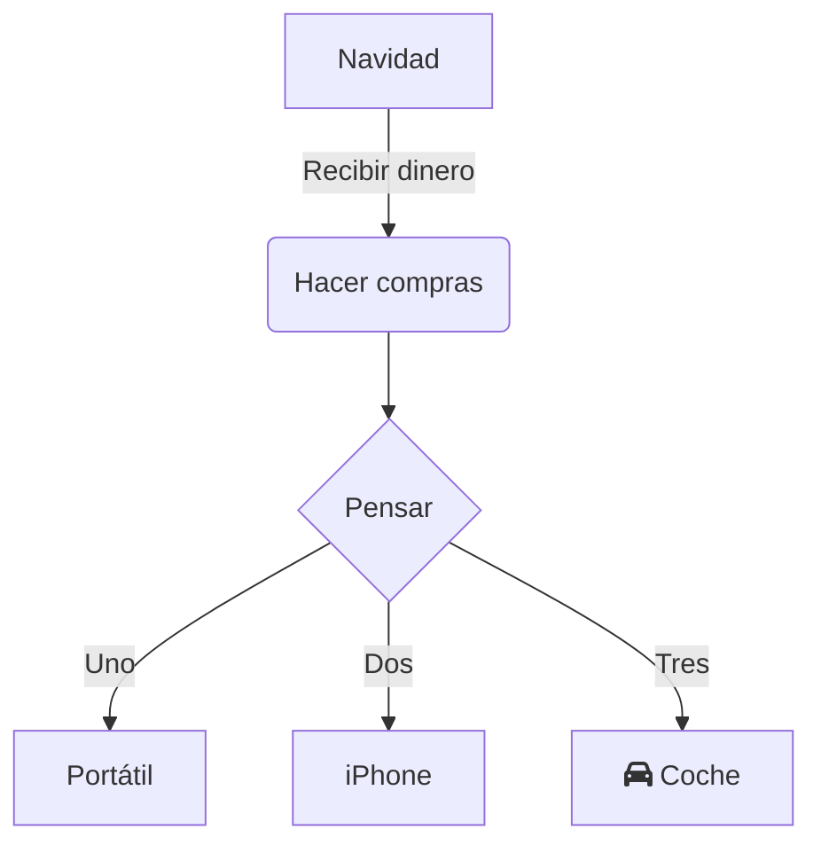

 

  

En el trabajo y estudio modernos, los diagramas de flujo son una herramienta esencial para la comunicación visual, utilizados para organizar lógica de procesos, mostrar arquitecturas de sistemas o planificar pasos de tareas. Tanto en la descomposición de proyectos profesionales como en la estructuración de conocimientos académicos, una herramienta de diagramas sencilla y sin configuraciones complejas puede mejorar significativamente la eficiencia.  

**mermaid live editor**  
([haga clic para acceder](https://tools.cmdragon.cn/apps/mermaid-live-editor): https://tools.cmdragon.cn/apps/mermaid-live-editor) es precisamente esta herramienta en línea para dibujar diagramas de flujo, destacando por su ligereza, actualización en tiempo real y enfoque basado en sintaxis. Permite a usuarios sin experiencia crear diagramas profesionales de forma rápida.  

### I. ¿Por qué elegir **mermaid live editor**?  

A diferencia de software tradicional de diagramas (como Visio o Draw.io), **mermaid live editor** ofrece ventajas significativas:  

- **Sin instalación**: Acceso directo desde el navegador, compatible con sistemas y dispositivos Windows, Mac, Linux, etc.  
- **Basado en sintaxis, lógica clara**: Describe los diagramas mediante sintaxis textual similar a código, con vista previa WYSIWYG. Modifica la sintaxis y verás los cambios en tiempo real.  
- **Colaboración ligera**: El código generado se comparte o exporta directamente como imagen/Markdown, facilitando su uso en documentos o reuniones.  
- **Soporte integral**: No solo dibuja diagramas de flujo, sino también diagramas de secuencia, diagramas de Gantt, diagramas de estado y mapas mentales, cubriendo múltiples escenarios.  

Si buscas una herramienta de diagramas «en línea, sintaxis simple y funcionalidad completa», prueba **mermaid live editor**  
([https://tools.cmdragon.cn/apps/mermaid-live-editor](https://tools.cmdragon.cn/apps/mermaid-live-editor)).  

### II. Guía completa para usar **mermaid live editor**  

#### 1. Inicio rápido: Acceso a la herramienta y comprensión de la interfaz  

**Paso 1**: Haz clic en el enlace **mermaid live editor**  
([https://tools.cmdragon.cn/apps/mermaid-live-editor](https://tools.cmdragon.cn/apps/mermaid-live-editor)) para acceder a la interfaz de edición. El panel izquierdo es el **área de edición de código**, el derecho muestra la **vista previa en tiempo real**. En la parte superior central hay botones para la **biblioteca de plantillas de sintaxis**, **formato de exportación** y **cambio de tema**. En la parte inferior se muestran los **mensajes de error** y la **barra de operaciones rápidas**.  

#### 2. Dibujar diagramas de flujo: Desde sintaxis básica hasta implementación creativa  

**Paso 1: Introduce el código básico del diagrama de flujo**  
mermaid define la estructura mediante sintaxis específica. Como ejemplo sencillo (dirección + nodos + conexiones):  

Pega este código en el **área de edición izquierda**; el panel derecho generará automáticamente el diagrama. Ajusta detalles como `TD` (dirección), `graph` (tipo) o `-->|etiqueta|` (conexión con texto) para modificar lógicamente el gráfico.  

**Paso 2: Usa plantillas y sugerencias para reducir la curva de aprendizaje**  
Si no conoces la sintaxis, haz clic en la **biblioteca de plantillas de sintaxis** (ej.: «Plantilla de flujo», «Plantilla de Gantt») para seleccionar una preconfigurada. Modifica parámetros como nombres de nodos o duración de tareas, reduciendo el esfuerzo inicial. La herramienta también ofrece **completado automático**: al escribir `graph`, sugiere diseños disponibles (TD, LR, etc.); al usar `[ ]`, genera automáticamente estilos de nodo estándar.  

**Paso 3: Exporta y comparte**  
Al finalizar, haz clic en el botón **«Exportar»** (esquina superior derecha) para guardar como PNG (alta resolución), SVG (vectorial) o código Markdown.  

### III. Beneficios clave  
- **Eficiencia**: Edita y visualiza cambios en segundos.  
- **Accesibilidad**: Funciona en cualquier navegador moderno.  
- **Profesionalismo**: Exporta a formatos listos para presentaciones.  

**mermaid live editor** es la herramienta indispensable para profesionales que buscan claridad en procesos y estudiantes que necesitan organizar conocimientos de forma visual. ¡Prueba su potencia hoy mismo!