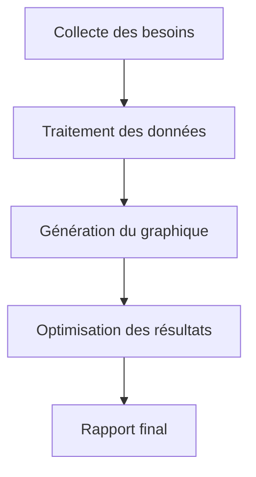
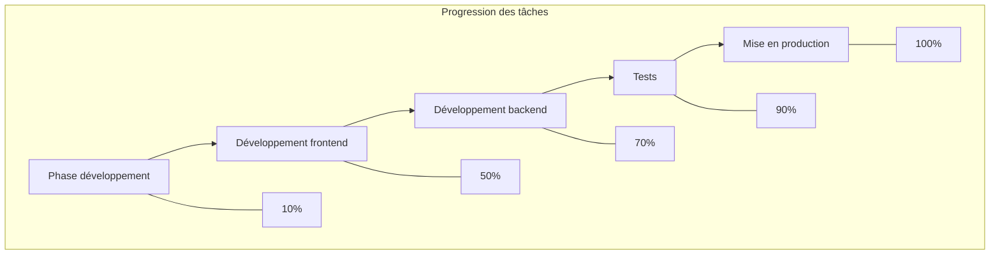

 

  

Dans les scénarios de traitement et de visualisation de données, transformer les tableaux en graphiques intuitifs est une étape clé pour améliorer l'efficacité de la communication des informations. Que ce soit pour les tableaux de progression des tâches en gestion de projet, les résultats statistiques en analyse de données ou les schémas de processus dans les documents techniques, un outil capable de convertir directement les données de tableaux (notamment en format `graph td`) en graphiques devient essentiel. Ces outils éliminent les étapes fastidieuses de mise en forme manuelle et de conversion de formats, permettant aux données de passer d'un tableau statique à un graphique dynamique, communiquant ainsi plus clairement des informations complexes.  

### Pourquoi un outil dédié à la génération de graphiques à partir de tableaux ?  

Dans les méthodes traditionnelles, les utilisateurs peuvent essayer d'utiliser Excel pour insérer des graphiques, PowerPoint pour dessiner des schémas, ou des outils en ligne comme Google Charts pour convertir manuellement les données. Cependant, ces approches présentent souvent des limites :  

- **Complexité opérationnelle** : Dans Excel, générer un graphique nécessite de régler plusieurs fois la zone de données, de sélectionner le type de graphique et de configurer les styles, ce qui est chronophage et sujet aux erreurs ;  
- **Faible compatibilité des formats** : Si le tableau contient des structures complexes (tableaux imbriqués, définitions de `td` hiérarchisées), les outils traditionnels peinent à les reconnaître intelligemment et à les convertir en graphiques ;  
- **Manque de réactivité** : Impossible de prévisualiser l'effet du graphique en temps réel lors de la modification des données, entraînant souvent un résultat final non conforme à l'attente.  

Un outil spécialisé dans la génération de graphiques à partir de tableaux s'appuie souvent sur une syntaxe structurée (comme celle de mermaid), transformant directement les données de tableaux décrites via `graph td` en graphiques, réalisant ainsi une conversion « syntaxe = graphique » efficace.  

### Outil recommandé : Mermaid Live Editor, pour générer des graphiques à partir de `graph td`  

Parmi les outils prenant en charge la conversion de tableaux en graphiques, **Mermaid Live Editor** ([https://tools.cmdragon.cn/apps/mermaid-live-editor](https://tools.cmdragon.cn/apps/mermaid-live-editor)) se distingue par sa prise en charge native de la syntaxe `graph td`, sa prévisualisation en temps réel et ses fonctionnalités d'export multi-formats, en faisant un choix optimal pour transformer les données de tableaux en graphiques. Ses avantages clés sont :  

#### 1. Prise en charge de la syntaxe `graph td`, adaptée aux données de tableaux  

`graph td` est la syntaxe centrale de mermaid pour définir des **tableaux de flux horizontaux**, couramment utilisée pour décrire des processus avec une relation d'ordre (comme des diagrammes de Gantt, des tableaux d'affectation de tâches ou des schémas de processus). Il suffit d'entrer un tableau au format `graph td` dans Mermaid Live Editor pour générer immédiatement le graphique correspondant. Par exemple, avec ce code `graph td` :  

L'outil rend instantanément le diagramme de flux horizontal : chaque nœud (A, B, C, etc.) est automatiquement associé à un rectangle, et les flèches indiquent l'ordre des étapes, illustrant clairement les relations entre les données. Cela économise énormément de temps par rapport à la création manuelle de diagrammes, particulièrement utile pour les documents techniques ou la gestion de projets nécessitant une structuration rapide des processus.  

#### 2. Édition en temps réel + export multi-formats, pour répondre à tous les besoins  

Mermaid Live Editor est une **plateforme en ligne, sans installation**, accessible dès l'ouverture du lien. Dans la zone de gauche, l'utilisateur écrit la syntaxe `graph td` ou d'autres syntaxes mermaid (comme `flowchart`, `gantt`, `pie`), tandis que la zone de prévisualisation à droite met à jour le graphique instantanément. Il permet également de **réglage par glisser-déposer des nœuds**, **modifier les styles** (couleurs, polices, flèches) selon les besoins.  

Une fois le graphique généré, il peut être exporté en un clic au format PNG ou SVG, facilitant son intégration dans des documents Word, PowerPoint, Markdown, ou son partage sur des plateformes de gestion de projets (comme GitHub), résolvant ainsi le problème des outils traditionnels exigeant des étapes multiples (génération → export → ajustement).  

#### 3. Syntaxe légère + seuil d'apprentissage bas, pour une prise en main rapide  

Les règles de syntaxe de Mermaid Live Editor sont simples et intuitives. Même un utilisateur débutant peut rapidement maîtriser l'outil en comprenant la structure de base : « définition des nœuds (A[contenu]) + description des relations (--> ) + mise en forme (tableau td) ». Par exemple, pour décrire un tableau contenant « nom de tâche », « responsable » et « progression » avec `graph td` :  

  

### Conclusion  
Vous avez besoin d'une solution efficace pour transformer vos données de tableaux en visualisations claires et interactives ? Mermaid Live Editor offre une syntaxe intuitive, une prévisualisation en temps réel et un export flexible, permettant de créer des diagrammes professionnels sans effort. Découvrez-le dès maintenant pour optimiser votre communication des données.  

*Générez des diagrammes de flux, des tableaux de progression et des visualisations complexes en quelques clics.*