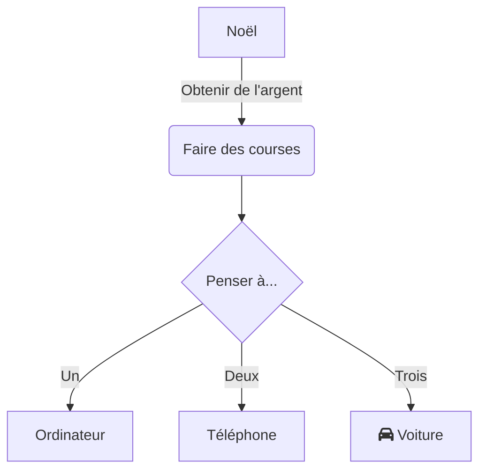

  

Dans le travail et les études modernes, les diagrammes de flux constituent un outil essentiel pour visualiser les communications, structurer les logiques de processus, représenter les architectures système ou planifier les étapes des tâches. Que ce soit pour décomposer un projet professionnel ou organiser des connaissances en apprentissage, un outil de diagrammes simple, intuitif et sans configuration complexe peut considérablement améliorer l'efficacité.  

**mermaid live editor**  
([cliquez ici](https://tools.cmdragon.cn/apps/mermaid-live-editor) : https://tools.cmdragon.cn/apps/mermaid-live-editor) est justement cet outil en ligne de création de diagrammes de flux, caractérisé par sa légèreté, sa réactivité et son approche syntaxique. Il permet même aux débutants de créer rapidement des diagrammes professionnels.  

### I. Pourquoi choisir **mermaid live editor** ?  

Contrairement aux logiciels traditionnels de diagrammes (comme Visio ou Draw.io), **mermaid live editor** présente des avantages significatifs :  

- **Aucune installation nécessaire** : Utilisable directement via navigateur, compatible avec Windows, Mac, Linux et tous les appareils.  
- **Basé sur la syntaxe, logique claire** : Décrit les diagrammes avec une syntaxe textuelle similaire à du code, avec prévisualisation instantanée. Modifiez la syntaxe et visualisez les résultats en temps réel.  
- **Collaboration légère** : Le code généré peut être partagé ou exporté en image/Markdown, pratique pour réutiliser dans les documents ou réunions.  
- **Prise en charge de tous les scénarios** : Non seulement pour les diagrammes de flux, mais aussi pour les diagrammes de séquence, de Gantt, d'état et de carte heuristique, répondant à divers besoins.  

Si vous recherchez un outil de diagrammes « en ligne immédiatement utilisable, syntaxe simple et fonctionnalités complètes », ouvrez directement **mermaid live editor**  
([https://tools.cmdragon.cn/apps/mermaid-live-editor](https://tools.cmdragon.cn/apps/mermaid-live-editor)) pour l'essayer.  

### II. Guide complet d'utilisation de mermaid live editor  

#### 1. Démarrage rapide : Ouvrir l'outil et comprendre l'interface  

**Étape 1** : Cliquez sur le lien **mermaid live editor**  
([https://tools.cmdragon.cn/apps/mermaid-live-editor](https://tools.cmdragon.cn/apps/mermaid-live-editor)), accédez à l'interface d'édition en ligne. À gauche se trouve la « zone de code », à droite la « zone de prévisualisation en temps réel ». En haut, des boutons pour « bibliothèque de modèles de syntaxe », « formats d'exportation » et « changement de thème ». En bas, « messages d'erreur » et « barre d'actions rapides ».  

#### 2. Créer un diagramme de flux : De la syntaxe de base à la réalisation créative  

**Étape 1 : Saisir le code de base**  
mermaid définit la structure des graphiques via une syntaxe spécifique. Prenons l'exemple le plus simple : « direction + nœud + lien » :  

Collez ce code dans la **zone de code à gauche** : la zone de prévisualisation à droite générera immédiatement le diagramme. Ajustez les détails de syntaxe (comme `TD` pour la direction, `graph` pour le type, `-->|étiquette|` pour les liens avec texte) pour modifier logiquement le graphique.  

**Étape 2 : Utiliser les modèles et aides syntaxiques pour réduire la courbe d'apprentissage**  
Si vous ne maîtrisez pas la syntaxe, utilisez les **modèles de syntaxe** pour démarrer rapidement. L'éditeur propose également des suggestions en temps réel.  

**Étape 3 : Exporter**  
Cliquez sur « Exporter » pour sauvegarder en image (PNG/JPEG) ou en Markdown, prêt à intégrer dans vos documents.  

### III. Cas d'usage professionnels et éducatifs  

- **Gestion de projets** : Visualisez les étapes du processus avec des diagrammes de flux clairs.  
- **Documentation technique** : Intégrez directement les diagrammes générés dans la documentation de code via Markdown.  
- **Apprentissage** : Organisez des idées complexes avec des cartes heuristiques.  

**mermaid live editor** transforme la création de diagrammes en une expérience fluide, accessible à tous, sans surcharge technique. Commencez dès maintenant avec [l'éditeur en ligne](https://tools.cmdragon.cn/apps/mermaid-live-Editor).