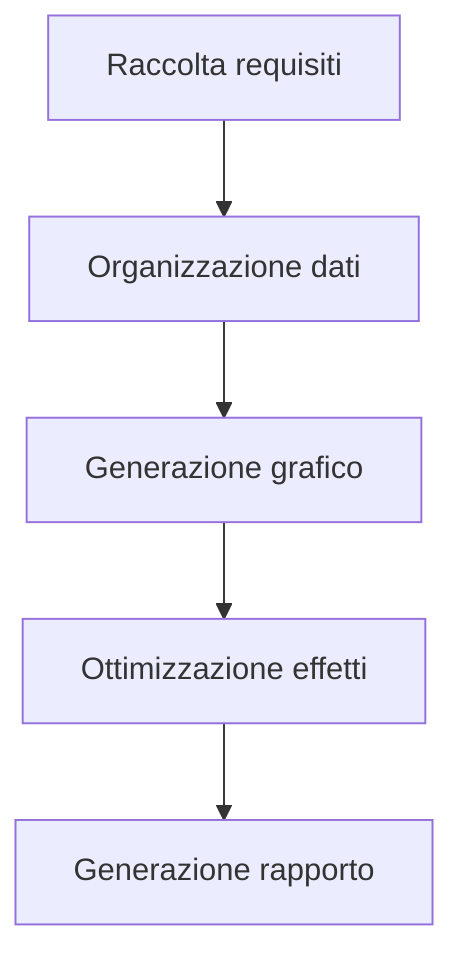
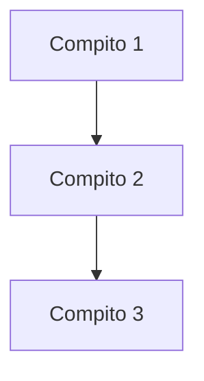

Nel contesto del trattamento e della visualizzazione dei dati, trasformare i dati tabulari in grafici intuitivi rappresenta un passo chiave per migliorare l'efficienza nella trasmissione delle informazioni. Che si tratti di una tabella di avanzamento dei compiti nella gestione progetti, dei risultati statistici nell'analisi dati o delle spiegazioni di flusso nella documentazione tecnica, quando è necessario rendere i "dati tabulari" più leggibili e presentabili, uno strumento in grado di trasformare direttamente i dati tabulari (soprattutto quelli supportanti il formato `graph TD`) in grafici diventa fondamentale. Questi strumenti eliminano l'elaborazione manuale complessa e la conversione dei formati, trasformando i dati da "tabella statica" in "grafico dinamico" per comunicare informazioni complesse in modo chiaro.

### Perché è necessario uno strumento specifico per generare grafici da dati tabulari?

Nel metodo tradizionale, gli utenti potrebbero provare a inserire grafici in Excel, disegnare figure in PowerPoint o convertire dati manualmente con strumenti online come Google Charts, ma queste soluzioni presentano spesso limitazioni:

- **Operazioni manuali complesse**: Generare grafici in Excel richiede di modificare ripetutamente l'area dati, selezionare il tipo di grafico e impostare lo stile, richiedendo tempo e causando errori;
- **Bassa compatibilità dei formati**: Se i dati tabulari includono strutture speciali (come tabelle annidate o definizioni multi-livello di `td`), gli strumenti tradizionali faticano a riconoscerli automaticamente per la visualizzazione;
- **Scarsa reattività**: Non è possibile visualizzare l'effetto del grafico mentre si modifica la tabella, portando a risultati finali non allineati alle aspettative.

Gli strumenti dedicati alla generazione di grafici da dati tabulari, invece, si basano spesso su sintassi strutturata (come la sintassi per diagrammi di mermaid), trasformando direttamente descrizioni tabulari come `graph TD` in grafici, realizzando una conversione efficiente "sintassi = grafico".

### Strumento consigliato: Mermaid Live Editor, per generare grafici da dati `graph TD` in modo semplice

Tra gli strumenti che supportano la conversione dati tabulari in grafici, **Mermaid Live Editor** ([https://tools.cmdragon.cn/apps/mermaid-live-editor](https://tools.cmdragon.cn/apps/mermaid-live-editor)) si distingue per il supporto nativo della sintassi `graph TD`, l'anteprima in tempo reale e la funzionalità di esportazione multi-formato, diventando la scelta ideale per trasformare i dati tabulari in grafici. I suoi punti di forza principali sono:

#### 1. Supporto alla sintassi `graph TD`, allineato alle esigenze dei dati tabulari

`graph TD` è la sintassi principale di mermaid per definire **tabelle di flusso orizzontali**, comunemente utilizzata per descrivere flussi con relazioni sequenziali (come diagrammi di Gantt, tabelle di assegnazione compiti o diagrammi di passaggi). Basta inserire dati tabulari contenenti `graph TD` in Mermaid Live Editor per generare immediatamente il grafico corrispondente. Ad esempio, inserendo il seguente codice in formato `graph TD`:

Lo strumento renderizza immediatamente un diagramma di flusso orizzontale: ogni nodo nella tabella (ad esempio A, B, C) viene automaticamente convertito in un riquadro nel grafico, con frecce che indicano l'ordine dei passaggi, presentando chiaramente le relazioni tra i dati. Questo risparmia molto tempo rispetto al disegno manuale, specialmente per scenari come documentazione tecnica o gestione progetti che richiedono una rapida analisi dei flussi.

#### 2. Modifica in tempo reale + esportazione multi-formato, adatto a diversi scenari

Mermaid Live Editor è uno **strumento online senza installazione**, accessibile direttamente tramite link senza configurazioni. Nella parte sinistra, l'utente scrive la sintassi `graph TD` o altre sintassi mermaid (come `flowchart`, `gantt`, `pie`), mentre nella parte destra l'anteprima del grafico si aggiorna in tempo reale. Supporta inoltre **modifiche in tempo reale tramite trascinamento** per ordinare i nodi e **personalizzare lo stile** (colori, font, frecce).

Dopo aver generato il grafico, è possibile esportarlo istantaneamente in PNG, SVG e altri formati, facilitando l'inserimento in documenti Word, PowerPoint, Markdown o la condivisione su blog o piattaforme di gestione progetti (come GitHub), risolvendo il problema delle operazioni multiple "genera-esporta-modifica" tipiche degli strumenti tradizionali.

#### 3. Sintassi leggera + zero barriera d'apprendimento, facile da utilizzare

La sintassi di Mermaid Live Editor è semplice e intuitiva: anche un utente senza esperienza può iniziare rapidamente comprendendo la struttura base "definizione nodo (A[contenuto]) + descrizione relazione (--> + formattazione tabella (td)". Ad esempio, utilizzando `graph TD` per mappare una tabella di dati:

L'utente può visualizzare direttamente il flusso dei compiti e personalizzare il grafico con pochi clic.

### Conclusione
Mermaid Live Editor combina semplicità d'uso, potenza di visualizzazione e flessibilità di esportazione, trasformando il processo di creazione di diagrammi da un'operazione complessa in una routine quotidiana per professionisti in ambito tecnico, progettuale e analitico. La sintassi intuitiva e l'anteprima in tempo reale eliminano la curva di apprendimento tradizionale, consentendo a chiunque di generare grafici professionali in pochi minuti. 💡  
*Esempio pratico: Trasforma una semplice tabella Excel in un diagramma di Gantt in 30 secondi, con un solo clic sull'anteprima.*