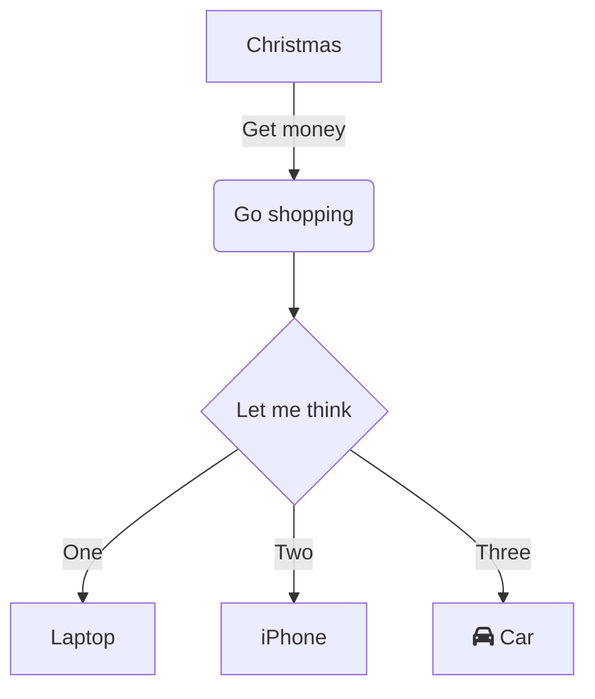

Nel contesto lavorativo e accademico moderno, i diagrammi rappresentano uno strumento fondamentale per la comunicazione visiva, utilizzati per organizzare logiche di processo, illustrare architetture sistemiche o pianificare passaggi operativi. Che si tratti della scomposizione di progetti in ambito professionale o della strutturazione delle conoscenze in ambito didattico, uno strumento per diagrammi semplice, intuitivo e privo di configurazioni complesse può migliorare significativamente l'efficienza.  
**Mermaid Live Editor**  
([clicca per accedere](https://tools.cmdragon.cn/apps/mermaid-live-editor): https://tools.cmdragon.cn/apps/mermaid-live-editor) è proprio questo tipo di strumento online per la creazione di diagrammi, caratterizzato da leggerezza, immediatezza e basato su sintassi testuale, permettendo a chiunque di creare diagrammi professionali anche senza esperienza pregressa.

### 1. Perché scegliere **Mermaid Live Editor**?

Rispetto a strumenti tradizionali per diagrammi (come Visio o Draw.io), **Mermaid Live Editor** offre vantaggi significativi:

- **Nessuna installazione necessaria**: accessibile direttamente tramite browser, compatibile con Windows, Mac, Linux e tutti i dispositivi.
- **Basato su sintassi, logica chiara**: descrive i diagrammi con una sintassi testuale simile a codice, con anteprima in tempo reale. Modificando il testo, l'anteprima si aggiorna immediatamente.
- **Collaborazione leggera**: il codice generato può essere condiviso direttamente o esportato in immagini/Markdown, per essere riutilizzato facilmente in documenti o riunioni.
- **Copertura completa degli scenari**: oltre ai diagrammi di flusso, supporta sequenze, Gantt, stati e mappe mentali, soddisfacendo ogni esigenza.

Se cerchi uno strumento per diagrammi "online immediato, sintassi semplice e funzionalità complete", prova subito **Mermaid Live Editor**  
([https://tools.cmdragon.cn/apps/mermaid-live-editor](https://tools.cmdragon.cn/apps/mermaid-live-editor)).

### 2. Guida completa all'uso di Mermaid Live Editor

#### 1. Inizio rapido: apertura dello strumento e conoscenza dell'interfaccia

**Passo 1**: Clicca sul link **Mermaid Live Editor**  
([https://tools.cmdragon.cn/apps/mermaid-live-editor](https://tools.cmdragon.cn/apps/mermaid-live-editor)), per accedere all'interfaccia di editing. A sinistra c'è l'**area di editing del codice**, a destra l'**anteprima in tempo reale**. In alto al centro trovi i pulsanti per la **libreria dei modelli sintattici**, **esportazione** e **cambio tema**. In basso sono presenti il **prompt di errore** e la **barra di comandi rapidi**.

#### 2. Creazione di un diagramma di flusso: dalla sintassi base alla realizzazione creativa

**Step 1: Inserisci il codice base del diagramma di flusso**  
Mermaid utilizza una sintassi specifica per definire la struttura grafica. Esempio semplice con "direzione + nodi + collegamenti":

Incolla questo codice nell'**area di editing a sinistra**: l'anteprima a destra genererà immediatamente il diagramma. Modifica dettagli come `TD` (direzione), `graph` (tipo), `-->|etichetta|` (collegamento con testo) per personalizzare la logica.

**Step 2: Utilizza modelli e suggerimenti per ridurre la curva di apprendimento**  
Se non conosci la sintassi, clicca sulla **libreria dei modelli sintattici** (ad esempio "Modello flusso" o "Modello Gantt"), seleziona un modello predefinito e modifica i parametri (nomi nodi, durata attività). Lo strumento offre anche **completamento automatico**: dopo aver digitato `graph`, ti suggerisce layout disponibili (TD, LR, ecc.); dopo `[ ]`, genera automaticamente lo stile standard per i nodi. Ideale per principianti.

**Step 3: Esporta e condividi**  
Al termine, clicca sul pulsante **"Esporta"** in alto a destra per scegliere PNG (alta risoluzione), SVG (formato vettoriale) o copiare il codice Markdown da incollare in documenti. Per collaborare in team, condividi semplicemente l'URL della pagina (richiede account cmdragon per modifiche condivise).

### 3. Il valore chiave di Mermaid Live Editor: produttività e copertura scenari

- **Scenari professionali frequenti**: diagrammi di scomposizione requisiti in project management, grafici Gantt per assegnazione attività, diagrammi utente in progettazione prodotto, architetture sistemiche in ambito tecnico.
- **Strumento indispensabile per l'apprendimento**: studenti per strutturare quadri concettuali, insegnanti per creare flussi didattici. Nessuna competenza grafica richiesta: la sintassi testuale rende visuale il contenuto.
- **Integrazione perfetta con codice e documentazione**: gli sviluppatori possono integrare direttamente i diagrammi in documentazione tecnica tramite Markdown.

### 4. Perché è rivoluzionario?
La combinazione di sintassi semplice, anteprima immediata e esportazione multi-formato elimina il ritardo tra idea e rappresentazione visiva. Non è più necessario passare da un tool grafico a uno strumento di testo: Mermaid Live Editor unisce entrambi in un'unica esperienza fluida. Ideale per chi cerca velocità senza compromettere la precisione.  
**Prova ora il tuo primo diagramma in 60 secondi.**  
([https://tools.cmdragon.cn/apps/mermaid-live-editor](https://tools.cmdragon.cn/apps/mermaid-live-editor))