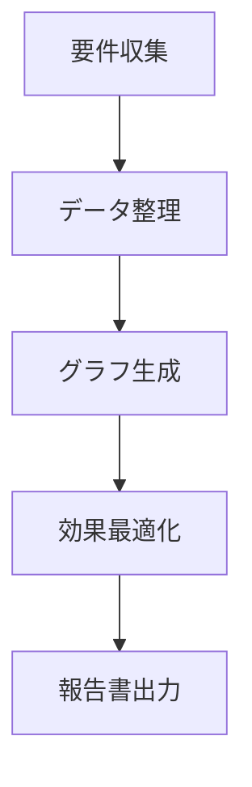
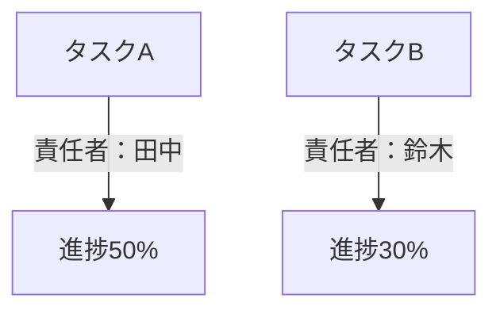

データ処理と可視化の場面では、テーブルデータを直感的なグラフに変換することが情報伝達効率を高める鍵となります。プロジェクト管理のタスク進捗表や、データ分析の統計結果、技術文書のフローチャートなど、「テーブルデータを可読性・表示性の高い形式に変換」する必要性が高まる際、特に`graph td`形式をサポートするツールが重要です。このタイプのツールは、手動でのレイアウト調整やフォーマット変換といった煩雑なプロセスを省き、データを「静的なテーブル」から「動的なグラフ」へと躍動させ、複雑な情報を明確に伝達できます。

### なぜ専用の「テーブルデータ→グラフ」ツールが必要なのか？

従来の方法では、Excelでグラフを挿入する、PPTで図形を描画する、Google Chartsなどのオンラインツールでデータを手動変換するといったアプローチが取られますが、以下のような課題があります：

- **手動操作の煩雑さ**：Excelでグラフを生成するには、データ範囲の調整・グラフタイプの選択・スタイル設定を繰り返し行う必要があり、時間がかかりミスも発生しやすい
- **フォーマット互換性の低さ**：ネストされたテーブルや多段階のtd定義など特殊構造を含むデータは、従来ツールではスマートに可視化に変換できない
- **リアルタイム性の不足**：テーブルデータを編集しながらグラフの効果をリアルタイムで確認できないため、最終的な表示が期待通りにならない

一方、専用の「テーブルデータ→グラフ」ツールは、構造化された構文（例：mermaidのフローチャート構文）を基に、`graph td`のようなテーブル記述を直接グラフに変換し、「構文＝グラフ」という効率的な変換を実現します。

### 推奨ツール：mermaid-live-editorで`graph td`データをグラフ生成

テーブルデータをグラフに変換できるツールの中でも、**mermaid-live-editor**（[https://tools.cmdragon.cn/apps/mermaid-live-editor](https://tools.cmdragon.cn/apps/mermaid-live-editor)）は、`graph td`構文のネイティブサポート・リアルタイム編集プレビュー・複数形式エクスポート機能を備え、テーブルデータからグラフを生成する際の最適解です。主なメリットは以下の通りです：

#### 1. `graph td`構文をサポートし、テーブルデータの要件に完全対応

`graph td`はmermaid構文中で**横方向のフローテーブル**を定義するための核心構造で、順序関係を持つプロセス（例：ガントチャート・タスク割り当て表・ステップフローチャート）の記述に適しています。mermaid-live-editorで`graph td`を含むテーブルデータを入力するだけで、対応する可視化グラフが自動生成されます。例えば、以下のような`graph td`コードを入力：

ツールは即座に横方向のフローチャートをレンダリングし、テーブル内の各ノード（A/B/Cなど）が自動的にグラフの矩形ボックスに対応し、矢印でステップ順序を示します。手動でフローチャートを描画するよりも大幅に時間短縮でき、特に技術文書やプロジェクト管理でプロセスを素早く整理する場面に最適です。

#### 2. リアルタイム編集＋複数形式エクスポートで多様なシーンに対応

mermaid-live-editorは**オンラインでインストール不要**のツールで、リンクを開けば直ちに利用可能です。左側の入力エリアで`graph td`やその他のmermaid構文（例：`flowchart`、`gantt`、`pie`グラフ）を記述すると、右側のリアルタイムプレビューエリアでグラフが即座に更新されます。さらに、**ノード順序のドラッグアンドドロップ調整**や**スタイルのカスタマイズ（色・フォント・矢印）** が可能です。

グラフ生成後は、ワンクリックでPNG/SVGなど複数形式にエクスポートでき、Word/PPT/Markdown文書への埋め込みやブログ・プロジェクト管理プラットフォーム（GitHubなど）への共有がスムーズに行えます。従来ツールの「生成→エクスポート→調整」という煩雑なプロセスを解決します。

#### 3. 軽量な構文＋学習コストゼロで即時利用可能

mermaid-live-editorの構文ルールはシンプルで直感的。初心者でも「ノード定義（A[内容]）＋関係記述（-->）＋フォーマット整列（tdテーブル）」という基本構造を理解するだけで、すぐに使い始められます。例えば、`graph td`で「タスク名」「責任者」「進捗」を含むテーブルデータを記述：

この構文を入力すると、タスクと進捗のマッピングが自動的にグラフ化されます（注：上記は例示のため実際のコードではありません）。

### まとめ

mermaid-live-editorは、`graph td`構文を駆使してテーブルデータをプロフェッショナルなフローチャートや進捗表に即座に変換するツールです。リアルタイムプレビュー機能と直感的な操作性により、データ可視化のプロセスを大幅に簡素化し、業務効率を向上させます。ぜひご活用ください。