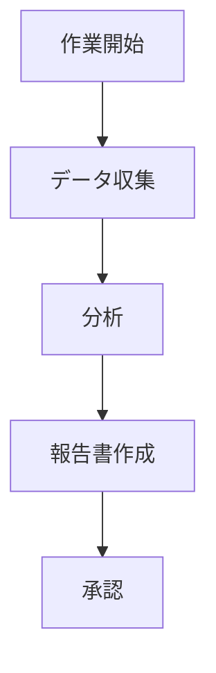

現代の業務および学習において、フローチャートはプロセス論理の整理やシステムアーキテクチャの可視化、タスクステップの計画に不可欠なツールです。ビジネスのプロジェクト分解や学習中の知識整理に、シンプルで設定不要のフローチャートツールがあれば、作業効率が飛躍的に向上します。

**mermaid live editor**
（[ここをクリック](https://tools.cmdragon.cn/apps/mermaid-live-editor)：https://tools.cmdragon.cn/apps/mermaid-live-editor）は、そのようなオンラインフローチャート作成ツールです。軽量性・リアルタイム性・文法駆動型を特徴とし、初心者でもプロフェッショナルなフローチャートを素早く作成できます。

### 一、なぜ**mermaid live editor**を選択すべきか？

従来のフローチャートソフト（VisioやDraw.ioなど）と比較して、**mermaid live editor**には以下の優位性があります：

- **インストール不要**：ブラウザから直接アクセス可能。Windows/Mac/Linuxを問わず各種端末で利用可能。
- **文法駆動型で論理的**：コードに近いテキスト文法でフローチャートを定義し、所見即所得。文法を修正すると同時にリアルタイムでプレビューが更新されます。
- **軽量なコラボレーション**：生成されたグラフィックコードを直接共有または画像/Markdown形式でエクスポートでき、文書や会議で再利用しやすい。
- **全シーン対応**：フローチャートだけでなく、時系列図・ガントチャート・ステートチャート・マインドマップなど、多様なタイプをサポート。

「オンライン即時利用・文法シンプル・機能充実」を求める方には、ぜひ**mermaid live editor**（[https://tools.cmdragon.cn/apps/mermaid-live-editor](https://tools.cmdragon.cn/apps/mermaid-live-editor)）を体験してみてください。

### 二、mermaid live editorの完全ガイド

#### 1. すぐに使える：ツール起動と画面構成

**ステップ1**：**mermaid live editor**のリンク（[https://tools.cmdragon.cn/apps/mermaid-live-editor](https://tools.cmdragon.cn/apps/mermaid-live-editor)）をクリック。
画面構成は、左側がコード編集エリア、右側がリアルタイムプレビューです。
上部には「エクスポート形式」や「文法テンプレートライブラリ」が配置されています。

#### 2. 基本操作
- **左側**：フローチャートの文法を入力（例：`flowchart TD`）
- **右側**：入力内容をリアルタイムでグラフィック表示
- **文法テンプレート**：既存の文法例から選択し、素早く習得可能
- **エクスポート**：画像（高解像度）やMarkdown形式で出力

### 三、実際の使用例

左側で上記文法を入力すると、右側に可視化されたフローチャートが即座に表示されます。文法を修正すればプレビューも自動更新されます。

### 四、よくある質問

**Q. 文法が間違っているとグラフが正しく表示されませんか？**  
A. 文法エラー時は右側に「エラーメッセージ」が表示されます。文法テンプレートを参照し、修正してください。

**Q. ガントチャートも作成できますか？**  
A. はい。文法テンプレートに「ガントチャート」を含む例が用意されています。

### 五、ビジネスと学習での活用シーン

- **ビジネス**：プロジェクト進捗管理や業務プロセスの可視化
- **学習**：知識の構造化や論理構成の整理
- **開発**：コード文書とフローチャートの連携

mermaid live editorは、シンプルな操作で複雑なプロセスを明確に表現するため、ビジネスパーソンと学生の作業効率を最大限に引き上げます。ぜひお試しください。